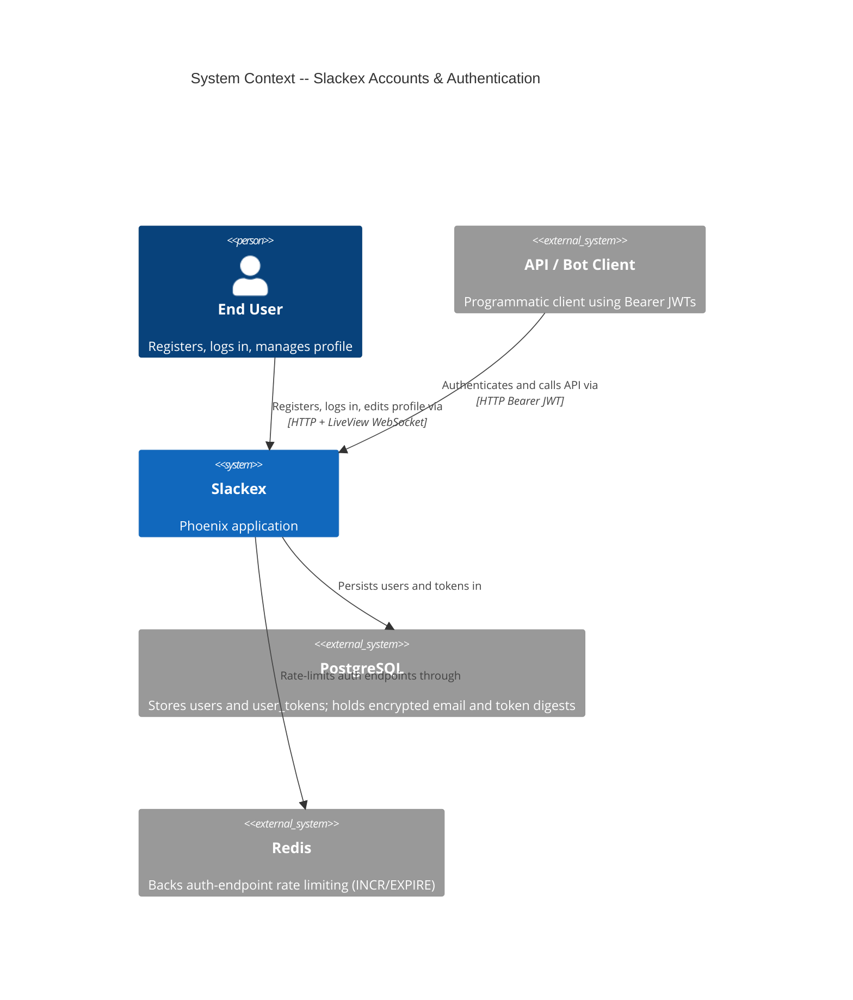
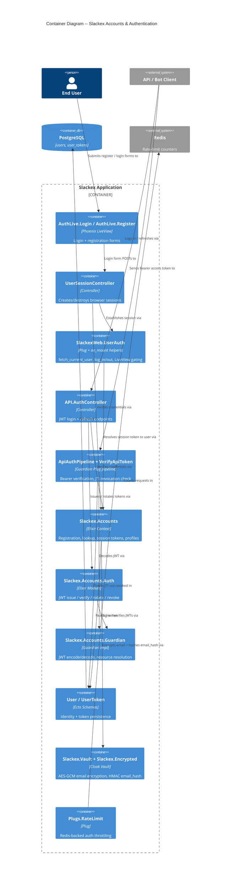
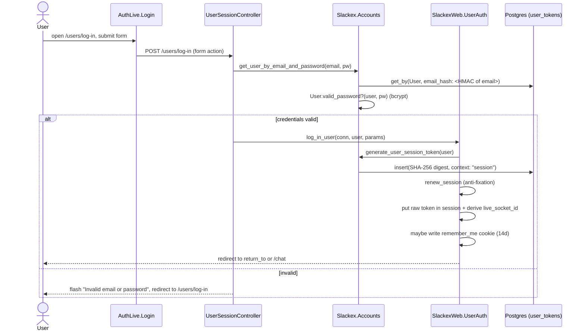
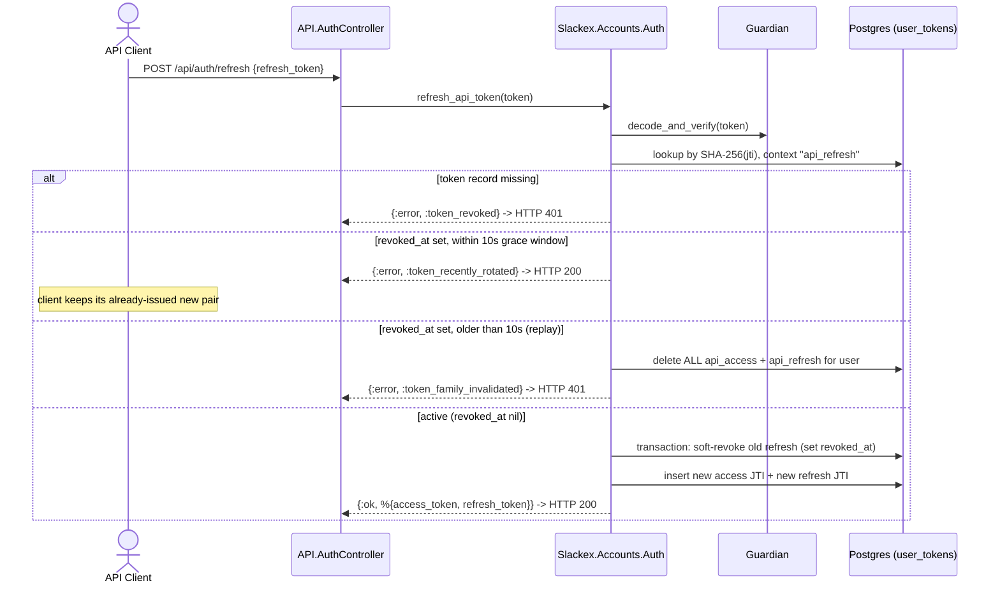
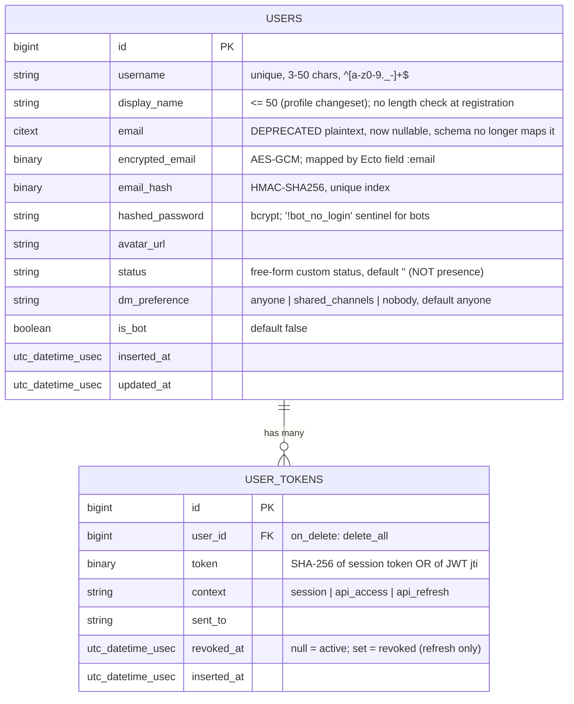

# Accounts & Authentication Architecture

**Status:** Reference
**Scope:** `Slackex.Accounts` context (users, registration, profiles, bot accounts), browser session auth, JWT API auth (Guardian), password hashing (bcrypt), email encryption at rest, and the router pipelines / LiveView hooks that gate access.

---

## 1. Overview

`Slackex.Accounts` owns user identity and the two authentication surfaces the application exposes:

1. **Browser session authentication** for the web UI. A user logs in through a controller, receives an opaque session token stored in a signed cookie, and every request resolves that token to a `current_user`. LiveView routes are gated by `on_mount` hooks rather than plug-based route guards.
2. **JWT API authentication** for programmatic clients. A login exchange returns a short-lived access token (15 min) and a long-lived refresh token (30 days). Both are signed JWTs whose JTI is recorded in the database so they can be revoked, and refresh performs **rotation with a grace window and family invalidation**.

Three facts shape almost everything below and are worth stating up front because each is easy to get wrong:

- **There are three distinct hashing mechanisms, not one.** Passwords use bcrypt. Session tokens and JWT JTIs are stored as *unkeyed* SHA-256 digests. The `email_hash` lookup column is a *keyed* HMAC-SHA256 (Cloak, `CLOAK_HMAC_SECRET`). The email itself is encrypted at rest with AES-GCM-256.
- **The `users.status` column is a free-form custom status message, not a presence indicator.** Online/offline presence lives in other contexts (`Slackex.Notifications.OnlineTracker`, `SlackexWeb.Presence`) and is *not* owned by Accounts. Conflating the two is a documented past mistake — see `priv/repo/migrations/20260422142450_backfill_user_status_offline_default.exs`.
- **Tokens are Postgres-backed and rate-limiting is Redis-backed**, so authentication is naturally stateless across nodes. There is no in-memory auth state to fence; multi-node correctness falls out of the shared stores rather than any bespoke coordination.

The context declares a `Boundary` (`lib/slackex/accounts/accounts.ex`) exporting `User`, `UserToken`, `Auth`, and `Guardian`, depending only on `Slackex.Encrypted`.

---

## 2. C4 Diagrams

### 2.1 System Context

### 2.2 Container Diagram

These diagrams sit above the sequence diagrams in sections 5 and 6.

---

## 3. How To Read This Document

- Start with the **System Context** to see who authenticates and which external stores back it.
- Use the **Container Diagram** to see which modules own forms, controllers, the context, JWT logic, and encryption.
- Use the **session login** sequence (section 5) for the browser path.
- Use the **API refresh** sequence (section 6) for the non-obvious part — token rotation, the grace window, and family invalidation.

### Terms Used Here

| Term | Meaning |
|---|---|
| Session token | 32 random bytes; raw value in the cookie, SHA-256 digest in `user_tokens` |
| JTI | The JWT's unique ID claim; its SHA-256 digest is stored per token for revocation |
| Access token | Short-lived (15 min) JWT, `typ: "access"`, context `api_access` |
| Refresh token | Long-lived (30 day) JWT, `typ: "refresh"`, context `api_refresh` |
| Grace window | 10-second window after a refresh token is revoked during which a duplicate refresh is treated as a benign retry rather than an attack |
| Family invalidation | Deleting all of a user's API tokens when a refresh token is reused outside the grace window |
| `email_hash` | Keyed HMAC-SHA256 of the email, used for exact-match lookup without decryption |

---

## 4. Main Components

| Component | Responsibility |
|---|---|
| `Slackex.Accounts` | Context facade: register, bot creation, user lookup, search, profile update, session-token lifecycle |
| `Slackex.Accounts.User` | User schema; registration/profile/dm-preference/bot changesets; bcrypt password verification |
| `Slackex.Accounts.UserToken` | Session and JTI token schema; token build + verification queries |
| `Slackex.Accounts.Auth` | JWT issue, verify, rotate (refresh), and revoke logic |
| `Slackex.Accounts.Guardian` | Guardian implementation: subject ↔ user resolution |
| `FunWithFlags.Actor` impl for `Slackex.Accounts.User` | `defimpl FunWithFlags.Actor`, keying flags by `"user:#{id}"` |
| `Slackex.Vault` / `Slackex.Encrypted.{Binary,HMAC}` | Cloak vault and Ecto types for encrypting email and hashing `email_hash` |
| `SlackexWeb.UserAuth` | `fetch_current_user` plug, `log_in_user`/`log_out_user`, and LiveView `on_mount` hooks |
| `SlackexWeb.UserSessionController` | Browser login (`create`) and logout (`delete`) |
| `SlackexWeb.AuthLive.{Login,Register}` | LiveView forms for login and registration |
| `SlackexWeb.API.AuthController` | JWT `login` and `refresh` endpoints |
| `SlackexWeb.Plugs.ApiAuthPipeline` / `VerifyApiToken` | Guardian Bearer pipeline plus JTI-revocation and token-type enforcement |
| `SlackexWeb.Plugs.RateLimit` | Redis-backed throttle on auth endpoints |

---

## 5. Browser Session Login

### Notes

- The controller deliberately gives an **identical error for unknown email and wrong password** to avoid user-enumeration. `User.valid_password?/2` runs `Bcrypt.no_user_verify/0` when the user is `nil` so login time is constant whether or not the account exists.
- Lookup is by `email_hash` (the keyed HMAC), never by decrypting stored emails.
- `put_token_in_session/2` also stores `live_socket_id` as `"users_sessions:" <> Base.url_encode64(token)`. On logout, `log_out_user/1` broadcasts a `"disconnect"` on that id so every live LiveView for the session is torn down.
- On every browser request the `:browser` pipeline runs `fetch_current_user`, which reads the session token (or falls back to the signed `remember_me` cookie) and calls `Accounts.get_user_by_session_token/1`. The session-token query rejects tokens older than 14 days (`t.inserted_at > ago(14, "day")`).
- **LiveView route gating uses `on_mount`, not plug guards.** `:ensure_authenticated` redirects to `/users/log-in` when no user is present; `:redirect_if_authenticated` bounces an already-logged-in user to `/chat`. The `require_authenticated_user` and `redirect_if_user_is_authenticated` plugs exist in `UserAuth` but are **not wired into any router pipeline**.

---

## 6. API Token Issue and Rotation

The refresh path is the subtle one. `Auth.refresh_api_token/1` rotates both tokens atomically and distinguishes a benign concurrent retry from a stolen-token replay.

### Notes

- **`:token_recently_rotated` does not return a cached token pair.** The code returns an error tuple in both the within-grace branch and the `count == 0` transaction-rollback branch. The contract is that the client keeps the tokens from its *original* successful refresh; `AuthController.refresh/2` maps this case to **HTTP 200** with `{error: "token_recently_rotated"}` precisely so the client treats it as a no-op retry rather than a failure. This is what makes concurrent refreshes safe.
- **Family invalidation is the theft defense.** If a refresh token is presented after its grace window has elapsed (i.e. it was already rotated long ago), that signals a replay of a stolen token, so `revoke_all_tokens_for_user/1` deletes every API token for the user, forcing a fresh login.
- Rotation runs inside `Repo.transaction`. The update is conditional on `is_nil(t.revoked_at)`, so two racing requests cannot both win the rotation; the loser sees `count == 0` and rolls back to `:token_recently_rotated`.
- **Access tokens are hard-deleted on revocation; refresh tokens are soft-revoked** (`revoked_at` set). The soft-revoke is what enables the grace-window logic — the record must survive long enough to distinguish "recently rotated" from "long-revoked replay".
- On the request path, `ApiAuthPipeline` runs `Guardian.Plug.VerifyHeader` → `EnsureAuthenticated` → `VerifyApiToken` → `LoadResource`. `VerifyApiToken` rejects any token whose `typ` is not `"access"` (so a refresh token can never be used as a bearer credential) and confirms the JTI digest still exists with context `api_access` (so a revoked access token is rejected even before its 15-minute TTL expires).
- Both `/api/auth/login` and `/api/auth/refresh` are rate-limited: the router pipes that scope through `:rate_limit_api_auth` (10 requests / 60 s), matching the browser login limit.

---

## 7. Key Design Properties

- **Constant-time, non-enumerable login:** dummy bcrypt verify on missing users; identical error messages for unknown-email and wrong-password.
- **Layered secrets, never one hash:** bcrypt for passwords, unkeyed SHA-256 for token digests, keyed HMAC for `email_hash`, AES-GCM for email at rest.
- **Stateless, store-backed auth:** all auth state lives in Postgres (tokens) and Redis (rate counters), so verification is correct on any node with no in-memory coordination.
- **Revocable JWTs:** every JWT's JTI digest is persisted, turning otherwise-stateless tokens into revocable ones and giving access tokens immediate (pre-TTL) revocation.
- **Safe rotation:** transactional refresh rotation plus a grace window tolerate client retries while family invalidation punishes replay.
- **Encryption with rotation built in:** `Slackex.Vault` supports a primary and a retired cipher so keys can be rotated without downtime; `mix slackex.rotate_key` re-encrypts existing rows.
- **Feature-flag aware surfaces:** auth LiveViews read `FunWithFlags.enabled?(:loom_redesign)` to apply the Loom restyle, and the `FunWithFlags.Actor` implementation for `Slackex.Accounts.User` lets flags be evaluated per user.

---

## 8. Data Model

`Slackex.Accounts` owns two tables. The schemas reflect the *current* state after all migrations, not any single migration in isolation.

**Email field evolution (worth understanding precisely):**
- The original `create_users` migration had a plaintext `citext email` column with a unique index. `20260227235000_add_encrypted_email_to_users.exs` added `encrypted_email` and `email_hash`, made the old `email` column nullable, dropped its unique index, and created a unique index on `email_hash`.
- The schema maps the Ecto attribute `:email` to the **`encrypted_email`** column via `source: :encrypted_email` (type `Slackex.Encrypted.Binary`). The original plaintext `email` column is now orphaned — the schema no longer writes to it.
- `User.put_email_hash/1` copies the plaintext email into the `:email_hash` field; the `Slackex.Encrypted.HMAC` Ecto type performs the keyed HMAC on dump. That is why login can look a user up by `email_hash` without ever decrypting stored ciphertext.

**Other constraints:**
- Unique indexes on `users.username` and `users.email_hash`; `unique_index(:user_tokens, [:context, :token])` plus indexes on `user_id` and `(context, revoked_at)`.
- `status` default is `''` (set by the backfill migration); it is a custom status message, not an online indicator.
- Bot users (`is_bot: true`) are created via `User.bot_changeset/2` with no email and the sentinel `hashed_password: "!bot_no_login"`, which can never match a real bcrypt verify. The flag drives a `BOT` badge in `lib/slackex_web/components/chat_components.ex`.

---

## 9. Failure Modes & Resilience

- **Vault is a supervised child started before `Repo`** (`lib/slackex/application.ex`). It is essential: if the Vault cannot start (e.g. missing/invalid `CLOAK_KEY` in prod), email encryption and `email_hash` generation are unavailable, so registration and email-based login cannot function. Blast radius is bounded to encrypt/decrypt and HMAC operations; it does not touch session-token verification, which uses plain SHA-256.
- **Rate limiter fails open.** `SlackexWeb.Plugs.RateLimit` degrades gracefully — if Redis is unreachable, `check_rate` returns `{:allow, 0}` rather than blocking every login. The trade-off is availability over strict throttling during a Redis outage; it logs a warning on Redis errors. It keys on `conn.remote_ip` (the TCP peer set by the Caddy reverse proxy), never `X-Forwarded-For`, which is client-controlled.
- **Guardian secret handling differs by environment.** `config/config.exs` hardcodes a dev-only secret; `config/runtime.exs` **raises at boot** if `GUARDIAN_SECRET_KEY` is missing in prod. Similarly the Vault requires `CLOAK_KEY` and `CLOAK_HMAC_SECRET` in prod (raises otherwise). This is deliberate fail-fast: a misconfigured prod node refuses to boot rather than running with a known-weak key. (Compare the v0.8.1 VAPID boot-crash incident, where a *non-essential* feature raised in `runtime.exs` and was later made optional — auth secrets are essential, so raising is correct here.)
- **JWT verification is resilient to lost resources.** `Guardian.resource_from_claims/1` rescues `Ecto.NoResultsError` into `{:error, :resource_not_found}`, so a token referencing a deleted user yields a clean 401 rather than a 500.
- **Token cleanup on user deletion** is handled by the FK `on_delete: :delete_all` on `user_tokens.user_id`; deleting a user cascades to all their tokens.
- **Multi-node:** because tokens live in Postgres and rate counters in Redis, any node verifies and rotates tokens identically. There is no node-local auth state to lose on failover and no fencing problem to solve here.

---

## 10. Cross-Context Dependencies

Accounts deliberately does **not** own these, but interacts with them:

- **Notifications.** `Accounts.register_user/1` calls `Slackex.Notifications.Preference.create_default_for_user/1` as a side effect on successful registration. On logout, `SlackexWeb.UserAuth.log_out_user/1` deletes the user's `web_push` device tokens. See `docs/architecture/notifications.md`.
- **Online presence.** Online/offline state is tracked by `Slackex.Notifications.OnlineTracker` (Redis-backed) and `SlackexWeb.Presence` — separate from the `users.status` custom-message column.
- **Chat.** `User` `has_many :subscriptions` and `has_many :channels, through:` — membership and channel data are owned by `Slackex.Chat`. See `docs/architecture/chat-domain-as-is-to-be.md`.
- **Feature flags.** `lib/slackex/accounts/user_flags_actor.ex` implements the `FunWithFlags.Actor` protocol for `Slackex.Accounts.User` so flags can target individual users; the admin flag UI is mounted under `/admin/flags` behind basic auth in the router.

---

## 11. Code Map

| File | Responsibility |
|---|---|
| `lib/slackex/accounts/accounts.ex` | Context facade: register, bot creation, lookup, search, profile, session tokens |
| `lib/slackex/accounts/user.ex` | User schema, changesets, bcrypt password verification |
| `lib/slackex/accounts/user_token.ex` | Session/JTI token schema and queries |
| `lib/slackex/accounts/auth.ex` | JWT issue / verify / rotate / revoke logic |
| `lib/slackex/accounts/guardian.ex` | Guardian implementation (subject ↔ user) |
| `lib/slackex/accounts/user_flags_actor.ex` | `FunWithFlags.Actor` impl |
| `lib/slackex/vault.ex` | Cloak vault, key-rotation reconfigure |
| `lib/slackex/encrypted.ex` | `Slackex.Encrypted` boundary |
| `lib/slackex/encrypted/binary.ex` | AES-GCM Ecto type for `encrypted_email` |
| `lib/slackex/encrypted/hmac.ex` | HMAC Ecto type for `email_hash` |
| `lib/slackex_web/user_auth.ex` | `fetch_current_user`, `log_in_user`/`log_out_user`, LiveView `on_mount` hooks |
| `lib/slackex_web/controllers/user_session_controller.ex` | Browser login / logout |
| `lib/slackex_web/live/auth_live/login.ex` | Login LiveView form |
| `lib/slackex_web/live/auth_live/register.ex` | Registration LiveView form |
| `lib/slackex_web/controllers/api/auth_controller.ex` | JWT login + refresh endpoints |
| `lib/slackex_web/controllers/api/auth_json.ex` | JWT response serialization |
| `lib/slackex_web/plugs/api_auth_pipeline.ex` | Guardian Bearer pipeline + JSON error handler |
| `lib/slackex_web/plugs/verify_api_token.ex` | JTI revocation + token-type enforcement |
| `lib/slackex_web/plugs/rate_limit.ex` | Redis-backed auth rate limiter |
| `lib/slackex_web/router.ex` | Pipelines, auth routes, live_session gating |
| `config/config.exs`, `config/runtime.exs` | Guardian secret, Vault ciphers, HMAC secret |

---

## 12. Related Documents

- `docs/architecture/realtime-chat.md` — the realtime messaging path the authenticated `current_user` then uses
- `docs/architecture/notifications.md` — notification preferences created at registration, device-token cleanup at logout, and online presence tracking
- `docs/architecture/chat-domain-as-is-to-be.md` — channel membership and subscriptions associated with users
- `docs/architecture/threads-and-reactions.md` — user-attributed interactions on messages
- `docs/architecture/README.md` — index of the architecture document set
