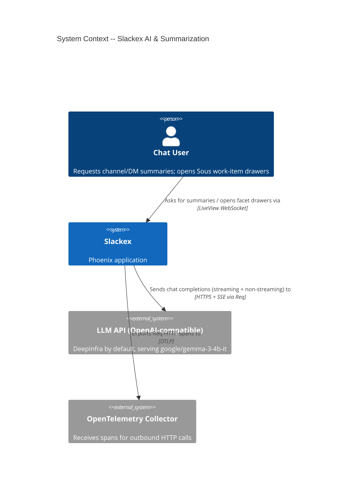
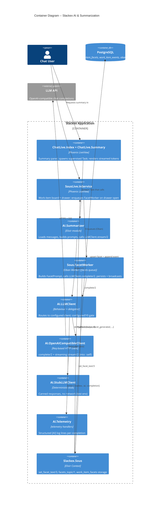
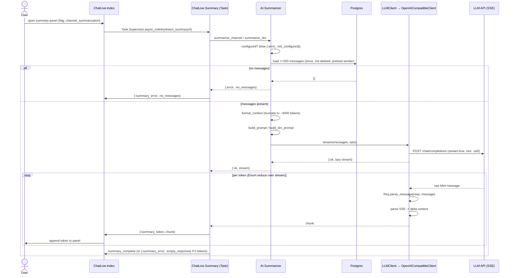
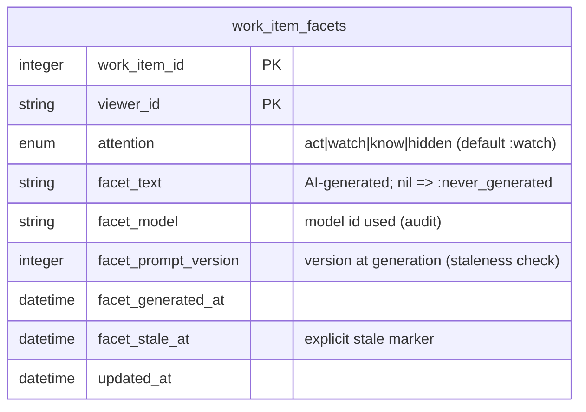

# AI & Summarization Architecture

**Status:** Reference
**Scope:** `Slackex.AI` context — LLM client behaviour and delegation, channel/DM conversation summarization, streaming responses (Req `into: :self` + Mint), prompt construction, telemetry, and the Sous facet-generation pipeline (the other LLM consumer). Resilience and feature gating.

---

## 1. Overview

Slackex talks to large language models through one narrow seam: the `Slackex.AI.LLMClient` behaviour. Everything LLM-shaped — conversation summaries and Sous work-item facets — goes through the same two callbacks, `complete/2` (non-streaming) and `stream/2` (streaming). The concrete client is chosen by application config, so dev runs a real OpenAI-compatible HTTP client while tests run a deterministic stub with no network calls.

There are two distinct consumers of this seam, and they have deliberately different runtime shapes:

1. **Conversation summarization** (`Slackex.AI.Summarizer`) — on-demand, *streaming*, *interactive*. A user opens the summary panel in chat; the LiveView spawns a supervised `Task` that enumerates the LLM token stream and forwards each chunk to the LiveView mailbox so the summary appears word-by-word. Gated by the `:channel_summarization` feature flag.

2. **Sous facet generation** (`Slackex.Sous.FacetWorker`) — background, *non-streaming*, *durable*. Opening a work-item drawer lazily enqueues an Oban job per viewer; the job calls `complete/2`, persists the result, and broadcasts a PubSub event so any open board updates live. Gated by the `:sous` feature flag.

The surprising design choice is that there is **no dedicated AI process tree**. The AI context owns no GenServer, no long-lived supervisor, and no tables of its own. Summarization work lives inside a short-lived `Task` under the shared `Slackex.TaskSupervisor`; facet work lives inside an Oban job in the `:facets` queue. Blast radius is therefore naturally request- or job-scoped: a failed LLM call cannot cascade into the realtime chat supervision tree (contrast the v0.5.36 embedding cascade — see `docs/rca/2026-03-05-embedding-cascade-app-crash.md` and `docs/architecture/deep-dive-embedding-resilience.md`).

---

## 2. C4 Diagrams

### 2.1 System Context



The LLM API is pluggable: any OpenAI-compatible endpoint (DeepInfra, OpenRouter, OpenAI) works because the client only depends on the `/chat/completions` wire shape. Slackex reuses the same DeepInfra key (`EMBEDDING_API_KEY`) for both embeddings and chat completions.

### 2.2 Container Diagram



---

## 3. Main Components

| Component | Responsibility |
|---|---|
| `Slackex.AI` | `Boundary` context wrapper; `deps: [Slackex.Chat]`, `exports: [Summarizer, LLMClient, Telemetry]` |
| `Slackex.AI.LLMClient` | Behaviour (`complete/2`, `stream/2`) + delegator to the configured client; `configured?/0` graceful-degradation gate |
| `Slackex.AI.OpenAICompatibleClient` | Real Req-based client for any OpenAI-compatible API; non-streaming and SSE streaming |
| `Slackex.AI.StubLLMClient` | Deterministic test client; canned summary + viewer-distinguishable facet text |
| `Slackex.AI.Summarizer` | Loads channel/DM messages, formats context within a token budget, builds prompts, calls `stream/2` |
| `Slackex.AI.Telemetry` | Attaches `:telemetry` handlers for AI events; emits structured `[AI]` log lines |
| `SlackexWeb.ChatLive.Summary` | Spawns the streaming consumer; forwards `{:summary_token, chunk}` / `:summary_complete` / `{:summary_error, reason}` to the LiveView |
| `Slackex.Sous.FacetWorker` | Oban worker; the only LLM caller in Sous; persists facet text via `Sous.set_facet_text/3` |
| `Slackex.Sous.FacetPrompt` | Pure prompt template; `@prompt_version` drives staleness |
| `Slackex.Sous.WorkItemFacet` | Composite-PK facet schema; pure `state/1` pill-state derivation |

---

## 4. Terms Used Here

| Term | Meaning |
|---|---|
| Completion | A single non-streaming LLM response (`complete/2`) |
| Stream | A lazy `Enumerable` of token-string chunks (`stream/2`) |
| Context (summarization) | The formatted, token-budgeted transcript handed to the model |
| Facet | One viewer's role-specific paragraph about a Sous work item |
| Pill state | A facet's display state derived from the persisted row plus runtime hints |
| `configured?` | Whether both a client module *and* a non-empty `api_key` are present |

---

## 5. Summarization Streaming Flow



### Why this shape

- **The stream is lazy; errors surface during enumeration, not at the call site.** `summarize_channel/4` and `summarize_dm/4` return only `{:ok, stream}` or `{:error, :not_configured | :no_messages}` synchronously. Network failures, API non-200s, and timeouts (`:network_error`, `:api_error`, `:timeout`, `:stream_error`) are produced *lazily* by the `Stream.resource` while `ChatLive.Summary` enumerates it. The consumer wraps enumeration in a `try/rescue` and converts any failure into `{:summary_error, ...}`. This separation is the whole point — the user sees the panel open immediately and tokens trickle in.
- **Zero-token streams are an explicit error.** `stream_summary_result/2` counts tokens; if the stream completes with `token_count == 0` it sends `{:summary_error, :empty_response}` rather than a misleading "complete". This guard exists because of a real incident (see §10) where streaming connected with HTTP 200 but yielded no tokens.
- **The Task is killable.** The summary runs under `Slackex.TaskSupervisor` via `async_nolink`; `cancel_summary_task/1` does `Process.exit(pid, :kill)` so a user who closes the panel does not leave an LLM request running. A crashed task is caught by the LiveView and rendered as `:task_crashed`.

### Req streaming internals (`into: :self` + Mint)

`OpenAICompatibleClient.stream/2` builds a lazy stream with `Stream.resource/3`:

1. **Start** — `Req.post(url, ..., into: :self)` opens an async request and returns `{:ok, %Req.Response{} = resp}`. The calling process now receives **raw Mint messages** in its mailbox (e.g. `{:ssl, socket, bytes}`), *not* `{ref, {:data, ...}}` tuples.
2. **Pull** — `next_chunk/1` blocks in a `receive` (60s per-chunk timeout) and hands each message to `Req.parse_message(resp, message)`, which translates it into `[{:data, chunk} | :done | {:error, _}]` parts. `:unknown` messages are skipped.
3. **Decode** — each `{:data, data}` part is split on newlines, `data: `-prefixed lines are JSON-decoded, and `choices[0].delta.content` is extracted; empty chunks are dropped.
4. **Terminate** — a `[DONE]` SSE marker or an `{:error, _}` part halts the stream.
5. **Clean up** — the `Stream.resource` finalizer calls `Req.cancel_async_response(resp)` (passing the full `%Req.Response{}`, not a bare ref) to close the connection, then emits stream-completion telemetry.

The pattern `Req.parse_message/2` + full-`%Req.Response{}` cleanup is mandatory; matching on `{ref, {:data, ...}}` directly never fires. See §10.

---

## 6. Facet Generation Flow (Sous)

```mermaid
sequenceDiagram
  actor User
  participant LV as SousLive.InService
  participant Oban as Oban (:facets queue)
  participant FW as Sous.FacetWorker
  participant FP as Sous.FacetPrompt
  participant LC as LLMClient → client
  participant API as LLM API
  participant Sous as Slackex.Sous
  participant PS as Phoenix.PubSub

  User->>LV: open work-item drawer (flag :sous)
  LV->>LV: load facet rows; compute WorkItemFacet.state/1
  alt LLM configured and row :never_generated or :stale
    LV->>Oban: insert FacetWorker (unique on work_item_id, viewer_id, prompt_version, state_version)
  end
  Oban->>FW: perform/1
  FW->>LC: configured?
  alt not configured
    FW-->>Oban: {:discard, :llm_not_configured}
  else missing viewer/work_item/decision
    FW-->>Oban: {:discard, :missing_dependency}
  else ready
    FW->>FP: build(viewer, work_item, decision)
    FW->>LC: complete(messages, purpose: :sous_facet, max_tokens: 200)
    alt LLM ok
      LC->>API: POST /chat/completions
      API-->>LC: content
      LC-->>FW: {:ok, text}
      FW->>Sous: set_facet_text(work_item_id, viewer_id, %{facet_text, model, prompt_version, state_version})
      Sous->>Sous: Multi: append :facet_generated event + upsert WorkItemFacet
      Sous->>PS: broadcast {:sous, :facet_generated, wi_id, viewer_id}
      PS-->>LV: handle_info -> refresh drawer + board
    else LLM error
      LC-->>FW: {:error, reason}
      FW-->>Oban: {:error, reason}  (Oban retries, max_attempts: 3)
    end
  end
```

### Why this shape

- **`state_version` is passed through unchanged.** `FacetWorker.perform/1` reads `state_version` from `job.args` and copies it verbatim into the event payload. It deliberately does **not** re-query `Sous.state_version/1`. Oban's uniqueness key is hashed over `args` at enqueue time; a worker that wrote a different `state_version` than it was enqueued with would defeat dedup. This is the single most non-obvious invariant in the pipeline.
- **`perform/1` returns the LLM result directly.** On `{:error, reason}` the worker returns `{:error, reason}` so Oban retries (`max_attempts: 3`, exponential backoff). It never swallows the result into `:ok` — that anti-pattern caused the v0.5.36 outage and is hook-enforced project-wide.
- **Absence is configured, not crashing.** If the LLM is unconfigured the worker `{:discard, :llm_not_configured}`s with a warning; if a dependency row is missing it `{:discard, :missing_dependency}`s. Neither errors the queue.
- **Prompt-version bumps auto-stale.** `FacetPrompt.@prompt_version` (currently `2`) is checked at *read* time by the pure `WorkItemFacet.state/1`: any row whose `facet_prompt_version` is below the current version derives `:stale`. No migration, no backfill, no worker logic — staleness is a function of the persisted row plus the module constant.

---

## 7. Key Design Properties

- **One LLM seam:** all model access flows through `LLMClient.complete/2` / `stream/2`, swappable by config (`OpenAICompatibleClient` in dev/prod, `StubLLMClient` in test).
- **Provider-agnostic:** the real client only depends on the OpenAI `/chat/completions` shape, avoiding vendor lock-in.
- **Graceful absence:** `LLMClient.configured?/0` requires *both* a client module and a non-empty `api_key`. When false, summarization returns `:not_configured` and facet jobs discard — the app never crashes for lack of an LLM.
- **Two runtime shapes, deliberately:** interactive streaming under a killable supervised `Task`; durable background generation under an Oban job with retries.
- **No dedicated AI supervisor:** work is request- or job-scoped, so an LLM failure cannot cascade into the realtime chat tree.
- **Token-budgeted prompts:** the summarizer truncates context to ~4,000 tokens (`@max_context_tokens * @chars_per_token`, with `@chars_per_token = 4`), stopping at a whole-line boundary rather than mid-message.
- **Dual telemetry:** module-level `:telemetry` events feed structured `[AI]` logs; `OpentelemetryReq` (registered globally in `application.ex` via `Req.default_options/1`) traces the outbound HTTP automatically.

---

## 8. Data Model

The AI context owns **no tables of its own**. The only persisted state in this subsystem is the Sous facet row, owned by `Slackex.Sous` and *written by the AI pipeline* through `Sous.set_facet_text/3`.



- **Composite primary key** `(work_item_id, viewer_id)` — no surrogate id. Absence of a row means the default `:watch` attention; B2 fills `facet_text` lazily.
- **Pill-state derivation** (`WorkItemFacet.state/1`, a pure function): `nil`/no text → `:never_generated`; `facet_stale_at` set → `:stale`; `facet_prompt_version < FacetPrompt.prompt_version()` → `:stale`; else `:fresh`. Runtime states `:generating`, `:failed`, `:not_configured` are layered on by the LiveView/drawer from socket state — they are **not** derivable from the row.
- **Upsert safety:** `set_facet_text/3` uses `on_conflict: {:replace, [..B2 fields..]}` with `conflict_target: [:work_item_id, :viewer_id]`, then **re-fetches** with `Repo.get_by!/2`. The re-fetch is required so the returned struct reflects the merged row — the replace preserves the pre-existing `:attention` value the changeset-built struct doesn't know about. (The project-wide `on_conflict` ghost-struct hazard is handled here by the explicit re-fetch.)
- **Event sourcing:** the upsert runs in an `Ecto.Multi` alongside an appended `:facet_generated` `WorkItemEvent`, so the facet is reconstructable by replay through `Sous.Projection.apply_event/2` — the same fold used at write time.

---

## 9. Failure Modes & Resilience

| Trigger | Behaviour | Surface |
|---|---|---|
| No `api_key` (`configured?/0` false) | Summarizer returns `{:error, :not_configured}`; FacetWorker `{:discard, :llm_not_configured}` (warns) | Panel error / facet stays `:never_generated` |
| No messages in range | Summarizer `{:error, :no_messages}` | Panel error |
| Network error / API non-200 (summarize) | Stream halts lazily with `{:error, {:network_error|:api_error, ...}}` during enumeration | `{:summary_error, reason}` |
| Per-chunk timeout (60s, summarize) | Stream halts `{:error, :timeout}` | `{:summary_error, ...}` |
| Stream connects but yields 0 tokens | Consumer sends `{:summary_error, :empty_response}` | Panel error (not a false "complete") |
| User closes panel | `Process.exit(task_pid, :kill)`; `Req.cancel_async_response/1` in finalizer closes the HTTP connection | Task gone, no leaked request |
| Summary Task crash | LiveView catches via `async_nolink` | `:task_crashed` |
| LLM error (facet) | `{:error, reason}` returned → Oban retry, `max_attempts: 3` | Facet `:generating` then board update on success; `:failed` pill after exhaustion |
| Missing viewer/work_item/decision (facet) | `{:discard, :missing_dependency}` (warns) | No retry; data-integrity guard |
| Duplicate drawer-open enqueue | Oban uniqueness (`period: :infinity`, keyed on the four args) collapses to one job | Single generation |

**Restart strategy & blast radius.** There is no AI-specific supervisor to restart. Summaries run under the shared `Slackex.TaskSupervisor`; a crash is isolated to that one Task and reported to its owning LiveView. Facet generation runs in the `:facets` Oban queue (concurrency 3); failures retry and ultimately `discard`/`fail` within Oban without touching other queues or the chat supervision tree. An entirely absent or misconfigured LLM degrades both features to "unavailable" while the rest of the app serves traffic normally.

---

## 10. Incident Precedents

- **v0.5.58–v0.5.61 — summarization streaming yielded zero tokens.** Streaming connected (HTTP 200) but produced no output because the code pattern-matched on `{ref, {:data, ...}}` tuples that `into: :self` never sends. The fix is the current design: `Req.parse_message/2` to translate raw Mint messages, full-`%Req.Response{}` cleanup, and the `:empty_response` guard. RCA: `docs/rca/2026-03-06-summarization-streaming-failure.md`.
- **v0.5.36 — embedding worker error swallowing cascaded the supervisor.** The lesson is enforced here: `FacetWorker.perform/1` returns the LLM result directly so Oban retries, and the AI subsystem holds no permanent supervised process that could cascade.

---

## 11. Configuration & Feature Gating

| Setting | Source | Notes |
|---|---|---|
| `:llm_client` | `config/dev.exs` → `OpenAICompatibleClient`; `config/test.exs` → `StubLLMClient` | Selects the concrete client |
| `:llm_api` | `config/runtime.exs` (all envs) — only set when `EMBEDDING_API_KEY` present | `api_url` (default DeepInfra), `model` (default `google/gemma-3-4b-it`), `api_key`, `max_tokens` (default 1024), `temperature` 0.3 |
| `:llm_facet_model` | `config/runtime.exs` from `LLM_FACET_MODEL` | Optional per-facet model override; `nil` falls back to the client default |
| `:channel_summarization` | FunWithFlags | Gates the chat summary panel (`ChatLive.Index`) |
| `:sous` | FunWithFlags | Gates the Sous board/drawer that triggers facet generation |

Both user-facing surfaces are flag-gated at the LiveView; the underlying LLM seam degrades gracefully when `EMBEDDING_API_KEY` is unset (no `:llm_api` config → `configured?/0` false).

---

## 12. Code Map

| File | Responsibility |
|---|---|
| `lib/slackex/ai/ai.ex` | `Slackex.AI` `Boundary` context definition |
| `lib/slackex/ai/llm_client.ex` | Behaviour, delegation, `configured?/0` |
| `lib/slackex/ai/openai_compatible_client.ex` | Real Req-based client; `complete/2` + SSE `stream/2` |
| `lib/slackex/ai/stub_llm_client.ex` | Deterministic test client |
| `lib/slackex/ai/summarizer.ex` | Message loading, context budgeting, prompt construction |
| `lib/slackex/ai/telemetry.ex` | `:telemetry` handlers for AI events |
| `lib/slackex_web/live/chat_live/summary.ex` | Streaming consumer; token/complete/error fan-out to LiveView |
| `lib/slackex_web/live/chat_live/index.ex` | Spawns the summary Task; handles `:summary_token`/`:summary_complete`/`:summary_error`/`:task_crashed` |
| `lib/slackex/sous/facet_worker.ex` | Oban worker; only LLM caller in Sous |
| `lib/slackex/sous/facet_prompt.ex` | Pure prompt template + `@prompt_version` |
| `lib/slackex/sous/work_item_facet.ex` | Composite-PK facet schema + `state/1` |
| `lib/slackex/sous.ex` | `set_facet_text/3`, `facets_topic/1`, `:facet_generated` broadcast |
| `lib/slackex/application.ex` | `AI.Telemetry.attach_handlers/0`; `Req.default_options(plugins: [OpentelemetryReq])` |
| `config/dev.exs`, `config/test.exs`, `config/runtime.exs` | Client selection and `:llm_api` / `:llm_facet_model` |

---

## 13. Related Documents

- `docs/architecture/realtime-chat.md` — the message pipeline whose history the summarizer reads
- `docs/architecture/threads-and-reactions.md` — thread/reaction model in the same `Slackex.Chat` domain
- `docs/architecture/notifications.md` — the other LiveView-driven async/PubSub subsystem
- `docs/architecture/deep-dive-req-streaming.md` — the L2 companion that explains *how the bytes become tokens*: `into: :self`, raw Mint messages, `Req.parse_message/2`, the `Stream.resource/3` pull-and-cleanup loop, and `Req.cancel_async_response/1`
- `docs/rca/2026-03-06-summarization-streaming-failure.md` — the streaming incident that hardened the `Req.parse_message/2` + cleanup path
- `docs/runbooks/observability.md` — metrics, traces, and the resilience rules behind "no dedicated AI supervisor"
- `docs/engineering-principles.md` — project-wide deploy-safety, Oban, and `on_conflict` rules referenced above
