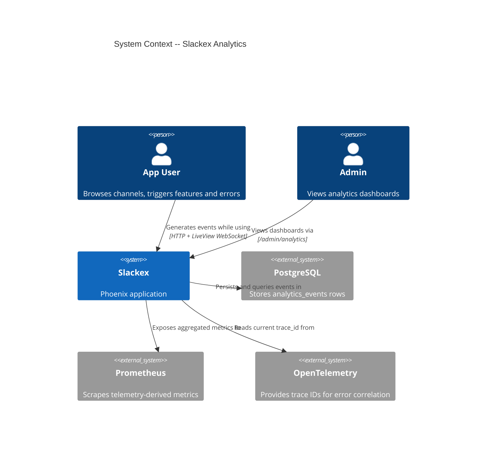
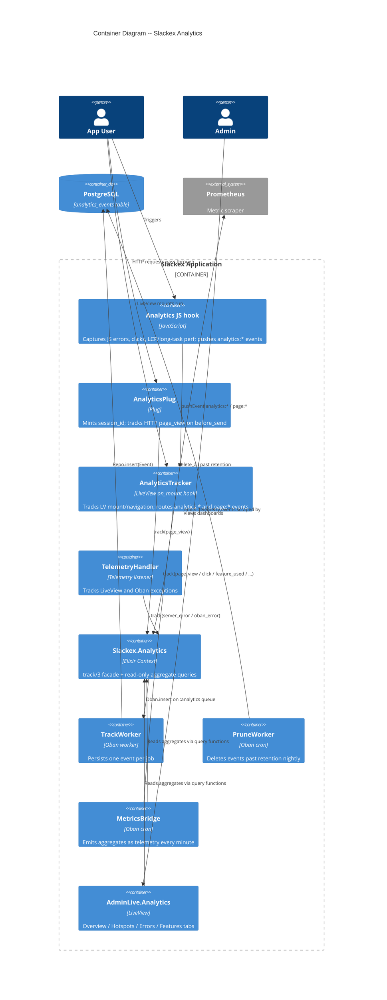
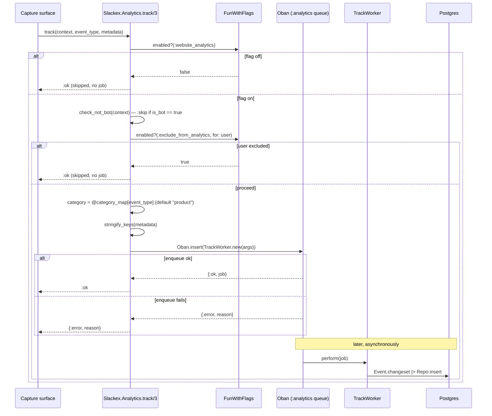
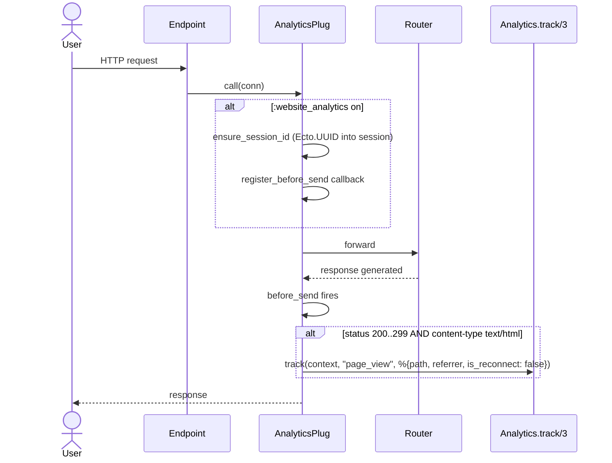
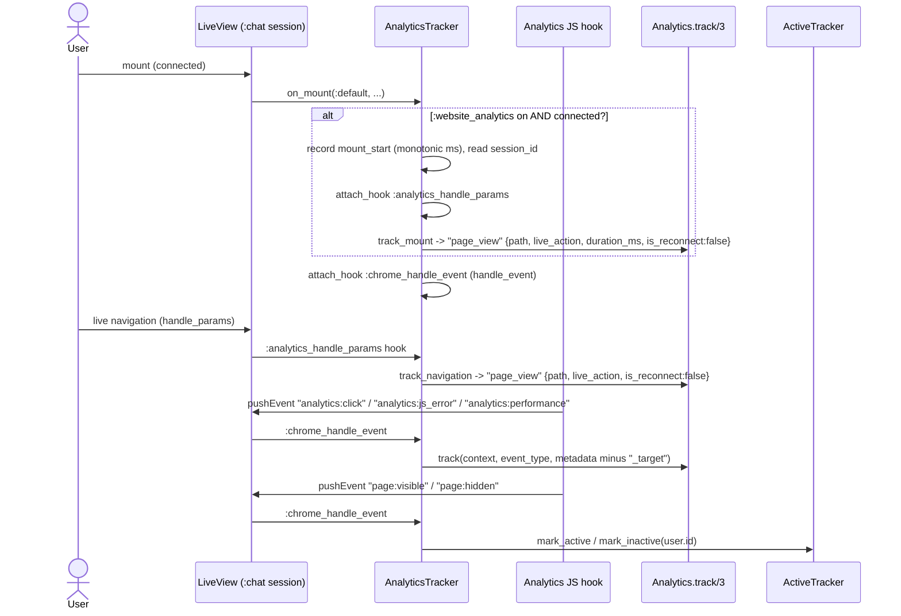
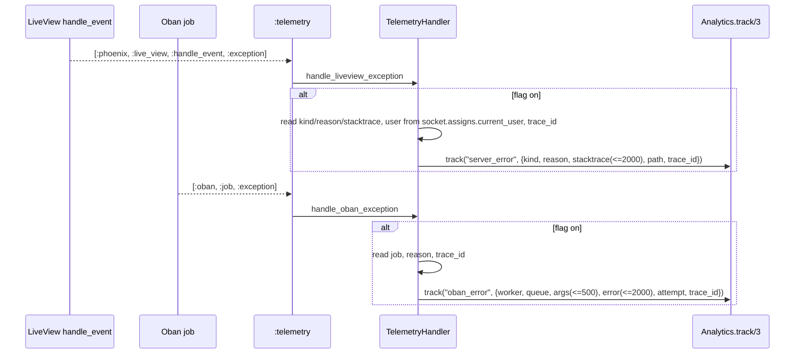
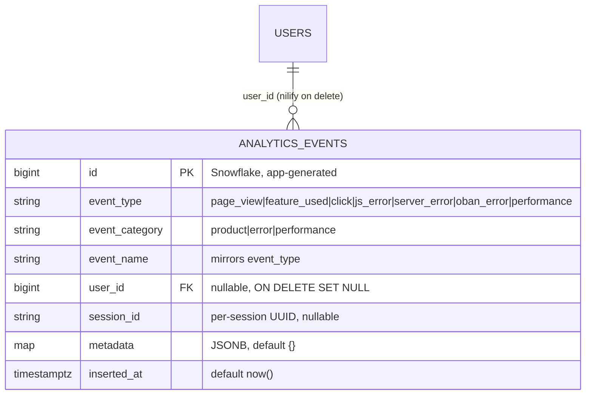

# Analytics Architecture

**Status:** Reference
**Scope:** `Slackex.Analytics` context, the `SlackexWeb.AnalyticsTracker` LiveView hook, the `AnalyticsPlug`, the JS `Analytics` hook, async persistence, gating, and the Prometheus bridge.

---

## 1. Overview

Analytics is a **non-blocking, fire-and-forget** event-capture subsystem. It records what users do (page views, feature usage, clicks), how the front end performs (LCP, long tasks), and what breaks (JS errors, LiveView exceptions, Oban job failures) — then exposes aggregates to an admin dashboard and to Prometheus.

The design principle that shapes everything here is **non-essential**: analytics must never slow down or take down a user interaction. That goal is met by three structural choices, each of which the code enforces rather than merely intends:

1. **Gated.** Nothing is captured unless the `:website_analytics` FunWithFlags flag is on. Bot users and users carrying the per-actor `:exclude_from_analytics` flag are silently skipped. The flag is checked at every capture surface — plug, LiveView hook, telemetry handler, JS hook, and the metrics bridge — so the whole subsystem can be turned off without a deploy.
2. **Asynchronous.** `Slackex.Analytics.track/3` only validates gating and enqueues an Oban job on the `:analytics` queue. The database write happens later in `TrackWorker`. The caller never waits for I/O.
3. **Isolated.** Every capture call site wraps tracking so a failure cannot propagate into the surrounding request, render, or exception path. The plug rescues and logs; the LiveView hook rescues to `:ok`; telemetry handlers and explicit call sites discard the return with `_ =`. A crash in analytics degrades to "no data point," never "broken page."

This is the same resilience posture the project applies to other non-essential subsystems (embeddings, summarization) after the v0.5.36 cascade outage — keep the blast radius contained to the subsystem itself.

---

## 2. C4 Diagrams

### 2.1 System Context

### 2.2 Container Diagram

These diagrams sit above the sequence diagrams in section 5.

---

## 3. How To Read This Document

- Start with the **System Context** to see who produces events and where they end up.
- Use the **Container Diagram** to see the five capture surfaces (JS hook, plug, LiveView hook, telemetry handler, explicit context calls) feeding one facade.
- Use the **sequence diagrams** for runtime ordering — especially *when* the Oban job is enqueued versus *when* the row is written.
- Use the **Data Model** and **Code Map** as the reference index.

### Terms Used Here

| Term | Meaning |
|---|---|
| Capture surface | A code site that calls `Slackex.Analytics.track/3` |
| Context map | The first argument to `track/3` carrying `:user_id`, `:session_id`, `:is_bot`, `:user` for gating |
| Gating | The flag/bot/exclusion checks that decide whether an event is enqueued |
| Fire-and-forget | The caller enqueues and moves on; persistence happens later and its outcome is not awaited |
| Metrics bridge | The cron job that turns DB aggregates into Prometheus-scrapable telemetry |

---

## 4. Main Components

| Component | Responsibility |
|---|---|
| `Slackex.Analytics` | Public facade: `track/3` (gating + enqueue) and read-only aggregate queries (`page_views/1`, `feature_usage/1`, `errors/1`, `slow_pages/1`, `hotspots/1`, `active_user_count/1`) |
| `Slackex.Analytics.Event` | Ecto schema for `analytics_events`; Snowflake PK, event-type/category whitelists |
| `Slackex.Analytics.TrackWorker` | Oban worker that inserts one `Event` per job |
| `Slackex.Analytics.PruneWorker` | Nightly Oban cron that deletes events past retention |
| `Slackex.Analytics.MetricsBridge` | Per-minute Oban cron that emits aggregates as telemetry for Prometheus |
| `Slackex.Analytics.TelemetryHandler` | Attaches to Phoenix LiveView and Oban exception telemetry to capture errors |
| `SlackexWeb.Plugs.AnalyticsPlug` | Mints the analytics session ID and tracks HTTP page views |
| `SlackexWeb.AnalyticsTracker` | LiveView `on_mount` hook: tracks mount/navigation and routes `analytics:*` / `page:*` events |
| `assets/js/hooks/analytics.js` | Browser hook capturing JS errors, declarative clicks, and performance metrics |
| `SlackexWeb.AdminLive.Analytics` | Admin dashboard reading the aggregate query functions |

---

## 5. Runtime Flows

### 5.1 `track/3` — the gating + enqueue pipeline

Every capture surface ends here. The function returns `:ok` both when an event is enqueued **and** when gating skips it; only an Oban enqueue failure yields `{:error, reason}`. Callers treat the result as advisory.

Notes:

- The category is **inferred from the event type** via the hardcoded `@category_map` in `lib/slackex/analytics.ex`: `page_view`/`feature_used`/`click` → `"product"`; `js_error`/`server_error`/`oban_error` → `"error"`; `performance` → `"performance"`. The schema independently validates both `event_type` and `event_category` against whitelists, so a typo at the call site fails validation in the worker rather than writing garbage.
- `metadata` keys are stringified before enqueue because Oban job args are serialized to JSON; atom keys would not round-trip.
- **Gating depends on what the context map carries.** `check_not_bot/1` only skips when `is_bot: true` is present; if a caller omits `:is_bot` (as the explicit `track_feature/3` in `ChatLive.Index` does), the bot check defaults to `:ok`. The exclusion check only runs when a `%{user: %{}}` struct is present. This means each capture surface is responsible for populating the context fully; the facade does not look users up.

### 5.2 HTTP page view (server-rendered requests)

The plug runs *before* the router (`lib/slackex_web/endpoint.ex:62`) so the session ID exists before any LiveView mount reads it. Tracking happens in a `register_before_send/2` callback, gated on a 2xx HTML response, so non-page responses (JSON, redirects, assets) are not counted. The whole `call/2` body is wrapped in `try/rescue` that logs and returns the untouched `conn` — a bug in analytics cannot break request handling.

### 5.3 LiveView mount, navigation, and chrome events

`SlackexWeb.AnalyticsTracker` is an `on_mount` hook registered for the entire `:chat` live_session (`lib/slackex_web/router.ex:90`). It does three things:

Key points:

- The hook only sets up tracking when the flag is on **and** the socket is connected — it skips the initial dead (HTTP) render, which the plug already counts, avoiding double-counting.
- `track_navigation` and `track_mount` are each wrapped in `try/rescue _ -> :ok`. The inline comment in the source is explicit that this is intentional and that *unrecognized* `:chrome_handle_event` messages fall through with `:cont` so they still reach (and may legitimately raise in) the target LiveView — analytics swallows its own failures, not the application's.
- `:chrome_handle_event` is a **shared** `handle_event` hook so individual LiveViews don't each reimplement the `analytics:*`/`page:*` handlers. The `page:visible`/`page:hidden` branches are not analytics events at all — they drive `Slackex.Notifications.ActiveTracker` presence. They live here because the same chrome JS pushes them; analytics owns the routing, not the behavior.

### 5.4 Browser event capture (`assets/js/hooks/analytics.js`)

The `Analytics` hook is mounted once in the chat layout on `#analytics-container` (`lib/slackex_web/components/layouts/chat.html.heex`), with `data-analytics-enabled={to_string(FunWithFlags.enabled?(:website_analytics))}`. On `mounted()` it returns immediately unless that dataset value is `"true"` — the flag is evaluated server-side and passed to the client, so the JS surface honors the same master switch.

It captures three event families, all delivered via `pushEvent` to the LiveView and routed by `:chrome_handle_event`:

- **JS errors** — `window` `error` and `unhandledrejection` listeners → `analytics:js_error`. Rate-limited to one event per unique `(message, filename, lineno)` key per 60s via an in-memory `Map`, preventing a tight error loop from flooding the queue.
- **Clicks** — a capture-phase `document` click listener fires only for elements matching `[data-track]`, sending the `data-track` value as `target` and `data-track-context` as `context` → `analytics:click`. Click tracking is declarative: nothing is captured unless markup opts in.
- **Performance** — `PerformanceObserver` for `largest-contentful-paint` (LCP) and `longtask`, batched and flushed every 30s (and on `destroyed`) → `analytics:performance` with `{metric, value, path}`.

### 5.5 Exception capture (telemetry)

`Slackex.Analytics.TelemetryHandler.attach/0` is called during `SlackexWeb.Telemetry` init (`lib/slackex_web/telemetry.ex:16`). It attaches two listeners:

Both handlers are flag-gated and discard the `track/3` result with `_ =`. Stacktraces and args are truncated (`String.slice`) to keep JSONB rows bounded. The OpenTelemetry trace ID is read from the current span context inside a `try/rescue` that returns `nil` — so trace correlation is best-effort and never the reason a handler crashes. Capturing exceptions through telemetry rather than `try/rescue` at every call site keeps error tracking decoupled from business logic: the handler runs after the framework has already recorded the failure, so a fault in the handler cannot mask the original error.

### 5.6 Explicit feature usage

LiveViews call the facade directly for product analytics. `SlackexWeb.ChatLive.Index` exposes a private `track_feature/3` (`lib/slackex_web/live/chat_live/index.ex:1519`) that builds a context from `current_user` and `analytics_session_id` and calls `track(context, "feature_used", Map.put(metadata, :feature, feature))`. Note this context omits `:is_bot`, so the bot-exclusion gate does not apply to events from this path; the master flag and per-user exclusion still do.

### 5.7 The Prometheus bridge

`MetricsBridge` runs every minute (`* * * * *`) on the `:analytics` queue with `unique: [period: 55]`, which deduplicates enqueues cluster-wide so only one node emits per minute in a multi-node deploy. It is flag-gated; when off it does nothing. When on it reads the aggregate query functions and emits `:telemetry` events that the Prometheus exporter scrapes:

- `[:tenun, :analytics, :page_views]` — per path
- `[:tenun, :analytics, :errors]` — summed per `js_error`/`server_error`/`oban_error` category
- `[:tenun, :analytics, :feature_usage]` — per feature
- `[:tenun, :analytics, :active_users]` — single global count

This is the bridge from row-level events to the operational dashboards described in `docs/runbooks/observability.md`.

---

## 6. Key Design Properties

- **One facade, many surfaces.** Five capture surfaces (plug, LiveView hook, JS hook, telemetry handlers, explicit calls) all funnel through `track/3`, so gating, category inference, and enqueue behavior are defined once.
- **Flag-gated end to end.** `:website_analytics` is checked in the plug, the LiveView hook, the telemetry handlers, the JS hook (via a server-rendered dataset attribute), and the metrics bridge. The subsystem is fully toggleable without a deploy, satisfying the project rule that feature flags gate *all* surfaces.
- **Asynchronous by construction.** Capture only validates and enqueues; persistence is a separate Oban job. No capture site does database I/O on the request path.
- **Self-contained failure.** Plug rescues and logs; LiveView hook rescues to `:ok`; telemetry handlers and explicit calls discard the result. Analytics failure degrades to missing data, never a broken interaction.
- **Privacy-respecting.** Bots are excluded, individual users can be excluded via `:exclude_from_analytics`, identity is a per-session UUID (not PII), and rows are pruned after retention.
- **Bounded rows.** Stacktraces, error strings, and job args are truncated before storage; JS errors are client-side rate-limited.

---

## 7. Data Model

The context owns one table, `analytics_events` (`priv/repo/migrations/20260401183706_create_analytics_events.exs`), mapped by `Slackex.Analytics.Event`.

Storage and indexing details:

- **Primary key is a Snowflake ID** (`@primary_key {:id, :integer, autogenerate: false}`), generated by `Slackex.Infrastructure.Snowflake` in the changeset. App-side generation gives time-ordered, collision-free IDs across nodes without a DB sequence round-trip.
- **`metadata` is JSONB** so new event types add keys without a migration. The reporting queries reach into it with `?->>'key'` fragments (e.g. `metadata->>'path'`, `metadata->>'feature'`, `metadata->>'duration_ms'`).
- **Three indexes**: `(event_type, inserted_at)` for type+recency filters, `(user_id, inserted_at)` for per-user scans, and a **GIN index on `metadata`** for the JSONB lookups the dashboards depend on.
- **`user_id` is `ON DELETE SET NULL`** — deleting a user anonymizes their historical events rather than deleting them, preserving aggregate counts.
- **Rows are immutable.** Only insert (TrackWorker), read (query functions), and bulk delete (PruneWorker) ever touch the table.

### Metadata by event type

| event_type | Typical metadata keys |
|---|---|
| `page_view` | `path`, `live_action`, `duration_ms`, `is_reconnect`; `referrer` (HTTP plug only) |
| `feature_used` | `feature`, plus call-site specifics |
| `click` | `target`, `context`, `path` |
| `js_error` | `message`, `stack`, `url`, `line`, `column`, `user_agent` |
| `server_error` | `kind`, `reason`, `stacktrace`, `path`, `trace_id` |
| `oban_error` | `worker`, `queue`, `args`, `error`, `attempt`, `trace_id` |
| `performance` | `metric` (`lcp`/`long_task`), `value`, `path` |

`page_views/1` filters out rows whose `metadata->>'is_reconnect'` is `'true'`, so LiveView reconnects do not inflate page-view counts.

---

## 8. Failure Modes & Resilience

| Failure point | Behavior | Impact |
|---|---|---|
| `:website_analytics` off | `track/3` returns `:ok`, no job enqueued | No data captured (intended) |
| Bot user (`is_bot: true` in context) | `check_not_bot/1` → `:skip` → `:ok` | Bot events excluded (intended) |
| User has `:exclude_from_analytics` | `check_not_excluded/1` → `:skip` → `:ok` | User opted out (intended) |
| Oban enqueue fails | `track/3` returns `{:error, reason}` | Caller logs (plug) or discards; no blocking |
| `TrackWorker` insert fails (bad changeset) | Returns `{:error, changeset}`; Oban retries up to `max_attempts: 3`, then discards | One event lost; visible in Oban job state |
| `AnalyticsPlug` raises | `try/rescue` logs warning, returns untouched `conn` | Request unaffected |
| LiveView tracking raises | hook `try/rescue _ -> :ok` | Render unaffected; event lost |
| Unrecognized chrome event | `handle_chrome_event/3` returns `{:cont, socket}` | Falls through to target LiveView (no swallow) |
| `TelemetryHandler` raises | Discarded via `_ =`; OTel read is `try/rescue` → `nil` | Original exception still recorded by framework |
| `MetricsBridge` query fails | Job fails; `max_attempts: 1`, re-enqueued next minute | Stale Prometheus metrics for at most ~1 min |
| `PruneWorker` fails | `max_attempts: 1`, retried next nightly tick | Retention enforced a day late |
| Reporting query slow / large table | `Repo.all`/`Repo.one` run synchronously in admin LV | Dashboard slow; indexes keep it bounded; no request-path impact |

**Restart strategy & blast radius.** Analytics adds no bespoke supervised process — it runs entirely on the existing `:analytics` Oban queue (5 concurrent workers, `config/config.exs:73`) and Oban's cron plugin (`config/config.exs:83-84`). The queue's failure domain is Oban's; a worker crash retries or discards a single job and cannot reach the chat pipeline. The capture surfaces are inline in request/render/telemetry paths but each is wrapped so its blast radius is "this one data point." There is no analytics supervisor to cascade.

**Worker return-value discipline.** `TrackWorker.perform/1` returns `:ok` / `{:error, changeset}` directly (never `_ = result; :ok`), so Oban can see failures and retry — consistent with the project rule established after the v0.5.36 outage.

---

## 9. Code Map

| File | Responsibility |
|---|---|
| `lib/slackex/analytics.ex` | `track/3` facade, gating, category map, all aggregate queries |
| `lib/slackex/analytics/event.ex` | Ecto schema, Snowflake PK, type/category whitelists |
| `lib/slackex/analytics/track_worker.ex` | Oban worker: persist one event |
| `lib/slackex/analytics/prune_worker.ex` | Nightly cron: delete events past retention |
| `lib/slackex/analytics/metrics_bridge.ex` | Per-minute cron: emit aggregates as telemetry |
| `lib/slackex/analytics/telemetry_handler.ex` | LiveView + Oban exception listeners |
| `lib/slackex_web/plugs/analytics_plug.ex` | Session ID minting + HTTP page-view tracking |
| `lib/slackex_web/live/analytics_tracker.ex` | LiveView on_mount hook: mount/nav tracking + chrome event routing |
| `assets/js/hooks/analytics.js` | Browser capture: JS errors, clicks, performance |
| `lib/slackex_web/live/admin_live/analytics.ex` | Admin dashboard LiveView |
| `lib/slackex_web/live/admin_live/analytics.html.heex` | Dashboard template (Overview/Hotspots/Errors/Features) |
| `priv/repo/migrations/20260401183706_create_analytics_events.exs` | Table + indexes |
| `config/config.exs` (lines ~73, ~83-84) | `:analytics` queue size and cron entries |
| `lib/slackex_web/endpoint.ex` (line 62) | `AnalyticsPlug` placement before the router |
| `lib/slackex_web/router.ex` (lines 90, 135-144) | `AnalyticsTracker` on_mount; `/admin/analytics` routes |
| `lib/slackex_web/telemetry.ex` (line 16) | `TelemetryHandler.attach/0` at startup |
| `lib/slackex_web/components/layouts/chat.html.heex` | Mounts the JS `Analytics` hook with the flag-derived dataset |

---

## 10. Related Documents

- [`docs/architecture/realtime-chat.md`](./realtime-chat.md) — the chat pipeline whose LiveViews host the analytics on_mount hook and emit feature-usage events
- [`docs/runbooks/observability.md`](../runbooks/observability.md) — OTEL traces, Prometheus metrics, and Grafana dashboards the metrics bridge feeds
- [`docs/engineering-principles.md`](../engineering-principles.md) — deploy safety, feature-flag lifecycle, Oban worker return-value rules, and non-essential-subsystem resilience
- [`docs/design/information-architecture.md`](../design/information-architecture.md) — the navigation model whose page transitions generate page-view events
