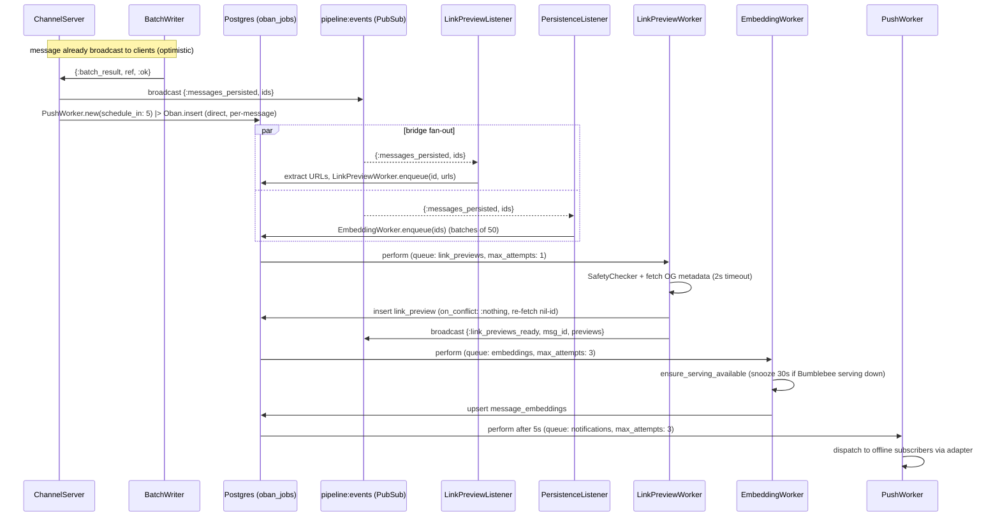

# Background Jobs & Workers (Oban)

**Status:** Reference
**Zoom level:** L1 (cross-cutting subsystem — the "X" view of all background work)
**Scope:** The entire Oban background-job ecosystem — the single queue/plugin configuration, all 11 workers, what triggers each one, their retry and uniqueness semantics, every enqueue path (the `pipeline:events` PubSub bridge, direct `ChannelServer` enqueues, cron, and synchronous context calls), and the operational rules that keep a failing job from cascading into a full outage. This is the map of *everything that runs off the request path*.

---

## 1. Overview

Slackex pushes all non-realtime, fallible, or rate-sensitive work onto **Oban** (Postgres-backed job queue). The realtime hot path stays free of these concerns: a user's message is broadcast over PubSub and persisted by `BatchWriter` before any background job runs (see `docs/architecture/realtime-chat.md`). Only *after* a batch is durably written do downstream jobs fire — embeddings, link previews, push notifications.

There are **11 workers** across six queues. They fall into two trigger classes:

- **6 cron workers** driven by `Oban.Plugins.Cron` — periodic maintenance, reconciliation, and metrics emission.
- **5 event-triggered workers** enqueued in response to application activity — analytics tracking, embeddings, link previews, push notifications, and Sous facet generation.

Three design facts shape the whole subsystem and are worth holding in mind while reading:

1. **Jobs are enqueued by three distinct mechanisms, not one.** Some flow through the `pipeline:events` PubSub bridge (embeddings, link previews); push notifications are enqueued **directly** by `ChannelServer` in the same handler but *without* the bridge; the rest are enqueued by synchronous context calls (`Analytics.track/3`, the Sous drawer) or by cron.
2. **The bridge listeners are non-essential and started `restart: :temporary`.** A crash loop in the embeddings/link-preview/factory listeners must *not* exhaust the root supervisor budget and take the app down — the incident precedent (v0.5.36) is codified in `CLAUDE.md` and `lib/slackex/application.ex`.
3. **A worker's `perform/1` must return its result.** Returning `:ok` when the underlying operation failed silently denies Oban its only retry signal. This is the single most load-bearing rule in the subsystem and the direct cause of the v0.5.36 outage (Section 6.1).

> **Embeddings dev vs. prod (current state).** The GPU is off-limits on the production host, but embeddings are **not** disabled or stubbed in prod. The configured client differs by environment: **prod uses `Slackex.Embeddings.OpenAIClient`** (API-based, same all-MiniLM-L6-v2 / 384-dim model, no local EXLA), **dev uses `BumblebeeClient`** (local EXLA serving), and **base config + test use `StubClient`**. This changes the `EmbeddingWorker` execution path (Section 5, Section 6.4), not whether embeddings run.

---

## 2. C4 Diagrams

### 2.1 Container Diagram

```mermaid
C4Container
  title Container Diagram -- Slackex Background-Job Ecosystem

  Person(user, "Chat User")

  Container_Boundary(slackex, "Slackex Application") {
    Container(channel_server, "ChannelServer", "GenServer", "Realtime coordinator; after a durable batch write, broadcasts pipeline:events and directly enqueues PushWorker")
    Container(batch_writer, "BatchWriter", "Task + Ecto", "Epoch-fenced batch inserts; success path triggers ChannelServer's post-persist handler")

    Container(pipeline_topic, "pipeline:events", "PubSub topic", "{:messages_persisted, ids} fan-out after each successful batch")
    Container(persist_listener, "Embeddings.PersistenceListener", "GenServer (restart: :temporary)", "Subscribes pipeline:events -> EmbeddingWorker.enqueue/1")
    Container(link_listener, "Links.LinkPreviewListener", "GenServer (restart: :temporary)", "Subscribes pipeline:events -> LinkPreviewWorker.enqueue/2")
    Container(factory_notifier, "Factory.ChannelNotifier", "GenServer (restart: :temporary)", "Subscribes factory:events -> posts chat message (no Oban job)")

    Container(analytics_ctx, "Analytics", "Elixir Context", "track/3 -> TrackWorker.new |> Oban.insert")
    Container(sous_live, "SousLive.InService", "LiveView", "Drawer-open / retry -> FacetWorker.new |> Oban.insert")
    Container(backfill_task, "mix slackex.backfill_embeddings", "Mix task", "EmbeddingWorker.enqueue_backfill/1")

    Container(oban, "Oban", "Job runtime", "6 queues: default/notifications/embeddings/link_previews/analytics/facets; Pruner + Cron plugins")
    Container(cron, "Oban.Plugins.Cron", "Scheduler", "Fires 6 cron workers on schedule")

    Container_Boundary(workers, "Oban Workers (11)") {
      Container(track_w, "TrackWorker", "analytics", "Persist analytics event")
      Container(embed_w, "EmbeddingWorker", "embeddings", "Generate + upsert vectors")
      Container(recon_w, "ReconciliationWorker", "embeddings cron", "Find unembedded -> enqueue EmbeddingWorker")
      Container(link_w, "LinkPreviewWorker", "link_previews", "Fetch OG metadata, store preview")
      Container(push_w, "PushWorker", "notifications", "Dispatch FCM/APNs/web-push")
      Container(subclean_w, "SubscriptionCleanupWorker", "notifications cron", "Probe + sample web_push tokens")
      Container(facet_w, "FacetWorker", "facets", "LLM facet text per (work_item, viewer)")
      Container(cache_w, "CacheWarmer", "default cron", "Pre-warm hot channels")
      Container(life_w, "LifecycleWorker", "default cron", "Release stale factory claims")
      Container(prune_w, "PruneWorker", "analytics cron", "Delete aged analytics events")
      Container(metrics_w, "MetricsBridge", "analytics cron", "Emit analytics -> telemetry")
    }
  }

  ContainerDb(postgres, "PostgreSQL", "oban_jobs table + all domain tables")
  System_Ext(llm, "LLM API", "Sous facet completions")
  System_Ext(embed_api, "Embedding API / local EXLA", "OpenAIClient (prod) / Bumblebee (dev)")
  System_Ext(push_ext, "FCM / APNs / Web Push", "Device push delivery")
  System_Ext(prom, "Prometheus", "Scrapes telemetry metrics")

  Rel(user, channel_server, "Sends messages handled by")
  Rel(batch_writer, channel_server, "Reports {:batch_result, ref, :ok} to")
  Rel(channel_server, pipeline_topic, "Broadcasts {:messages_persisted, ids} to")
  Rel(channel_server, push_w, "Directly enqueues (Oban.insert)")
  Rel(pipeline_topic, persist_listener, "Delivers to")
  Rel(pipeline_topic, link_listener, "Delivers to")
  Rel(persist_listener, embed_w, "Enqueues")
  Rel(link_listener, link_w, "Enqueues")
  Rel(analytics_ctx, track_w, "Enqueues")
  Rel(sous_live, facet_w, "Enqueues")
  Rel(backfill_task, embed_w, "Enqueues backfill job")
  Rel(cron, recon_w, "Fires")
  Rel(cron, cache_w, "Fires")
  Rel(cron, life_w, "Fires")
  Rel(cron, prune_w, "Fires")
  Rel(cron, metrics_w, "Fires")
  Rel(cron, subclean_w, "Fires")
  Rel(recon_w, embed_w, "Enqueues")
  Rel(oban, postgres, "Stores/locks jobs in oban_jobs")
  Rel(embed_w, embed_api, "Generates vectors via")
  Rel(facet_w, llm, "Completes via")
  Rel(push_w, push_ext, "Dispatches via adapter")
  Rel(metrics_w, prom, "Emits telemetry scraped by")
```



### 2.2 Representative Job Flow — Message Persisted -> Link Preview



Note the two enqueue mechanisms in one handler: **embeddings and link previews ride the `pipeline:events` bridge**, while **push notifications are enqueued directly** with `Oban.insert`. The bridge decouples downstream concerns from `ChannelServer` and gives the `ReconciliationWorker` cron a place to backstop missed events; push has no such backstop because a missed push is acceptable, whereas a missing embedding silently degrades search.

---

## 3. How To Read This Document

- Start with the **Container Diagram** (2.1) for the whole landscape: who enqueues, which queues exist, which workers run.
- Use **Oban Configuration** (4) as the reference for queue concurrency, plugins, and the cron schedule.
- **Worker Catalog** (5) is the per-worker table plus the "why" behind each one's retry/uniqueness choices.
- **Enqueue Paths** (6) shows exactly how each worker gets its jobs — bridge, direct, synchronous, or cron.
- **Operational Rules & Failure Modes** (7) is the section to read before touching any `perform/1` or adding a worker — it is the codified incident knowledge.

### Terms Used Here

| Term | Meaning |
|---|---|
| Cron worker | A worker fired on a schedule by `Oban.Plugins.Cron`, with no application caller |
| Event-triggered worker | A worker enqueued in response to app activity (a message, a track call, a drawer open) |
| `pipeline:events` bridge | The `{:messages_persisted, ids}` PubSub topic that fans persisted-message IDs out to listener GenServers, which then enqueue jobs |
| Listener | A supervised GenServer subscribing to a PubSub topic and enqueuing Oban jobs (`restart: :temporary`) |
| Uniqueness | Oban's dedup: a new job matching an existing job's fields/keys within a period is not inserted |
| Snooze | `{:snooze, seconds}` — Oban requeues the job to run later without consuming an attempt |
| Discard | `{:discard, reason}` — Oban marks the job discarded; it will not retry |

---

## 4. Oban Configuration

All configuration lives in `config/config.exs` (`config :slackex, Oban, ...`), with `config/test.exs` overriding to inline execution.

### 4.1 Queues

```elixir
queues: [
  default: 10,
  notifications: 20,
  embeddings: 5,
  link_previews: 5,
  analytics: 5,
  facets: 3
]
```

The number is the per-node concurrency limit. The split is deliberate:

- **`notifications: 20`** — highest concurrency; push fan-out is I/O-bound (one job per message, each touching many device tokens) and latency-sensitive.
- **`embeddings: 5` / `link_previews: 5`** — bounded so a burst of messages can't saturate the node with model/HTTP calls.
- **`facets: 3`** — the most constrained; each job is an LLM completion, the most expensive and rate-limited dependency.
- **`default: 10`** — cron maintenance (`CacheWarmer`, `LifecycleWorker`) plus anything unqueued.

### 4.2 Plugins

```elixir
plugins: [
  Oban.Plugins.Pruner,
  {Oban.Plugins.Cron, crontab: [ ... ]}
]
```

- **`Oban.Plugins.Pruner`** — configured with no options, so it uses Oban's default retention for completed/discarded jobs. It keeps the `oban_jobs` table from growing unbounded; without it, the LXC disk (a known constraint — see project memory) would fill.
- **`Oban.Plugins.Cron`** — the scheduler for the 6 periodic workers (Section 4.3).

### 4.3 Cron Schedule

| Cron expression | Worker | Cadence | Purpose |
|---|---|---|---|
| `0 * * * *` | `Slackex.Workers.CacheWarmer` | hourly | Pre-warm `ChannelServer`/caches for recently active channels |
| `*/15 * * * *` | `Slackex.Embeddings.ReconciliationWorker` | every 15 min | Safety net: enqueue embeddings for messages the bridge missed |
| `*/2 * * * *` | `Slackex.Factory.LifecycleWorker` | every 2 min | Release stale dark-factory run claims |
| `0 3 * * *` | `Slackex.Analytics.PruneWorker` | daily 03:00 | Delete analytics events past retention |
| `* * * * *` | `Slackex.Analytics.MetricsBridge` | every minute | Emit analytics aggregates as telemetry for Prometheus |
| `0 4 1 * *` | `Slackex.Notifications.SubscriptionCleanupWorker` | monthly | Sample-probe web_push tokens for expiry |

### 4.4 Testing

`config/test.exs` sets `config :slackex, Oban, testing: :inline`. Jobs run **synchronously in the enqueuing process** during tests — `Oban.insert` executes `perform/1` immediately. This is why the project's spec-driven acceptance rule (`CLAUDE.md`) insists on exercising the full producer→consumer path (`send_message` → bridge → `assert_enqueued`) rather than faking the upstream event: inline testing makes the real wiring observable.

---

## 5. Worker Catalog

| Worker | File | Queue | Trigger | Max attempts | Unique? |
|---|---|---|---|---|---|
| `Slackex.Analytics.MetricsBridge` | `lib/slackex/analytics/metrics_bridge.ex` | `analytics` | cron (every minute) | 1 | yes — `[period: 55]` |
| `Slackex.Analytics.PruneWorker` | `lib/slackex/analytics/prune_worker.ex` | `analytics` | cron (daily 03:00) | 1 | no |
| `Slackex.Analytics.TrackWorker` | `lib/slackex/analytics/track_worker.ex` | `analytics` | `Analytics.track/3` | 3 | no |
| `Slackex.Embeddings.EmbeddingWorker` | `lib/slackex/embeddings/embedding_worker.ex` | `embeddings` | listener / reconciliation / backfill task | 3 (priority 3) | conditional (backfill only) |
| `Slackex.Embeddings.ReconciliationWorker` | `lib/slackex/embeddings/reconciliation_worker.ex` | `embeddings` | cron (every 15 min) | 1 | no |
| `Slackex.Factory.LifecycleWorker` | `lib/slackex/factory/lifecycle_worker.ex` | `default` | cron (every 2 min) | 1 | no |
| `Slackex.Links.LinkPreviewWorker` | `lib/slackex/links/link_preview_worker.ex` | `link_previews` | `LinkPreviewListener` | 1 | yes — `[fields: [:args], keys: [:message_id], period: 60]` |
| `Slackex.Notifications.PushWorker` | `lib/slackex/notifications/push_worker.ex` | `notifications` | `ChannelServer` (direct) | 3 | no |
| `Slackex.Notifications.SubscriptionCleanupWorker` | `lib/slackex/notifications/subscription_cleanup_worker.ex` | `notifications` | cron (monthly) | 1 | no |
| `Slackex.Sous.FacetWorker` | `lib/slackex/sous/facet_worker.ex` | `facets` | `SousLive.InService` (drawer open / retry) | 3 | yes — `[period: :infinity, fields: [:worker, :args], keys: [:work_item_id, :viewer_id, :prompt_version, :state_version]]` |
| `Slackex.Workers.CacheWarmer` | `lib/slackex/workers/cache_warmer.ex` | `default` | cron (hourly) | 1 | no |

### Per-worker notes (the "why")

- **`MetricsBridge` (`unique: [period: 55]`, max_attempts 1).** Runs every minute on *every* node, but the 55s uniqueness window ensures only one node actually executes per tick — cheap cluster-wide single-execution without a leader election. `max_attempts: 1` is correct: a missed minute of metrics is self-healing on the next tick, so retries would only double-emit. Gated behind the `:website_analytics` flag.
- **`PruneWorker` / `SubscriptionCleanupWorker` / `LifecycleWorker` / `CacheWarmer` (cron, max_attempts 1).** All idempotent maintenance — re-running on the next scheduled tick is the recovery path, so a single attempt is the right budget. `LifecycleWorker` is gated behind `:dark_factory`; `SubscriptionCleanupWorker` behind `:push_notifications`.
- **`TrackWorker` (max_attempts 3, no uniqueness).** Persists one analytics event. Returns `{:error, changeset}` on validation failure precisely *so Oban retries* — a transient DB blip shouldn't drop an event.
- **`EmbeddingWorker` (max_attempts 3, priority 3, conditional uniqueness).** Two job shapes: **batch** (`%{"message_ids" => [...]}`, enqueued in chunks of 50, *not* unique) and **backfill** (`%{"channel_id"|"dm_conversation_id" => id, "backfill" => true}`, **unique** with `[period: 3600, keys: [...]]` to stop duplicate channel backfills within an hour). It snoozes 30s (`{:snooze, 30}`) when the configured client is `BumblebeeClient` and `EmbeddingServing` isn't running yet — relevant only in dev; prod's `OpenAIClient` and test's `StubClient` are pass-throughs.
- **`ReconciliationWorker` (max_attempts 1).** The durability backstop for the `pipeline:events` bridge: if `PersistenceListener` was down during a `{:messages_persisted, ...}` broadcast (deploy, restart, node loss), this cron LEFT-JOINs `messages` against `message_embeddings` over a 1-hour lookback and feeds the gaps back into `EmbeddingWorker.enqueue/1`. This is *why* the bridge listener can safely be `restart: :temporary`.
- **`LinkPreviewWorker` (max_attempts 1, unique per `:message_id`/60s).** Single attempt by design — "if a URL can't load fast and clean, it doesn't get a preview"; a failed fetch is stored as a `"blocked"` preview, not retried. Uniqueness stops duplicate preview jobs for the same message within a minute. Uses the Ecto `on_conflict: :nothing` + nil-id re-fetch pattern (the project's documented upsert-safety rule).
- **`PushWorker` (max_attempts 3, no uniqueness).** Fans out per subscriber and per device token, accumulating the *first* error and returning it so Oban retries (Section 6.3). Re-pushing already-delivered tokens on retry is acceptable because the client service worker dedupes on the `tag` field. Gated behind `:push_notifications`.
- **`FacetWorker` (max_attempts 3, `unique: [period: :infinity, ...]`).** The only LLM caller in Sous. Uniqueness keys include `state_version`, which the worker passes through to the event payload **unchanged** — re-querying `Sous.state_version/1` inside `perform/1` would write a different value than the one hashed into the uniqueness key at enqueue time and silently defeat dedup. Returns `{:discard, :llm_not_configured}` / `{:discard, :missing_dependency}` for non-retryable conditions and `{:error, reason}` for retryable LLM failures (Section 6.3).

---

## 6. Enqueue Paths

There is no single enqueue funnel. Jobs reach `oban_jobs` four ways:

### 6.1 The `pipeline:events` bridge (embeddings + link previews)

After a successful batch write, `ChannelServer` (`handle_info({:batch_result, ref, :ok}, ...)`, `lib/slackex/messaging/channel_server.ex`) broadcasts `{:messages_persisted, message_ids}` on the `"pipeline:events"` topic. Two `restart: :temporary` listener GenServers subscribe:

- `Slackex.Embeddings.PersistenceListener` → `EmbeddingWorker.enqueue/1` (chunks of 50).
- `Slackex.Links.LinkPreviewListener` → loads the messages, extracts URLs, `LinkPreviewWorker.enqueue/2`.

This is a real producer→consumer bridge (the failure mode it guards against — a designed-but-never-implemented broadcast — is the v0.5.47–v0.5.64 incident in `CLAUDE.md`). The `ReconciliationWorker` cron is the embeddings safety net if a listener misses a broadcast. See `docs/architecture/deep-dive-pipeline-events-bridge.md`.

### 6.2 Direct enqueue from `ChannelServer` (push)

In the **same** `{:batch_result, ref, :ok}` handler, `ChannelServer` calls `enqueue_push_notification/3` per message, which does `PushWorker.new(schedule_in: 5) |> Oban.insert` (channel) or `PushWorker.new() |> Oban.insert` (DM). This does **not** go through `pipeline:events` — it is a direct insert, wrapped in `rescue` so a failed enqueue only logs a warning and never crashes the realtime coordinator. Push is fire-and-forget at the enqueue boundary because a missed push is acceptable; a missed embedding is not.

### 6.3 Synchronous context / LiveView enqueue

- **`Analytics.track/3`** (`lib/slackex/analytics.ex`) → `TrackWorker.new() |> Oban.insert`. Analytics events are validated and persisted asynchronously off the request path.
- **`SousLive.InService`** (`lib/slackex_web/live/sous_live/in_service.ex`) → `FacetWorker.new() |> Oban.insert`, lazily on facet-drawer open (one job per viewer whose pill state needs generation) and on manual retry of a `:failed` facet. Never fired by `:state_changed` (Sous invariant #14).
- **`mix slackex.backfill_embeddings`** → `EmbeddingWorker.enqueue_backfill/1` for whole-channel/DM backfills.

### 6.4 Cron

The 6 cron workers (Section 4.3) have no application caller; `Oban.Plugins.Cron` inserts them on schedule. `ReconciliationWorker` is itself an enqueue *source* — it cron-fires and then enqueues `EmbeddingWorker` jobs, so `EmbeddingWorker` is fed by both the bridge and cron.

---

## 7. Operational Rules & Failure Modes

### 7.1 `perform/1` must return its result (the v0.5.36 rule)

**Never discard a `perform/1` return with `_ = result; :ok` or by returning a bare `:ok` after a fallible operation.** Oban's *only* signal that a job failed — and therefore should retry — is the return value. Swallowing it makes every job look successful regardless of outcome.

This is not theoretical. The **v0.5.36 production outage (8+ hours)**: `EmbeddingWorker` swallowed errors, the failures cascaded through the supervisor, and the entire app went down — *all CI gates had passed* because nothing surfaced the swallowed failure. Full RCA: `../rca/2026-03-05-embedding-cascade-app-crash.md`.

A **hook warns on `_ =` in `*_worker.ex` files** to catch regressions at commit time. Two `_ =` assignments currently exist in worker files, and **both are audited-intentional side effects, not discarded job results** — they are exactly what the hook is meant to make you stop and justify:

- `link_preview_worker.ex:43` — `_ =` on a fire-and-forget PubSub broadcast. The worker is `max_attempts: 1` and *intentionally* always returns `:ok` (a failed fetch becomes a stored `"blocked"` preview); there is nothing to retry.
- `embedding_worker.ex:229` — `_ =` inside the backfill loop's deliberate continue-on-error (commented as such): one bad batch logs and the backfill proceeds rather than aborting. The **main batch `perform/1` returns `{:error, reason}` correctly** via its `with` pipeline.

The positive examples are the clearest statement of the rule:

- **`PushWorker`** reduces over subscribers/tokens, accumulates the first error, and *returns* it so Oban retries — while relying on client-side `tag` dedup to make retry safe.
- **`FacetWorker`** distinguishes non-retryable (`{:discard, ...}`) from retryable (`{:error, reason}`) and returns the right one for each, so the LLM dependency gets retried but a missing work item doesn't loop forever.

### 7.2 Non-essential bridges run `restart: :temporary`

`PersistenceListener`, `LinkPreviewListener`, and `ChannelNotifier` are started with `restart: :temporary` in `lib/slackex/application.ex` (root supervisor, `:one_for_one`). If one crash-loops, the root supervisor will **not** restart it, so its restart budget can't be exhausted and trigger a cascading shutdown of essential children (Repo, PubSub, Endpoint). The same reasoning applies to the conditional `Embeddings.Supervisor` (`maybe_embedding_serving/0`, only added when the client is `BumblebeeClient`) — embeddings degrade rather than take the app down. This is the structural fix for the v0.5.36 cascade class.

The tradeoff: a `:temporary` listener that dies stays dead until the next deploy/restart. For embeddings, `ReconciliationWorker` covers the gap. For link previews (cosmetic) and factory notifications (non-critical), a gap is tolerable by design.

### 7.3 Retry, backoff, and discard semantics

- **`max_attempts: 1`** (all cron workers, `LinkPreviewWorker`) — single attempt; recovery is the next scheduled run or, for link previews, simply no preview. Use this only where a retry adds no value.
- **`max_attempts: 3`** (`TrackWorker`, `EmbeddingWorker`, `PushWorker`, `FacetWorker`) — bounded retries with Oban's default exponential backoff for transient failures (DB blips, API timeouts, rate limits).
- **`{:snooze, n}`** (`EmbeddingWorker`) — requeue without consuming an attempt; used when a dependency (the Bumblebee serving) isn't ready yet.
- **`{:discard, reason}`** (`FacetWorker`) — terminal, no retry; used for permanent conditions (LLM unconfigured, deleted dependency) so the job doesn't burn its retry budget on something that can never succeed.

### 7.4 Failure matrix

| Scenario | Behavior | Recovery |
|---|---|---|
| Worker `perform/1` returns `{:error, _}` (attempts remain) | Oban retries with backoff | Automatic |
| Worker `perform/1` exhausts `max_attempts` | Job marked `discarded`; Pruner eventually removes it | Manual replay / cron backstop |
| A `pipeline:events` listener is down during a broadcast | Embedding/link-preview jobs for those messages are not enqueued | Embeddings: `ReconciliationWorker` (15 min). Link previews: none (cosmetic) |
| A bridge listener crash-loops | `restart: :temporary` → not restarted; stays down | Next deploy/restart; app stays up |
| `EmbeddingServing` not running (dev/Bumblebee) | `EmbeddingWorker` snoozes 30s | Auto when serving comes up |
| LLM not configured | `FacetWorker` discards (`:llm_not_configured`) | Configure client; new drawer-open re-enqueues |
| Feature flag off | Flag-gated workers no-op and return `:ok` | Enable flag |
| Postgres unavailable | `Oban.insert` and `perform` fail; jobs not lost (Postgres-backed) | DB recovery; pending jobs resume |

---

## 8. Code Map

| File | Responsibility |
|---|---|
| `config/config.exs` | Oban config: 6 queues, Pruner, Cron crontab (6 entries) |
| `config/test.exs` | `Oban, testing: :inline` |
| `lib/slackex/application.ex` | Starts `{Oban, ...}`, the 3 `restart: :temporary` listeners, conditional embedding serving |
| `lib/slackex/messaging/channel_server.ex` | Broadcasts `pipeline:events`; directly enqueues `PushWorker` after a durable batch |
| `lib/slackex/embeddings/persistence_listener.ex` | `pipeline:events` → `EmbeddingWorker.enqueue/1` |
| `lib/slackex/links/link_preview_listener.ex` | `pipeline:events` → `LinkPreviewWorker.enqueue/2` |
| `lib/slackex/factory/channel_notifier.ex` | `factory:events` → posts chat message (no Oban job) |
| `lib/slackex/analytics.ex` | `track/3` → `TrackWorker` |
| `lib/slackex_web/live/sous_live/in_service.ex` | Drawer-open / retry → `FacetWorker` |
| `lib/slackex/analytics/metrics_bridge.ex` | Cron: analytics aggregates → telemetry |
| `lib/slackex/analytics/prune_worker.ex` | Cron: delete aged analytics events |
| `lib/slackex/analytics/track_worker.ex` | Persist one analytics event |
| `lib/slackex/embeddings/embedding_worker.ex` | Generate/upsert embeddings; batch + backfill |
| `lib/slackex/embeddings/reconciliation_worker.ex` | Cron: backstop for missed embeddings |
| `lib/slackex/factory/lifecycle_worker.ex` | Cron: release stale factory claims |
| `lib/slackex/links/link_preview_worker.ex` | Fetch OG metadata, store preview, broadcast |
| `lib/slackex/notifications/push_worker.ex` | Dispatch push via configurable adapter |
| `lib/slackex/notifications/subscription_cleanup_worker.ex` | Cron: sample-probe web_push tokens |
| `lib/slackex/sous/facet_worker.ex` | LLM facet text per `(work_item, viewer)` |
| `lib/slackex/workers/cache_warmer.ex` | Cron: pre-warm hot channels |

---

## 9. Related Documents

- `deep-dive-pipeline-events-bridge.md` — the `{:messages_persisted, ...}` producer→consumer bridge in full, including the listener-down failure mode and the spec-driven acceptance-test rule
- `deep-dive-embedding-resilience.md` — how the embedding path tolerates failure (snooze, reconciliation backstop, `restart: :temporary` serving)
- `embeddings.md` — the embeddings subsystem end to end (model, clients per environment, search integration)
- `observability-and-ops.md` — telemetry/metrics emitted by these workers (notably `MetricsBridge`) and how they reach Prometheus/Grafana
- `../rca/2026-03-05-embedding-cascade-app-crash.md` — the v0.5.36 incident that codified the `perform/1`-must-return and `restart: :temporary` rules
