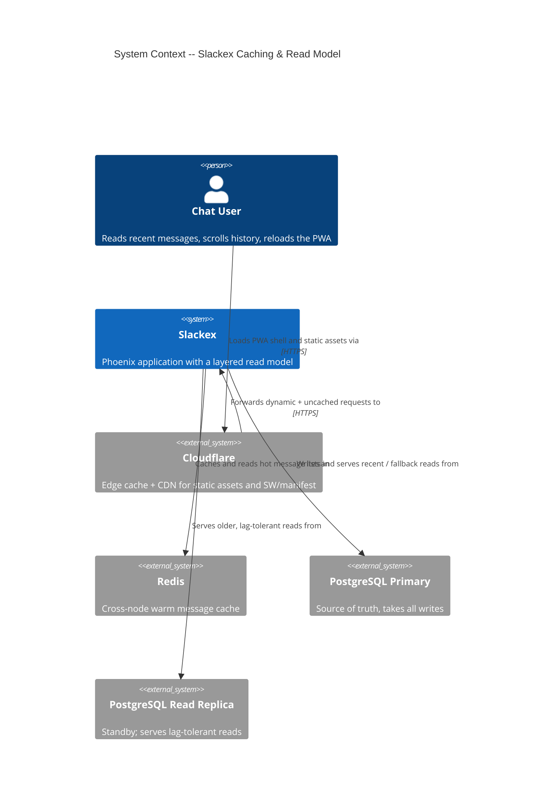
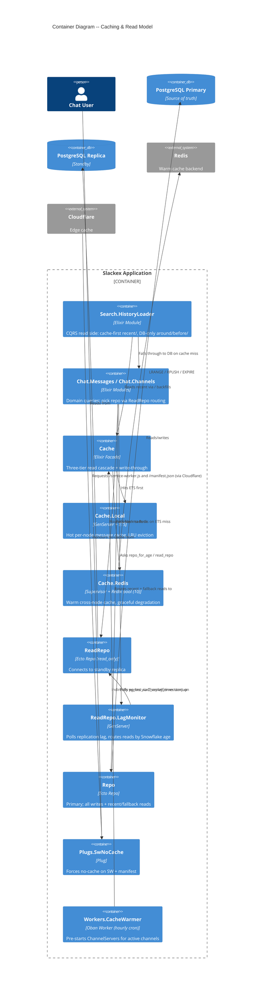
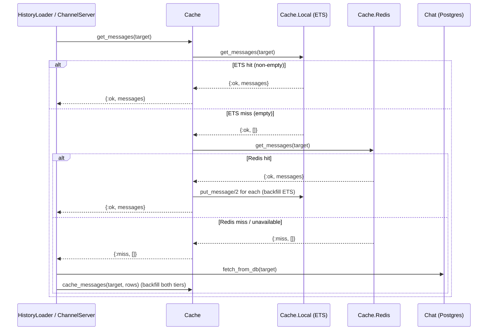
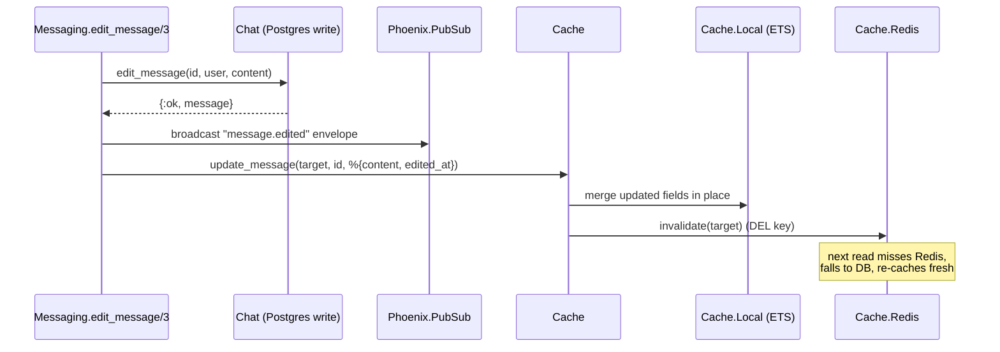
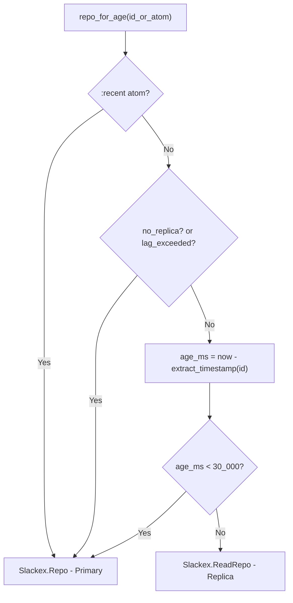
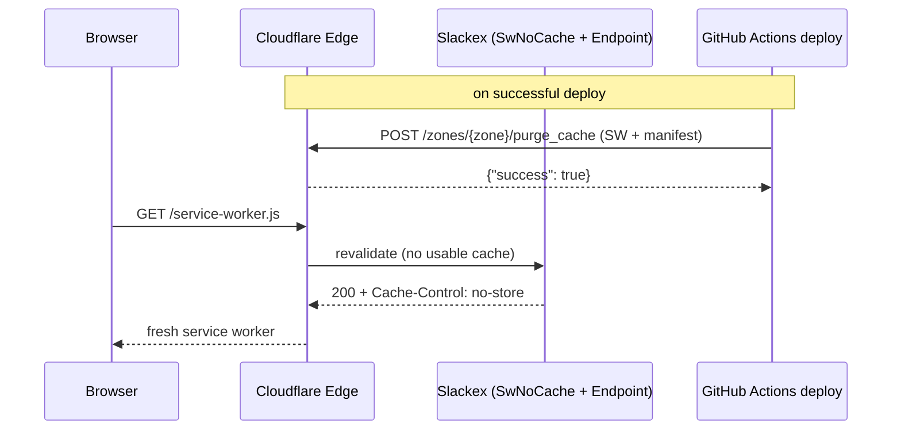

# Caching & Read Model Architecture

**Status:** Reference
**Scope:** `Slackex.Cache` (ETS + Redis tiers), `Slackex.ReadRepo` (CQRS read replica + lag-aware fallback), `Slackex.Search.HistoryLoader` (cache-first read side), cache invalidation on writes, and edge caching (Cloudflare `Cache-Control` headers + auto-purge on deploy).

---

## 1. Overview

Slackex serves message reads through a layered read model that favours speed first and falls back gracefully when a faster layer misses or fails. There are two independent concerns:

1. **In-cluster message caching** — `Slackex.Cache` is a three-tier cascade: ETS (hot, per-node) → Redis (warm, cross-node) → miss. On a miss the caller falls through to the database. Writes are write-through to ETS (synchronous, authoritative) and best-effort to Redis (never blocks the send path).
2. **Read/write split at the database** — `Slackex.ReadRepo` is a `read_only: true` Ecto repo pointed at a PostgreSQL standby. `Slackex.ReadRepo.LagMonitor` watches replication lag and, combined with the timestamp embedded in each Snowflake ID, decides per query whether a read is safe to serve from the replica or must hit the primary to preserve read-your-writes.

The surprising design choice that ties these together is **age-aware routing**. Because every message ID is a Snowflake that embeds its creation time, the system can ask "is this row younger than the replica could plausibly have replicated?" without any locks or session tracking. Recent reads go to the primary; older reads go to the replica. The same time signal lets the cache layer keep only *recent* messages hot (older history is never cached).

At the edge, Cloudflare caches static assets. Two of those assets — the service worker and the PWA manifest — must never be stale after a deploy, so a dedicated plug forces `no-cache` on them and CI purges them from Cloudflare's edge after every successful deploy.

---

## 2. C4 Diagrams

### 2.1 System Context



### 2.2 Container Diagram



---

## 3. How To Read This Document

- Start with the **System Context** to see the external systems the read model depends on (Cloudflare, Redis, primary + replica Postgres).
- Use the **Container Diagram** to see the internal modules and which layer each owns.
- Use the **sequence diagrams** in §5–§7 for runtime behaviour: the read cascade, write-through invalidation, and lag-aware routing.
- Use the **Code Map** in §10 as the index from concept to source file.

### Terms Used Here

| Term | Meaning |
|---|---|
| Target | The tuple identifying a conversation: `{:channel, id}` or `{:dm, id}` |
| Hot tier | `Cache.Local` — per-node ETS, authoritative for cached data |
| Warm tier | `Cache.Redis` — cross-node Redis cache, advisory |
| Write-through | Writing to the cache at the same time as (not after) the source mutation |
| Snowflake age | `now - extract_timestamp(id)`; how long ago a message ID was minted |
| No-replica mode | Runtime state where `ReadRepo` and `Repo` point at the same database |
| Lag fallback | Routing a read to the primary because the replica is too far behind |

---

## 4. Main Components

| Component | Responsibility |
|---|---|
| `Slackex.Cache` | Three-tier read cascade and write-through facade over Local + Redis |
| `Slackex.Cache.Local` | GenServer owning a public ETS table; hot cache with LRU target eviction |
| `Slackex.Cache.Redis` | Supervisor over a 10-connection Redix pool; warm cross-node cache with graceful degradation |
| `Slackex.Search.HistoryLoader` | CQRS read side: cache-first `recent/2`, DB-only `around/3` and `before/3` |
| `Slackex.ReadRepo` | `read_only: true` Ecto repo bound to the standby replica |
| `Slackex.ReadRepo.LagMonitor` | Polls replication lag; exposes `repo_for_age/1`, `read_repo/0`, `lag_exceeded?/0`, `no_replica?/0` |
| `Slackex.Chat.Messages` / `Slackex.Chat.Channels` | Domain read queries that select a repo via the lag monitor |
| `SlackexWeb.Plugs.SwNoCache` | Forces `no-cache` on `/service-worker.js` and `/manifest.json` |
| `Slackex.Workers.CacheWarmer` | Hourly Oban cron job that pre-starts `ChannelServer`s for active channels |

---

## 5. Read Path: The Three-Tier Cascade

`Cache.get_messages/1` walks the tiers in order and stops at the first hit. The hot tier is consulted directly against the public ETS table (no GenServer round-trip), so a hit is microsecond-cheap. Only on an ETS miss does it touch Redis, and a Redis hit **backfills ETS** so the next read on this node is hot again.



Two callers exercise this path:

- `Slackex.Search.HistoryLoader.recent/2` — on a cache miss it queries the database via `Chat.list_messages/2` or `Chat.list_dm_messages/2`, reverses to chronological order (the DB returns newest-first), then backfills *both* tiers with `Cache.cache_messages/2`. Ecto structs are not JSON-serialisable, so before caching they pass through `struct_to_map/1`, which drops `__meta__`, skips `Ecto.Association.NotLoaded` fields, recurses into the preloaded `:sender` struct, and leaves calendar types (`DateTime` et al.) intact because `Jason` already knows how to encode them.
- `Slackex.Messaging.ChannelServer` — on process init it calls `Cache.get_messages/1`; a hit seeds the in-memory queue from cache, a miss loads from the DB. See [realtime-chat.md](realtime-chat.md) for the full `ChannelServer` lifecycle.

`HistoryLoader.around/3` and `before/3` deliberately **bypass the cache**: deep-link navigation and upward pagination touch older messages that aren't worth keeping hot.

### 5.1 Hot tier internals (`Cache.Local`)

The ETS table `:slackex_message_cache` is a `:set`, `:public`, `:named_table` with `read_concurrency` and `write_concurrency` enabled. Entries are `{target, [message, ...], monotonic_ts_ms}` with messages stored newest-first and reversed to chronological order on read.

Reads (`get_messages/1`) and `invalidate/1` go straight to ETS. Mutations (`put_message/2`, `update_message/3`, `remove_message/3`) go through the GenServer so eviction and timestamp bookkeeping stay serialised. Two bounds protect memory:

- **200 messages per target** (`@max_messages_per_channel`) — trimmed on every `put_message`.
- **1,000 tracked targets** (`@max_channels`) — when exceeded, `maybe_evict/0` scans the whole table with `:ets.foldl` and deletes the least-recently-written entry. The scan is O(n) but only fires past the threshold; cold targets age out naturally.

### 5.2 Warm tier internals (`Cache.Redis`)

A `Supervisor` (one-for-one) starts ten named Redix connections (`:redix_0`..`:redix_9`); each command picks one at random. Configuration constants: message TTL `3_600`s (1h), cursor TTL `86_400`s (24h), write timeout `100`ms, default command timeout `5_000`ms. The Redis URL comes from `Application.get_env(:slackex, :redis_url, "redis://localhost:6379")`.

Keys are namespaced:

```
msgs:channel:{id}            channel message list (LRANGE 0 199)
msgs:dm:{id}                 DM message list
cursor:{uid}:channel:{id}    per-user read cursor (last-read message id)
cursor:{uid}:dm:{id}         DM read cursor
```

Messages are stored as `Jason`-encoded JSON. On read, `decode_message/1` re-atomises a known key allowlist (`id`, `content`, `sender_id`, `inserted_at`, `channel_id`, `dm_conversation_id`, `sender`) via `String.to_existing_atom/1`, parses `inserted_at` back from ISO8601, and recurses into the nested `sender` map. The allowlist + `to_existing_atom` guards against atom-table exhaustion from untrusted/garbage keys.

Writes are pipelined to cut round-trips: `push_message/2` is `[RPUSH, LTRIM -200 -1, EXPIRE 3600]`; `cache_messages/2` is `[DEL, RPUSH×N, EXPIRE]`. The read cursor used by `Slackex.Notifications.CatchupServer` (`Cache.get_read_cursor/2`) lives only in Redis — there is no ETS tier for cursors.

**Graceful degradation is the whole point of this module.** `command/2` and `pipeline/2` wrap Redix calls in `rescue`, and every public function maps failure to a benign sentinel (`{:miss, []}`/`:miss` for reads, `:ok` for writes). The write/invalidate paths (`push_message/2`, `cache_messages/2`, `invalidate/1`, `set_read_cursor/3`) log a `Logger.warning` on error; the read paths (`get_messages/1`, `get_read_cursor/2`) degrade silently to the miss sentinel. A write timeout additionally emits `[:slackex, :cache, :redis_write_timeout]` telemetry. The result: if Redis is slow or down, message sends are never blocked and reads simply fall through to the database.

---

## 6. Write Path & Invalidation

Writes keep ETS authoritative and treat Redis as advisory. The facade behaves differently for appends versus edits/deletes:

| Operation | `Cache` call | ETS | Redis | Where invoked |
|---|---|---|---|---|
| Send | `put_message/2` | append (write-through) | best-effort RPUSH | `ChannelServer` send (`channel_server.ex:152`) |
| Edit | `update_message/3` | in-place `Map.merge` by id | **invalidate** (DEL) | `Messaging.edit_message/3` |
| Delete | `remove_message/3` | filter out by id | **invalidate** (DEL) | `Messaging.delete_message/3` |
| Bulk backfill | `cache_messages/2` | put each | DEL + RPUSH all | `HistoryLoader.recent/2` miss |



The asymmetry is deliberate. Appends are cheap to apply identically to both tiers. Partial field updates (an `edited_at` change, a soft-delete) are awkward to splice into a JSON list inside Redis without read-modify-write races, so the simpler and safer move is to **delete the Redis key and let the next read backfill from the database**. ETS, being local and serialised through its GenServer, is updated in place so the active node stays correct immediately. Note the broadcast happens *before* the cache write — the realtime UI never waits on cache bookkeeping (see [realtime-chat.md](realtime-chat.md)).

---

## 7. Read Replica & Lag-Aware Routing

`Slackex.ReadRepo` is a thin `use Ecto.Repo, read_only: true` repo. All routing intelligence lives in `Slackex.ReadRepo.LagMonitor`, a GenServer that exposes its decisions through `:persistent_term` flags (lock-free reads from any process).

### 7.1 Lag monitoring

On init the monitor calls `same_database?/0`, comparing the configured `url` (or hostname/port/database) of `Repo` and `ReadRepo`. If they match it enters **no-replica mode**: it stores `:slackex_read_repo_no_replica = true` and **never schedules a lag check**. This is the normal dev/test posture — `DATABASE_READ_URL` is unset so both repos point at the same database, and the overhead and sandbox-isolation hazards of polling a phantom replica are avoided.

When a real replica is configured, every 5 seconds (`@check_interval_ms`) it runs:

```sql
SELECT EXTRACT(EPOCH FROM (now() - pg_last_xact_replay_timestamp()))::float
```

and sets `:slackex_read_repo_lag_exceeded`:

- lag > `5.0`s → flag true, emit `[:slackex, :read_repo, :lag_fallback]` telemetry with `lag_seconds`.
- result is `NULL` → flag true, emit `[:slackex, :read_repo, :lag_null_standby]`. A NULL `pg_last_xact_replay_timestamp()` means no WAL has been replayed *or* this is actually the primary; in replica mode either is treated as "don't trust the replica".
- query error → flag true, log a warning. A replica we can't poll is a replica we won't read from.

### 7.2 Per-read routing by Snowflake age



`repo_for_age/1` is the read-your-writes guard. A Snowflake ID younger than 30s (`@recent_threshold_ms`) may not have reached the replica yet, so its read is forced to the primary even when lag is nominally fine. Older reads are safe on the replica. `:recent` is the explicit "I want the freshest data, don't even consider the replica" signal used for unbounded recent listings.

Call sites:

- `Chat.Messages.list_messages/2` and `list_dm_messages/2` pass `before_id || after_id || :recent` (resp. `before_id || :recent`) to `repo_for_age/1`. Paginating into old history (a `before_id`) is routed by that id's age; a fresh listing with no cursor uses `:recent` → primary.
- `Chat.Channels` uses the coarser `ReadRepo.read_repo/0`, which returns `Slackex.Repo` in no-replica mode and `ReadRepo` otherwise — channel-list reads have no per-row age, so they get a steady replica/primary choice rather than age-based routing.

The Snowflake timestamp is the same ordering signal used by the message pipeline; see [message-pipeline-and-persistence.md](message-pipeline-and-persistence.md) for ID generation and the partitioned `messages` table.

---

## 8. Edge Caching (Cloudflare)

Cloudflare fronts the application and caches static assets at the edge. Two assets are dangerous to cache: the service worker and the PWA manifest. Cloudflare's default ~4-hour edge cache for `text/javascript` / `application/manifest+json` would pin an old service worker for hours after a deploy, so clients couldn't pick up the new app shell.

Two mechanisms prevent that:

1. **Origin headers — `SlackexWeb.Plugs.SwNoCache`.** Wired in `SlackexWeb.Endpoint` *before* `Plug.Static` (so it wins the header), it matches `/service-worker.js` and `/manifest.json` and registers a `before_send` hook that sets `Cache-Control: no-cache, no-store, must-revalidate, max-age=0`, `Pragma: no-cache`, and deletes the `ETag`. This tells Cloudflare (and the browser) never to serve these without revalidating.
2. **Edge purge on deploy — CI.** The `.github/workflows/ci-deploy.yml` deploy job, on success, `POST`s to `https://api.cloudflare.com/client/v4/zones/{CF_ZONE_ID}/purge_cache` with `{"files":[".../service-worker.js",".../manifest.json"]}` using `CF_PURGE_TOKEN`. The step fails the deploy if the response isn't `"success":true`. This is the automation-over-manual-steps principle: the purge is part of the pipeline, not a console click.



---

## 9. Cache Warmer

`Slackex.Workers.CacheWarmer` is an Oban worker on the `:default` queue scheduled hourly by `Oban.Plugins.Cron` (`{"0 * * * *", Slackex.Workers.CacheWarmer}` in `config/config.exs`). `perform/1` lists channels active in the last hour (`Chat.list_active_channels(since: ...)`) and calls `ChannelSupervisor.ensure_started({:channel, channel.id})` for each. Starting a `ChannelServer` is what populates the hot path: on init it reads the cache (hit → seed from cache; miss → load from DB and the in-memory queue becomes the source for subsequent realtime reads).

This trades cold-start latency for memory: only recently-active channels are kept warm, instead of pinning every channel's process and cache entry. The worker is `max_attempts: 1` — a warm-up that fails this hour simply retries on the next cron tick; it is non-essential and must not pile up retries. `ensure_started` is idempotent, so warming an already-running channel is a no-op.

---

## 10. Code Map

| File | Responsibility |
|---|---|
| `lib/slackex/cache/cache.ex` | Three-tier facade; read cascade + write-through + invalidation |
| `lib/slackex/cache/local.ex` | ETS hot tier; GenServer-owned table, 200/target & 1000-target LRU bounds |
| `lib/slackex/cache/redis.ex` | Redix pool warm tier; key namespacing, JSON codec, graceful degradation |
| `lib/slackex/search/history_loader.ex` | CQRS read side: cache-first `recent/2`, DB-only `around/3`, `before/3`, `struct_to_map/1` |
| `lib/slackex/read_repo.ex` | `read_only` Ecto repo; delegates routing to LagMonitor |
| `lib/slackex/read_repo/lag_monitor.ex` | Lag polling, no-replica detection, `repo_for_age/1`, `read_repo/0` |
| `lib/slackex/chat/messages.ex` | `list_messages/2`, `list_dm_messages/2` — route via `repo_for_age/1` |
| `lib/slackex/chat/channels.ex` | Channel-list reads via `ReadRepo.read_repo/0` |
| `lib/slackex/messaging/messaging.ex` | `edit_message/3`, `delete_message/3` — cache update/remove + invalidation |
| `lib/slackex/messaging/channel_server.ex` | Seeds queue from cache on init; `put_message` on send |
| `lib/slackex/notifications/catchup_server.ex` | Reads per-user read cursor via `Cache.get_read_cursor/2` |
| `lib/slackex_web/plugs/sw_no_cache.ex` | Forces no-cache on SW + manifest |
| `lib/slackex_web/endpoint.ex` | Wires `SwNoCache` before `Plug.Static` |
| `lib/slackex/workers/cache_warmer.ex` | Hourly pre-warm of active channels |
| `lib/slackex/application.ex` | Supervision order: `Repo` → `ReadRepo` → `LagMonitor` → … → `Cache.Local` → `Cache.Redis` |
| `config/config.exs` | `Oban.Plugins.Cron` crontab including `CacheWarmer` |
| `.github/workflows/ci-deploy.yml` | Cloudflare edge purge of SW + manifest on successful deploy |

---

## 11. Failure Modes & Resilience

| Component | Failure | Behaviour | Blast radius |
|---|---|---|---|
| Redis | Down / refused / timeout | Reads degrade silently to `{:miss, []}`/`:miss`; write/invalidate paths return `:ok` and log a warning; a write *timeout* additionally emits telemetry; callers fall through to DB | None — sends and reads continue, just colder |
| `Cache.Local` GenServer | Crash | Restarted by `Slackex.Supervisor` (one-for-one); ETS table is process-owned so it is lost and rebuilt empty on next reads | Single node; cache repopulates lazily |
| ETS over 1000 targets | Memory pressure | LRU eviction of least-recently-written target on next `put_message` | Self-limiting; evicted targets reload from Redis/DB |
| Replica lag > 5s | Stale standby | `lag_exceeded?` flag flips; `repo_for_age/1` routes all reads to primary until lag recovers | Reads shift load to primary; no stale data served |
| Replica unreachable / NULL replay ts | Standby down or not replaying | Lag check error/NULL → flag true → primary serves reads; warning + telemetry | Degrades to single-repo reads; correctness preserved |
| No `DATABASE_READ_URL` | No replica configured | No-replica mode: lag checks skipped, all reads on primary | Normal dev/test; no replica overhead |
| Cloudflare purge step | API error post-deploy | Deploy job fails (step has no `success` masking on the curl `grep`) | Surfaces loudly in CI; stale SW prevented by origin `no-cache` as backstop |
| `CacheWarmer` | Job error | `max_attempts: 1`, no retry; next hourly tick re-runs | None — warming is best-effort |

Key resilience properties:

- **The cache is never on the critical correctness path.** Every cache layer can vanish and the system still serves correct data from PostgreSQL; the cache only changes latency.
- **Read-your-writes without locks.** Snowflake-age routing guarantees a just-written message is read from the primary even under nominal replica lag.
- **Lock-free routing decisions.** Lag/no-replica state lives in `:persistent_term`, so the hot read path reads a flag with no GenServer call.
- **Loud failures, not silent ones.** Redis write/invalidate errors warn (and a write timeout emits telemetry); lag fallback and NULL-standby emit telemetry; the CF purge fails the deploy. Redis *read* failures degrade silently to the miss sentinel — acceptable because the database is the correctness backstop, but worth knowing the warning is on the write side only. Otherwise consistent with the project rule against swallowed failures.

---

## 12. Related Documents

- [realtime-chat.md](realtime-chat.md) — `ChannelServer`, PubSub fanout, and the realtime send path that consumes and writes the cache
- [message-pipeline-and-persistence.md](message-pipeline-and-persistence.md) — Snowflake IDs, the partitioned `messages` table, and batched persistence behind the read model
- [chat-domain-as-is-to-be.md](chat-domain-as-is-to-be.md) — the `Chat` context queries that the read model falls through to
- [embeddings.md](embeddings.md) — semantic search read side and the non-essential supervisor pattern
- [system-landscape.md](system-landscape.md) — where caching and the read replica sit in the overall topology
- [../runbooks/observability.md](../runbooks/observability.md) — telemetry events and metrics emitted by the cache and lag monitor
