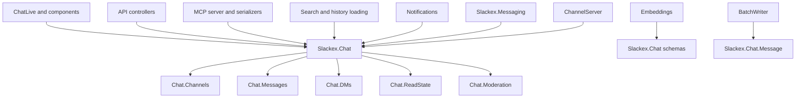
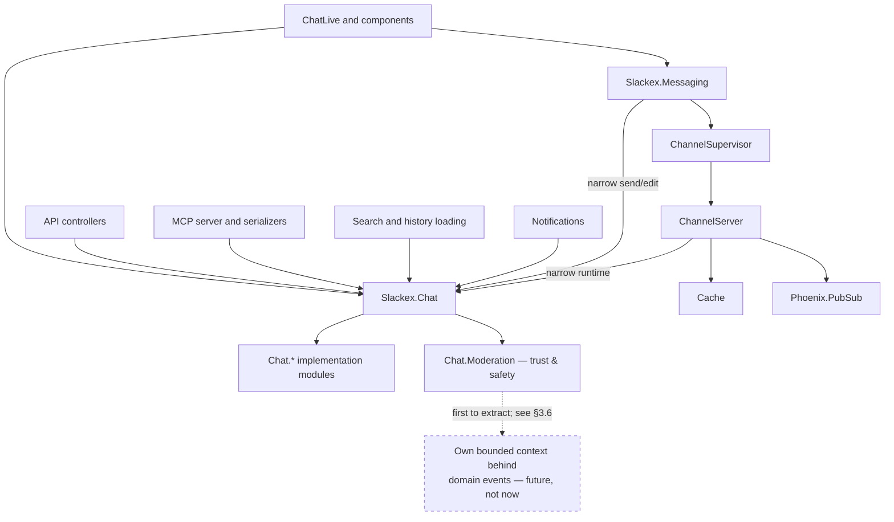
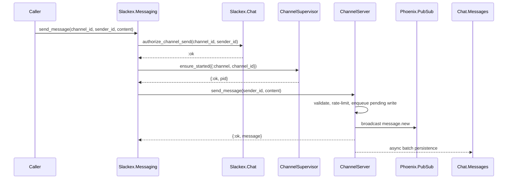
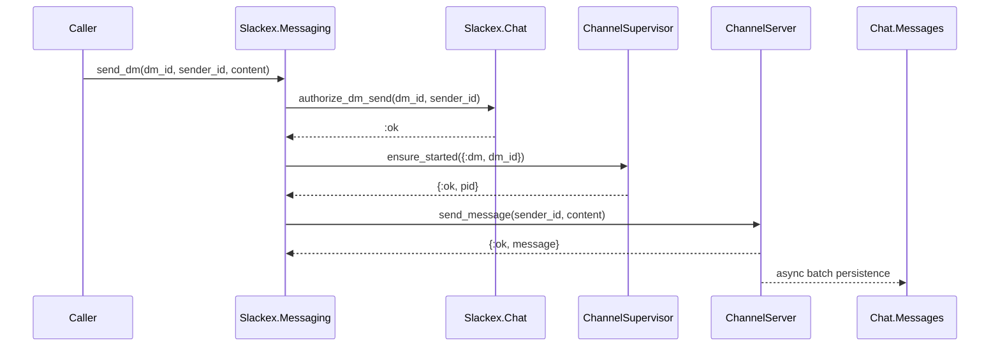

# Chat Domain Architecture: As-Is And To-Be

**Status:** Proposed
**Scope:** `Slackex.Chat` domain interface, internal implementation modules, and caller dependency cleanup

---

## 1. Purpose

`Slackex.Chat` currently acts as the main domain facade for most chat-related capabilities:

- channels and memberships
- channel invites
- messages, threads, reactions, and pins
- DM conversations and DM requests
- read cursors and unread counts
- moderation, blocks, abuse reports, and trust scores

That shape has been useful for delivery: callers have one obvious entry point and the existing tests cover the behavior broadly. The facade also passes the deletion test: if `Slackex.Chat` were removed, chat knowledge would spread across LiveView, API controllers, search, notifications, MCP, tests, and factories.

The problem is not that `Slackex.Chat` exists. The problem is that a few callers reach past it into `Slackex.Chat.*` implementation modules, and the facade does not clearly distinguish common chat workflows from internal implementation details.

That leak is small and countable today (see §7): of the application files that touch chat, 36 already go through the `Slackex.Chat` facade and only 5 alias an implementation module directly — roughly ten aliases in total, dominated by `Chat.Permissions`. The size of the leak is itself the argument for deepening the facade rather than splitting `Slackex.Chat` apart: standing up five new top-level contexts to police a five-file leak would cost far more — in associations, migrations, factories, MCP serializers, and tests — than it returns.

This document describes the current architecture, a target architecture, and an incremental path from one to the other.

The target is not "more modules for their own sake". The target is a deeper `Slackex.Chat` module: fewer public seams, more leverage at the public interface, and more locality inside the chat implementation.

---

## 2. Current Architecture

### 2.1 Current Context Shape

```text
Slackex.Chat
  Channel
  Channels
  Subscription
  Members
  InviteLink
  Invites
  Permissions

  Message
  Messages
  MessageGrouping
  MessageReaction
  Reactions
  PinnedMessage
  Pins

  DMConversation
  DMRequest
  DMs
  DMRateLimiter

  ReadCursor
  ReadState

  UserBlock
  UserTrustScore
  AbuseReport
  Moderation
```

`Slackex.Chat` is mostly a facade over child modules:

- channel operations delegate to `Slackex.Chat.Channels`
- message operations delegate to `Slackex.Chat.Messages`
- DM operations delegate to `Slackex.Chat.DMs`
- read state operations delegate to `Slackex.Chat.ReadState`
- moderation operations delegate to `Slackex.Chat.Moderation`

### 2.2 Current Dependency Shape



### 2.3 Current Strengths

| Strength | Why It Matters |
|---|---|
| One public entry point | Callers can discover chat capabilities through `Slackex.Chat` |
| Existing behavioral coverage | Chat domain tests cover a broad set of workflows |
| Low namespace churn | Schemas, associations, factories, tasks, and tests use stable names |
| Fast delivery path | New chat features can often be added by extending the facade |
| Clear runtime split for realtime sending | `Slackex.Messaging` owns the hot path while `Slackex.Chat` owns durable domain operations |

### 2.4 Current Pressure Points

| Pressure Point | Consequence |
|---|---|
| `Slackex.Chat` owns too many concepts | It is hard to tell which invariant belongs to which domain |
| `Messaging` depends on the broad facade | Realtime sending can accidentally couple to unrelated chat capabilities |
| DM safety and moderation are mixed with general chat | Private-message rules, trust, blocking, and abuse workflows deserve a more explicit boundary |
| Messages and messaging are easy to confuse | Durable message lifecycle and realtime delivery are different responsibilities |
| Tests mirror the old boundary | Many tests use `Chat.*`, which hides the domain being exercised |
| Full namespace moves would be noisy | Schemas are referenced by search, embeddings, MCP, encryption tasks, factories, and tests |

---

## 3. Target Architecture

### 3.1 Target Context Shape

```text
Slackex.Chat
  Public chat interface
  Owns caller-facing workflows and chat invariants

  Internal implementation modules:
    Slackex.Chat.Channels
    Slackex.Chat.Messages
    Slackex.Chat.DMs
    Slackex.Chat.ReadState
    Slackex.Chat.Moderation
    Slackex.Chat.Pins
    Slackex.Chat.Reactions
    Slackex.Chat.Invites
    Slackex.Chat.Members
    Slackex.Chat.Permissions

  Schemas remain under Slackex.Chat.*:
    Channel
    Subscription
    InviteLink
    Message
    MessageReaction
    PinnedMessage
    DMConversation
    DMRequest
    ReadCursor
    UserBlock
    UserTrustScore
    AbuseReport
```

### 3.2 Target Ownership

| Module | Owns | Does Not Expose Casually |
|---|---|---|
| `Slackex.Chat` | caller-facing chat workflows, common invariants, stable public interface | internal implementation modules as default caller dependencies |
| `Slackex.Chat.Channels` | channel persistence, membership, roles, invites, permissions implementation | a separate top-level public seam |
| `Slackex.Chat.DMs` | DM conversations, DM requests, participant safety implementation | a separate top-level public seam |
| `Slackex.Chat.Messages` | durable message lifecycle implementation | realtime delivery ownership |
| `Slackex.Chat.ReadState` | read cursors and unread-count implementation | message creation |
| `Slackex.Chat.Moderation` | blocks, trust scores, abuse report implementation | channel roles or message delivery |
| `Slackex.Messaging` | realtime delivery, per-target process routing, PubSub envelopes, hot-path cache coordination | chat domain ownership |

### 3.3 Target Dependency Shape



Every box that touches chat depends on the single `Slackex.Chat` hub; `Messaging` and `ChannelServer` reach it through a narrow part of that interface (labelled edges), not separate modules. The chat aggregates (channels, messages, DMs, read state, …) stay collapsed under `Chat.* implementation modules` and are detailed in §3.1.

`Chat.Moderation` is drawn separately on purpose: per §3.6 it is the one box that speaks a different language (reports, trust scores, blocks, retention), so it is the genuine bounded-context candidate and the first thing that would lift out. The dashed node is its *future* form — its own context behind a domain-event interface — drawn dashed precisely because it is not part of the current target. Today it remains inside `Slackex.Chat` like the other aggregates. The graph still only subtracts edges versus §2.2; the one forward-looking element is explicitly marked as future.

### 3.4 Target Public APIs

The exact functions can evolve, but the public surface should communicate chat workflows rather than implementation module layout.

```elixir
defmodule Slackex.Chat do
  def create_channel(actor_id, attrs)
  def list_user_channels(user_id)
  def list_public_channels(opts \\ [])
  def join_channel(user_id, channel_id)
  def leave_channel(user_id, channel_id)
  def get_channel!(id)
  def get_channel_by_slug!(slug)

  def get_message(id)
  def get_message!(id)
  def send_channel_message(channel_id, sender_id, content)
  def send_dm_message(dm_id, sender_id, content)
  def edit_message(message_id, actor_id, content)
  def delete_message(message_id, actor_id, opts \\ [])
  def list_messages(channel_id, opts \\ [])
  def list_dm_messages(dm_id, opts \\ [])
  def list_messages_around(target, message_id, opts \\ [])
  def send_reply(channel_id, sender_id, parent_message_id, content)
  def list_thread(parent_message_id, opts \\ [])

  def toggle_reaction(message_id, actor_id, emoji)
  def list_reactions(message_ids)
  def pin_message(channel_id, actor_id, message_id)
  def unpin_message(channel_id, actor_id, message_id)

  def find_or_create_dm(user_a_id, user_b_id)
  def get_dm(id)
  def get_dm_conversation!(id)
  def list_user_dm_conversations(user_id)
  def list_pending_requests_for_user(user_id)
  def create_dm_request(sender_id, recipient_id, preview_text)
  def accept_dm_request(request_id, recipient_id)
  def decline_dm_request(request_id, recipient_id)

  def mark_channel_read(user_id, channel_id)
  def mark_dm_read(user_id, dm_conversation_id)
  def unread_channel_count(user_id, channel_id)
  def unread_dm_count(user_id, dm_conversation_id)
  def batch_unread_counts(user_id)

  def block_user(blocker_id, blocked_id)
  def unblock_user(blocker_id, blocked_id)
  def blocked?(blocker_id, blocked_id)
  def list_blocked_user_ids(user_id)
  def list_blocked_users(user_id)
  def create_abuse_report(reporter_id, reported_user_id, attrs)
end
```

### 3.5 Target Internal Call Discipline

Most application callers should use only:

```elixir
alias Slackex.Chat
```

Direct aliases to implementation modules should become exceptional:

```elixir
alias Slackex.Chat.Pins
alias Slackex.Chat.Invites
alias Slackex.Chat.Members
alias Slackex.Chat.Permissions
```

Those modules can remain directly tested. The restriction is about application callers. Tests for the implementation can still cross internal seams where that gives useful locality.

### 3.6 The Separation Axis (And Why Not Now)

The abandoned "split into five contexts" target sliced along **nouns** — `Channels`, `DMs`, `Messages`, `ReadState`. Those are aggregates *inside one bounded context*: they share the chat ubiquitous language and the chat invariants (a message lives in a channel or a DM, read cursors reference messages, threads reference parents). Slicing them into separate top-level contexts is noun-slicing dressed as decomposition — it multiplies inbound edges (see §3.3 versus §2.2) without separating anything that changes independently.

The one box that speaks a different language — reports, trust scores, blocks, retention — is **Moderation / trust-and-safety**. That is the only genuine separate-context candidate here, and the first thing that would lift out cleanly if separation were ever warranted.

Separation should follow an **axis of change**, not a noun. The triggers that would justify paying for it:

| Trigger | What it forces |
|---|---|
| A second team owning a sub-domain | A boundary that matches the ownership line (Conway), so the facade stops being a merge chokepoint |
| Independent deployability | Separate releases — the actual service line; a shared release deploys in lockstep |
| Divergent governance or invariants | A hard boundary for things like Moderation audit, retention, or a separate datastore |
| Divergent compute profile | A node/release shaped for that workload — for this system that is ML/embeddings serving, **not** a chat sub-domain |

None of these hold today: one small team, one monorepo everyone works on, and a homogeneous cluster where every Elixir node runs the same release.

**Distribution is not decomposition.** The system is already distributed — multiple identical nodes, clustered, with each per-channel `ChannelServer` placed as a cluster singleton via Horde (with split-brain fencing). That is the BEAM delivering resilience and horizontal scale *without* splitting the domain; the only tax it asks is singleton coordination, which is far cheaper than the contracts and brokers decomposition would require. "Different nodes" on the BEAM does not imply "different services."

When a real trigger does appear, the separation that follows is **event-driven**, not the direct-call fan-out the noun split drew: an extracted context (Moderation first) sits behind a domain-event interface over a message service, with no direct cross-context calls. That target diagram is async and sparse — the opposite of §3.3's tangle. Until then, deepening `Slackex.Chat` keeps every one of those doors open at zero cost, because a clean bounded context lifts out as a unit.

---

## 4. Runtime Messaging In The Target Shape

`Slackex.Messaging` should depend on a narrow part of the `Slackex.Chat` interface rather than all of its workflow surface.

This does not require new top-level contexts. It requires a small, intentional set of chat functions for realtime delivery.

### 4.1 Channel Send



### 4.2 DM Send



This preserves the current hot path while making the domain checks explicit.

---

## 5. Migration Strategy

### 5.1 Recommended Strategy

Do not start by adding new top-level contexts.

Start by making `Slackex.Chat` deeper while keeping existing schema and implementation module names stable. This avoids churn in Ecto associations, migrations, tests, factories, encryption tasks, search, embeddings, and MCP serialization.

### 5.2 Phase 1: Classify The Chat Interface

Classify existing `Slackex.Chat` functions into two groups:

```text
Public workflow interface:
  functions application callers should use

Internal implementation helpers:
  functions used by Chat.* modules or narrow runtime paths
```

The public workflow interface should be documented in `Slackex.Chat` moduledoc.

### 5.3 Phase 2: Add Narrow Runtime Functions

Add explicit functions for the realtime delivery path if the existing names are too broad:

```elixir
defmodule Slackex.Chat do
  def authorize_channel_send(channel_id, sender_id)
  def authorize_dm_send(dm_id, sender_id)
  def message_target(message)
end
```

These functions give `Slackex.Messaging` a precise interface without creating new public modules.

### 5.4 Phase 3: Move Runtime Callers To The Narrow Chat Interface

Move the most architecturally important runtime callers to the narrow part of `Slackex.Chat`:

1. `Slackex.Messaging`
2. `Slackex.Messaging.ChannelServer`
3. `Slackex.Pipeline.BatchWriter`
4. Phoenix channels
5. API bootstrap controller

This reduces broad runtime coupling without deleting the `Slackex.Chat` seam.

### 5.5 Phase 4: Reduce Direct `Chat.*` Implementation Aliases

Move application callers away from direct implementation aliases by workflow:

| Workflow | Preferred Interface |
|---|---|
| channel navigation and browse modal | `Slackex.Chat` |
| DM creation and requests | `Slackex.Chat` |
| message edit/delete/thread/reaction/pin | `Slackex.Chat` |
| unread counts and mark-read | `Slackex.Chat` |
| block/report workflows | `Slackex.Chat` |

This keeps each change reviewable and testable.

### 5.6 Phase 5: Organize Tests By Invariant, Not Namespace

Tests can still be grouped by invariant without forcing top-level context names:

- DM request safety tests should describe private-message safety.
- block/trust/report tests should describe moderation invariants.
- reaction/pin/thread tests should describe message lifecycle invariants.
- unread-count tests should describe read-state invariants.

### 5.7 Phase 6: Reconsider Top-Level Splits Only If Needed

Only consider new top-level contexts if `Slackex.Chat` remains too shallow after caller cleanup. Schema namespace moves are high-churn because they affect:

- Ecto associations
- preloads
- factories
- tests
- migrations references
- encryption and key-rotation tasks
- search
- embeddings
- MCP serializers
- release checks

The expected outcome is that top-level splits will not be necessary.

---

## 6. Public Interface Plan

`Slackex.Chat` should remain the public chat seam. The moduledoc should make the caller contract explicit:

```elixir
defmodule Slackex.Chat do
  @moduledoc """
  Public chat workflow interface.

  Application callers should prefer this module over direct calls to
  Slackex.Chat.Channels, Slackex.Chat.Messages, Slackex.Chat.DMs,
  Slackex.Chat.ReadState, and Slackex.Chat.Moderation.
  """

  # channel workflows
  # message workflows
  # DM workflows
  # read-state workflows
  # moderation workflows
end
```

The implementation modules stay available for internal use and focused tests, but they are not the default application seam.

---

## 7. Sizing

Current observed footprint:

| Area | Approximate Size |
|---|---:|
| `lib/slackex/chat/*` | 3,000 LOC |
| focused chat tests | 4,500 LOC |
| lib files referencing `Slackex.Chat` or `Chat.*` | 70 |
| test files referencing `Slackex.Chat` or `Chat.*` | 71 |
| application files using the `Slackex.Chat` facade | 36 |
| application files aliasing `Chat.*` **implementation** modules directly | 5 |
| those direct implementation aliases (mostly `Chat.Permissions`) | ~10 |

The direct-alias leak — the only thing the caller-discipline work actually has to close — is fully enumerable:

| File | Implementation modules aliased |
|---|---|
| `lib/slackex/messaging/channel_server.ex` | `Chat.Permissions` (runtime hot path; the §4 target) |
| `lib/slackex_web/live/chat_live/channel_members_modal.ex` | `Chat.Members`, `Chat.Permissions` |
| `lib/slackex_web/live/chat_live/pinned_messages_modal.ex` | `Chat.Pins`, `Chat.Permissions` |
| `lib/slackex_web/live/chat_live/invite_link_modal.ex` | `Chat.Invites` |
| `lib/slackex_web/mcp/server.ex` | `Chat.DMs` |

### 7.1 Small Version

**Estimate:** 1-2 days

Document the intended `Slackex.Chat` public interface and move only strategic runtime callers, especially `Slackex.Messaging`, to narrow chat functions.

The alias swap itself is small — the five files above, a handful of new delegating functions on `Slackex.Chat`. Most of this estimate is writing the public-interface moduledoc and the narrow runtime functions (§4), not the cleanup. No schema moves. No broad test reorganization. `Slackex.Chat` stays.

This gives most of the architectural signal with low risk.

### 7.2 Proper Version

**Estimate:** 3-5 days

Reduce direct application aliases to `Slackex.Chat.*` implementation modules, update `Slackex.Chat` to expose the missing workflow functions, and reorganize tests by invariant where useful.

Schemas and implementation modules remain under `Slackex.Chat.*`.

This is the recommended version.

### 7.3 Full Version

**Estimate:** 1-2 weeks

Only if later evidence shows the `Slackex.Chat` seam is still too shallow: introduce top-level contexts or move schemas and implementation modules into new namespaces.

This is highest churn and should wait until the deeper `Slackex.Chat` approach has failed a concrete need.

---

## 8. Risks And Guardrails

| Risk | Guardrail |
|---|---|
| `Slackex.Chat` remains a bag of pass-throughs | Define and document the public workflow interface |
| Breaking DM safety rules | Keep DM safety rules close in `Chat.DMs`, `Chat.Moderation`, and their tests |
| Losing message durability semantics | Keep `Chat.Messages` and `BatchWriter` tests focused on insert, duplicate, epoch, and retry behavior |
| Broad LiveView regressions | Move workflows one at a time and run targeted LiveView tests after each workflow |
| New public seams without leverage | Do not add top-level contexts until the deeper `Slackex.Chat` interface has been tried |
| Internal modules remain casually imported | Track direct aliases to `Slackex.Chat.*` implementation modules |

---

## 9. Acceptance Criteria

The refactor is successful when:

- `Slackex.Chat` remains the public chat seam.
- `Slackex.Chat` moduledoc describes its public workflow interface.
- Most application callers only need `alias Slackex.Chat`.
- Direct application aliases to `Slackex.Chat.Pins`, `Chat.Invites`, `Chat.Members`, `Chat.Permissions`, and similar implementation modules are reduced or justified.
- `Slackex.Messaging` uses a narrow chat send/edit interface rather than depending on unrelated chat workflows.
- DM safety rules remain local to `Chat.DMs`, `Chat.Moderation`, and their focused tests.
- Message durability rules remain local to `Chat.Messages`, `BatchWriter`, and their focused tests.
- Tests are grouped or named by the invariant they protect, even if schemas remain under `Slackex.Chat.*`.

---

## 10. Open Questions

1. Which `Slackex.Chat.*` implementation modules should remain acceptable for application callers?
   - Initial recommendation: avoid direct application aliases except where the caller is itself part of the chat implementation.

2. Should `Slackex.Messaging` call only `Slackex.Chat`, or is a tiny `Slackex.Chat.Runtime` interface useful?
   - Current recommendation: start with functions on `Slackex.Chat`; add a nested runtime module only if it improves locality.

3. Should DM conversations become private channels?
   - Current recommendation: no. DM request safety, trust, blocking, and participant rules are distinct enough to keep a dedicated implementation area inside `Slackex.Chat`.

4. Should schemas move eventually?
   - Current recommendation: no. Keep schemas under `Slackex.Chat.*` unless the namespace itself becomes a concrete source of friction.
