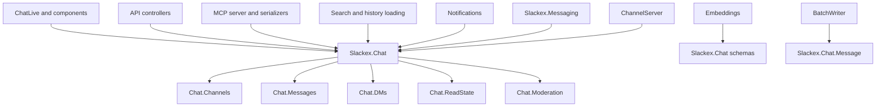
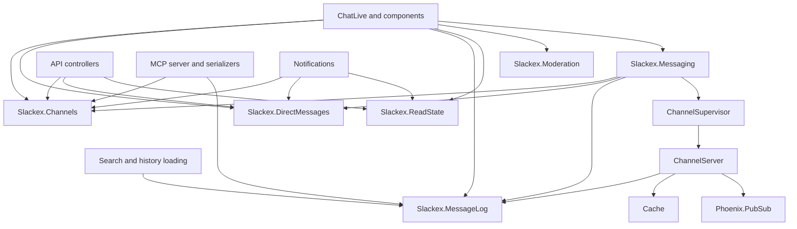
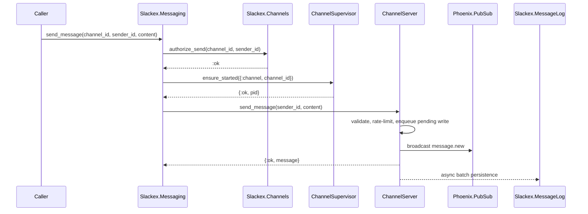
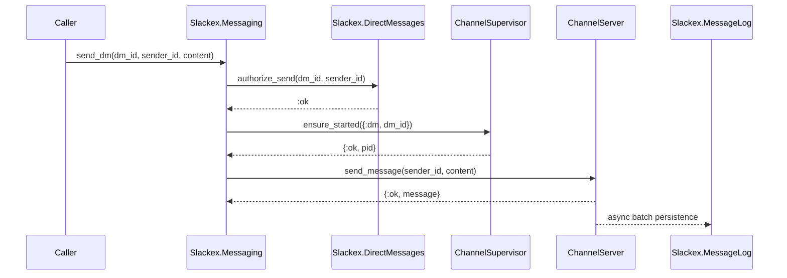

# Chat Domain Architecture: As-Is And To-Be

**Status:** Proposed
**Scope:** `Slackex.Chat` domain boundaries, realtime messaging dependencies, and incremental context split

---

## 1. Purpose

`Slackex.Chat` currently acts as the main domain facade for most chat-related capabilities:

- channels and memberships
- channel invites
- messages, threads, reactions, and pins
- DM conversations and DM requests
- read cursors and unread counts
- moderation, blocks, abuse reports, and trust scores

That shape has been useful for delivery: callers have one obvious entry point and the existing tests cover the behavior broadly. The tradeoff is that the public boundary now groups several different invariants under one broad context. As the system grows, this makes it harder to see which module owns which rule, and it encourages runtime code such as `Slackex.Messaging` and LiveView modules to depend on more surface area than they actually need.

This document describes the current architecture, a target architecture, and an incremental path from one to the other.

The target is not "more modules for their own sake". The target is clearer ownership of invariants.

---

## 2. Current Architecture

### 2.1 Current Context Shape

```text
Slackex.Chat
  Channel
  Channels
  Subscription
  Members
  InviteLink
  Invites
  Permissions

  Message
  Messages
  MessageGrouping
  MessageReaction
  Reactions
  PinnedMessage
  Pins

  DMConversation
  DMRequest
  DMs
  DMRateLimiter

  ReadCursor
  ReadState

  UserBlock
  UserTrustScore
  AbuseReport
  Moderation
```

`Slackex.Chat` is mostly a facade over child modules:

- channel operations delegate to `Slackex.Chat.Channels`
- message operations delegate to `Slackex.Chat.Messages`
- DM operations delegate to `Slackex.Chat.DMs`
- read state operations delegate to `Slackex.Chat.ReadState`
- moderation operations delegate to `Slackex.Chat.Moderation`

### 2.2 Current Dependency Shape



### 2.3 Current Strengths

| Strength | Why It Matters |
|---|---|
| One public entry point | Callers can discover chat capabilities through `Slackex.Chat` |
| Existing behavioral coverage | Chat domain tests cover a broad set of workflows |
| Low namespace churn | Schemas, associations, factories, tasks, and tests use stable names |
| Fast delivery path | New chat features can often be added by extending the facade |
| Clear runtime split for realtime sending | `Slackex.Messaging` owns the hot path while `Slackex.Chat` owns durable domain operations |

### 2.4 Current Pressure Points

| Pressure Point | Consequence |
|---|---|
| `Slackex.Chat` owns too many concepts | It is hard to tell which invariant belongs to which domain |
| `Messaging` depends on the broad facade | Realtime sending can accidentally couple to unrelated chat capabilities |
| DM safety and moderation are mixed with general chat | Private-message rules, trust, blocking, and abuse workflows deserve a more explicit boundary |
| Messages and messaging are easy to confuse | Durable message lifecycle and realtime delivery are different responsibilities |
| Tests mirror the old boundary | Many tests use `Chat.*`, which hides the domain being exercised |
| Full namespace moves would be noisy | Schemas are referenced by search, embeddings, MCP, encryption tasks, factories, and tests |

---

## 3. Target Architecture

### 3.1 Target Context Shape

```text
Slackex.Channels
  Channel
  Subscription
  InviteLink
  Members
  Invites
  Permissions

Slackex.DirectMessages
  DMConversation
  DMRequest
  DMRateLimiter

Slackex.MessageLog
  Message
  MessageGrouping
  MessageReaction
  PinnedMessage
  Messages
  Threads
  Reactions
  Pins

Slackex.ReadState
  ReadCursor

Slackex.Moderation
  UserBlock
  UserTrustScore
  AbuseReport
```

### 3.2 Target Ownership

| Context | Owns | Does Not Own |
|---|---|---|
| `Slackex.Channels` | public/private channels, memberships, roles, invites, channel permissions | message content, DM requests, abuse reports |
| `Slackex.DirectMessages` | DM conversations, DM requests, participant authorization, DM request lifecycle | channel membership, message persistence internals |
| `Slackex.MessageLog` | durable message lifecycle, edits, deletes, threads, reactions, pins, message history | realtime process ownership, PubSub fanout |
| `Slackex.ReadState` | read cursors, unread counts, mark-as-read workflows | message creation, channel membership mutation |
| `Slackex.Moderation` | blocks, trust scores, abuse reports, DM safety decisions | channel roles, message delivery |
| `Slackex.Messaging` | realtime delivery, per-target process routing, PubSub envelopes, hot-path cache coordination | durable domain ownership |

### 3.3 Target Dependency Shape



### 3.4 Target Public APIs

The exact functions can evolve, but the public surface should communicate ownership.

```elixir
defmodule Slackex.Channels do
  def create_channel(actor_id, attrs)
  def list_user_channels(user_id)
  def list_public_channels(opts \\ [])
  def join_channel(user_id, channel_id)
  def leave_channel(user_id, channel_id)
  def get_channel!(id)
  def get_channel_by_slug!(slug)
  def role_for(user_id, channel_id)
  def authorize_send(channel_id, user_id)
end
```

```elixir
defmodule Slackex.DirectMessages do
  def find_or_create_dm(user_a_id, user_b_id)
  def get_dm(id)
  def get_dm_conversation!(id)
  def list_user_dm_conversations(user_id)
  def list_pending_requests_for_user(user_id)
  def create_request(sender_id, recipient_id, preview_text)
  def accept_request(request_id, recipient_id)
  def decline_request(request_id, recipient_id)
  def authorize_send(dm_id, sender_id)
end
```

```elixir
defmodule Slackex.MessageLog do
  def get_message(id)
  def get_message!(id)
  def append_channel_message(channel_id, sender_id, content)
  def append_dm_message(dm_id, sender_id, content)
  def edit_message(message_id, actor_id, content)
  def delete_message(message_id, actor_id, opts \\ [])
  def list_channel_messages(channel_id, opts \\ [])
  def list_dm_messages(dm_id, opts \\ [])
  def list_messages_around(target, message_id, opts \\ [])
  def send_reply(parent_message_id, actor_id, content)
  def list_thread(parent_message_id, opts \\ [])
  def toggle_reaction(message_id, actor_id, emoji)
  def list_reactions(message_ids)
  def pin_message(channel_id, actor_id, message_id)
  def unpin_message(channel_id, actor_id, message_id)
end
```

```elixir
defmodule Slackex.ReadState do
  def mark_channel_read(user_id, channel_id)
  def mark_dm_read(user_id, dm_conversation_id)
  def unread_channel_count(user_id, channel_id)
  def unread_dm_count(user_id, dm_conversation_id)
  def batch_unread_counts(user_id)
end
```

```elixir
defmodule Slackex.Moderation do
  def block_user(blocker_id, blocked_id)
  def unblock_user(blocker_id, blocked_id)
  def blocked?(blocker_id, blocked_id)
  def list_blocked_user_ids(user_id)
  def list_blocked_users(user_id)
  def create_abuse_report(reporter_id, reported_user_id, attrs)
  def may_receive_dm?(sender_id, recipient_id)
end
```

---

## 4. Runtime Messaging In The Target Shape

`Slackex.Messaging` should depend on narrow domain capabilities rather than the whole `Slackex.Chat` facade.

### 4.1 Channel Send



### 4.2 DM Send



This preserves the current hot path while making the domain checks explicit.

---

## 5. Migration Strategy

### 5.1 Recommended Strategy

Do not start with schema moves.

Start by making the API architecture true while keeping existing schema module names stable. This avoids churn in Ecto associations, migrations, tests, factories, encryption tasks, search, embeddings, and MCP serialization.

### 5.2 Phase 1: Add New Facades

Create these modules as delegating facades:

```text
lib/slackex/channels.ex
lib/slackex/direct_messages.ex
lib/slackex/message_log.ex
lib/slackex/read_state.ex
lib/slackex/moderation.ex
```

They can delegate to the existing implementation modules initially:

```elixir
defmodule Slackex.Channels do
  defdelegate create_channel(actor_id, attrs), to: Slackex.Chat.Channels
  defdelegate list_user_channels(user_id), to: Slackex.Chat.Channels
  defdelegate join_channel(user_id, channel_id), to: Slackex.Chat.Channels
end
```

`Slackex.Chat` remains as a compatibility facade during this phase.

### 5.3 Phase 2: Move Runtime Callers First

Move the most architecturally important callers off `Slackex.Chat`:

1. `Slackex.Messaging`
2. `Slackex.Messaging.ChannelServer`
3. `Slackex.Pipeline.BatchWriter`
4. Phoenix channels
5. API bootstrap controller

This reduces broad runtime coupling before touching LiveView and tests.

### 5.4 Phase 3: Move Web Callers By Workflow

Move LiveView callers by workflow, not by file:

| Workflow | Target Context |
|---|---|
| channel navigation and browse modal | `Slackex.Channels` |
| DM creation and requests | `Slackex.DirectMessages` |
| message edit/delete/thread/reaction/pin | `Slackex.MessageLog` |
| unread counts and mark-read | `Slackex.ReadState` |
| block/report workflows | `Slackex.Moderation` |

This keeps each change reviewable and testable.

### 5.5 Phase 4: Move Tests By Domain

Rename and reorganize tests once application call sites have moved:

```text
test/slackex/channels/*
test/slackex/direct_messages/*
test/slackex/message_log/*
test/slackex/read_state/*
test/slackex/moderation/*
```

The tests should teach the new architecture. For example:

- DM request safety tests belong under `direct_messages`
- block/trust/report tests belong under `moderation`
- reaction/pin/thread tests belong under `message_log`
- unread-count tests belong under `read_state`

### 5.6 Phase 5: Decide Whether To Move Schemas

Only move schema modules after the API split has proven useful.

Schema namespace moves are high-churn because they affect:

- Ecto associations
- preloads
- factories
- tests
- migrations references
- encryption and key-rotation tasks
- search
- embeddings
- MCP serializers
- release checks

It may be enough for public APIs to be clean while schemas remain under `Slackex.Chat.*` internally for a while.

---

## 6. Compatibility Plan

During migration, keep `Slackex.Chat` as a deprecated compatibility facade:

```elixir
defmodule Slackex.Chat do
  @moduledoc """
  Compatibility facade.

  Prefer Slackex.Channels, Slackex.DirectMessages, Slackex.MessageLog,
  Slackex.ReadState, and Slackex.Moderation.
  """

  defdelegate list_user_channels(user_id), to: Slackex.Channels
  defdelegate find_or_create_dm(user_a_id, user_b_id), to: Slackex.DirectMessages
  defdelegate get_message(id), to: Slackex.MessageLog
  defdelegate batch_unread_counts(user_id), to: Slackex.ReadState
  defdelegate block_user(blocker_id, blocked_id), to: Slackex.Moderation
end
```

Remove functions from `Slackex.Chat` only after all application and test callers have moved.

---

## 7. Sizing

Current observed footprint:

| Area | Approximate Size |
|---|---:|
| `lib/slackex/chat/*` | 3,000 LOC |
| focused chat tests | 4,500 LOC |
| lib files referencing `Slackex.Chat` or `Chat.*` | 70 |
| test files referencing `Slackex.Chat` or `Chat.*` | 71 |

### 7.1 Small Version

**Estimate:** 1-2 days

Add new facades and move only strategic runtime callers, especially `Slackex.Messaging`.

No schema moves. No broad test reorganization. `Slackex.Chat` stays.

This gives most of the architectural signal with low risk.

### 7.2 Proper Version

**Estimate:** 3-5 days

Add new facades, move most application callers, update Boundary config, and reorganize tests by domain.

Schemas may remain under `Slackex.Chat.*`.

This is the recommended version.

### 7.3 Full Version

**Estimate:** 1-2 weeks

Move schemas and implementation modules into new namespaces.

This is highest churn and should wait until the new public APIs have proven stable.

---

## 8. Risks And Guardrails

| Risk | Guardrail |
|---|---|
| Breaking DM safety rules | Move `DirectMessages` and `Moderation` behind explicit tests before changing callers |
| Losing message durability semantics | Keep `MessageLog` and `BatchWriter` tests focused on insert, duplicate, epoch, and retry behavior |
| Broad LiveView regressions | Move workflows one at a time and run targeted LiveView tests after each workflow |
| Boundary dependency loops | Define allowed deps before moving callers |
| Namespace churn without value | Delay schema moves until API boundaries are stable |
| Compatibility facade becomes permanent | Track remaining `Slackex.Chat` callers and remove delegates when count reaches zero |

---

## 9. Acceptance Criteria

The refactor is successful when:

- `Slackex.Messaging` no longer depends on the omnibus `Slackex.Chat` facade.
- Channel permissions are reached through `Slackex.Channels`.
- DM participant and request safety are reached through `Slackex.DirectMessages`.
- Durable message lifecycle is reached through `Slackex.MessageLog`.
- Read cursors and unread counts are reached through `Slackex.ReadState`.
- Blocks, abuse reports, and trust decisions are reached through `Slackex.Moderation`.
- `Slackex.Chat` is either removed or clearly marked as temporary compatibility.
- Tests are grouped by the domain invariant they protect.

---

## 10. Open Questions

1. Should `Slackex.MessageLog` be named `Slackex.Messages` instead?
   - `MessageLog` makes the durable-store responsibility clearer beside `Slackex.Messaging`.
   - `Messages` is shorter but easier to confuse with realtime messaging.

2. Should pins and reactions live under `MessageLog` or their own contexts?
   - Current recommendation: keep them under `MessageLog`; they are message lifecycle extensions.

3. Should DM conversations become private channels?
   - Current recommendation: no. DM request safety, trust, blocking, and participant rules are distinct enough to keep a separate context.

4. Should schemas move eventually?
   - Current recommendation: only if the API split proves valuable and schema names become the main source of confusion.

