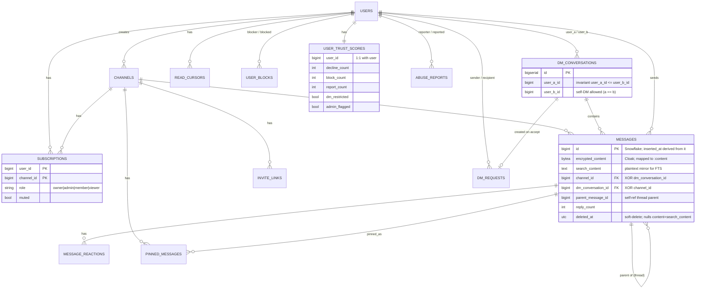
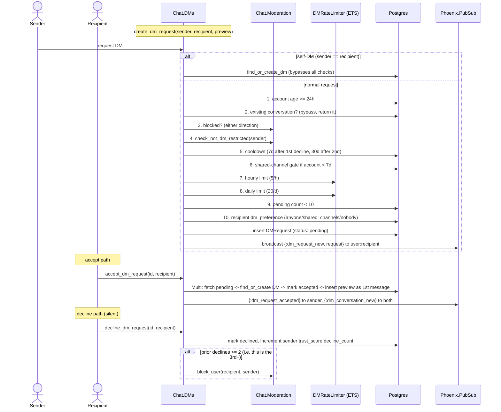
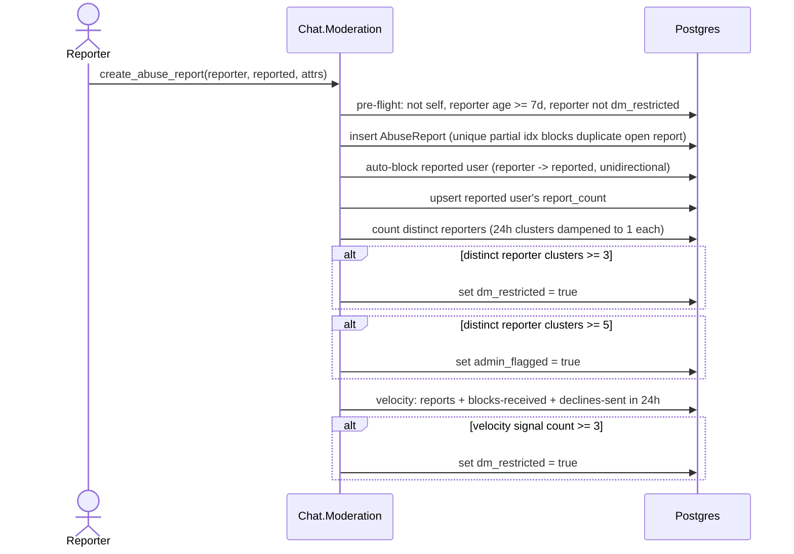

# Chat Context Architecture

**Status:** Reference
**Scope:** The `Slackex.Chat` bounded context — channels, messages, members, moderation, DMs. Public facade, sub-modules, data model, and lifecycle. This is an L1 (context-level) view of the domain and persistence layer.

---

## 1. Overview

`Slackex.Chat` is the **synchronous domain and persistence layer** for conversations. It owns the schemas (channels, messages, DMs, subscriptions, read cursors, reactions, pins, invites, and the moderation/trust tables) and the functions that read and write them. It contains no process coordination, no in-memory hot state, and is not responsible for realtime fanout.

The realtime, latency-sensitive side of chat lives in a separate context, `Slackex.Messaging`, which runs a per-conversation `ChannelServer` process, caches recent messages, broadcasts over PubSub, and persists asynchronously through `BatchWriter`. The dependency points **downward**: `Messaging` depends on `Chat`, never the reverse. `Chat` declares its `Boundary` deps as only `Slackex.Accounts`, `Slackex.Infrastructure`, and `Slackex.Encrypted` (`lib/slackex/chat/chat.ex`) — it knows nothing about the process layer.

The reason for this split is responsiveness. Sending a message in a live channel must not block on a database round-trip, so the hot path (validate → cache → broadcast) is owned by `Messaging`/`ChannelServer`, and durability is decoupled. `Chat` provides the durable, transactional building blocks underneath, plus everything that is *not* on the hot path: history loading, membership, read state, DM-request safety, and moderation.

For the realtime send path, message persistence pipeline, and threads/reactions runtime behaviour, see the linked sibling documents rather than this file — they are not duplicated here.

---

## 2. C4 Diagrams

### 2.1 Container Diagram

```mermaid
C4Container
  title Container Diagram -- Chat Context and its boundary

  Person(user, "Chat User")

  Container_Boundary(slackex, "Slackex Application") {
    Container(web, "Web Layer", "LiveView / Channels / Controllers / MCP", "Calls into Chat for history, membership, read state, moderation, DMs")
    Container(messaging, "Messaging", "Elixir Context + GenServers", "Realtime hot path: ChannelServer, cache, PubSub broadcast, async persist")

    Container_Boundary(chat, "Slackex.Chat (domain + persistence)") {
      Container(channels, "Channels", "Module", "Channel CRUD, membership, roles")
      Container(messages, "Messages", "Module", "Message insert/edit/delete, pagination, threads")
      Container(dms, "DMs", "Module", "DM conversations, DM requests, safety pre-flight")
      Container(moderation, "Moderation", "Module", "Blocks, abuse reports, trust scores, velocity")
      Container(members, "Members / Pins / Invites", "Modules", "Role mgmt, pinning, invite links")
      Container(reactions, "Reactions", "Module", "Emoji toggle, batch load")
      Container(readstate, "ReadState", "Module", "Read cursors, unread counts")
      Container(grouping, "MessageGrouping", "Pure module", "Display grouping + time dividers")
      Container(permissions, "Permissions", "Pure module", "Role -> action authorization table")
      Container(ratelimiter, "DMRateLimiter", "GenServer + ETS", "DM creation / request rate buckets")
    }
  }

  ContainerDb(postgres, "PostgreSQL", "channels, messages, dm_conversations, subscriptions, read_cursors, message_reactions, pinned_messages, invite_links, dm_requests, user_blocks, user_trust_scores, abuse_reports")
  System_Ext(pubsub, "Phoenix.PubSub", "user:* topics for DM/request events")

  Rel(user, web, "Uses")
  Rel(web, chat, "Reads history, membership, read state, moderation through")
  Rel(messaging, chat, "Depends downward on", "persist/edit/delete + DM participant checks")
  Rel(chat, postgres, "Reads and writes domain tables in")
  Rel(dms, pubsub, "Broadcasts DM/request events to")
  Rel(chat, messaging, "Does NOT depend on", "no upward dependency")
```

### 2.2 Entity Relationship Diagram

`Chat` owns roughly a dozen tables. This is the marquee view for this context — it is the persistence layer.



> Table/column notes are abbreviated; see Section 6 for the full data model.

---

## 3. How To Read This Document

- Start with the **Container Diagram** to see the Chat/Messaging boundary and the sub-modules inside `Chat`.
- Use the **ER Diagram** (and Section 6) to understand the tables `Chat` owns and the key invariants.
- Use the **sequence diagrams** (Sections 5.1, 5.2) for the two flows that live *only* in `Chat` and are not covered by any sibling doc: the DM-request lifecycle and the moderation auto-restrict path.
- For the realtime send path and persistence, do not read here — follow the links in Section 9.

### Terms Used Here

| Term | Meaning |
|---|---|
| Conversation | Either a channel or a DM conversation |
| Target | A `{:channel, id}` or `{:dm, id}` tuple identifying a conversation |
| Facade | The `Slackex.Chat` module that `defdelegate`s to sub-modules |
| Trust score | Per-user `user_trust_scores` row aggregating negative signals (declines, blocks, reports) |
| dm_restricted | A trust-score flag that blocks the user from initiating DM requests |
| Snowflake ID | Time-ordered 64-bit message ID; the message `inserted_at` is derived from it |

---

## 4. Main Components

| Component | File | Responsibility |
|---|---|---|
| `Slackex.Chat` | `lib/slackex/chat/chat.ex` | Facade; `defdelegate`s a subset of functions to sub-modules; declares the `Boundary` |
| `Chat.Channels` | `lib/slackex/chat/channels.ex` | Channel create/list/lookup, join/leave, role lookup, member count |
| `Chat.Messages` | `lib/slackex/chat/messages.ex` | Insert/edit/soft-delete, ID-cursor pagination, around-window, threads |
| `Chat.DMs` | `lib/slackex/chat/dms.ex` | DM conversations, DM requests, the safety pre-flight pipeline |
| `Chat.Moderation` | `lib/slackex/chat/moderation.ex` | Blocks, abuse reports, trust scores, threshold + velocity enforcement |
| `Chat.Members` | `lib/slackex/chat/members.ex` | List members, update role, kick |
| `Chat.Pins` | `lib/slackex/chat/pins.ex` | Pin/unpin, list pins, pin count |
| `Chat.Invites` | `lib/slackex/chat/invites.ex` | Create/redeem/revoke invite links |
| `Chat.Reactions` | `lib/slackex/chat/reactions.ex` | Toggle emoji (add/remove/swap), batch load |
| `Chat.ReadState` | `lib/slackex/chat/read_state.ex` | Read cursors, unread counts, batch unread |
| `Chat.MessageGrouping` | `lib/slackex/chat/message_grouping.ex` | Pure display annotation (grouping, time dividers) |
| `Chat.Permissions` | `lib/slackex/chat/permissions.ex` | Pure role→action authorization table |
| `Chat.DMRateLimiter` | `lib/slackex/chat/dm_rate_limiter.ex` | GenServer owning an ETS table of per-user rate buckets |

### 4.1 The facade is partial by design

`Slackex.Chat` `defdelegate`s functions for `Channels`, `Messages`, `Reactions`, threads, `DMs`, `ReadState`, and `Moderation`. It does **not** re-export `Members`, `Pins`, or `Invites` — those are used as sub-modules directly (e.g. `Slackex.Chat.Members.list_members/1`) rather than through the facade. The `Boundary` `exports` list does include the schema and sub-module names, so the access boundary is enforced at the context edge; the facade itself is a convenience layer, not the sole entry point.

The duplicated `get_role/2` helper in `Members`, `Pins`, and `Invites` (alongside the canonical one in `Channels`), and the duplicated `normalize_user_pair/2` in `DMs`, are deliberate small copies rather than a shared module. The refactor proposal in `chat-domain-as-is-to-be.md` tracks these; they are noted here only as boundary facts.

---

## 5. Key Runtime Flows

The send path, message persistence, and threads/reactions flows are documented in the sibling files (Section 9). The two flows below are owned entirely by `Chat` and appear nowhere else.

### 5.1 DM Request Lifecycle

DMs are gated behind a request/approval flow to limit unsolicited contact. `DMs.create_dm_request/3` runs a 10-step ordered pre-flight before a request is created; accept and decline carry graduated enforcement.



Notable, non-obvious behaviour:

- **Self-DMs are first-class.** `create_dm_request(uid, uid, _)` and `find_or_create_dm(uid, uid)` create a row with `user_a_id == user_b_id` (`lib/slackex/chat/dm_conversation.ex`), used for personal notes. All checks and rate limits are skipped for the self case.
- **The user pair is normalized** to `user_a_id <= user_b_id` so a conversation has one canonical row regardless of who initiates, enforced by a unique constraint on `(user_a_id, user_b_id)`.
- **Cooldown is graduated and per sender-recipient pair**, computed from the count of prior `declined` requests between that exact pair, not a global counter.
- **Decline is silent** (no broadcast to the sender) and escalates: the 3rd+ decline auto-blocks the sender via `Moderation.block_user/2`.
- **The accept path is one `Ecto.Multi`**: it finds-or-creates the conversation and, if `preview_text` is non-blank, delivers it as the first message in the same transaction. `find_or_insert_dm_conversation/2` handles the `on_conflict: :nothing` ghost-struct case (`%DMConversation{id: nil}`) by re-fetching — the project-wide upsert-safety rule.

### 5.2 Moderation Auto-Restrict

Negative signals accumulate on a per-user `user_trust_scores` row and trip thresholds that set `dm_restricted` (which then fails step 4 of the DM pre-flight above) or `admin_flagged`.



Notable behaviour:

- **Reporter clustering dampens coordinated reporting.** `count_distinct_reporters/1` groups reporters whose first report falls within the same 24-hour window into a single cluster, so a brigade filing inside one window counts once (`dampen_reporter_clusters/1`).
- **Block threshold is separate.** Receiving 5+ blocks (`@auto_restrict_block_threshold`) sets `dm_restricted` independently, via `upsert_block_count/1` → `maybe_apply_block_restriction/1`.
- **Auto-block is unidirectional** — reporting someone blocks them for you, but does not make them block you.
- **Velocity** aggregates three distinct 24-hour signals (reports received, blocks received, declined requests *sent*); a sum of 3+ trips a restriction.

---

## 6. Data Model

All timestamps are `:utc_datetime_usec`. Encrypted fields use `Slackex.Encrypted.Binary`/`.Map` (Cloak) and are stored in `encrypted_*` source columns.

### 6.1 Core tables

**`channels`** (`Channel`) — serial `id`; `name` (2–100 chars), `slug` (unique, derived from `name` on any changeset that changes the name), `description`, `is_private` (default false), `creator_id`. Cascading delete removes subscriptions and messages.

**`messages`** (`Message`) — **Snowflake bigint `id`, not autogenerated** (the caller supplies it). `inserted_at` is **derived from the ID** via `Snowflake.extract_timestamp/1` (`put_inserted_at/1`), so ID order equals chronological order. `content` is Cloak-encrypted (`encrypted_content`); `search_content` is a **plaintext mirror** that backs full-text search. Exactly one of `channel_id` / `dm_conversation_id` is non-null (`validate_target/1`). `parent_message_id` (self-ref) and `reply_count` support threads. `edited_at` set on edit; `deleted_at` set on soft-delete, which **nulls both `content` and `search_content`** (`delete_changeset/1`). Content length 1–4000 chars. Virtual fields: `headline`, `similarity`, `search_score` (search), `grouped`, `show_divider`, `divider_label` (grouping).

**`dm_conversations`** (`DMConversation`) — serial `id`; `user_a_id` / `user_b_id` with the invariant `user_a_id <= user_b_id` (`normalize_user_order/1`), self-DM allowed; unique on the pair. `updated_at` bumped on each DM message.

**`subscriptions`** (`Subscription`) — composite PK `(user_id, channel_id)`; `role` in `owner|admin|member|viewer` (default `member`), `muted`. Acts as the channel-membership join with RBAC.

### 6.2 Engagement & access tables

**`message_reactions`** (`MessageReaction`) — unique `(message_id, user_id, emoji)`: a user has at most one of each emoji per message.

**`pinned_messages`** (`PinnedMessage`) — unique `(message_id, channel_id)`; `pinned_by_id`.

**`invite_links`** (`InviteLink`) — unique `code` (22-char Base64URL, auto-generated when absent), `max_uses` (nil = unlimited), `use_count`, `expires_at` (default 7 days; see `Invites`).

**`read_cursors`** (`ReadCursor`) — PK includes `user_id`; exactly one of `channel_id` / `dm_conversation_id` set (changeset + DB CHECK). `last_read_message_id` drives unread counts; cursor `0` (`@no_cursor_message_id`) means never read.

### 6.3 DM-safety & moderation tables

**`dm_requests`** (`DMRequest`) — Snowflake `id`; `sender_id`, `recipient_id`, nullable `dm_conversation_id` (set on accept), encrypted `preview_text` (max 500 chars), `status` `pending|accepted|declined`, `responded_at`. Unique partial index on `(sender_id, recipient_id)` where `status = 'pending'`.

**`user_blocks`** (`UserBlock`) — directional block; `blocker_id`, `blocked_id`, optional `reason`.

**`user_trust_scores`** (`UserTrustScore`) — **1:1 with user**; `decline_count`, `block_count`, `report_count` (all non-negative), `dm_restricted` (+`dm_restricted_at`), `admin_flagged` (+`admin_flagged_at`). Maintained via upsert with `inc:` on conflict.

**`abuse_reports`** (`AbuseReport`) — Snowflake `id`; `reporter_id`, `reported_user_id`, nullable `message_id` / `dm_conversation_id`, `category` (`spam|harassment|inappropriate_content|phishing|other`), encrypted `description`, `status` (`open|reviewed|actioned|dismissed`), encrypted `metadata` map. Unique partial index on `(reporter_id, reported_user_id)` where `status = 'open'`.

### 6.4 Snowflake ordering, indexing, and the partitioning gap

Pagination is **ID-cursor based, not timestamp based**: `list_messages/2` filters on `m.id < before` (descending) or `m.id > after` (ascending), and `list_messages_around/3` builds a `before ∪ target ∪ after` window via `union_all`, all keyed on `id` (`lib/slackex/chat/messages.ex`). Because the Snowflake ID encodes the millisecond timestamp, ID order is chronological order, so a single btree serves both. Channel reads are backed by the composite index `(channel_id, id)` (`priv/repo/migrations/20260221000006_create_messages.exs`); the `dm_conversation_id` column and its composite index `(dm_conversation_id, id)` are added later, in `priv/repo/migrations/20260221000007_create_dm_conversations.exs`, which DM reads use.

The `messages` table itself is a **standard, non-partitioned table** — there is no `PARTITION BY` in any migration. The composite-key join pattern `(message_id, message_inserted_at) = (id, inserted_at)` *is* used, but for a **dependent table in another context, not for `messages`**: `message_embeddings` (in `Slackex.Embeddings`) carries a `message_inserted_at` companion column, and `Slackex.Search.MessageSearch` joins it with `on: me.message_id == m.id and me.message_inserted_at == m.inserted_at` (`lib/slackex/search/message_search.ex`). Within the `Chat` context proper, no table is partitioned and `messages` has no such companion key.

### 6.5 Encryption / full-text-search tradeoff

Message bodies are encrypted at rest with Cloak. Full-text search needs plaintext, so `put_search_content/1` mirrors the content into the unencrypted `search_content` column, indexed by a GIN index over `to_tsvector('english', coalesce(search_content, ''))` (`priv/repo/migrations/20260303191200_add_fts_gin_index.exs`). The migration trail — `content` → `encrypted_content` → drop plaintext `content` → GIN on `search_content` — shows the deliberate move to keep the searchable copy isolated in one column. Soft-delete nulls both `content` and `search_content`, so a deleted message leaves no plaintext behind. The semantic/embedding side of search (pgvector, RRF fusion, embedding pipeline) lives outside this context — see `embeddings.md`.

### 6.6 Authorization model

`Permissions.can?/2` is a pure lookup over two hard-coded tables (`@role_levels`, `@action_min_level` in `lib/slackex/chat/permissions.ex`): roles map to numeric levels (`owner 4 > admin 3 > member 2 > viewer 1 > nil 0`) and each action declares a minimum level. There are no dynamic or per-channel custom roles. Key thresholds: `send_message`/`edit_own`/`delete_own` need level 2 (member); `manage_channel`/`manage_members`/`pin_message`/`delete_any_message` need level 3 (admin); `delete_channel` needs level 4 (owner). `Messages.authorize_delete/2` layers on top: a sender may always delete their own message, and in channels (not DMs) an admin/owner may delete any message.

---

## 7. Key Design Properties

- **Domain layer, not realtime layer.** `Chat` performs synchronous, transactional reads/writes and owns no GenServer hot state except the rate limiter. The realtime path is `Messaging`'s job.
- **One-way dependency.** `Messaging → Chat`. `Chat`'s `Boundary` deps are only `Accounts`, `Infrastructure`, `Encrypted`.
- **`Chat.Messages.send_message/3` is the synchronous domain insert.** It checks permission, generates a Snowflake ID, inserts, and preloads `:sender`. The active realtime send path bypasses it (it persists via `Messaging`/`ChannelServer`/`BatchWriter`); its only callers are tests. Note the docstring claims it "broadcasts via PubSub" — the code does not; the broadcast happens in the realtime layer.
- **Read-replica awareness.** Several reads use `Slackex.ReadRepo` — `list_messages/2` and `list_dm_messages/2` call `ReadRepo.repo_for_age/1` to route old-message queries to a replica while keeping recent reads on the primary; channel listings use `ReadRepo.read_repo/0`.
- **Atomic compound operations** use `Ecto.Multi`: channel-create-plus-owner-subscription, reply-plus-`reply_count`-increment, send-DM-plus-`updated_at`-bump, and accept-DM-request.
- **Upsert safety is consistent.** Idempotent joins (`join_channel`, invite redeem) and the DM-conversation accept path use `on_conflict: :nothing` and handle/avoid the `%Struct{id: nil}` ghost case.
- **PubSub is fire-and-forget.** DM/request broadcasts go to `user:*` topics and their results are intentionally discarded (`_ = broadcast`); delivery is best-effort.

---

## 8. Failure Modes & Resilience

- **`DMRateLimiter` is a GenServer owning a `:public` ETS table** (`lib/slackex/chat/dm_rate_limiter.ex`). `check/*` and `reset/*` are direct ETS operations, so there is no GenServer message bottleneck on the hot path. If the process crashes, the named ETS table is destroyed and re-created empty on restart — rate-limit state resets and the limiter **fails open** (the next check sees a fresh bucket). Blast radius is limited to DM-creation/request throttling; it does not affect message sends or reads.
- **PubSub broadcast failures are swallowed by design.** DM and request events use `_ = Phoenix.PubSub.broadcast(...)`. A failed broadcast does not roll back the database write; the durable state is correct, but a client may miss the realtime nudge until its next refresh.
- **Upsert conflict ghost structs.** `find_or_insert_dm_conversation/2` explicitly handles `{:ok, %DMConversation{id: nil}}` by re-fetching, so a concurrent insert race resolves to the existing row rather than returning a phantom record.
- **Invite redemption is serialized** with `SELECT ... FOR UPDATE` (`lock: "FOR UPDATE"`) so two concurrent redeems of a limited-use invite cannot both observe `use_count < max_uses`.
- **Read cursors are last-write-wins.** `mark_as_read` upserts only `last_read_message_id` and `updated_at`; concurrent marks are not strictly ordered by message ID, but the cursor only ever advances to the latest message at write time, so the practical effect is benign.
- **Snowflake clock dependence.** Message ordering relies on monotonic Snowflake IDs; a backward clock step (NTP correction) could in principle produce non-monotonic IDs and slightly mis-order same-millisecond messages. NTP guards make this rare in practice.

Restart strategy for `Chat` processes beyond `DMRateLimiter` is not defined within this context — the non-essential-supervisor / `restart: :temporary` discipline (see project resilience rules) applies to the embedding and pipeline workers in other contexts, not to the synchronous `Chat` modules.

---

## 9. Code Map

| File | Responsibility |
|---|---|
| `lib/slackex/chat/chat.ex` | Facade + `Boundary` declaration |
| `lib/slackex/chat/channels.ex` | Channel CRUD, membership, roles |
| `lib/slackex/chat/messages.ex` | Insert/edit/delete, pagination, around-window, threads |
| `lib/slackex/chat/dms.ex` | DM conversations + DM-request safety pipeline |
| `lib/slackex/chat/moderation.ex` | Blocks, abuse reports, trust scores, velocity |
| `lib/slackex/chat/members.ex` | Member listing, role updates, kicks |
| `lib/slackex/chat/pins.ex` | Pin/unpin, list, count |
| `lib/slackex/chat/invites.ex` | Invite link create/redeem/revoke |
| `lib/slackex/chat/reactions.ex` | Emoji toggle (add/remove/swap), batch load |
| `lib/slackex/chat/read_state.ex` | Read cursors, unread counts |
| `lib/slackex/chat/message_grouping.ex` | Pure display grouping + dividers |
| `lib/slackex/chat/permissions.ex` | Pure role→action table |
| `lib/slackex/chat/dm_rate_limiter.ex` | GenServer + ETS rate buckets |
| `lib/slackex/chat/*.ex` (schemas) | `channel`, `message`, `dm_conversation`, `subscription`, `message_reaction`, `pinned_message`, `invite_link`, `read_cursor`, `dm_request`, `user_block`, `user_trust_score`, `abuse_report` |
| `priv/repo/migrations/20260221000006_create_messages.exs` | Messages table + `(channel_id, id)` index |
| `priv/repo/migrations/20260303191200_add_fts_gin_index.exs` | GIN FTS index on `search_content` |

---

## 10. Related Documents

- `message-pipeline-and-persistence.md` — the process layer: `ChannelServer`, async batched writes, writer fencing (how messages actually reach Postgres on the hot path)
- `realtime-chat.md` — the send path, PubSub fanout, and LiveView/Channel client flows
- `threads-and-reactions.md` — runtime behaviour of replies and reactions on top of the `Chat` primitives
- `chat-domain-as-is-to-be.md` — refactor proposal (facade gaps, duplicated helpers, send-path consolidation)
- `embeddings.md` — semantic search, pgvector, embedding pipeline that complements FTS over `search_content`
- `accounts-and-auth.md` — the `Accounts` context that `Chat` depends on for user identity
- `notifications.md` — how message events drive offline/push delivery
