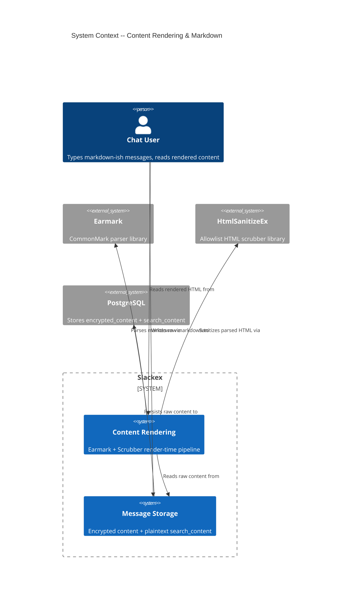
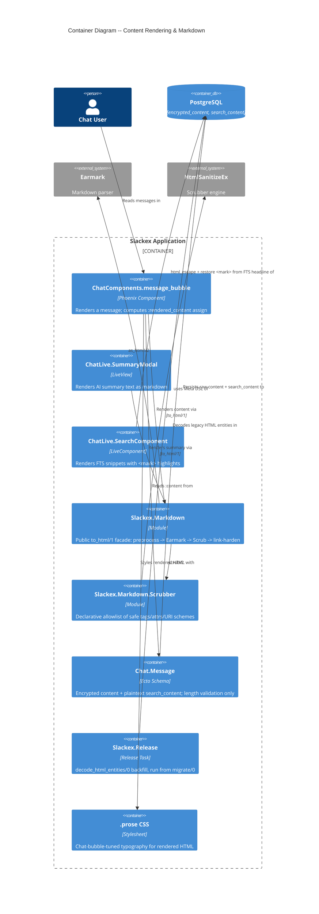
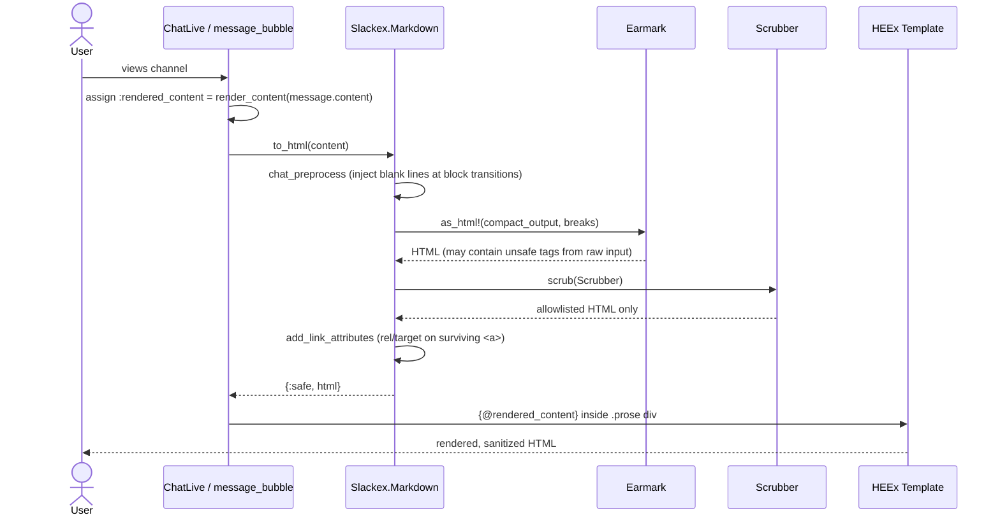
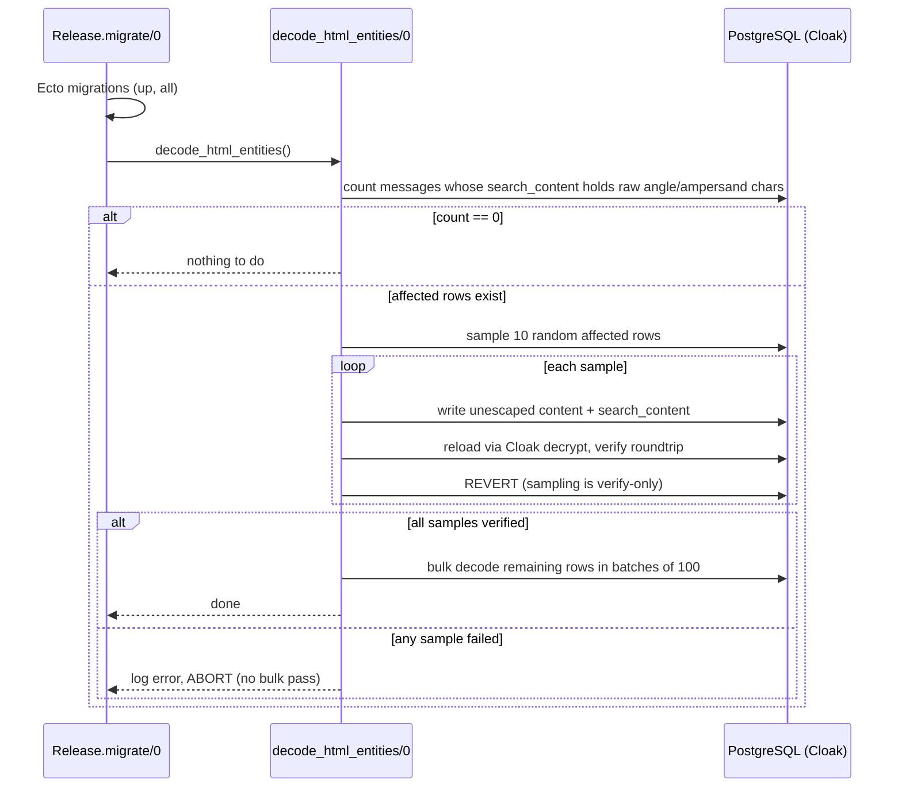

# Content Rendering & Markdown Architecture

**Status:** Reference
**Scope:** `Slackex.Markdown` (Earmark + custom Scrubber + chat preprocessor), render-time XSS handling, custom `.prose` CSS, the `decode_html_entities` backfill, and the static-analysis test that guards `Phoenix.HTML.raw/1`.

---

## 1. Overview

Slackex stores message content **raw** (after encryption) and makes it safe to display **at render time**. There is no sanitization on the write path: `content` is validated for length only and persisted verbatim. Every safety guarantee — escaping HTML, stripping `<script>`, blocking `javascript:` URLs — happens when a message is converted to HTML for display.

The conversion is a single facade, `Slackex.Markdown.to_html/1` (`lib/slackex/markdown.ex`), which runs a four-stage pipeline:

1. **Chat preprocess** — inject blank lines at block transitions so single-newline chat input parses as markdown.
2. **Earmark** — parse markdown to HTML.
3. **Scrubber** — strip everything not on an explicit allowlist (`Slackex.Markdown.Scrubber`).
4. **Link hardening** — decorate surviving `<a>` tags with `rel="noopener noreferrer" target="_blank"`, then wrap as a `{:safe, html}` tuple via `Phoenix.HTML.raw/1`.

The surprising design choice — and the reason this subsystem exists as a separate document — is that **render-time-only sanitization replaced an earlier storage-time `strip_tags` approach**. `strip_tags` HTML-encoded `>`, `<`, and `&` *before* writing to the database, which destroyed markdown syntax (a blockquote needs a literal `>`) and polluted the `search_content` column that feeds full-text search and embeddings. Removing it required a one-time backfill (`decode_html_entities/0`) to reverse the damage already in the database. See [ADR-001](../feature/markdown-rendering/design/adr-001-remove-strip-tags-from-storage.md) and [ADR-002](../feature/markdown-rendering/design/adr-002-render-time-only-xss-prevention.md).

> **Design vs. implementation divergence.** The design (ADR-002, `architecture.md` §5.2) specifies a `FunWithFlags` flag `:markdown_rendering` that dispatches between two render paths — the Scrubber when ON, HEEx auto-escaping when OFF. **That dispatch is not implemented.** The flag name appears only in design documents; no `.ex`, `.exs`, config, seed, or migration references it. All render surfaces call `Slackex.Markdown.to_html/1` unconditionally. The code is therefore *more* conservative than the design (the Scrubber is always active, never bypassed), but the documented kill switch and its acceptance test do not exist. See §8.

---

## 2. C4 Diagrams

### 2.1 System Context



### 2.2 Container Diagram



These diagrams sit one level above the sequence diagrams in §5–§6.

---

## 3. Main Components

| Component | Responsibility |
|---|---|
| `Slackex.Markdown` | Public `to_html/1` facade; chat preprocessor; post-scrub link hardening |
| `Slackex.Markdown.Scrubber` | XSS allowlist — which tags/attributes/URI schemes survive sanitization |
| `Slackex.Chat.Message` | Schema: encrypted `content`, plaintext `search_content`, length validation (no sanitization) |
| `Slackex.Release` | `decode_html_entities/0` — one-time legacy backfill, invoked automatically by `migrate/0` |
| `SlackexWeb.ChatComponents` | `message_bubble` component; computes the `:rendered_content` assign via `render_content/1 -> to_html/1` |
| `SlackexWeb.ChatLive.SummaryModal` | Renders AI channel-summary text through `to_html/1` |
| `SlackexWeb.ChatLive.SearchComponent` | Renders FTS snippets; the second sanctioned `raw/1` callsite (escapes then restores `<mark>`) |
| `.prose` (`assets/css/app.css`) | Typography for rendered HTML inside tight chat bubbles |

---

## 4. The Render Pipeline

`Slackex.Markdown.to_html/1` (`lib/slackex/markdown.ex:22`):

```elixir
def to_html(markdown) when is_binary(markdown) do
  markdown
  |> chat_preprocess()
  |> Earmark.as_html!(%Earmark.Options{compact_output: true, breaks: true})
  |> HtmlSanitizeEx.Scrubber.scrub(Slackex.Markdown.Scrubber)
  |> add_link_attributes()
  |> Phoenix.HTML.raw()
end
```

`nil` and `""` short-circuit to `{:safe, ""}`. The function returns a Phoenix-HTML safe tuple, so HEEx interpolates it via `{...}` without a second round of escaping.

### 4.1 Chat preprocessing — domain logic, not infrastructure

Earmark is a strict CommonMark parser: block elements (headings, lists, blockquotes) require a **blank line** before them. Chat users do not type blank lines — they press Shift+Enter, producing single newlines. `chat_preprocess/1` (`lib/slackex/markdown.ex:35`) bridges that gap by splitting on `\n`, classifying each line's block type, and inserting a blank line wherever the block type *changes* — but not between items of the **same** type (consecutive list items, table rows) and never **inside a code fence** (fence state is tracked so fenced content is left byte-for-byte intact).

Block types are detected by regex (`block_type/1`, `lib/slackex/markdown.ex:43`): `:code_fence` (` ``` `), `:heading` (`#`–`######`), `:list` (`-`/`*`/`+` or `1.`), `:blockquote` (`>`), `:rule` (`---`/`***`/`___`), `:table` (`|...|`), else `:text`/`:blank`. The rationale: this is a product decision about how chat input maps to markdown, so it lives in the domain module rather than being pushed into Earmark options or the template layer.

### 4.2 Scrubber — the XSS allowlist

`Slackex.Markdown.Scrubber` (`lib/slackex/markdown/scrubber.ex`) uses the `HtmlSanitizeEx.Scrubber.Meta` DSL. It is an **allowlist**: only the declared tags and attributes survive; the closing `Meta.strip_everything_not_covered()` removes everything else.

| Category | Allowed |
|---|---|
| Block | `p`, `h1`–`h6`, `blockquote`, `pre` (`class`), `code` (`class`), `hr`, `br`, `ul`, `ol`, `li` |
| Table | `table`, `thead`, `tbody`, `tr`, `th`, `td` |
| Inline | `strong`, `em`, `del` |
| Links | `a` with `href` restricted to `https` / `http` / `mailto` URI schemes, plus `rel` and `target` |

`pre`/`code` retain `class` so Earmark's language tags (`<code class="...">`) for fenced blocks survive. Everything dangerous — `<script>`, `<iframe>`, ``, `<style>`, inline event handlers like `onerror`, and `javascript:` URLs — is dropped because it is simply not on the list. `Meta.remove_cdata_sections_before_scrub()` and `Meta.strip_comments()` run first.

### 4.3 Link hardening — and why a blunt string replace is safe here

`add_link_attributes/1` (`lib/slackex/markdown.ex:90`) is a literal `String.replace("<a ", ~s(<a rel="noopener noreferrer" target="_blank" ))`. `target="_blank"` opens links in a new context; `rel="noopener noreferrer"` blocks the `window.opener` reverse-tabnabbing exploit and suppresses referrer leakage.

The ordering is the safety property: this step runs **after** the Scrubber. By that point the only `<a` tags in the string are Earmark-generated anchors that already passed the allowlist (safe `href` scheme, no event handlers). A user-typed `<a onclick=...>` was stripped earlier, so there is no attacker-controlled `<a` left for the blunt replace to decorate. Decorating *after* sanitization is what makes a regex-free string substitution acceptable here.

---

## 5. Render Flow (Message Bubble)



### Notes

- The bubble template renders `{@rendered_content}` inside `<div ... class="... prose prose-sm max-w-none">` (`lib/slackex_web/components/chat_components.ex:270`). The assign is computed once at `lib/slackex_web/components/chat_components.ex:194`, calling `render_content/1` (`:455`), a thin wrapper over `Slackex.Markdown.to_html/1`.
- Because `to_html/1` returns `{:safe, ...}`, HEEx does **not** re-escape it — the safety guarantee is entirely the Scrubber's.
- The same `to_html/1` is the only render path. `SummaryModal` calls it directly (`lib/slackex_web/live/chat_live/summary_modal.ex:102` and `:106`).

---

## 6. The `decode_html_entities` Backfill



### Why it exists

The old storage-time `strip_tags` encoded `>` → `&gt;`, `<` → `&lt;`, `&` → `&amp;`, etc. After ADR-001 removed `strip_tags`, rows written under the old behaviour still held encoded entities in both the encrypted `content` and the plaintext `search_content`. Left alone, a stored `&gt;` would render as the literal text `&gt;` instead of starting a blockquote, and FTS/embeddings would index the encoded form. `decode_html_entities/0` (`lib/slackex/release.ex:92`) reverses the encoding.

### Key properties

- **Runs automatically.** `migrate/0` calls `decode_html_entities()` at `lib/slackex/release.ex:33`, immediately after migrations and `Application.ensure_all_started/1`. No manual deploy step is required (it can also be run standalone via `bin/slackex eval`).
- **Sampling checkpoint.** Before touching thousands of encrypted rows, it round-trips 10 random samples through Cloak (write → decrypt → verify → revert) to catch encryption-key or encoding edge cases. If any sample fails, the entire bulk pass is aborted (`run_sampling_checkpoint/1`, `verify_samples/2`).
- **Idempotent.** The affected-row query filters on `search_content` containing `&gt;` / `&lt;` / `&amp;`, so already-clean rows are skipped; and `unescape_html/1` on clean text is a no-op.
- **Decode order matters.** `unescape_html/1` (`lib/slackex/release.ex:246`) replaces `&amp;` **last**, so a double-encoded `&amp;gt;` (a user who literally typed `&gt;`) decodes to `&gt;` rather than collapsing all the way to `>`.
- **Cloak transparency.** Writing through an Ecto changeset re-encrypts `content` automatically because the schema field is `Slackex.Encrypted.Binary` (see §7).

---

## 7. Data Model

This subsystem does not own a table; it reads and cleans the `messages` table owned by the chat domain. The two fields it cares about (`lib/slackex/chat/message.ex`):

| Field | Type | Notes |
|---|---|---|
| `content` | `Slackex.Encrypted.Binary` (`source: :encrypted_content`) | Cloak AES-256-GCM at rest. Holds **raw** markdown — not sanitized on write. |
| `search_content` | `:string` (plaintext) | Companion column populated from `content` on every insert/edit. Enables GIN/FTS indexing and embedding generation, which cannot operate on encrypted bytes. |

`put_search_content/1` (`lib/slackex/chat/message.ex:69`) copies `content` into `search_content` inside both `changeset/2` and `edit_changeset/2`, so the producer/consumer contract is maintained on every write through the same code path. `validate_content_length/2` enforces 1–4000 characters; it is the **only** transformation the write path applies — there is no escaping or tag stripping. `delete_changeset/2` nulls both `content` and `search_content`.

The backfill cleans **both** columns together so the encrypted display content and the plaintext search content never drift apart.

For the encryption mechanism itself see [encryption-at-rest.md](encryption-at-rest.md); for how `search_content` is consumed see [search-and-intelligence.md](search-and-intelligence.md) and [embeddings.md](embeddings.md).

---

## 8. Key Design Properties

- **Render-time-only sanitization.** The database holds raw user input; all XSS prevention happens when content becomes HTML. One sanitization point is simpler to reason about than dual storage-time + render-time sanitization, and it stops storage-time escaping from corrupting markdown syntax and the search index.
- **Allowlist, not denylist.** The Scrubber permits a fixed set of tags; anything new or unexpected is dropped by default. Adding a feature (e.g. images) is a deliberate edit to `scrubber.ex`, not an accident.
- **`raw/1` is confined and guarded.** `Phoenix.HTML.raw/1` bypasses HEEx auto-escaping, so it is permitted in exactly two files, enforced by a static-analysis test (§9).
- **Chat preprocessing is product logic.** How single-newline chat input maps to markdown blocks is a domain decision, kept in `Slackex.Markdown`.

### 8.1 The unimplemented kill switch (documented gap)

[ADR-002](../feature/markdown-rendering/design/adr-002-render-time-only-xss-prevention.md) and the feature [architecture.md](../feature/markdown-rendering/design/architecture.md) specify a `FunWithFlags` flag `:markdown_rendering` acting as a kill switch: when **ON**, render through the Scrubber; when **OFF**, render the raw `content` directly and rely on HEEx auto-escaping (`&lt;script&gt;` shown as text). ADR-002 even mandates an acceptance test toggling the flag OFF and asserting a stored `<script>` is escaped.

**Neither the dispatch nor that acceptance test exists in the codebase.** A repo-wide search finds `:markdown_rendering` only in the three design documents (`architecture.md`, `adr-002`, `deliver/roadmap.json`) — never in any `.ex`, `.exs`, config, seed, or migration. Every render surface calls `Slackex.Markdown.to_html/1` unconditionally.

Practical consequences:

- The Scrubber is **always** active; there is no path that renders message content without it. This is *more* conservative than the design — a smaller attack surface.
- There is **no working kill switch**. "Disabling markdown" today would mean removing the `to_html/1` call, not flipping a flag — and that would drop sanitization to whatever the replacement does, not fall back to HEEx auto-escaping.
- The HEEx-auto-escape fallback that ADR-002/§3.3 of the feature doc describe as the secondary defense is therefore **theoretical**, not wired. The `markdown_test.exs` suite proves HEEx auto-escaping works *in isolation* (`html_escape/1` on a raw `<script>`), but no production render path exercises it.

This diverges from the project convention that feature flags gate all surfaces. It is recorded here rather than silently "documented as designed" because a reader arriving from `CLAUDE.md` or `MEMORY.md` (which call the feature "feature-flagged `:markdown_rendering`") will otherwise expect a flag that does not exist at any render surface.

---

## 9. Failure Modes & Resilience

| Concern | Behaviour |
|---|---|
| Malicious tag/attribute reaches render | Stripped by the allowlist Scrubber; `markdown_test.exs` asserts `<script>`, `onclick`, `javascript:`, `<iframe>`, `<style>`, `` are all removed. |
| New unsafe `raw/1` callsite added | The static-analysis test fails CI (see below), naming the offending files. |
| Legacy HTML-encoded rows in DB | `decode_html_entities/0` cleans them on the next deploy; sampling checkpoint aborts the bulk pass if Cloak round-trip verification fails, so a partial/corrupt rewrite is avoided. |
| `nil` / empty content | `to_html/1` returns `{:safe, ""}`; never raises. |
| Earmark parse error | `Earmark.as_html!/2` raises; this is the one place the pipeline can crash on malformed input (it is not wrapped). Blast radius is the single LiveView render, not the messaging pipeline — content is already persisted by the time it is rendered. |

### 9.1 Static-analysis guard on `raw/1`

`Phoenix.HTML.raw/1` is the one function that bypasses HEEx's automatic escaping, so an unreviewed `raw(user_content)` would be a direct XSS hole. The test `"Phoenix.HTML.raw/1 is only used in safe sanitization contexts"` (`test/slackex/markdown/markdown_test.exs:331`) greps every `lib/**/*.{ex,heex}` for `Phoenix.HTML.raw` or a piped `|> raw()` and asserts the set of matching files equals exactly:

- `lib/slackex/markdown.ex` — output of the full Scrubber pipeline.
- `lib/slackex_web/live/chat_live/search_component.ex` — `sanitize_headline/1` (`:218`) calls `html_escape/1` first, then restores only the known `<mark>` / `</mark>` tags from the Postgres FTS headline before `raw/1`. Input is escaped; only a fixed, safe tag is re-introduced.

Any third `raw/1` callsite fails CI with the offending paths listed. This is the project's "feature flags gate all surfaces" discipline applied to the dangerous primitive itself: the guard cannot be bypassed by accident.

---

## 10. Presentation: `.prose` CSS

Rendered HTML lands in a `<div class="... prose prose-sm max-w-none">`. The `.prose` rules live in `assets/css/app.css:143`. They exist as hand-written CSS because the project uses the Tailwind v4 standalone CLI, which cannot load `@tailwindcss/typography`.

The styling is deliberately tight for chat bubbles: `line-height: 1.6`; heading sizes capped (`h1` 1.5em down to `h3` 1.125em); small vertical margins (`0.5em` on paragraphs/lists/blockquotes); `code`/`pre` backgrounds from `--color-base-200` with `pre` getting `overflow-x: auto`; tables full-width with collapsed 1px borders; links `--color-primary` underlined. The first/last child margins are zeroed (`> *:first-child`, `> *:last-child`) so a rendered block does not push the bubble's own padding around.

---

## 11. Code Map

| File | Responsibility |
|---|---|
| `lib/slackex/markdown.ex` | `to_html/1` facade; `chat_preprocess/1`; `block_type/1`; `add_link_attributes/1`; sanctioned `raw/1` |
| `lib/slackex/markdown/scrubber.ex` | Allowlist of safe tags/attributes; restricted URI schemes for `<a href>` |
| `lib/slackex/chat/message.ex` | Schema; encrypted `content` + plaintext `search_content`; `put_search_content/1`; length validation |
| `lib/slackex/release.ex` | `migrate/0` (invokes backfill); `decode_html_entities/0`; sampling checkpoint; `unescape_html/1` |
| `lib/slackex_web/components/chat_components.ex` | `message_bubble`; `:rendered_content` assign; `render_content/1 -> to_html/1` |
| `lib/slackex_web/live/chat_live/summary_modal.ex` | Renders AI summary text via `to_html/1` |
| `lib/slackex_web/live/chat_live/search_component.ex` | `sanitize_headline/1` — second sanctioned `raw/1` (escape, then restore `<mark>`) |
| `assets/css/app.css` | `.prose` typography for rendered HTML |
| `test/slackex/markdown/markdown_test.exs` | Rendering, preprocessing, XSS, defense-in-depth, and the `raw/1` static-analysis guard |

---

## 12. Related Documents

- [encryption-at-rest.md](encryption-at-rest.md) — Cloak field encryption that protects `content`, and why `search_content` is plaintext
- [search-and-intelligence.md](search-and-intelligence.md) — how `search_content` is consumed by FTS and hybrid ranking
- [embeddings.md](embeddings.md) — embedding generation from `search_content`
- [message-pipeline-and-persistence.md](message-pipeline-and-persistence.md) — how raw `content` is validated and written
- [realtime-chat.md](realtime-chat.md) — the send/render path that produces the content rendered here
- [ai-summarization.md](ai-summarization.md) — the summary text that `SummaryModal` renders via `to_html/1`
- [../feature/markdown-rendering/design/architecture.md](../feature/markdown-rendering/design/architecture.md) — original feature design (note the flag-dispatch divergence in §8.1)
- [../feature/markdown-rendering/design/adr-001-remove-strip-tags-from-storage.md](../feature/markdown-rendering/design/adr-001-remove-strip-tags-from-storage.md) — removing storage-time `strip_tags`
- [../feature/markdown-rendering/design/adr-002-render-time-only-xss-prevention.md](../feature/markdown-rendering/design/adr-002-render-time-only-xss-prevention.md) — render-time-only XSS model and the (unimplemented) kill switch
- [../feature/markdown-rendering/design/adr-003-backfill-html-encoded-messages.md](../feature/markdown-rendering/design/adr-003-backfill-html-encoded-messages.md) — the backfill strategy
