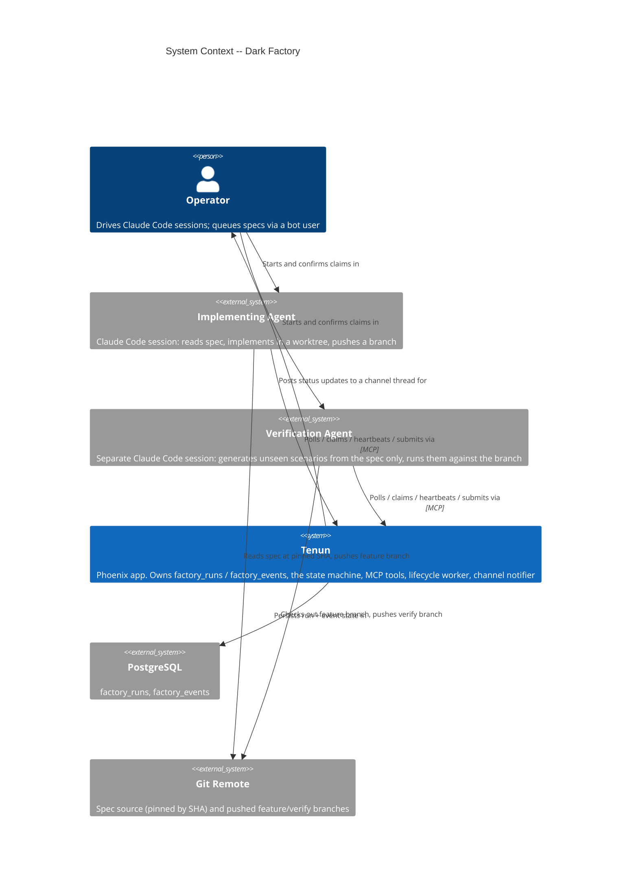
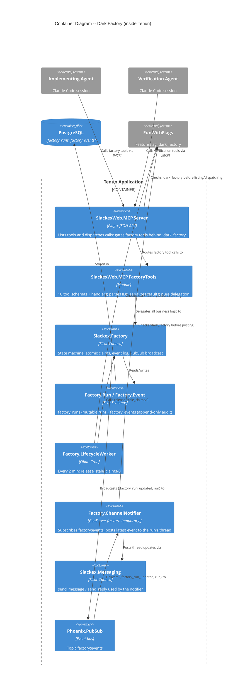
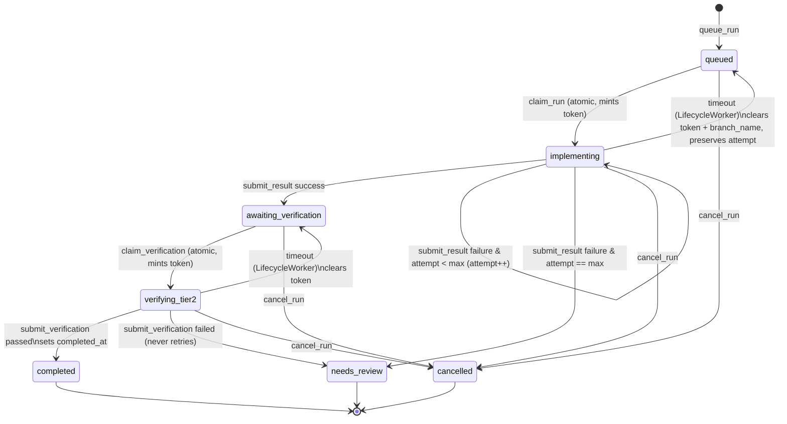
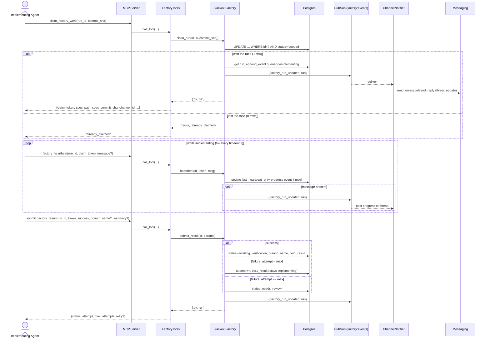
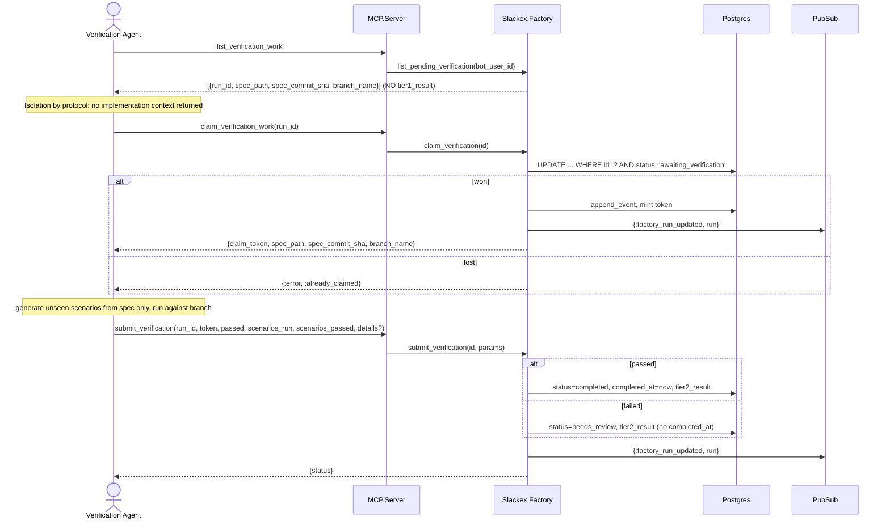
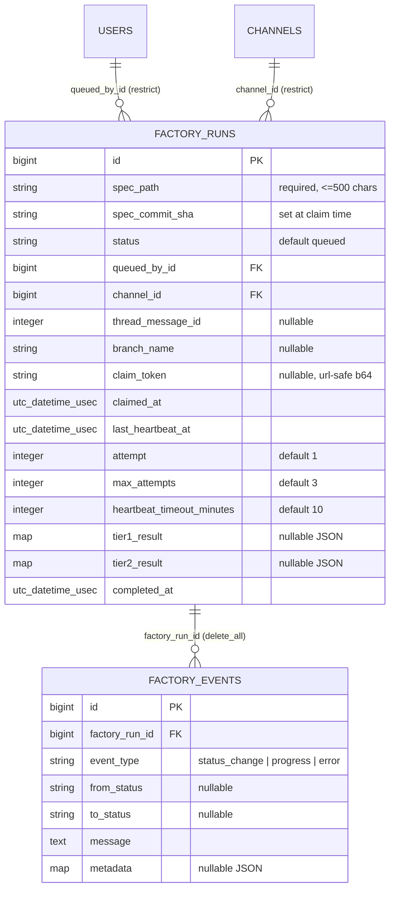

# Dark Factory Architecture

**Status:** Reference
**Scope:** `Slackex.Factory` context -- the spec-to-implementation work queue, its state machine, the MCP tool surface that agents drive it through, the Oban lifecycle worker, and the PubSub-backed channel notifier.

---

## 1. Overview

The dark factory is a **work queue with structured execution**. Humans (via a bot user) queue a feature spec; external Claude Code sessions poll Tenun over MCP, claim a run, implement the spec in a git worktree, push a branch, and report back. A **second, isolated** session later claims the completed run, generates *unseen* test scenarios from the spec alone, runs them against the branch, and records a pass/fail verdict.

The defining architectural stance, from `docs/feature/dark-factory/design/architecture.md`, is:

> Tenun is a platform, not an agent runtime. Tenun manages pipeline state and exposes it via MCP. Agents are external and bring their own compute. **Pull, not push** -- agents poll Tenun for work; Tenun never invokes agents.

That decision is why the entire subsystem reduces to (1) a context module that is a state machine over two tables, (2) ten MCP tools that are thin delegators to that context, (3) one Oban cron worker that reaps abandoned claims, and (4) one small GenServer that mirrors state changes into a chat thread. There is no agent supervisor, no process-per-run, and no compute owned by Tenun in Phase 1. The "factory" exists almost entirely as rows in Postgres plus a protocol.

Two properties make the queue safe under concurrent, untrusted-timing agents:

- **Atomic optimistic-lock claims.** A claim is a single `UPDATE ... WHERE id = ? AND status = 'queued'`. If two agents race, exactly one sees `{1, _}` rows affected; the loser gets `{:error, :already_claimed}`. No advisory locks, no `SELECT ... FOR UPDATE`.
- **Heartbeat-based liveness with self-healing release.** Claims carry no lease the agent must explicitly renew via a lock; instead the agent must *heartbeat* before `last_heartbeat_at + heartbeat_timeout_minutes` elapses. A cron worker reaps anything past that deadline back to the queue, preserving the attempt counter so a flapping agent cannot loop forever.

The subsystem is gated end-to-end behind the `:dark_factory` FunWithFlags flag: the MCP tool list, the MCP dispatch path, the Oban worker, and the notifier's posting all check the flag.

---

## 2. C4 Diagrams

### 2.1 System Context



### 2.2 Container Diagram



---

## 3. How To Read This Document

- Start with **System Context** to see the four actors: the operator, the two agent roles, and Tenun-as-queue.
- Use the **Container Diagram** to see why the runtime is so thin: MCP is a façade over one context module; the only live processes are an Oban worker and one GenServer.
- Read **Section 5 (State Machine)** before the sequence diagrams -- every flow is a walk through that machine.
- Use the **sequence diagrams (Sections 6-7)** for the implementing and verification round-trips and the timeout-release flow.

### Terms Used Here

| Term | Meaning |
|---|---|
| Run | One pipeline execution = one `factory_runs` row |
| Claim | The atomic transition that assigns a run to an agent and mints a `claim_token` |
| Claim token | 16 random bytes, url-safe base64, required for every mutation after claim |
| Tier 1 | Known acceptance criteria the implementing agent sees and satisfies |
| Tier 2 | Unseen scenarios the verification agent generates from the spec alone |
| Heartbeat | A keep-alive (and optional progress post) that resets the timeout clock |
| Stale claim | A claimed run whose `last_heartbeat_at + heartbeat_timeout_minutes` has passed |
| Terminal state | `completed`, `needs_review`, or `cancelled` -- no further transitions |

---

## 4. Main Components

| Component | Responsibility |
|---|---|
| `Slackex.Factory` | The whole state machine. Atomic claims, success/retry/exhausted branching, verification verdicts, cancellation, stale-claim release, event appends, PubSub broadcast. No MCP awareness. |
| `Slackex.Factory.Run` | Ecto schema for `factory_runs`; `queue_changeset/2` validates `spec_path`, `queued_by_id`, `channel_id`. |
| `Slackex.Factory.Event` | Ecto schema for `factory_events`; append-only audit (`status_change` / `progress` / `error`). |
| `Slackex.Factory.LifecycleWorker` | Oban cron worker (`queue: :default`, `max_attempts: 1`). Every 2 min calls `release_stale_claims/0` when the flag is on. |
| `Slackex.Factory.ChannelNotifier` | GenServer (`restart: :temporary`). Subscribes to `"factory:events"`, posts the latest event to the run's channel thread. |
| `SlackexWeb.MCP.FactoryTools` | The 10 tool schemas and their handlers. Parses string IDs, serializes results to JSON content, surfaces `{:error, reason}` as text. |
| `SlackexWeb.MCP.Server` | Adds factory tools to the advertised list and routes calls to `FactoryTools` -- both gated on `:dark_factory`. |

---

## 5. State Machine

The status column on `factory_runs` is the single source of truth. Seven states; three terminal.



Non-obvious properties grounded in `lib/slackex/factory.ex`:

- **Only `claim_run/2` and `claim_verification/1` use the atomic optimistic lock.** Both run inside `Repo.transaction` and do `from(r in Run, where: r.id == ^run_id and r.status == "queued")` (or `"awaiting_verification"`) `|> Repo.update_all(...)`. On `{0, _}` they `Repo.rollback(:already_claimed)`. Every *other* mutation instead validates the `claim_token` after a plain `Repo.get/2`, then checks the run is in the expected status. This is the simplest correct design for a pull queue: the only contended write is the claim itself.
- **A failed `submit_result` with attempts remaining does not transition.** `submit_failure/2` increments `attempt` and rewrites `tier1_result` but leaves `status: "implementing"` and the claim intact, so the same agent retries in the same worktree. Only when `attempt == max_attempts` does it move to `needs_review`. The MCP payload signals this with `retry: true` (added only while status is still `implementing`).
- **`completed_at` is set only on a passing verification.** `do_submit_verification/2` computes `completed_at = if passed, do: now, else: run.completed_at`. `needs_review` carries no completion timestamp.
- **Tier 2 never retries.** A failed verification always goes to `needs_review` for a human. This is deliberate: verification is a quality gate, not a fallible step to loop on.
- **Cancellation works from any non-terminal state**, authorized either by `claim_token` (in-flight) or by `queued_by_id` ownership (`cancel_run/2` has two clauses). `do_cancel/1` rejects terminal runs with `{:error, :already_terminal}`.

### 5.1 Timeout release

`release_stale_claims/0` (called by the worker) finds `implementing` and `verifying_tier2` runs whose heartbeat deadline has passed using a per-row Postgres interval:

```elixir
fragment("? + make_interval(mins => ?) < ?",
  r.last_heartbeat_at, r.heartbeat_timeout_minutes, ^now)
```

It then releases each run **individually** with a guarded `update_all` that re-asserts the status in the `WHERE` and pattern-matches `{1, _}` on the result. This prevents clobbering a run that transitioned between the initial `SELECT` and the per-row `UPDATE`: if the row no longer matches, `update_all` returns `{0, _}`, the `{1, _} =` match raises, and the worker crashes — handled by the next cron tick (see §10), not a silent skip. On the happy path it appends a `status_change` event and broadcasts. An `implementing` timeout returns the run to `queued` and clears `claim_token`, `claimed_at`, `last_heartbeat_at`, **and `branch_name`** -- but preserves `attempt`, so a chronically failing agent still exhausts its budget. A `verifying_tier2` timeout returns to `awaiting_verification` and clears the claim fields (branch is kept; the implementation is still valid).

The function returns `{released_count, nil}`, matching the `{count, _}` shape the worker pattern-matches.

---

## 6. Implementing-Agent Round-Trip



Notes:

- The agent supplies `commit_sha` at claim time; `claim_run/2` writes it to `spec_commit_sha`. This **pins the spec version** so a later spec edit cannot change what either agent is building/verifying. The verification agent receives the same `spec_commit_sha`, guaranteeing both work from identical spec text.
- `heartbeat/3` requires the run to be *active* (`validate_active/1` admits only `implementing` and `verifying_tier2`). A heartbeat against a queued or terminal run returns `{:error, :not_active}`.
- The thread is created lazily by the notifier, not at claim time (see Section 8) -- which is why `thread_message_id` may still be `nil` in the claim response.

## 7. Verification-Agent Round-Trip



The isolation guarantee is enforced **at the data layer here, not just by prompt**: `list_pending_verification/1` and the `list_verification_work` handler return only `spec_path`, `spec_commit_sha`, and `branch_name`. `tier1_result` and the implementing agent's progress events are never serialized into the verification tool's response. (Phase 2 plans to harden this further with separate, scope-restricted MCP tokens; today the context simply does not hand over implementation context.)

---

## 8. Channel Notification Flow

`Factory.ChannelNotifier` is a GenServer that subscribes to `"factory:events"` in `init/1`. On `{:factory_run_updated, run}` it (when the flag is on) loads the run's events via `Slackex.Factory.list_events/1`, takes `List.last/1`, formats it with a `[Factory: <spec basename>]` prefix, and posts it:

- If `thread_message_id` is `nil`, it calls `Messaging.send_message/4` to create the thread, then writes the new message id back onto the run (`Ecto.Changeset.change(thread_message_id: ...)`). This is the deferred-thread-creation choice: the MCP claim does not touch chat; the first event the notifier processes establishes the thread.
- Otherwise it calls `Messaging.send_reply/5` to append into the existing thread.

The whole `notify/1` body is wrapped in `rescue` that logs a warning. Combined with `restart: :temporary`, this means a broken or slow chat path can never affect run state -- the DB remains the source of truth and a dropped notification is purely cosmetic.

One known inefficiency worth flagging: the notifier re-queries *all* events for a run and discards everything but the last, rather than the broadcaster shipping the event in the message. It is correct but O(events) per update; a future optimization is to broadcast the event alongside the run.

---

## 9. Data Model

The subsystem owns two tables, created in `priv/repo/migrations/20260329014510_create_factory_tables.exs`.



Schema-grounded details (`lib/slackex/factory/run.ex`, `lib/slackex/factory/event.ex`):

- `thread_message_id` is declared as Ecto type `:integer` on the schema (the design doc describes it as a Snowflake `bigint`; the column is the integer message id set by the notifier).
- `queued_by_id` and `channel_id` use `on_delete: :restrict` -- you cannot delete a user or channel with live factory rows. `factory_events` cascade-delete with their run (`on_delete: :delete_all`).
- Indexes: `status`, `queued_by_id`, and a `(status, queued_by_id)` composite -- aligned with the `WHERE queued_by_id = ? AND status = ?` shape of `list_pending/1`, `list_pending_verification/1`, and `list_runs/2`.
- `factory_events` has **no update path** anywhere in the context -- only `Repo.insert!` via `append_event/5` and `append_progress_event/2`. It is a true append-only audit log.

### Mutation surface

| Function | Transition | Lock / auth |
|---|---|---|
| `queue_run/1` | `-> queued` | `Ecto.Multi` (run + initial event atomic) |
| `claim_run/2` | `queued -> implementing` | atomic optimistic lock |
| `heartbeat/3` | none | token + active status |
| `submit_result/2` | `implementing -> {awaiting_verification \| implementing \| needs_review}` | token + status `implementing` |
| `claim_verification/1` | `awaiting_verification -> verifying_tier2` | atomic optimistic lock |
| `submit_verification/2` | `verifying_tier2 -> {completed \| needs_review}` | token + status `verifying_tier2` |
| `cancel_run/2` | `* -> cancelled` | token **or** `queued_by_id` ownership |
| `release_stale_claims/0` | timeout releases | status-guarded `update_all` |

---

## 10. Failure Modes & Resilience

| Failure | Behavior | Blast radius |
|---|---|---|
| Two agents claim the same run | Optimistic lock: one gets the row, the other `{:error, :already_claimed}` | None; loser re-lists |
| Wrong / missing claim token | `get_and_validate_token/2` returns `{:error, :invalid_token}` (or `:not_found`) | None; mutation rejected |
| Mutation against wrong status | `{:error, :invalid_status}` / `:not_active` | None |
| Agent dies mid-implementation | No heartbeat -> `LifecycleWorker` releases to `queued` (or `awaiting_verification`), preserving `attempt` | Run re-queued automatically within ~2 min of the deadline |
| Repeated implementation failure | `attempt` climbs to `max_attempts`, then `needs_review` (human) | Bounded retries; no infinite loop |
| Tier 2 fails | Always `needs_review`; never auto-retried | Human decides next step |
| `ChannelNotifier` crashes / chat post fails | `rescue` logs a warning; `restart: :temporary` means it is not restarted and does **not** cascade to the app supervisor | Cosmetic only; run state intact in DB |
| `LifecycleWorker` raises | `max_attempts: 1` -> the job is not retried; the next cron tick (2 min later) tries again | Stale claims linger at most one extra cycle |
| Flag `:dark_factory` off | Tools vanish from the MCP list, dispatch returns `"Dark factory is not enabled"`, worker no-ops, notifier skips posting | Subsystem fully dormant; rest of app unaffected |

Why the GenServer is `restart: :temporary`: it sits beside the embeddings and link-preview listeners in `application.ex`, which carry the same restart strategy for the same reason -- a non-essential PubSub consumer that crash-loops under `:permanent` would burn the root supervisor's restart budget and risk taking the whole node down (the v0.5.36 cascade precedent). The notifier is the textbook case: losing factory chat updates must never threaten the chat app itself.

Why the worker is `max_attempts: 1`: stale-claim release is **idempotent and periodic**. A failed run is not worth retrying inside Oban because the next 2-minute tick reconverges the state anyway; retrying would only add noise. Note the worker correctly does **not** swallow the result -- `perform/1` runs the release and returns `:ok` on the happy path, so a genuine crash is visible.

---

## 11. Key Design Properties

- **Context-as-state-machine.** Every transition is a function in `Slackex.Factory` that validates, writes, appends an event, and broadcasts. MCP and the worker are clients of it; neither contains business logic.
- **Pull, not push.** Tenun never starts an agent. The queue is the only contract; local Claude Code, remote sessions, or future API agents all use the identical MCP tools.
- **Isolation by data, not just prompt.** Verification listing returns spec + branch only; implementation context is structurally withheld.
- **Spec pinning.** `spec_commit_sha` captured at claim time keeps the spec immutable across the implement/verify boundary.
- **Self-healing liveness.** Heartbeat deadlines + a periodic reaper return abandoned work to the queue without operator action, while the attempt counter caps total work.
- **Append-only audit.** `factory_events` is never updated; it is a complete, ordered history of every run for debugging and (Phase 2) replay.
- **Flag-gated on every surface.** Tool advertisement, dispatch, worker, and notifier all check `:dark_factory`.

---

## 12. Code Map

| File | Responsibility |
|---|---|
| `lib/slackex/factory.ex` | Context: state machine, atomic claims, retry/exhausted branching, verification verdicts, cancellation, `release_stale_claims/0`, event appends, PubSub broadcast |
| `lib/slackex/factory/run.ex` | `factory_runs` schema + `queue_changeset/2` |
| `lib/slackex/factory/event.ex` | `factory_events` schema (append-only audit) |
| `lib/slackex/factory/lifecycle_worker.ex` | Oban cron worker; flag-gated `release_stale_claims/0` |
| `lib/slackex/factory/channel_notifier.ex` | GenServer; subscribes `factory:events`, posts to thread, lazily creates thread |
| `lib/slackex_web/mcp/factory_tools.ex` | 10 MCP tool schemas + handlers; ID parsing, JSON serialization |
| `lib/slackex_web/mcp/server.ex` | Adds factory tools to the list and routes calls (both flag-gated); `factory_tool?/1` predicate |
| `lib/slackex/application.ex` | Supervises `ChannelNotifier` with `restart: :temporary` |
| `config/config.exs` | Oban cron entry `{"*/2 * * * *", Slackex.Factory.LifecycleWorker}` |
| `priv/repo/migrations/20260329014510_create_factory_tables.exs` | Creates both tables + indexes |

---

## 13. Related Documents

- `../feature/dark-factory/design/architecture.md` -- the Phase 1 design of record (vision, state machine, MCP tool catalog, two-tier verification, Phase 2 evolution path)
- `../feature/dark-factory/design/architecture-coordinator.md` -- the coordinator session that drives agents
- `../feature/dark-factory/design/adr-001-coordinator-as-claude-code-session.md` -- why the coordinator is a Claude Code session, not Tenun-owned compute
- `../feature/dark-factory/design/adr-004-ephemeral-coordinator-state.md` -- why coordinator state is ephemeral and the DB is authoritative
- `./realtime-chat.md` -- the messaging pipeline (`Messaging.send_message/send_reply`) the notifier posts through
- `../feature/mcp-server/design/architecture.md` -- the MCP server the factory tools plug into
- `../engineering-principles.md` -- supervision/restart rules and deploy-safety conventions referenced above
