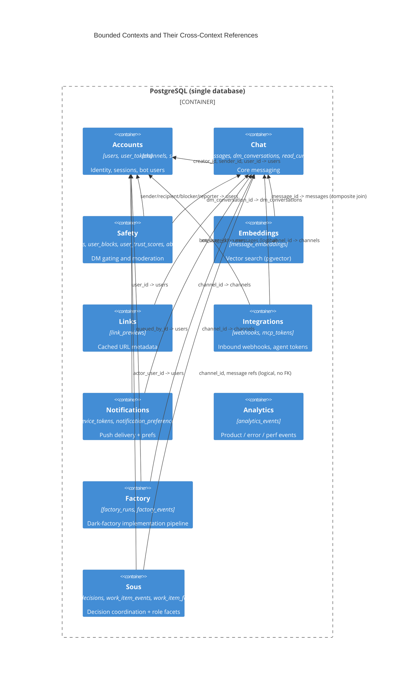
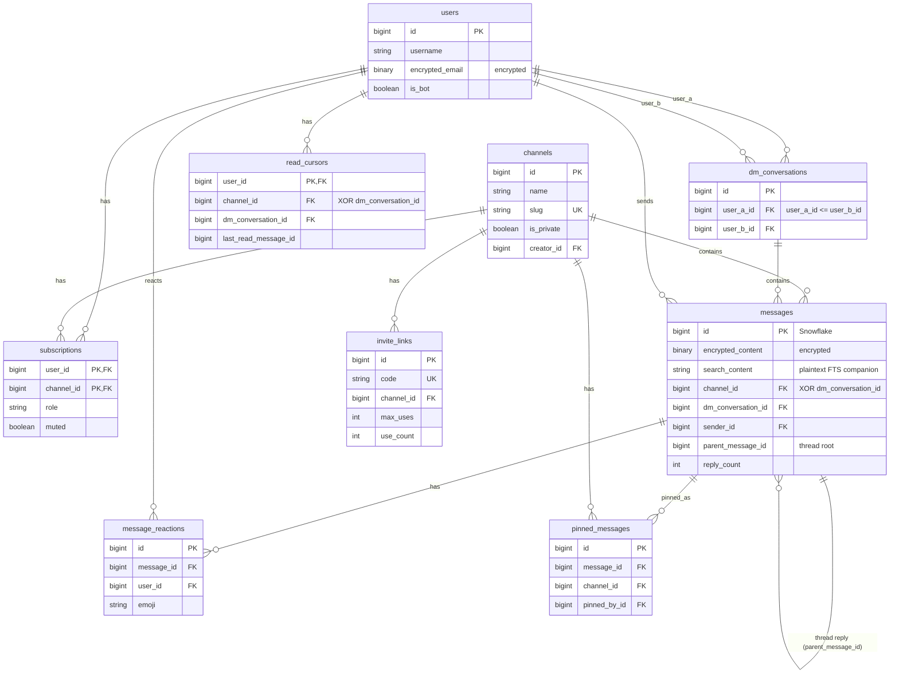
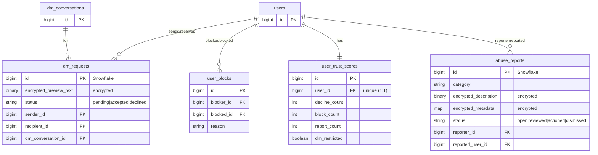
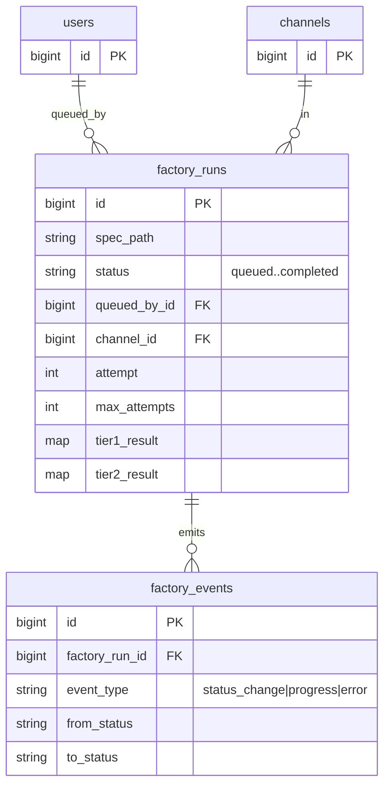

# Data Model & ERD

**Status:** Reference
**Zoom level:** L1 (system-wide reference — entity map across all bounded contexts)
**Scope:** An entity-relationship overview of the major Ecto schemas grouped by bounded context: Accounts, Chat, Safety, Embeddings, Integrations, Links, Notifications, Analytics, Factory, and Sous. Notes encrypted tables (Cloak field-level encryption), Snowflake-keyed tables, and the current (un)partitioned state of the `messages` table.

---

## 1. Overview

Slackex is a Phoenix application backed by a single PostgreSQL database. The data
model is split into ten bounded contexts, each owning its own schema modules under
`lib/slackex/<context>/`. This document is the **hub** for the relational model: it
shows every major table, its primary key strategy, its relationships, and the two
properties that recur across contexts and that newcomers find surprising — *Snowflake
primary keys* and *field-level encryption*.

Three design choices shape almost every entity:

1. **Snowflake IDs as primary keys for append-heavy tables.** `messages`,
   `dm_requests`, `abuse_reports`, `analytics_events`, `work_items`, and
   `work_item_events` use a 64-bit Snowflake ID (`Slackex.Infrastructure.Snowflake`)
   as their primary key with `autogenerate: false`. The ID encodes a millisecond
   timestamp in its high bits, so sorting by `id` sorts by creation time. On a
   subset of these tables — `messages`, `work_items`, and `work_item_events` —
   `inserted_at` is also *derived* from the ID (see `put_inserted_at/1` in
   `lib/slackex/chat/message.ex`) rather than read from `now()`, making
   `(id, inserted_at)` deterministic and immutable for a given row, which helps
   idempotent retries and (eventually) range partitioning. The other Snowflake
   tables (`dm_requests`, `abuse_reports`, `analytics_events`) keep a Snowflake PK
   but stamp `inserted_at` from `now()` via ordinary Ecto timestamps. Most non-append
   tables use ordinary serial `bigint` keys.

2. **Field-level encryption at rest (Cloak).** Personally-sensitive plaintext —
   email addresses, message bodies, DM request previews, abuse-report descriptions —
   is encrypted in the application before it reaches the database, using
   `Slackex.Vault` (AES-GCM-256). The encrypted columns are named `encrypted_*` and
   mapped via Ecto `source:` to a friendly field name. See §6 and
   [`encryption-at-rest.md`](encryption-at-rest.md).

3. **Exclusive-target rows.** Messages and read cursors belong to *either* a channel
   *or* a DM conversation, never both. This is enforced by a real database `CHECK`
   constraint (`messages_target_check`), not only in the changeset.

### A note on partitioning

The SCOPE asks this document to note partitioned tables. **As of this writing, no
table in the database is partitioned.** A live introspection (`pg_class` filtered to
`relkind = 'p'`) returns zero partitioned relations. Range partitioning of `messages`
by `inserted_at` is *designed but unimplemented*; the composite-key machinery that a
partition scheme would require is built only on the `message_embeddings ↔ messages`
read path (the `(message_id, message_inserted_at)` join), in anticipation. This
document therefore draws no partitioned entities. For the full design rationale and
the gap analysis, see
[`deep-dive-snowflake-partitioning.md`](deep-dive-snowflake-partitioning.md).

---

## 2. C4 Diagrams

### 2.1 Context Relationship Map

This is a context-level view: each bounded context is a box, and the arrows are the
cross-context foreign keys (or logical references) that stitch the model together.
`users`, `channels`, and `messages` are the three hub tables nearly every context
points at.

### 2.2 How to read the ER diagrams below

Each bounded context gets its own `erDiagram` (§3–§5) so no single diagram is
overloaded. Conventions:

- `PK` marks a primary key; `FK` marks a foreign key; `PK, FK` marks a column
  that is part of the primary key *and* a foreign key (Mermaid's combined-key
  syntax is comma-separated).
- A 🔒 in the prose marks a Cloak-encrypted column.
- Cross-context targets (e.g. `users`, `messages`) appear as **stub entities**
  (key only) inside a context diagram so the edge is not lost.
- Relationship cardinality uses Mermaid's crow's-foot notation
  (`||--o{` = one-to-many, `||--||` = one-to-one).

---

## 3. Accounts & Chat

### 3.1 Accounts

| Schema | Table | PK | Notes |
|---|---|---|---|
| `Slackex.Accounts.User` (`lib/slackex/accounts/user.ex`) | `users` | serial `bigint` | 🔒 `email` (`encrypted_email`), `email_hash` (deterministic HMAC for unique lookup), bcrypt `hashed_password`, `is_bot` flag for webhook/agent identities |
| `Slackex.Accounts.UserToken` (`lib/slackex/accounts/user_token.ex`) | `user_tokens` | serial `bigint` | SHA-256 hashed `token`, `context` discriminator (e.g. `session`); session validity 14 days |

`email` is stored encrypted, but uniqueness still has to work *without* decrypting
every row — so a second column `email_hash` holds a deterministic HMAC of the email
and carries the unique constraint. This is the canonical "encrypt-but-still-lookup"
pattern; see `put_email_hash/1` in `user.ex` and
[`accounts-and-auth.md`](accounts-and-auth.md).

### 3.2 Chat — core messaging

| Schema | Table | PK | Notes |
|---|---|---|---|
| `Slackex.Chat.Channel` (`lib/slackex/chat/channel.ex`) | `channels` | serial `bigint` | unique `slug` generated from `name`; `creator_id` nilified on user delete |
| `Slackex.Chat.Subscription` (`lib/slackex/chat/subscription.ex`) | `subscriptions` | **composite** `(user_id, channel_id)` — no surrogate key | role one of `owner`/`admin`/`member`/`viewer`; `muted` flag; join table for channel membership |
| `Slackex.Chat.Message` (`lib/slackex/chat/message.ex`) | `messages` | `bigint` **Snowflake** | 🔒 `content` (`encrypted_content`); `search_content` is a plaintext companion (see below); threads via self-referencing `parent_message_id`; soft-delete via `deleted_at` |
| `Slackex.Chat.DMConversation` (`lib/slackex/chat/dm_conversation.ex`) | `dm_conversations` | serial `bigint` | normalized `(user_a_id, user_b_id)` with DB `CHECK (user_a_id <= user_b_id)` and a unique index — dedupes swapped pairs; `<=` (not `<`) admits self-DMs |
| `Slackex.Chat.ReadCursor` (`lib/slackex/chat/read_cursor.ex`) | `read_cursors` | composite (`user_id` + exactly one target) | tracks `last_read_message_id` per conversation |
| `Slackex.Chat.MessageReaction` (`lib/slackex/chat/message_reaction.ex`) | `message_reactions` | serial `bigint` | unique `(message_id, user_id, emoji)` |
| `Slackex.Chat.PinnedMessage` (`lib/slackex/chat/pinned_message.ex`) | `pinned_messages` | serial `bigint` | unique `(message_id, channel_id)` |
| `Slackex.Chat.InviteLink` (`lib/slackex/chat/invite_link.ex`) | `invite_links` | serial `bigint` | unique `code`, `max_uses`/`use_count`/`expires_at` |

**The encrypted-content + plaintext-companion pattern.** Message bodies are stored as
AES-GCM ciphertext in `encrypted_content`, which PostgreSQL cannot index for
full-text search. The migration `20260303191200_add_fts_gin_index.exs` adds a separate
plaintext `search_content` column and a GIN index over
`to_tsvector('english', coalesce(search_content, ''))`. The changeset writes both
columns together (`put_search_content/1`), and soft-delete clears *both* `content`
and `search_content`. See [`encryption-at-rest.md`](encryption-at-rest.md) and
[`search-and-intelligence.md`](search-and-intelligence.md).

**Target exclusivity (verified DB constraint).** A message belongs to a channel or a
DM, never both. The `CHECK` constraint `messages_target_check`
(`(channel_id IS NOT NULL AND dm_conversation_id IS NULL) OR (channel_id IS NULL AND dm_conversation_id IS NOT NULL)`)
enforces this in the database, in addition to `validate_target/1` in the changeset.
`read_cursors` carries the analogous exactly-one-target rule.

**Self-DMs are allowed.** The schema docstring in `dm_conversation.ex` mentions
self-DMs (`user_a_id == user_b_id`) for personal notes, and the live DB constraint
backs this up: migration `20260227003024_allow_self_dm_conversations.exs` relaxed the
original strict `CHECK (user_a_id < user_b_id)` to `CHECK (user_a_id <= user_b_id)`,
so equal IDs are accepted at insert time. The changeset's `normalize_user_order/1`
only swaps when `user_a_id > user_b_id`, leaving equal IDs untouched.

**Pagination indexes are non-unique.** `(channel_id, id)` and `(dm_conversation_id,
id)` are ordinary (non-unique) indexes used as keyset-pagination cursors — not unique
constraints. Threads, reactions, and pins are covered in depth in
[`threads-and-reactions.md`](threads-and-reactions.md).

---

## 4. Safety, Integrations, Links, Notifications, Analytics

### 4.1 Safety (DM gating & moderation)

| Schema | Table | PK | Notes |
|---|---|---|---|
| `Slackex.Chat.DMRequest` (`lib/slackex/chat/dm_request.ex`) | `dm_requests` | `bigint` **Snowflake** | 🔒 `preview_text` (`encrypted_preview_text`); FKs use `on_delete: :nothing` for immutability; partial unique `(sender_id, recipient_id) WHERE status='pending'` |
| `Slackex.Chat.UserBlock` (`lib/slackex/chat/user_block.ex`) | `user_blocks` | serial `bigint` | unique `(blocker_id, blocked_id)`; self-block rejected |
| `Slackex.Chat.UserTrustScore` (`lib/slackex/chat/user_trust_score.ex`) | `user_trust_scores` | serial `bigint` | one-to-one with `users` (unique `user_id`); abuse counters + `dm_restricted`/`admin_flagged` flags |
| `Slackex.Chat.AbuseReport` (`lib/slackex/chat/abuse_report.ex`) | `abuse_reports` | `bigint` **Snowflake** | 🔒 `description` and 🔒 `metadata` (`Slackex.Encrypted.Map`); partial unique `(reporter_id, reported_user_id) WHERE status='open'`; `message_id` is a raw `bigint`, not a FK |

These four schemas live physically under `lib/slackex/chat/` but form a coherent
*Safety* sub-domain: trust scores accumulate from declines/blocks/reports and gate the
DM-request flow.

### 4.2 Integrations

| Schema | Table | PK | Notes |
|---|---|---|---|
| `Slackex.Integrations.Webhook` (`lib/slackex/integrations/webhook.ex`) | `webhooks` | serial `bigint` | unique `token_hash` (SHA-256, show-once); posts via `bot_user_id` into `channel_id`; `is_active` flag |
| `Slackex.Integrations.McpToken` (`lib/slackex/integrations/mcp_token.ex`) | `mcp_tokens` | serial `bigint` | unique `token_hash`; `bot_user_id` with `on_delete: :nothing`; `last_used_at`; identifies AI agents over MCP |

Both tables store only the *hash* of the secret token, never the token itself. See
[`integrations.md`](integrations.md).

### 4.3 Links & Notifications

| Schema | Table | PK | Notes |
|---|---|---|---|
| `Slackex.Links.LinkPreview` (`lib/slackex/links/link_preview.ex`) | `link_previews` | serial `bigint` | `message_id` (raw `bigint`, logical ref), unique `(message_id, url)`; `status` one of `pending`/`fetched`/`blocked` |
| `Slackex.Notifications.DeviceToken` (`lib/slackex/notifications/device_token.ex`) | `device_tokens` | serial `bigint` | unique `token`; `platform` one of `fcm`/`apns`/`web_push`; `user_id` FK |
| `Slackex.Notifications.Preference` (`lib/slackex/notifications/preference.ex`) | `notification_preferences` | serial `bigint` | `level` one of `all`/`mentions`/`nothing`; nullable `channel_id` — two partial unique indexes give one global default per user plus one row per `(user_id, channel_id)` |

The notification-preference table encodes a global-default-plus-overrides pattern in
the index layer: `unique(user_id) WHERE channel_id IS NULL` guarantees a single global
row, while `unique(user_id, channel_id) WHERE channel_id IS NOT NULL` allows at most
one per-channel override. See [`notifications.md`](notifications.md) and
[`links-and-previews.md`](links-and-previews.md).

### 4.4 Analytics

| Schema | Table | PK | Notes |
|---|---|---|---|
| `Slackex.Analytics.Event` (`lib/slackex/analytics/event.ex`) | `analytics_events` | `bigint` **Snowflake** | `event_type` (`page_view`, `feature_used`, `js_error`, `server_error`, `oban_error`, `performance`, `click`), `event_category`, nullable `user_id`, `session_id`, GIN-indexed `metadata` map; Snowflake ID is generated in the changeset, but `inserted_at` is stamped from `now()` (not derived from the ID) |

See [`analytics.md`](analytics.md).

---

## 5. Embeddings, Factory & Sous

### 5.1 Embeddings (vector search)

| Schema | Table | PK | Notes |
|---|---|---|---|
| `Slackex.Embeddings.MessageEmbedding` (`lib/slackex/embeddings/message_embedding.ex`) | `message_embeddings` | `message_id` (`bigint`, the message's Snowflake ID) | `embedding` is a `pgvector` column with an HNSW index (`vector_cosine_ops`, `m=16`, `ef_construction=64`); `content_hash` (64-char SHA-256 hex) detects re-embed need; carries denormalized `message_inserted_at`, `channel_id`, `dm_conversation_id` for scoped queries |

Embeddings are **immutable**: a changed message gets a new row keyed by `message_id`
(upsert), never an in-place update (`@timestamps_opts [updated_at: false]`). The
denormalized `message_inserted_at` exists to support the composite
`(message_id, message_inserted_at)` join against `messages` — the one place the
partition-ready join pattern is actually used today. See
[`embeddings.md`](embeddings.md) and
[`search-and-intelligence.md`](search-and-intelligence.md).

### 5.2 Factory (dark-factory pipeline)

| Schema | Table | PK | Notes |
|---|---|---|---|
| `Slackex.Factory.Run` (`lib/slackex/factory/run.ex`) | `factory_runs` | serial `bigint` | claim/heartbeat fields (`claim_token`, `claimed_at`, `last_heartbeat_at`, `heartbeat_timeout_minutes`); `tier1_result`/`tier2_result` maps; `queued_by_id`/`channel_id` use `on_delete: :restrict` |
| `Slackex.Factory.Event` (`lib/slackex/factory/event.ex`) | `factory_events` | serial `bigint` | append-only event stream for a run; `event_type` of `status_change`/`progress`/`error` |

See [`dark-factory.md`](dark-factory.md).

### 5.3 Sous (decision coordination & role facets)

```mermaid
erDiagram
  users {
    bigint id PK
  }
  work_items {
    bigint id PK "Snowflake"
    string kind "decision"
    string state "order|mise|pass|walked"
    text title
    map people
    bigint channel_id "no FK"
    bigint card_message_id "no FK"
  }
  decisions {
    bigint work_item_id PK, FK
    string what
    string why
    string next
  }
  work_item_events {
    bigint id PK "Snowflake"
    bigint work_item_id FK
    string type
    map payload
    bigint actor_user_id FK
  }
  viewers {
    string id PK "ceo|cto|em..."
    string name
    string color
    int position
  }
  work_item_facets {
    bigint work_item_id PK, FK
    string viewer_id PK, FK
    string attention "act|watch|know|hidden"
    text facet_text
  }

  work_items ||--|| decisions : has
  work_items ||--o{ work_item_events : emits
  users ||--o{ work_item_events : actor
  work_items ||--o{ work_item_facets : has
  viewers ||--o{ work_item_facets : "perspective"
```

| Schema | Table | PK | Notes |
|---|---|---|---|
| `Slackex.Sous.WorkItem` (`lib/slackex/sous/work_item.ex`) | `work_items` | `bigint` **Snowflake** | authoritative read-model projection, reconstructable from `work_item_events`; `kind`/`state` are `Ecto.Enum`; `card_message_id`/`thread_root_message_id` are **deliberately not FKs** (cards written async via cache, ADR-002) |
| `Slackex.Sous.Decision` (`lib/slackex/sous/decision.ex`) | `decisions` | `work_item_id` (no surrogate) | one-to-one with a work item; **plaintext** `what`/`why`/`next` (deliberate Slice-A choice, ADR-001) |
| `Slackex.Sous.WorkItemEvent` (`lib/slackex/sous/work_item_event.ex`) | `work_item_events` | `bigint` **Snowflake** | append-only audit log; `type` enum; self-describing `payload` map; unique `(work_item_id, id)` for replay ordering; `updated_at: false` |
| `Slackex.Sous.Viewer` (`lib/slackex/sous/viewer.ex`) | `viewers` | **string** (`ceo`, `cto`, `em`, …) | seeded with 7 default perspectives; immutable in B1 (no delete/rename) |
| `Slackex.Sous.WorkItemFacet` (`lib/slackex/sous/work_item_facet.ex`) | `work_item_facets` | composite `(work_item_id, viewer_id)` | per-viewer `attention` enum (`act`/`watch`/`know`/`hidden`, lazy absence defaults to `watch`); B2 adds `facet_text`/`facet_model`/`facet_prompt_version`/staleness columns |

Sous is event-sourced: `work_items` and `work_item_facets` are projections that the
`Slackex.Sous.Projection` rebuilds from the immutable `work_item_events` log. See
[`sous.md`](sous.md).

---

## 6. Encryption Details (Cloak)

Field-level encryption uses `Slackex.Vault` (Cloak, AES-GCM-256). Three Ecto custom
types wrap the vault:

| Type | Module | Purpose |
|---|---|---|
| `Slackex.Encrypted.Binary` | `lib/slackex/encrypted/binary.ex` | Encrypts arbitrary binary/string data |
| `Slackex.Encrypted.HMAC` | `lib/slackex/encrypted/hmac.ex` | Deterministic keyed hash for equality lookups on encrypted data |
| `Slackex.Encrypted.Map` | `lib/slackex/encrypted/map.ex` | JSON-encodes a map, then encrypts |

Encrypted columns by table (all `source:`-mapped to a friendly field name):

| Table | Field → column | Type |
|---|---|---|
| `users` | `email` → `encrypted_email` | `Encrypted.Binary` |
| `users` | `email_hash` | `Encrypted.HMAC` (carries the unique constraint) |
| `messages` | `content` → `encrypted_content` | `Encrypted.Binary` |
| `dm_requests` | `preview_text` → `encrypted_preview_text` | `Encrypted.Binary` |
| `abuse_reports` | `description` → `encrypted_description` | `Encrypted.Binary` |
| `abuse_reports` | `metadata` → `encrypted_metadata` | `Encrypted.Map` |

Because ciphertext is not indexable, two companions exist alongside encrypted columns:
the deterministic `email_hash` (for unique lookup) and the plaintext `search_content`
on `messages` (for FTS). The vault supports key rotation via tagged ciphers — the
first cipher encrypts new data, retired ciphers still decrypt legacy rows. Full detail
in [`encryption-at-rest.md`](encryption-at-rest.md).

---

## 7. Key Design Properties

- **Snowflake PKs double as time-ordered cursors.** `messages`, `dm_requests`,
  `abuse_reports`, `analytics_events`, `work_items`, and `work_item_events` carry a
  Snowflake PK, so pagination is keyset-by-ID, never offset. Of these, only
  `messages`, `work_items`, and `work_item_events` also *derive* `inserted_at` from
  the ID; the rest stamp `inserted_at` from `now()`.
- **Encrypt-but-lookup.** Sensitive plaintext is encrypted at rest; deterministic
  HMAC (`email_hash`) and plaintext companions (`search_content`) preserve uniqueness
  and search without decrypting.
- **Exclusive-target rows enforced in the DB.** `messages_target_check` and the
  read-cursor equivalent guarantee channel-XOR-DM at the database layer.
- **Immutable / append-only tables.** `user_tokens`, `user_blocks`, `pinned_messages`,
  `message_reactions`, `work_item_events`, `factory_events`, and `message_embeddings`
  are never updated in place (`updated_at: false` or upsert-only semantics).
- **Event-sourced projections (Sous).** `work_items` and `work_item_facets` are
  derivable from `work_item_events`.
- **No partitioned tables today.** Confirmed by `pg_class` introspection; the
  `messages` range-partition design is documented but unimplemented (§1).

---

## 8. Failure Modes & Resilience

This document describes a data model, not a running subsystem, but several model-level
choices exist specifically to bound failure:

- **Upsert ghost structs.** Tables written with `on_conflict: :nothing` (notably
  `message_embeddings`) return `{:ok, %Struct{id: nil}}` on conflict — a "success"
  with no DB identity. Callers must re-fetch by the unique key. This project-wide rule
  is enforced by a hook; see the Ecto upsert-safety note in `CLAUDE.md`.
- **`on_delete` strategy is per-relationship and deliberate.** `delete_all` cascades
  (subscriptions, messages-by-channel, reactions); `nilify_all` preserves history
  while dropping the actor (`messages.sender_id`, `channels.creator_id`); `nothing`
  protects immutable/audit rows (`dm_requests`, `abuse_reports`, `mcp_tokens`);
  `restrict` blocks deletion of referenced rows (`factory_runs.queued_by_id`,
  `factory_runs.channel_id`). The blast radius of a user or channel deletion is
  therefore explicit at the FK level rather than emergent.
- **Encryption availability.** All `encrypted_*` columns are unreadable without
  `Slackex.Vault`; a misconfigured key surfaces as a loud decode failure on read, not
  silent data loss. Key rotation is non-destructive (retired ciphers still decrypt).
- **Embeddings are non-essential by design.** The vector pipeline producing
  `message_embeddings` runs under a `restart: :temporary` supervisor so an embedding
  failure cannot cascade into the messaging core (incident precedent v0.5.36). See
  [`embeddings.md`](embeddings.md).

---

## 9. Code Map

| File | Responsibility |
|---|---|
| `lib/slackex/accounts/user.ex` | User identity, encrypted email, bot flag |
| `lib/slackex/accounts/user_token.ex` | Session / auth tokens |
| `lib/slackex/chat/channel.ex` | Channels |
| `lib/slackex/chat/subscription.ex` | Channel membership (composite PK join) |
| `lib/slackex/chat/message.ex` | Messages — Snowflake PK, encrypted content, FTS companion, threads |
| `lib/slackex/chat/dm_conversation.ex` | DM conversations with user-order invariant |
| `lib/slackex/chat/read_cursor.ex` | Per-conversation read state |
| `lib/slackex/chat/message_reaction.ex` | Emoji reactions |
| `lib/slackex/chat/pinned_message.ex` | Pinned messages |
| `lib/slackex/chat/invite_link.ex` | Channel invite links |
| `lib/slackex/chat/dm_request.ex` | DM requests (encrypted preview) |
| `lib/slackex/chat/user_block.ex` | User blocks |
| `lib/slackex/chat/user_trust_score.ex` | Abuse counters / DM restriction |
| `lib/slackex/chat/abuse_report.ex` | Abuse reports (encrypted description/metadata) |
| `lib/slackex/embeddings/message_embedding.ex` | pgvector embeddings (HNSW) |
| `lib/slackex/integrations/webhook.ex` | Incoming webhooks |
| `lib/slackex/integrations/mcp_token.ex` | MCP agent tokens |
| `lib/slackex/links/link_preview.ex` | Cached URL metadata |
| `lib/slackex/notifications/device_token.ex` | Push device tokens |
| `lib/slackex/notifications/preference.ex` | Notification preferences (global + per-channel) |
| `lib/slackex/analytics/event.ex` | Analytics events (Snowflake PK) |
| `lib/slackex/factory/run.ex` | Dark-factory runs |
| `lib/slackex/factory/event.ex` | Dark-factory run events |
| `lib/slackex/sous/work_item.ex` | Sous work-item projection |
| `lib/slackex/sous/decision.ex` | Decision payload (1:1 with work item) |
| `lib/slackex/sous/work_item_event.ex` | Sous append-only event log |
| `lib/slackex/sous/work_item_facet.ex` | Per-viewer facets |
| `lib/slackex/sous/viewer.ex` | Viewer perspectives (string PK) |
| `lib/slackex/vault.ex` | Cloak vault (AES-GCM-256) |
| `lib/slackex/encrypted/binary.ex` | Encrypted binary Ecto type |
| `lib/slackex/encrypted/hmac.ex` | Deterministic HMAC Ecto type |
| `lib/slackex/encrypted/map.ex` | Encrypted map Ecto type |
| `lib/slackex/infrastructure/snowflake.ex` | Snowflake ID generation / timestamp extraction |

---

## 10. Related Documents

- [`deep-dive-snowflake-partitioning.md`](deep-dive-snowflake-partitioning.md) — Snowflake ID structure, ordering guarantees, and the planned-but-unimplemented `messages` partitioning
- [`encryption-at-rest.md`](encryption-at-rest.md) — Cloak vault, encrypted column patterns, key rotation
- [`accounts-and-auth.md`](accounts-and-auth.md) — users, tokens, sessions, bot identities
- [`chat.md`](chat.md) — Chat context overview
- [`threads-and-reactions.md`](threads-and-reactions.md) — message threading and reaction model
- [`search-and-intelligence.md`](search-and-intelligence.md) — FTS + semantic hybrid search over the message model
- [`embeddings.md`](embeddings.md) — vector pipeline and `message_embeddings`
- [`integrations.md`](integrations.md) — webhooks and MCP tokens
- [`notifications.md`](notifications.md) — device tokens and preferences
- [`analytics.md`](analytics.md) — analytics event model
- [`links-and-previews.md`](links-and-previews.md) — link preview lifecycle
- [`dark-factory.md`](dark-factory.md) — factory runs and events
- [`sous.md`](sous.md) — Sous decision coordination and facet model
- [`realtime-chat.md`](realtime-chat.md) — how messages move through the live send path
- [`message-pipeline-and-persistence.md`](message-pipeline-and-persistence.md) — batched async persistence and writer fencing
- [`system-landscape.md`](system-landscape.md) — top-level system map
