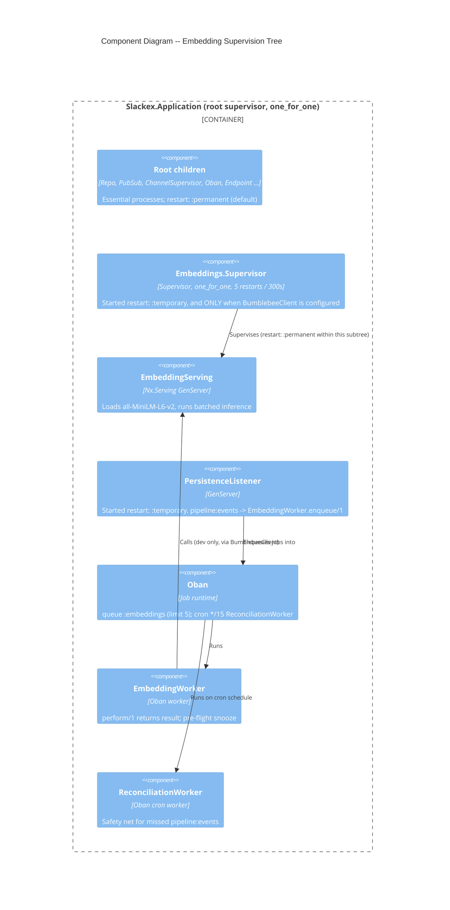
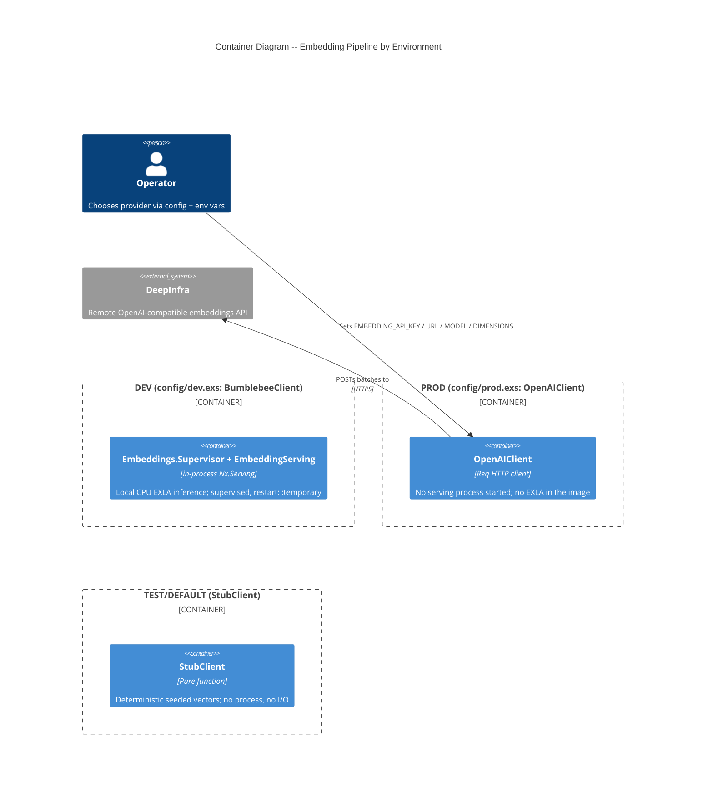
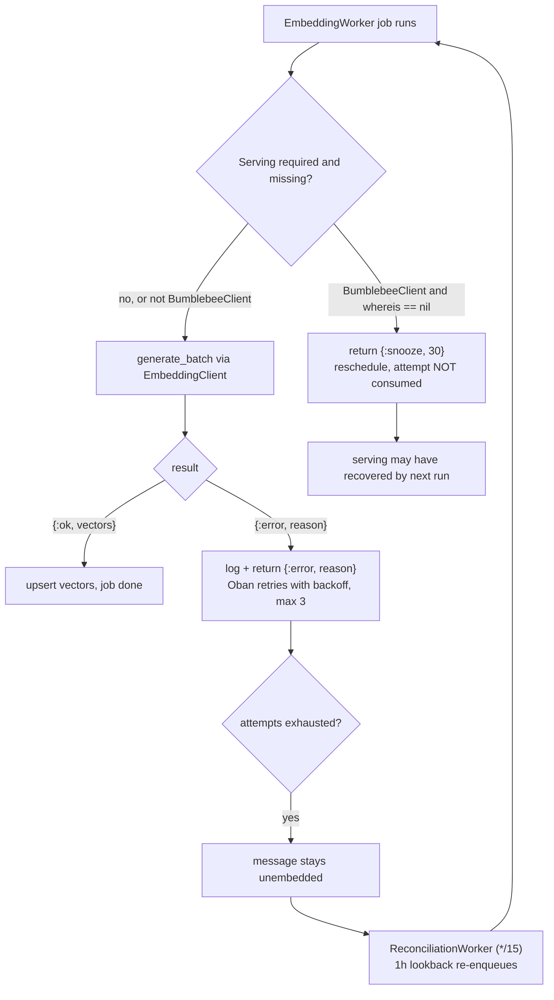
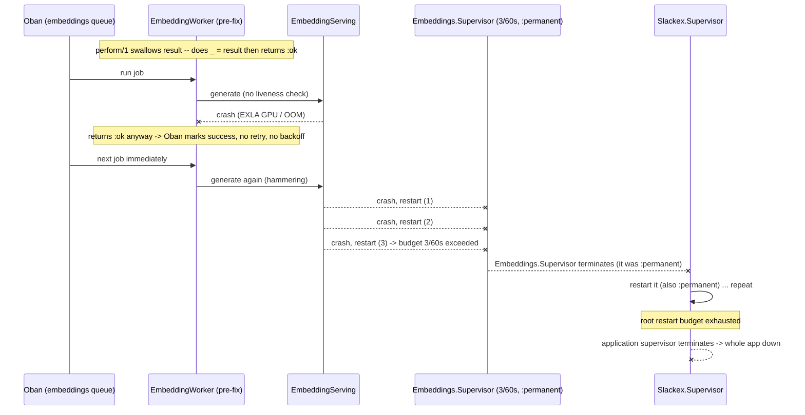

# Deep Dive: Embedding Pipeline Resilience

**Status:** Reference
**Zoom level:** L2 (deep dive)
**Scope:** The OTP supervision design that makes embedding generation non-essential — dedicated supervisor, `restart: :temporary`, restart-budget reasoning, blast-radius isolation; the snooze / reconciliation recovery sequencing; the v0.5.36–v0.5.43 cascade outage analysed in OTP terms; dev vs prod client selection; and the `EXLA_TARGET` compile-time constraint.

This document assumes you have read the L1 subsystem overview, [`embeddings.md`](embeddings.md). That document covers the components, the client behaviour, the data model, and the normal runtime flow. This one zooms into *why the supervision tree is shaped the way it is* and *how it degrades* — the OTP mechanics that the overview only summarises.

---

## 1. Overview

Embedding generation is **non-essential**. Search degrades to full-text and RAG context shrinks if embeddings stop, but chat keeps serving. The entire resilience design exists to enforce one invariant from the project's "Production Resilience" rule: *a crash in the embedding subsystem must never propagate into the application supervisor.*

That invariant is not free. The default OTP restart semantics (`restart: :permanent`) actively work against it: a permanent child that keeps dying will exhaust its parent's restart budget and take the parent down with it, and so on up the tree. The v0.5.36 outage was exactly this default behaviour doing exactly what it is documented to do. The current architecture overrides the default in three places and adds two recovery mechanisms so that the same failure now degrades instead of cascades.

The five mechanisms, in the order a failure encounters them:

1. **Error propagation** — `EmbeddingWorker.perform/1` returns its result so Oban can see failures and retry. (The bug that started the outage was discarding this.)
2. **Pre-flight snooze** — the worker checks the serving process exists before running and reschedules without burning an attempt if it does not.
3. **Dedicated supervisor with a generous budget** — `EmbeddingServing` lives under its own `Embeddings.Supervisor` (5 restarts / 300 s), absorbing transient model failures locally.
4. **`restart: :temporary` at the application boundary** — if that dedicated supervisor *does* exhaust its budget and die, the application supervisor does **not** restart it. The death stops there.
5. **Reconciliation safety net** — an Oban cron sweep re-enqueues any message the fire-and-forget PubSub bridge missed, so a listener crash is self-healing rather than data-losing.

Mechanisms 3–5 are the subject of this deep dive. 1 and 2 are covered at the worker level in the L1 doc and recapped here only where they affect the supervision story.

---

## 2. C4 Diagrams

### 2.1 Component Diagram — the supervision tree

This is the structural view: who supervises whom, and with which restart policy. The colours of the boxes matter — the two `restart: :temporary` boundaries are where the blast radius is contained.



Two things in this diagram are the whole point:

- `Embeddings.Supervisor` and `PersistenceListener` are both attached to the **root** supervisor with `restart: :temporary`. The root is `one_for_one`, so it would normally restart any dead child — `:temporary` opts these two out.
- `EmbeddingServing` is restarted **permanently within** `Embeddings.Supervisor` (the inner default), but the *whole subtree* is temporary from the root's perspective. This is the deliberate two-level design: tolerate transient serving crashes inside, but never let the subtree's eventual death climb to the root.

### 2.2 Container Diagram — environment-conditional shape

The tree above is the dev shape. In prod and test, the serving subtree is not present at all — `maybe_embedding_serving/1` returns the children list unchanged unless `BumblebeeClient` is configured.



The surprising part — production runs the *same model* as dev but reaches it over HTTP instead of in-process — is explained in §6 and in the L1 doc's "Client Selection" section. The resilience consequence is that **in prod there is no embedding process to crash at all**: the failure modes that the supervision tree guards against simply do not exist in the production topology. Prod's resilience is Oban retry + reconciliation, not supervision.

---

## 3. How To Read This Document

- Start with the **Component Diagram** (§2.1) to see the two-level supervision tree and the two `restart: :temporary` boundaries.
- Read **§4 Supervision Strategy** for the restart-budget reasoning — why 5/300s, why `:temporary`, and the exact OTP propagation rule that the v0.5.36 outage tripped.
- Read **§5 Recovery Sequencing** for the runtime ordering of snooze, retry, and reconciliation that makes the pipeline self-heal.
- Read **§6 Client Selection** for the dev/prod/test split and why prod offloads to a remote API.
- Read **§7 EXLA Compile-Time Constraint** for the single most counter-intuitive operational fact in this subsystem.
- Read **§8 v0.5.36 Cascade** for the incident retold as a sequence of OTP events.

### Terms Used Here

| Term | Meaning |
|---|---|
| Restart budget | `max_restarts` within `max_seconds` — exceeding it kills the supervisor itself |
| `:permanent` / `:temporary` | Child restart policy: always restart vs never restart |
| Blast radius | The set of processes a single failure can take down |
| Snooze | Oban return `{:snooze, n}` — reschedule in `n` seconds without consuming an attempt |
| Reconciliation | The cron sweep that re-enqueues messages the PubSub bridge missed |
| NIF | Native Implemented Function — the compiled C/Rust extension EXLA loads into the BEAM |

---

## 4. Supervision Strategy

### 4.1 The two-level design

`EmbeddingServing` is *not* attached directly to the root supervisor. It sits under a dedicated `Slackex.Embeddings.Supervisor`, which is itself attached to the root (`lib/slackex/embeddings/supervisor.ex`, `lib/slackex/application.ex`).

```elixir
# lib/slackex/embeddings/supervisor.ex
def init(_opts) do
  children = [Slackex.Embeddings.EmbeddingServing]
  Supervisor.init(children, strategy: :one_for_one, max_restarts: 5, max_seconds: 300)
end
```

```elixir
# lib/slackex/application.ex — maybe_embedding_serving/1
def maybe_embedding_serving(children) do
  case Application.get_env(:slackex, :embedding_client) do
    Slackex.Embeddings.BumblebeeClient ->
      spec = Supervisor.child_spec(Slackex.Embeddings.Supervisor, restart: :temporary)
      children ++ [spec]

    _other ->
      children
  end
end
```

Why two levels instead of attaching `EmbeddingServing` to the root directly with `restart: :temporary`?

- **The inner level absorbs transient failures.** Model loading touches the network (HuggingFace download on cold cache), the filesystem (model cache), and EXLA JIT compilation. Any of these can fail transiently. Inside `Embeddings.Supervisor`, `EmbeddingServing` is restarted with the *default* `:permanent` policy, so a single transient crash is simply retried — up to the budget.
- **The outer boundary contains the catastrophe.** If the failure is *not* transient — the model is genuinely broken, the GPU keeps crashing — the inner supervisor will exhaust its budget and die. Because the *subtree as a whole* is `restart: :temporary` from the root, that death is final and local. The root does not restart it, and crucially does not count it against the root's own budget.

A single-level design (serving directly under root, temporary) would lose the inner absorption: the very first transient crash would be permanent, killing semantic search on a hiccup that a retry would have fixed.

### 4.2 Restart-budget reasoning: why 5 / 300 s

The supervisor's moduledoc states the intent directly: "a generous restart budget (5 restarts / 300 seconds) to tolerate transient EXLA/model failures without exhausting too quickly."

The budget is deliberately *loose in time and tight in count*:

- **300 seconds (5 minutes)** is long enough that two unrelated transient failures — say a model reload after a deploy and a later EXLA compilation hiccup — do not get lumped into the same window and trip the limit spuriously.
- **5 restarts** is enough headroom for genuine transients but low enough that a true crash-loop (the failure recurs immediately) trips it in seconds rather than thrashing the host. A process that crashes on `handle_continue(:load_model, …)` and is restarted will re-attempt the load instantly; five such attempts complete almost immediately, the budget trips, and the subtree dies — by design — rather than spinning forever.

This budget exists *because* the previous one did not work. The incident-era budget was **3 restarts / 60 seconds** (recorded in the L1 doc and the RCA timeline). That window was both too short (transients separated by more than a minute reset the counter, masking a developing problem) and, combined with `restart: :permanent` at the boundary, lethal: when it tripped, the death propagated to the root.

### 4.3 The OTP propagation rule the outage tripped

The mechanism that turned a model crash into a full-app outage is standard, documented OTP behaviour:

1. A `:permanent` child that terminates abnormally is restarted by its supervisor.
2. If restarts exceed `max_restarts` within `max_seconds`, the **supervisor itself terminates** (it gives up).
3. A terminating supervisor is, to *its* parent, just a terminating child — subject to the parent's restart policy and counted against the parent's budget.
4. If every supervisor on the path to the root is `:permanent`, an unrecoverable leaf failure walks all the way up and terminates the root supervisor — i.e. the whole application.

The current design breaks the chain at step 3 by making the `Embeddings.Supervisor` child spec `restart: :temporary`. When the inner supervisor dies, the root sees a temporary child terminate, does nothing, and — because temporary terminations are not counted against the supervisor's restart intensity — the root's own budget is untouched. The blast radius is exactly the embedding subtree.

### 4.4 The listener boundary

The same `:temporary` reasoning applies to the PubSub→Oban bridge processes, attached to the root with explicit specs (`lib/slackex/application.ex`):

```elixir
Supervisor.child_spec(Slackex.Embeddings.PersistenceListener, restart: :temporary),
Supervisor.child_spec(Slackex.Links.LinkPreviewListener, restart: :temporary),
Supervisor.child_spec(Slackex.Factory.ChannelNotifier, restart: :temporary),
```

The inline comment in `application.ex` states the reasoning: "Listeners are non-essential PubSub→Oban bridges. If they repeatedly crash, `:permanent` restart would exhaust the root supervisor budget and take down the app. ReconciliationWorker is the safety net for missed embedding events."

`PersistenceListener` subscribes to `pipeline:events` in `init/1` and enqueues jobs on `{:messages_persisted, ids}` (`lib/slackex/embeddings/persistence_listener.ex`). If it crashes and is gone, the cost is *missed events*, not a crashed app — and §5.3 shows how those missed events are recovered. Making it `:permanent` would trade a recoverable data gap for an unrecoverable availability loss. That is the wrong trade for a non-essential bridge.

---

## 5. Recovery Sequencing

A failure in this subsystem passes through up to four recovery layers before any data is lost. The sequence is what makes the pipeline self-healing.

### 5.1 Layer order



### 5.2 Snooze before retry (the order matters)

The pre-flight check runs *before* any attempt is consumed:

```elixir
# lib/slackex/embeddings/embedding_worker.ex
defp ensure_serving_available do
  case Application.get_env(:slackex, :embedding_client) do
    Slackex.Embeddings.BumblebeeClient ->
      case Process.whereis(Slackex.Embeddings.EmbeddingServing) do
        nil ->
          Logger.warning("[EmbeddingWorker] EmbeddingServing not running, snoozing 30s")
          {:snooze, 30}
        _pid ->
          :ok
      end
    _other ->
      :ok
  end
end
```

The distinction between **snooze** and **retry** is the heart of why the new worker does not reproduce the outage's hammering behaviour:

- **Snooze** (`{:snooze, 30}`) means *the dependency is not ready* — reschedule without consuming an attempt. A model that takes 90 s to load on a cold start should not burn the job's 3-attempt budget while it loads. Snooze waits politely; it does not call `generate_batch` against a dead process.
- **Retry** (`{:error, reason}` → Oban backoff) means *the work was attempted and failed*. This consumes an attempt and backs off exponentially.

In the outage, neither existed: the worker discarded its result (so Oban never retried *or* backed off) and ran unconditionally (so it hammered a crashing serving process, accelerating the crash-loop that exhausted the supervisor budget). Snooze gates the work behind a liveness check; result-return gives Oban the signal it needs to back off. Together they convert a tight crash-loop into a paced, self-limiting retry.

The pre-flight check is also a no-op for non-`BumblebeeClient` configs (the `_other -> :ok` branch). In prod (`OpenAIClient`) there is no serving process to check; a dead remote API surfaces as an `{:error, …}` from `generate_batch` and follows the retry path, not the snooze path.

### 5.3 Reconciliation as the floor

The `pipeline:events` bridge is fire-and-forget. `PubSub.broadcast` to a topic with no live subscriber is silently dropped — there is no delivery guarantee and no buffering. So if `PersistenceListener` is down at the instant `ChannelServer` broadcasts (during a deploy, a node restart, or after the listener crashed), those message IDs are never enqueued.

`ReconciliationWorker` is the durability floor (`lib/slackex/embeddings/reconciliation_worker.ex`, cron `*/15 * * * *` in `config/config.exs`). Every 15 minutes it runs a LEFT JOIN of `messages` against `message_embeddings`, scoped to the last hour and to rows with a non-null `search_content` and no embedding, and re-enqueues them in batches of 50.

The two bounds encode an explicit trade-off:

- **15-minute cadence** caps the *latency* of recovery: a message missed by the bridge is embedded within ~15 minutes, not lost.
- **1-hour lookback** caps the *cost* of the sweep: it never scans the entire history. The consequence — stated plainly — is that a gap older than an hour is *not* covered by reconciliation; recovering those requires a one-off `EmbeddingWorker.enqueue_backfill/1` job for the affected scope.

This is why the listener can safely be `restart: :temporary`. The supervision policy and the reconciliation sweep are two halves of one decision: *the listener is allowed to die because the cron will catch what it drops.*

---

## 6. Client Selection: Dev vs Prod

The L1 doc has the full client comparison table; this section covers only what bears on resilience. The behaviour facade (`EmbeddingClient`) delegates `generate/1`, `generate_batch/1`, `dimensions/0` to whatever module `:embedding_client` names (`lib/slackex/embeddings/embedding_client.ex`). The resilience-relevant fact is that **the choice of client changes which failure modes exist at all**:

| Env | Client | Process started? | Dominant failure mode | Recovery |
|---|---|---|---|---|
| dev (`config/dev.exs`) | `BumblebeeClient` | Yes — `Embeddings.Supervisor` + `EmbeddingServing` | Local model / EXLA crash | Supervision (5/300s) + snooze |
| prod (`config/prod.exs`) | `OpenAIClient` | No | Remote API error / timeout | Oban retry + reconciliation |
| test / default | `StubClient` | No | None (pure function) | n/a |

The asymmetry is intentional. In dev, the cost of a local model is acceptable and the supervision tree (§4) absorbs its failures. In prod, the local model is *not* acceptable — see §7 — so the serving subtree is never started (`maybe_embedding_serving/1` returns the children unchanged for non-`BumblebeeClient`), and resilience shifts entirely to Oban's retry semantics plus the reconciliation floor.

`OpenAIClient` itself surfaces failures as values rather than crashes: `{:api_error, status, body}` for a non-200 and `{:network_error, exception}` for a transport failure (`lib/slackex/embeddings/openai_client.ex`). Both flow back through `generate_and_persist_embeddings/1` as `{:error, reason}`, are logged, and are returned to Oban for backoff — the same retry path described in §5.

> One configuration sharp edge (detailed in the L1 doc) is resilience-adjacent: `OpenAIClient`'s compiled-in default is 1536-dim `text-embedding-3-small`, but the `message_embeddings.embedding` column is `vector(384)`. Prod only gets 384-dim vectors because `runtime.exs` sets `:embedding_api` (with `EMBEDDING_DIMENSIONS` defaulting to `"384"`) **when `EMBEDDING_API_KEY` is present**. If that env var is unset in prod, every insert fails the column dimension check — a silent, total embedding outage that no supervisor catches because it is a data-contract error, not a process crash.

---

## 7. EXLA Compile-Time Constraint

This is the most counter-intuitive operational fact in the subsystem, and it is the reason the outage took so long to resolve.

### 7.1 The constraint

`EXLA_TARGET` is a **compile-time** variable. It controls how the EXLA NIF binary is built — specifically, whether the NIF includes GPU (CUDA/ROCm) support or is CPU-only (`host`). Once the NIF is compiled, the binary is fixed; setting `EXLA_TARGET` at *runtime* has no effect on an already-compiled NIF.

Worse — and this is the part that bit the incident hardest — a GPU-compiled EXLA NIF **probes the GPU when the NIF is loaded into the BEAM**, which happens when the EXLA module is first referenced at application start. The probe happens *whether or not Bumblebee is actually used for inference*. So merely having a GPU-compiled EXLA in the image is enough to touch the GPU on boot; disabling `BumblebeeClient` does not prevent it. On the production host — an unprivileged LXC on a mini-PC whose GPU cannot handle EXLA — that probe crashed the *physical Proxmox hypervisor*, not just the container.

The only fix that works is to compile the NIF CPU-only, by setting `ENV EXLA_TARGET=host` in the Dockerfile **before** `mix deps.compile`, so the NIF binary never contains GPU code in the first place.

### 7.2 What the current code actually does

The current production state resolves this constraint by a different route than the RCA's stated fix — and the difference is worth recording precisely, because the L1 overview and older notes describe the historical fix, not the present mechanism.

Two facts, both verified against the current tree:

1. **EXLA is not a production dependency.** `mix.exs` declares `{:exla, ">= 0.0.0", only: [:dev, :test]}`. The Dockerfile builds with `mix deps.get --only prod` before `mix deps.compile`, so EXLA is never fetched and never compiled into the production image. There is no EXLA NIF in prod to probe the GPU.
2. **The current Dockerfile does not set `ENV EXLA_TARGET=host`.** The RCA's definitive fix (v0.5.42) added that line; it is not present in the Dockerfile today. This is moot precisely because of (1) — with EXLA scoped out of the prod build, there is no NIF whose compilation target matters.

There is a belt-and-suspenders `EXLA_TARGET: "host"` runtime env var in `docker-compose.prod.yml`. Per the constraint in §7.1 this runtime setting has no effect on a compiled NIF; with no EXLA in the prod image it is doubly inert. It is harmless and can stay, but it is not what protects production.

### 7.3 The standing constraint

The protection in prod today is *dependency scoping* (EXLA is dev/test only) reinforced by *client selection* (prod uses `OpenAIClient`, which needs no EXLA at all). Either alone would prevent the GPU probe; both hold.

The constraint this leaves for any future change is concrete: **re-enabling local inference in production requires two coordinated changes, not one.** Moving `BumblebeeClient` into prod config is insufficient on its own, because EXLA would also have to be moved out of `only: [:dev, :test]` into the prod build — and the moment EXLA is in the prod image, the compile-time `ENV EXLA_TARGET=host` guard from the RCA must be re-added to the Dockerfile before `mix deps.compile`, or the GPU-probe-on-load failure recurs. Anyone contemplating that change should read the RCA (§9, Quaternary and Quinary causes) first.

---

## 8. The v0.5.36 Cascade, in OTP Terms

The L1 doc summarises the outage; this section retells it as the sequence of OTP events, because that sequence is the specification the current design is written against. (Full timeline and infrastructure detail: [`../rca/2026-03-05-embedding-cascade-app-crash.md`](../rca/2026-03-05-embedding-cascade-app-crash.md).)



The chain, mapped to the mechanisms that now break it:

| Outage step (OTP event) | What allowed it | Current mechanism that prevents it |
|---|---|---|
| Worker swallowed the crash (`_ = result; :ok`) | Oban saw success, never retried or backed off | `perform/1` returns the result via `with` (§5.2) |
| Worker hammered a dead serving process | No liveness pre-check; jobs ran unconditionally | `ensure_serving_available/0` → `{:snooze, 30}` (§5.2) |
| Inner supervisor tripped at 3/60s | Budget too tight; lumped/loose timing | 5 / 300 s budget (§4.2) |
| Inner supervisor death reached the root | `Embeddings.Supervisor` child spec was `:permanent` | `restart: :temporary` at the root boundary (§4.3) |
| EXLA crashed the host on NIF load | GPU-compiled NIF in the image, probed on load | EXLA scoped `only: [:dev, :test]`; prod uses `OpenAIClient` (§7) |
| Missed events were lost | No catch-up path | `ReconciliationWorker` cron sweep (§5.3) |

Every row's right-hand column is present in the current code described above. The outage is the negative image of the current design.

---

## 9. Key Design Properties

- **Failure stops at the subtree.** `restart: :temporary` on `Embeddings.Supervisor` and the listeners means an unrecoverable embedding failure terminates at most the embedding subtree, never the root supervisor.
- **Transients are absorbed, catastrophes are contained.** The two-level tree retries transient serving crashes inside (`:permanent`, 5/300s) but caps the catastrophe at the outer `:temporary` boundary.
- **Liveness gating prevents hammering.** Snooze reschedules without consuming an attempt when the dependency is not ready; it never calls a dead process.
- **Loud, not silent.** `perform/1` returns its result so Oban retries on failure; errors are logged. The swallowed-error anti-pattern is the one thing the design most strongly forbids.
- **Self-healing floor.** The 15-minute reconciliation sweep guarantees that anything the fire-and-forget bridge drops is recovered within ~15 minutes (within a 1-hour window).
- **Environment-conditional surface.** The serving process — and its EXLA/model memory footprint — is only started when `BumblebeeClient` is configured; prod and test never pay for it.
- **No GPU in prod, by construction.** EXLA is a dev/test-only dependency and prod uses a remote API, so the GPU-probe-on-load failure class cannot occur in production.

---

## 10. Failure Modes & Resilience

| Failure | Detection | Response | Blast radius |
|---|---|---|---|
| `EmbeddingServing` transient crash (dev) | `Embeddings.Supervisor` (`one_for_one`, 5/300s) | Restarted in place | None; brief inference pause |
| `EmbeddingServing` crash-loop (dev) | Inner budget 5/300s exhausted → supervisor dies | Root sees a `:temporary` child terminate; does **not** restart, budget untouched | Embedding subtree only; app serves, semantic search degraded until next deploy/restart |
| `EmbeddingServing` not yet loaded | `ensure_serving_available/0` sees `whereis == nil` | `{:snooze, 30}` — reschedule, no attempt consumed | None; jobs wait without hammering |
| Remote API error/timeout (prod) | `OpenAIClient` returns `{:api_error,…}` / `{:network_error,…}` | Logged + `{:error,…}` to Oban; retry with backoff (max 3) | That batch unembedded until retry/reconciliation |
| `PersistenceListener` crash | Process gone; broadcast has no subscriber | Started `:temporary` — not restarted; repeated crashes can't exhaust root budget | App unaffected; missed events recovered by reconciliation |
| Missed `pipeline:events` (deploy/restart) | No subscriber at broadcast instant | `ReconciliationWorker` (*/15, 1h lookback) re-enqueues | Up to ~15-min delay; gaps > 1h need manual backfill |
| `EMBEDDING_API_KEY` unset in prod | None at process level — inserts fail dimension check | Data-contract failure; not caught by supervision | Total embedding outage until env fixed |
| DB unavailable during upsert | Query raises in `perform/1` | Exception → Oban retry with backoff | Job-local |

The recurring theme: every process-level failure either degrades gracefully (subtree dies, app lives) or self-heals (snooze, retry, reconciliation). The one failure that supervision cannot catch is the configuration/data-contract failure (`EMBEDDING_API_KEY` unset → wrong dimensions), because it is not a crash — which is exactly why it is called out separately here and in the L1 doc.

---

## 11. Code Map

| File | Resilience responsibility |
|---|---|
| `lib/slackex/application.ex` | `maybe_embedding_serving/1` (conditional start); listener specs with `restart: :temporary` |
| `lib/slackex/embeddings/supervisor.ex` | Dedicated supervisor; 5/300s restart budget; `:one_for_one` |
| `lib/slackex/embeddings/embedding_serving.ex` | `Nx.Serving` GenServer; `handle_continue(:load_model, …)`; rescue/catch on load |
| `lib/slackex/embeddings/embedding_worker.ex` | `perform/1` returns result; `ensure_serving_available/0` snooze gate; backfill best-effort |
| `lib/slackex/embeddings/bumblebee_client.ex` | `safe_run/1` catches `:exit`/exceptions → `{:error, …}` instead of crashing the caller |
| `lib/slackex/embeddings/openai_client.ex` | Maps API/network failures to `{:error, …}` values for Oban retry |
| `lib/slackex/embeddings/persistence_listener.ex` | `pipeline:events` → `EmbeddingWorker.enqueue/1` (the bridge that may be dropped) |
| `lib/slackex/embeddings/reconciliation_worker.ex` | Cron safety-net sweep; 1-hour lookback; batches of 50 |
| `config/config.exs` | Oban `:embeddings` queue (limit 5); cron `*/15` ReconciliationWorker; default `StubClient` |
| `config/{dev,prod,test}.exs` | Per-env `:embedding_client` selection (Bumblebee / OpenAI / Stub) |
| `config/runtime.exs` | `:embedding_api` (URL/model/dimensions/key) when `EMBEDDING_API_KEY` set |
| `mix.exs` | `{:exla, ">= 0.0.0", only: [:dev, :test]}` — EXLA excluded from prod build |
| `Dockerfile` | `mix deps.get --only prod` then `mix deps.compile` — no EXLA in prod image |

---

## 12. Related Documents

- [`embeddings.md`](embeddings.md) — L1 subsystem overview: components, client behaviour, data model, normal runtime flow (read this first)
- [`realtime-chat.md`](realtime-chat.md) — the `ChannelServer` → `BatchWriter` path that produces the `pipeline:events` broadcast this subsystem consumes
- [`search-and-intelligence.md`](search-and-intelligence.md) — how the stored vectors are queried (semantic, hybrid RRF) and authorized
- [`../rca/2026-03-05-embedding-cascade-app-crash.md`](../rca/2026-03-05-embedding-cascade-app-crash.md) — full root-cause analysis and timeline of the v0.5.36–v0.5.43 outage
- [`../runbooks/observability.md`](../runbooks/observability.md) — metrics and traces, including the `[:slackex, :ai, :embedding]` telemetry event
- [`../engineering-principles.md`](../engineering-principles.md) — cross-cutting production-resilience and deploy-safety rules
