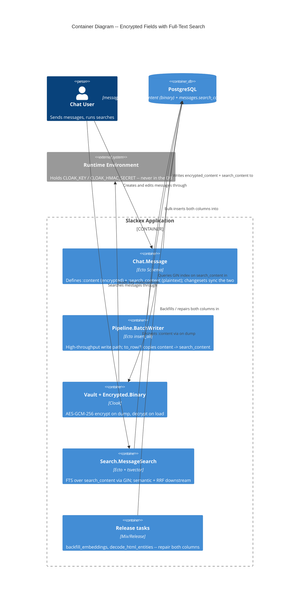
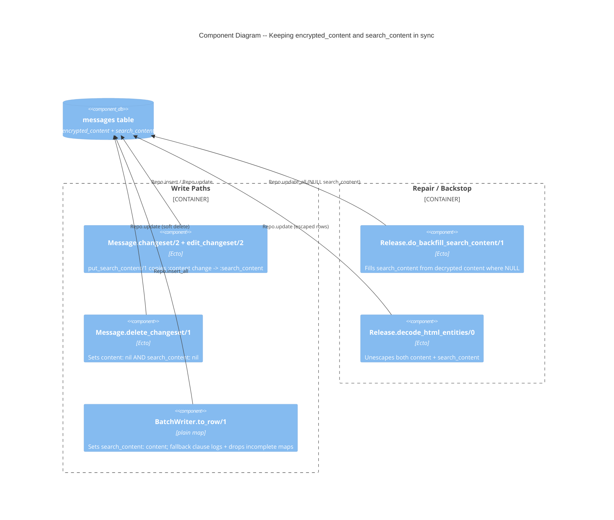
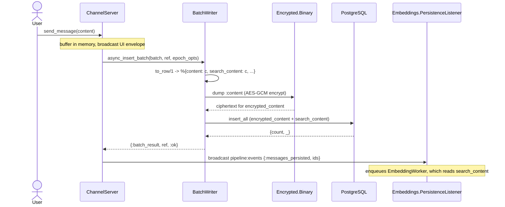
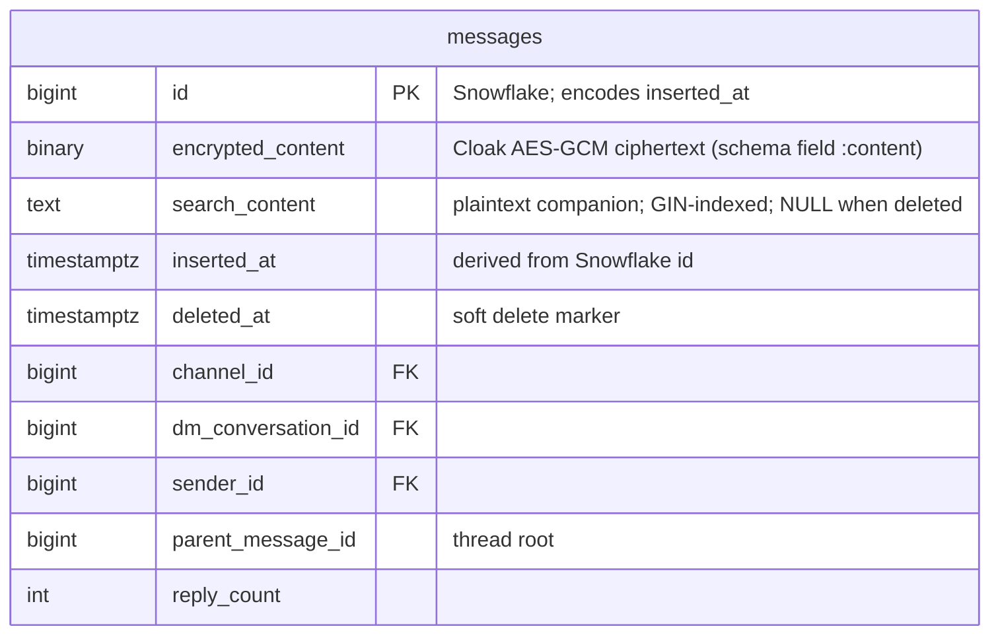

# Deep Dive: Encrypted Fields with Full-Text Search

**Status:** Reference
**Zoom Level:** L2 (subsystem deep dive)
**Scope:** The tension between Cloak field-level encryption and searchability, resolved by a plaintext `search_content` companion column with a GIN/FTS index. Covers the write path that keeps both columns in sync, the threat-model trade-off, and the migration history.

---

## 1. Overview

Message bodies are encrypted at rest with Cloak (AES-GCM-256). The ciphertext lives in the `encrypted_content` column and is decrypted transparently on load via the `Slackex.Encrypted.Binary` Ecto type. This protects message text in the narrow case where the database contents leak but the encryption key does not.

Encryption creates a problem: **PostgreSQL cannot index ciphertext.** A GIN full-text index over AES-GCM bytes is useless — every search would have to decrypt every row in the application. Users still expect to search their messages.

Slackex resolves this with a deliberate dual-column design. Every message row stores its body **twice**:

- `encrypted_content` — Cloak AES-GCM ciphertext, mapped to the schema field `:content` via `source: :encrypted_content`.
- `search_content` — the same body as **plaintext** `text`, indexed by a GIN index over `to_tsvector('english', search_content)`.

Full-text search (`Slackex.Search.MessageSearch.text_search/3`) queries only `search_content`. The plaintext column is also the source of truth for the embedding pipeline (semantic search) and for `ts_headline` snippet highlighting.

The cost is explicit and documented: a plaintext column sitting in the same row as the ciphertext largely defeats the at-rest confidentiality guarantee against any attacker who can read the database (dump, replica, backup, SQL injection). This is `search_content` "plaintext by design" — searchability was chosen over strict column-level confidentiality. See `docs/research/embedding-provider-evaluation.md` and §6 below.

The surprising part for a newcomer: the encryption is **not** what protects message text from a database breach — `search_content` makes that protection void. The encryption buys exactly one thing: protection of `encrypted_content` when ciphertext leaks but `CLOAK_KEY` (held only in the runtime environment, never in the DB) does not.

---

## 2. C4 Diagrams

### 2.1 Container Diagram



### 2.2 Component Diagram -- the dual-column write contract



---

## 3. Main Components

| Component | Responsibility |
|---|---|
| `Slackex.Chat.Message` | Ecto schema. Declares `:content` (encrypted, `source: :encrypted_content`) and `:search_content` (plaintext). Changesets call `put_search_content/1` to keep them in sync. |
| `Slackex.Encrypted.Binary` | Ecto type: `use Cloak.Ecto.Binary, vault: Slackex.Vault`. Encrypts on dump, decrypts on load — transparent to callers. |
| `Slackex.Vault` | `use Cloak.Vault`. AES-GCM-256 cipher(s) configured from env via `runtime.exs`. Supports key rotation (primary + retired cipher). |
| `Slackex.Pipeline.BatchWriter` | High-throughput write path. `to_row/1` copies `content` into `search_content`; `insert_batch/2` bulk-inserts via `Repo.insert_all`. |
| `Slackex.Search.MessageSearch` | `text_search/3` runs `tsvector`/`tsquery` over `search_content` (GIN-accelerated), ranked by `ts_rank`. Authorization via EXISTS subqueries. |
| `Slackex.Release` | `backfill_embeddings/1` and `decode_html_entities/0` — the repair backstop that keeps both columns consistent across the install base. |

---

## 4. Write Path: How Both Columns Stay in Sync

There are **two** insertion paths, and the sync is enforced by convention in each — there is **no database constraint or trigger** guaranteeing `search_content` mirrors the decrypted `encrypted_content`. Understanding both paths matters because any new write path must repeat the copy.

### 4.1 Path A — Changeset path (API sends and edits)

`Slackex.Chat.Message.changeset/2` and `edit_changeset/2` both pipe through `put_search_content/1` (`lib/slackex/chat/message.ex:69-74`):

```elixir
defp put_search_content(changeset) do
  case get_change(changeset, :content) do
    nil -> changeset
    content -> put_change(changeset, :search_content, content)
  end
end
```

When `:content` changes, the **plaintext** value is copied directly into `:search_content` before persistence. Both fields are written in the same `Repo.insert`/`Repo.update`, so within this path drift is impossible. This path validates content length (1–4000 chars) and is the low-frequency route used by explicit message creation and edits.

Soft-delete is the mirror of this contract: `delete_changeset/1` (`lib/slackex/chat/message.ex:62-67`) sets **both** `content: nil` and `search_content: nil`, so a deleted message is unsearchable and its plaintext is gone in the same write.

### 4.2 Path B — Batch path (realtime hot path)

The realtime pipeline does not use changesets. `ChannelServer` buffers messages and flushes them through `Slackex.Pipeline.BatchWriter`, which bypasses Ecto changesets and calls `Repo.insert_all/3` directly for speed. The sync lives in `to_row/1` (`lib/slackex/pipeline/batch_writer.ex:98-112`):

```elixir
%{
  id: id,
  content: content,
  search_content: content,   # <-- copy enforced here, by convention
  ...
}
```

Because this path skips changesets, none of `put_search_content/1`, length validation, or `validate_target/1` runs — `to_row/1` must reproduce the copy itself. There is a defensive fallback clause (`batch_writer.ex:114-117`): a message map missing required keys logs a warning and returns `nil`, and the entry is rejected before insert rather than producing a corrupt row.

`insert_batch/2` writes with `on_conflict: :nothing` (idempotent re-flush) inside a transaction that fences on `writer_epoch` (full mechanics in `realtime-chat.md`). The encryption happens at the type boundary regardless of path: `Repo.insert_all` still dumps `:content` through `Slackex.Encrypted.Binary`, so `encrypted_content` is ciphertext and `search_content` is plaintext in the same row.

### 4.3 Sequence: a realtime send populating both columns



Note the trigger ordering: the `pipeline:events` broadcast is emitted by `ChannelServer` in `handle_info({:batch_result, ref, :ok}, …)` **after** the batch persists (`lib/slackex/messaging/channel_server.ex:219-224`), not by `BatchWriter`. The embedding pipeline therefore consumes `search_content` only for rows that are already durable. See `deep-dive-pipeline-events-bridge.md`.

---

## 5. Data Model

The `messages` table carries both representations of the body plus the search index.



Schema highlights (`lib/slackex/chat/message.ex`):

- `field :content, Slackex.Encrypted.Binary, source: :encrypted_content` — the in-memory field is `:content`; the DB column is `encrypted_content`. Application code never sees the ciphertext.
- `field :search_content, :string` — plain `text` column.
- Virtual (never persisted) fields `:headline`, `:similarity`, `:search_score` carry per-query search output back to callers.

Index (`priv/repo/migrations/20260303191200_add_fts_gin_index.exs`):

```sql
CREATE INDEX CONCURRENTLY IF NOT EXISTS messages_search_content_fts_idx
ON messages USING GIN (to_tsvector('english', coalesce(search_content, '')))
```

- **GIN** is PostgreSQL's inverted index for full-text search — it stores stemmed lexemes, so `to_tsvector('english', 'running dogs')` indexes `'dog' 'run'`.
- **`CONCURRENTLY`** plus `@disable_ddl_transaction true` / `@disable_migration_lock true` build the index without locking `messages` — required for a deploy-safe migration on a live table.
- **`coalesce(search_content, '')`** keeps the index expression total: deleted messages (`search_content = NULL`) still index cleanly as the empty document.

### Query shape

`MessageSearch.build_search_query/3` (`lib/slackex/search/message_search.ex:231-266`) matches the same expression the index is built on, so the planner can use the GIN index:

```elixir
where: fragment(
  "to_tsvector('english', coalesce(?, '')) @@ plainto_tsquery('english', ?)",
  m.search_content, ^query
),
order_by: fragment(
  "ts_rank(to_tsvector('english', coalesce(?, '')), plainto_tsquery('english', ?)) DESC",
  m.search_content, ^query
),
```

`plainto_tsquery` parses untrusted user input safely (no operator injection); `ts_rank` orders by relevance; `ts_headline` (with `StartSel=<mark>`) produces highlighted snippets returned in the virtual `:headline`. `explain_text_search/3` exists purely for tests to assert the GIN index is actually chosen.

**Authorization** is layered on as EXISTS subqueries, never JOINs (`message_search.ex:320-418`). A JOIN against `subscriptions` could duplicate a matching row per membership, inflating its `ts_rank` and corrupting pagination; `EXISTS` answers a boolean without multiplying rows. Deleted messages are always excluded via `where: is_nil(m.deleted_at)`.

> **Not partitioned.** The `messages` table is a plain table — there is no `PARTITION` DDL in any migration. The composite predicate in the semantic query (`me.message_id == m.id and me.message_inserted_at == m.inserted_at`, `message_search.ex:277`) is the composite reference into `message_embeddings`, not partition pruning. Snowflake-derived ordering and the `inserted_at` derivation are covered in `deep-dive-snowflake-partitioning.md`.

---

## 6. Threat Model Trade-off

The dual-column design is a deliberate confidentiality compromise. Stating it honestly:

**What encryption protects.** `encrypted_content` is AES-GCM ciphertext. `CLOAK_KEY` (and the HMAC secret) live only in the runtime environment, injected via `config/runtime.exs:25-62`, and are never written to the database. So if an attacker obtains *ciphertext only* — and not the key — `encrypted_content` is opaque.

**What the design forfeits.** `search_content` is plaintext in the **same row**. Any attacker who can read the table reads message bodies directly: a database dump, a compromised read replica, a stolen backup, or a SQL-injection `SELECT search_content`. For these scenarios the at-rest encryption of message text provides essentially no protection, because the same content is one column over in cleartext.

| Scenario | Message text exposed? | Why |
|---|---|---|
| Ciphertext leak, key not leaked | No | `search_content` would need separate exposure; `encrypted_content` is opaque without `CLOAK_KEY` |
| DB dump / backup theft | **Yes** | `search_content` is plaintext in the dump |
| Read-replica compromise | **Yes** | `search_content` replicates as plaintext |
| SQL injection (`SELECT`) | **Yes** | Attacker can read `search_content` directly |
| App memory compromise | **Yes** | Decrypted `:content` is in process memory during request handling |
| Embedding provider (when remote) | **Yes** | `search_content` is sent to the provider to compute vectors |

**Why accept it.** Full-text and semantic search are core product features and both require the plaintext: FTS needs an indexable column, and embedding generation needs the raw text. The trade was made consciously — `docs/research/embedding-provider-evaluation.md` records `search_content` as "plaintext by design" and notes the same text is sent to the remote embedding provider under a no-training/no-retention policy, with local Bumblebee available "if privacy becomes a hard constraint." The encryption is retained for the one threat it still addresses (ciphertext-only leak) and for fields with no search requirement.

Cross-reference the broader at-rest model (other encrypted fields: user email, DM previews, abuse reports) in `encryption-at-rest.md`.

---

## 7. Migration History

The order of migrations reveals an intentional progression — and one honest gap.

| Date / file | What it did | Effect on search |
|---|---|---|
| `20260221000006_create_messages.exs` | Created `messages` with `content :text NOT NULL` and a GIN index `messages_content_fts_idx` on `to_tsvector('english', content)`. | FTS over **plaintext `content`** (pre-encryption era). |
| `20260227230900_add_encrypted_content_to_messages.exs` | Added `encrypted_content :binary`; dropped `NOT NULL` on `content`. | Dual-write transition begins; old plaintext FTS index still present. |
| `20260228010000_drop_plaintext_columns.exs` | Removed the `content` column (and plaintext columns on `users`, `dm_requests`, `abuse_reports`). | **FTS gap:** dropping `content` implicitly dropped `messages_content_fts_idx`. No full-text search exists in this window. |
| `20260303191200_add_fts_gin_index.exs` | Added `search_content :text` and `messages_search_content_fts_idx` (GIN, `CONCURRENTLY`). | FTS **restored** over the new plaintext companion column. |

Two facts worth flagging:

1. **The gap is real.** Between `drop_plaintext_columns` and `add_fts_gin_index` the schema had no full-text index at all — the old one died with the `content` column and the new one did not yet exist. The schema's `source: :encrypted_content` mapping was already in place, so the schema kept working; only search was unavailable.
2. **No backfill in the index migration.** `add_fts_gin_index` adds the column but does not populate it for historical rows. That backfill is done out-of-band by `do_backfill_search_content/1`, which runs only inside `backfill_embeddings/1` — invoked manually via `bin/slackex eval` or `mix slackex.backfill_embeddings`, not automatically on deploy. (The separate `decode_html_entities/0` repair *does* run automatically in `migrate/0`; see §8.)

`drop_plaintext_columns` documents its run order: `mix slackex.encrypt_existing` must encrypt existing data into `encrypted_content` **before** the plaintext `content` column is dropped, or message bodies would be lost.

---

## 8. Failure Modes & Resilience

**The core risk: a write path that forgets to populate `search_content`.** The invariant "`search_content` mirrors the plaintext of `encrypted_content`" is enforced by convention in two places (`put_search_content/1` and `to_row/1`) and by **nothing in the database**. A new insertion path that omits the copy silently produces an unsearchable, un-embeddable row. There is no constraint, trigger, or shared callback that would catch it.

Mitigations actually present in the code:

- **Backfill backstop.** `Slackex.Release.do_backfill_search_content/1` (`lib/slackex/release.ex:321-337`) selects messages where `search_content IS NULL AND deleted_at IS NULL`, reads the decrypted `content`, and writes it into `search_content` via `update_all`. It is idempotent (NULL filter) and runs as part of `backfill_embeddings/1`.
- **Content-cleanup repair.** `Release.decode_html_entities/0` (`lib/slackex/release.ex:92-…`) repairs rows whose bodies were HTML-entity-escaped by an old sanitizer. Because the escaping happened before encryption, **both** `content` and `search_content` hold the escaped form, so the task unescapes both fields together, with a sampled roundtrip checkpoint (decode → re-encrypt → reload → verify → revert) before processing the full set. This task runs automatically in `migrate/0` on every deploy. Its moduledoc directs the operator to run `backfill_embeddings(force: true)` afterwards to re-embed from clean text — that re-embedding is a manual follow-up, not part of the decode task itself.
- **Batch fallback clause.** `BatchWriter.to_row/1`'s catch-all (`batch_writer.ex:114-117`) logs and drops incomplete message maps rather than inserting a half-populated row.
- **Embedding reconciliation.** `Slackex.Embeddings.ReconciliationWorker` is an Oban cron worker (every 15 min, 1-hour lookback) that LEFT-JOINs `messages` against `message_embeddings` and enqueues `EmbeddingWorker` for any message missing an embedding — the durability net for the `pipeline:events` bridge when `PersistenceListener` was down. It addresses **missing embeddings**, not missing `search_content`; `do_backfill_search_content/1` is the backstop for the latter.

**Blast radius.** A `search_content` gap degrades gracefully: search misses those rows but chat, history, and decryption are unaffected (the authoritative body is still in `encrypted_content`). FTS index unavailability degrades to no text matches; the `coalesce(search_content, '')` guard means NULLs never error the query. Encryption failures are loud by design — a missing `CLOAK_KEY` raises in `runtime.exs` at boot rather than silently storing plaintext.

**Recovery** is partly automatic, partly operator-driven. `ReconciliationWorker` refills missing embeddings on its next cron tick with no intervention, and `decode_html_entities/0` self-heals entity-escaped bodies on every deploy via `migrate/0`. Repopulating missing `search_content`, however, requires an operator to run `backfill_embeddings/1` (which calls `do_backfill_search_content/1`) — it is not invoked automatically on deploy.

---

## 9. Key Design Properties

- **Searchability over column confidentiality.** Plaintext `search_content` is intentional; the encryption protects only against a ciphertext-only leak (key held outside the DB).
- **Two write paths, one convention.** Changeset `put_search_content/1` and batch `to_row/1` both copy plaintext into `search_content`; no DB constraint enforces it, so every new write path must repeat the copy.
- **Index expression == query expression.** The GIN index and the search query share `to_tsvector('english', coalesce(search_content, ''))`, so the planner can use the index.
- **EXISTS, not JOIN, for authorization.** Avoids row duplication that would corrupt `ts_rank` and pagination.
- **Deploy-safe index creation.** `CONCURRENTLY` + disabled DDL transaction/lock build the FTS index without blocking writes.
- **Symmetric soft delete.** `delete_changeset/1` nulls both `content` and `search_content`, removing plaintext and search visibility together.
- **Repair as a release task, not a manual step.** Backfill and entity-decode run on deploy and are idempotent.

---

## 10. Code Map

| File | Responsibility |
|---|---|
| `lib/slackex/chat/message.ex` | Schema (`:content` encrypted + `:search_content`); `changeset/2`, `edit_changeset/2`, `delete_changeset/1`, `put_search_content/1` |
| `lib/slackex/encrypted/binary.ex` | `use Cloak.Ecto.Binary` — encrypt-on-dump / decrypt-on-load Ecto type |
| `lib/slackex/vault.ex` | `use Cloak.Vault`; AES-GCM-256; key-rotation procedure (primary + retired cipher) |
| `config/runtime.exs` | Sources `CLOAK_KEY` / `CLOAK_KEY_TAG` / retired key / `CLOAK_HMAC_SECRET` from env; raises if missing in prod |
| `lib/slackex/pipeline/batch_writer.ex` | `to_row/1` copies content→search_content; `insert_batch/2` bulk insert with epoch fence |
| `lib/slackex/messaging/channel_server.ex` | Flushes batches; broadcasts `pipeline:events {:messages_persisted, ids}` after persist |
| `lib/slackex/search/message_search.ex` | `text_search/3` FTS over `search_content`; EXISTS authorization; RRF/semantic downstream |
| `lib/slackex/release.ex` | `backfill_embeddings/1`, `do_backfill_search_content/1`, `decode_html_entities/0` |
| `lib/slackex/embeddings/reconciliation_worker.ex` | Oban cron net for missing embeddings |
| `priv/repo/migrations/20260221000006_create_messages.exs` | Original plaintext `content` + FTS index (pre-encryption) |
| `priv/repo/migrations/20260227230900_add_encrypted_content_to_messages.exs` | Adds `encrypted_content`; drops `content` NOT NULL |
| `priv/repo/migrations/20260228010000_drop_plaintext_columns.exs` | Drops `content` (and other plaintext columns) |
| `priv/repo/migrations/20260303191200_add_fts_gin_index.exs` | Adds `search_content` + GIN FTS index (`CONCURRENTLY`) |

---

## 11. Related Documents

- `encryption-at-rest.md` — the full at-rest encryption model: Vault, ciphers, key rotation, and the other encrypted fields (email, DM previews, abuse reports)
- `deep-dive-hybrid-rrf-search.md` — how FTS over `search_content` fuses with semantic search via Reciprocal Rank Fusion
- `search-and-intelligence.md` — the search subsystem at container level (text, semantic, hybrid, UI mode labels)
- `embeddings.md` / `deep-dive-embedding-resilience.md` — the embedding pipeline that consumes `search_content`, and its supervision/restart strategy
- `deep-dive-pipeline-events-bridge.md` — the `pipeline:events` producer→consumer bridge that triggers embedding from persisted messages
- `message-pipeline-and-persistence.md` — the batch write path, `BatchWriter`, and writer-epoch fencing
- `realtime-chat.md` — the realtime send path that feeds `ChannelServer` → `BatchWriter`
- `deep-dive-snowflake-partitioning.md` — Snowflake IDs, `inserted_at` derivation, and message ordering
