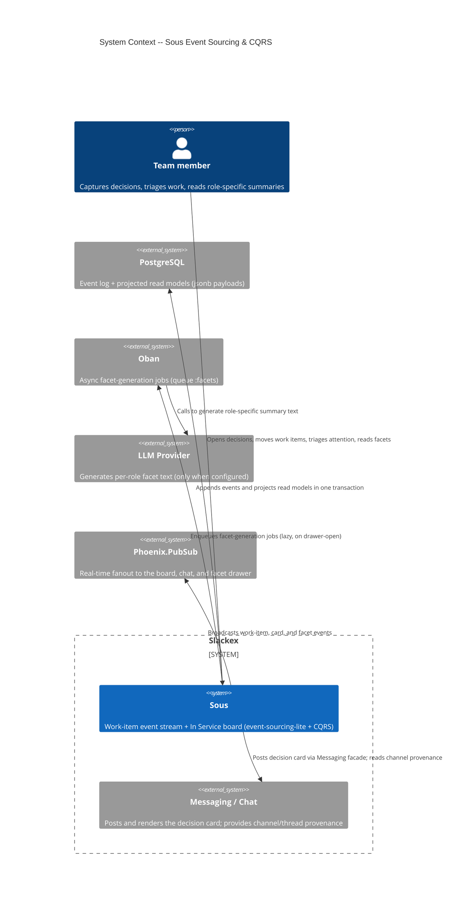
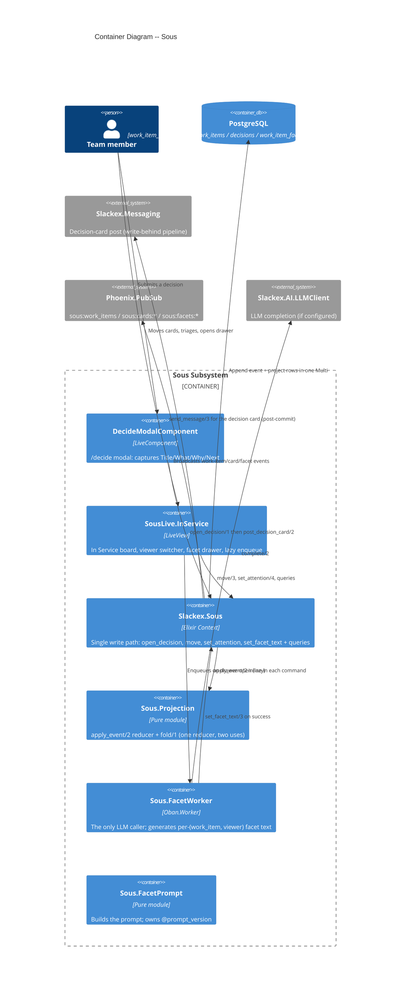
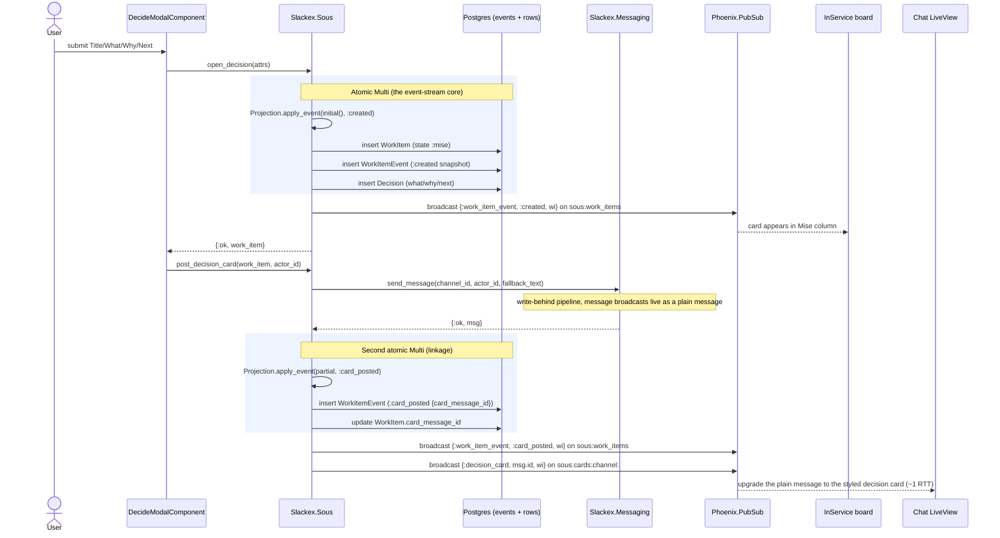
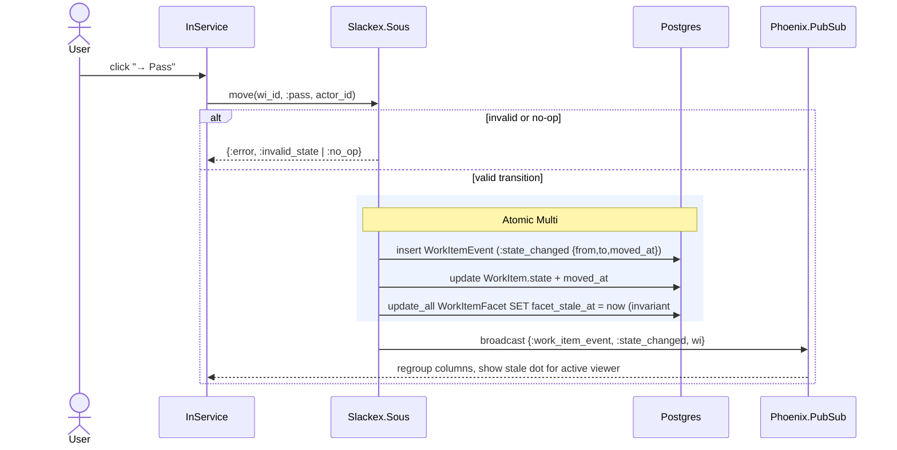
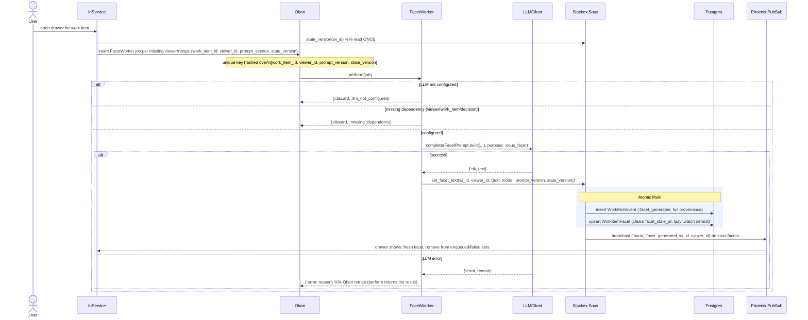
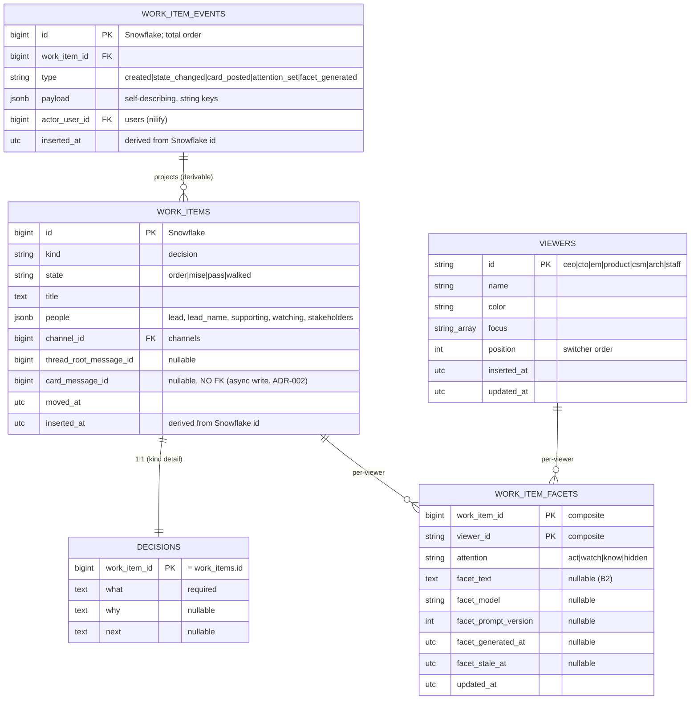

# Deep Dive: Sous Event Sourcing & CQRS

**Status:** Reference
**Zoom level:** L2 (subsystem deep dive)
**Scope:** The Sous event-sourcing tracer — command → event → projection flow, the event-store schema, projections and read models, viewer-specific (per-lens) state, replay, and the governing ADRs. Why event-sourcing-lite + CQRS was chosen for this slice.

---

## 1. Overview

**Sous** is Slackex's work-item subsystem: it turns a chat decision (captured via `/decide`) into a durable, role-aware *work item* that flows across an "In Service" kanban board. Internally it is built as **event-sourcing-lite with inline projections** — a deliberately scoped variant of full event sourcing.

The shape, in one breath:

1. Every mutation flows through a single command function in `Slackex.Sous` (`lib/slackex/sous.ex`) — the single write path.
2. Each command appends an immutable `WorkItemEvent` to the log **and** updates the read model (`WorkItem` / `Decision` / `WorkItemFacet` rows) **in the same `Ecto.Multi` transaction**.
3. The read-model update is computed by a **pure reducer**, `Slackex.Sous.Projection.apply_event/2` (`lib/slackex/sous/projection.ex`).
4. There is **no async projector process**, **no separate event-store database**, and **no read-model lag** — the projection is synchronous and transactional.
5. The same reducer is reused by a **replay-guard test** that folds the entire event log from scratch and asserts it equals the persisted row.

The surprising payoff — and the reason ES-lite was chosen for this slice — is **read-model malleability**. Slice A wrote `facet_text` and `attention` directly onto `WorkItem`. The B1 migration (`20260528115125`) *dropped those columns entirely* and re-homed the data onto a new per-viewer `WorkItemFacet` table with a composite primary key. That was a complete read-model reshape that required **zero changes to the event log**: the log stayed intact and the projection was simply taught to fold the same events into a different shape. CQRS keeps the write model (events) and read models (projected rows) independent, so the read side can be refactored under the write side's feet.

> This is **event-sourcing-lite**, not full ES. The trade-offs (synchronous projection, payloads in Postgres `jsonb`, partial-seed inline folds) are deliberate and documented in §8.

---

## 2. C4 Diagrams

### 2.1 System Context

### 2.2 Container Diagram

These diagrams sit above the runtime sequence diagrams in §5–§7.

---

## 3. How To Read This Document

- Start with the **Context** and **Container** diagrams to see where Sous sits and which pieces own the write side (events) vs the read side (projected rows).
- Read **§4 Main Components** for the responsibility of each module.
- Use the **sequence diagrams** (§5–§7) for runtime behavior: when an event is appended, when the projection runs, when PubSub fires, and when (and why) the LLM job is enqueued.
- Read **§9 Data Model** for the event-store schema and the projected tables (ER diagram).

### Terms Used Here

| Term | Meaning |
|---|---|
| Work item | A unit of tracked work. In Slice A/B the only `kind` is `:decision`. |
| Event | An immutable `WorkItemEvent` row appended to the log. Never updated or deleted. |
| Projection / read model | A row (`WorkItem`, `Decision`, `WorkItemFacet`) derived from the event log by the reducer. |
| Reducer | `Projection.apply_event/2` — the pure function that folds one event into projected state. |
| Viewer (lens) | A seeded role-lens (`ceo`, `cto`, `em`, …). The board can be read "as" a viewer. |
| Attention | A per-viewer triage signal: `:act`, `:watch`, `:know`, `:hidden`. |
| Facet | A per-(work item, viewer) AI-generated, role-specific summary of a decision. |
| Pill state | The derived display state of a facet: `:never_generated`, `:stale`, `:fresh` (+ runtime `:generating` / `:failed` / `:not_configured`). |
| Replay guard | A test that folds the full event log via `Projection.fold/1` and asserts it equals the persisted row (invariant #7). |
| State version | Count of `:state_changed` events; snapshotted into a facet job's args once at enqueue. |

---

## 4. Main Components

| Component | File | Responsibility |
|---|---|---|
| `Slackex.Sous` | `lib/slackex/sous.ex` | The single write path. Command functions append events + project rows in one `Ecto.Multi`; broadcasts; read queries. |
| `Slackex.Sous.Projection` | `lib/slackex/sous/projection.ex` | Pure reducer `apply_event/2` + `fold/1`. Used inline by commands AND by replay. |
| `Slackex.Sous.WorkItemEvent` | `lib/slackex/sous/work_item_event.ex` | The append-only event log schema (the write model). |
| `Slackex.Sous.WorkItem` | `lib/slackex/sous/work_item.ex` | Projected work-item read model (authoritative). |
| `Slackex.Sous.Decision` | `lib/slackex/sous/decision.ex` | 1:1 kind-specific detail (`what`/`why`/`next`), plaintext per ADR-001. |
| `Slackex.Sous.WorkItemFacet` | `lib/slackex/sous/work_item_facet.ex` | Per-(work item, viewer) projection: attention + facet text. Owns pill-state derivation. |
| `Slackex.Sous.Viewer` | `lib/slackex/sous/viewer.ex` | Seeded role-lens reference data (immutable in B1). |
| `Slackex.Sous.FacetWorker` | `lib/slackex/sous/facet_worker.ex` | The only LLM caller in Sous; Oban worker (queue `:facets`). |
| `Slackex.Sous.FacetPrompt` | `lib/slackex/sous/facet_prompt.ex` | Builds the LLM prompt; owns `@prompt_version` (bumping it stales all rows below it). |
| `SlackexWeb.ChatLive.DecideModalComponent` | `lib/slackex_web/live/chat_live/decide_modal_component.ex` | The `/decide` capture modal. |
| `SlackexWeb.SousLive.InService` | `lib/slackex_web/live/sous_live/in_service.ex` | The In Service board: viewer switcher, card moves, facet drawer, lazy enqueue, PubSub handling. |

### 4.1 The reducer: one function, two uses (CQRS hinge)

`Projection.apply_event/2` is the heart of the design. It is **pure** and **synchronous**, and it is called in two distinct ways (invariant #4):

1. **Inline by commands** — applied to a *partial seed state* to compute just the row(s) a command needs to write. `move/3` and `post_decision_card/2` seed `%{work_item: wi_to_attrs(wi), decision: nil}`; `set_attention/4` and `set_facet_text/3` seed `%{facets: %{}}`. The reducer only touches the fields the event changes, so a partial seed is sufficient.
2. **By the replay-guard test** — `Projection.fold/1` reduces the *entire* event log from `Projection.initial()` (`%{work_item: nil, decision: nil, facets: %{}}`).

The same clauses serve both paths because **event payloads are self-describing with string keys** (invariant #3). The payload survives a `jsonb` round-trip as strings, so the inline path (in-memory event struct) and a replay-from-DB path produce identical results. `apply_event/2` coerces strings back to atoms via `String.to_existing_atom/1`, deliberately calling `Code.ensure_loaded?/1` on `WorkItem` and `WorkItemFacet` first so every enum atom exists regardless of load order.

This is why CQRS matters here: the write model is the event log; read models are pure projections of it. Either side can change without the other, as long as the events remain derivable.

---

## 5. Capturing a decision: `/decide` and the two-step card (ADR-002)

The most architecturally interesting flow is `open_decision/1` followed by `post_decision_card/2`. The decision card is **not** written inside the event `Multi`. ADR-002 explains why: `ChannelServer` builds an in-memory message, broadcasts synchronously, and persists asynchronously via `BatchWriter` (write-behind), bypassing changesets. A direct `Repo.insert` of the message inside the Sous `Multi` would diverge from the cache, skip the live broadcast, and race the batch writer. So Sous posts the card through the **existing** `Messaging.send_message/3` facade *after* the event/projection commit, then records the linkage as its own `:card_posted` event — keeping the linkage in the log and the projection derivable.

### Notes

- **Two atomic steps, not one.** Event + `WorkItem` + `Decision` commit atomically; the card post and `:card_posted` event are a separate, post-commit step. If the card post fails, the work item is left intact (visible on the board, no chat card) and the failure is logged loudly — `DecideModalComponent` logs `"Sous decision card post failed"`. This is the deliberate "orphaned work item" trade-off in ADR-002; it self-heals if retried.
- **Two-step live render.** The `message.new` broadcast fires first (plain message), then the `sous:cards:channel:#{id}` broadcast upgrades it to the styled card. On reload everyone sees the card correctly because the chat LiveView loads `Sous.card_messages_for_channel/1` on mount. `card_message_id` carries **no FK** to `messages` precisely because the message is written async (migration comment + ADR-002).
- **Provenance is snapshotted into the `:created` event** — `title`, `state`, `people` (including `lead_name` from `actor_username`), `what`/`why`/`next`, `channel_id`, `thread_root_message_id`, `moved_at`. The card renders with no render-time user lookup (self-describing, invariant #3).

---

## 6. Moving a work item: stale-marking without enqueueing (invariant #14)

`move/3` validates the target (`to_state in WorkItem.states()`, rejecting no-ops), appends a `:state_changed` event, updates `state` + `moved_at`, and — in the same `Multi` — marks **every** facet row for that work item stale by setting `facet_stale_at`. It deliberately does **not** enqueue regeneration. Regeneration is lazy and user-controlled: it happens only on the next drawer-open. This bounds AI cost — a flurry of board moves never triggers a flurry of LLM calls.

The board's stale indicator (a small warning dot on the card) is driven by `Sous.stale_facets_for_viewer/1`, which returns a `MapSet` of work-item ids that have a row for the active viewer with `facet_stale_at` set. (Note the documented scoping choice in `sous.ex`: this query surfaces *stale* rows, not *never-generated* ones, to avoid lighting up the indicator on every card.)

---

## 7. Facet generation: lazy enqueue, the only LLM call (invariants #15–#17)

When the drawer opens, the board enqueues one `FacetWorker` job per viewer whose pill state derives to `:never_generated` or `:stale` (skipping `:failed` viewers — those require an explicit retry click). `FacetWorker` is the **only** LLM caller in Sous (invariant #17): isolated, bounded (`max_tokens: 200`), and retry-safe.

### Why `state_version` is read once and passed through

`Sous.state_version/1` counts `:state_changed` events. The board reads it **once** at enqueue time and embeds it in the job args; `FacetWorker` copies it verbatim into the `:facet_generated` event payload and **never re-queries it** (invariant #3, extended). The reason is Oban's uniqueness contract: the unique key is hashed over `[:work_item_id, :viewer_id, :prompt_version, :state_version]` at enqueue. If the worker re-queried and wrote a different `state_version`, the dedup key it was enqueued under would no longer match the data it produced — silently breaking deduplication and allowing duplicate work on a concurrent state change.

### Pill-state derivation (`WorkItemFacet.state/1`)

A pure function over the persisted row:

1. `nil` row or `facet_text == nil` → `:never_generated`
2. `facet_stale_at != nil` → `:stale`
3. `facet_prompt_version < FacetPrompt.prompt_version()` → `:stale` (prompt template bumped — currently `@prompt_version 2`)
4. otherwise → `:fresh`

The elegance of branch 3: bumping `@prompt_version` automatically stales every row generated under an older version, with no migration and no manual sweep. The runtime states `:generating` / `:failed` / `:not_configured` are *not* persisted — the LiveView layers them on at render time from the `drawer_enqueued` and `drawer_failed` socket assigns plus an inline `LLMClient.configured?()` check passed to the drawer as `llm_configured?`.

---

## 8. Key Design Properties

- **Single write path.** Every mutation goes through a `Slackex.Sous` command. There is no other way to write events or rows (invariant #1).
- **Event + projection in one transaction.** No async projector, no read-model lag, no eventual consistency to reason about (invariant #2). The price is that the projection must be cheap (it is — a pure in-memory fold).
- **Self-describing events.** Payloads carry everything needed to reconstruct the change, with string keys, so inline and replay folds agree (invariant #3).
- **One reducer, two uses.** `apply_event/2` is shared by commands (partial seed) and replay (`fold` from `initial()`) (invariant #4).
- **Append-only log.** Events are never updated or deleted (invariant #5).
- **Derivable read model.** Every projected field is reconstructable from the log alone (invariant #6), verified by the replay-guard test (invariant #7).
- **Read-model malleability (CQRS payoff).** The B1 migration dropped `WorkItem.facet_text`/`attention` and moved them to a new per-viewer table — a full read-side reshape with zero event-log changes (ADR-002 confirms the invariants were unaffected).
- **Lazy, bounded AI.** State changes mark facets stale; only drawer-open enqueues generation. The LLM is called from exactly one isolated worker.

### Deliberate ES-lite trade-offs

| Full ES would give | Sous chose | Why |
|---|---|---|
| Async projector / read-model rebuild service | Synchronous inline projection in the command `Multi` | Sous throughput is low; sync projection removes an entire class of consistency bugs. |
| Dedicated event-store DB | `jsonb` payload columns in Postgres | Fewer moving parts; the existing Repo and Multi suffice. |
| Full fold on every write | Partial-seed inline fold (only changed fields) | Optimization; the shared reducer makes it safe (it only touches fields present in the event). |
| Encrypted-at-rest decision content | Plaintext `Decision.what/why/next` | ADR-001: tracer-bullet scope; the content is already a published chat message. Revisit before graduating past the tracer slices. |

---

## 9. Data Model

Sous owns five tables. `work_item_events` is the write model (the log); the rest are projected read models.

### Notes on the schema

- **Snowflake PKs give total order.** Both `work_item_events.id` and `work_items.id` are Snowflake bigints (`@primary_key {:id, :integer, autogenerate: false}`); the `inserted_at` for each is *derived from the id's embedded timestamp* in the changeset (`put_inserted_at/1`), not from `DateTime.utc_now()`. The `(work_item_id, id)` index on `work_item_events` exists for ordered replay.
- **`WorkItemFacet` is lazy.** No row means the default `:watch` attention and `:never_generated` facet. `set_attention/4` and `set_facet_text/3` both upsert with `on_conflict: {:replace, [...]}` + `conflict_target: [:work_item_id, :viewer_id]`, so they never create spurious rows and a facet write preserves a previously-set attention (which is why `set_facet_text/3` re-fetches the merged row before returning).
- **Viewers are reference data**, seeded by the B1 migration with seven role-lenses and immutable in B1 (invariant #11); role-management UI is deferred.

### Migration history (deploy-safe, expand/contract)

| Migration | What it does |
|---|---|
| `20260527145912_create_sous_tables` | Creates `work_items`, `decisions`, `work_item_events`. (Slice A had `facet_text`/`attention` on `work_items`.) |
| `20260528115125_sous_b1_viewers_and_facets` | Creates `viewers` (seeds 7) and `work_item_facets` (composite PK); **drops** `work_items.facet_text` + `attention`. The full read-model reshape — zero event-log changes. |
| `20260528164710_sous_b2_facet_text_columns` | Purely additive: adds `facet_model`, `facet_prompt_version`, `facet_generated_at`, `facet_stale_at` to `work_item_facets`. |

The B1 drop is safe because `:sous` is OFF in production — no rows carry meaningful attention/facet data (acknowledged in the migration moduledoc against the `/new-migration` safety hook).

---

## 10. Event Catalog

| Event `type` | Payload keys (string-keyed) | Emitted by | Projection effect |
|---|---|---|---|
| `:created` | `kind, title, state, people, what, why, next, channel_id, thread_root_message_id, moved_at` | `open_decision/1` | Builds `WorkItem` + `Decision`. **Ignores** any legacy `facet_text`/`attention` keys (B1 invariant #9). |
| `:state_changed` | `from, to, moved_at` | `move/3` | Sets `state` + `moved_at`. (Command also marks facets stale.) |
| `:card_posted` | `card_message_id` | `post_decision_card/2` | Sets `card_message_id`. |
| `:attention_set` | `viewer_id, attention, actor_user_id` | `set_attention/4` | Upserts per-viewer attention (lazy `:watch` default). |
| `:facet_generated` | `viewer_id, facet_text, model, prompt_version, generated_at, state_version` | `set_facet_text/3` (via `FacetWorker`) | Upserts facet text/model/version/timestamp; **clears** `facet_stale_at`. |

### PubSub topics

| Topic | Message | Subscribers |
|---|---|---|
| `sous:work_items` (workspace-wide) | `{:work_item_event, type, wi}` for `:created`/`:state_changed`/`:card_posted`; `{:work_item_event, :attention_set, %{work_item_id, viewer_id, attention}}` | In Service board, tests |
| `sous:cards:channel:#{channel_id}` | `{:decision_card, msg_id, wi}` | Chat LiveView (upgrades the plain message to the styled card) |
| `sous:facets:#{work_item_id}` (low fan-out) | `{:sous, :facet_generated, wi_id, viewer_id}` | Open facet drawer |

---

## 11. Failure Modes & Resilience

Sous's resilience story is **job-level isolation plus a CI replay guard**, not a bespoke supervision tree.

- **LLM not configured.** `FacetWorker.perform/1` checks `LLMClient.configured?()` and returns `{:discard, :llm_not_configured}` — a safe, non-retrying discard. The board also guards the enqueue with `LLMClient.configured?()`, so on a deploy without an LLM no facet jobs are created at all. The board surfaces this to the user as `:not_configured` (socket state, not a persisted value).
- **Missing dependency.** If the viewer, work item, or decision has been deleted by the time the job runs, the worker returns `{:discard, :missing_dependency}` rather than crashing or retrying forever.
- **LLM call fails.** The worker returns `{:error, reason}` so **Oban retries** (up to `max_attempts: 3`). Returning the result rather than discarding it is the project-wide rule for `perform/1` (never `_ = result; :ok`); here it is what makes retries work. After three exhausted attempts the job becomes `:discarded`; the board finds discarded jobs via `discarded_viewer_ids/1` (a query against `oban_jobs`) and renders a `:failed` pill with a manual retry affordance. Retry is the *only* user gesture besides drawer-open that enqueues.
- **Decision-card post fails.** The work item still exists (event + projection committed in step 1); only the chat card is missing. `post_decision_card/2` returns `{:error, reason}`, the modal logs a warning, and the linkage is left `nil`. This is the ADR-002 "orphaned work item" trade-off — visible on the board, self-heals on retry.
- **Projection divergence.** The replay-guard test (`test/slackex/sous_test.exs`, invariant #7) folds the full event log via `Projection.fold/1` and asserts it equals the persisted `WorkItem`/`Decision`/facet rows. If a command ever mutates a row without (or inconsistently with) appending the corresponding event, this test fails in CI — catching the class of bug where the read model and the log drift apart.

**Blast radius.** Because the only async component is a queue of independent Oban jobs, a failure is contained to a single (work item, viewer) facet. There is no shared in-memory state and no Sous-specific GenServer to crash. The synchronous command path either commits fully (event + projection) or rolls back entirely — there is no partial-projection state to recover.

---

## 12. Feature Flag Gating

The `:sous` flag (FunWithFlags) gates every surface:

- **Chat side:** the `/decide` command, modal render, and decision-card render are gated in `lib/slackex_web/live/chat_live/index.ex` (`FunWithFlags.enabled?(:sous, for: user)` at lines 360 and 1507) and the board entry point in `sidebar_component.ex`.
- **Board side:** `SlackexWeb.SousLive.InService.mount/3` checks `FunWithFlags.enabled?(:sous, for: user)` and redirects to `/chat` with a flash when off; the route is `live "/in-service", SousLive.InService`.

The integration test `test/slackex_web/live/chat_live/decide_test.exs` exercises the full producer→consumer path: it enables `:sous`, submits `/decide`, submits the modal, and asserts the work item appears in `Sous.list_in_flight()` — verifying the wiring end to end rather than faking the upstream event (the CLAUDE.md "Spec-Driven Acceptance Tests" rule).

---

## 13. Code Map

| File | Responsibility |
|---|---|
| `lib/slackex/sous.ex` | Single write path: `open_decision/1`, `post_decision_card/2`, `move/3`, `set_attention/4`, `set_facet_text/3`; queries; broadcasts. |
| `lib/slackex/sous/projection.ex` | Pure reducer `apply_event/2` + `fold/1` + `initial/0`. |
| `lib/slackex/sous/work_item_event.ex` | Append-only event log schema (write model). |
| `lib/slackex/sous/work_item.ex` | Work-item projection (read model). |
| `lib/slackex/sous/decision.ex` | 1:1 decision detail (plaintext, ADR-001). |
| `lib/slackex/sous/work_item_facet.ex` | Per-viewer facet projection + `state/1` pill derivation. |
| `lib/slackex/sous/viewer.ex` | Role-lens reference data. |
| `lib/slackex/sous/facet_worker.ex` | Oban worker; the only LLM caller (queue `:facets`). |
| `lib/slackex/sous/facet_prompt.ex` | Prompt builder + `@prompt_version`. |
| `lib/slackex_web/live/sous_live/in_service.ex` | In Service board, viewer switcher, drawer, lazy enqueue, PubSub. |
| `lib/slackex_web/live/chat_live/decide_modal_component.ex` | `/decide` capture modal. |
| `priv/repo/migrations/20260527145912_create_sous_tables.exs` | Slice-A schema. |
| `priv/repo/migrations/20260528115125_sous_b1_viewers_and_facets.exs` | B1 read-model reshape. |
| `priv/repo/migrations/20260528164710_sous_b2_facet_text_columns.exs` | B2 additive facet columns. |
| `test/slackex/sous_test.exs` | Replay-guard test (invariant #7) + command unit tests. |
| `test/slackex_web/live/chat_live/decide_test.exs` | `/decide` end-to-end integration test. |

---

## 14. Related Documents

- `./realtime-chat.md` — the messaging/ChannelServer write-behind pipeline that Sous posts decision cards through (the architectural constraint behind ADR-002).
- `../feature/sous/design/slice-a-event-stream-tracer-bullet.md` — the authoritative Sous spec (the event-sourcing-readiness invariants referenced throughout).
- `../feature/sous/design/slice-b1-role-lens-and-facet-drawer.md` — the per-viewer read-model reshape (viewers + facets).
- `../feature/sous/design/slice-b2-ai-facet-text.md` — the AI facet-generation pipeline.
- `../feature/sous/design/adr-001-decision-fields-plaintext-in-slice-a.md` — why `Decision` fields are plaintext (and the revisit trigger).
- `../feature/sous/design/adr-002-sous-chat-linkage-via-card-message-id.md` — why the card linkage is Sous-owned and posted post-commit, not an FK inside the Multi.
- `../engineering-principles.md` — project-wide deploy-safety, migration, and test-isolation rules.
