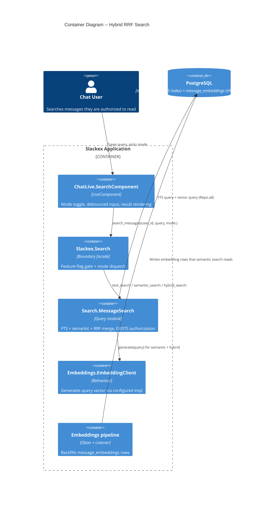
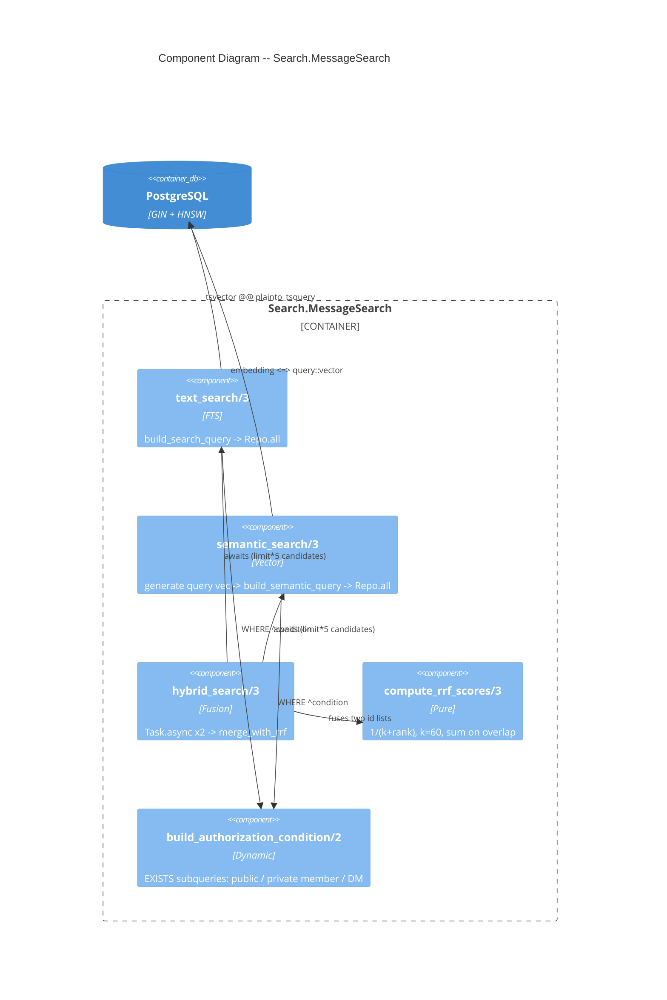
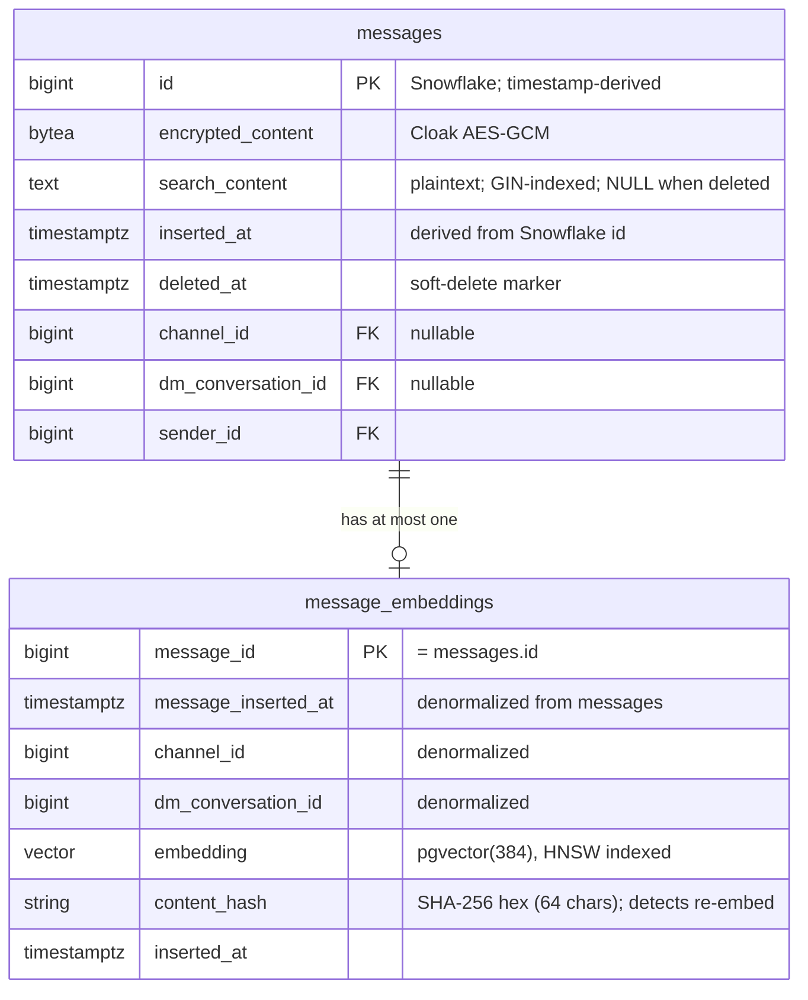
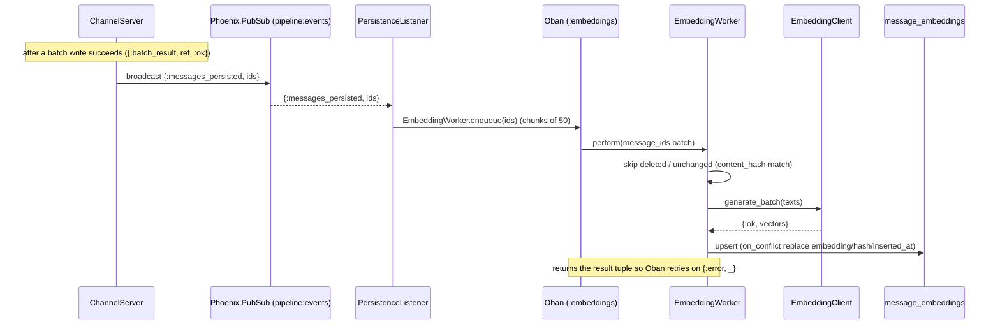

# Deep Dive: Hybrid RRF Search

**Status:** Reference
**Scope:** Reciprocal Rank Fusion over full-text and semantic search; the SQL behind FTS and pgvector queries; EXISTS-based authorization; ranking and pagination correctness; how the three UI modes map to queries; edge cases and failure modes.
**Zoom level:** L2 (deep dive into one subsystem)

---

## 1. Overview

Slackex search has three modes, exposed through a single entry point `Slackex.Search.search_messages/3` (`lib/slackex/search.ex`):

- **`:text`** ("Exact words") — PostgreSQL full-text search (FTS) over the plaintext `search_content` column, ranked by `ts_rank`.
- **`:semantic`** ("Meaning") — pgvector cosine similarity against pre-computed message embeddings, filtered by a similarity threshold.
- **`:hybrid`** ("Best match", the default) — runs FTS and semantic in parallel and fuses the two ranked lists with **Reciprocal Rank Fusion (RRF)**.

The interesting problem this subsystem solves is *combining two incomparable score spaces*. `ts_rank` produces a TF/IDF-like relevance number; cosine similarity produces a 0.0–1.0 score. These are not on the same scale, so you cannot simply add or threshold them together. RRF sidesteps the problem entirely: it throws away the raw scores and fuses on **rank position only**, using the formula `1 / (k + rank)`. A document that ranks highly in either list gets a high fused score; a document that ranks highly in *both* gets the sum. This is why RRF is the standard fusion choice for hybrid lexical+vector retrieval — it needs no score normalization and no per-source calibration.

Two structural facts shape everything below:

1. **Message content is encrypted at rest** (Cloak AES-GCM). Ciphertext cannot be indexed, so a plaintext companion column `search_content` exists purely to feed the FTS GIN index and the embedding pipeline. See `docs/architecture/encryption-at-rest.md`.
2. **Authorization must not corrupt ranking.** A naive `LEFT JOIN` onto `subscriptions` would multiply a message row once per matching membership path, which inflates `LIMIT`/`OFFSET` counts and skews `ts_rank` ordering. The implementation uses `EXISTS` subqueries instead, which return exactly one row per message regardless of how many authorization paths match.

---

## 2. C4 Diagrams

### 2.1 Container Diagram



### 2.2 Component Diagram (inside `Search.MessageSearch`)



---

## 3. How To Read This Document

- Section 4 maps the three UI modes to the three query builders.
- Section 5 is the RRF algorithm itself — formula, merge code, and a worked example.
- Section 6 is the SQL: FTS, semantic, and the EXISTS authorization predicates.
- Section 7 is the data model (`messages.search_content`, `message_embeddings`).
- Section 8 covers ranking and pagination correctness — where the merge can silently truncate.
- Section 9 covers failure modes and the precise (and narrower-than-it-looks) graceful-degradation behavior.

### Terms Used Here

| Term | Meaning |
|---|---|
| FTS | PostgreSQL full-text search (`tsvector`/`tsquery`, GIN index) |
| RRF | Reciprocal Rank Fusion — fuse ranked lists by `1/(k+rank)` |
| `search_content` | Plaintext companion column for the encrypted `content`; the only searchable text |
| Candidate pool | The `limit * 5` rows fetched from each source before fusion |
| Similarity | `1.0 - cosine_distance`, in `[0.0, 1.0]`, 1.0 = identical |

---

## 4. The Three Modes And Their Queries

The dispatch lives in `Slackex.Search.search_messages/3`. The whole feature is gated on the `:message_search` FunWithFlags flag; when disabled the facade returns `{:error, :feature_disabled}` before any query runs.

```elixir
# lib/slackex/search.ex
if FunWithFlags.enabled?(:message_search) do
  {mode, search_opts} = Keyword.pop(opts, :mode, :hybrid)
  case mode do
    :text     -> MessageSearch.text_search(user_id, query, search_opts)
    :semantic -> MessageSearch.semantic_search(user_id, query, search_opts)
    :hybrid   -> MessageSearch.hybrid_search(user_id, query, search_opts)
  end
else
  {:error, :feature_disabled}
end
```

The UI surface is `SlackexWeb.ChatLive.SearchComponent` (`lib/slackex_web/live/chat_live/search_component.ex`), which defaults `:search_mode` to `:hybrid` and renders a toggle over `[:hybrid, :text, :semantic]`. The human-facing labels are deliberately non-jargon:

| Mode atom | UI label (`mode_label/1`) | Backend function |
|---|---|---|
| `:hybrid` | **Best match** | `MessageSearch.hybrid_search/3` |
| `:text` | **Exact words** | `MessageSearch.text_search/3` |
| `:semantic` | **Meaning** | `MessageSearch.semantic_search/3` |

Search is invoked in-process from the LiveView, not via a dedicated HTTP route — there is no `/search` entry in the router.

---

## 5. The RRF Algorithm

### 5.1 The formula

Each source returns an ordered list of message IDs (rank 1 = best). Each ID earns a reciprocal-rank score:

```
RRF(id) = 1 / (k + rank(id))     # rank starts at 1
```

with `k = 60` (`@rrf_k` in `lib/slackex/search/message_search.ex`). `k` damps the influence of top ranks so that the difference between rank 1 and rank 2 is not enormous; 60 is the value from the original RRF paper and is the de-facto standard. With `k = 60`:

- rank 1 → `1/61 ≈ 0.01639`
- rank 2 → `1/62 ≈ 0.01613`
- rank 100 → `1/160 ≈ 0.00625`

An ID that appears in **both** lists gets the **sum** of its two reciprocal-rank scores, which is what lifts cross-source agreement to the top.

### 5.2 The merge code

`compute_rrf_scores/3` is a pure function (and is unit-tested directly):

```elixir
def compute_rrf_scores(text_ids, semantic_ids, k) do
  text_scores = rank_to_rrf_map(text_ids, k)
  semantic_scores = rank_to_rrf_map(semantic_ids, k)
  Map.merge(text_scores, semantic_scores, fn _id, t, s -> t + s end)
end

defp rank_to_rrf_map(ids, k) do
  ids |> Enum.with_index(1) |> Map.new(fn {id, rank} -> {id, 1.0 / (k + rank)} end)
end
```

`merge_with_rrf/4` then attaches the fused score and applies pagination:

```elixir
rrf_scores
|> Enum.sort_by(fn {_id, score} -> score end, :desc)
|> Enum.drop(offset)
|> Enum.take(limit)
|> Enum.map(fn {id, score} ->
  messages_by_id |> Map.fetch!(id) |> Map.put(:search_score, score)
end)
```

### 5.3 Worked example

Text results `[a, b, c]`, semantic results `[b, c, a]`, `k = 60`:

| ID | Text rank → score | Semantic rank → score | Fused |
|---|---|---|---|
| a | 1 → 1/61 | 3 → 1/63 | ≈ 0.03227 |
| b | 2 → 1/62 | 1 → 1/61 | ≈ 0.03252 |
| c | 3 → 1/63 | 2 → 1/62 | ≈ 0.03200 |

Final order: **b > a > c**. `b` wins because it ranked near the top of *both* lists; `a` (rank 1 in text) edges out `c` because a rank-1 contribution outweighs `c`'s two middling ranks. This is the unit test at the bottom of `test/slackex/search/message_search_test.exs`.

### 5.4 Which struct survives a cross-source overlap

When a message appears in both result sets, `merge_with_rrf/4` builds the lookup with `Map.put_new` over `text_messages ++ semantic_messages`:

```elixir
(text_messages ++ semantic_messages)
|> Enum.reduce(%{}, fn msg, acc -> Map.put_new(acc, msg.id, msg) end)
```

Because text messages come first and `Map.put_new` keeps the first occurrence, **the text struct is retained** for any overlapping ID. The text struct carries `:headline` (FTS snippet) but its `:similarity` virtual field is unpopulated. The in-code comment says "preferring semantic (has `:similarity`)", but the actual behavior keeps the text struct — a comment/behavior mismatch worth knowing if a consumer relies on `:similarity` being present on hybrid results. (Documented as-is; not changed by this doc.)

---

## 6. The SQL

### 6.1 Full-text search

`build_search_query/3` constructs an Ecto query equivalent to:

```sql
SELECT m.*, ts_headline('english', coalesce(m.search_content,''),
                        plainto_tsquery('english', $query), $headline_opts) AS headline
FROM messages m
WHERE to_tsvector('english', coalesce(m.search_content,'')) @@ plainto_tsquery('english', $query)
  AND m.deleted_at IS NULL
  AND ( <authorization condition> )
ORDER BY ts_rank(to_tsvector('english', coalesce(m.search_content,'')),
                 plainto_tsquery('english', $query)) DESC
LIMIT $limit OFFSET $offset;
```

Notes on the choices:

- **`plainto_tsquery`, not `to_tsquery`.** `plainto_tsquery` parses arbitrary user input safely (it ANDs the lexemes and ignores operator syntax), so a query like `cat & dog` or an empty string cannot raise a parse error or inject query operators. An empty/whitespace query simply matches nothing.
- **`coalesce(search_content, '')`** everywhere, because soft-deleted messages have `search_content = NULL` (see §7). The GIN index is built on the same `coalesce(...)` expression so the planner can use it.
- **`ts_headline`** generates the highlighted snippet (`<mark>…</mark>`, 15–40 words) returned in the `:headline` virtual field.
- The `:headline` and `:similarity`/`:search_score` columns are **virtual** schema fields populated by `select_merge` / the RRF merge; they are not stored.

`text_search/3`'s spec is `{:ok, [...]}` — it has no error return. This matters for hybrid failure analysis (§9).

### 6.2 Semantic search

`build_semantic_query/3`:

```sql
SELECT m.*,
       (1.0 - (me.embedding <=> $qvec::vector))           AS similarity,
       ts_headline('english', coalesce(m.search_content,''), ...) AS headline
FROM messages m
JOIN message_embeddings me
  ON me.message_id = m.id AND me.message_inserted_at = m.inserted_at
WHERE m.deleted_at IS NULL
  AND ( <authorization condition> )
  AND (1.0 - (me.embedding <=> $qvec::vector)) > $threshold::float8
ORDER BY me.embedding <=> $qvec::vector
LIMIT $limit OFFSET $offset;
```

- **`<=>`** is pgvector's cosine *distance* (0 = identical, up to 2). The query orders by raw distance ascending (cheapest expression for the HNSW index to satisfy) and reports `1.0 - distance` as the user-facing `:similarity`.
- **Default threshold `0.3`** (`@default_similarity_threshold`) drops weakly-related matches; orthogonal vectors (similarity 0.0) are filtered out.
- **Inner join on `message_embeddings`** means messages with no embedding row are invisible to semantic search — which is the core reason hybrid exists (FTS still finds un-embedded messages).
- **The composite join `(message_id, message_inserted_at) = (id, inserted_at)`** mirrors the partition-pruning join pattern used elsewhere in the codebase (see `docs/architecture/deep-dive-snowflake-partitioning.md`). **Today this is forward-looking intent, not an active optimization:** the `messages` table is *not* partitioned (no `PARTITION BY` in any migration), the `message_embeddings` primary key is single-column `message_id`, and there is no index on `message_inserted_at`. The second predicate currently just adds a correctness constraint; it would become a pruning lever if `messages` is later range-partitioned by `inserted_at`.

### 6.3 EXISTS-based authorization

`build_authorization_condition/2` branches on whether a `:channel_id` scope was supplied:

- **Global search** (no `:channel_id`) → `global_authorization_filter/1`, the OR of three `EXISTS` predicates.
- **Scoped search** → `scoped_channel_authorization_filter/2`, a single-channel fast path.

The three global predicates:

```sql
-- public channel
m.channel_id IS NOT NULL
  AND EXISTS (SELECT 1 FROM channels c WHERE c.id = m.channel_id AND c.is_private = false)

-- private channel the user is subscribed to
m.channel_id IS NOT NULL
  AND EXISTS (SELECT 1 FROM channels c
              INNER JOIN subscriptions s ON s.channel_id = c.id
              WHERE c.id = m.channel_id AND c.is_private = true AND s.user_id = $user_id)

-- DM the user participates in
m.dm_conversation_id IS NOT NULL
  AND EXISTS (SELECT 1 FROM dm_conversations d
              WHERE d.id = m.dm_conversation_id
                AND (d.user_a_id = $user_id OR d.user_b_id = $user_id))
```

**Why `EXISTS` and not `JOIN`:** a `JOIN` against `subscriptions` would emit one message row per matching subscription, multiplying rows. With `LIMIT 20` that silently returns fewer than 20 distinct messages, and `ts_rank` ordering is computed over duplicated rows. `EXISTS` returns one row per message and short-circuits on the first matching membership, so ranking and pagination stay correct. The predicates are built as Ecto `dynamic/2` fragments with parameter binding — no user input is interpolated into SQL.

Authorization, soft-delete exclusion, and ranking all live in `WHERE`/`ORDER BY` *before* `LIMIT`/`OFFSET`, so pagination cannot be used to bypass authorization or surface deleted messages.

### 6.4 Index verification

`explain_text_search/3` and `explain_semantic_search/3` run `EXPLAIN ANALYZE` with `SET LOCAL enable_seqscan = off` (test-only) to assert the planner actually reaches the GIN / HNSW index rather than falling back to a sequential scan. These back the index-usage tests in `test/slackex/search/message_search_test.exs`.

---

## 7. Data Model



### `messages.search_content`

The encrypted `content` field (`Slackex.Encrypted.Binary`, stored in `encrypted_content`) is ciphertext and cannot be indexed. `Message.changeset/2` copies the plaintext into `search_content` via `put_search_content/1`. On edit, `edit_changeset/2` re-copies it; on delete, `delete_changeset/1` sets `content: nil, search_content: nil, deleted_at: now`. So FTS stays in sync with the live message text, and soft-deleted messages drop out of the index. Migration `20260303191200_add_fts_gin_index.exs` adds the column and a `CREATE INDEX CONCURRENTLY` GIN index on `to_tsvector('english', coalesce(search_content, ''))` (concurrent so the deploy takes no table lock).

### `message_embeddings`

One row per message (PK = `message_id`, no autogenerate). The HNSW index `idx_embeddings_hnsw` uses `vector_cosine_ops` with `m = 16, ef_construction = 64` (migration `20260303185600_create_message_embeddings.exs`). The vector was resized 1536 → **384 dimensions** in `20260304000000_resize_embeddings_to_384.exs` to match the all-MiniLM-L6-v2 model used in development; the schema field is `Pgvector.Ecto.Vector`. `content_hash` is the SHA-256 of `search_content`; the worker uses a hash mismatch to detect an edited message and re-embed it.

---

## 8. Ranking And Pagination Correctness

The hybrid path is engineered so that fusion sees a *broad* pool, not just the top-N of each source:

```elixir
# hybrid_search/3
source_opts = Keyword.merge(opts, limit: limit * 5, offset: 0)
```

Each source is queried with **`limit * 5` candidates at `offset: 0`** (default `20 → 100`). RRF fuses the two 100-item pools, sorts by fused score, then applies the *caller's* `offset` and `limit` to the merged list. Applying pagination **after** fusion is the correctness-critical choice: paginating each source *before* fusion would let a message that's rank 21 in text but rank 1 in semantic vanish from page 1, producing "phantom" gaps.

**The one truncation gap to know:** because each source's candidate pool is bounded at `limit * 5` fetched at `offset: 0`, deep pagination silently runs out of material. The merged set is the *union* of the two ID lists, so with `limit = 20` it holds between ~100 IDs (full overlap) and ~200 IDs (no overlap). An `offset` past roughly ~180 therefore returns fewer (or zero) results even if more matching messages exist in the database. Hybrid search is built for "first few pages of best matches," not exhaustive deep paging. Single-mode `:text` / `:semantic` paginate directly in SQL and do not have this ceiling.

Single-source edge cases all degrade cleanly: if only one source returns candidates, `compute_rrf_scores` still produces valid single-source scores; empty-on-both yields `{:ok, []}`.

---

## 9. Failure Modes & Resilience

### 9.1 Hybrid degradation is narrower than it looks

`hybrid_search/3` matches on the **return tuples** of the two awaited tasks:

```elixir
case {text_result, semantic_result} do
  {{:ok, t}, {:ok, s}}     -> {:ok, merge_with_rrf(t, s, limit, offset)}
  {{:ok, t}, {:error, _}}  -> {:ok, merge_with_rrf(t, [], limit, offset)}   # text-only
  {{:error, _}, {:ok, s}}  -> {:ok, merge_with_rrf([], s, limit, offset)}   # semantic-only
  {{:error, r}, {:error, _}} -> {:error, r}
end
```

This handles exactly one real failure: **`semantic_search/3` returning `{:error, _}` because query-embedding generation failed** (e.g. the embedding backend is down). In that case hybrid falls back to text-only. That is the resilience guarantee, and it is genuine.

Two important caveats, grounded in the code:

- **`text_search/3` never returns `{:error, _}`** (its spec is `{:ok, [...]}`). So the two `{:error, ...}`-in-first-position branches are not reachable via normal return values. They would only be hit if `text_search` itself *crashed*, which surfaces as a process exit — not an `{:error, _}` tuple — and is therefore **not** caught here.
- **Timeouts and crashes are not graceful.** The two `Task.await(task, 5_000)` calls (`@hybrid_task_timeout`) are not wrapped in `try`. If a source task exceeds 5s or raises, `Task.await` exits the calling process and the whole hybrid search fails (it propagates to the LiveView). Do not describe a slow semantic search as "falling back to text" — only a *returned* `{:error, _}` from the embedding step does that.

### 9.2 Embedding pipeline resilience (the producer of semantic data)

Semantic search only finds messages that have an embedding row. Those rows are produced by a non-essential, deliberately isolated pipeline:



Design properties verified in the code:

- **Real producer→consumer wiring.** The `{:messages_persisted, ids}` event is broadcast by `ChannelServer.handle_info({:batch_result, ref, :ok}, ...)` (`lib/slackex/messaging/channel_server.ex`) after a successful batch write, and consumed by `PersistenceListener` (`lib/slackex/embeddings/persistence_listener.ex`). The `pipeline:events` topic is a genuinely wired bridge, not a faked one. (The listener's moduledoc credits "BatchWriter" with the broadcast; the broadcast actually lives in `ChannelServer` after `BatchWriter` reports success.)
- **Durability safety net.** If the listener was down during a broadcast (deploy, restart, node loss), `ReconciliationWorker` (`lib/slackex/embeddings/reconciliation_worker.ex`) — an Oban cron running every 15 minutes with a 1-hour lookback — finds messages with no embedding row (`LEFT JOIN ... WHERE me.message_id IS NULL`) and re-enqueues them.
- **No silent error-swallowing in `perform/1`.** `EmbeddingWorker.perform/1` returns the result of `generate_and_persist_embeddings/1`, so a `{:error, reason}` propagates to Oban and the job retries (`max_attempts: 3`). This is the rule from the v0.5.36 cascade incident.
- **Re-embedding on edit.** `fetch_embeddable_messages/1` skips messages whose stored `content_hash` already equals `encode(sha256(search_content),'hex')`; an edited message has a new hash and is re-embedded. The upsert uses `on_conflict: {:replace, [:embedding, :content_hash, :inserted_at]}, conflict_target: :message_id`.

### 9.3 Blast radius and restart strategy

The embedding subsystem is isolated so a failure degrades search but does not take down chat:

- `PersistenceListener` is started with `restart: :temporary` in `Slackex.Application` — if it repeatedly crashes it will not exhaust the root supervisor budget.
- The local-serving path (`Embeddings.Supervisor` → `EmbeddingServing`) is only added to the tree when the configured client is `BumblebeeClient` (`maybe_embedding_serving/1`), and it too is `restart: :temporary` with its own budget (`max_restarts: 5, max_seconds: 300`). If it dies, "the app keeps serving traffic — embeddings degrade gracefully rather than cascading a shutdown."
- When the configured client is `BumblebeeClient` but `EmbeddingServing` is not running, `EmbeddingWorker` snoozes the job 30s rather than failing.

See `docs/architecture/embeddings.md` for the full embedding lifecycle.

### 9.4 Embedding client selection (per environment)

`EmbeddingClient` (`lib/slackex/embeddings/embedding_client.ex`) is a behaviour (`generate/1`, `generate_batch/1`, `dimensions/0`) that delegates to the module in `config :slackex, :embedding_client`:

| Env | Configured client |
|---|---|
| default / `config.exs` | `Slackex.Embeddings.StubClient` |
| `test.exs` | `Slackex.Embeddings.StubClient` (deterministic) |
| `dev.exs` | `Slackex.Embeddings.BumblebeeClient` (local EXLA, all-MiniLM-L6-v2, 384-dim) |
| `prod.exs` | `Slackex.Embeddings.OpenAIClient` |

> Note: project memory records intent to run a non-GPU/stub embedding path in production (the prod LXC has no usable GPU and CPU EXLA OOMs it). The checked-in `config/prod.exs` configures `OpenAIClient`. This doc reports the committed configuration; treat the production client as the operationally-decided value rather than assuming it from the model docs.

`semantic_search/3` also accepts an `:embedding_client` option (a `String.t() -> {:ok,[float]} | {:error,_}` function) for dependency injection in tests.

### 9.5 Search query routing

All search queries (`text_search`, `semantic_search`) run through `Repo.all/1` on the **primary** `Slackex.Repo`. Search does not use the read-replica routing that history loading uses; replica/lag concerns are a `HistoryLoader` matter (see `docs/architecture/caching-and-read-model.md`), not a search-path concern.

---

## 10. Key Design Properties

- **Rank-only fusion.** RRF combines two incomparable score spaces (`ts_rank` vs cosine similarity) without normalization, by fusing on rank position with `1/(k+rank)`, `k=60`.
- **Authorization via `EXISTS`, never `JOIN`.** One row per message regardless of membership paths, preserving `LIMIT`/`OFFSET` counts and `ts_rank` order.
- **Encryption-compatible search.** A plaintext `search_content` companion column feeds both the FTS GIN index and the embedding pipeline; the encrypted `content` is never indexed.
- **Pagination after fusion.** Hybrid applies `offset`/`limit` to the merged list, not per-source, avoiding phantom gaps — at the cost of a `limit*5` deep-paging ceiling.
- **Genuine event bridge with a safety net.** `pipeline:events` has a real producer (ChannelServer) and consumer (PersistenceListener); `ReconciliationWorker` backfills anything missed.
- **Isolated, temporary-restart embedding subsystem.** Embedding failures degrade search, not chat.
- **Runtime feature gate.** The `:message_search` flag short-circuits the whole feature before any query runs.

---

## 11. Code Map

| File | Responsibility |
|---|---|
| `lib/slackex/search.ex` | Facade: `:message_search` flag gate + mode dispatch |
| `lib/slackex/search/message_search.ex` | FTS, semantic, hybrid; RRF merge; EXISTS authorization; EXPLAIN helpers |
| `lib/slackex/chat/message.ex` | Message schema; `search_content` sync; `:headline`/`:similarity`/`:search_score` virtuals |
| `lib/slackex/embeddings/message_embedding.ex` | Embedding schema (PK `message_id`, 384-dim vector, content hash) |
| `lib/slackex/embeddings/embedding_client.ex` | Behaviour + config-driven delegation |
| `lib/slackex/embeddings/embedding_worker.ex` | Oban worker: batch embed + channel/DM backfill; re-embed on hash change |
| `lib/slackex/embeddings/persistence_listener.ex` | Consumes `{:messages_persisted, ids}` → enqueues embedding jobs |
| `lib/slackex/embeddings/reconciliation_worker.ex` | Cron safety net for missed embeddings |
| `lib/slackex/messaging/channel_server.ex` | Producer of the `pipeline:events` `{:messages_persisted, ids}` broadcast |
| `lib/slackex_web/live/chat_live/search_component.ex` | Mode toggle, debounced input, result UI, mode labels |
| `priv/repo/migrations/20260303191200_add_fts_gin_index.exs` | `search_content` column + concurrent GIN FTS index |
| `priv/repo/migrations/20260303185600_create_message_embeddings.exs` | `message_embeddings` table + HNSW index |
| `priv/repo/migrations/20260304000000_resize_embeddings_to_384.exs` | Resize vector 1536 → 384 |
| `test/slackex/search/message_search_test.exs` | FTS/semantic/hybrid tests; index-usage; RRF scoring |

---

## 12. Related Documents

- `search-and-intelligence.md` — the broader search + intelligence subsystem this deep-dive zooms into
- `embeddings.md` — full embedding generation, serving, and backfill lifecycle
- `encryption-at-rest.md` — why `content` is encrypted and `search_content` exists
- `deep-dive-snowflake-partitioning.md` — Snowflake IDs and the composite-key join pattern referenced by the semantic query
- `message-pipeline-and-persistence.md` — the batch-write path that produces `{:messages_persisted, ...}`
- `caching-and-read-model.md` — read-replica routing used by history loading (not by search)
- `realtime-chat.md` — the realtime send path whose persistence triggers embedding
