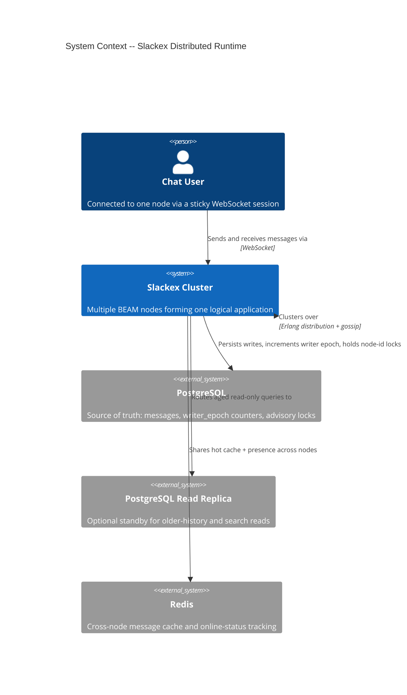
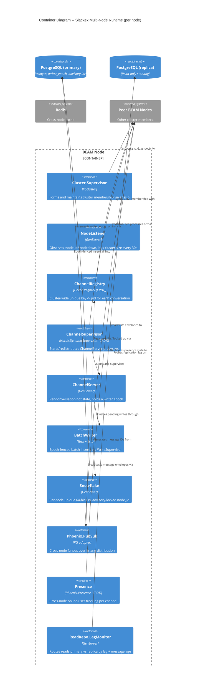

# Deep Dive: Multi-Node & Horde

**Status:** Reference
**Zoom level:** L2 (subsystem deep dive)
**Scope:** The distributed runtime — libcluster topology and node discovery, Horde distributed registry and supervisor for `ChannelServer`, writer-epoch fencing for split-brain safety, failover behavior, replica-aware reads, and cross-node PubSub. Why the app is built multi-node and what the failure modes are.

---

## 1. Overview

Slackex is built as a **distributed BEAM cluster**, not a single node behind a load balancer. The realtime layer keeps one `ChannelServer` GenServer per active conversation (`{:channel, id}` or `{:dm, id}`), and that process owns mutable hot state: a bounded message queue, per-sender rate limiters, and an in-memory batch of pending writes. Two surprising constraints fall out of that design:

1. **A conversation's coordinator must be reachable cluster-wide.** A user on node A and a user on node B in the same channel must reach the *same* `ChannelServer`. A node-local `Registry`/`DynamicSupervisor` cannot do this. Horde's CRDT-backed registry and dynamic supervisor make the process addressable and restartable from any node.
2. **"At most one writer per conversation" is a correctness property, not a convenience.** If two `ChannelServer` instances for the same channel both flush to PostgreSQL, you get divergent ordering, doubled rate-limit budgets, and conflicting writes. Horde guarantees single-instance *eventually*; during a partition it can briefly run two. The system therefore does not trust Horde for correctness — it makes the single-writer invariant **verifiable** with a database-backed **writer epoch** (Section 6).

The rest of the distributed runtime exists to support those two facts: libcluster forms the mesh, Horde distributes the processes, the writer epoch fences stale writers, `terminate/2` plus `init/1` crash recovery close the durability gap on handoff, and Phoenix.PubSub fans realtime envelopes across the same Erlang distribution mesh that clustering establishes.

> **Capability vs. deployment.** The code is *built* multi-node: libcluster, Horde with `members: :auto`, and epoch fencing are all wired into the supervision tree (`lib/slackex/application.ex`). How many nodes production actually runs is an operations fact, not a code fact — see the deployment runbooks. The design spec (`specs/03-phase-3-distribution.md`) targets a 3-pod Kubernetes StatefulSet; the current deploy topology differs (Section 9.4). This document describes the runtime mechanism, which is identical regardless of node count.

---

## 2. C4 Diagrams

### 2.1 System Context



### 2.2 Container Diagram



---

## 3. How To Read This Document

- Start with **System Context** (2.1) for who talks to the cluster and which external systems back it.
- Use **Container Diagram** (2.2) to see the per-node building blocks of the distributed runtime.
- **Main Components** (4) is the reference table of modules and responsibilities.
- The **sequence diagrams** (5, 7, 8) show runtime behavior: process start/lookup, node-down failover, and epoch fencing during a partition.
- **Writer Epoch Fencing** (6) is the heart of the correctness story — read it before reasoning about any split-brain scenario.
- **Failure Modes & Resilience** (9) is the operational reference: what degrades, how, and what the blast radius is.

### Terms Used Here

| Term | Meaning |
|---|---|
| Target | The tuple identifying a conversation: `{:channel, id}` or `{:dm, id}` |
| CRDT | Conflict-free replicated data type — Horde and Presence converge state across nodes without locks; **eventually** consistent |
| Writer epoch | A per-conversation integer counter in PostgreSQL; each `ChannelServer` increments it on startup to claim writership |
| Fencing | Rejecting writes from a `ChannelServer` whose epoch is stale (a newer instance has taken over) |
| Stale writer | A `ChannelServer` that has been superseded; it stops accepting sends and terminates |
| Ghost message | A message broadcast to clients by a stale writer that then fails the epoch check and never persists |
| Split-brain | A network partition where two halves of the cluster each independently run a `ChannelServer` for the same conversation |

---

## 4. Main Components

| Component | File | Responsibility |
|---|---|---|
| `Cluster.Supervisor` (libcluster) | started in `lib/slackex/application.ex` | Forms the BEAM cluster from the configured topology |
| `Slackex.NodeListener` | `lib/slackex/node_listener.ex` | Observability only — logs `:nodeup`/`:nodedown` and cluster size every 30s; no control logic |
| `Slackex.Messaging.ChannelRegistry` | `lib/slackex/messaging/channel_registry.ex` | `Horde.Registry` (`keys: :unique`, `members: :auto`); cluster-wide `target -> pid` lookup and `{:via, ...}` tuples |
| `Slackex.Messaging.ChannelSupervisor` | `lib/slackex/messaging/channel_supervisor.ex` | `Horde.DynamicSupervisor` (`process_redistribution: :active`); `ensure_started/2` starts or locates a `ChannelServer` |
| `Slackex.Messaging.ChannelServer` | `lib/slackex/messaging/channel_server.ex` | Per-conversation coordinator; acquires writer epoch on init, fences writes, recovers cache on restart, flushes on shutdown |
| `Slackex.Pipeline.BatchWriter` | `lib/slackex/pipeline/batch_writer.ex` | Epoch-fenced `insert_all` inside a `FOR UPDATE` transaction; async dispatch via `Slackex.WriteSupervisor` |
| `Slackex.Infrastructure.Snowflake` | `lib/slackex/infrastructure/snowflake.ex` | Per-node unique 64-bit IDs; *attempts* a best-effort advisory lock on its `node_id` (a conflict only warns, see §6.5 — it does not enforce uniqueness) |
| `Phoenix.PubSub` (`Slackex.PubSub`) | started in `lib/slackex/application.ex` | Cross-node event bus; default PG adapter rides Erlang distribution |
| `SlackexWeb.Presence` | `lib/slackex_web/presence.ex` | CRDT-replicated online-user tracking per `channel_presence:{id}` topic |
| `Slackex.ReadRepo.LagMonitor` | `lib/slackex/read_repo/lag_monitor.ex` | Routes reads to primary vs replica based on replication lag and message age |

---

## 5. Cluster Formation, Node Discovery, and Process Lookup

### 5.1 Topology

Cluster membership is driven by libcluster, started in `lib/slackex/application.ex`:

```elixir
{Cluster.Supervisor,
 [Application.get_env(:libcluster, :topologies, []), [name: Slackex.ClusterSupervisor]]}
```

- **Base / test (`config/config.exs`):** `config :libcluster, topologies: []` — no clustering; tests that need a cluster use `LocalCluster` explicitly.
- **Runtime / prod (`config/runtime.exs`):** the `Cluster.Strategy.Gossip` strategy:
  ```elixir
  config :libcluster, topologies: [gossip: [strategy: Cluster.Strategy.Gossip]]
  ```
  Gossip needs no central coordinator: nodes announce themselves over multicast/UDP and discover peers, then connect over Erlang distribution.

> **Spec divergence to be aware of.** `specs/03-phase-3-distribution.md` Step 1.1 specifies `Cluster.Strategy.Kubernetes.DNS` for production. The actual `config/runtime.exs` uses **gossip** in production. Treat the running config as source of truth.

> **Dependency present but not wired.** `mix.exs` declares `{:dns_cluster, "~> 0.2.0"}`, and `config/runtime.exs` sets `config :slackex, :dns_cluster_query, System.get_env("DNS_CLUSTER_QUERY")`. There is **no `DNSCluster` child in the supervision tree** and nothing in `lib/` reads `:dns_cluster_query`. DNS-based clustering is therefore inert today; clustering is gossip-only. This is a latent gap, not an active code path.

### 5.2 Node observation

`Slackex.NodeListener` is a pure observability boundary (`lib/slackex/node_listener.ex`). It calls `:net_kernel.monitor_nodes(true, node_type: :visible)` and logs `:nodeup`/`:nodedown`. Every 30 seconds (`@cluster_check_delay_ms`) it logs cluster size from `Node.list()`, warning loudly when it is running as a lone node with no peers. It contains **no control logic** — it does not drive Horde membership; Horde's `members: :auto` handles that independently via its own membership protocol over the same distribution mesh.

### 5.3 Starting and locating a ChannelServer

```mermaid
sequenceDiagram
  participant M as Slackex.Messaging
  participant Sup as ChannelSupervisor (Horde)
  participant Reg as ChannelRegistry (Horde)
  participant CS as ChannelServer
  participant DB as Postgres

  M->>Sup: ensure_started({:channel, id})
  Sup->>Reg: Horde.Registry.lookup({:channel, id})
  alt already running (anywhere in cluster)
    Reg-->>Sup: [{pid, _}]
    Sup-->>M: {:ok, pid}
  else not running
    Reg-->>Sup: []
    Sup->>Sup: start_child(ChannelServer)
    Note over Sup: Horde picks a node; on transient<br/>:noproc it retries once after 100ms
    Sup->>CS: init/1
    CS->>DB: UPDATE ... SET writer_epoch = writer_epoch + 1 RETURNING writer_epoch
    CS->>DB: reconcile cache vs DB (crash recovery)
    CS-->>Sup: {:ok, pid}
    Sup-->>M: {:ok, pid}
  end
```

Two design points worth calling out:

- **Composite registry keys** (`{:channel, id}` / `{:dm, id}`) exist because channel IDs and DM-conversation IDs are auto-increment IDs from *separate tables* and overlap numerically. Without the type tag, channel 42 and DM 42 would collide on one registry key.
- **`ensure_started/2` is idempotent and cluster-wide.** It returns `{:ok, pid}` whether the process was just started or already running anywhere in the cluster, normalizing `{:error, {:already_started, pid}}`. It tolerates a transient `:exit, {:noproc, _}` (the Horde supervisor briefly unavailable during membership change) with a single 100ms retry before returning `{:error, :supervisor_not_available}`.

---

## 6. Writer Epoch Fencing (Split-Brain Safety)

This is the correctness core of the multi-node design. Horde's CRDT registry guarantees at-most-one `ChannelServer` per key only *eventually*. During a partition, both sides can run an instance for the same conversation. The system makes the single-writer invariant **verifiable** with a PostgreSQL counter rather than trusting Horde.

### 6.1 Data model

Migration `priv/repo/migrations/20260222175604_add_writer_epoch.exs` adds the counter to both owning tables:

```elixir
alter table(:channels)         do add :writer_epoch, :integer, null: false, default: 0 end
alter table(:dm_conversations) do add :writer_epoch, :integer, null: false, default: 0 end
```

### 6.2 Claiming writership on startup

In `ChannelServer.init/1` (`lib/slackex/messaging/channel_server.ex`), every instance atomically increments the epoch and stores the returned value in its state:

```elixir
%{rows: [[writer_epoch]]} =
  SQL.query!(Repo,
    "UPDATE #{table} SET writer_epoch = writer_epoch + 1 WHERE id = $1 RETURNING writer_epoch",
    [channel_id])
```

Because this is a single atomic `UPDATE ... RETURNING`, two instances starting concurrently (e.g. one per partition) receive **different, strictly increasing** epochs. The instance that ran last holds the highest epoch and is the legitimate writer.

### 6.3 Fencing the write

`BatchWriter.insert_batch/2` (`lib/slackex/pipeline/batch_writer.ex`) requires `epoch:`, `type:`, and `id:` (no default — enforced by `Keyword.fetch!/2`) and performs the epoch check and insert in **one transaction** with a `FOR UPDATE` row lock to eliminate the time-of-check/time-of-use race:

```elixir
Repo.transaction(fn ->
  case Repo.query!("SELECT writer_epoch FROM #{table} WHERE id = $1 FOR UPDATE", [id]) do
    %{rows: [[db_epoch]]} when db_epoch > caller_epoch -> Repo.rollback(:epoch_stale)
    %{rows: [[_db_epoch]]} ->
      {count, _} = Repo.insert_all(Message, entries, on_conflict: :nothing)
      count
    %{rows: []} -> Repo.rollback(:target_deleted)
  end
end)
```

- `FOR UPDATE` serializes concurrent writers on the owning row, so the check and the insert cannot interleave.
- If the database epoch is **greater** than the caller's, a newer writer has claimed the conversation → rollback `:epoch_stale`.
- If the owning row is **gone**, rollback `:target_deleted`.
- Otherwise the insert proceeds.

> **Why `on_conflict: :nothing` here is *not* the ghost-struct trap.** The CLAUDE.md rule about `{:ok, %Struct{id: nil}}` applies to single-row `Repo.insert`. `BatchWriter` uses `Repo.insert_all`, which returns `{count, _}` — there is no ghost struct to re-fetch. The purpose of `on_conflict: :nothing` here is **idempotent re-insert**: crash recovery (Section 7.3) re-persists cache-only messages, and the clause makes that safe if some were already written. Snowflake IDs already carry distinct per-node `node_id` bits (Section 6.5), so two nodes cannot mint the *same* ID — `on_conflict` is not cross-node collision protection.

### 6.4 Epoch-stale is terminal

A stale epoch is **not** a retryable error. In `handle_info({:batch_result, _ref, {:error, :epoch_stale}}, state)` the `ChannelServer`:

1. logs a warning and emits `[:slackex, :channel_server, :epoch_stale_shutdown]` telemetry,
2. drops all `pending_writes` and `in_flight` batches (they will never persist),
3. sets `stale: true` so subsequent `send_message` calls return `{:error, :not_writer}` (guarded at the top of the `:send_message` handler),
4. stops with `{:stop, :normal, ...}`.

Horde will not restart it on this node, because the winning writer already holds the registry entry. `:target_deleted` is handled the same terminal way (separate `handle_info` clause emitting `[:slackex, :channel_server, :target_deleted_shutdown]`). Contrast this with **generic** batch failures, which *are* retried up to `@max_flush_retries` (10) before the batch is dropped with `[:slackex, :messaging, :batch_dropped]` telemetry.

### 6.5 Snowflake IDs and per-node uniqueness

`Slackex.Infrastructure.Snowflake` (`lib/slackex/infrastructure/snowflake.ex`) issues 64-bit IDs with layout `[1 unused][41 timestamp ms][10 node_id][12 sequence]`, epoch `2025-01-01T00:00:00Z`. The `node_id` (0–1023) comes from `SNOWFLAKE_NODE_ID` in production, or `rem(port - 4000, 1024)` in dev. On startup it *attempts* a **PostgreSQL session advisory lock** on its `node_id` via `pg_try_advisory_lock`. The lock is **best-effort, not enforcing**: if another live session already holds it the code raises, but that raise happens inside a `try/rescue` that swallows any exception to a `Logger.warning` and lets `init/1` return `{:ok, ...}` anyway — in **every** environment, with no dev/test-vs-prod branch. A duplicate `node_id` therefore does **not** abort startup today; it is a latent ID-collision risk surfaced only in the logs. (This matches the project's deliberate graceful-boot stance — cf. the VAPID boot-crash incident where a missing env var was made non-fatal.) Distinct `node_id` bits mean IDs from different nodes are globally unique even during a partition — which is exactly why epoch fencing, not ID collision, is the mechanism that keeps split-brain writes correct.

### 6.6 Split-brain end to end

```mermaid
sequenceDiagram
  participant CA as ChannelServer (Partition A, epoch=5)
  participant CB as ChannelServer (Partition B, epoch=6, started later)
  participant DB as Postgres
  participant Clients as Connected clients

  Note over CA,CB: Network partition; Horde runs one instance per side
  CB->>DB: init UPDATE writer_epoch -> 6
  CA->>Clients: broadcast message (optimistic, in-memory)
  CA->>DB: BatchWriter flush (epoch=5)
  DB-->>CA: db_epoch=6 > 5 -> {:error, :epoch_stale}
  CA->>CA: drop pending, set stale, {:stop, :normal}
  Note over CA: Stale broadcasts stop after first failed flush
  CB->>DB: BatchWriter flush (epoch=6) -> {:ok, count}
  Note over Clients: Partition A's un-persisted messages are "ghosts":<br/>visible until reload, then gone
```

The **ghost message** tradeoff is documented design intent in `specs/03-phase-3-distribution.md` §2.2: because `ChannelServer` broadcasts to connected clients *before* the batch flush, a stale writer can show messages that later fail the epoch check and never persist. Clients on the losing partition see them appear and then vanish on reload. This sits within the project's **at-most-once delivery** durability contract; clients are expected to treat messages as optimistic until they appear in scroll-back history. The ghost window is bounded by partition duration plus one flush interval (`@batch_interval` = 2s), and ends as soon as the stale writer's first flush fails. The same spec notes a related bounded anomaly: rate limiters briefly allow excess throughput during a partition because each side tracks independent state — an accepted tradeoff versus distributed rate limiting.

---

## 7. Failover and Durability on Handoff

### 7.1 Node leaves gracefully

`ChannelSupervisor` runs `Horde.DynamicSupervisor` with `process_redistribution: :active`, so Horde rebalances `ChannelServer` processes when membership changes — restarting affected ones on surviving nodes. The Phase 3 acceptance criterion targets restart within ~5s.

### 7.2 Graceful shutdown flush

`ChannelServer.init/1` sets `Process.flag(:trap_exit, true)` so `terminate/2` runs on supervised shutdown (rolling deploy, manual stop, redistribution). `terminate/2` does a **synchronous** `BatchWriter.insert_batch/2` of any `pending_writes` (skipped when `state.stale`), wrapped in a `rescue` so a flush crash cannot mask the shutdown:

```elixir
def terminate(_reason, state) do
  if state.pending_writes != [] and not state.stale do
    try do
      case BatchWriter.insert_batch(state.pending_writes, epoch_opts(state)) do
        {:ok, count}            -> Logger.info("... flushed #{count} messages on shutdown")
        {:error, :epoch_stale}  -> Logger.warning("... flush rejected: epoch stale")
        {:error, reason}        -> Logger.error("... flush failed: #{inspect(reason)}")
      end
    rescue e -> Logger.error("... flush crashed: #{Exception.message(e)}")
    end
  end
  :ok
end
```

The epoch check still applies on a graceful flush — fencing is never bypassed.

### 7.3 Crash recovery on (re)start

`terminate/2` is best-effort: an abrupt death (hardware crash, OOM kill, partition) does **not** run it, so `pending_writes` and `in_flight` (in-memory only) are lost. The successor `ChannelServer`, possibly on a different node, repairs the gap in `init/1` via `reconcile_cache/4`:

1. Prefer recent messages from `Cache.get_messages/1` (ETS → Redis); fall back to DB.
2. `SELECT id FROM messages WHERE id = ANY($1::bigint[])` to find which cached IDs are already persisted.
3. Re-persist the missing ones with `BatchWriter.insert_batch/2` using the **freshly acquired** epoch.
4. Emit `[:slackex, :channel_server, :crash_recovery]` with `recovered_count`.

Because recovery uses the same epoch-fenced insert, a successor that has *already* been superseded (epoch advanced again while it was dead) has its recovery insert safely rejected with `:epoch_stale` and logs that it is skipping — recovery cannot resurrect a stale writer.

```mermaid
sequenceDiagram
  participant Old as ChannelServer (dead)
  participant Horde as ChannelSupervisor
  participant New as ChannelServer (init/1)
  participant Cache as ETS/Redis
  participant DB as Postgres

  Note over Old: Abrupt death — terminate/2 did NOT run, pending writes lost
  Horde->>New: restart on surviving node
  New->>DB: UPDATE writer_epoch + 1 RETURNING (new epoch)
  New->>Cache: get_messages(target)
  Cache-->>New: cached messages (full payloads)
  New->>DB: SELECT id FROM messages WHERE id = ANY(cache_ids)
  DB-->>New: persisted ids
  New->>DB: BatchWriter.insert_batch(missing, epoch: new)
  alt recovery succeeds
    DB-->>New: {:ok, count}; emit crash_recovery telemetry
  else recovered process already superseded
    DB-->>New: {:error, :epoch_stale}; skip (log warning)
  end
```

---

## 8. PubSub and Presence Across Nodes

`Phoenix.PubSub` is started as `{Phoenix.PubSub, name: Slackex.PubSub}` with **no explicit `:adapter`**, so it uses the default PG adapter. Cross-node fanout therefore rides the **Erlang distribution mesh** that gossip/libcluster establishes — the same node connections used for clustering. There is no separate message broker.

The realtime send path uses this directly: after generating an ID and caching the message, `ChannelServer` wraps it in an `Envelope` and broadcasts `{:envelope, envelope}` to `pubsub_topic(type, id)`; every subscriber on every node — LiveViews, Phoenix Channels, and the conversation's own `ChannelServer` (for edit/delete reconciliation) — receives it. After a successful flush, `ChannelServer` also broadcasts `{:messages_persisted, ids}` on the `"pipeline:events"` topic (a real producer here, consumed by downstream listeners) and enqueues push-notification jobs.

`SlackexWeb.Presence` (`lib/slackex_web/presence.ex`) is `use Phoenix.Presence, pubsub_server: Slackex.PubSub`, tracking online users per `channel_presence:{id}` topic with `%{username, joined_at}` metadata. Phoenix.Presence replicates via the same CRDT/heartbeat mechanism over the distribution mesh, giving the same eventual-consistency guarantee as Horde.

> See `docs/architecture/realtime-chat.md` for the full hot-path send sequence; this document covers only the cross-node transport.

---

## 9. Failure Modes & Resilience

### 9.1 Subsystem failure matrix

| Scenario | Behavior | Recovery |
|---|---|---|
| **Node joins** | Horde redistributes `ChannelServer` processes; `NodeListener` logs the join; registry/supervisor CRDTs sync via `members: :auto`. | Automatic (Horde). |
| **Node leaves gracefully** (deploy, redistribution) | `terminate/2` runs a synchronous, epoch-checked flush of `pending_writes`; Horde restarts affected processes on survivors. | Automatic (Horde) + graceful flush. |
| **Node dies abruptly** (OOM, hardware, partition) | `terminate/2` does not run; in-memory `pending_writes`/`in_flight` are lost. Process restarts on a survivor; `init/1` `reconcile_cache/4` re-persists cache-only messages. | Crash recovery (Section 7.3). |
| **Split-brain, both sides reach DB** | Both sides start a `ChannelServer`; epochs increment to different values atomically. The lower-epoch side fails its flush with `:epoch_stale`, drops pending writes, and terminates. | Epoch fencing (Section 6). |
| **Split-brain, losing side cannot reach DB** | Its flush errors generically and is retried up to 10 times; messages remain ghosts until drop or heal. On heal, epoch check rejects it. | Retry budget + epoch fencing. |
| **PostgreSQL primary down** | Epoch increment and all flushes block/fail; reads fail. In-memory broadcast/PubSub still works (no broker dependency). Sends accumulate in `pending_writes` (bounded by `@max_pending_writes` = 1000) then backpressure. | DBA failover; restart self-heals. |
| **Replica lag > 5s, or NULL on standby** | `LagMonitor` sets a `:persistent_term` flag and routes all reads to primary; emits `[:slackex, :read_repo, :lag_fallback]` / `[:slackex, :read_repo, :lag_null_standby]`. | Auto-clears when the next 5s check sees lag recover. |
| **Redis unavailable** | Cache writes hit a 100ms timeout (`@write_timeout` in `lib/slackex/cache/redis.ex`), emit `[:slackex, :cache, :redis_write_timeout]`, and are dropped; ETS stays authoritative; reads fall through to DB. | ETS-local; next read-miss backfills. No message loss. |
| **Duplicate `node_id`** | `Snowflake.init/1` cannot acquire its advisory lock; the resulting raise is caught by an internal `try/rescue` and downgraded to a `Logger.warning`, so **startup proceeds** (all environments). The duplicate `node_id` stays in use — a latent ID-collision risk, not a hard abort. | Operator must notice the warning and set a unique `SNOWFLAKE_NODE_ID`. |
| **Rate-limiter divergence during partition** | Each side's `ChannelServer` tracks independent limiter state → briefly higher combined throughput. | Bounded by partition duration; loser terminates on heal. |

### 9.2 Restart strategy and blast radius

The root supervisor (`lib/slackex/application.ex`) is `:one_for_one`. The distributed-runtime children — `Cluster.Supervisor`, `NodeListener`, `ChannelRegistry`, `ChannelSupervisor`, `Snowflake`, `Phoenix.PubSub`, `Presence`, `ReadRepo.LagMonitor` — are essential and restart with default `:permanent` semantics. A single conversation's `ChannelServer` crash is isolated to that conversation (the dynamic supervisor restarts just that child); other conversations and other subsystems are unaffected.

Non-essential PubSub→Oban bridges (`Embeddings.PersistenceListener`, `Links.LinkPreviewListener`, `Factory.ChannelNotifier`) and the optional embeddings serving are started `restart: :temporary` precisely so a crash loop cannot exhaust the root supervisor budget and cascade into a full outage — the incident precedent codified in CLAUDE.md (v0.5.36). This is also why the realtime/distributed path is kept free of those non-essential dependencies.

### 9.3 Observability hooks

Telemetry surfaced by the distributed runtime (verified in source):

- `[:slackex, :channel_server, :epoch_stale_shutdown]`
- `[:slackex, :channel_server, :target_deleted_shutdown]`
- `[:slackex, :channel_server, :crash_recovery]` (`recovered_count`)
- `[:slackex, :messaging, :batch_dropped]` (after max flush retries)
- `[:slackex, :read_repo, :lag_fallback]` (`lag_seconds`) and `[:slackex, :read_repo, :lag_null_standby]`
- `[:slackex, :cache, :redis_write_timeout]`

`NodeListener` adds log-level cluster-size visibility every 30s. See `docs/runbooks/observability.md`.

### 9.4 Known gaps and divergences

- **DNSCluster is declared but not started** (Section 5.1). Clustering is gossip-only; the `:dns_cluster_query` config is read but unused.
- **Prod topology differs from spec** — spec specifies Kubernetes DNS; runtime uses gossip (Section 5.1).
- **Deployment topology differs from the K8s design** — `specs/03-phase-3-distribution.md` §8 designs a 3-pod StatefulSet; project memory records the current production target as a single Docker host (LXC). The runtime *is* multi-node capable; running N>1 nodes is an operations decision. See `docs/runbooks/deployment.md`.
- **Distributed failover tests not yet implemented** — the Phase 3 acceptance list marks "Distributed tests (using LocalCluster) verify Horde failover" as outstanding. Epoch fencing and crash recovery are unit/integration tested at the single-node level; true multi-node failover is not yet covered by an automated test.

---

## 10. Read Routing (Replica Awareness)

Replica routing is part of the distributed runtime but is owned in detail by the read-model documentation; summarized here for completeness. `Slackex.ReadRepo.LagMonitor` (`lib/slackex/read_repo/lag_monitor.ex`) exposes `repo_for_age/1`:

- `:recent` → always primary (`Slackex.Repo`).
- No replica configured (`ReadRepo` URL == `Repo` URL) → always primary; lag monitoring is disabled (no overhead).
- Lag exceeded (checked first) → primary.
- Otherwise, messages younger than 30s (`@recent_threshold_ms`) → primary; older → `ReadRepo`.

The "recent → primary" rule prevents the just-sent anomaly: a user sends a message then scrolls and the replica hasn't replicated it yet. Lag is probed every 5s via `SELECT EXTRACT(EPOCH FROM (now() - pg_last_xact_replay_timestamp()))::float`; a NULL on a real standby is treated as lag-exceeded.

See `docs/architecture/caching-and-read-model.md` for the full read-model and cache cascade.

---

## 11. Code Map

| File | Responsibility |
|---|---|
| `lib/slackex/application.ex` | Supervision tree: starts `Cluster.Supervisor`, `NodeListener`, `ChannelRegistry`/`ChannelSupervisor`, `Snowflake`, `PubSub`, `Presence`, `ReadRepo.LagMonitor` |
| `lib/slackex/node_listener.ex` | Observes `:nodeup`/`:nodedown`; logs cluster size every 30s |
| `lib/slackex/messaging/channel_registry.ex` | `Horde.Registry` wrapper; unique composite keys, `members: :auto`, `{:via, ...}` helpers |
| `lib/slackex/messaging/channel_supervisor.ex` | `Horde.DynamicSupervisor`; `process_redistribution: :active`; `ensure_started/2` |
| `lib/slackex/messaging/channel_server.ex` | Per-conversation coordinator; epoch acquisition, fencing handlers, `terminate/2` flush, `reconcile_cache/4` |
| `lib/slackex/pipeline/batch_writer.ex` | Epoch-fenced `insert_all` in a `FOR UPDATE` transaction; async via `WriteSupervisor` |
| `lib/slackex/infrastructure/snowflake.ex` | Per-node 64-bit IDs; advisory-locked `node_id` |
| `lib/slackex_web/presence.ex` | Phoenix.Presence over `Slackex.PubSub` |
| `lib/slackex/read_repo/lag_monitor.ex` | Replica vs primary routing by lag + message age |
| `priv/repo/migrations/20260222175604_add_writer_epoch.exs` | Adds `writer_epoch` to `channels` and `dm_conversations` |
| `config/runtime.exs` | Gossip topology (prod), `dns_cluster_query` config |
| `config/config.exs` | Empty topologies (base/test) |
| `specs/03-phase-3-distribution.md` | Design spec for Horde, fencing, ghost-message tradeoff, K8s deployment |

---

## 12. Related Documents

- `docs/architecture/realtime-chat.md` - the realtime hot path (LiveView/Channels, PubSub fanout, batched persistence) that runs on top of this runtime
- `docs/architecture/message-pipeline-and-persistence.md` - how messages flow from send to durable, partitioned storage
- `docs/architecture/caching-and-read-model.md` - ETS/Redis cache cascade and replica read routing in detail
- `docs/architecture/system-landscape.md` - where the distributed runtime sits in the overall system
- `docs/runbooks/deployment.md` - production deploy topology and how the cluster is actually run
- `docs/runbooks/observability.md` - metrics and traces, including the telemetry events listed in Section 9.3
- `specs/03-phase-3-distribution.md` - the originating distribution design spec
