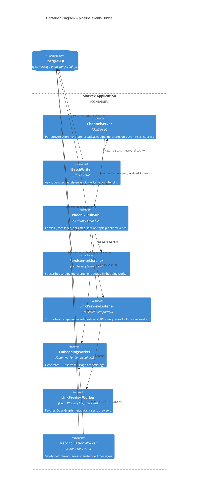
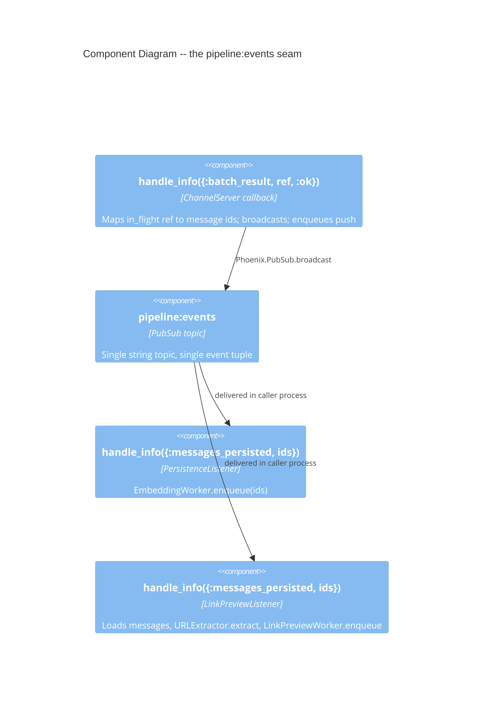
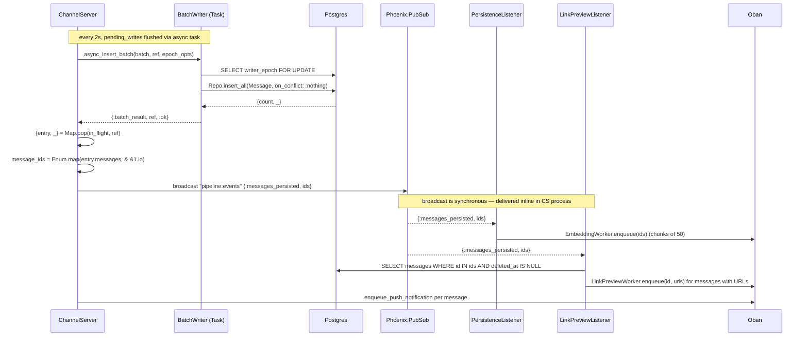

# Deep Dive: The pipeline:events Bridge

**Status:** Reference
**Zoom level:** L2 (subsystem deep dive)
**Scope:** The internal PubSub bridge that connects message persistence to downstream async consumers — embeddings and link previews. Producer and consumer wiring, the v0.5.47–v0.5.64 dead-topic incident, and the integration-test requirement that proves the bridge exists.

---

## 1. Overview

After a message is persisted, two non-essential features want to react to it: semantic embedding (for search) and link preview generation. Neither belongs on the realtime send path — both are slow, both can fail, and neither should ever block or crash the chat hot path described in [realtime-chat.md](realtime-chat.md).

The mechanism that decouples them is a single internal PubSub topic, `"pipeline:events"`, carrying one event shape: `{:messages_persisted, message_ids}`. The flow is:

1. `ChannelServer` flushes buffered writes asynchronously through `BatchWriter` (see [message-pipeline-and-persistence.md](message-pipeline-and-persistence.md)).
2. When a batch insert succeeds, `ChannelServer` broadcasts `{:messages_persisted, message_ids}` on `"pipeline:events"`.
3. Two supervised GenServer listeners — `PersistenceListener` (embeddings) and `LinkPreviewListener` (previews) — are subscribed to that topic.
4. Each listener translates the event into Oban jobs: `EmbeddingWorker` and `LinkPreviewWorker`.
5. The workers do the slow work (model inference, HTTP metadata fetch) on their own queues, off the hot path.

The bridge has **no durable backing table of its own**. It is pure publish/subscribe. Durability for the embedding side comes from a separate cron safety net, `ReconciliationWorker`, which scans for messages that never got embedded — covering the case where a listener was down when the broadcast fired.

The surprising part of this design — and the subject of Section 7 — is *where the broadcast lives*. The original spec placed it in `BatchWriter`. It is actually in `ChannelServer`, and that relocation is an architectural decision driven by the Ecto SQL Sandbox, not a code-organization preference.

---

## 2. C4 Diagrams

### 2.1 Container Diagram

### 2.2 Component Diagram (the bridge seam)

These show the subsystem at a higher level than the sequence diagrams below.

---

## 3. How To Read This Document

- Start with the **Container Diagram** to see the producer, the bus, the two listeners, and the workers.
- Use the **sequence diagram** (Section 5) for the time-ordered runtime: when the broadcast fires and what each listener does inline.
- Read **Section 7 (the incident)** to understand why the broadcast lives in `ChannelServer` and not `BatchWriter` — this is the most non-obvious design choice in the subsystem.
- Read **Section 9 (integration-test requirement)** before adding any new consumer to this bridge.

### Terms Used Here

| Term | Meaning |
|---|---|
| Bridge | The `"pipeline:events"` PubSub topic plus its producer and consumers |
| Producer | `ChannelServer.handle_info({:batch_result, ref, :ok})` — the only code that broadcasts on the topic |
| Listener | A supervised GenServer subscribed to the topic that translates events into Oban jobs |
| Dead topic | A topic with subscribers but no publisher — the v0.5.47 failure mode |
| Reconciliation | The cron safety net that catches messages a listener missed |

---

## 4. Main Components

| Component | Responsibility |
|---|---|
| `Slackex.Messaging.ChannelServer` | Owns the bridge **broadcast** in `handle_info({:batch_result, ref, :ok})` |
| `Slackex.Pipeline.BatchWriter` | Persists the batch and replies `{:batch_result, ref, :ok}` — does **not** broadcast |
| `Slackex.Embeddings.PersistenceListener` | Subscribes to `"pipeline:events"`, calls `EmbeddingWorker.enqueue/1` |
| `Slackex.Links.LinkPreviewListener` | Subscribes to `"pipeline:events"`, loads messages, extracts URLs, calls `LinkPreviewWorker.enqueue/2` |
| `Slackex.Embeddings.EmbeddingWorker` | Oban job: fetch embeddable messages, generate + upsert vectors |
| `Slackex.Links.LinkPreviewWorker` | Oban job: safety-check URLs, fetch OpenGraph metadata, insert previews |
| `Slackex.Embeddings.ReconciliationWorker` | Oban cron: durability safety net for missed embedding events |

---

## 5. Runtime Flow: Persistence Success → Broadcast → Jobs

### Notes

- The broadcast and the push-notification enqueue share the **same** callback (`handle_info({:batch_result, ref, :ok})`). Persistence success is the single trigger for embeddings, previews, and push — they are not independently gated events. Verified in `lib/slackex/messaging/channel_server.ex:213-232`.
- `Phoenix.PubSub.broadcast/3` delivers synchronously to subscribers on the same node, and under Ecto SQL Sandbox shared mode every process is routed to the one owner connection. So `LinkPreviewListener`'s `Repo.all/1` query (`lib/slackex/links/link_preview_listener.ex:44-50`), triggered by the broadcast, executes on whatever DB connection the broadcaster holds — the fact that turned the broadcast location into an architectural decision (Section 7).
- Latency from send to job is roughly the batch interval (~2s flush) plus the async insert time. There is no separate queue between persistence and the listeners.

---

## 6. Key Design Properties

- **One topic, one event shape.** The entire bridge is `"pipeline:events"` carrying `{:messages_persisted, message_ids}`. Both listeners guard on `is_list(message_ids)` and ignore everything else (`lib/slackex/embeddings/persistence_listener.ex:43`, `lib/slackex/links/link_preview_listener.ex:34`).
- **Single producer.** Only `ChannelServer.handle_info({:batch_result, ref, :ok})` broadcasts on the topic. A repo-wide grep confirms no other module publishes `:messages_persisted`. Centralizing the producer is what makes the bridge testable and what made its *absence* a single missing line (Section 7).
- **Listeners are `restart: :temporary`.** If a listener crash-loops, the root supervisor does not keep restarting it — see `lib/slackex/application.ex:49-50` and the inline comment: a `:permanent` restart would exhaust the root supervisor budget and take the app down. This is the same cascade-avoidance rule that governs the embedding serving supervisor (`maybe_embedding_serving/1`), motivated by the v0.5.36 outage precedent in [embeddings.md](embeddings.md).
- **Bridge has no durability; the cron does.** The topic is fire-and-forget. `ReconciliationWorker` (`*/15 * * * *`, 1-hour lookback) is the durability layer for embeddings. There is **no** equivalent reconciliation for link previews — the application comment calls them "cosmetic" (`lib/slackex/application.ex:47`).
- **Workers do not swallow errors.** `EmbeddingWorker.perform/1` returns its work result (propagated through `with`) so Oban can retry/discard per `max_attempts: 3` — consistent with the project rule against `_ = result; :ok` in `perform/1`. `LinkPreviewWorker.perform/1` runs at `max_attempts: 1` and returns `:ok` after recording each URL's outcome (a failed fetch becomes a `"blocked"` preview row, not an error); it is deliberately fail-fast with no retry.

---

## 7. The v0.5.47–v0.5.64 Dead-Topic Incident

This subsystem exists in its current shape because of a P2 incident documented in `docs/rca/2026-03-06-pipeline-events-bridge-missing.md`.

**What happened.** The Phase 4 spec designed the bridge and explicitly assigned the broadcast to `BatchWriter`: *"After successful batch persistence, `BatchWriter` broadcasts `{:messages_persisted, message_ids}` on the internal PubSub topic `"pipeline:events"`."* The listeners (`PersistenceListener` v0.5.36, `LinkPreviewListener` v0.5.47) and the workers were all implemented and tested. **The broadcast was never added to any module.** For ~18 hours both listeners sat subscribed to a topic that nobody published to — a *dead topic*. Zero embedding jobs, zero preview jobs, no crashes, no alerts. The features were silently inert and all CI gates passed.

**Why tests missed it.** Each layer was tested bottom-up in isolation. The listener unit tests broadcast `{:messages_persisted, ids}` *themselves* and asserted the listener responded. That proves the consumer handles the event; it proves nothing about whether any producer emits it. The producer–consumer *contract* was never exercised end-to-end. (RCA root causes RC2/RC3.)

**Why the broadcast moved to ChannelServer.** When the fix was attempted in `BatchWriter` as the spec intended, it caused Ecto SQL Sandbox poisoning in tests. The chain: `BatchWriter` runs inside `Task.Supervisor` async tasks (`Slackex.WriteSupervisor`); `Phoenix.PubSub.broadcast` delivers synchronously, so listeners run their DB queries in the broadcasting process; under the sandbox's shared mode that process is the ephemeral task, whose connection gets torn down at test exit mid-query. Broadcasting from `BatchWriter` after the transaction, or from a spawned process, hit the same wall — any process using `broadcast` runs listeners inline.

The resolution (v0.5.64) moved the broadcast into `ChannelServer.handle_info({:batch_result, ref, :ok})`. A GenServer has a predictable, drainable lifecycle (`:sys.get_state/2` blocks until its mailbox is empty), so test teardown can drain listeners before revoking the sandbox connection. `ChannelServer` already owns the `{:batch_result, ref, :ok}` callback and holds the message list in its `in_flight` map, so it is also the natural place. The broadcast location is therefore an architectural decision dictated by sandbox semantics, not code tidiness.

> Note: the `PersistenceListener` and `LinkPreviewListener` moduledocs still say *"BatchWriter broadcasts `{:messages_persisted, ...}`"* (`lib/slackex/embeddings/persistence_listener.ex:6-7`). That is stale documentation — the broadcast is in `ChannelServer`. The code is correct; the comment predates the fix.

**Corrective-action status.** Per the RCA table, CA1 (wire the broadcast from ChannelServer) and CA2 (listener drain in `DataCase`) are **Done**. Two remain open:
- **CA4 (TODO):** an integration test starting from `Messaging.send_message` that asserts a listener enqueued a job. See Section 9 for what currently exists versus the gap.
- **CA5 (TODO):** a startup log or health check confirming `"pipeline:events"` has active subscribers. A subscriber on an empty topic is indistinguishable from one with no work — that invisibility is precisely what hid this incident.

---

## 8. Failure Modes & Resilience

| Failure | Behavior | Recovery |
|---|---|---|
| Listener down when broadcast fires | Event lost for that listener (fire-and-forget, no durability in the bridge) | Embeddings: `ReconciliationWorker` re-enqueues within ≤15 min. Link previews: **no** recovery — the message simply never gets a preview |
| Listener crash-loops | `restart: :temporary` — supervisor stops restarting it; app keeps serving (`lib/slackex/application.ex:49-50`) | Manual restart / next deploy; embeddings still covered by reconciliation |
| `BatchWriter` epoch stale | `{:batch_result, _, {:error, :epoch_stale}}` → `ChannelServer` shuts down gracefully, emits telemetry (`channel_server.ex:253-269`). **No broadcast** — nothing was persisted | A live writer on the owning node persists the batch |
| `BatchWriter` target deleted | `{:error, :target_deleted}` → `ChannelServer` stops, emits telemetry (`channel_server.ex:234-251`). No broadcast | N/A — channel/DM gone |
| `BatchWriter` other error | Retried up to `@max_flush_retries`; on exhaustion the batch is dropped with a `[:slackex, :messaging, :batch_dropped]` telemetry event (`channel_server.ex:271-305`). No broadcast for a dropped batch | Lost; surfaced via telemetry |
| `EmbeddingWorker` fails | `max_attempts: 3`, then discarded | `ReconciliationWorker` re-enqueues on next run |
| `LinkPreviewWorker` fails | `max_attempts: 1` — fail-fast, no retry; a failed fetch is recorded as a `"blocked"` preview (`lib/slackex/links/link_preview_worker.ex:64,70`) | None; deliberate — if a URL can't load fast and clean, it doesn't get a preview |

**Blast radius.** A failure anywhere in this bridge degrades search indexing and/or link previews. It cannot affect the realtime send path: the broadcast happens *after* the message is already persisted and already broadcast to clients on the `channel:`/`dm:` topics (see [realtime-chat.md](realtime-chat.md)). The `:temporary` restart strategy guarantees a misbehaving listener cannot cascade into the root supervisor.

---

## 9. The Integration-Test Requirement

The project rule (CLAUDE.md, "Spec-Driven Acceptance Tests") is: every PubSub event bridge must have at least one integration test that exercises the **full producer → consumer path** — not a consumer test that fakes the upstream event. The incident in Section 7 is the cited precedent. Two tests currently cover opposite ends of this bridge:

**Producer end — real broadcast from ChannelServer.**
`test/slackex/sous/slice_a_integration_test.exs:23-73`. The test process subscribes to `"pipeline:events"`, then posts a card through the real `Sous` facade (which routes to `Messaging.send_message`). It asserts `assert_receive {:messages_persisted, ids}, 5_000` and that the card's message id is in `ids`. This proves the real chain `send_message → ChannelServer batch flush → broadcast` — the exact link that was missing in v0.5.47. It does **not** assert that a listener enqueued a job.

**Consumer end — real listener, worker, and persistence.**
`test/slackex_web/live/chat_live/e2e_test.exs:86-164`. It inserts a message directly, then **manually** broadcasts `{:messages_persisted, [message.id]}` to drive the global `LinkPreviewListener`, drains it via `:sys.get_state/1`, and asserts a `LinkPreview` row is persisted and the LiveView re-renders. This proves `listener → LinkPreviewWorker → MetadataParser → LinkPreview → link_previews:{id} → LiveView`. The test comment claims *"Full pipeline path proven"* (line 100), but the producer side is faked — the message is inserted directly and the event is hand-broadcast.

**The remaining gap (RCA CA4).** No single test runs `Messaging.send_message → ChannelServer batch flush → listener enqueues a job → worker result` without faking the broadcast. The producer is proven on one side and the consumer on the other, but the handoff — the precise seam that broke — is not asserted end-to-end in one test. Anyone adding a new consumer to `"pipeline:events"` should close this with a test that sends a real message and asserts the new worker was enqueued (e.g. `assert_enqueued(worker: ...)` after a real `send_message`), per the GOOD example in CLAUDE.md.

**Test-stability machinery.** Because the broadcast runs listeners inline on the broadcaster's DB connection, `test/support/data_case.ex:51-75` shuts down active `ChannelServer`s and then drains both listeners with `:sys.get_state/2` in `on_exit` *before* `Ecto.Adapters.SQL.Sandbox.stop_owner/1`. Without this drain, a listener's in-flight query (including the lazy FunWithFlags flag lookups) outlives the sandbox connection and the test fails intermittently. This drain is corrective action CA2.

---

## 10. Data Model

The bridge itself owns **no table** — it is publish/subscribe with no queue persistence (Oban owns the job rows). The tables it reads and writes downstream:

| Table | Schema | Bridge role |
|---|---|---|
| `messages` | `Slackex.Chat.Message` | Source of truth. `LinkPreviewListener` loads `content` filtered by `is_nil(deleted_at)`; `ReconciliationWorker` finds rows with no embedding |
| `message_embeddings` | `Slackex.Embeddings.MessageEmbedding` | `EmbeddingWorker` upserts vectors keyed by `message_id`; `ReconciliationWorker` LEFT JOINs to find `is_nil(me.message_id)` gaps |
| `link_previews` | `Slackex.Links.LinkPreview` | `LinkPreviewWorker` inserts `status: "fetched" \| "blocked"` rows |

`ReconciliationWorker` additionally filters on `not is_nil(m.search_content)` (`lib/slackex/embeddings/reconciliation_worker.ex:66`) — the plaintext companion column that exists because message content is Cloak-encrypted at rest; only messages with embeddable plaintext are reconciled. See [encryption-at-rest.md](encryption-at-rest.md) and [embeddings.md](embeddings.md) for that column's rationale.

---

## 11. Code Map

| File | Responsibility |
|---|---|
| `lib/slackex/messaging/channel_server.ex` | **Producer.** `handle_info({:batch_result, ref, :ok})` (lines 213–232) broadcasts `{:messages_persisted, ids}` and enqueues push |
| `lib/slackex/pipeline/batch_writer.ex` | Async batch insert with `writer_epoch` `FOR UPDATE` fencing; returns `{:batch_result, ref, result}` — does not broadcast |
| `lib/slackex/embeddings/persistence_listener.ex` | Embeddings listener; `EmbeddingWorker.enqueue/1` on event |
| `lib/slackex/links/link_preview_listener.ex` | Previews listener; loads messages, `URLExtractor.extract`, `LinkPreviewWorker.enqueue/2` |
| `lib/slackex/embeddings/embedding_worker.ex` | Oban worker (`:embeddings`); chunks of 50; upserts embeddings |
| `lib/slackex/links/link_preview_worker.ex` | Oban worker (`:link_previews`, `max_attempts: 1`); fetches metadata, inserts previews |
| `lib/slackex/embeddings/reconciliation_worker.ex` | Oban cron (`*/15`); LEFT JOIN gap scan; durability safety net |
| `lib/slackex/application.ex` | Supervises both listeners as `restart: :temporary` (lines 49–50) |
| `config/config.exs` | Oban queues and `ReconciliationWorker` crontab (lines 66–87) |
| `test/slackex/sous/slice_a_integration_test.exs` | Producer-end integration test (real broadcast) |
| `test/slackex_web/live/chat_live/e2e_test.exs` | Consumer-end integration test (faked producer) |
| `test/support/data_case.ex` | Listener drain before sandbox teardown (lines 51–75) |
| `docs/rca/2026-03-06-pipeline-events-bridge-missing.md` | The incident RCA |

---

## 12. Related Documents

- `docs/architecture/realtime-chat.md` - the send path and `ChannelServer` hot state that produces the broadcast
- `docs/architecture/message-pipeline-and-persistence.md` - `BatchWriter`, writer-epoch fencing, and the async durability path
- `docs/architecture/embeddings.md` - the embedding pipeline, BumblebeeClient vs StubClient, and the `:temporary` supervision precedent
- `docs/architecture/links-and-previews.md` - link preview fetching, safety checks, and metadata parsing
- `docs/architecture/encryption-at-rest.md` - why `search_content` exists as a plaintext companion column
- `docs/architecture/search-and-intelligence.md` - how embeddings feed hybrid search
- `docs/architecture/notifications.md` - push notifications, which share the `{:batch_result, :ok}` trigger
