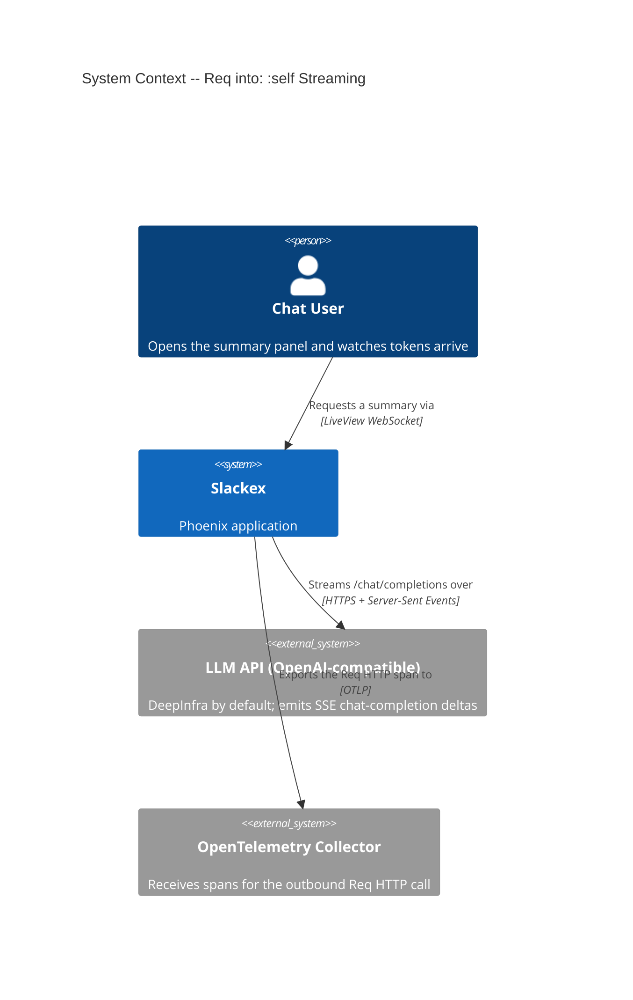
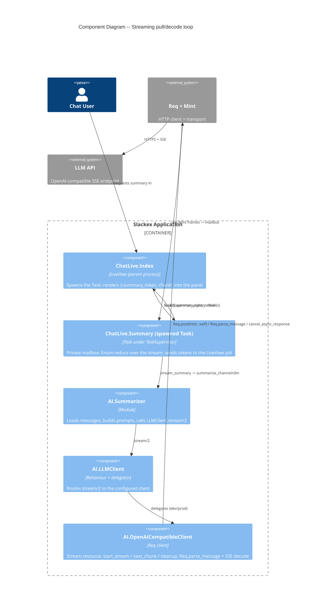
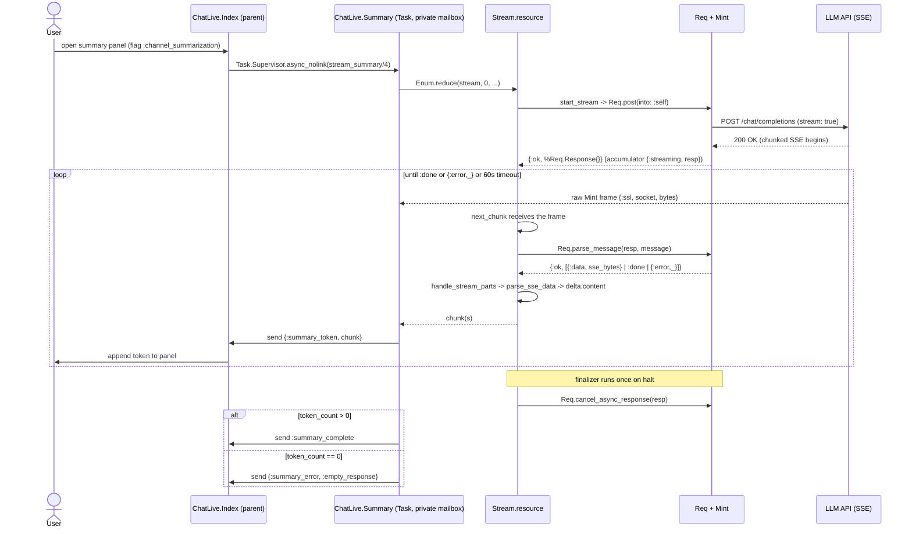

# Deep Dive: Streaming LLM Responses (Req `into: :self`)

**Status:** Reference
**Scope:** The one mechanism that turns a streaming HTTP response into a lazy Elixir `Enumerable` of token strings: `Req.post(..., into: :self)`, the raw Mint messages it delivers, `Req.parse_message/2`, the `Stream.resource/3` pull-and-cleanup loop in `Slackex.AI.OpenAICompatibleClient`, connection teardown via `Req.cancel_async_response/1`, and the v0.5.58–v0.5.61 zero-token incident and its fix. This is the L2 companion to the feature-level `ai-summarization.md`: that doc explains *why summarization streams*; this one explains *how the bytes become tokens*.

---

## 1. Overview

Slackex streams channel and DM summaries from an OpenAI-compatible chat completions API (DeepInfra by default) so that summary text appears word-by-word in the LiveView panel rather than after a multi-second pause. The entire streaming mechanism lives in one private section of `lib/slackex/ai/openai_compatible_client.ex` (the functions under the `# -- Streaming internals --` comment) and is exposed through a single behaviour callback, `stream/2`, which returns `{:ok, Enumerable.t()}`.

The surprising part — and the source of a real production incident — is the message protocol. When you ask Req to stream into the calling process with `into: :self`, Req does **not** send you tidy `{ref, {:data, chunk}}` tuples. It forwards the **raw Mint transport messages** (`{:ssl, socket, bytes}`, `{:tcp_closed, socket}`, and friends) straight to your mailbox. Those messages are meaningless to application code on their own; you must hand each one back to `Req.parse_message(resp, message)`, which knows how to decode the transport frame against the connection state held in the `%Req.Response{}` and return structured parts (`{:data, ...}`, `:done`, `{:error, ...}`).

The whole subsystem is built around three Elixir/Req primitives working together:

1. **`Stream.resource/3`** — wraps the async request as a lazy enumerable with a guaranteed cleanup finalizer.
2. **`Req.parse_message/2`** — translates each raw Mint message into Req parts. This is the load-bearing call; skipping it is what broke the feature for three versions.
3. **`Req.cancel_async_response/1`** — closes the underlying connection in the finalizer, passed the *full* `%Req.Response{}` (not a bare reference).

A second, non-obvious property makes the design safe: the stream is enumerated **inside a spawned `Task`**, whose mailbox is private. Because `into: :self` targets "the process that called `Req.post`", and that process is the Task, the Task's mailbox contains *only* Mint frames — the `{ref, result}` and `{:DOWN, ...}` messages that a normal supervised Task would receive go to the parent LiveView instead. That isolation is what lets `next_chunk/1` use a bare, non-selective `receive do message ->` without accidentally swallowing unrelated mailbox traffic. Get that wrong and the receive would block on the first non-HTTP message it saw.

---

## 2. C4 Diagrams

### 2.1 System Context



### 2.2 Component Diagram

This zooms inside the streaming seam. The placement to internalize: tokens travel *up* the chain (API → Mint → Req → client decode → Task → LiveView), one chunk at a time, while the lazy `Stream.resource` is *pulled* down the chain by the Task's `Enum.reduce`.



---

## 3. Terms Used Here

| Term | Meaning |
|---|---|
| `into: :self` | Req option telling Req to forward async transport messages to the calling process's mailbox instead of buffering the body |
| Raw Mint message | A low-level transport frame Mint delivers, e.g. `{:ssl, socket, bytes}` — opaque to application code without `Req.parse_message/2` |
| Part | A decoded element returned by `Req.parse_message/2`: `{:data, binary}`, `:done`, or `{:error, reason}` |
| Async response | The `%Req.Response.Async{}` struct that lives in `resp.body` while streaming; the *whole* `%Req.Response{}` is what the code threads around |
| SSE | Server-Sent Events — the wire format the LLM uses: `data: {json}\n\n` lines plus a final `data: [DONE]` sentinel |
| Accumulator | The `Stream.resource` state value threaded through `next_chunk/1`: `{:streaming, resp}`, `{:done, resp}`, or `{:error, reason}` |
| Chunk / token | One non-empty `delta.content` string yielded by the stream |

---

## 4. The `stream/2` Pipeline

`OpenAICompatibleClient.stream/2` (in `lib/slackex/ai/openai_compatible_client.ex`) builds two stacked stream stages and returns the outer one wrapped in `{:ok, ...}`:

1. **`Stream.resource/3`** — the async source: a start function, a `next_chunk/1` pull function, and a cleanup finalizer.
2. **`Stream.transform/4`** — a thin wrapper that passes each chunk through unchanged and, in *its* finalizer, emits the `[:slackex, :ai, :completion]` telemetry event once enumeration ends.

The three arguments to `Stream.resource/3` map onto three private functions, each handling a closed set of accumulator states:

```elixir
Stream.resource(
  fn -> start_stream(body, api_key) end,   # start: open the request
  &next_chunk/1,                            # next:  pull + decode one batch
  fn                                        # after: tear down the connection
    {:done, resp} -> Req.cancel_async_response(resp)
    {:streaming, resp} -> Req.cancel_async_response(resp)
    {:error, _} -> :ok
    _ -> :ok
  end
)
```

### 4.1 `start_stream/2` — opening the request

`start_stream/2` issues `Req.post(completions_url(), json: body, headers: auth_headers(api_key), receive_timeout: @receive_timeout_ms, into: :self)`. The `into: :self` option is what switches Req from "buffer the whole body" to "stream frames to my mailbox". On success it returns the accumulator `{:streaming, resp}` where `resp` is the **full `%Req.Response{}`** — its `:body` field holds the `%Req.Response.Async{}` handle, but the code never reaches into that; it always threads the whole response struct, because both `Req.parse_message/2` and `Req.cancel_async_response/1` need it. A non-200 returns `{:error, {:api_error, status, resp_body}}`; a transport failure returns `{:error, {:network_error, exception}}`. Both error shapes are logged at `error` level before being returned.

### 4.2 `next_chunk/1` — the pull-and-decode loop

`next_chunk/1` is the heart of the subsystem. It is called repeatedly by `Stream.resource` and dispatches on the accumulator:

- **`{:error, _reason}`** → `{:halt, err}` immediately. Errors that arose at `start_stream` short-circuit without entering a `receive`.
- **`{:streaming, resp}`** → blocks in `receive do message -> ... after @receive_timeout_ms -> ... end`. Each `message` is a raw Mint frame; it is passed to `Req.parse_message(resp, message)`:
  - `{:ok, parts}` → `handle_stream_parts(parts, state, resp)` decodes and decides whether to yield, continue, or halt.
  - `:unknown` → `{[], state}`. The message was not HTTP-related; yield nothing and keep waiting. (In the isolated Task mailbox this is rare, but the clause keeps the loop robust.)
  - On `after @receive_timeout_ms` (60s) → log a warning and `{:halt, {:error, :timeout}}`. This per-chunk timeout is the real upper bound on a stalled upstream — there is no other watchdog.
- **`{:done, _resp}`** → `{:halt, done}`. Normal completion; the finalizer will run `cancel_async_response`.
- **`other`** → `{:halt, {:error, {:unexpected_state, other}}}`. A defensive catch-all so an unforeseen accumulator can never raise a `FunctionClauseError` inside the stream — the exact failure mode of the original (pre-fix) code.

### 4.3 `handle_stream_parts/3` — SSE decode and termination

Given the decoded `parts`, this function:

1. **Extracts data** — `Enum.flat_map`s over parts, calling `parse_sse_data/1` on each `{:data, data}` and dropping everything else. A single Mint frame can carry several `data:` SSE lines, so one network read can produce several chunks (`parse_sse_data/1` splits on `"\n"`, keeps `"data: "`-prefixed lines, and JSON-decodes each).
2. **Detects "done" from two independent sources** — `has_done = :done in data_chunks or :done in parts`. There are genuinely two end signals: `Req.parse_message/2` returns a `:done` part when the HTTP response body ends, *and* the SSE protocol emits a `data: [DONE]` sentinel that `parse_sse_line/1` decodes into the `:done` atom. Either one terminates the stream; relying on only one would leave the connection open or drop the last batch depending on which arrives.
3. **Detects errors** — if any part matches `{:error, _}`, log it and `{:halt, {:error, {:stream_error, reason}}}`.
4. **Yields and routes** — on `has_done`, return `{Enum.filter(data_chunks, &is_binary/1), {:done, resp}}` (emit the binary tokens in this final batch, then transition to the done accumulator). Otherwise `{data_chunks, state}` (emit and keep streaming).

`parse_sse_line/1` is deliberately forgiving: a malformed JSON line yields `""` rather than crashing, and `""` chunks are rejected by `parse_sse_data/1`. One bad SSE record cannot kill an otherwise healthy stream.

### 4.4 Telemetry blind spot (verified gap)

The `Stream.transform/4` finalizer emits `[:slackex, :ai, :completion]` with `model`, `prompt_tokens: 0`, `completion_tokens: 0`, and `streaming: true`. Token counts are hardcoded to `0` because the streaming wire format does not carry a `usage` block the way the non-streaming `complete/2` response does. More to the point: `Slackex.AI.Telemetry`'s `[:slackex, :ai, :completion]` handler reads `metadata.model`, `metadata.prompt_tokens`, and `metadata.completion_tokens` — it **never reads the `:streaming` key**. So a streamed completion and a non-streamed one log identically (`prompt=0 completion=0` for streams), and streaming latency/throughput is not separately observable in the `[AI]` logs. This is a known gap, not a bug; recorded here so it is not rediscovered.

---

## 5. End-to-End Streaming Sequence

The centerpiece flow. Note the loop body: every iteration is one `receive` of a raw Mint frame, one `Req.parse_message/2`, one SSE decode, and (usually) one or more tokens sent to the LiveView. The cleanup finalizer runs exactly once, after the loop halts.



---

## 6. Process & Mailbox Model

Why the bare `receive` is safe is worth stating precisely, because it is the design's single most non-obvious correctness argument.

- `Req.post(..., into: :self)` sends transport messages to **the process that called it**. That process is the spawned `Task` (created by `Task.Supervisor.async_nolink/2` in `index.ex`), because the whole `Summarizer.stream/2` → `Stream.resource` chain executes inside the Task body.
- The Task's mailbox therefore contains **only** Mint frames. The standard Task lifecycle messages — `{ref, result}` (the Task's return value) and `{:DOWN, ref, :process, pid, reason}` (the monitor) — are delivered to the **parent LiveView**, not the Task. So `next_chunk/1`'s non-selective `receive do message ->` can treat every message as a candidate HTTP frame.
- The LiveView, conversely, never sees Mint frames. It handles `{:summary_token, chunk}`, `:summary_complete`, `{:summary_error, reason}` (all sent explicitly by the Task via `send(live_view_pid, ...)`), plus the two Task-plumbing clauses: `{ref, _result}` when `is_reference(ref)` → `Process.demonitor(ref, [:flush])` and discard (the streamed tokens were already delivered, so the Task's actual return value is irrelevant), and `{:DOWN, ...}` → render `:task_crashed` only if still `:loading`.

If the stream were enumerated in the LiveView process instead of a Task, the Mint frames and the LiveView's own messages would share one mailbox and the bare `receive` would consume LiveView traffic. The Task boundary is not just for fault isolation — it is what makes the receive pattern legal.

---

## 7. Cleanup & Cancellation

The stream can end several ways, and — counter to a first reading — **explicit `Req.cancel_async_response/1` is essentially a happy-path-only teardown.** It runs for exactly two accumulators: `{:done, resp}` (normal SSE completion) and `{:streaming, resp}` (the consumer abandons enumeration, or the reducer raises, *while a frame is still in flight*). Every `{:error, _}` halt — `:timeout`, `:stream_error`, `:api_error`, `:network_error`, `:unexpected_state` — falls through to the finalizer's `{:error, _} -> :ok` clause, and `:kill` bypasses the finalizer entirely. On all of those paths the connection is closed by process/connection teardown, not by Req's cancel path:

1. **Normal completion** — `next_chunk/1` returns `{:halt, {:done, resp}}`; the finalizer runs `Req.cancel_async_response(resp)`, closing the Mint connection cleanly via Req. (The same is true if the consumer stops pulling while the accumulator is still `{:streaming, resp}`.)
2. **In-stream error or upstream stall** — an API/stream error halts with `{:error, {:stream_error|:api_error, ...}}`, and a 60s stall (`receive ... after @receive_timeout_ms`) halts with `{:error, :timeout}`. Both leave an `{:error, _}` accumulator, so the finalizer hits `:ok` and `cancel_async_response` does **not** run — the socket is closed when the request errors out / the Task tears down. The 60s `receive` timeout is the only watchdog; there is no separate supervisor timeout.
3. **User cancels (closes the panel)** — `ChatLive.Summary.cancel_summary_task/1` does `Process.exit(pid, :kill)`. `:kill` is **untrappable**, so it **bypasses the `Stream.resource` finalizer entirely** — `Req.cancel_async_response/1` does *not* run on cancel. Cleanup rides on the Task's immediate death: when the owning process dies, the BEAM closes the Mint socket it held. This is a deliberate trade-off (kill is simple and instant) with a small, bounded gap: the connection is closed by process teardown rather than by Req's orderly cancel path.

The accumulator is the linchpin of correct cleanup: because the finalizer dispatches on the *same* accumulator value `next_chunk/1` left behind, every state that `start_stream`/`next_chunk` can produce has a matching finalizer clause. The original incident was, at root, a finalizer that did not cover all accumulator states.

---

## 8. Why This Architecture

- **`into: :self` over a buffered response** — buffering would hold the entire completion in memory and yield nothing until the LLM finished, defeating the word-by-word UX. Streaming frames lets the Task forward each delta the instant it arrives. The cost is handling the raw Mint protocol, which is exactly what `Req.parse_message/2` abstracts.
- **`Stream.resource/3` over a hand-rolled recursive `receive`** — `Stream.resource` is the idiomatic async-enumerable construct and, critically, **guarantees the finalizer runs** on normal completion, error, or exception during enumeration. A hand-rolled loop would have to replicate that cleanup discipline by hand. It also composes cleanly with `Stream.transform` for the telemetry stage.
- **Lazy stream returned to the caller** — `stream/2` returns `{:ok, stream}` synchronously; all network work happens later, *while the consumer enumerates*. This is why network/API/timeout errors surface during `Enum.reduce` (wrapped in the consumer's `try/rescue`) rather than at the call site, and why the panel can open before the first token arrives.
- **Full `%Req.Response{}` threaded everywhere** — both `parse_message/2` and `cancel_async_response/1` require the connection state carried by the response struct; passing a bare reference (the original mistake) gives Req nothing to decode or cancel against.

---

## 9. Data Model

This subsystem owns **no tables**. It is a pure read-through: `Slackex.AI.Summarizer` loads up to 200 non-deleted messages via `Slackex.Repo` (filtered by `channel_id`/`dm_conversation_id`, `inserted_at >= since`, `is_nil(deleted_at)`, sender preloaded) and formats them into prompt context. The streaming client writes nothing; it converts an HTTP response body into an `Enumerable` of strings. The `Slackex.AI` boundary declares `use Boundary, deps: [Slackex.Chat], exports: [Summarizer, LLMClient, Telemetry]` — its only dependency is the Chat read path.

---

## 10. Failure Modes & Resilience

| Trigger | Mechanism | Surface |
|---|---|---|
| Non-200 from API at start | `start_stream` → `{:error, {:api_error, status, body}}`; `next_chunk` halts immediately | Stream yields `[]`; consumer sends `{:summary_error, ...}` |
| Transport failure at start | `start_stream` → `{:error, {:network_error, exception}}` | `{:summary_error, ...}` |
| `{:error, _}` part mid-stream | `handle_stream_parts` → `{:halt, {:error, {:stream_error, reason}}}` | `{:summary_error, ...}` |
| Upstream stall (no frame 60s) | `next_chunk` `receive ... after @receive_timeout_ms` → `{:halt, {:error, :timeout}}`; finalizer hits the `{:error, _}` clause (`:ok`), so cancel does **not** run — socket closes via connection teardown | `{:summary_error, ...}` |
| Connects, 0 content tokens | Consumer counts tokens; `token_count == 0` → `{:summary_error, :empty_response}` | Panel error, not a false "complete" |
| Malformed SSE JSON line | `parse_sse_line/1` returns `""`; dropped by `parse_sse_data/1` | One bad line ignored; stream continues |
| Unexpected accumulator | `next_chunk(other)` catch-all → `{:halt, {:error, {:unexpected_state, other}}}` | `{:summary_error, ...}`; no `FunctionClauseError` |
| Normal completion (`{:done, resp}`) | Finalizer runs `Req.cancel_async_response(resp)` | Connection closed cleanly via Req |
| Consumer abandons stream while still `{:streaming, resp}` | Finalizer runs `Req.cancel_async_response(resp)` | Connection closed cleanly via Req |
| User cancels panel | `Process.exit(pid, :kill)` — `:kill` bypasses the finalizer; socket closed by Task death | No leaked request; `cancel_async_response` does **not** run |
| Task crashes | `async_nolink`: no restart (Task children are `:temporary`); LiveView `{:DOWN, ...}` clause | `:task_crashed` if still `:loading` |

**Restart strategy & blast radius.** There is no streaming-specific supervisor. The work runs in one short-lived Task under the shared `Slackex.TaskSupervisor`; `async_nolink` deliberately does *not* restart it on crash (no-link + `:temporary`), so a failed LLM stream produces a `{:summary_error, ...}` or `:task_crashed` and nothing else. Fault isolation comes from two real mechanisms — the no-link spawn (a crash does not propagate to the LiveView) and the LiveView's `{:DOWN, ...}` safety-net clause — not from any restart budget. An LLM that is slow, erroring, or entirely unconfigured degrades the summary panel to "unavailable" while the rest of the application serves traffic normally.

---

## 11. Testing the Real Protocol

The reason this code broke in production is that mocked HTTP never exercises the Mint message format. The corrective-action test (`test/slackex/ai/openai_compatible_client_streaming_test.exs`) therefore spins up a **real Bandit HTTP server** that emits OpenAI-shaped SSE and drives the actual `into: :self` → `Req.parse_message/2` pipeline:

- **Happy path** — the server chunks `"Hello"`, `", "`, `"world"`, `"!"`, then `data: [DONE]`; the test asserts `Enum.join(Enum.to_list(stream)) == "Hello, world!"`.
- **Error response** — a 500 endpoint; the stream either fails at `start_stream` (`{:error, {:api_error, 500, _}}`) or enumerates to `[]`.
- **Empty stream** — only `data: [DONE]`; asserts `chunks == []`.

The lesson, now hook-adjacent project policy: a producer/consumer protocol must be tested against the real wire format, not a fake. Faking the upstream proves the decoder works on your assumptions; it cannot prove your assumptions match Req.

---

## 12. Incident: v0.5.58–v0.5.61 (zero tokens despite HTTP 200)

Two stacked root causes, one masking the other; four deploy cycles over ~2 hours. Feature broken for all users, no data loss. Full RCA: `docs/rca/2026-03-06-summarization-streaming-failure.md`.

| Version | Change | What it revealed |
|---|---|---|
| v0.5.58 | Specific error messages in the modal | `FunctionClauseError` — the `Stream.resource` finalizer didn't cover all accumulator states |
| v0.5.59 | Catch-all clauses in finalizer + `next_chunk` | Crash gone; now "empty response" — stream connected (200) but yielded zero tokens |
| v0.5.60 | Diagnostic logging in `start_stream`/`next_chunk` | Logs showed `is_struct=true, is_ref=false` — the body was a `%Req.Response.Async{}` struct, not a reference |
| v0.5.61 | Replaced raw `receive` matching with `Req.parse_message/2` | Fixed |

**RC1 — non-exhaustive finalizer.** The cleanup function assumed the accumulator was always a reference or `{:done, ref}`. But `start_stream` could also yield `{:error, _}` or an async-response shape. The missing clause raised `FunctionClauseError` inside the stream. Fix: the four-clause finalizer with a `_ -> :ok` catch-all (and the matching `next_chunk(other)` catch-all).

**RC2 — wrong async message protocol.** The original `receive` matched on `{^ref, {:data, data}}`, the shape the author assumed `into: :self` produced. It does not: `into: :self` delivers **raw Mint messages** (`{:ssl, socket, binary}`), which never matched, so the receive silently timed out after 60s and the stream looked empty. The 200 status made it especially deceptive — the connection was healthy; only the *reading* was wrong. Fix: thread the full `%Req.Response{}` through the accumulator and decode every message with `Req.parse_message(resp, message)`.

**Why it survived CI.** Unit tests mocked the HTTP layer and never produced Mint frames, so they validated the decoder against the wrong-but-self-consistent assumption. Corrective actions: the real-SSE-server integration test (§11), the `Req into: :self` guidance now in `CLAUDE.md`, and the `Req.parse_message/2` requirement recorded in project memory.

The distilled rule, now in `CLAUDE.md`: with `Req.post(..., into: :self)`, the body is a `%Req.Response.Async{}`; the process receives **raw Mint messages**, not `{ref, {:data, data}}`; you **must** use `Req.parse_message(resp, message)`; and you **must** clean up with `Req.cancel_async_response(resp)` passing the full `%Req.Response{}`.

---

## 13. Code Map

| File | Responsibility |
|---|---|
| `lib/slackex/ai/openai_compatible_client.ex` | The entire streaming mechanism: `stream/2`, `start_stream/2`, `next_chunk/1`, `handle_stream_parts/3`, `parse_sse_data/1`, `parse_sse_line/1`, and the `Stream.resource` finalizer |
| `lib/slackex/ai/llm_client.ex` | Behaviour (`stream/2`, `complete/2`) + delegator; `configured?/0` graceful-degradation gate |
| `lib/slackex/ai/summarizer.ex` | Loads ≤200 messages, budgets context, builds prompts, calls `LLMClient.stream/2` |
| `lib/slackex/ai/stub_llm_client.ex` | Test client; `stream/2` yields canned words (no network, no Mint) |
| `lib/slackex_web/live/chat_live/summary.ex` | The streaming consumer: `Enum.reduce` over the stream, `{:summary_token,...}`/`:summary_complete`/`{:summary_error,...}` fan-out; `cancel_summary_task/1` (`:kill`) |
| `lib/slackex_web/live/chat_live/index.ex` | Spawns the Task via `Task.Supervisor.async_nolink`; handles the summary messages plus `{ref,_}` demonitor and `{:DOWN,...}` → `:task_crashed` |
| `lib/slackex/application.ex` | `Req.default_options(plugins: [OpentelemetryReq])`; `{Task.Supervisor, name: Slackex.TaskSupervisor}` |
| `config/dev.exs` / `config/prod.exs` | `:llm_client` → `OpenAICompatibleClient` |
| `config/test.exs` | `:llm_client` → `StubLLMClient` |
| `config/runtime.exs` | `:llm_api` map (only when `EMBEDDING_API_KEY` set): `api_url`, `model`, `api_key`, `max_tokens`, `temperature` |
| `test/slackex/ai/openai_compatible_client_streaming_test.exs` | Real-Bandit-SSE integration test for the `parse_message/2` pipeline |

---

## 14. Related Documents

- `docs/architecture/ai-summarization.md` — the feature-level view of the `Slackex.AI` context: both LLM consumers (summarization + Sous facets), prompt construction, and graceful degradation
- `docs/architecture/realtime-chat.md` — the message pipeline whose history the summarizer reads
- `docs/architecture/observability-and-ops.md` — metrics, traces, and the `[AI]` telemetry the streaming path emits (and the `:streaming`-key blind spot)
- `docs/architecture/deep-dive-pipeline-events-bridge.md` — sibling deep-dive; the producer→consumer-wiring test discipline applied to a PubSub bridge
- `docs/architecture/deep-dive-embedding-resilience.md` — sibling deep-dive; the other LLM/ML path and its `:temporary` no-cascade supervision
- `docs/rca/2026-03-06-summarization-streaming-failure.md` — the incident RCA that hardened this `Req.parse_message/2` + cleanup path
