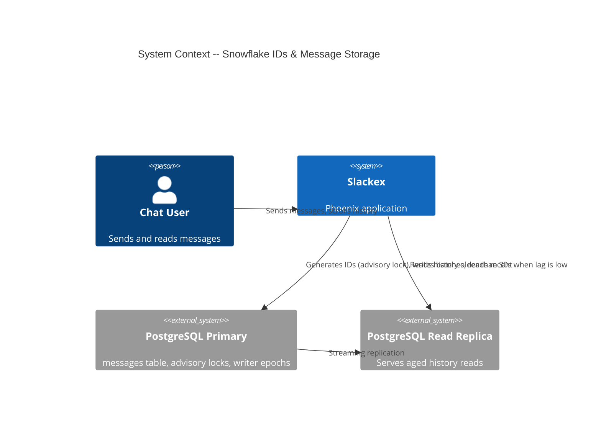
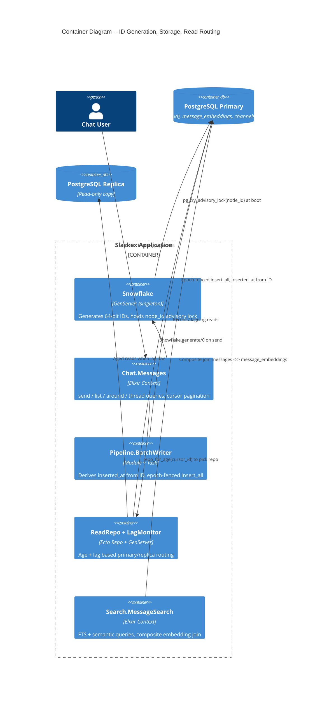
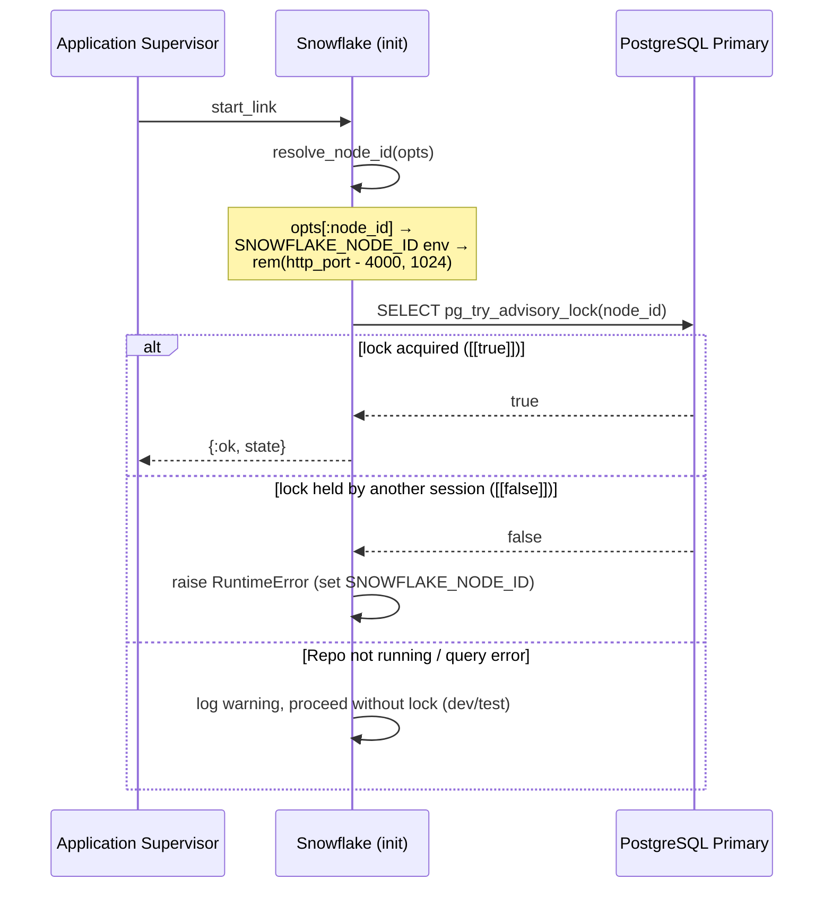
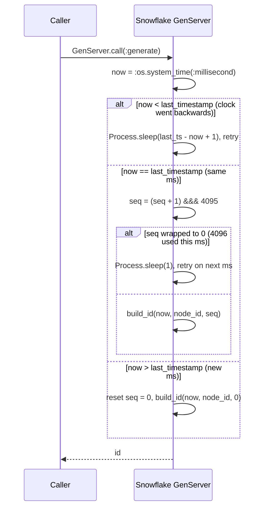

# Deep Dive: Snowflake IDs & Table Partitioning

**Status:** Reference
**Zoom level:** L2 (subsystem deep dive)
**Scope:** Snowflake ID generation (structure, ordering guarantees, generator process), the `messages` table and its planned range partitioning, partition pruning via composite joins, and pagination/ordering correctness.

---

## 1. Overview

Every message in Slackex is keyed by a 64-bit **Snowflake ID** generated by `Slackex.Infrastructure.Snowflake` (`lib/slackex/infrastructure/snowflake.ex`). The ID does three jobs at once:

1. **Identity** — it is the primary key of the `messages` table (`@primary_key {:id, :integer, autogenerate: false}` in `lib/slackex/chat/message.ex`).
2. **Ordering** — IDs are monotonically increasing within a node, so sorting by `id` sorts by send time. All pagination uses the ID as a cursor instead of an offset.
3. **Time** — the high bits encode the generation timestamp. `Snowflake.extract_timestamp/1` recovers the millisecond, and the message's `inserted_at` is **derived** from that, not from `now()` at insert time.

The surprising design choice is the third point. Because `inserted_at` is a pure function of the ID, the `(id, inserted_at)` pair is deterministic and immutable for any given message. Retries land on the same row and (once the table is partitioned) the same partition — there is no way for a retry to create a logical duplicate in a different time bucket. This property is what makes the planned `PARTITION BY RANGE (inserted_at)` scheme safe to combine with `on_conflict: :nothing` batched writes.

A note on current state: the `messages` table today has a **single-column primary key (`id`)** and is **not yet partitioned**. The composite-key and partition machinery is partly built in anticipation (the `message_embeddings` join already uses `(message_id, message_inserted_at)`), and the full partition migration is specified but unimplemented. Section 7 documents exactly what exists versus what is planned, so this document does not overstate the system.

---

## 2. C4 Diagrams

### 2.1 System Context



### 2.2 Container Diagram



These diagrams sit one level above the runtime flows in Sections 5 and 6.

---

## 3. How To Read This Document

- Start with **Section 4 (Snowflake ID Structure)** to understand the bit layout and the three guarantees the ID provides.
- Read **Section 5 (ID Generation Flow)** for the generator's runtime behavior, including how it handles clock skew and sequence exhaustion.
- Read **Section 6 (Pagination & Ordering)** to see how the ID is used as a cursor and why query results are reversed at the application layer.
- Read **Section 7 (Data Model & Partitioning)** for the current schema, the composite-join pruning technique, and the planned partition migration — with current-vs-planned clearly separated.
- Read **Section 8 (Failure Modes)** for degradation behavior and blast radius.

### Terms Used Here

| Term | Meaning |
|---|---|
| Snowflake ID | 64-bit integer message key encoding timestamp, node, and sequence |
| Epoch | Custom zero point for the timestamp bits: `2025-01-01T00:00:00Z` |
| Node ID | 0–1023 identifier for the generating node, kept unique via an advisory lock |
| Sequence | 0–4095 counter that disambiguates IDs generated in the same millisecond |
| Cursor pagination | Paging via `WHERE id < ?` / `id > ?` rather than `OFFSET` |
| Composite join | Joining on both `id` and `inserted_at` so the planner can prune partitions |
| Partition pruning | PostgreSQL skipping partitions whose range cannot match the query predicate |

---

## 4. Snowflake ID Structure

`lib/slackex/infrastructure/snowflake.ex` defines a 64-bit layout:

```
[ 1 unused ][ 41 timestamp (ms) ][ 10 node_id ][ 12 sequence ]
```

The relevant module attributes:

| Attribute | Value | Meaning |
|---|---|---|
| `@epoch` | `1_735_689_600_000` | `2025-01-01T00:00:00Z` in ms since the Unix epoch |
| `@node_id_bits` | `10` | Up to 1024 distinct nodes (0–1023) |
| `@sequence_bits` | `12` | Up to 4096 IDs per node per millisecond |
| `@max_sequence` | `(1 <<< 12) - 1 = 4095` | Sequence wrap point |
| `@node_id_shift` | `12` | Sequence bits |
| `@timestamp_shift` | `22` | node_id + sequence bits |

`build_id/3` composes the value with bitwise ORs:

```elixir
(timestamp_ms - @epoch) <<< @timestamp_shift |||
  node_id <<< @node_id_shift |||
  sequence
```

Using a custom 2025 epoch (rather than 0) keeps the 41-bit timestamp field from overflowing for ~69 years from 2025, and keeps generated IDs comfortably inside a signed 64-bit `bigint` (the column type in `priv/repo/migrations/20260221000006_create_messages.exs`).

### 4.1 Timestamp extraction

```elixir
def extract_timestamp(id) do
  (id >>> @timestamp_shift) + @epoch
end
```

Right-shifting by 22 discards node_id and sequence; adding `@epoch` returns the original millisecond. This single function is the seam that connects IDs to two other subsystems:

- **`inserted_at` derivation** — `Slackex.Chat.Message.put_inserted_at/1` calls `Snowflake.extract_timestamp/1`, multiplies by 1000 (`@milliseconds_to_microseconds`), and sets `inserted_at` via `DateTime.from_unix!/2`. `Slackex.Pipeline.BatchWriter.to_row/1` performs the identical derivation on the batched write path so the changeset path and the `insert_all` path agree.
- **Read routing** — `Slackex.ReadRepo.LagMonitor.repo_for_age/1` extracts the timestamp from a cursor ID to decide whether the requested data is "recent" (< 30s) and must come from the primary.

### 4.2 Ordering & uniqueness guarantees

Verified by `test/slackex/infrastructure/snowflake_test.exs`:

- **Monotonic within a node:** IDs generated in sequence satisfy `ids == Enum.sort(ids)`.
- **Unique:** large batches produce no collisions.
- **Signed-64-bit safe:** IDs stay below `1 <<< 63`, fitting a PostgreSQL `bigint`.

The ordering guarantee is *intra-node*. Across nodes, ordering is approximate to the degree clocks differ, since the high bits are wall-clock milliseconds. For chat-message ordering this is acceptable; the system does not claim a global total order across nodes.

---

## 5. ID Generation Flow

`Slackex.Infrastructure.Snowflake` is a singleton `GenServer` registered under its module name and started in the supervision tree (`lib/slackex/application.ex`, after `Repo`/`ReadRepo` and the cluster supervisor, before the messaging registry). `generate/0` is a synchronous `GenServer.call` — every caller serializes through the single process, which is what makes the sequence counter safe without additional locking.

### 5.1 Boot: node-id resolution and advisory lock



`resolve_node_id/1` prefers an explicit `:node_id` option, then the `SNOWFLAKE_NODE_ID` environment variable (parsed as an integer), and finally derives a dev-friendly node id from the HTTP port: `rem(port - 4000, 1024)` (port 4000 → node 0, 4001 → node 1, …).

`maybe_acquire_lock/1` takes a **session-level** PostgreSQL advisory lock keyed on the node id. The point is collision prevention: if two BEAM nodes resolved the same node id, the second `pg_try_advisory_lock` returns `false` and startup aborts with a message telling the operator to set a unique `SNOWFLAKE_NODE_ID`. This guards the multi-node deployment (libcluster + Horde; see Section 8) against silently minting duplicate IDs from two generators sharing a node id. If `Repo` is not yet running, or the query raises, the lock step is skipped with a warning — explicitly tolerated for dev/test where a single node is the norm.

### 5.2 Per-call generation: clock skew & sequence overflow



Two non-obvious behaviors, both implemented in `do_generate/1`:

- **Clock skew:** if the system clock moves backwards (`now < last_timestamp`), the generator *sleeps* until it is past the last timestamp and retries, rather than emitting an out-of-order ID. This preserves monotonicity at the cost of a latency spike. The sleep is inside the `GenServer.call`, so it blocks the calling process for the duration.
- **Sequence exhaustion:** at most 4096 IDs (sequence 0–4095) can be issued in one millisecond. The 4096th wraps the sequence to 0, which the code treats as exhaustion: it sleeps 1 ms and regenerates on the next millisecond. For single-node throughput this ceiling (≈4M IDs/sec) is effectively unreachable in normal chat load.

Both mechanisms are explicit `Process.sleep` calls on the hot path. They bound correctness but can introduce latency under clock instability — worth knowing when reasoning about tail latency.

---

## 6. Pagination & Ordering Correctness

Because IDs sort by send time, the read APIs in `lib/slackex/chat/messages.ex` use the ID as a **keyset cursor**. There is no `OFFSET`; paging is `WHERE id < ?` (older) or `WHERE id > ?` (newer), which is index-friendly and stable under concurrent inserts.

### 6.1 `list_messages/2`

```elixir
# lib/slackex/chat/messages.ex
repo = ReadRepo.repo_for_age(before_id || after_id || :recent)

cond do
  after_id  -> base |> where([m], m.id > ^after_id)  |> order_by([m], asc: m.id)
  before_id -> base |> where([m], m.id < ^before_id) |> order_by([m], desc: m.id)
  true      -> order_by(base, [m], desc: m.id)
end
```

- `:before` (load older) returns **descending** (newest of the older page first), bounded exclusive by the cursor.
- `:after` (load newer) returns **ascending**.
- No cursor returns the latest page descending.

The cursor ID is also fed to `ReadRepo.repo_for_age/1` (Section 7.4) so that the *age of the data being requested* decides whether the query is safe to route to a replica.

### 6.2 `list_messages_around/3`

For "jump to this message" (search-result deep links), `list_messages_around/3` builds three subqueries — `half_page` before (`id < message_id`, desc), the target (`id == message_id`), and `half_page` after (`id > message_id`, asc) — unions them with `union_all`, and orders the combined set ascending so the UI receives a chronological window. It returns `[]` early when the target is missing or soft-deleted (`is_nil(m.deleted_at)`), so a deep link to a deleted message degrades to an empty window rather than an error.

### 6.3 `list_dm_messages/2` and threads

`list_dm_messages/2` is the simpler sibling: only `:limit` and `:before`, always `order_by: [desc: m.id]`. `list_thread/2` lists replies for a `parent_message_id` ascending, excluding soft-deleted rows.

### 6.4 Why results are reversed at the application layer

The database queries are optimized for the dominant "load the latest messages" case, so they return newest-first (`desc: id`). The chat UI, however, renders oldest-first. The reversal to chronological order happens in the application layer (e.g. the read-model/history loader described in `caching-and-read-model.md`), not in SQL. Keeping the DB query descending lets the same index serve both the latest-page load and upward pagination without a second sort direction.

---

## 7. Data Model & Partitioning

### 7.1 Current `messages` schema (as built)

`lib/slackex/chat/message.ex` (schema) and the migrations under `priv/repo/migrations/` define the live table:

| Column | Type | Notes |
|---|---|---|
| `id` | `bigint` PK | Snowflake ID; `autogenerate: false` (app-supplied) |
| `content` | encrypted binary | `Slackex.Encrypted.Binary`, stored in `encrypted_content` |
| `search_content` | `text` | **Plaintext companion** for FTS; populated alongside `content` |
| `inserted_at` | `utc_datetime_usec` | Derived from the Snowflake ID, not `now()` |
| `edited_at`, `deleted_at` | `utc_datetime_usec` | Soft-delete via `deleted_at` |
| `parent_message_id`, `reply_count` | integer | Threading |
| `channel_id` / `dm_conversation_id` | FK | Exactly one set (`validate_target/1`) |
| `sender_id` | FK | `nilify_all` on user delete |

The **primary key is `id` alone** — a single-column key. The table is **not partitioned** today.

**Encryption + FTS seam.** `content` is encrypted at rest (AES-GCM ciphertext, see `encryption-at-rest/`). Ciphertext cannot be indexed, so `search_content` holds the plaintext purely for indexing. The changeset's `put_search_content/1` copies `content` into `search_content` on insert and edit; `delete_changeset/1` nulls both on soft-delete. The GIN index added in `priv/repo/migrations/20260303191200_add_fts_gin_index.exs` is on `to_tsvector('english', coalesce(search_content, ''))` and was created `CONCURRENTLY` for deploy safety. (The original `create_messages` migration created an FTS index over `content`; the companion-column index supersedes it once content moved to encrypted storage.)

### 7.2 The composite key as it exists today: `message_embeddings`

The `(id, inserted_at)` composite-key pattern is **already live** on the embeddings side, ahead of the messages table itself being partitioned. `lib/slackex/embeddings/message_embedding.ex`:

```elixir
@primary_key {:message_id, :integer, autogenerate: false}
schema "message_embeddings" do
  field :message_inserted_at, :utc_datetime_usec
  field :channel_id, :integer
  field :dm_conversation_id, :integer
  field :embedding, Pgvector.Ecto.Vector
  field :content_hash, :string
  ...
end
```

`message_inserted_at` exists specifically so a query can join on **both** the message id and the inserted_at, carrying the partition-key column across the join. The vector column was created as `vector(1536)` in `20260303185600_create_message_embeddings.exs` and resized to 384 dimensions in `20260304000000_resize_embeddings_to_384.exs` (matching the dev `all-MiniLM-L6-v2` provider; see `embeddings.md`). It is indexed with HNSW (`vector_cosine_ops`, `m = 16`, `ef_construction = 64`).

### 7.3 Partition pruning via composite joins

The semantic-search query in `lib/slackex/search/message_search.ex` joins messages to embeddings on the full pair:

```elixir
from(m in Message,
  join: me in MessageEmbedding,
  on: me.message_id == m.id and me.message_inserted_at == m.inserted_at,
  where: is_nil(m.deleted_at),
  where: ^build_authorization_condition(user_id, opts),
  ...
)
```

The `me.message_inserted_at == m.inserted_at` clause is the load-bearing part for future partitioning: once `messages` is partitioned by `inserted_at`, PostgreSQL can use the equality to infer a partition predicate and prune partitions that cannot match, instead of scanning all of them. Today the table is not partitioned, so the clause is functionally a correctness guard; it is in place so the query needs no rewrite when partitioning lands.

**Authorization uses EXISTS, not JOIN.** `build_authorization_condition/2` composes `EXISTS (...)` subqueries — `public_channel_condition/0`, `private_channel_member_condition/1`, `dm_participant_condition/1`. Using `EXISTS` rather than joining to `subscriptions`/`channels`/`dm_conversations` avoids row multiplication: a JOIN to a one-to-many table would duplicate message rows, corrupting `LIMIT`/`OFFSET` pagination and any rank-based ordering. This is a deliberate choice documented in `search-and-intelligence.md`.

### 7.4 Read routing by data age

`Slackex.ReadRepo.LagMonitor.repo_for_age/1` decides primary-vs-replica per query:

```elixir
def repo_for_age(:recent), do: Slackex.Repo
def repo_for_age(snowflake_id) do
  if no_replica?() or lag_exceeded?() do
    Slackex.Repo
  else
    age_ms = System.os_time(:millisecond) - Snowflake.extract_timestamp(snowflake_id)
    if age_ms < @recent_threshold_ms, do: Slackex.Repo, else: ReadRepo
  end
end
```

- `@recent_threshold_ms = 30_000` — anything written in the last 30s goes to the primary (it may not have replicated yet).
- `@lag_threshold_seconds = 5.0` — the `LagMonitor` GenServer polls `pg_last_xact_replay_timestamp()` every 5s; if lag exceeds 5s, a NULL is returned (fresh standby), or the query errors, it flips a `:persistent_term` flag and *all* reads fall back to the primary.
- **No-replica mode:** if `ReadRepo` and `Repo` resolve to the same database (`same_database?/0`), lag monitoring is skipped and `repo_for_age/1` always returns the primary — the common single-database deployment.

The decision tree is: no replica or lag exceeded → primary; otherwise use the cursor ID's age. This is why list queries pass the *oldest requested cursor ID* into `repo_for_age/1` — the ID's embedded timestamp is the cheapest available proxy for "how stale is the data I'm asking for".

### 7.5 Planned partition migration (NOT yet implemented)

`specs/03-phase-3-distribution.md` §5 specifies converting `messages` to a range-partitioned table. **None of this is in the codebase yet** — there is no partition migration, no `Slackex.Workers.PartitionMaintenance` worker, and the live PK is still single-column. Documented here so the intent and the gap are explicit:

- **Target shape:** `PARTITION BY RANGE (inserted_at)`, composite PK `(id, inserted_at)`, monthly partitions covering all historical data plus ~3 months headroom.
- **Indexes to recreate:** `(channel_id, inserted_at, id)`, `(dm_conversation_id, inserted_at, id)`, `(sender_id)`, and the GIN FTS index. `inserted_at` is folded into the composite indexes precisely so queries filtering on `channel_id` plus a Snowflake-derived time bound can prune.
- **Validation gates (must all pass before dropping the old table):** row-count match, per-partition counts (`tableoid::regclass`), boundary integrity, chunked MD5 checksum sample of 3 partitions, smoke tests of the critical history queries, and an `EXPLAIN` confirming pruning is active.
- **Maintenance worker (planned):** `Slackex.Workers.PartitionMaintenance`, a monthly Oban cron, would run `CREATE TABLE IF NOT EXISTS ... PARTITION OF messages FOR VALUES FROM (...) TO (...)` to keep future months provisioned.
- **FK note:** a partitioned `messages` requires FKs to reference the full `(id, inserted_at)` key. `message_embeddings` deliberately holds *no* FK to `messages`; referential integrity for embeddings is enforced at the application level (orphaned embedding rows are tolerable and reconciled, not constraint-enforced).

The reason the migration is safe to combine with the existing write path: `inserted_at` is derived from the immutable ID (Section 4.1), so the `(id, inserted_at)` pair never changes between a write and its retry, and `BatchWriter`'s `on_conflict: :nothing` resolves a duplicate against the composite PK without producing a cross-partition ghost.

---

## 8. Failure Modes & Resilience

### 8.1 Snowflake generator

- **Blast radius:** the generator is a singleton `GenServer`. If it crashes, its supervisor (`one_for_one` in `application.ex`) restarts it; in-flight `generate/0` calls fail. Because IDs are not persisted in the process (the only durable state is `last_timestamp`/`sequence`, which a fresh `now()` re-establishes), a restart cannot mint a *backwards* ID — wall-clock time only moves forward across the restart window.
- **Advisory-lock loss on restart:** the lock is session-level and tied to the DB connection; this is a known sharp edge in multi-node operation, but in practice the operator-assigned `SNOWFLAKE_NODE_ID` is the real uniqueness guarantee, and the lock is the boot-time tripwire that catches a misconfiguration.
- **Clock instability:** backward clock jumps cause `Process.sleep` on the call path (latency, not incorrectness). Sustained backward drift would stall ID generation until wall clock catches up — preferable to emitting non-monotonic IDs.

### 8.2 Write path & epoch fencing

`Slackex.Pipeline.BatchWriter.insert_batch/2` wraps the insert in a transaction that `SELECT writer_epoch ... FOR UPDATE` on the owning `channels`/`dm_conversations` row and compares it to the caller's `:epoch`:

- `db_epoch > caller_epoch` → `Repo.rollback(:epoch_stale)` — a stale `ChannelServer` (e.g. after a Horde failover) cannot persist.
- no row → `Repo.rollback(:target_deleted)`.
- otherwise → `Repo.insert_all(Message, entries, on_conflict: :nothing)`.

This is the actual mechanism that prevents two writers from both persisting after an ownership change. (See `message-pipeline-and-persistence.md` and `realtime-chat.md` for the full producer side.)

### 8.3 Multi-node reality (what the code actually does)

The cluster is real: `application.ex` starts `Cluster.Supervisor` (libcluster) and `Slackex.NodeListener`, and the messaging layer uses Horde (`ChannelRegistry`, `ChannelSupervisor`). It is worth being precise about responsibilities, because the names can suggest more than the code does:

- **`Slackex.NodeListener`** only **observes and logs**. It calls `:net_kernel.monitor_nodes/2` and logs `:nodeup`/`:nodedown` and a 30s cluster-size summary. It performs **no fencing or recovery** itself.
- **Writer fencing lives entirely in `BatchWriter` + `writer_epoch`** (Section 8.2), not in `NodeListener`. There is no separate "split-brain fencing" subsystem beyond the per-conversation epoch check.
- **ID uniqueness across nodes** depends on distinct node ids (env var, enforced at boot by the advisory lock), not on cluster coordination.

### 8.4 Read routing degradation

`LagMonitor` degrades safely: a NULL replay timestamp, a query error, or lag over threshold all flip the `:persistent_term` flag to route reads to the primary. The flag is stored in `:persistent_term` for lock-free reads on the hot path. Worst case is extra load on the primary, never stale reads served as if fresh.

---

## 9. Code Map

| File | Responsibility |
|---|---|
| `lib/slackex/infrastructure/snowflake.ex` | ID generation, bit layout, `extract_timestamp/1`, node-id resolution, advisory lock |
| `lib/slackex/chat/message.ex` | Message schema; `put_inserted_at/1` derives `inserted_at` from the ID; `put_search_content/1` plaintext companion |
| `lib/slackex/chat/messages.ex` | `list_messages/2`, `list_messages_around/3`, `list_dm_messages/2`, `list_thread/2` — cursor pagination & ordering |
| `lib/slackex/pipeline/batch_writer.ex` | Batched `insert_all`; epoch fencing; `inserted_at` derivation on the write path |
| `lib/slackex/read_repo.ex` | Read-only repo; delegates routing to `LagMonitor` |
| `lib/slackex/read_repo/lag_monitor.ex` | `repo_for_age/1`, lag polling, no-replica detection, `:persistent_term` flags |
| `lib/slackex/embeddings/message_embedding.ex` | `(message_id, message_inserted_at)` composite-key schema; HNSW vector column |
| `lib/slackex/search/message_search.ex` | Composite embedding join (pruning-ready); `EXISTS`-based authorization |
| `lib/slackex/node_listener.ex` | Logs cluster join/leave events (observation only) |
| `lib/slackex/application.ex` | Supervision order of `Snowflake`, `LagMonitor`, cluster, registry |
| `priv/repo/migrations/20260221000006_create_messages.exs` | `messages` table, `bigint` PK |
| `priv/repo/migrations/20260303191200_add_fts_gin_index.exs` | `search_content` column + GIN FTS index (`CONCURRENTLY`) |
| `priv/repo/migrations/20260303185600_create_message_embeddings.exs` | `message_embeddings` table + HNSW index |
| `priv/repo/migrations/20260304000000_resize_embeddings_to_384.exs` | Resizes embedding vector to 384 dims |
| `specs/03-phase-3-distribution.md` (§5) | Planned partition migration, validation gates, maintenance worker (not yet implemented) |

---

## 10. Related Documents

- [`message-pipeline-and-persistence.md`](message-pipeline-and-persistence.md) — the producer side: how IDs are minted on send and flushed through `BatchWriter`
- [`realtime-chat.md`](realtime-chat.md) — `ChannelServer` hot path, PubSub fanout, writer-epoch fencing context
- [`caching-and-read-model.md`](caching-and-read-model.md) — history loading, cache backfill, and where query results are reversed to chronological order
- [`search-and-intelligence.md`](search-and-intelligence.md) — FTS + semantic fusion, `EXISTS`-based authorization, RRF ranking
- [`embeddings.md`](embeddings.md) — embedding provider (dev `all-MiniLM-L6-v2` 384-dim, prod stub), non-essential supervision
- [`system-landscape.md`](system-landscape.md) — where this subsystem sits in the overall architecture
