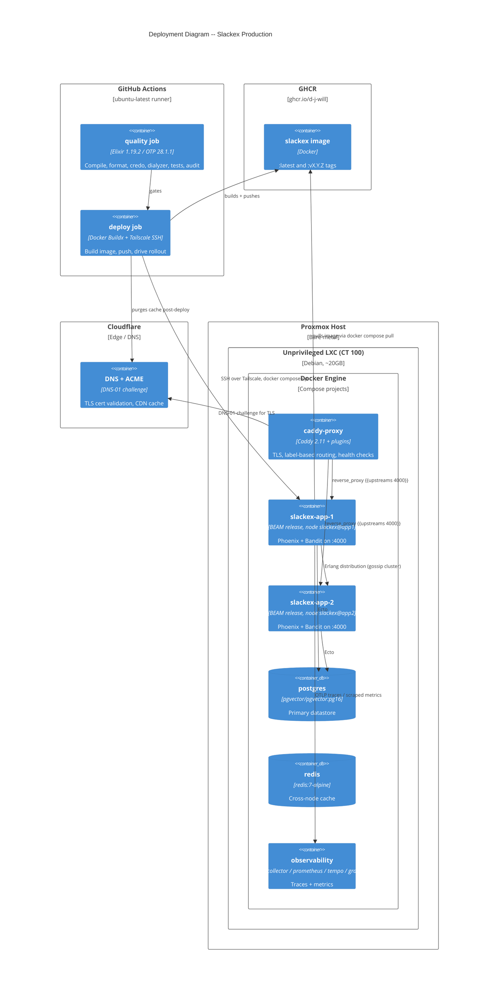
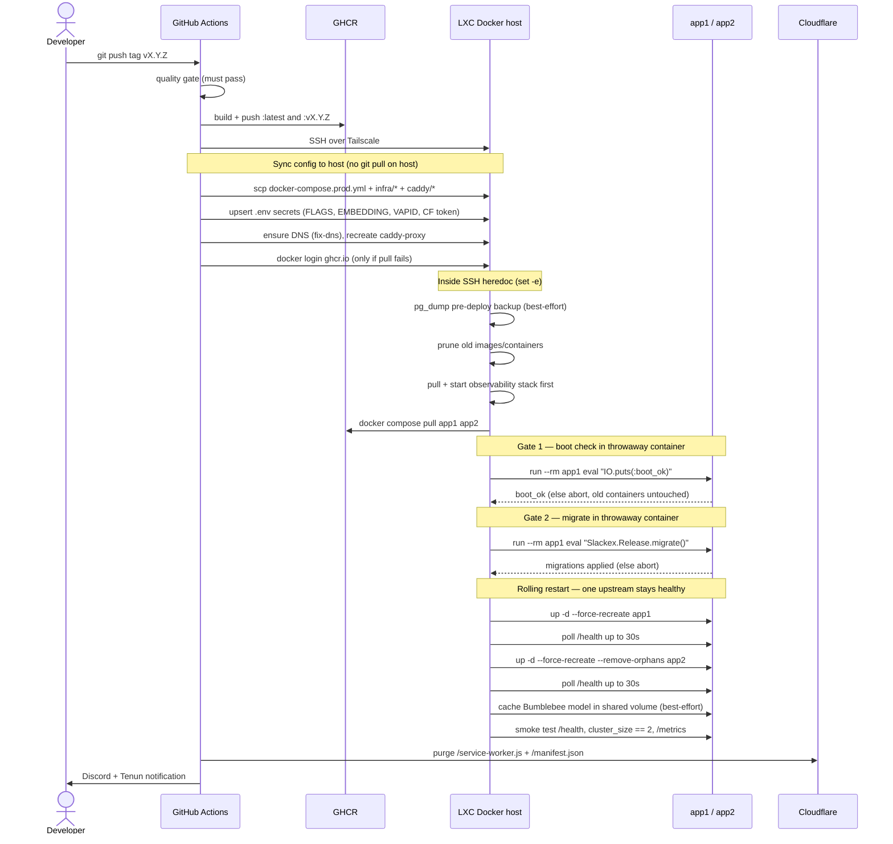

# Deployment Topology

**Status:** Reference
**Scope:** How Slackex is built, shipped, and run in production — GitHub Actions CI/CD, the GHCR image, the SSH-to-LXC deploy, caddy-docker-proxy + Cloudflare, the unprivileged LXC on Proxmox, multi-node clustering as it bears on deployment, and `Release.migrate`.

This document is the operator's-eye view of the system. For how a request flows *once it reaches a node*, see [`realtime-chat.md`](realtime-chat.md). For metrics/traces, see [`observability-and-ops.md`](observability-and-ops.md). The companion operational runbook is [`../runbooks/deployment.md`](../runbooks/deployment.md).

---

## 1. Overview

Slackex deploys as a small, deliberately boring stack: two identical application containers behind a single reverse proxy, on one Docker host. There is no Kubernetes, no service mesh, and no container orchestrator beyond Docker Compose. The complexity that would normally live in an orchestrator is instead pushed into three places that are cheaper to reason about for a two-node system:

1. **The BEAM** — the two app nodes form an Erlang cluster and coordinate process placement themselves (libcluster + Horde).
2. **caddy-docker-proxy** — the reverse proxy reads Docker labels off the running containers and configures itself, including TLS, so there is no proxy config to deploy.
3. **The CI deploy script** — a single GitHub Actions job that SSHes into the host and drives the whole rollout, gating each risky step behind a verification.

The headline non-obvious property: **deploys trigger only on version tags** (`refs/tags/v*`). Pushing to `master` runs the quality gate and stops. A release is an explicit, named act.

The host is an **unprivileged LXC container** on Proxmox — not a full VM. That single fact drives several otherwise-mysterious configuration choices (see §7) and is the source of most environment-specific deploy bugs in the incident history.

---

## 2. C4 Diagrams

### 2.1 Deployment Diagram



### 2.2 How To Read This Document

- Start with the **Deployment Diagram** to see where each container runs and how the build/ship/run boundaries fall.
- Read **§3 Build Pipeline** and **§4 Deploy Pipeline** for the time-ordered CI flow, including the sequence diagram.
- Use **§5 Runtime Topology** for what is actually running on the host and how the two app nodes find each other.
- Use **§7 Host Constraints** when a deploy behaves strangely — most surprises trace back to the LXC.
- Use **§8 Failure Modes & Resilience** to understand how the system degrades and recovers.

---

## 3. Build Pipeline

The workflow is `.github/workflows/ci-deploy.yml`. It has three jobs: `quality`, `deploy`, and `notify`.

### 3.1 Quality gate (every push + PR)

The `quality` job runs on `MIX_ENV=test` against ephemeral `pgvector/pgvector:pg16` (port 5433) and `redis:7-alpine` (port 6379) service containers, pinned to **Elixir 1.19.2 / OTP 28.1.1** via `erlef/setup-beam`. It caches `deps`, `_build`, and the Dialyzer PLTs, then runs, in order: `mix compile --warnings-as-errors`, `mix format --check-formatted`, `mix credo`, `mix dialyzer`, `mix ecto.create && mix ecto.migrate`, `mix test --warnings-as-errors`, the `contract` and `e2e` tagged suites, `mix hex.audit`, and `mix deps.unlock --check-unused`.

This is the same checklist `scripts/pre-deploy` runs locally before tagging (see [`../runbooks/deployment.md`](../runbooks/deployment.md) §"Pre-deploy verification").

### 3.2 Image build (tags only)

The `deploy` job runs only when `startsWith(github.ref, 'refs/tags/v')` and `needs: quality` has passed. It builds the image with Docker Buildx using GitHub Actions cache (`cache-from/to: type=gha,mode=max`) and pushes two tags to GHCR: `ghcr.io/d-j-will/slackex:latest` and `ghcr.io/d-j-will/slackex:<version>`.

The image is built from a two-stage `Dockerfile`:

| Stage | Base | Responsibility |
|---|---|---|
| `build` | `hexpm/elixir:1.19.2-erlang-28.1.1-debian-bookworm-...-slim` | `mix deps.get --only prod`, compile, `mix assets.deploy` (esbuild + tailwind), `mix release` |
| `runtime` | `debian:bookworm-slim` | Minimal OS deps; copies `/app/_build/prod/rel/slackex`; runs as non-root `appuser`; `ENV PHX_SERVER=true`; `CMD ["/app/bin/server"]` |

The runtime image carries no Mix and no build toolchain — it is the compiled OTP release plus a thin Debian base. The container entrypoint is `rel/overlays/bin/server`, which runs migrations and then `./bin/slackex start` (see §6).

---

## 4. Deploy Pipeline

After the image is pushed, the same job installs Tailscale (`tailscale/github-action`, tagged `tag:ci`) and SSHes to the host as `root@${DEPLOY_HOST}` over the tailnet. The rollout is one large SSH session driven from the runner.

### 4.1 Deploy sequence



### 4.2 Configuration sync (host has no git)

The host never pulls source. The deploy `scp`s the files it needs and upserts secrets into `/root/slackex/.env` (and `/root/caddy/.env`) with idempotent `grep ... && sed || echo` blocks:

- `docker-compose.prod.yml` → `/root/slackex/`
- `infra/otel-collector-config.yaml`, `infra/prometheus.yml`, `infra/tempo.yaml`, Grafana provisioning + dashboard JSON → `/root/slackex/infra/...`
- `infra/caddy/{Dockerfile,docker-compose.yml,Caddyfile}` → `/root/caddy/`

Keeping the compose file in lockstep with the repo is mandatory — the runbook calls this out because a stale server compose file silently runs old service definitions.

### 4.3 The migration gate (corrected mental model)

Migrations are **not** "run once." `Slackex.Release.migrate/0` is invoked in two places:

1. **Explicitly in CI**, as a gate, in a throwaway `--rm` container *before* either app container is recreated.
2. **On every container boot**, via the `CMD` entrypoint `rel/overlays/bin/server`.

The CI step exists to **fail the deploy safely**: after the boot check passes, migrations run in a disposable container; if they error, the deploy aborts (`set -e`) with the *old* `app1`/`app2` still serving traffic. Because Ecto takes a migration advisory lock and the rolling restart is sequential, the per-boot `migrate()` on the recreated containers re-runs as an idempotent no-op. So the explicit step is the gate; the per-boot step is belt-and-braces.

`migrate/0` also runs `decode_html_entities/0` at the end — an idempotent cleanup of legacy HTML-entity encoding in `search_content`, filtered so already-clean rows are skipped. Note that `backfill_embeddings/1` is **not** part of `migrate/0` and is **not** invoked by the deploy; the deploy's Bumblebee step only `load_model`/`load_tokenizer`-caches the model into the shared volume (best-effort), distinct from generating embeddings.

### 4.4 Rolling restart

`app1` is recreated and polled on `/health` for up to 30s, then `app2`. Restarting one node at a time means the proxy always has at least one healthy upstream (see §5.2). The deploy gates on `/health`, not `/ready`; `/ready` exists and checks DB + Redis (503 if the DB is down) but nothing in CI calls it.

### 4.5 Notifications

The `notify` job posts deploy/CI status to a Discord webhook and to a Tenun incoming webhook (with retry, since the app may still be restarting). It runs on quality failure, deploy failure, or deploy success.

---

## 5. Runtime Topology

The production stack is defined in `docker-compose.prod.yml`. The `proxy` network is declared `external: true` — it is created out-of-band and shared with the separate caddy-proxy Compose project in `/root/caddy/`.

### 5.1 Services

| Service | Container | Image | Notes |
|---|---|---|---|
| `app1` | `slackex-app-1` | `ghcr.io/d-j-will/slackex:latest` | `RELEASE_NODE=slackex@app1`, `mem_limit: 2g`, on `default` + `proxy` |
| `app2` | `slackex-app-2` | same | `RELEASE_NODE=slackex@app2`, identical otherwise |
| `postgres` | — | `pgvector/pgvector:pg16` | `pgdata` volume, `pg_isready` healthcheck, `default` only |
| `redis` | — | `redis:7-alpine` | `maxmemory 128mb`, `allkeys-lru`, `redisdata` volume |
| `otel-collector` | — | `otel/opentelemetry-collector-contrib:0.153.0` | OTLP receivers on 4317/4318 |
| `prometheus` | — | `prom/prometheus:v3.12.0` | 14d / 2GB retention, remote-write receiver |
| `tempo` | — | `grafana/tempo:2.7.2` | pinned (v3 breaks config schema) |
| `grafana` | — | `grafana/grafana:13.0.1` | on `proxy` for `grafana.davewil.dev`, host port 3002 |

Both app containers wait on `postgres` and `redis` being `service_healthy` before starting. Image versions for the observability stack are pinned deliberately; see [`observability-and-ops.md`](observability-and-ops.md) for the metrics/trace pipeline this stack carries.

### 5.2 Reverse proxy and TLS (caddy-docker-proxy)

The proxy is a separate Compose project (`infra/caddy/docker-compose.yml`) running a custom Caddy built via xcaddy with the `caddy-docker-proxy/v2` and `caddy-dns/cloudflare` plugins. It mounts the Docker socket and discovers app containers by reading their `caddy_*` labels.

Routing is expressed entirely as labels on the app containers, not in a config file:

```yaml
# app1 labels
caddy_0: chat.davewil.dev
caddy_0.tls.dns: cloudflare {env.CF_API_TOKEN}
caddy_0.reverse_proxy: "{{upstreams 4000}}"
caddy_0.reverse_proxy.health_uri: /health
caddy_0.reverse_proxy.health_interval: 5s
caddy_0.reverse_proxy.health_timeout: 3s
caddy_0.reverse_proxy.fail_duration: 15s
caddy_0.reverse_proxy.health_headers.X-Forwarded-Proto: https
caddy_1: mcp.davewil.dev
caddy_1.tls.dns: cloudflare {env.CF_API_TOKEN}
caddy_1.reverse_proxy: "{{upstreams 4000}}"
```

caddy-docker-proxy **merges labels across all containers sharing a site name**. Both `app1` and `app2` declare `caddy_0: chat.davewil.dev` with `reverse_proxy: {{upstreams 4000}}`, so Caddy load-balances both as upstreams for that hostname. The `tls.dns` directive only needs to appear once per site (it is present on `app1`); issued certificates live in the `caddy_data` volume on the caddy-proxy container, keyed by hostname, and persist across restarts. Three sites are served off the proxy: `chat.davewil.dev` and `mcp.davewil.dev` (both → app upstreams on 4000) and `grafana.davewil.dev` (→ Grafana on 3000).

Two TLS-relevant subtleties, both verified in the runbook:

- **Active health checks** (`health_uri /health`, 5s interval, 15s fail window) give automatic failover — without them, stopping a node returns 502 for requests routed to it.
- **`health_headers { X-Forwarded-Proto https }` is required** because the app sets `force_ssl: [hsts: true, rewrite_on: [:x_forwarded_proto]]`. A plain HTTP health probe without that header would get a 301 from Phoenix, which Caddy reads as unhealthy — marking *all* upstreams down and returning 503 to everyone.

TLS certificates are issued via Cloudflare **DNS-01 challenge** using `CADDY_CF_TOKEN` (passed to the proxy as `CF_API_TOKEN`). This is distinct from the post-deploy **cache purge**, which uses a different `CF_PURGE_TOKEN` (Bearer auth) against the Cloudflare zone API to invalidate `/service-worker.js` and `/manifest.json` so PWA clients pick up the new build.

### 5.3 Multi-node clustering (deployment-relevant)

The two BEAM nodes form a real Erlang cluster. The deployment-relevant facts:

- **Distribution:** `rel/env.sh.eex` sets `RELEASE_DISTRIBUTION=sname` (short names match Compose hostnames) and derives `RELEASE_COOKIE` from a SHA-256 of `SECRET_KEY_BASE` — so both nodes share a cookie without one being set explicitly, as long as they share `SECRET_KEY_BASE`.
- **Discovery:** `config/runtime.exs` configures libcluster with a single `gossip` topology (`Cluster.Strategy.Gossip`), and `Cluster.Supervisor` is started in `lib/slackex/application.ex`. Gossip is resilient to node restarts and needs no central registry — well suited to a rolling restart where one node disappears and rejoins. (The `dns_cluster` dependency is present and `:dns_cluster_query` is read from env, but DNSCluster is not in the supervision tree; gossip is the live mechanism.)
- **Cluster awareness:** `lib/slackex/node_listener.ex` monitors `:net_kernel` node up/down events, logs joins/leaves, and logs cluster composition 30s after boot — surfacing failed cluster formation in logs.
- **Process placement:** `Slackex.Messaging.ChannelRegistry` (`Horde.Registry`, `members: :auto`) and `Slackex.Messaging.ChannelSupervisor` (`Horde.DynamicSupervisor`, `members: :auto`, `process_redistribution: :active`) distribute per-conversation `ChannelServer` processes across the cluster and rebalance them as nodes join or leave. The deploy's smoke test asserts `cluster_size == 2` via `/health`. Internals are documented in [`deep-dive-multi-node-horde.md`](deep-dive-multi-node-horde.md).

---

## 6. Release Boot Sequence

Per container, on start, `rel/overlays/bin/server` runs:

1. `./bin/slackex eval "Slackex.Release.migrate()"` — loads the app, runs all pending Ecto migrations on every configured repo with the migration lock, ensures all apps started, then `decode_html_entities/0`.
2. `exec ./bin/slackex start` — boots the OTP release. The supervision tree (`lib/slackex/application.ex`, `strategy: :one_for_one`) brings up, in order, the Repo and ReadRepo, `Cluster.Supervisor` + `NodeListener`, PubSub/Presence, caches, the Horde registry/supervisor, Oban, the non-essential PubSub→Oban listeners (started `restart: :temporary`), and finally `SlackexWeb.Endpoint` (Bandit). The full per-process tree is out of scope here — see [`realtime-chat.md`](realtime-chat.md) and [`caching-and-read-model.md`](caching-and-read-model.md).

---

## 7. Host Constraints (the LXC tax)

The Docker host is an **unprivileged LXC container on Proxmox** (~20GB on a ~20GB host), not a full VM. The deployment runbook's resilience section still describes it as a "Proxmox VM" — treat that as a terminology lag; the operational reality, corroborated by both project memory and the Caddy config, is an unprivileged LXC. This shapes the deployment in concrete, code-visible ways:

- **`DOCKER_API_VERSION: "1.44"`** on the caddy-proxy container — Docker 27+ rejects the older API version the caddy-docker-proxy plugin defaults to.
- **`CADDY_INGRESS_NETWORKS: "proxy"`** — LXC cgroups break a container's ability to find its own ID via `/proc/self/cgroup`, so caddy-docker-proxy can't auto-detect its network; this pins it explicitly.
- **GPU is off-limits.** The mini-PC's GPU is flaky and EXLA GPU access has crashed the *physical* host. CPU-only EXLA still OOMs the LXC, which is why heavy ML defaults to external APIs (DeepInfra) and the in-process embedding supervisor is conditional and `restart: :temporary`. Note: `docker-compose.prod.yml` passes `EXLA_TARGET=host` as a *runtime* env var, but EXLA's target is fixed at **compile time** (before `mix deps.compile`) — a runtime value has no effect, and the `Dockerfile` does not set it at build time, so this var is a no-op. (Prod therefore runs no local Bumblebee/EXLA at all: `config/prod.exs` configures `Slackex.Embeddings.OpenAIClient` against DeepInfra — same `all-MiniLM-L6-v2` model, reached over HTTP. Older notes that say "StubClient in prod since v0.5.43" describe a since-superseded stopgap.)
- **Disk pressure.** The deploy prunes images older than 168h and dead containers before pulling, because the LXC fills up across deploys.
- **Tailscale DNS fragility.** Tailscale's resolver fails after host reboots, blocking `docker pull`. A `fix-dns.service` systemd unit (installed by the deploy if absent) disables Tailscale DNS and sets Google DNS; the deploy also re-checks DNS before pulling.

---

## 8. Failure Modes & Resilience

Resilience is defense-in-depth across four layers (from [`../runbooks/deployment.md`](../runbooks/deployment.md) §"Infrastructure resilience"), each with a different blast radius:

| Layer | Mechanism | Handles |
|---|---|---|
| Container | `restart: unless-stopped` on every service | Process crash — Docker restarts it, but respects a deliberate `stop` |
| Application | `restart: :temporary` on non-essential supervisors/listeners | A crashing subsystem (embeddings, link previews, factory notifier) exhausts its own budget and dies *without* cascading through the root supervisor and taking the app down |
| Host | Proxmox HA | Restarts the LXC/host if it crashes |
| External | Off-host health monitoring | Alerts on total downtime the inner layers can't self-heal |

Deploy-time resilience properties:

- **Atomic-ish rollout.** The boot check and migration both run in throwaway containers *before* any live container is touched. A bad image or failed migration aborts the deploy with the previous version still serving — the gate, not the rollout, fails.
- **Rolling restart keeps an upstream healthy.** Only one app node is recreated at a time, and the deploy waits for its `/health` before touching the next. Combined with Caddy's active health checks (`fail_duration 15s`), the proxy routes around the node being recycled.
- **Idempotent recovery.** Migrations are safe to re-run (advisory lock + idempotent cleanups), so a recreated or auto-restarted container converges without manual intervention.
- **Non-essential work degrades silently-but-loudly.** The `restart: :temporary` listeners are PubSub→Oban bridges with cron-based safety nets (e.g. embedding reconciliation); if they die, the app keeps serving and the cron pass backfills. The precedent for this design is the v0.5.36 outage, where a swallowed error in the embedding worker cascaded through the supervisor and took down the whole app. See [`deep-dive-embedding-resilience.md`](deep-dive-embedding-resilience.md).

Best-effort, non-fatal steps (`cmd && echo ok || echo "failed (non-fatal)"`) are used for the pre-deploy DB backup, image pruning, and Bumblebee model caching — none of these should block a deploy.

---

## 9. Environment Contract

Production configuration is entirely environment-driven (`config/runtime.exs`), supplied via `docker-compose.prod.yml` and `/root/slackex/.env`. The deployment-significant variables:

| Variable | Purpose |
|---|---|
| `DATABASE_URL` / `DATABASE_READ_URL` | Primary and optional read-replica connection (read defaults to primary) |
| `POOL_SIZE` | Ecto pool size (default 10) |
| `REDIS_URL` | Cross-node cache backend |
| `SECRET_KEY_BASE` | Phoenix signing/encryption — also the source of the Erlang `RELEASE_COOKIE` |
| `CLOAK_KEY`, `CLOAK_HMAC_SECRET` | Field-level encryption at rest (see [`encryption-at-rest.md`](encryption-at-rest.md)) |
| `GUARDIAN_SECRET_KEY` | Session/JWT signing |
| `PHX_HOST` | Public hostname (`chat.davewil.dev`); pairs with `force_ssl` |
| `PHX_SERVER`, `PORT` | Enable the HTTP server on :4000 |
| `RELEASE_NODE` | Per-container Erlang node name (`slackex@app1` / `slackex@app2`) |
| `EXLA_TARGET=host` | Passed at runtime but **no-op** — EXLA's target is fixed at compile time, and the `Dockerfile` doesn't set it at build time. |
| `BUMBLEBEE_CACHE_DIR=/app/models` | Shared model cache volume |
| `OTEL_EXPORTER_OTLP_ENDPOINT`, `OTEL_SERVICE_NAME` | Telemetry export to the OTEL collector |
| `EMBEDDING_API_KEY` | External AI provider key (DeepInfra) — keys *both* the embedding API and the LLM completion API in `runtime.exs`. (`LLM_API_KEY` is also passed in `docker-compose.prod.yml` but is not read anywhere in `config/` or `lib/`.) |
| `FLAGS_ADMIN_USER`, `FLAGS_ADMIN_PASSWORD` | FunWithFlags admin auth |
| `VAPID_PUBLIC_KEY`, `VAPID_PRIVATE_KEY`, `VAPID_SUBJECT` | Web Push (optional; feature-flagged) |

CI-side secrets (GitHub Actions): `DEPLOY_HOST`, `DEPLOY_SSH_KEY`, `TS_OAUTH_CLIENT_ID`, `TAILSCALE_AUTHKEY`, `GITHUB_TOKEN` (GHCR), `CADDY_CF_TOKEN` (TLS DNS-01), `CF_PURGE_TOKEN` (cache purge), plus the app secrets injected into the host `.env`.

---

## 10. Code Map

| Path | Responsibility |
|---|---|
| `.github/workflows/ci-deploy.yml` | Quality gate, image build/push, SSH rollout, Cloudflare purge, notifications |
| `Dockerfile` | Two-stage build → minimal `appuser` runtime release |
| `rel/overlays/bin/server` | Container entrypoint: migrate then start |
| `rel/env.sh.eex` | Erlang distribution (`sname`), node name, cookie from `SECRET_KEY_BASE` |
| `lib/slackex/release.ex` | `migrate/0`, `rollback/2`, `backfill_embeddings/1`, `decode_html_entities/0` |
| `docker-compose.prod.yml` | Production service topology, networks, volumes, Caddy labels |
| `infra/caddy/docker-compose.yml`, `infra/caddy/Dockerfile`, `infra/caddy/Caddyfile` | caddy-docker-proxy reverse proxy |
| `config/runtime.exs` | Runtime config: repos, libcluster gossip, `force_ssl`, AI providers |
| `lib/slackex/application.ex` | Supervision tree, conditional embedding supervisor |
| `lib/slackex/node_listener.ex` | Cluster join/leave logging |
| `lib/slackex/messaging/channel_registry.ex`, `channel_supervisor.ex` | Horde distributed registry + supervisor |
| `lib/slackex_web/controllers/health_controller.ex` | `/health` and `/ready` endpoints |
| `scripts/pre-deploy` | Local pre-tag verification (mirrors the quality gate) |

---

## 11. Related Documents

- [`../runbooks/deployment.md`](../runbooks/deployment.md) — operational deploy rules: Compose flags, Caddy/DNS gotchas, SSH heredoc traps, hardware constraints
- [`observability-and-ops.md`](observability-and-ops.md) — the OTEL/Prometheus/Tempo/Grafana stack this topology runs
- [`deep-dive-multi-node-horde.md`](deep-dive-multi-node-horde.md) — distributed process placement and rebalancing across the cluster
- [`deep-dive-embedding-resilience.md`](deep-dive-embedding-resilience.md) — why non-essential supervisors are `restart: :temporary`
- [`realtime-chat.md`](realtime-chat.md) — the request/message path once traffic reaches a node
- [`caching-and-read-model.md`](caching-and-read-model.md) — ETS + Redis caching and the read replica
- [`encryption-at-rest.md`](encryption-at-rest.md) — Cloak field-level encryption configured via `CLOAK_*` env vars
- [`system-landscape.md`](system-landscape.md) — the widest-zoom view of all subsystems
