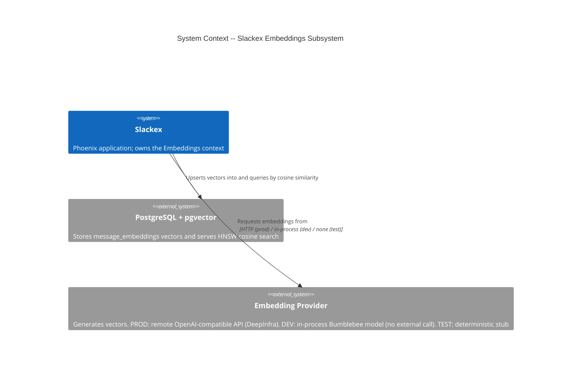
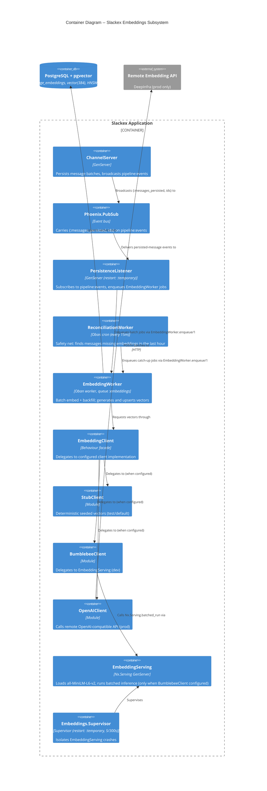
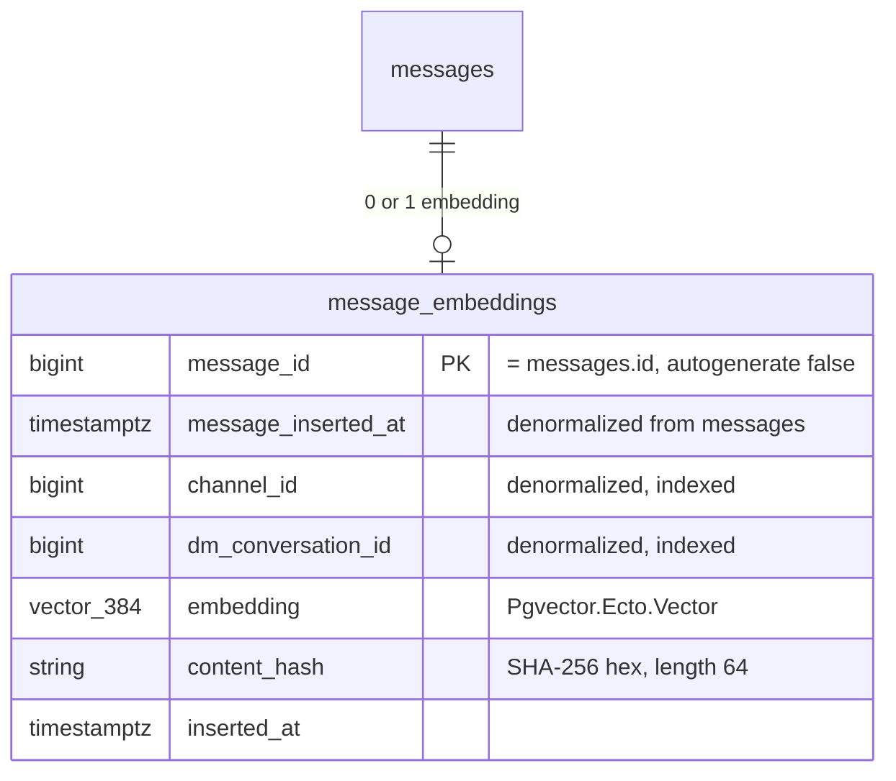
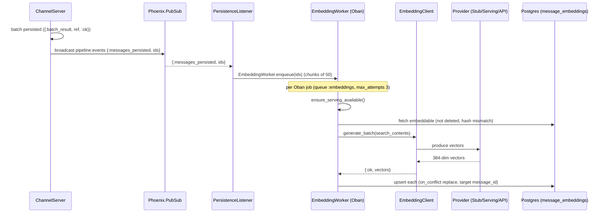
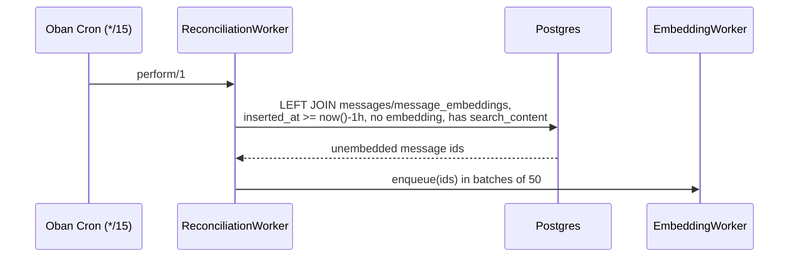

# Embeddings Subsystem Architecture

**Status:** Reference
**Zoom level:** L1 (subsystem)
**Scope:** `Slackex.Embeddings` context — embedding clients (Stub / Bumblebee / OpenAI-compatible), the persist → embed → store pipeline, the backfill task, pgvector storage at 384 dimensions, and OTP resilience.

---

## 1. Overview

The Embeddings subsystem turns message text into 384-dimensional vectors so that
`Slackex.Search` can rank messages by semantic similarity (cosine distance), and
so that `Slackex.Search.RAGContext` can pull relevant history into LLM prompts.

The subsystem is built around one deliberate decision: **embedding generation is
non-essential**. If it fails — provider down, model crash, listener restart —
chat keeps serving traffic and search degrades to full-text only. Nothing in the
embedding path is allowed to cascade into the application supervisor.

Three things follow from that decision and shape the whole design:

1. **A behaviour-based client abstraction** (`EmbeddingClient`) lets the actual
   generator be swapped per-environment by config alone. Dev runs a local
   Bumblebee model; production calls a remote API; tests use a deterministic stub.
2. **The generation work is asynchronous Oban jobs**, decoupled from the
   message send path via a PubSub bridge (`pipeline:events`). The send path never
   waits on embeddings.
3. **The local-model serving process is supervised with `restart: :temporary`**
   and only started when actually configured, so a model crash on one node never
   takes the node down.

The hot runtime path is:

1. `ChannelServer` persists a batch of messages, then broadcasts
   `{:messages_persisted, ids}` on `pipeline:events`.
2. `PersistenceListener` receives the broadcast and enqueues `EmbeddingWorker` jobs.
3. `EmbeddingWorker` fetches embeddable messages, calls the configured
   `EmbeddingClient`, and upserts vectors into the `message_embeddings` table.
4. A `ReconciliationWorker` cron job sweeps every 15 minutes to catch anything
   the listener missed (process restart, deployment, node down).

---

## 2. C4 Diagrams

### 2.1 System Context

The subsystem sits inside the Slackex application. Its only external dependency
is the embedding provider — and *which* provider is environment-dependent. In
production that is a remote OpenAI-compatible API (DeepInfra); in dev it is a
local model with no external call.

### 2.2 Container Diagram

---

## 3. How To Read This Document

- Start with the **System Context** to see the one external dependency and how it
  changes per environment.
- Use the **Container Diagram** to see the producer → consumer chain:
  `ChannelServer` → PubSub → `PersistenceListener` → `EmbeddingWorker` → Postgres.
- Use the **Client Selection** section (§5) to understand why there are three
  client implementations and which one runs where.
- Use the **sequence diagrams** (§7) for runtime ordering, including the snooze /
  reconciliation behaviour that makes the pipeline self-healing.
- Use **Failure Modes & Resilience** (§9) to understand blast radius and why
  nothing here can take the app down.

### Terms Used Here

| Term | Meaning |
|---|---|
| Embedding | A 384-element float vector representing a message's `search_content` |
| Client | An `EmbeddingClient` behaviour implementation (Stub / Bumblebee / OpenAI) |
| Serving | The `Nx.Serving` process that runs local Bumblebee inference |
| Backfill | A bulk job that embeds all unembedded messages for a channel or DM |
| Reconciliation | The cron sweep that catches messages the listener missed |
| `content_hash` | SHA-256 of `search_content`; detects when a message needs re-embedding |

---

## 4. Main Components

| Component | Responsibility |
|---|---|
| `Slackex.Embeddings.EmbeddingClient` | Behaviour + delegation facade; reads `:embedding_client` config and forwards `generate/1`, `generate_batch/1`, `dimensions/0` |
| `Slackex.Embeddings.StubClient` | Deterministic seeded vectors (384-dim); no I/O. Default + test |
| `Slackex.Embeddings.BumblebeeClient` | Wraps `EmbeddingServing`; returns 384-dim vectors from a local model. Dev |
| `Slackex.Embeddings.OpenAIClient` | Calls a remote OpenAI-compatible embeddings API via `Req`. Prod |
| `Slackex.Embeddings.EmbeddingServing` | `Nx.Serving` GenServer; loads `all-MiniLM-L6-v2`, runs batched inference |
| `Slackex.Embeddings.Supervisor` | Dedicated supervisor for `EmbeddingServing` (restart budget 5/300s) |
| `Slackex.Embeddings.PersistenceListener` | Subscribes to `pipeline:events`, enqueues `EmbeddingWorker` jobs |
| `Slackex.Embeddings.EmbeddingWorker` | Oban worker: batch embed + channel/DM backfill; upserts vectors |
| `Slackex.Embeddings.ReconciliationWorker` | Oban cron (every 15m): finds and enqueues missed messages |
| `Slackex.Embeddings.MessageEmbedding` | Ecto schema for the `message_embeddings` table |

The context module `Slackex.Embeddings` declares a `Boundary` with
`deps: [Slackex.Chat]` and explicit exports, so the rest of the app may only
reach these public modules (`lib/slackex/embeddings/embeddings.ex`). RAG
formatting lives on the consumer side as `Slackex.Search.RAGContext` — moving
it there (slackex-n3c) broke a `Search <-> Embeddings` dependency cycle.

---

## 5. Client Selection: Three Implementations, One Behaviour

`EmbeddingClient` defines a three-callback behaviour and delegates each call to
`Application.get_env(:slackex, :embedding_client)`
(`lib/slackex/embeddings/embedding_client.ex`). Swapping providers is a config
change, not a code change — the worker, listener, and search code never name a
concrete client.

| Environment | Configured client | Where the work happens | Source |
|---|---|---|---|
| default (`config.exs`) | `StubClient` | in-process, deterministic | `config/config.exs:119` |
| dev (`dev.exs`) | `BumblebeeClient` | local CPU EXLA inference | `config/dev.exs:117` |
| test (`test.exs`) | `StubClient` | in-process, deterministic | `config/test.exs:80` |
| **prod (`prod.exs`)** | **`OpenAIClient`** | **remote API (DeepInfra)** | `config/prod.exs:26` |

### 5.1 Why production uses a remote API, not the local model

This is the central, non-obvious decision. Production runs the *same model*
(`sentence-transformers/all-MiniLM-L6-v2`, 384-dim) as dev — but reaches it over
HTTP rather than loading it in-process. The reason is infrastructure, not
quality:

- **GPU is off-limits in production.** The prod Docker host is an unprivileged
  LXC on a mini-PC with a flaky GPU. EXLA GPU access has crashed the physical
  Proxmox host. GPU workloads are never enabled in prod config (and
  `EXLA_TARGET=host` is pinned at *compile time* in the Dockerfile, because the
  NIF probes the GPU on BEAM module load regardless of whether Bumblebee is used).
- **CPU EXLA OOMs the LXC.** Even CPU-only local inference of the model exhausts
  the ~20 GB LXC memory.
- **Therefore prod offloads generation to a remote API.** `OpenAIClient` points
  at DeepInfra and gets identical 384-dim vectors with no EXLA, no GPU, and no
  local memory pressure (`config/prod.exs:23-26`).

> **Historical note:** an earlier prod attempt activated `BumblebeeClient`
> in-process and triggered the v0.5.36–v0.5.43 cascade outage (see §10). After
> that incident prod ran `StubClient` as a stopgap, then moved to the remote
> `OpenAIClient` so production keeps *real* semantic search without local
> inference. Older project notes that say "StubClient in prod" are stale.

### 5.2 Client behaviour details

- **StubClient** seeds `:rand` with `:erlang.phash2(text)` and L2-normalizes the
  result, so the same input always yields the same unit vector. No network, no
  process to crash (`lib/slackex/embeddings/stub_client.ex`).
- **BumblebeeClient** delegates to `EmbeddingServing.run/1` inside a `safe_run/1`
  wrapper that catches both exceptions and `:exit`, returning
  `{:error, {:serving_error, msg}}` or `{:error, {:serving_not_running, reason}}`
  rather than crashing the caller
  (`lib/slackex/embeddings/bumblebee_client.ex`).
- **OpenAIClient** enforces a max batch of 100, sorts response vectors by the
  `index` field to preserve input order, and emits a
  `[:slackex, :ai, :embedding]` telemetry event with duration, token usage, and
  batch size (`lib/slackex/embeddings/openai_client.ex`).

### 5.3 Dimensionality (384) and a configuration sharp edge

The `message_embeddings.embedding` column is `vector(384)`, so every client must
produce 384-dim vectors. `StubClient` and `BumblebeeClient` hard-code
`@dimensions 384`. `OpenAIClient` is the exception: its compiled-in defaults are
`text-embedding-3-small` at **1536** dimensions. Production only gets 384 because
`runtime.exs` sets `:embedding_api` (model `all-MiniLM-L6-v2`,
`EMBEDDING_DIMENSIONS` defaulting to `"384"`) **when `EMBEDDING_API_KEY` is
present** (`config/runtime.exs:127-140`). If that env var is unset in prod,
`OpenAIClient.dimensions/0` falls back to 1536 and any 1536-dim vector would fail
to insert into the `vector(384)` column. **Prod must set `EMBEDDING_API_KEY`** (and,
for non-default providers, `EMBEDDING_MODEL` / `EMBEDDING_DIMENSIONS`).

---

## 6. Data Model

The subsystem owns one table, `message_embeddings`
(`lib/slackex/embeddings/message_embedding.ex`,
`priv/repo/migrations/20260303185600_create_message_embeddings.exs`,
`priv/repo/migrations/20260304000000_resize_embeddings_to_384.exs`).

Design points and the reasoning behind them:

- **Primary key is `message_id`** (not an autogenerated id): each message has at
  most one embedding, so the message id *is* the identity. This is also what
  makes the upsert one-to-one.
- **`content_hash`** is the SHA-256 hex digest of `search_content`. The worker
  re-embeds only when the stored hash differs from the current content hash, so
  an edited message gets a fresh vector and an unchanged message is skipped
  (`embedding_worker.ex` `fetch_embeddable_messages/1` and `compute_content_hash/1`).
- **`channel_id` / `dm_conversation_id` are denormalized** so backfill and
  scoped queries don't need to join back to `messages`. Both are indexed.
- **`message_inserted_at` is denormalized** from `messages`. The `messages` table
  is partitioned by insertion time, so carrying the timestamp here lets vector
  rows be filtered/joined without forcing a partition scan on the parent table.
- **HNSW index** (`idx_embeddings_hnsw`, `vector_cosine_ops`,
  `m = 16, ef_construction = 64`) gives approximate nearest-neighbour cosine
  search. The resize migration drops and recreates this index because the
  column type changed from `vector(1536)` to `vector(384)`.

Embeddings are **immutable by row**: the worker upserts with
`on_conflict: {:replace, [:embedding, :content_hash, :inserted_at]}, conflict_target: :message_id`
(`embedding_worker.ex:186-189`). Because this is an explicit `{:replace, ...}`
(not `on_conflict: :nothing`), there is no nil-id ghost-struct to handle here —
the conflict path returns the replaced row, not a phantom struct.

---

## 7. Runtime Flows

### 7.1 Persist → embed → store (the normal path)

Notes:

- `enqueue/1` chunks message IDs into batches of 50 and inserts one Oban job per
  batch at priority 3 (`embedding_worker.ex:44-55`).
- `ensure_serving_available/0` only matters when `BumblebeeClient` is configured.
  If the `EmbeddingServing` process is not running, the job returns `{:snooze, 30}`
  — it reschedules in 30s without consuming an attempt, so a slow-loading or
  crashed model never burns the retry budget (`embedding_worker.ex:116-131`).
- Generation failure returns `{:error, reason}` (logged), which propagates to
  Oban so the job retries with backoff. The return value is **never** discarded —
  this is the rule that the v0.5.36 outage was caused by violating.

### 7.2 Reconciliation safety net

The reconciliation sweep runs every 15 minutes (cron schedule at
`config/config.exs:81`) with a **1-hour lookback**
(`@lookback_window_seconds 3_600` in `reconciliation_worker.ex`). It exists because the
`pipeline:events` → `PersistenceListener` bridge is fire-and-forget: if the
listener is down during a broadcast (restart, deploy, node failure), that event
is simply missed. The cron catches those messages within 15 minutes. The
trade-off is explicit: messages older than an hour that were missed will not be
back-filled by this sweep (a one-off `enqueue_backfill/1` job can cover those).

### 7.3 Backfill

`EmbeddingWorker.enqueue_backfill(channel_id: id)` (or `dm_conversation_id:`)
inserts a single job, made unique per scope for a 1-hour window so concurrent
requests don't stack up (`embedding_worker.ex:62-85`). The job streams *all*
unembedded messages for that scope, processes them in batches of 50, and sleeps
1 second between batches to avoid saturating the `:embeddings` queue and the
provider. Backfill is best-effort: a failing batch is logged and the stream
continues rather than aborting the whole backfill
(`embedding_worker.ex:222-238`).

---

## 8. Key Design Properties

- **Config-only provider swap.** Every consumer talks to the `EmbeddingClient`
  facade; the concrete client is chosen by `:embedding_client` config per env.
- **Non-essential by construction.** Generation is async Oban work behind a
  PubSub bridge; the chat send path never blocks on it.
- **Same model, different transport.** Dev (local Bumblebee) and prod (remote
  API) use `all-MiniLM-L6-v2` at 384-dim — search quality is consistent across
  environments without running the model on prod hardware.
- **Self-healing.** Snooze-on-missing-serving plus the 15-minute reconciliation
  sweep mean transient failures recover without manual intervention.
- **Idempotent, content-addressed writes.** `content_hash` skips unchanged
  messages and re-embeds edited ones; the upsert replaces by `message_id`.
- **Loud failures.** Generation errors are logged and propagated to Oban for
  retry; nothing is swallowed.

---

## 9. Failure Modes & Resilience

The governing rule (project CLAUDE.md, "Production Resilience"): a crash in
embeddings must not propagate to unrelated subsystems. The spine of that
guarantee is `restart: :temporary` on the non-essential processes, plus the
reconciliation safety net.

| Failure | Detection | Response | Blast radius |
|---|---|---|---|
| `EmbeddingServing` crash (Bumblebee/dev) | `Embeddings.Supervisor` restarts it (`one_for_one`, 5/300s); `BumblebeeClient.safe_run/1` catches `:exit` | If budget exhausted the supervisor dies, but it is started `restart: :temporary` from the app supervisor — **not** restarted | App keeps serving; embeddings stop until next deploy/restart |
| `EmbeddingServing` not yet ready | `ensure_serving_available/0` sees `Process.whereis == nil` | Job returns `{:snooze, 30}` — reschedules without burning an attempt | None; jobs wait, no hammering |
| Remote API error / timeout (prod) | `OpenAIClient` returns `{:api_error, ...}` / `{:network_error, ...}` | Worker logs + returns `{:error, ...}`; Oban retries with backoff (max 3 attempts) | That batch's messages stay unembedded until retry/reconciliation |
| `PersistenceListener` down during broadcast | No subscriber receives the fire-and-forget event | `ReconciliationWorker` (every 15m, 1h lookback) re-enqueues missed messages | Up to ~15-minute delay for affected messages |
| `PersistenceListener` repeatedly crashing | Supervisor would normally restart it | Started `restart: :temporary` so repeated crashes can't exhaust the **root** supervisor budget and take down the app | App unaffected; ReconciliationWorker covers gaps |
| DB unavailable during upsert | Query raises in `perform/1` | Exception propagates to Oban; retried with backoff | Job-local; consistent with rest of app |
| Backfill batch failure | Logged inside `generate_and_persist_embeddings/1` | Stream continues with remaining batches (best-effort) | Only the failed batch's messages |

Two structural facts make this hold:

1. **`maybe_embedding_serving/1`** only adds `Embeddings.Supervisor` to the tree
   when `BumblebeeClient` is the configured client (`lib/slackex/application.ex:74-83`).
   In prod (OpenAIClient) and test (StubClient) the serving process — and its
   model memory — is never started.
2. **Both PubSub→Oban bridges are `restart: :temporary`** in the application
   children list (`application.ex:49-50`): `PersistenceListener` and
   `LinkPreviewListener`. The comment there is explicit — `:permanent` restart
   on a repeatedly-crashing listener would exhaust the root supervisor budget and
   take down the app; the listeners are non-essential and `ReconciliationWorker`
   is the durability safety net.

---

## 10. Incident Precedent (why the resilience exists)

The v0.5.36–v0.5.43 production outage is the reason for nearly every control in
§9. In-process `BumblebeeClient` was activated in prod, and:

- the worker swallowed errors (`_ = result; :ok`), so Oban never saw failures and
  never retried;
- there was no pre-flight serving check, so jobs hammered a dead serving process;
- the supervisor used `restart: :permanent`, so its repeated deaths exhausted the
  root supervisor budget and crashed the whole app;
- EXLA probed the GPU on NIF load and crashed the physical Proxmox host; CPU-only
  EXLA then OOMed the 20 GB LXC.

The fixes — error propagation to Oban, `{:snooze, 30}` pre-flight check,
`restart: :temporary` + 5/300s budget, conditional serving start, compile-time
`EXLA_TARGET=host`, and ultimately moving prod to a remote API — are all visible
in the current code described above. A deeper treatment of the supervision
reasoning, restart-budget maths, and recovery sequencing lives in the companion
deep-dive (see Related Documents).

---

## 11. Search & RAG Integration (boundary)

Embeddings *produces and stores* vectors; `Slackex.Search.MessageSearch` *queries*
them. The boundary is clean:

- `MessageSearch.semantic_search/3` runs pgvector cosine similarity against
  `message_embeddings` with a default similarity threshold of 0.3, enforcing
  authorization via **EXISTS subqueries** (not joins) to avoid row duplication
  that would corrupt ranking. `hybrid_search/3` fuses full-text and semantic
  results via Reciprocal Rank Fusion (`@rrf_k 60`)
  (`lib/slackex/search/message_search.ex`).
- `Slackex.Search.RAGContext.retrieve/2` calls **`semantic_search/3` only**
  (not hybrid), then formats the top results as `"[YYYY-MM-DD HH:MM] username:
  content"` lines, truncated to a token budget (default 4000 tokens, ~4
  chars/token) without cutting a line (`lib/slackex/search/rag_context.ex`).

The search UI itself is gated by the `:message_search` FunWithFlags flag
(`lib/slackex_web/live/chat_live/index.ex:128`). Ranking, fusion, and FTS detail
belong to the search documentation, not here.

---

## 12. Code Map

| File | Responsibility |
|---|---|
| `lib/slackex/embeddings/embeddings.ex` | Context module + `Boundary` definition and exports |
| `lib/slackex/embeddings/embedding_client.ex` | Behaviour + config-driven delegation facade |
| `lib/slackex/embeddings/stub_client.ex` | Deterministic seeded 384-dim client (default/test) |
| `lib/slackex/embeddings/bumblebee_client.ex` | Local-model client; safe-wraps `EmbeddingServing` (dev) |
| `lib/slackex/embeddings/openai_client.ex` | Remote OpenAI-compatible API client + telemetry (prod) |
| `lib/slackex/embeddings/embedding_serving.ex` | `Nx.Serving` GenServer; loads `all-MiniLM-L6-v2` |
| `lib/slackex/embeddings/supervisor.ex` | Dedicated supervisor for serving (5/300s budget) |
| `lib/slackex/embeddings/persistence_listener.ex` | `pipeline:events` → `EmbeddingWorker` bridge |
| `lib/slackex/embeddings/embedding_worker.ex` | Oban worker: batch embed + backfill + upsert |
| `lib/slackex/embeddings/reconciliation_worker.ex` | Oban cron safety net for missed messages |
| `lib/slackex/embeddings/message_embedding.ex` | Ecto schema for `message_embeddings` |
| `lib/slackex/application.ex` | `maybe_embedding_serving/1`; listener supervision specs |
| `config/{config,dev,test,prod,runtime}.exs` | Per-env `:embedding_client` and `:embedding_api` |
| `priv/repo/migrations/20260303185600_create_message_embeddings.exs` | Initial table + HNSW index (1536-dim) |
| `priv/repo/migrations/20260304000000_resize_embeddings_to_384.exs` | Resize column + index to 384-dim |

---

## 13. Related Documents

- [`deep-dive-embedding-resilience.md`](deep-dive-embedding-resilience.md) — L2 deep dive into the embedding supervision tree, restart-budget reasoning, snooze/reconciliation recovery sequencing, and the v0.5.36 cascade post-mortem in OTP terms
- [`realtime-chat.md`](realtime-chat.md) — the `ChannelServer` → `BatchWriter` path that produces the `pipeline:events` broadcast this subsystem consumes
- [`../runbooks/observability.md`](../runbooks/observability.md) — metrics and traces, including the `[:slackex, :ai, :embedding]` telemetry event
- [`../research/embedding-provider-evaluation.md`](../research/embedding-provider-evaluation.md) — why prod moved to a remote provider instead of local inference
- [`../rca/2026-03-05-embedding-cascade-app-crash.md`](../rca/2026-03-05-embedding-cascade-app-crash.md) — root cause analysis of the v0.5.36–v0.5.43 outage
- [`../engineering-principles.md`](../engineering-principles.md) — cross-cutting deploy-safety, test-isolation, and production-hardening rules
