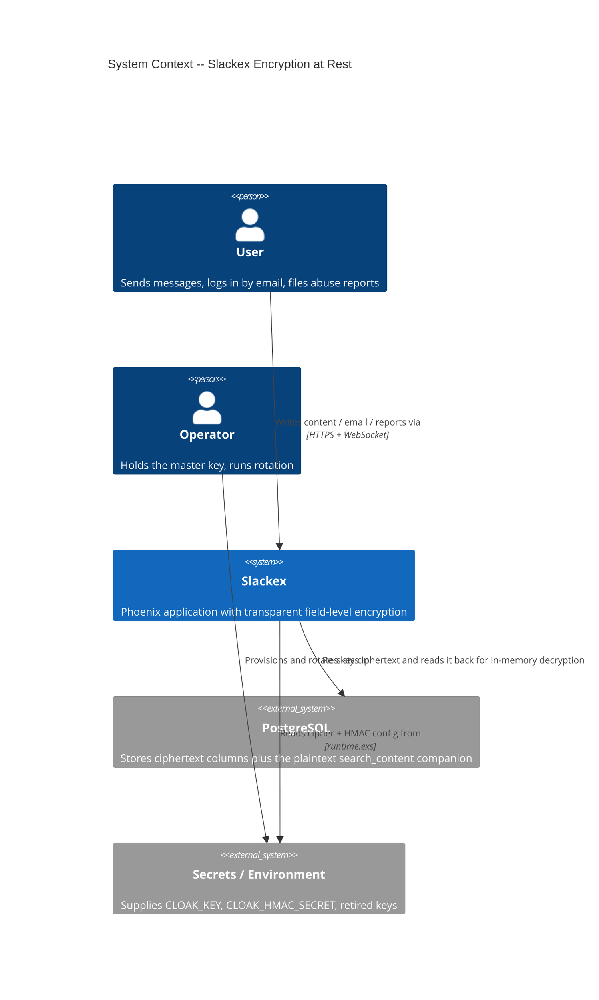
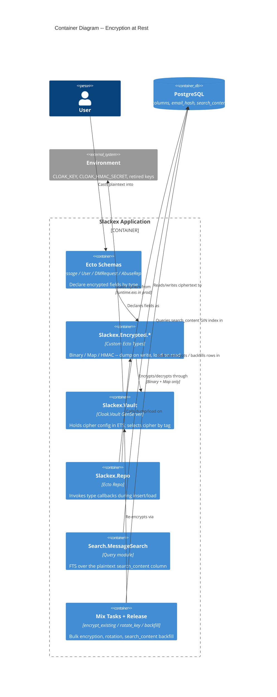
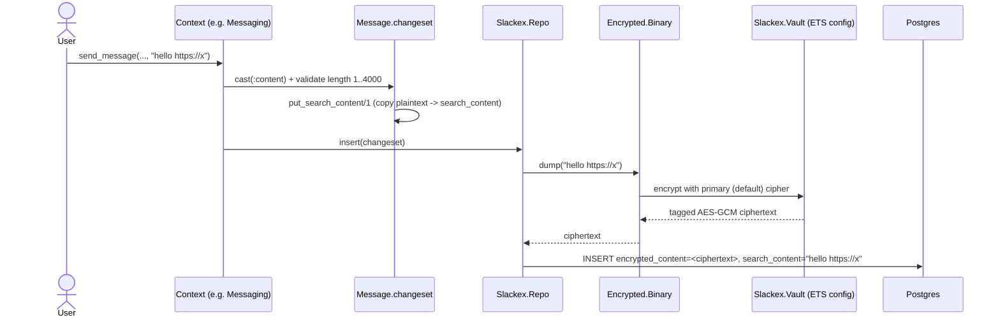
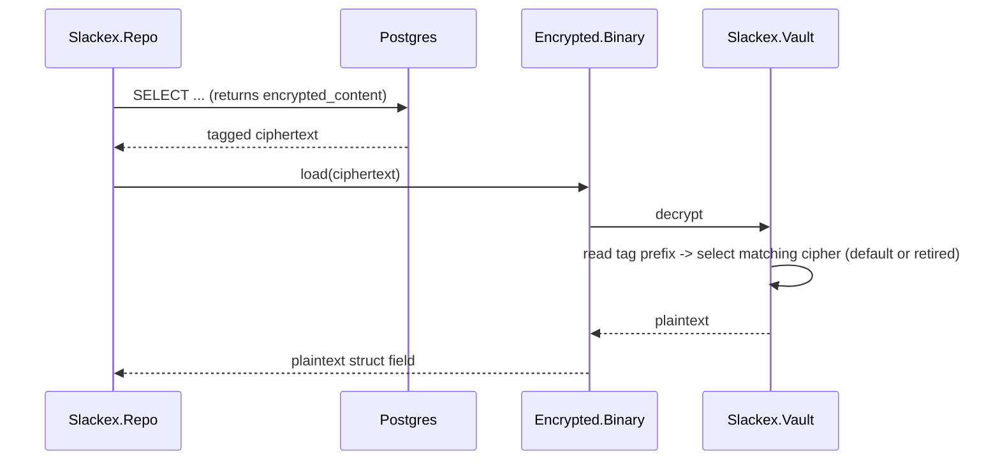
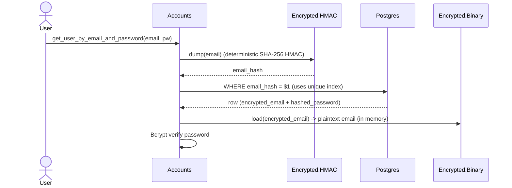
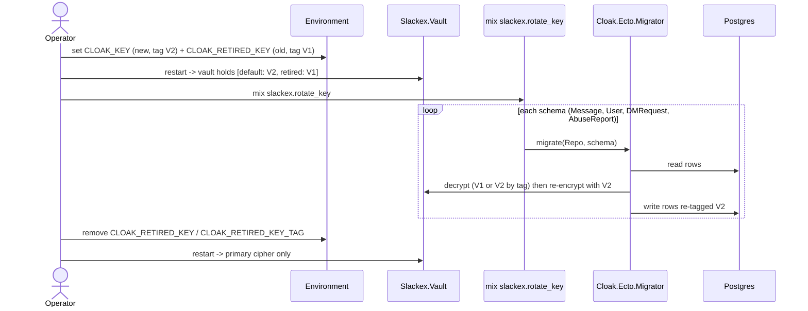
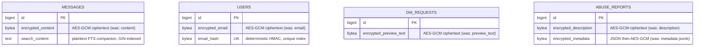

# Encryption at Rest Architecture

**Status:** Reference
**Scope:** `Slackex.Encrypted` Ecto types, the `Slackex.Vault` Cloak vault, key management and rotation, and the plaintext `search_content` companion pattern that reconciles encryption with full-text search

---

## 1. Overview

Slackex encrypts sensitive fields **at rest** using [Cloak](https://hex.pm/packages/cloak) and
[cloak_ecto](https://hex.pm/packages/cloak_ecto) with **AES-GCM-256** authenticated encryption. The
design goal is *transparent* field-level encryption: schemas declare a field with a custom Ecto type,
and Ecto encrypts on write (`dump`) and decrypts on read (`load`) with **zero changes to context
functions or query logic**. Plaintext exists only in application memory; the database stores ciphertext.

Four schemas carry encrypted fields:

| Schema | Encrypted field(s) | Type |
|---|---|---|
| `Slackex.Chat.Message` | `content` (→ `encrypted_content`) | `Slackex.Encrypted.Binary` |
| `Slackex.Accounts.User` | `email` (→ `encrypted_email`), `email_hash` | `Encrypted.Binary` + `Encrypted.HMAC` |
| `Slackex.Chat.DMRequest` | `preview_text` (→ `encrypted_preview_text`) | `Encrypted.Binary` |
| `Slackex.Chat.AbuseReport` | `description` (→ `encrypted_description`), `metadata` (→ `encrypted_metadata`) | `Encrypted.Binary` + `Encrypted.Map` |

The single hardest design tension is **encryption vs. search**: AES-GCM ciphertext is opaque and
non-deterministic, so PostgreSQL cannot index it, and equality queries on it are impossible. Slackex
resolves this in two different ways depending on the access pattern:

- **Full-text search over message content** → a plaintext **`search_content`** companion column, which
  carries a GIN index for `to_tsvector` matching while `content` stays encrypted.
- **Exact-match lookup by email** (login) → a deterministic **HMAC** hash column (`email_hash`), which
  is searchable by equality without revealing or decrypting the plaintext.

The rest of this document explains the components, the read/write/rotation flows, and where each claim
lives in the code.

---

## 2. C4 Diagrams

### 2.1 System Context



### 2.2 Container Diagram



> **Note:** `Slackex.Encrypted.HMAC` is configured directly via `otp_app: :slackex`
> (`config :slackex, Slackex.Encrypted.HMAC, ...`) and does **not** route through `Slackex.Vault`.
> Only `Encrypted.Binary` and `Encrypted.Map` bind to the vault. This is why the diagram draws the
> vault edge from the types boundary rather than from every field.

---

## 3. How To Read This Document

- Start with the **Container Diagram** to see the layering: schemas → custom Ecto types → vault → DB.
- Read **§5 Main Components** for the responsibility of each module and where its config comes from.
- Use the **sequence diagrams** (§6) for runtime behavior: encrypt-on-write, decrypt-on-read, email
  login via HMAC, and key rotation.
- Read **§7 The `search_content` Companion Pattern** for the encryption-vs-FTS reconciliation — the
  central non-obvious decision in this subsystem.
- Use **§8 Data Model**, **§9 Failure Modes**, and **§10 Code Map** as reference.

### Terms Used Here

| Term | Meaning |
|---|---|
| Cipher | An AES-GCM key plus a **tag**, registered with the vault |
| Tag | A binary prefix Cloak writes onto every ciphertext to identify which cipher decrypts it |
| Primary / default cipher | First cipher in the `:ciphers` list; encrypts all **new** writes |
| Retired cipher | An additional cipher kept only to **decrypt** legacy ciphertext during rotation |
| `search_content` | Plaintext companion column on `messages` enabling GIN/FTS indexing |
| HMAC hash | Deterministic SHA-256 HMAC of a plaintext, used for exact-match lookup (email) |

---

## 4. Public API & Transparency

Schemas opt into encryption purely declaratively. There are no encrypt/decrypt calls in business logic:

```elixir
# lib/slackex/chat/message.ex
field :content, Slackex.Encrypted.Binary, source: :encrypted_content
field :search_content, :string                       # plaintext FTS companion

# lib/slackex/accounts/user.ex
field :email, Slackex.Encrypted.Binary, source: :encrypted_email
field :email_hash, Slackex.Encrypted.HMAC            # deterministic search hash

# lib/slackex/chat/abuse_report.ex
field :description, Slackex.Encrypted.Binary, source: :encrypted_description
field :metadata, Slackex.Encrypted.Map, source: :encrypted_metadata
```

The `source:` option points the logical field name (`content`) at the physical ciphertext column
(`encrypted_content`). Application code reads and writes `message.content` as an ordinary string;
the type does the rest. Because the dump/load callbacks run inside Ecto's own pipeline, the same
contexts that existed before encryption (`Messaging.send_message/3`,
`Accounts.get_user_by_email_and_password/2`, abuse reporting) work unchanged.

---

## 5. Main Components

| Component | File | Responsibility |
|---|---|---|
| `Slackex.Vault` | `lib/slackex/vault.ex` | `Cloak.Vault` GenServer. Loads cipher config, caches it in an ETS table (`Slackex.Vault.Config`), and exposes `reconfigure/1` for runtime cipher swaps |
| `Slackex.Encrypted` | `lib/slackex/encrypted.ex` | Boundary module declaring the encrypted namespace and exporting `Binary`, `Map`, `HMAC` |
| `Slackex.Encrypted.Binary` | `lib/slackex/encrypted/binary.ex` | `use Cloak.Ecto.Binary, vault: Slackex.Vault` — encrypts string/binary fields |
| `Slackex.Encrypted.Map` | `lib/slackex/encrypted/map.ex` | `use Cloak.Ecto.Map, vault: Slackex.Vault` — JSON-serializes, then encrypts map fields |
| `Slackex.Encrypted.HMAC` | `lib/slackex/encrypted/hmac.ex` | `use Cloak.Ecto.HMAC, otp_app: :slackex` — deterministic SHA-256 HMAC for exact-match lookups |
| `Mix.Tasks.Slackex.EncryptExisting` | `lib/mix/tasks/slackex.encrypt_existing.ex` | One-time backfill: encrypts pre-existing plaintext into the new `encrypted_*` columns in 500-row batches |
| `Mix.Tasks.Slackex.RotateKey` | `lib/mix/tasks/slackex.rotate_key.ex` | Re-encrypts every row of every encrypted schema with the current primary cipher via `Cloak.Ecto.Migrator` |
| `Slackex.Release` | `lib/slackex/release.ex` | Hosts `do_backfill_search_content/1` (populates `search_content` from decrypted `content`) |
| `Slackex.Search.MessageSearch` | `lib/slackex/search/message_search.ex` | FTS over `search_content`; authorization via EXISTS subqueries |

### 5.1 Where configuration comes from

| Target | Cipher config | HMAC config |
|---|---|---|
| dev / test | Static base64 key in `config/config.exs` (`tag: "AES.GCM.V1"`) and `config/test.exs` | `config :slackex, Slackex.Encrypted.HMAC, algorithm: :sha256, secret: "dev-only-..."` in `config/config.exs` |
| prod | `config/runtime.exs` reads `CLOAK_KEY` (+ tag `CLOAK_KEY_TAG`, default `"AES.GCM.V1"`); optional `CLOAK_RETIRED_KEY` / `CLOAK_RETIRED_KEY_TAG` add a retired cipher | `CLOAK_HMAC_SECRET` (required; `runtime.exs` raises if missing) |

`config/runtime.exs` **raises** at boot if `CLOAK_KEY` or `CLOAK_HMAC_SECRET` is missing in prod — a
deliberate fail-fast so the app never starts in a state where it would write unreadable or unsearchable
data.

### 5.2 Vault startup ordering (the critical constraint)

`Slackex.Vault` is started **before** `Slackex.Repo` in the supervision tree
(`lib/slackex/application.ex`: `Slackex.Vault` then `Slackex.Repo`). This ordering matters because
Ecto's `dump`/`load` type callbacks consult the vault's cipher config during schema operations — if the
Repo started first and a query ran before the vault's ETS config existed, encryption would fail. The
supervisor strategy is `:one_for_one`.

---

## 6. Runtime Flows

### 6.1 Encrypt on write



The plaintext copied into `search_content` is set by `Message.changeset/2` (and `edit_changeset/2`) via
`put_search_content/1` *before* the type encrypts `content`. On delete, `delete_changeset/1` sets both
`content` and `search_content` to `nil`, so deleted message text leaves neither the ciphertext nor the
plaintext index.

### 6.2 Decrypt on read



Decryption is tag-driven: Cloak reads the tag prefix and picks the cipher whose tag matches. This is
what makes a retired cipher able to decrypt old ciphertext while the primary cipher encrypts new writes.

### 6.3 Email login via HMAC (exact-match without decryption)



AES-GCM is non-deterministic — encrypting the same email twice yields different ciphertext — so you
**cannot** query by `encrypted_email = $1`. The HMAC column gives a stable, non-reversible value that
*is* equality-searchable. `User.changeset` derives `email_hash` from the email via `put_email_hash/1`
and enforces `unique_constraint(:email_hash)`, backed by a real `unique_index(:users, [:email_hash])`
created in migration `20260227235000_add_encrypted_email_to_users.exs` (which also drops the old
plaintext-email unique index).

> **Limitation:** HMAC supports **equality only**. `LIKE`, prefix, range, or substring matching over
> encrypted fields is not possible with this scheme and is not implemented.

### 6.4 Key rotation



The full procedure is documented in the `Slackex.Vault` moduledoc. The retired cipher **must** keep the
tag the data was originally written with, or its ciphertext becomes undecodable.

---

## 7. The `search_content` Companion Pattern

This is the core reconciliation between encryption-at-rest and full-text search, and it is worth
understanding precisely because it is a deliberate, audited plaintext exposure.

**The problem.** `encrypted_content` holds AES-GCM ciphertext. PostgreSQL cannot build a `tsvector`
from ciphertext, and even if it could, the ciphertext is non-deterministic, so identical messages would
produce different vectors. Full-text search over encrypted content is therefore impossible directly.

**The mechanism.** Migration `20260303191200_add_fts_gin_index.exs` adds a plaintext `search_content`
`text` column and a GIN index on `to_tsvector('english', coalesce(search_content, ''))`, created with
`CREATE INDEX CONCURRENTLY` (no table lock, deploy-safe). The changeset copies plaintext into
`search_content` on every write. `Search.MessageSearch` runs its `text_search` against `search_content`,
e.g.:

```sql
to_tsvector('english', coalesce(search_content, '')) @@ plainto_tsquery('english', $1)
```

**The trade-off, stated honestly.** A plaintext copy of message text lives on disk in `search_content`,
defeating encryption-at-rest *for that column specifically*. The accepted reasoning:

- Encryption still protects against database-file / backup theft for every *other* encrypted field, and
  raw ciphertext in `encrypted_content` is meaningless without the key.
- FTS fundamentally requires plaintext to index — there is no GIN index over opaque bytes.
- Application-level authorization still gates *who can run a search* and *which messages match* — see
  below.
- Deleting a message nulls `search_content` (via `delete_changeset/1`), so deleted text is purged from
  the plaintext index too.

**Authorization uses EXISTS, not JOIN.** `Search.MessageSearch` enforces visibility with `EXISTS`
subqueries (public channel, channel membership, DM participation) rather than JOINs. The moduledoc and
the query fragments make this explicit — e.g.
`EXISTS (SELECT 1 FROM channels c WHERE c.id = ? AND c.is_private = false)`. A JOIN against membership
tables would duplicate a message row once per matching membership, corrupting `ts_rank` ordering and
pagination counts. EXISTS yields one row per message regardless of how many authorization paths match.

> Cross-link: the FTS column also feeds hybrid (RRF) and semantic search and the embedding pipeline.
> See `docs/architecture/embeddings.md` for how `search_content` is consumed downstream, and
> `docs/architecture/deep-dive-encrypted-fields-fts.md` for the detailed query-shaping,
> ranking, and partition-pruning mechanics that build on this column.

---

## 8. Data Model



### 8.1 Migration chronology (expand → contract, then FTS)

The encryption rollout and the FTS companion are **two separate episodes** a few days apart — they are
not the same expand/contract cycle:

| Date / migration | What it does |
|---|---|
| `20260227230900_add_encrypted_content_to_messages.exs` | **Expand**: add `encrypted_content` alongside `content` |
| `20260227235000_add_encrypted_email_to_users.exs` | **Expand**: add `encrypted_email` + `email_hash`; swap unique index from `email` → `email_hash` |
| `20260228000100_add_encrypted_fields_to_dm_requests_and_abuse_reports.exs` | **Expand**: add `encrypted_*` columns for DM requests and abuse reports |
| `mix slackex.encrypt_existing` (task, not a migration) | Backfill plaintext → `encrypted_*` columns (and `email_hash`) in 500-row batches |
| `20260228010000_drop_plaintext_columns.exs` | **Contract**: drop `content`, `email`, `preview_text`, `description`, `metadata` |
| `20260303191200_add_fts_gin_index.exs` (≈ a few days later) | Add `search_content` + GIN index for FTS |

The few-days gap has a real consequence: **`encrypt_existing` populates `encrypted_content` but not
`search_content`** (the column did not exist yet at 0228). That is why a *separate*
`do_backfill_search_content/1` exists in `Slackex.Release` — it reads each message's now-decrypted
`content` (via the Ecto type) and writes it into `search_content` for rows where it is still null. It is
invoked from `Slackex.Release.backfill_embeddings/1`, not from `Release.migrate/0`.

---

## 9. Failure Modes & Resilience

| Failure | Symptom | Mitigation / Recovery |
|---|---|---|
| Missing `CLOAK_KEY` in prod | App **refuses to boot** | Intentional `raise` in `config/runtime.exs`; set the env var. Fail-fast beats writing unreadable data |
| Missing `CLOAK_HMAC_SECRET` in prod | App **refuses to boot** | Intentional `raise` in `config/runtime.exs`; set the env var |
| HMAC secret changed | Existing `email_hash` values no longer match; logins by email fail | Treat the HMAC secret as permanent; rotating it requires recomputing all `email_hash` values |
| Retired cipher tag mismatch during rotation | Old ciphertext becomes undecodable | `CLOAK_RETIRED_KEY_TAG` must equal the tag used at original write time. Tests in `vault_key_rotation_test.exs` exercise the tag path |
| Removed retired key before running `rotate_key` | Data written under the old key is unreadable | Re-add both keys, run `mix slackex.rotate_key`, then remove the retired key |
| `search_content` left null | FTS returns no hits even though plaintext exists | Run `Slackex.Release.backfill_embeddings/1`, which calls `do_backfill_search_content/1` |

**Blast radius and vault behavior.** Cipher configuration is cached in an ETS table
(`Cloak.Vault.save_config(:"#{Slackex.Vault}.Config", config)`), so encryption/decryption reads
config from ETS rather than serializing every call through the GenServer mailbox. The vault is started
before the Repo under a `:one_for_one` supervisor; a vault restart re-saves its config. The grounded,
load-bearing guarantee is the **startup ordering** (vault before repo) — beyond that, this document does
not assert a specific crash-cascade behavior, because the supervisor is `:one_for_one` and no explicit
restart policy for the vault is configured in `application.ex`.

---

## 10. Code Map

| File | Responsibility |
|---|---|
| `lib/slackex/vault.ex` | Cloak vault GenServer, `reconfigure/1`, key-rotation moduledoc |
| `lib/slackex/encrypted.ex` | Boundary + namespace export |
| `lib/slackex/encrypted/binary.ex` | Encrypted string/binary Ecto type |
| `lib/slackex/encrypted/map.ex` | Encrypted JSON map Ecto type |
| `lib/slackex/encrypted/hmac.ex` | Deterministic HMAC Ecto type (otp_app config) |
| `lib/slackex/chat/message.ex` | `content` field + `put_search_content/1` + delete null-out |
| `lib/slackex/accounts/user.ex` | `email` + `email_hash` + `put_email_hash/1` |
| `lib/slackex/chat/dm_request.ex` | `preview_text` encrypted field |
| `lib/slackex/chat/abuse_report.ex` | `description` + `metadata` encrypted fields |
| `lib/slackex/search/message_search.ex` | FTS over `search_content`; EXISTS-based authorization |
| `lib/slackex/release.ex` | `do_backfill_search_content/1` via `backfill_embeddings/1` |
| `lib/mix/tasks/slackex.encrypt_existing.ex` | Batched plaintext → ciphertext backfill |
| `lib/mix/tasks/slackex.rotate_key.ex` | Re-encrypt all schemas with current primary cipher |
| `config/config.exs` | Dev/test static cipher + HMAC secret |
| `config/runtime.exs` | Prod cipher (+ retired) and HMAC secret from env, with fail-fast raises |
| `priv/repo/migrations/2026022*` , `20260303191200_*` | Expand/contract + FTS GIN index migrations |

---

## 11. Related Documents

- `docs/architecture/deep-dive-encrypted-fields-fts.md` — companion deep dive: detailed FTS query shaping, RRF hybrid ranking, EXISTS authorization, and partition-pruning mechanics over `search_content`
- `docs/architecture/realtime-chat.md` — the send/persist pipeline that writes `encrypted_content` and `search_content`
- `docs/architecture/embeddings.md` — how `search_content` feeds the embedding and semantic-search pipeline
- `docs/architecture/threads-and-reactions.md` — sibling message-domain subsystem
- `docs/feature/encryption-at-rest/roadmap.yaml` — feature roadmap and step breakdown
- `docs/evolution/2026-02-28-encryption-at-rest.md` — implementation evolution and lessons learned
- `docs/engineering-principles.md` — deploy-safe migrations (expand/contract), test isolation, production hardening
