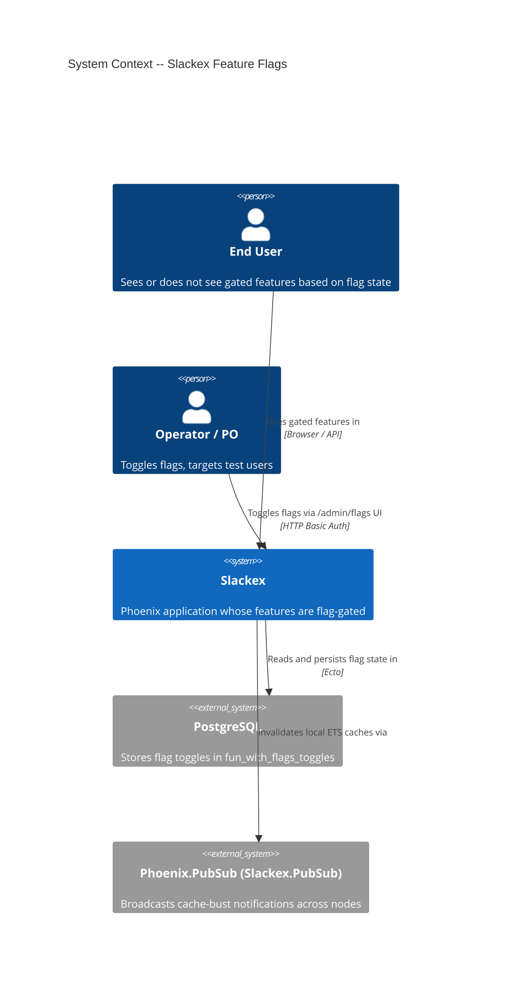
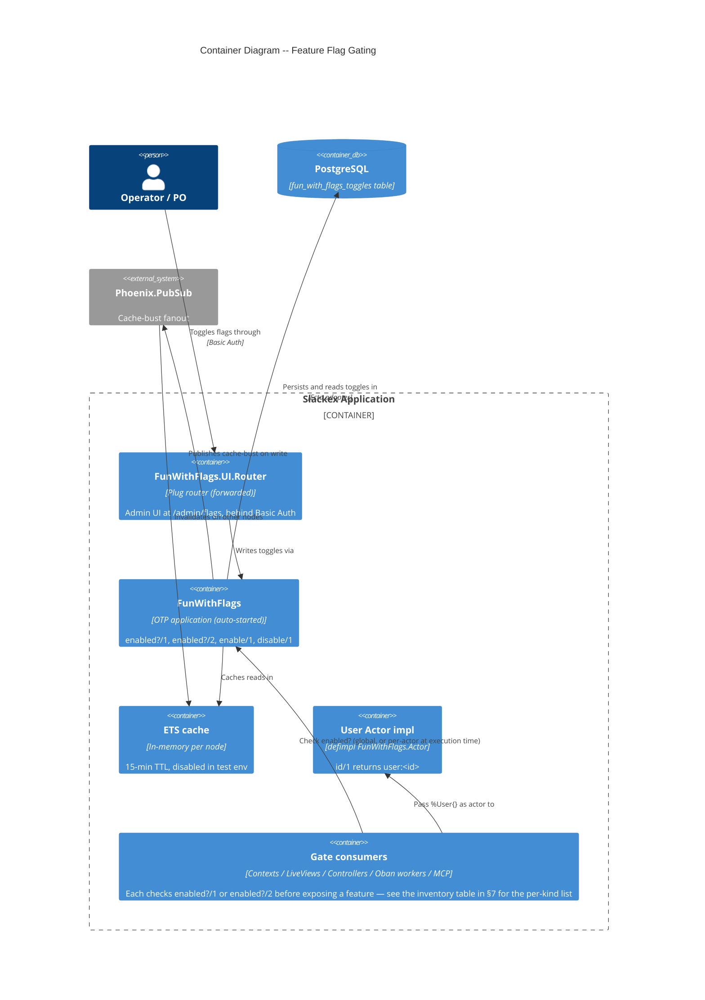
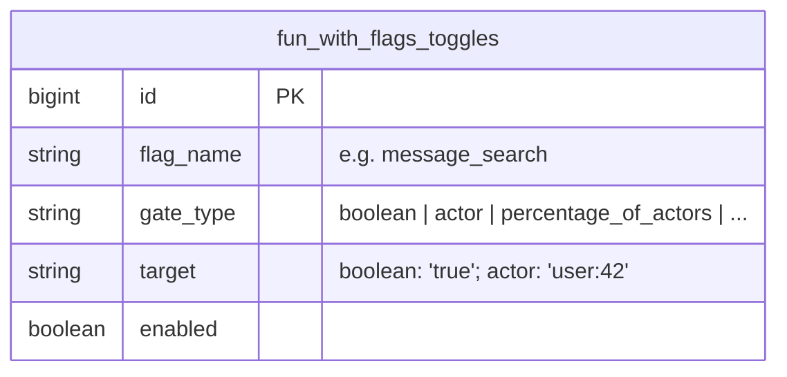
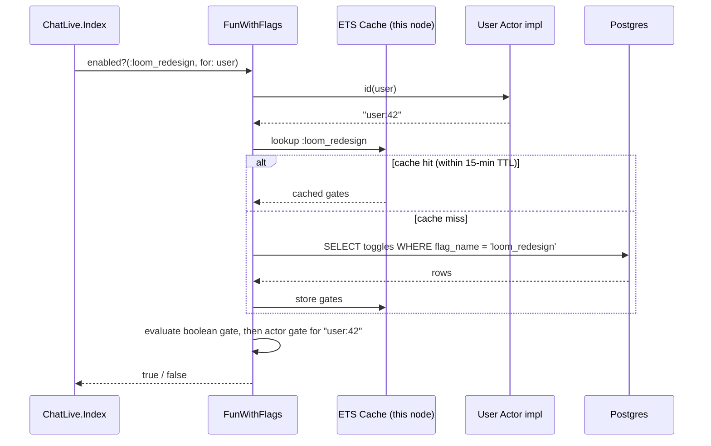
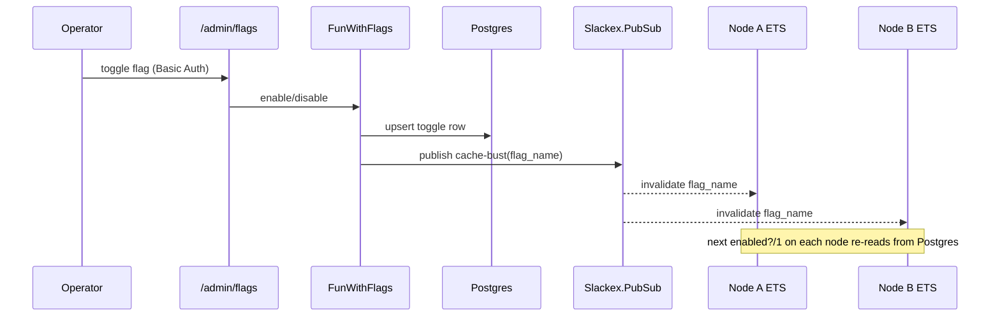
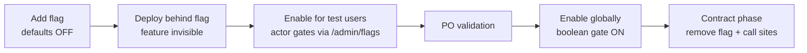

# Feature Flags & Lifecycle

**Status:** Reference
**Scope:** The FunWithFlags-based feature flag system — how flags gate context modules, LiveView surfaces, controllers, workers, and the MCP tool list; the add → roll out → clean up lifecycle; the `/new-feature` scaffold; and the current inventory of known flags.

---

## 1. Overview

Slackex hides every new user-facing feature behind a [FunWithFlags](https://hexdocs.pm/fun_with_flags) flag until a product owner approves it. The principle is **invisible-by-default**: a feature can ship to production, sit dormant behind an off flag, and be switched on for a handful of test users before going wide — all without a redeploy.

The flag system is deliberately thin. There is no Slackex wrapper module; call sites invoke `FunWithFlags.enabled?/1` (global gates) or `FunWithFlags.enabled?/2` with `for: user` (per-actor gates) directly. That keeps flags cheap to add and removes any temptation to build flag dependencies or a bespoke flag DSL. The cost is discipline: because there is no central registry, the *only* authoritative inventory of which flags exist is the set of call sites in the code, plus whatever rows an operator has created in the database.

Flags gate features at whatever layer is the real authority for that feature:

- **Context / business logic** — `Slackex.Search.search_messages/3` returns `{:error, :feature_disabled}` when `:message_search` is off.
- **LiveView** — `ChatLive.Index` assigns booleans (`:search_enabled`, `:summarization_enabled`) that the template branches on; `SousLive.InService` redirects on mount.
- **Controllers** — `WebhookController` returns `404` when `:incoming_webhooks` is off.
- **Background workers** — `PushWorker.perform/1` returns `:ok` (no-op, no Oban retry) when `:push_notifications` is off.
- **MCP tool surface** — the MCP server omits factory tools from `tools/list` unless `:dark_factory` is enabled.

There is **no router-level pipeline that gates feature routes by flag.** The only flag-related router code is HTTP Basic Auth protecting the flag *admin UI* itself. Feature route protection happens one layer in — at LiveView mount or in the controller action.

---

## 2. C4 Diagrams

### 2.1 System Context



### 2.2 Container Diagram



These diagrams show the system at a higher level than the sequence diagrams below.

---

## 3. How To Read This Document

- Start with the **System Context** diagram to see who toggles flags and which external systems back the flag store.
- Move to the **Container Diagram** to see which kinds of modules check flags and how a write propagates to every node.
- Use the **sequence diagrams** to follow runtime behavior: how a per-user check resolves, and how a toggle invalidates caches across the cluster.
- Use the **inventory table** (§7) as the authoritative list of which flags exist and where each is enforced.
- Use the **lifecycle** section (§8) and the **scaffold** section (§9) when adding or retiring a flag.

### Quick Legend

| Diagram Type | Best For | Read It As |
|---|---|---|
| C4 System Context | System boundaries | Who toggles flags and what stores them |
| C4 Container | Internal architecture | Which module kinds gate features and how state propagates |
| Sequence Diagram | Request/event flow | Time-ordered check and cache-bust interactions |

### Terms Used Here

| Term | Meaning |
|---|---|
| Flag | A named boolean feature toggle, referenced as an atom such as `:message_search` |
| Gate | A condition FunWithFlags evaluates — a **boolean gate** (global) or an **actor gate** (per-user) |
| Actor | An entity targetable by an actor gate; here a `Slackex.Accounts.User` via its `FunWithFlags.Actor` impl |
| Global gate | A flag checked with `FunWithFlags.enabled?(flag)` — on or off for everyone |
| Per-actor gate | A flag checked with `FunWithFlags.enabled?(flag, for: user)` — targetable per user |
| Cache-bust | The PubSub notification that clears stale ETS flag values on every node after a write |
| Contract phase | The lifecycle step where a globally-enabled flag and its call sites are removed |

---

## 4. Main Components

| Component | Responsibility |
|---|---|
| `FunWithFlags` (library) | Public API: `enabled?/1`, `enabled?/2`, `enable/1`, `disable/1`. Auto-starts as an OTP application |
| `FunWithFlags.Store.Persistent.Ecto` | Persistence adapter; reads/writes flag state through `Slackex.Repo` |
| `FunWithFlags.Notifications.PhoenixPubSub` | Cache-bust adapter; broadcasts invalidations over `Slackex.PubSub` |
| `FunWithFlags.UI.Router` | Community admin UI, forwarded at `/admin/flags` |
| `Slackex.Accounts.User` actor impl | `lib/slackex/accounts/user_flags_actor.ex` — maps a `%User{}` to the actor id `"user:#{id}"` for per-actor gates |
| `fun_with_flags_toggles` table | Single backing table; rows are `(flag_name, gate_type, target, enabled)` |

FunWithFlags is **not** listed in `lib/slackex/application.ex`. It boots as an OTP application dependency before `Slackex.Application`. The supervision tree carries a comment confirming this is intentional: its Ecto adapter queries are lazy, so the `Repo` (started inside `Slackex.Application`) is up before any flag is read. Adding `FunWithFlags.Supervisor` to the tree manually would double-start it; the `/new-feature` scaffold calls this out explicitly.

---

## 5. Data Model

FunWithFlags owns exactly one table, created in `priv/repo/migrations/20260303004525_create_fun_with_flags_toggles.exs`:



Notes on the schema:

- The unique index on `(flag_name, gate_type, target)` is what makes a toggle atomic. A global on/off is a single `boolean` row; a per-user gate is one `actor` row per targeted user (`target = "user:42"`).
- There is no schema migration when you add a *new flag* — a flag is just data. New rows appear when an operator enables something through the admin UI or when test/dev code calls `FunWithFlags.enable/1`.
- The `target` column for actor gates is exactly the string returned by the `User` actor impl, `"user:#{id}"`. Per-user targeting only works because that impl exists; without it, a `%User{}` could not be a gate target.

---

## 6. Runtime Flows

### 6.1 Per-actor flag check



A per-actor check evaluates the global boolean gate **and** the actor gate. A user sees the feature if the flag is on globally *or* their specific actor gate is enabled — this is what makes gradual per-user rollout possible without flipping the global switch.

### 6.2 Toggle and multi-node cache-bust



Slackex runs multi-node in production (libcluster + Horde). Each node holds an independent ETS cache, so a toggle on one node must invalidate the others. That is the job of the `FunWithFlags.Notifications.PhoenixPubSub` adapter wired to `Slackex.PubSub` in `config/config.exs`. PostgreSQL is the single source of truth; the cache (15-min TTL, `config :fun_with_flags, :cache, enabled: true, ttl: 900`) is an optimization, and the PubSub bust keeps it from going stale for up to the TTL after a change.

---

## 7. Flag Inventory

Every entry below is grounded in a live `FunWithFlags.enabled?` call site. This is the authoritative inventory — there is no central registry module, so the call sites *are* the registry.

| Flag | Scope | Purpose | Enforced at |
|---|---|---|---|
| `:message_search` | Global | FTS + semantic + hybrid message search | `lib/slackex/search.ex:33`; UI assign `ChatLive.Index` (`:search_enabled`) |
| `:channel_summarization` | Global | AI channel summaries | `ChatLive.Index` (`:summarization_enabled`) |
| `:incoming_webhooks` | Global | Inbound webhook delivery endpoint | `lib/slackex_web/controllers/webhook_controller.ex:61` |
| `:push_notifications` | Global | Web-push dispatch + notif preferences | `push_worker.ex:28,36`; `subscription_cleanup_worker.ex:17`; `ChatLive.Index`; `conversations.ex:44` |
| `:catchup_on_reconnect` | Global | Rebuild unread state on reconnect | `lib/slackex_web/live/chat_live/index.ex:63` |
| `:website_analytics` | Global | Page-view / event tracking pipeline | `analytics.ex:47`; `analytics_plug.ex:11`; `analytics_tracker.ex:11`; `metrics_bridge.ex:12`; `telemetry_handler.ex:27,49`; `AdminLive.Analytics:15`; chat layout data attr |
| `:exclude_from_analytics` | Per-actor | Per-user analytics opt-out | `lib/slackex/analytics.ex:54` |
| `:dark_factory` | Global | Claude Code dark-factory MCP tools + channel notifier | `mcp/server.ex:111,124`; `factory/channel_notifier.ex:30`; `factory/lifecycle_worker.ex:14` |
| `:sous` | Per-actor | In-Service board (`/in-service`) | `sidebar_component.ex:78`; `in_service.ex:34`; `index.ex:360,1507` |
| `:loom_redesign` | Mixed (see below) | Warm-charcoal + gold UI restyle | `index.ex:126` (per-actor); `page_controller.ex:9`, `login.ex:12`, `register.ex:14` (global) |

### 7.1 `:loom_redesign` — pre-auth surfaces use the global gate

`:loom_redesign` is checked **per-actor** inside `ChatLive.Index` (`for: user`) but with the **bare global** form in `page_controller.ex`, `login.ex`, and `register.ex`. This is deliberate, not a mistake: login, register, and the public landing page run *before authentication*, so there is no `%User{}` actor to pass. Pre-auth surfaces therefore fall back to the global gate; authenticated surfaces use per-actor targeting. The pattern generalizes — any flag that needs to affect a pre-auth screen must rely on its global gate there.

### 7.2 `:markdown_rendering` — designed but never wired

`CLAUDE.md` and project memory describe markdown as "feature-flagged `:markdown_rendering`". **No such gate exists in code.** A repo-wide search finds `:markdown_rendering` only in design documents (`docs/feature/markdown-rendering/design/`, the deliver roadmap, the incoming-webhooks and Sous specs) — never in any `.ex`, `.exs`, config, seed, or migration. Every render surface calls `Slackex.Markdown.to_html/1` unconditionally; the Scrubber is always active.

The design (ADR-002) specified the flag as a kill switch — Scrubber when on, HEEx auto-escaping when off — plus an acceptance test toggling it off and asserting a stored `<script>` is escaped. Neither the dispatch nor that test was built. The code is therefore *more* conservative than the design (the Scrubber is never bypassed), but the documented kill switch does not exist. This is the cleanest illustration in the codebase of a flag that was promised by a spec and never implemented — the inverse failure of the lifecycle in §8. See `content-and-markdown.md` §8 for the full divergence record.

---

## 8. Flag Lifecycle

The intended path for a flag, mirrored in the evolution-doc stub the `/new-feature` scaffold writes:



1. **Add (off).** A new flag is referenced by atom at its gate sites. It defaults to off because no row exists for it yet — an unknown flag reads as disabled. No migration is required.
2. **Deploy.** The feature ships invisible. Because gates exist at the *authority* layer (context, controller, mount), there is no exposed surface even if a template check is missed.
3. **Roll out.** An operator enables the flag for specific users through `/admin/flags`, creating per-actor rows. Per-actor gating is only available for flags whose subject is a `%User{}` (`:sous`, `:exclude_from_analytics`, `:loom_redesign` on authed surfaces).
4. **Validate, then go wide.** After PO sign-off, flip the global boolean gate on.
5. **Contract.** Once a flag has been globally enabled for more than a release cycle, the scaffold mandates removing it — delete the call sites, then the toggle rows. Leaving permanently-on flags in the code is treated as debt.

The lifecycle has two opposite failure modes, both visible in this codebase:

- **Never contracted:** flags that have been on for ages but still litter the call sites (the scaffold's rule against this is the corrective).
- **Never expanded:** `:markdown_rendering` (§7.2) — a flag the spec promised that was never wired in. The mitigation is the project rule that PubSub-bridge / cross-context features need an integration test exercising the *real* path, not a faked one.

---

## 9. The `/new-feature` Scaffold

The `/new-feature` command (`.claude/commands/new-feature.md`) enforces the add step so nothing ships exposed. Its required outputs:

1. **A snake_case flag atom**, one per feature, no reuse of an existing flag.
2. **A context guard** at the public API boundary — `lib/slackex/<context>/<context>.ex`, not deep in an internal module:
   ```elixir
   def some_action(user, params) do
     if FunWithFlags.enabled?(:your_flag, for: user) do
       # new behaviour
     else
       {:error, :not_available}
     end
   end
   ```
3. **A LiveView template guard** wrapping the surfaced component, with the rationale that UI hiding alone is not enough — the context guard must back it.
4. **A verification checklist** (context rejects when off, UI hides when off, atom is descriptive, no nested/dependent flags).
5. **An evolution-doc stub** at `docs/evolution/<date>-<feature>.md` carrying the lifecycle checkboxes from §8.
6. **A lifecycle reminder** (off by default; enable test users at `/admin/flags`; remove the flag after global enable).

### 9.1 Two grounding caveats for anyone using the scaffold

- **Error atom is not uniform.** The scaffold's example returns `{:error, :not_available}`, but the real gated contexts return `{:error, :feature_disabled}` (`search.ex`, `webhook_controller.ex`). Match the convention of the context you are editing rather than assuming a single canonical atom.
- **Dev vs test admin credentials differ.** The scaffold names dev credentials `admin` / `devpassword`. The test environment (`config/test.exs`) uses `admin` / `testpassword`. Production credentials come from `config :slackex, :flags_admin_auth` and must be injected, never hardcoded.

---

## 10. Admin UI & Access Control

The flag admin UI is the community `FunWithFlags.UI.Router`, forwarded at `/admin/flags` (`lib/slackex_web/router.ex`). It is protected by an `admin_flags_auth` pipeline that applies HTTP Basic Auth via `Plug.BasicAuth`, reading `config :slackex, :flags_admin_auth` (`username` / `password`). The same Basic Auth pipeline protects `/admin/analytics`.

Two things to keep precise:

- This pipeline protects the **flag management UI**, not feature routes. There is no router plug that 404s or redirects a feature route based on a flag — feature gating is done at mount (`SousLive.InService` redirects to `/chat`) or in the controller action (`WebhookController` returns `404`).
- Access is all-or-nothing for a single admin credential; there is no role-based access control over which flags an operator may toggle.

---

## 11. Failure Modes & Resilience

How flag-gated features degrade when their flag is off — all verified at the call sites, returning safe values rather than crashing:

| Surface | Behavior when flag OFF | Why it is safe |
|---|---|---|
| `Search.search_messages/3` | Returns `{:error, :feature_disabled}` | Caller (search UI) handles the error tuple; no query runs |
| `WebhookController.deliver/2` | `404 {"error": "not_found"}` | Does not reveal that the endpoint exists when disabled |
| `PushWorker.perform/1` | Returns `:ok` (no dispatch) | Oban marks the job complete — **no retry storm** for a disabled feature |
| `SubscriptionCleanupWorker.perform/1` | Skips probe, returns `:ok` | Same — disabled feature does not accumulate retries |
| `Analytics.track/3` | `:skip` → `:ok`, event discarded | Tracking is best-effort; a disabled flag is not an error |
| `SousLive.InService.mount/3` | Redirect to `/chat` with a flash | No partial page renders for an ungated user |
| `MCP.Server` `tools/list` | Factory tools omitted; tool call returns `{:error, "Dark factory is not enabled"}` | Defense-in-depth: the list omits the tools *and* the call re-checks |

The worker behavior is the resilience point worth stating loudly. Returning `:ok` from `perform/1` when a flag is off is correct *because* this project's hard rule is that workers must return their result so Oban can retry on genuine failure. A disabled feature is not a failure; returning `:ok` completes the job cleanly instead of retrying forever.

**Cascade isolation.** `Slackex.Factory.ChannelNotifier` — the listener gated by `:dark_factory` — is started in `lib/slackex/application.ex` with `restart: :temporary`, alongside the other non-essential PubSub→Oban bridges. The supervision-tree comment is explicit: a `:permanent` restart on a repeatedly-crashing listener would exhaust the root supervisor budget and take down the app. So a flag-gated feature's process crashing cannot cascade into the essential tree (Repo, PubSub, Endpoint). This ties feature gating to the broader OTP resilience posture: flagged features are non-essential by construction.

**Flag-store availability.** FunWithFlags reads through an ETS cache backed by `Slackex.Repo`. Slackex pins the cache config (`enabled: true, ttl: 900`) and the PubSub cache-bust adapter, and disables the cache entirely in `config/test.exs` for deterministic tests. The precise behavior when PostgreSQL is unreachable mid-cache-miss is a property of the FunWithFlags library and is not asserted here; verify against the library's own docs before depending on a specific stale-read guarantee.

---

## 12. Testing Flags

The test environment disables both the cache and cache-bust notifications:

```elixir
# config/test.exs
config :fun_with_flags, :cache, enabled: false
config :fun_with_flags, :cache_bust_notifications, enabled: false
```

This is what makes flag tests deterministic — without it, a flag enabled in one test could be served from a stale ETS entry in the next. With the cache off, every `FunWithFlags.enabled?` call reads directly from the test database, so `FunWithFlags.enable/1` and `FunWithFlags.disable/1` take effect immediately. Tests that flip a flag should restore it (e.g. via `on_exit/1`) so they do not leak state into other tests sharing the sandbox.

---

## 13. Code Map

| File | Responsibility |
|---|---|
| `config/config.exs` | FunWithFlags persistence (Ecto/`Slackex.Repo`), cache-bust (PubSub), cache TTL |
| `config/test.exs` | Disables cache + cache-bust; sets `:flags_admin_auth` test credentials |
| `priv/repo/migrations/20260303004525_create_fun_with_flags_toggles.exs` | The single `fun_with_flags_toggles` table |
| `lib/slackex/accounts/user_flags_actor.ex` | `FunWithFlags.Actor` impl mapping `%User{}` to `"user:#{id}"` |
| `lib/slackex_web/router.ex` | `/admin/flags` forward + Basic Auth pipeline |
| `.claude/commands/new-feature.md` | The scaffold enforcing context + LiveView guards and the evolution-doc stub |
| `lib/slackex/search.ex` | `:message_search` context guard |
| `lib/slackex/analytics.ex` | `:website_analytics` + `:exclude_from_analytics` three-check gate |
| `lib/slackex/notifications/push_worker.ex` | `:push_notifications` worker gate |
| `lib/slackex/notifications/subscription_cleanup_worker.ex` | `:push_notifications` worker gate |
| `lib/slackex_web/controllers/webhook_controller.ex` | `:incoming_webhooks` controller gate (404 when off) |
| `lib/slackex_web/live/chat_live/index.ex` | `:loom_redesign`, `:message_search`, `:channel_summarization`, `:push_notifications`, `:catchup_on_reconnect`, `:sous` |
| `lib/slackex_web/live/sous_live/in_service.ex` | `:sous` mount-level redirect gate |
| `lib/slackex_web/mcp/server.ex` | `:dark_factory` tool-list + tool-call gate |
| `lib/slackex/factory/channel_notifier.ex` | `:dark_factory` listener (`restart: :temporary`) |
| `lib/slackex/application.ex` | Documents why FunWithFlags is *not* in the supervision tree |

---

## 14. Related Documents

- `realtime-chat.md` — the chat path whose surfaces (`ChatLive.Index`, push) are gated by `:message_search`, `:channel_summarization`, `:push_notifications`, `:catchup_on_reconnect`
- `content-and-markdown.md` — the `:markdown_rendering` design-vs-implementation divergence in full (see §7.2 above)
- `../engineering-principles.md` — feature-flag lifecycle, expand/contract migrations, deploy-safety rules
- `../feature/markdown-rendering/design/adr-002-render-time-only-xss-prevention.md` — the ADR that specified the unbuilt `:markdown_rendering` kill switch
- `../feature/incoming-webhooks/` — the `:incoming_webhooks` feature gated in `WebhookController`
- `../feature/sous/sous-brainstorm.md` — the `:sous` In-Service board
