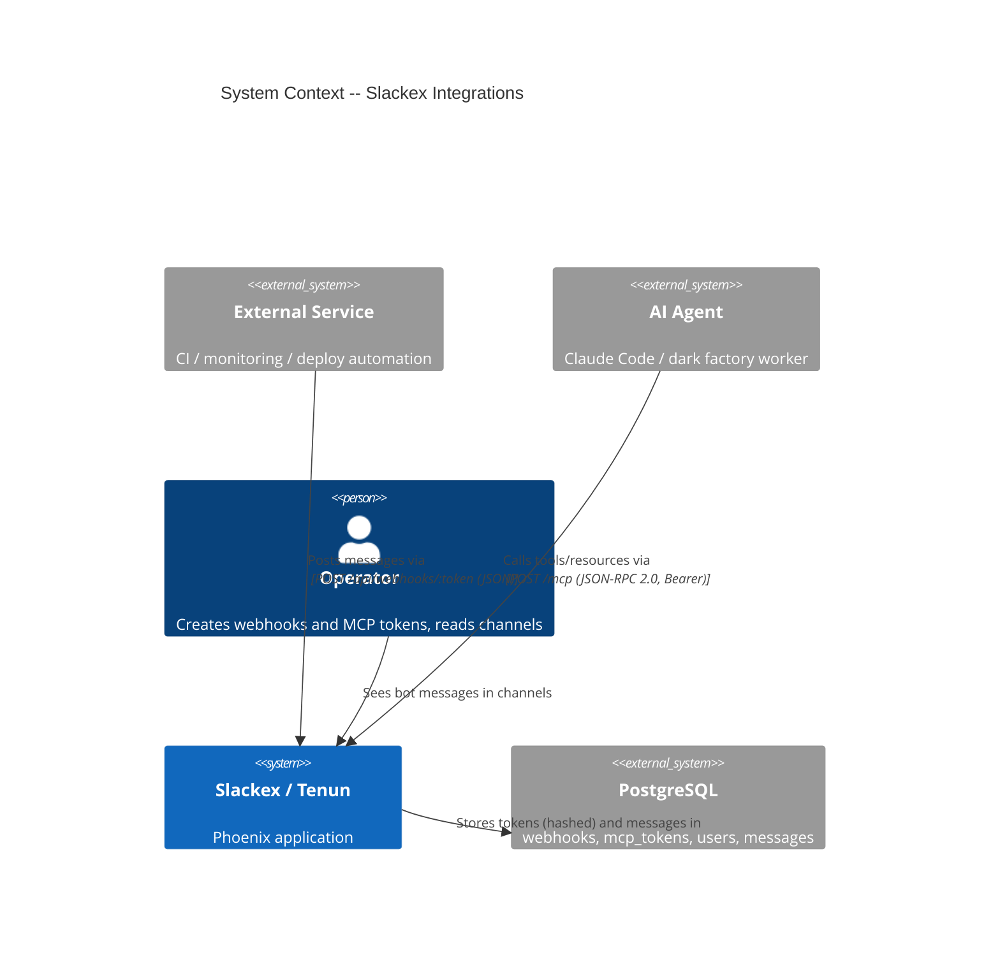
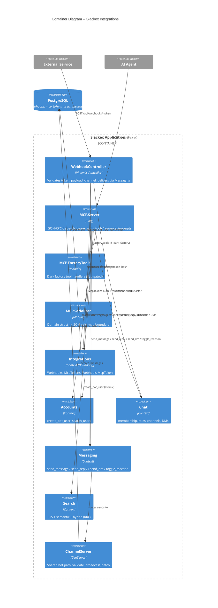
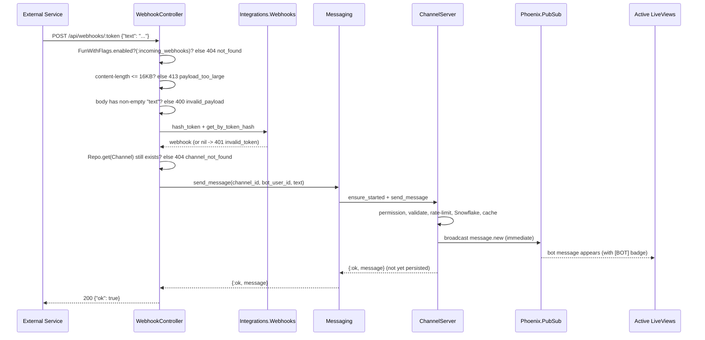
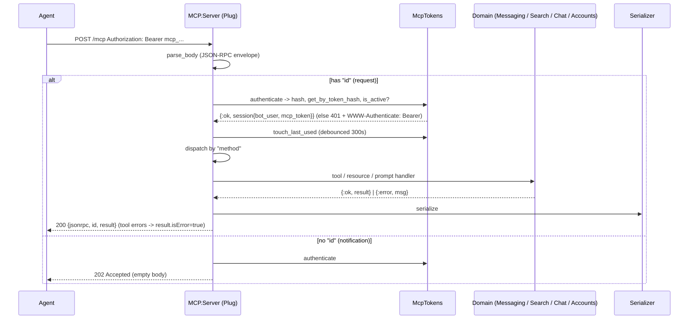
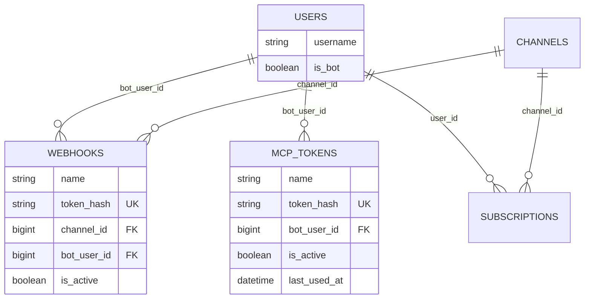

# Integrations (Webhooks & MCP)

**Status:** Reference
**Scope:** The `Slackex.Integrations` context — incoming webhooks (`POST /api/webhooks/:token`) and the agent-facing MCP server (`POST /mcp`). How both reach the channel through the shared `ChannelServer` messaging pipeline.

---

## 1. Overview

`Slackex.Integrations` is the boundary for *non-human* writers into Tenun. Two external surfaces live behind it:

- **Incoming webhooks** — an external service (CI, monitoring, deploy automation) POSTs a JSON `{"text": ...}` body to a fixed, channel-specific URL. The message lands in one channel, authored by a dedicated bot user.
- **MCP server** — an AI agent (Claude Code, the dark factory) speaks JSON-RPC 2.0 over the MCP Streamable HTTP transport. It can send messages, reply in threads, react, search history, look up users, send DMs, and read a small set of resources. One bearer token maps to one bot user identity.

The unifying design decision: **neither surface writes messages directly to the database.** Both call the same public facade — `Slackex.Messaging.send_message/4` — and ride the existing `ChannelServer` hot path. They inherit Snowflake ordering, immediate PubSub fanout, the bounded in-memory cache, batched async persistence, and the downstream pipeline (push notifications, embeddings, link previews) for free. The only thing that marks a webhook/MCP message as different from a human one is the author's `is_bot: true` flag, which the UI renders as a `[BOT]` badge.

Both surfaces authenticate with a **hashed bearer/URL token** (SHA-256, show-once at creation) and both are gated by **FunWithFlags** feature flags — `:incoming_webhooks` and (for the factory tool subset) `:dark_factory`.

> Read the realtime path first. This document treats `ChannelServer` and `BatchWriter` as a known pipeline and focuses on how integration traffic enters it. See [realtime-chat.md](realtime-chat.md).

---

## 2. C4 Diagrams

### 2.1 System Context



### 2.2 Container Diagram



---

## 3. Main Components

| Component | Responsibility |
|---|---|
| `SlackexWeb.WebhookController` | HTTP entry for webhook delivery: feature flag, payload-size, payload-shape, token lookup, channel-exists, delegate to `Messaging`. |
| `Slackex.Integrations.Webhooks` | Webhook lifecycle: atomic create (bot user + subscription + record), token hashing, active-token lookup. |
| `Slackex.Integrations.Webhook` | Ecto schema for the `webhooks` table. |
| `SlackexWeb.MCP.Server` | Pure-Plug MCP Streamable HTTP server: JSON-RPC parse/dispatch, bearer auth, tools/resources/prompts, CORS. |
| `SlackexWeb.MCP.FactoryTools` | Dark-factory tool handlers, dispatched only when `:dark_factory` is enabled. |
| `SlackexWeb.MCP.Serializer` | Explicit domain→JSON projection (no `Jason.Encoder` derivation on schemas). |
| `Slackex.Integrations.McpTokens` | MCP token lifecycle: atomic create (bot user + token), hashing, lookup, revoke, debounced `last_used_at`. |
| `Slackex.Integrations.McpToken` | Ecto schema for the `mcp_tokens` table. |
| `Slackex.Integrations` | Context boundary (`use Boundary`) — `deps: [Accounts, Chat]`, `exports: [Webhook, Webhooks, McpToken, McpTokens]`. |

The context boundary is enforced by the `Boundary` library: Integrations may call `Accounts` and `Chat`, but message *delivery* deliberately routes through `Slackex.Messaging` (not a direct Integrations export), keeping one send pipeline for every author type.

---

## 4. Routing & Pipelines

Both surfaces sit **outside** the `:browser` pipeline (no session, no CSRF, no `fetch_current_user`). Auth is the token alone.

```elixir
# lib/slackex_web/router.ex
pipeline :api do
  plug :accepts, ["json"]
end

pipeline :mcp do
  plug :accepts, ["json", "sse"]
  plug Plug.Parsers, parsers: [{:json, length: 1_000_000}], pass: ["application/json"], json_decoder: Jason
end

scope "/mcp" do
  pipe_through :mcp
  forward "/", SlackexWeb.MCP.Server
end

scope "/api/webhooks", SlackexWeb do
  pipe_through :api
  post "/:token", WebhookController, :deliver
end
```

Two non-obvious points:

- The `:mcp` pipeline **declares** `"sse"` in `:accepts`, but the server never opens an SSE stream — every response is `application/json` (or `202`/`204`). The capability is advertised for content negotiation; real-time push to agents is not implemented (see §8).
- The MCP parser caps bodies at **1 MB**, far higher than the webhook controller's **16 KB** payload guard. Agents send larger JSON-RPC envelopes (tool arguments, search results); webhooks carry a single short message.

---

## 5. Incoming Webhooks

### 5.1 Data model

`webhooks` (migration `priv/repo/migrations/20260319135049_create_webhooks.exs`):

| Field | Type | Notes |
|---|---|---|
| `name` | string, NOT NULL, 1–100 chars | Human label, also seeds the bot username. |
| `token_hash` | string, NOT NULL, **unique index** | SHA-256 hex of the raw token. Raw token never stored. |
| `channel_id` | FK → `channels`, `on_delete: :delete_all` | The single target channel. |
| `bot_user_id` | FK → `users`, `on_delete: :delete_all` | Bot author, created atomically with the webhook. |
| `is_active` | boolean, default `true` | Soft revocation; lookup filters on it. |
| `inserted_at` / `updated_at` | `utc_datetime_usec` | |

A webhook is bound to exactly **one channel** and **one bot user**. The `delete_all` cascades mean deleting the channel or the bot user removes the webhook row.

### 5.2 Atomic creation

`Webhooks.create_webhook/1` runs an `Ecto.Multi` so a partial setup can never leave a ghost bot user or orphaned subscription:

1. `:channel` — load the channel; reject if missing (`{:error, :channel_not_found}`) or private (`{:error, :private_channel_not_supported}`). Webhooks are **public-channel-only** in the current build.
2. `:bot_user` — `Accounts.create_bot_user/1` with a sanitized username `"webhook-<name>"` and `is_bot: true` (forced in `User.bot_changeset/2`).
3. `:subscription` — subscribe the bot to the channel as `"member"`, inserted with `on_conflict: :nothing, conflict_target: [:user_id, :channel_id]`. The ghost-struct guard is honored: a conflict returns `%Subscription{user_id: nil}`, which the code maps to `{:ok, :already_subscribed}` rather than treating the nil-id struct as a real row.
4. `:webhook` — insert the `Webhook` record with the precomputed `token_hash`.

The raw token is returned **once** (`{:ok, %{webhook: ..., token: raw_token}}`) and never persisted.

### 5.3 Token handling

```elixir
# generation
:crypto.strong_rand_bytes(32) |> Base.url_encode64(padding: false)
# hashing (storage + lookup)
:crypto.hash(:sha256, raw_token) |> Base.encode16(case: :lower)
```

Webhook tokens carry **no prefix**. Lookup is a single indexed `get_by(token_hash: hash, is_active: true)` with `channel` and `bot_user` preloaded. Storing only the hash means a `webhooks` table breach yields no usable tokens.

### 5.4 Delivery flow



The controller's `with` chain (`WebhookController.deliver/2`) maps each failure to a distinct status:

| Condition | Status | Body |
|---|---|---|
| `:incoming_webhooks` disabled | 404 | `{"error": "not_found"}` (no hint webhooks exist) |
| `content-length` > 16 KB | 413 | `{"error": "payload_too_large", ...}` |
| Missing/blank `text` | 400 | `{"error": "invalid_payload", ...}` |
| Token not found / inactive | 401 | `{"error": "invalid_token"}` |
| Target channel deleted | 404 | `{"error": "channel_not_found"}` |
| Any `Messaging` error | 500 | `{"error": "internal_error"}` (logged) |
| Success | 200 | `{"ok": true}` |

The size check reads the `content-length` header before parsing; absent that header it falls back to the global `Plug.Parsers` limit. The 200 returns **before** the message is durably written — visibility comes from the PubSub broadcast, durability from the later batch flush.

### 5.5 Not yet implemented

- **Per-webhook rate limiting.** ADR-WHK-004 specifies a 60/min rolling window per webhook; the controller does not implement it. The only active limit is `ChannelServer`'s per-sender limiter (`10/second`, in-process), which applies to the bot user.
- **`last_used_at` on webhooks.** Only MCP tokens track usage; the `webhooks` schema has no such column.
- **Private-channel webhooks** and a management UI (deferred per the feature roadmap).

---

## 6. MCP Server

### 6.1 Data model

`mcp_tokens` (migration `priv/repo/migrations/20260322121505_create_mcp_tokens.exs`):

| Field | Type | Notes |
|---|---|---|
| `name` | string, NOT NULL, 1–100 chars | Agent label, seeds bot username `"mcp-<name>"` (sliced to 35 chars before prefix). |
| `token_hash` | string, NOT NULL, **unique index** | SHA-256 hex; raw token never stored. |
| `bot_user_id` | FK → `users`, `on_delete: :nothing` | Agent's bot identity. Note `:nothing`, not `:delete_all` (webhooks differ). |
| `is_active` | boolean, default `true` | Soft revocation via `revoke_mcp_token/1`. |
| `last_used_at` | `utc_datetime_usec`, nullable | Operational signal; updated debounced. |
| `inserted_at` / `updated_at` | timestamps | |

`McpTokens.create_mcp_token/1` is a two-step `Ecto.Multi` (bot user, then token). Tokens are prefixed `mcp_` to distinguish them from webhook tokens. `touch_last_used/1` updates at most once per **300 seconds** (returns `:debounced` otherwise), so the auth path doesn't write to the DB on every request.

Unlike a webhook, an MCP token is **not** auto-subscribed to any channel. The agent's bot must already be a member of a channel for write/react tools to succeed — membership is checked at call time (§6.4).

### 6.2 Transport: pure Plug, not phantom_mcp

`SlackexWeb.MCP.Server` is a hand-written `Plug` implementing the MCP Streamable HTTP spec (`2025-03-26`) directly. There is **no phantom_mcp dependency and no `SlackexWeb.MCP.Router`** in the codebase — the MCP subsystem is exactly three modules: `server.ex`, `serializer.ex`, `factory_tools.ex`.

This is a deliberate departure from the original design. RCA `docs/rca/2026-03-27-mcp-server-connectivity.md` documents twelve deploys spent guessing before the root cause was found: phantom_mcp did not support the protocol version Claude Code sends (`2025-11-25`), and curl tests used an older version (`2024-11-05`) that masked the failure. The fix replaced the library entirely. The server now **accepts any `protocolVersion`** in `initialize` and answers with its supported version (`@protocol_version "2025-03-26"`), rather than rejecting unknown versions.

> The RCA's closing note says phantom_mcp "remains as a dependency for the Router DSL." That is stale — the dependency and `SlackexWeb.MCP.Router` were subsequently removed. The shipped reality is the pure Plug above.

### 6.3 Request dispatch



`handle_post/2` branches on the presence of `"id"`: requests get a JSON-RPC response, notifications get `202` with no body. Both still require a valid bearer token. JSON-RPC error codes in use: `-32700` parse error, `-32600` invalid request, `-32601` method not found, `-32000` unauthorized, `-32002` resource/prompt not found.

Authentication (`authenticate/1`) extracts the `Bearer` token, hashes it, requires `%{is_active: true}`, and returns a session carrying the preloaded `bot_user`. Every subsequent action acts as that bot — the token *is* the identity, so impersonation of a human user is not possible.

### 6.4 Methods, tools, resources, prompts

**Methods:** `initialize`, `ping`, `tools/list`, `tools/call`, `resources/list`, `resources/read`, `prompts/list`, `prompts/get`.

**Base tools** (always available):

| Tool | Domain call | Notes |
|---|---|---|
| `send_message` | `Messaging.send_message/4` | Checks `check_membership` first; serializes the in-memory map via `Serializer.message_from_map/1` (pre-persist). |
| `reply_to_thread` | `Messaging.send_reply/5` (`:channel`) | Threads on channels only; returns Ecto-loaded message via `Serializer.message/1`. |
| `react_to_message` | `Messaging.toggle_reaction/3` | Membership-checked; reports `added` / `removed` / `swapped`. |
| `search_messages` | `Search.search_messages/3` | Modes `text` / `semantic` / `hybrid` (default); `limit` clamped to 1–100. |
| `find_user` | `Accounts.search_users/1` | Trigram search; no membership scope (any agent can resolve users). |
| `send_dm` | `DMs.find_or_create_dm/2` + `DMs.send_dm/3` | Opens the DM if needed, then sends as the bot. |

**Factory tools** are appended to `tools/list` and routed by `factory_tool?/1` only when `:dark_factory` is enabled; otherwise a factory call returns `"Dark factory is not enabled"`. Their handlers live in `SlackexWeb.MCP.FactoryTools` (see [dark-factory.md](dark-factory.md) for the pipeline).

**Resources** (`resources/read`):

| URI | Returns |
|---|---|
| `tenun:///channels` | Public channels with member counts (`Chat.list_public_channels` + `Chat.count_members`). |
| `tenun:///users/{id}` | User profile via `Accounts.get_user/1`. |
| `tenun:///ops/summary` | Operational snapshot from `Slackex.Ops.SystemSummary.snapshot/0`. |

`initialize` advertises `resources: {subscribe: false}` — agents cannot subscribe to live resource changes; they poll (call tools / re-read resources).

**Prompts:** `summarize_channel` and `draft_spec` — server-authored instructions that steer the agent to use `search_messages` and produce structured output. They are guidance text, not server-side execution.

### 6.5 The serializer boundary

`SlackexWeb.MCP.Serializer` is the only place domain structs become agent-visible JSON, with explicit field selection (no `Jason.Encoder` on schemas). It exposes `channel/2`, `message/1`, `message_from_map/1`, `messages/1`, `user/1`, `ops_summary/1`.

Two reasons this matters:

- **Encryption.** Message `content` is Cloak-encrypted at rest; an Ecto-loaded `Message` is auto-decrypted by the field type, so `message/1` emits plaintext. The companion plaintext `search_content` column (used for FTS/GIN indexing) is never in the projection. The module docstring is explicit: only Ecto-loaded structs may be passed in, never raw rows.
- **Pre- vs post-persist shape.** `send_message` returns the `ChannelServer` *in-memory map* (the message hasn't flushed yet), so it is serialized with `message_from_map/1` (which defaults `reply_count` to 0 and `edited_at` to `nil`). `reply_to_thread` returns an Ecto-loaded struct and uses `message/1`. Both yield the same JSON keys, with IDs stringified to survive JSON's 53-bit integer limit (Snowflake IDs exceed it).

---

## 7. Shared Pipeline: ChannelServer

The point of both surfaces is that they converge:

```
WebhookController.deliver/2 ─┐
                            ├─> Messaging.send_message(channel_id, bot_user_id, content)
MCP.Server send_message ────┘        └─> ChannelSupervisor.ensure_started
                                          └─> ChannelServer.handle_call({:send_message, ...})
```

Inside `ChannelServer.handle_call/3` (`lib/slackex/messaging/channel_server.ex`), a bot message is treated identically to a human one:

1. **Staleness guard** — a stale (fenced) server replies `{:error, :not_writer}`.
2. **Backpressure** — reject if pending writes exceed the cap.
3. **Content validation** — non-empty after trim, ≤ 4000 chars.
4. **Permission** — `Chat.get_role/2` → `Permissions.can?(role, :send_message)`. The webhook bot is a `"member"`; an MCP bot must already be subscribed.
5. **Per-sender rate limit** — `10/second` (`@message_rate_limit`).
6. **Snowflake ID** + derived timestamp.
7. **Sender serialization** — `serialize_sender/1` emits `{id, username, display_name, avatar_url, is_bot}`; `is_bot: true` is what drives the `[BOT]` badge.
8. **Cache + bounded queue + PubSub broadcast** (`message.new` envelope) — immediate.
9. Reply `{:ok, message}` while the write stays in `pending_writes` for the next batch flush.

So bot messages get Snowflake ordering, real-time fanout, the hot cache, async durable persistence, and downstream pipeline events (push notifications, `pipeline:events` → embeddings / link previews) without any integration-specific code. They cannot bypass permission checks, content validation, or rate limiting.

`reply_to_thread`, `react_to_message`, and `send_dm` follow the analogous `Messaging` facades (`send_reply/5`, `toggle_reaction/3`, `DMs.send_dm/3`), which apply the same authorization and broadcast semantics described in [threads-and-reactions.md](threads-and-reactions.md) and [realtime-chat.md](realtime-chat.md).

---

## 8. Key Design Properties

- **One send pipeline for every author.** Human, webhook, and agent messages all go through `Messaging` → `ChannelServer`. New pipeline behavior applies to bots automatically.
- **Token = identity, stored only as a hash.** SHA-256, show-once, soft-revocable via `is_active`. A table breach exposes no usable credentials.
- **No standing server-side session.** The MCP server is a stateless Plug; auth runs per request. Agents can reconnect freely and the surface scales across nodes with no per-agent state.
- **Explicit serialization boundary.** Agents only ever see fields the serializer chooses — encrypted content is decrypted, but internal columns (`search_content`, embeddings, password/email hashes) never appear.
- **Flag-gated at the edge.** `:incoming_webhooks` 404s the whole endpoint when off; `:dark_factory` hides/refuses factory tools; `:message_search` (inside `Search`) governs `search_messages`.
- **Liberal version negotiation.** The MCP server accepts any client `protocolVersion` and answers with its own — the lesson banked from the connectivity RCA.

---

## 9. Failure Modes & Resilience

| Surface | Failure | Behavior | Blast radius |
|---|---|---|---|
| Webhook | Flag disabled | 404 `not_found` | Endpoint dark; no info leak. |
| Webhook | Token wrong/revoked | 401 `invalid_token` | Single webhook. |
| Webhook | Target channel deleted | 404 `channel_not_found` | Webhook row survives but is unusable. |
| Webhook | Bot lost membership/role | `Messaging` returns `{:error, :unauthorized}` → 500 `internal_error` | Single webhook; logged. |
| Webhook | Oversized body | 413 before parsing | Memory protected by the 16 KB guard. |
| MCP | Bad/revoked bearer | 401 + `WWW-Authenticate: Bearer` | Single agent. |
| MCP | Bot not a member | Tool result `isError: true`, `"Not a member of this channel"` | Single call. |
| MCP | Malformed JSON-RPC | 400 with `-32700` / `-32600` | Single call; no crash. |
| MCP | Unknown method/tool/resource | `-32601` / `isError` / `-32002` | Single call. |
| MCP | `:message_search` off | Tool error surfaced to agent | Search only. |
| Both | `ChannelServer` down | `ChannelSupervisor.ensure_started` restarts it (sub-second) | Transient for the conversation. |
| Both | Batch persist fails | Message already broadcast; `BatchWriter` retries/fences per realtime design | Durability lag, not data loss in the common case. |

Both surfaces degrade *narrowly*: a failure affects one webhook or one agent call, never the channel fanout or other tenants. The MCP server's statelessness means a node loss simply re-routes the next request elsewhere.

---

## 10. Data Model Summary



`is_bot` was added to `users` in `priv/repo/migrations/20260319133834_add_is_bot_to_users.exs` (default `false`, backfilled-safe). Both webhook and MCP bot users are created through `Accounts.create_bot_user/1`, which forces `is_bot: true`, sets no email, and stores a non-login sentinel password (`"!bot_no_login"`) so the bot can never authenticate as a human.

---

## 11. Code Map

| File | Responsibility |
|---|---|
| `lib/slackex_web/router.ex` | `:api`, `:mcp` pipelines; webhook + MCP routes (outside `:browser`). |
| `lib/slackex_web/controllers/webhook_controller.ex` | Webhook delivery `with` chain and error mapping. |
| `lib/slackex/integrations/webhooks.ex` | Atomic webhook creation, token hash/lookup. |
| `lib/slackex/integrations/webhook.ex` | `webhooks` schema. |
| `lib/slackex_web/mcp/server.ex` | Pure-Plug MCP server (dispatch, auth, tools/resources/prompts, CORS). |
| `lib/slackex_web/mcp/factory_tools.ex` | Dark-factory tool handlers (flag-gated). |
| `lib/slackex_web/mcp/serializer.ex` | Domain→JSON projection boundary. |
| `lib/slackex/integrations/mcp_tokens.ex` | MCP token lifecycle + debounced `last_used_at`. |
| `lib/slackex/integrations/mcp_token.ex` | `mcp_tokens` schema. |
| `lib/slackex/integrations/integrations.ex` | Context boundary (`Boundary` deps/exports). |
| `lib/slackex/accounts/accounts.ex` | `create_bot_user/1`, `search_users/2`, `get_user/1`. |
| `lib/slackex/messaging/messaging.ex` | Shared send/reply/react facade. |
| `lib/slackex/messaging/channel_server.ex` | Shared hot path (validation, broadcast, batching). |
| `priv/repo/migrations/20260319133834_add_is_bot_to_users.exs` | `is_bot` column. |
| `priv/repo/migrations/20260319135049_create_webhooks.exs` | `webhooks` table. |
| `priv/repo/migrations/20260322121505_create_mcp_tokens.exs` | `mcp_tokens` table. |

---

## 12. Related Documents

- [realtime-chat.md](realtime-chat.md) — the `ChannelServer` / `BatchWriter` pipeline both surfaces ride.
- [message-pipeline-and-persistence.md](message-pipeline-and-persistence.md) — Snowflake IDs, batched writes, partitioning, `pipeline:events`.
- [threads-and-reactions.md](threads-and-reactions.md) — semantics behind `reply_to_thread` and `react_to_message`.
- [embeddings.md](embeddings.md) — the downstream embedding pipeline bot messages also trigger.
- [notifications.md](notifications.md) — push notifications enqueued on batch flush.
- [accounts-and-auth.md](accounts-and-auth.md) — bot users and the `is_bot` flag.
- [dark-factory.md](dark-factory.md) — the factory pipeline behind the flag-gated MCP tools.
- `docs/feature/incoming-webhooks/design/architecture.md` and ADRs `adr-whk-001`..`adr-whk-004` — original webhook design and decisions.
- `docs/feature/mcp-server/design/architecture.md` — original MCP design (pre-divergence; compare against this document).
- `docs/rca/2026-03-27-mcp-server-connectivity.md` — why the MCP transport is a pure Plug.
