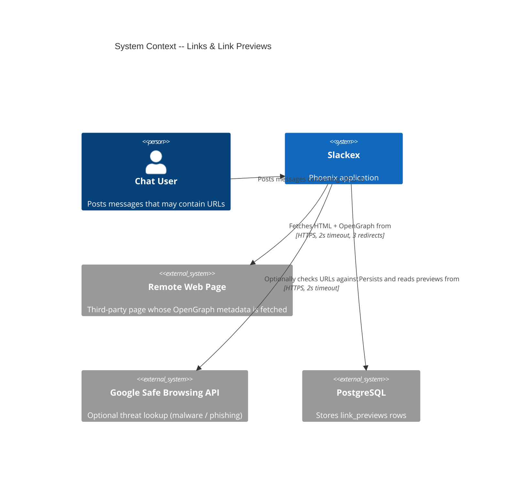
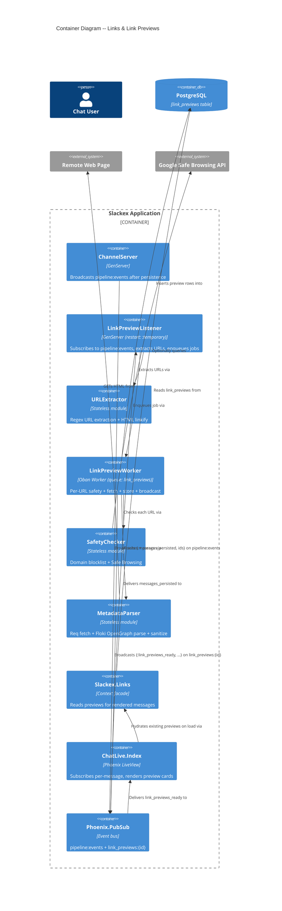
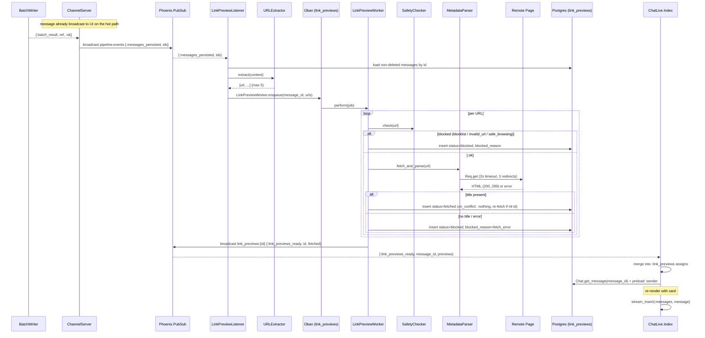
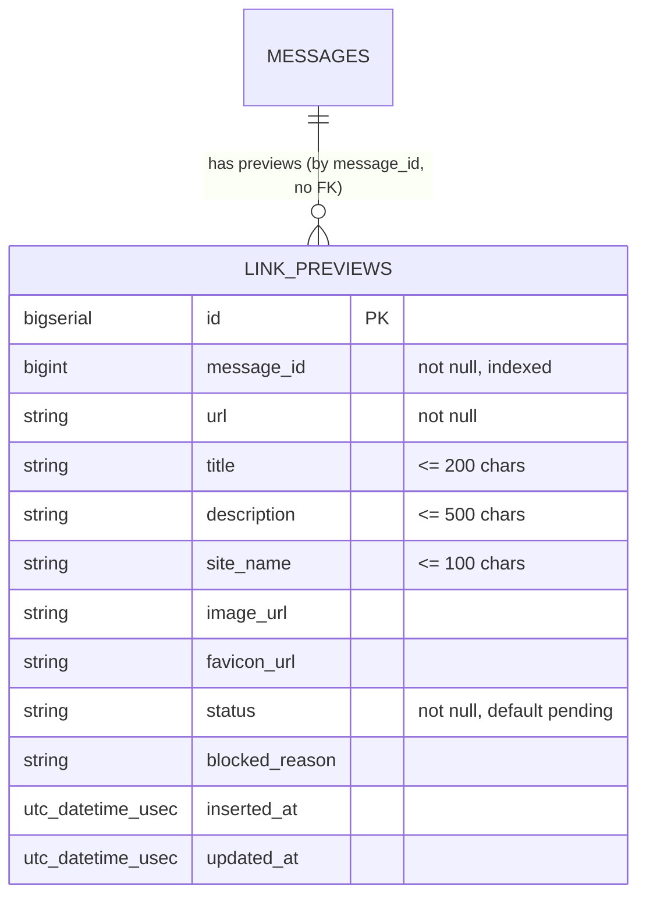

# Links & Link Previews Architecture

**Status:** Reference
**Scope:** `Slackex.Links` context — URL extraction, link safety checking, OpenGraph unfurling, the `LinkPreviewWorker` Oban job, the `LinkPreviewListener` bridge, preview caching, and how previews attach to messages via the `pipeline:events` post-persistence path.

---

## 1. Overview

Link previews are a **cosmetic, non-essential** feature. When a persisted message contains HTTP(S) URLs, the system asynchronously fetches each page, extracts OpenGraph metadata, stores it in the `link_previews` table, and pushes the result to any open LiveView so a rich card appears under the message.

The defining property is **graceful degradation**: nothing about preview fetching sits on the message hot path. If preview fetching is slow, fails, or the whole subsystem crashes, chat delivery and persistence are unaffected. This shapes every design choice below — a 2-second fetch timeout, a single Oban attempt with no retries, a "fail closed to *blocked*" policy, and a `restart: :temporary` listener that is allowed to die without restarting.

The flow is:

1. A message is persisted via the realtime pipeline (`BatchWriter` → `ChannelServer`).
2. `ChannelServer` broadcasts `{:messages_persisted, ids}` on the `pipeline:events` PubSub topic — **after** the database write succeeds, not before.
3. `LinkPreviewListener` (a supervised GenServer subscribed to that topic) re-loads the messages, extracts URLs, and enqueues a `LinkPreviewWorker` job per message that has URLs.
4. The worker safety-checks, fetches, parses, and stores each preview, then broadcasts `{:link_previews_ready, message_id, previews}` on a per-message topic.
5. The LiveView, already subscribed to that per-message topic, merges the previews into its assigns and re-inserts the message into its stream to trigger a re-render.

This is a producer → consumer bridge of exactly the kind the project's incident history flags as risky (see §8). The producer (`channel_server.ex:222`) and consumer (`link_preview_listener.ex:29`) both exist in code, so the wiring is real — but the end-to-end path from `send_message` is **not** exercised by an integration test (see §8.1).

---

## 2. C4 Diagrams

### 2.1 System Context

### 2.2 Container Diagram

These diagrams show the subsystem at a higher level than the sequence diagram in §6.

---

## 3. How To Read This Document

- Start with the **System Context** diagram to see which external systems preview fetching touches (remote pages, Safe Browsing, Postgres).
- Move to the **Container Diagram** to see the internal modules and how the event bus stitches them together.
- Use the **sequence diagram** in §6 when you want the runtime ordering: when `pipeline:events` fires, when the worker runs, and when the UI re-renders.
- Use the **Data Model** in §7 for the `link_previews` schema and the status state machine.

### Quick Legend

| Diagram Type | Best For | Read It As |
|---|---|---|
| C4 System Context | Subsystem boundaries | External dependencies around preview fetching |
| C4 Container | Internal architecture | Modules and the PubSub topics that connect them |
| Sequence Diagram | Event flow | Time-ordered persist → enqueue → fetch → render |

### Terms Used Here

| Term | Meaning |
|---|---|
| Unfurl | Fetching a URL and extracting OpenGraph metadata to render a preview card |
| Preview | A `link_previews` row: `fetched`, `pending`, or `blocked` for one `(message_id, url)` |
| Blocked preview | A row recorded with `status: "blocked"` and a `blocked_reason`; never shown to the user |
| `pipeline:events` | PubSub topic carrying `{:messages_persisted, ids}` after a batch write succeeds |
| Per-message topic | `"link_previews:#{message_id}"`, used to push ready previews to open LiveViews |
| Fail-closed | A fetch/safety failure produces a `blocked` row rather than a retry or a partial card |

---

## 4. Main Components

| Component | Responsibility |
|---|---|
| `Slackex.Links` (`lib/slackex/links/links.ex`) | Context facade. `list_previews_for_messages/1` returns `%{message_id => [%LinkPreview{}]}` for `fetched` and `pending` rows. Boundary `deps: [Slackex.Chat]`. |
| `Slackex.Links.LinkPreview` (`lib/slackex/links/link_preview.ex`) | Ecto schema for `link_previews`. Changeset truncates text fields and enforces the `(message_id, url)` unique constraint. |
| `Slackex.Links.URLExtractor` (`lib/slackex/links/url_extractor.ex`) | Stateless. `extract/1` pulls up to 5 unique HTTP(S) URLs from text; `linkify/1` renders text to safe anchor HTML. |
| `Slackex.Links.SafetyChecker` (`lib/slackex/links/safety_checker.ex`) | Two-layer URL safety: compile-time domain blocklist, then optional Google Safe Browsing. |
| `Slackex.Links.MetadataParser` (`lib/slackex/links/metadata_parser.ex`) | `Req` fetch (2s timeout) + `Floki` OpenGraph parse + text sanitization. |
| `Slackex.Links.LinkPreviewWorker` (`lib/slackex/links/link_preview_worker.ex`) | Oban worker. Orchestrates safety → fetch → store → broadcast per URL. |
| `Slackex.Links.LinkPreviewListener` (`lib/slackex/links/link_preview_listener.ex`) | Supervised GenServer bridging `pipeline:events` to `LinkPreviewWorker`. |
| `SlackexWeb.ChatLive.Index` (`lib/slackex_web/live/chat_live/index.ex`) | Subscribes to per-message topics, handles `:link_previews_ready`, re-inserts the message to re-render. |
| `SlackexWeb.ChatLive.Conversations` (`lib/slackex_web/live/chat_live/conversations.ex`) | Hydrates `:link_previews` assigns from the context on conversation load. |

---

## 5. Per-Component Detail

### 5.1 URLExtractor

`extract/1` (`url_extractor.ex:15`) scans text with `~r{https?://[^\s<>"'\)\]]+}i`, strips trailing punctuation (`~r/[.,;:!?\)]+$/`), de-duplicates, and **caps the result at 5 URLs** (`@max_urls`). The cap is an abuse guard: a message pasting 100 links cannot enqueue 100 fetches.

`linkify/1` (`url_extractor.ex:32`) is the render-time counterpart. It splits on the same regex, wraps each URL in `<a … target="_blank" rel="noopener noreferrer ugc" class="link link-primary">`, and HTML-escapes both the URL and all surrounding text. The `ugc` (user-generated content) rel value and explicit escaping are the XSS guard for raw URLs appearing in chat.

### 5.2 SafetyChecker

`check/1` (`safety_checker.ex:24`) runs two layers with `with`, short-circuiting on the first block:

- **Layer 1 — domain blocklist (`check_domain/1`).** The blocklist is read from `priv/links/blocked_domains.txt` **at compile time** into a `MapSet` via `File.read!` + `@external_resource`. Lookups check the host and every parent domain (`domain_variants/1`), so `www.pornhub.com` matches the `pornhub.com` entry. A URL with no host returns `{:blocked, "invalid_url"}`; a blocklist match returns `{:blocked, "blocklist"}`. Because the list is compiled in, editing it requires a redeploy — an accepted trade-off for an O(1), allocation-free check on every preview. The shipped list (`blocked_domains.txt`) covers adult, gambling, and spam/tracking categories.
- **Layer 2 — Google Safe Browsing (`check_safe_browsing/1`).** Optional. If `:google_safe_browsing_key` is `nil` or `""`, this layer returns `:ok` (fail-open — the feature is simply absent). When configured, it POSTs the URL to `threatMatches:find` for `MALWARE`, `SOCIAL_ENGINEERING`, and `UNWANTED_SOFTWARE` with a 2s timeout. A match returns `{:blocked, "safe_browsing"}`; an API error logs a warning and returns `:ok` (fail-open on outage so a Safe Browsing incident never blanks all previews).

### 5.3 MetadataParser

`fetch_and_parse/1` (`metadata_parser.ex:16`) issues a single `Req.get/2` with `receive_timeout: 2_000`, `connect_options: [timeout: 2_000]`, `max_redirects: 3`, and `decode_body: false` (raw bytes for Floki). Extra `Req` options merge in from `:metadata_parser_req_options` config — the seam tests use to inject a stub. Only `200..299` is accepted; other statuses return `{:error, "http_#{status}"}` and a wrapping `rescue` converts any exception to `{:error, "fetch_error"}`. Warnings include the URL but never response bodies, to avoid logging secrets embedded in fetched pages.

`parse_html/2` (`metadata_parser.ex:50`) uses `Floki.parse_document/1` and extracts, in priority order: `og:title` (falling back to `<title>`), `og:description`, `og:site_name`, `og:image`, and a favicon from `link[rel='icon']` / `link[rel='shortcut icon']` resolved to an absolute URL against the base URL. **Text fields are sanitized** (`sanitize_text/1`: strip tags, trim, drop invalid UTF-8 → `nil`). One deliberate exception: `og:image` is fetched with `sanitize: false` because it is a URL, not display text. The favicon URL goes through `resolve_url/2` (relative-path resolution) but is not tag-stripped.

### 5.4 LinkPreviewWorker

Configured (`link_preview_worker.ex:15`) on `queue: :link_previews`, **`max_attempts: 1`** (no retries), with `unique: [fields: [:args], keys: [:message_id], period: 60]` to coalesce duplicate jobs for the same message within 60 seconds.

`perform/1` maps each URL through `process_url/2` and broadcasts only the `fetched` previews. The per-URL pipeline:

1. `SafetyChecker.check/1` → on `{:blocked, reason}`, insert a `blocked` row with that reason.
2. Otherwise `MetadataParser.fetch_and_parse/1`:
   - `{:ok, %{title: nil}}` → **insert a `blocked` row with `blocked_reason: "fetch_error"`**. A page with no usable title is treated as a non-preview, not a half-empty card.
   - `{:ok, metadata}` → insert with `status: "fetched"`.
   - `{:error, _}` → insert `blocked` / `"fetch_error"`.

The insert (`insert_preview/3`) uses `on_conflict: :nothing, conflict_target: [:message_id, :url]` and **correctly handles the nil-id ghost struct**: on conflict Ecto returns `{:ok, %LinkPreview{id: nil}}`, so the worker re-fetches the real row via `Repo.get_by!/2`. This follows the project's documented upsert-safety rule (a conflict otherwise yields a struct that looks successful but has no database identity).

A note on Oban semantics: `perform/1` returns a literal `:ok` regardless of per-URL outcomes (failures are recorded as `blocked` rows, not raised). With `max_attempts: 1` this is intentional — there is nothing to retry, so the job never fails. This differs from workers where the project mandates returning the real result so Oban can retry; here the fail-closed policy makes a "successful" preview-fetch outcome and a "blocked" outcome equally terminal.

### 5.5 LinkPreviewListener

A GenServer started in `lib/slackex/application.ex:50` with **`restart: :temporary`**, alongside `Embeddings.PersistenceListener` and `Factory.ChannelNotifier`. `init/1` subscribes to `pipeline:events`. On `{:messages_persisted, ids}` it re-loads non-deleted messages (`where: is_nil(m.deleted_at)`), extracts URLs, and enqueues one worker job per message with URLs (logging at info; `:noop` for URL-free messages). Any other message is ignored by a catch-all `handle_info/2`.

`restart: :temporary` means a crash here is **not** restarted. The rationale is the v0.5.36 cascade precedent: a non-essential listener must never take down the supervision tree, and missed previews are cosmetic. The cost is that a crash silently stops all preview fetching until the next deploy — there is **no reconciliation job** that backfills previews for messages persisted while the listener was down (unlike some embedding paths). This is an accepted gap, not an oversight.

---

## 6. Runtime Flow: Persist → Unfurl → Render

### Notes

- The trigger is the **`{:batch_result, ref, :ok}`** branch (`channel_server.ex:213`) — previews are attempted only after the write durably succeeds.
- The LiveView subscribes to `"link_previews:#{message.id}"` as each new message arrives on the hot path (`index.ex:1000`), so it is already listening before the worker finishes.
- Stream items don't re-render on surrounding assign changes, so `handle_info/2` (`index.ex:1232`) re-inserts the message to force a re-render with the new card.
- On conversation load, `Conversations.assign_conversation_state/2` (`conversations.ex:139`) hydrates `:link_previews` from `Links.list_previews_for_messages/1` so already-fetched previews appear without waiting for a broadcast.

---

## 7. Data Model

The subsystem owns one table, `link_previews`.

Defined by `priv/repo/migrations/20260306025533_create_link_previews.exs` (table + `index(:link_previews, [:message_id])`). The **unique constraint on `(message_id, url)` ships in a separate migration**, `20260306230844_add_unique_index_to_link_previews.exs`, created with `concurrently: true` — consistent with the project's deploy-safe expand/contract pattern (a concurrent index build avoids locking the table on deploy). The schema's `unique_constraint([:message_id, :url])` (`link_preview.ex:45`) maps onto that index and is what makes the worker's `on_conflict` upsert idempotent.

There is **no `belongs_to`/`has_many` association** between `Message` and `LinkPreview`. The link is the plain `message_id` integer column; the two contexts stay decoupled (the `Slackex.Links` Boundary only depends on `Slackex.Chat`, not vice versa). Reads go through `Slackex.Repo` (the primary), not a read replica.

### Status state machine

| Status | Set when | Shown to user? |
|---|---|---|
| `pending` | Schema default; a row created but not yet resolved | Yes — `list_previews_for_messages/1` returns `pending` alongside `fetched` |
| `fetched` | `MetadataParser` returned a non-nil title | Yes — rendered as a card |
| `blocked` | Blocklist / `invalid_url` / Safe Browsing / `fetch_error` / no title | No — context query filters these out |

`blocked_reason` is one of `"blocklist"`, `"invalid_url"`, `"safe_browsing"`, or `"fetch_error"`.

---

## 8. Failure Modes & Resilience

| Failure | Handling | Blast radius |
|---|---|---|
| Remote page slow (> 2s) | `Req` times out → `{:error, "fetch_error"}` → `blocked` row | None — no card; chat unaffected |
| Remote page non-2xx | `{:error, "http_#{status}"}` → `blocked` row | None |
| Page parses but has no title | `{:ok, %{title: nil}}` → `blocked` / `fetch_error` | None — no half-empty card |
| Domain on blocklist | `{:blocked, "blocklist"}` → `blocked` row | Intentional, silent |
| Malformed URL (no host) | `{:blocked, "invalid_url"}` → `blocked` row | None |
| Safe Browsing API down | Warning logged, returns `:ok` (fail-open) | Layer 1 blocklist still active |
| Worker raises mid-fetch | `rescue` in `MetadataParser` → `fetch_error`; otherwise `max_attempts: 1` discards the job | One message's previews missing |
| Duplicate enqueue (< 60s) | Oban `unique` coalesces; `on_conflict: :nothing` + nil-id re-fetch on insert race | None — idempotent |
| `LinkPreviewListener` crash | `restart: :temporary` — **not restarted** | Subsystem stops fetching until next deploy; chat fully intact; **no reconciliation backfill** |

Why no retries (`max_attempts: 1`): previews are cosmetic and most failures are either permanent (broken site, blocklist) or not worth a retry storm against third-party hosts. Why fail-closed to `blocked`: a recorded `blocked` row prevents re-enqueue churn and gives an explicit reason for diagnostics, versus a silent absence.

### 8.1 Bridge integrity gap

The `pipeline:events` → `LinkPreviewListener` path is the producer/consumer bridge the project explicitly warns about: a designed-but-unwired broadcast cost 18 hours of a dead topic in v0.5.47–v0.5.64. Here **both ends exist in code** — the producer at `channel_server.ex:222` and the consumer subscription at `link_preview_listener.ex:29` — so the wiring is real today.

However, the test coverage does **not** prove the full path. `test/slackex/links/link_preview_listener_test.exs` sends `{:messages_persisted, …}` directly to the listener pid, and the LiveView e2e test (`test/slackex_web/live/chat_live/e2e_test.exs:140`) manually broadcasts `pipeline:events` rather than calling `send_message`. Both **fake the upstream event** — exactly the anti-pattern CLAUDE.md's "Spec-Driven Acceptance Tests" rule prohibits. They prove the listener and worker handle the event; they do not prove that `ChannelServer` actually emits it after a real send. Closing this gap requires a test that starts from `Messaging.send_message/…` and asserts a preview is enqueued, with no hand-rolled broadcast.

---

## 9. Configuration

| Key | Where | Effect |
|---|---|---|
| `config :slackex, Oban, queues: [link_previews: 5, …]` | `config/config.exs:72` | Worker concurrency for the `link_previews` queue |
| `:google_safe_browsing_key` | Application env | When set, enables Safe Browsing (Layer 2); `nil`/`""` skips it (fail-open) |
| `:metadata_parser_req_options` | Application env | Extra `Req` options merged into the fetch; the stub-injection seam for tests |
| `priv/links/blocked_domains.txt` | Compiled in via `@external_resource` | Layer 1 blocklist; edits require recompile/redeploy |

The subsystem is **not** behind a `FunWithFlags` feature flag — `LinkPreviewListener` starts unconditionally at `application.ex:50`. (Verified at the supervision point; no flag wraps the child spec.)

---

## 10. Code Map

| File | Responsibility |
|---|---|
| `lib/slackex/links/links.ex` | Context facade; `list_previews_for_messages/1`; Boundary exports |
| `lib/slackex/links/link_preview.ex` | Ecto schema + changeset (truncation, unique constraint) |
| `lib/slackex/links/url_extractor.ex` | URL extraction (max 5) and safe HTML linkify |
| `lib/slackex/links/safety_checker.ex` | Compile-time blocklist + optional Safe Browsing |
| `lib/slackex/links/metadata_parser.ex` | `Req` fetch + `Floki` OpenGraph parse + sanitization |
| `lib/slackex/links/link_preview_worker.ex` | Oban worker: safety → fetch → store → broadcast |
| `lib/slackex/links/link_preview_listener.ex` | `pipeline:events` → worker bridge (`restart: :temporary`) |
| `lib/slackex/messaging/channel_server.ex` | Producer of `pipeline:events` (`:213`/`:222`) after batch persist |
| `lib/slackex_web/live/chat_live/index.ex` | Per-message subscribe (`:1000`) + `:link_previews_ready` handler (`:1232`) |
| `lib/slackex_web/live/chat_live/conversations.ex` | Hydrates `:link_previews` on conversation load (`:139`) |
| `priv/repo/migrations/20260306025533_create_link_previews.exs` | Creates table + `message_id` index |
| `priv/repo/migrations/20260306230844_add_unique_index_to_link_previews.exs` | Adds `(message_id, url)` unique index `concurrently` |
| `priv/links/blocked_domains.txt` | Compile-time domain blocklist |
| `lib/slackex/application.ex` | Starts `LinkPreviewListener` with `restart: :temporary` (`:50`) |

---

## 11. Related Documents

- [`realtime-chat.md`](realtime-chat.md) — the message hot path, `ChannelServer`, `BatchWriter`, and the `pipeline:events` producer that triggers unfurling
- [`embeddings.md`](embeddings.md) — the sibling `pipeline:events` consumer (`PersistenceListener`) that this subsystem mirrors, and the `restart: :temporary` cascade-isolation pattern
- [`threads-and-reactions.md`](threads-and-reactions.md) — other message-attached metadata rendered in the chat stream
- [`notifications.md`](notifications.md) — the other post-persistence consumer enqueued from the same `:batch_result` branch
- [`../runbooks/observability.md`](../runbooks/observability.md) — metrics, traces, and operational visibility
- [`../engineering-principles.md`](../engineering-principles.md) — deploy-safe migrations, upsert safety, producer→consumer integration-test rules, and supervision resilience
