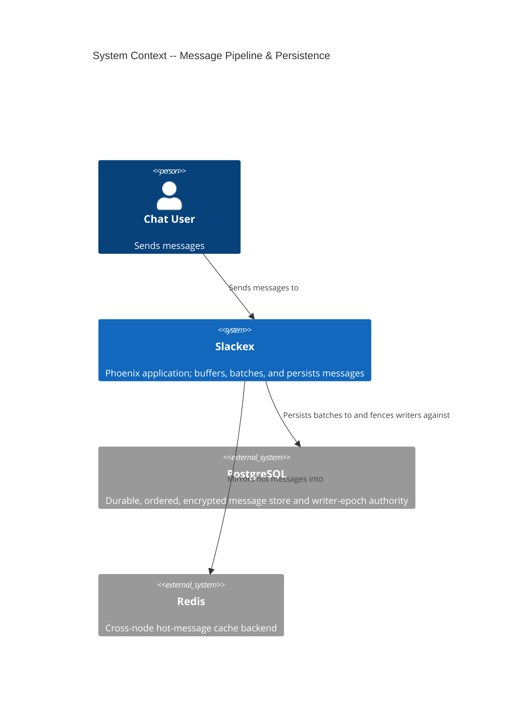
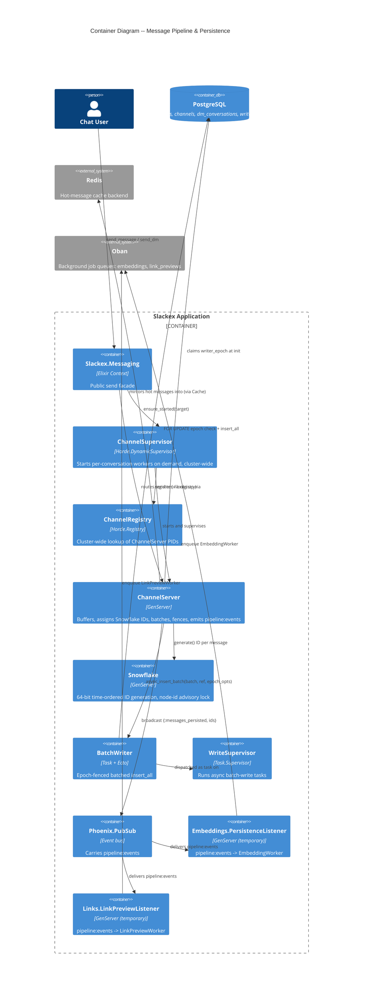
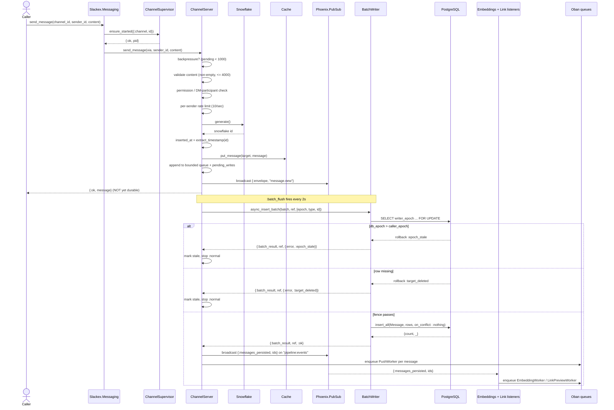
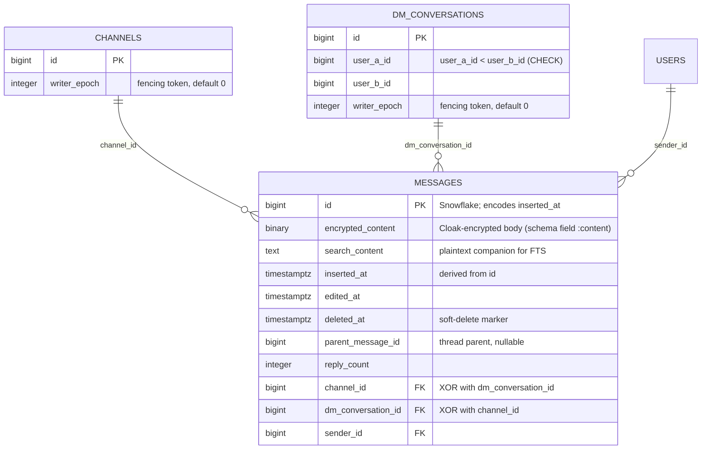

# Message Pipeline & Persistence

**Status:** Reference
**Scope:** `Slackex.Messaging` + `Slackex.Pipeline` — how a message travels from a synchronous send to durable, ordered, encrypted storage, and how persistence fans out to downstream pipelines.

---

## 1. Overview

`realtime-chat.md` describes the *hot path*: how a send reaches subscribers' screens over PubSub before the database is touched. This document covers what happens *after* that broadcast — the **durability path**.

The shape of the durability path is deliberately unusual: `Messaging.send_message/4` returns `{:ok, message}` to the caller **before the message is in PostgreSQL**. The message is assigned a Snowflake ID, broadcast over PubSub, appended to an in-memory buffer, and only flushed to the database in a batch up to two seconds later. The send path is therefore optimised for latency; the write path is optimised for throughput and ordering.

Three properties hold this together and are the reason the design is safe rather than merely fast:

1. **Snowflake IDs encode creation time.** Because the primary key is monotonic-by-time, the database never has to generate or sort timestamps to order messages. `inserted_at` is *derived* from the ID, not the other way around. Range reads over `(channel_id, id)` are already in chronological order.
2. **Writer-epoch fencing.** Each conversation has a `writer_epoch` counter. A `ChannelServer` claims a higher epoch when it starts; the writer rejects any batch carrying a stale epoch. This is what prevents a crashed-and-restarted server (or a split-brain peer) from clobbering newer writes — there is no node-level failover logic doing this, only the epoch check at write time.
3. **Idempotent inserts.** Batches insert with `on_conflict: :nothing`, so retries and crash-recovery re-inserts cannot create duplicates.

Once a batch is durable, `ChannelServer` broadcasts `{:messages_persisted, ids}` on the `pipeline:events` PubSub topic. This is the bridge that feeds the embeddings and link-preview pipelines without coupling those subsystems to `Messaging`.

---

## 2. C4 Diagrams

### 2.1 System Context



### 2.2 Container Diagram



These diagrams sit one zoom level above the sequence diagrams below.

---

## 3. Main Components

| Component | Responsibility |
|---|---|
| `Slackex.Messaging` | Public send facade; ensures the target worker exists, then delegates. `lib/slackex/messaging/messaging.ex` |
| `Slackex.Messaging.ChannelServer` | Per-conversation GenServer: validation, Snowflake ID assignment, in-memory buffering, 2-second batch flush, retries, `pipeline:events` emission, crash recovery. `lib/slackex/messaging/channel_server.ex` |
| `Slackex.Messaging.ChannelSupervisor` | `Horde.DynamicSupervisor` that starts `ChannelServer` children on demand, cluster-wide, with active redistribution. `lib/slackex/messaging/channel_supervisor.ex` |
| `Slackex.Messaging.ChannelRegistry` | `Horde.Registry` (`keys: :unique`) keyed by `{:channel, id}` / `{:dm, id}`. `lib/slackex/messaging/channel_registry.ex` |
| `Slackex.Pipeline.BatchWriter` | Epoch-fenced `Repo.insert_all`; derives `inserted_at` from the Snowflake ID; runs async on `Slackex.WriteSupervisor`. `lib/slackex/pipeline/batch_writer.ex` |
| `Slackex.Infrastructure.Snowflake` | 64-bit time-ordered ID generator; node-id assignment + PostgreSQL advisory lock. `lib/slackex/infrastructure/snowflake.ex` |
| `Slackex.Chat.Message` | The persisted schema; encrypted body, plaintext search companion, soft-delete, threading. `lib/slackex/chat/message.ex` |
| `Slackex.Embeddings.PersistenceListener` | Bridges `pipeline:events` to `EmbeddingWorker`. `lib/slackex/embeddings/persistence_listener.ex` |
| `Slackex.Links.LinkPreviewListener` | Bridges `pipeline:events` to `LinkPreviewWorker`. `lib/slackex/links/link_preview_listener.ex` |

---

## 4. Send-To-Durable Flow

This is the core flow. Steps 1-6 are synchronous from the caller's view (it gets `{:ok, message}` at step 6). Steps 7 onward happen on a timer and in the background.



### Why the caller returns before durability

The acceptance check for a chat send is "did my message appear for everyone in the room", and that is satisfied by the PubSub broadcast at the moment of send — not by the database commit. Decoupling lets writes be **batched** (`@batch_interval 2_000` ms): a busy channel turns dozens of individual inserts into one `insert_all`, which is the dominant cost saving. The risk this introduces — a server dying with un-flushed messages — is bounded by the in-memory buffer being mirrored into the cache and re-checked against the database on restart (see §7).

---

## 5. Snowflake ID Assignment

`Slackex.Infrastructure.Snowflake` is a single named GenServer. ID layout (`lib/slackex/infrastructure/snowflake.ex`):

```
[1 unused][41 timestamp ms][10 node_id][12 sequence]
```

- **Epoch:** `2025-01-01T00:00:00Z` (`@epoch 1_735_689_600_000`). Timestamps are stored relative to this, buying headroom on the 41-bit field.
- **Node ID (0-1023):** `SNOWFLAKE_NODE_ID` env var in production; in dev, derived from the endpoint port as `rem(port - 4000, 1024)`.
- **Advisory lock:** at init the generator runs `pg_try_advisory_lock(node_id)`. The lock is best-effort: a held lock (or any DB error during acquisition) is caught, logged as a warning, and startup proceeds without the lock — in every environment. The lock is intended as a guard against two BEAM nodes silently sharing a node-id and minting colliding IDs, but it does not abort startup if the guard fails.
- **Sequence:** 12 bits per millisecond. On collision within a millisecond the sequence increments; on overflow the generator sleeps to the next millisecond; on a backwards clock it sleeps until time catches up.

The key consequence for persistence: **`inserted_at` is a function of the ID, not a separate clock read.** Both `ChannelServer` (when building the in-memory message) and `BatchWriter.to_row/1` (when building the DB row) call `Snowflake.extract_timestamp(id)` and convert ms → µs. The schema's `put_inserted_at/1` changeset does the same for any path that goes through changesets. There is exactly one source of truth for a message's time, and it is the primary key.

---

## 6. Data Model

The pipeline owns the `messages` table and reads/writes `writer_epoch` on `channels` and `dm_conversations`.



### Notable schema decisions

- **The table is NOT partitioned.** `messages` is a plain table (`priv/repo/migrations/20260221000006_create_messages.exs`). Ordered range reads are served by the composite indexes `(channel_id, id)` and `(dm_conversation_id, id)` over the time-ordered Snowflake `id` — no partition pruning is involved, and there is no `(message_id, message_inserted_at)` composite-join convention in this codebase. (This corrects an older project note that described a partitioned design; the code does not implement one.)
- **Encryption at rest + a searchable companion.** The durable body lives in `encrypted_content` (`Slackex.Encrypted.Binary`, a Cloak type) and is exposed in the schema as `:content` via `source: :encrypted_content`. Ciphertext cannot be full-text indexed, so a plaintext `search_content` column carries the searchable copy. The migration timeline is the reason both exist and only one is indexed:
  1. `20260221000006` creates `messages_content_fts_idx` on `to_tsvector(content)`.
  2. `20260228010000` (`drop_plaintext_columns`) **removes the `content` column** after `mix slackex.encrypt_existing` has migrated data; PostgreSQL drops the dependent expression index with it.
  3. `20260303191200` adds `search_content` and `messages_search_content_fts_idx` on `to_tsvector(coalesce(search_content, ''))`.

  The final schema has exactly **one** FTS GIN index, on `search_content`. `BatchWriter.to_row/1` writes both columns from the same value in a single insert (`content: content, search_content: content`); the soft-delete `delete_changeset/1` nulls `content`, `search_content`, and sets `deleted_at` together.
- **Target XOR constraint.** `messages_target_check` enforces that exactly one of `channel_id` / `dm_conversation_id` is set (`20260221000007`). The schema mirrors this in `validate_target/1`.
- **DM normalisation.** `dm_conversations` carries a `user_a_id < user_b_id` CHECK plus a unique index on the pair, so a conversation between two users is a single canonical row.
- **Soft delete.** `deleted_at` marks a message deleted without removing the row; downstream queries (e.g. `LinkPreviewListener`) filter `where: is_nil(m.deleted_at)`.

---

## 7. Failure Modes & Resilience

### Writer-epoch fencing (the core safety mechanism)

There is no node-failover or leader-election machinery. Stale-writer protection lives entirely in two steps:

- **Claim at init.** When a `ChannelServer` starts it runs
  `UPDATE {table} SET writer_epoch = writer_epoch + 1 ... RETURNING writer_epoch`
  and holds that value in state.
- **Check at write.** `BatchWriter.insert_batch/2` opens a transaction, runs `SELECT writer_epoch FROM {table} WHERE id = $1 FOR UPDATE`, and rolls back with `:epoch_stale` if `db_epoch > caller_epoch`.

So if server A (epoch 1) crashes and server B takes over (epoch 2), any late batch from A is fenced out and A shuts down `:normal` with `stale: true`. Subsequent `send_message` calls to a stale server return `{:error, :not_writer}`. `:net_kernel` node up/down is observed only by `Slackex.NodeListener`, which **logs** cluster membership — it does not drive fencing, failover, or redistribution.

### Crash recovery on restart

On init, `ChannelServer` loads recent messages from the cache (falling back to the DB). If the source was the cache, `reconcile_cache/4` queries `SELECT id FROM messages WHERE id = ANY(...)`, finds any cached IDs not yet persisted, and re-inserts them through `BatchWriter` (subject to the same epoch fence). Idempotent `on_conflict: :nothing` makes this safe to repeat. This is the recovery for messages buffered but not flushed when a server died.

### Batch failure handling

`ChannelServer.handle_info({:batch_result, ...})` distinguishes outcomes:
- `:ok` → broadcast `pipeline:events`, enqueue push notifications.
- `:epoch_stale` / `:target_deleted` → log, telemetry, stop `:normal` (graceful, not a crash).
- other errors → retry the same batch up to `@max_flush_retries` (10); on exhaustion, drop the batch, log an error, and emit `[:slackex, :messaging, :batch_dropped]` telemetry. Drops are loud, not silent.

### Backpressure & rate limiting

- If `pending_writes` reaches `@max_pending_writes` (1000), new sends are rejected with `{:error, :backpressure}` — the buffer cannot grow unbounded if the database falls behind.
- Per-sender rate limiting (`@message_rate_limit [rate: 10, per: :second]`) is checked *before* a message enters the buffer.

### Graceful flush paths

- **Idle timeout** (`@idle_timeout` 30 min): synchronously flush remaining `pending_writes`, clear caches/limiters, and `:hibernate`.
- **`terminate/2`** (supervisor shutdown): if not already stale, synchronously flush remaining writes. `Process.flag(:trap_exit, true)` in `init/1` is what makes `terminate/2` run.

### Blast radius of downstream pipelines

The `pipeline:events` listeners are non-essential and started `restart: :temporary` in `lib/slackex/application.ex`. If a listener crashes repeatedly, a `:permanent` restart would exhaust the root supervisor's budget and take the app down — so they are allowed to stay dead instead. The embeddings path has the `ReconciliationWorker` cron as a durability safety net for events missed during a listener outage or deploy; link previews are cosmetic and have no such net. This restart policy is the direct lesson of the v0.5.36 embedding-cascade outage.

---

## 8. The `pipeline:events` Bridge

`pipeline:events` is a deliberate seam: persistence announces "these IDs are now durable" and any number of subsystems react, without `Messaging` depending on them.

- **Producer:** `ChannelServer`, only after a successful batch — `Phoenix.PubSub.broadcast(Slackex.PubSub, "pipeline:events", {:messages_persisted, message_ids})`.
- **Consumers:** `Embeddings.PersistenceListener` → `EmbeddingWorker.enqueue/1`; `Links.LinkPreviewListener` → fetches the (non-deleted) messages, extracts URLs, and enqueues `LinkPreviewWorker`.

Because the broadcast fires *after* durability, a consumer can safely re-read the message rows it was told about. The producer and both consumers live in committed application code (not just tests), so the bridge is real rather than designed-but-unwired. Listener behaviour is covered by `test/slackex/embeddings/persistence_listener_test.exs` and `test/slackex/links/link_preview_listener_test.exs`.

> **Why this matters (project rule):** a past incident shipped a `pipeline:events` design where the broadcast was never implemented; unit tests passed because they faked the upstream event. The standing rule is that any PubSub bridge must have a committed producer→consumer path. Here the producer is `ChannelServer.handle_info({:batch_result, ref, :ok}, ...)`.

---

## 9. Key Design Properties

- **Async durability, sync acknowledgement.** Callers get `{:ok, message}` on broadcast; the database write is batched and backgrounded.
- **Time-ordered keys.** Snowflake IDs make the primary key the ordering key; `inserted_at` is derived from it, never independently generated.
- **Epoch fencing over failover.** Stale and split-brain writers are stopped at the write boundary by a DB-authoritative counter, not by cluster-event handling.
- **Idempotent writes.** `on_conflict: :nothing` makes retries and crash-recovery re-inserts safe. (Note: this is `Repo.insert_all`, which returns `{count, _}` — not the `{:ok, %Struct{id: nil}}` ghost-struct case that `Repo.insert` produces, so no re-fetch is needed here.)
- **Encrypted at rest, searchable in parallel.** Encrypted body + plaintext `search_content` companion, with the FTS GIN index on the companion.
- **Bounded memory.** Per-conversation queue capped at `@max_cached_messages` (200); pending writes capped at 1000 with explicit backpressure.
- **Loud failure.** Dropped batches, epoch-stale shutdowns, and recovery counts all emit logs and telemetry; no silent swallowing.

---

## 10. Code Map

| File | Responsibility |
|---|---|
| `lib/slackex/messaging/messaging.ex` | Public send/edit/delete/reply/reaction facade |
| `lib/slackex/messaging/channel_server.ex` | Buffering, ID assignment, batch flush, retries, epoch fencing client side, crash recovery, `pipeline:events` emission |
| `lib/slackex/messaging/channel_supervisor.ex` | `Horde.DynamicSupervisor`, `ensure_started/2` |
| `lib/slackex/messaging/channel_registry.ex` | `Horde.Registry` for cluster-wide PID lookup |
| `lib/slackex/pipeline/batch_writer.ex` | Epoch-fenced `insert_all`, Snowflake-derived `inserted_at`, async dispatch |
| `lib/slackex/infrastructure/snowflake.ex` | 64-bit time-ordered IDs, node-id advisory lock |
| `lib/slackex/chat/message.ex` | Message schema, encrypted body, search companion, soft-delete, threading |
| `lib/slackex/embeddings/persistence_listener.ex` | `pipeline:events` → `EmbeddingWorker` |
| `lib/slackex/links/link_preview_listener.ex` | `pipeline:events` → `LinkPreviewWorker` |
| `lib/slackex/node_listener.ex` | Logs cluster node up/down (observability only) |
| `lib/slackex/application.ex` | Supervision tree, listener restart policy |
| `priv/repo/migrations/20260221000006_create_messages.exs` | `messages` table, `(channel_id, id)` index |
| `priv/repo/migrations/20260221000007_create_dm_conversations.exs` | DM table, user-order CHECK, target XOR CHECK, `(dm_conversation_id, id)` index |
| `priv/repo/migrations/20260222175604_add_writer_epoch.exs` | `writer_epoch` on channels and DMs |
| `priv/repo/migrations/20260227230900_add_encrypted_content_to_messages.exs` | `encrypted_content`, `content` nullable |
| `priv/repo/migrations/20260228010000_drop_plaintext_columns.exs` | Drops plaintext `content` (and its FTS index) |
| `priv/repo/migrations/20260303191200_add_fts_gin_index.exs` | `search_content` + GIN FTS index |
| `priv/repo/migrations/20260228032700_add_deleted_at_to_messages.exs` | Soft-delete marker |
| `priv/repo/migrations/20260306010758_add_threads_to_messages.exs` | `parent_message_id`, `reply_count` |

---

## 11. Related Documents

- `realtime-chat.md` — the hot path: LiveView/Channel send, PubSub fanout, and history loading that this document complements
- `threads-and-reactions.md` — how replies and reactions build on the message schema
- `notifications.md` — how persisted messages drive push notification delivery
- `chat-domain-as-is-to-be.md` — the broader chat domain model and its evolution
- `../runbooks/observability.md` — telemetry and metrics emitted along the pipeline (batch drops, recovery, epoch-stale shutdowns)
- `../engineering-principles.md` — deploy-safe migrations, supervision-resilience, and test-isolation rules referenced throughout
