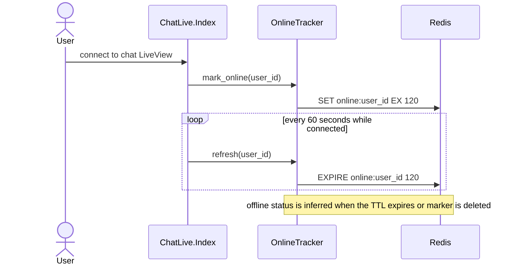
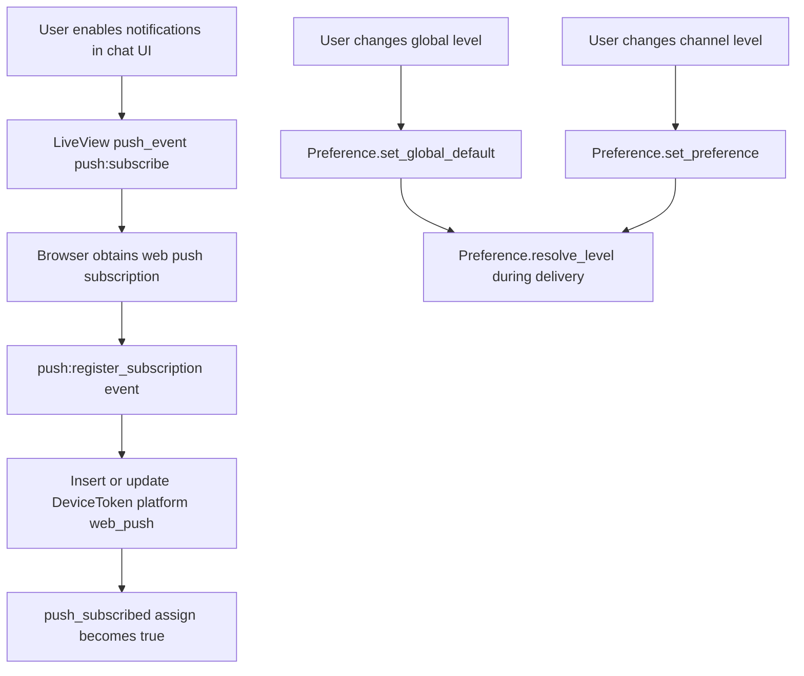
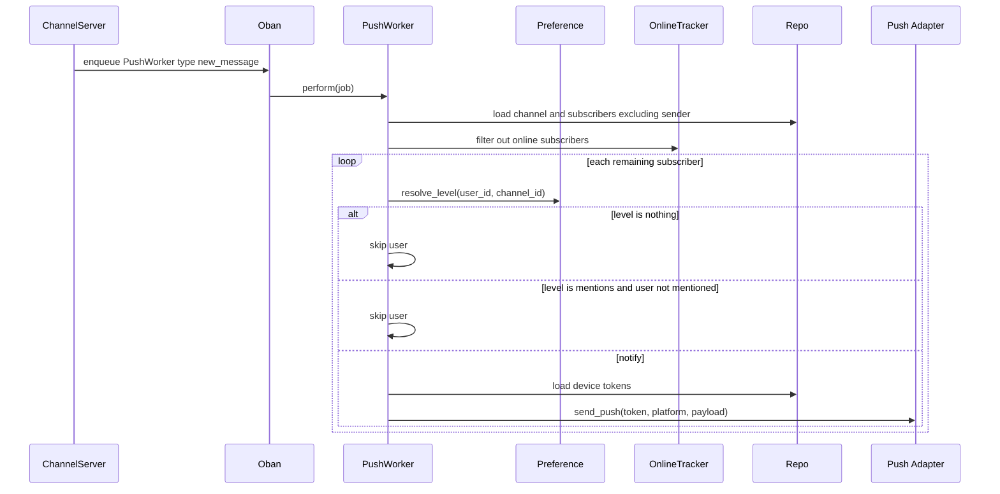
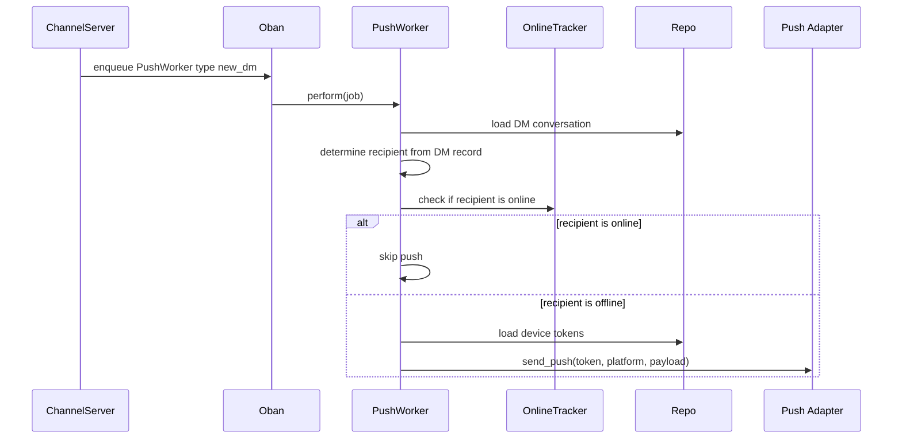
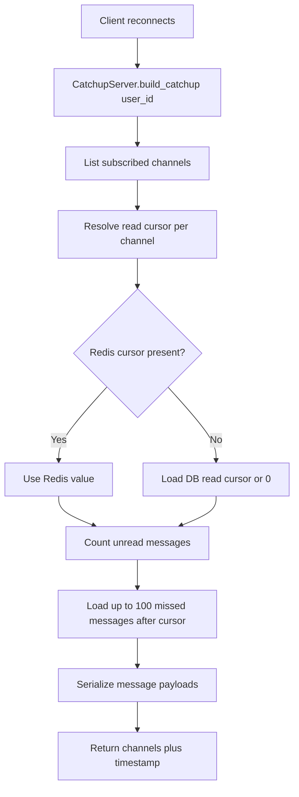

# Notifications Architecture

**Status:** Reference
**Scope:** Presence tracking, push preferences, device subscriptions, catch-up, and push delivery

---

## 1. Overview

Slackex notifications combine several separate capabilities:

- presence tracking for online and offline awareness
- user push subscription storage
- global and per-channel notification preferences
- async push fanout for new channel messages and DMs
- reconnect catch-up generation for missed channel activity

The design tries to avoid noisy notifications while keeping reconnect and offline behavior predictable.

---

## 2. Main Components

| Component | Responsibility |
|---|---|
| `Slackex.Notifications.OnlineTracker` | Stores online markers in Redis with TTL refresh |
| `Slackex.Notifications.Preference` | Resolves global and per-channel notification levels |
| `Slackex.Notifications.DeviceToken` | Stores device tokens or web push subscriptions |
| `Slackex.Notifications.PushWorker` | Oban worker that sends push notifications for messages and DMs |
| `Slackex.Notifications.CatchupServer` | Builds reconnect payloads from read cursors and message history |
| `Slackex.Messaging.ChannelServer` | Enqueues push jobs after message batches persist |
| `SlackexWeb.ChatLive.Index` | Handles push subscription registration and user preference changes |

---

## 3. Presence Tracking

### Notes

- Presence is soft-state in Redis, not a durable database record.
- Channel and DM push delivery use presence checks to avoid notifying currently active users.
- The LiveView also queries online status for DM sidebar presentation.

---

## 4. Push Subscription And Preference Flow

### Notes

- Web push subscriptions are stored in the same `device_tokens` table as FCM and APNs tokens.
- Preferences support three levels: `all`, `mentions`, and `nothing`.
- Channel-specific preferences override the global default.

---

## 5. Channel Push Delivery Flow

### Notes

- Channel push jobs are delayed by 5 seconds when enqueued from `ChannelServer`.
- The sender is always excluded.
- Mention-only delivery uses `Slackex.Notifications.Mention` to decide whether a subscriber should be notified.

---

## 6. DM Push Delivery Flow

### Notes

- DM recipient selection is derived from the DM record, not from the caller.
- DM notifications do not use per-channel preference rules.

---

## 7. Reconnect Catch-Up Flow

### Notes

- Catch-up is a pure function module even though its name says `CatchupServer`.
- Redis is a fast path for read cursors; the database remains the fallback of record.
- This supports reconnect UX without requiring the whole message history to be reloaded.

---

## 8. Design Properties

- **Offline-aware delivery:** push fanout is gated by Redis presence state.
- **Preference-driven notifications:** global defaults and per-channel overrides reduce noise.
- **Shared token model:** web push, FCM, and APNs all use the same storage abstraction.
- **Async dispatch:** push work runs out-of-band in Oban, not in the message send path.
- **Graceful target deletion:** workers discard jobs when the channel or DM no longer exists.
- **Reconnect support:** catch-up payloads bridge the gap between offline time and resumed activity.

---

## 9. Code Map

- `lib/slackex/notifications/online_tracker.ex`
- `lib/slackex/notifications/preference.ex`
- `lib/slackex/notifications/device_token.ex`
- `lib/slackex/notifications/push_worker.ex`
- `lib/slackex/notifications/catchup_server.ex`
- `lib/slackex/messaging/channel_server.ex`
- `lib/slackex_web/live/chat_live/index.ex`

---

## 10. Related Tests

- `test/slackex/notifications_test.exs`
- `test/slackex/notifications/push_notifications_integration_test.exs`
- `test/slackex/notifications/catchup_server_test.exs`
- `test/slackex/notifications/online_tracker_test.exs`
