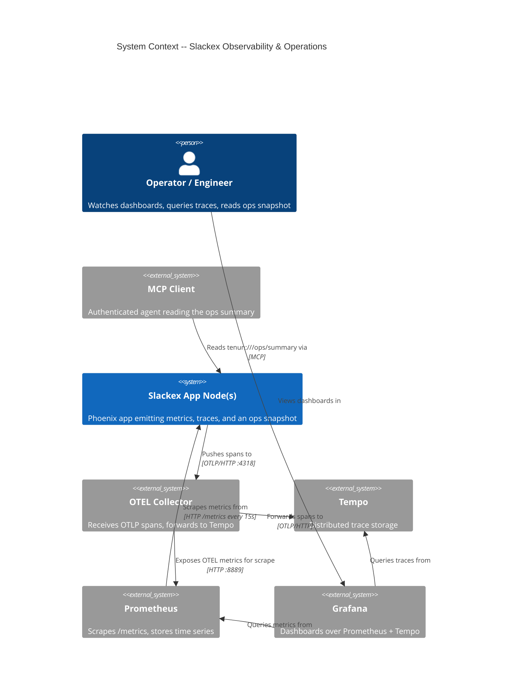
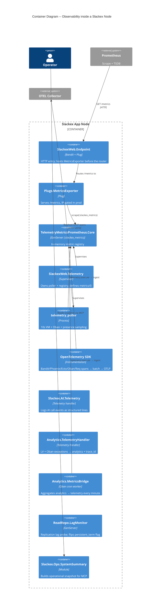
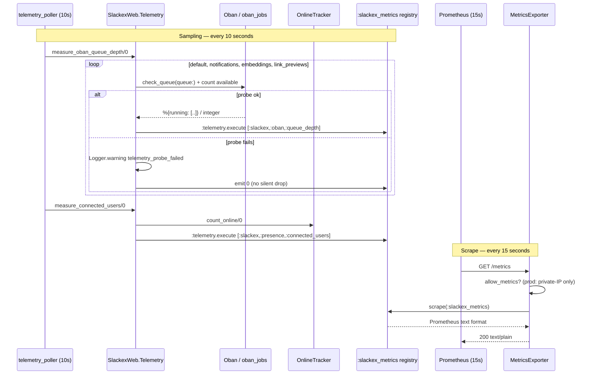
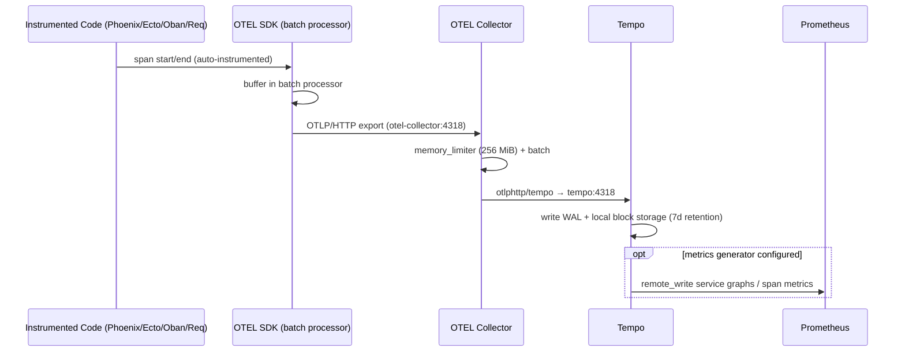

# Observability & Operations Architecture

**Status:** Reference
**Scope:** `Slackex.Ops` operational snapshot, the OpenTelemetry trace pipeline (app → Collector → Tempo), Prometheus metrics (`/metrics` endpoint + telemetry pollers), Grafana dashboards, metric-name contract tests, replication-lag telemetry, and the pinned infrastructure stack. The operational runbook is `docs/runbooks/observability.md`.

---

## 1. Overview

Slackex exposes its runtime through three independent data paths, each with a different consumer and a different failure profile:

1. **Metrics (Prometheus pull).** Each app node accumulates telemetry into an in-memory registry (`TelemetryMetricsPrometheus.Core`) and serves it as Prometheus text at `/metrics`. Prometheus scrapes that endpoint every 15s. A `telemetry_poller` ticks every 10s to sample VM, Oban, and presence state into the registry.
2. **Traces (OTLP push).** OpenTelemetry auto-instruments HTTP (Bandit), Phoenix, Ecto, Oban, and outbound `Req` calls. Spans are batched and pushed over OTLP/HTTP to an OpenTelemetry Collector, which forwards them to Tempo for storage.
3. **Operational snapshot (pull-on-demand).** `Slackex.Ops.SystemSummary` builds a small, low-sensitivity JSON snapshot (active channel servers, online users, per-queue running counts) exposed to authenticated MCP clients at `tenun:///ops/summary`.

The design separates the **latency-sensitive metrics pull** (no DB load on scrape — analytics aggregates are pre-computed once per minute by `Slackex.Analytics.MetricsBridge`) from the **push-based trace path** (non-blocking; if the Collector is down the app keeps serving and spans are simply lost). Two cross-cutting rules dominate the code: **never let a probe fail silently** (every measurement that can't produce data logs a warning and emits a zero rather than crashing the poller), and **pin every infrastructure image** (a `:latest` Tempo once pulled v3 and silently broke the config schema).

A recurring theme below is the distinction between **wired** instrumentation (a telemetry event that is consumed into a Prometheus metric or a log line) and **emission-only** instrumentation (an event that is published but has no metric definition or handler consuming it yet). Several events fall into the second category; they are flagged explicitly because that gap is the most useful thing an operator can know.

---

## 2. C4 Diagrams

### 2.1 System Context



#### Notes

- The metrics path is **pull** (Prometheus reaches into the app); the trace path is **push** (the app reaches out to the Collector). This is why a Prometheus outage loses nothing scraped during the gap once it recovers, while a Collector outage permanently drops in-flight spans.
- Tempo can also **remote-write** generated metrics back into Prometheus (service graphs, span metrics) — see §6.

### 2.2 Container Diagram



#### Notes

- `SlackexWeb.Telemetry` is the supervisor that owns the registry and the poller; it defines every exported metric in `metrics/0` (`lib/slackex_web/telemetry.ex`).
- The two telemetry **handlers** (`Slackex.AI.Telemetry`, `Slackex.Analytics.TelemetryHandler`) are attached, not supervised — they react to events. The AI handler emits **log lines only**, not Prometheus metrics.

---

## 3. How To Read This Document

- Start with the **System Context** diagram for the three external dependencies (Collector/Tempo, Prometheus, Grafana) and the two consumers (operators, MCP agents).
- Use the **Container Diagram** to see which module owns the registry, the poller, the trace SDK setup, and the ops snapshot.
- Use the **sequence diagrams** (§5–§6) for runtime ordering: when the poller fires, when a scrape reads the registry, when a span is exported.
- Use **§7 Wired vs. Emission-Only** to know what is actually visible in Prometheus/Grafana today versus what is published but not yet consumed.

### Quick Legend

| Diagram Type | Best For | Read It As |
|---|---|---|
| C4 System Context | System boundaries | Slackex and its observability dependencies |
| C4 Container | Internal architecture | Modules that produce/serve telemetry inside a node |
| Sequence Diagram | Request/event flow | Time-ordered interactions for scrape and trace export |

### Terms Used Here

| Term | Meaning |
|---|---|
| Registry | The in-memory `TelemetryMetricsPrometheus.Core` instance named `:slackex_metrics` |
| Scrape | Prometheus pulling `/metrics` from a node every 15s |
| Poller | The `telemetry_poller` that samples VM/Oban/presence every 10s |
| Probe | A single measurement function (e.g. queue depth) that can succeed or fail |
| Span | One unit of an OpenTelemetry trace |
| Wired metric | A telemetry event consumed into a Prometheus metric or a log line |
| Emission-only event | A published event with no metric or handler consuming it yet |

---

## 4. Main Components

| Component | Responsibility |
|---|---|
| `SlackexWeb.Telemetry` | Supervisor; defines `metrics/0`, starts the poller and the Prometheus registry, attaches `Analytics.TelemetryHandler` |
| `SlackexWeb.Plugs.MetricsExporter` | Serves `/metrics`; IP-gates to private networks in prod |
| `Slackex.AI.Telemetry` | Attaches handlers for `[:slackex, :ai, :*]` events; logs structured AI-call lines |
| `Slackex.Analytics.TelemetryHandler` | Captures LiveView + Oban exceptions, attaches OTEL `trace_id`, records analytics |
| `Slackex.Analytics.MetricsBridge` | Oban cron worker; re-emits analytics aggregates as telemetry once per minute |
| `Slackex.ReadRepo.LagMonitor` | GenServer probing replication lag; emits lag telemetry, flips the read-routing flag |
| `Slackex.Ops.SystemSummary` | Builds the MCP operational snapshot (`tenun:///ops/summary`) |
| `infra/` config + `docker-compose*.yml` | Collector, Prometheus, Tempo, Grafana definitions (pinned versions) |

---

## 5. Metrics Scrape Flow



### Notes

- The poller (10s) and the scrape (15s) are decoupled: the registry holds the most recent sampled values; a scrape just serializes current state, so it never queries the DB.
- `measure_oban_queue_depth/0` iterates `[:default, :notifications, :embeddings, :link_previews]` only. **Queue depth probes have two independent failure modes**: `running` comes from `Oban.check_queue/1` (whose `running` key is a *list* — counted via `length/1`), while `available` comes from a raw `SELECT count(*)` on `oban_jobs` (there is **no `available` key** in `check_queue/1`'s return, a fact that has silently emitted zero metrics before).
- Each probe is wrapped in `rescue`/`catch`; a failure logs `telemetry_probe_failed probe=… code=…` and emits `0`. This is the project's "no silent rescue in periodic measurements" rule made concrete (`lib/slackex_web/telemetry.ex`).
- `/metrics` placement is **before the router** in the endpoint, so it bypasses session/CSRF/auth (scrapers carry no cookies). In prod it returns `403` to any non-private IP — including IPv4-mapped IPv6 addresses, which Bandit's IPv6 listener produces (`lib/slackex_web/plugs/metrics_exporter.ex`).

---

## 6. Trace Export Flow



### Notes

- Instrumentation is wired in `lib/slackex/application.ex` **before** the supervision children start, because span exporters must be registered before any process emits a span: `OpentelemetryBandit.setup()`, `OpentelemetryPhoenix.setup(adapter: :bandit)`, `OpentelemetryEcto.setup([:slackex, :repo])`, `OpentelemetryOban.setup()`, and `Req.default_options(plugins: [OpentelemetryReq])`.
- The Phoenix instrumentation requires `adapter: :bandit` — this is the Bandit-specific wiring, not Cowboy.
- Exporter target differs by environment: `dev` exports to **stdout** (`{:otel_exporter_stdout, []}`), `test` uses `:none`, `prod` uses `:otlp` over HTTP/protobuf to `http://otel-collector:4318` (`config/prod.exs`). `runtime.exs` allows an override via `OTEL_EXPORTER_OTLP_ENDPOINT`.
- Tempo is **configured with** a `metrics_generator` (service-graph and span-metric processors) that remote-writes to `http://prometheus:9090/api/v1/write`; Prometheus enables the receiver via `--web.enable-remote-write-receiver` (present in both compose files). Whether the generator is active end-to-end depends on Tempo per-tenant overrides — the config wires the path, it does not by itself guarantee generated series.

---

## 7. Wired vs. Emission-Only Instrumentation

This is the most operationally important section: not every telemetry event reaches a dashboard.

| Telemetry event / source | Consumed by | Visible where |
|---|---|---|
| Phoenix endpoint/router/channel/socket durations | `metrics/0` distributions | Prometheus histograms |
| `slackex.repo.query.*` (total/query/queue/decode/idle) | `metrics/0` distributions | Prometheus histograms |
| `vm.memory.*`, `vm.system_counts.*`, `vm.total_run_queue_lengths.*` | `metrics/0` `last_value` | Prometheus gauges |
| `[:slackex, :oban, :queue_depth]` (running/available) | `metrics/0` `last_value` tagged by `queue` | Prometheus gauges |
| `[:slackex, :presence, :connected_users]` | `metrics/0` `last_value` | Prometheus gauge |
| `[:tenun, :analytics, :*]` (page_views/errors/feature_usage/active_users) | `metrics/0` `last_value`, fed by `MetricsBridge` | Prometheus gauges |
| `[:slackex, :ai, :completion / :embedding / :rerank / :moderation]` | `Slackex.AI.Telemetry` handler | **Log lines only** — no Prometheus metric |
| `[:phoenix, :live_view, :handle_event, :exception]`, `[:oban, :job, :exception]` | `Analytics.TelemetryHandler` | Analytics store (`server_error` / `oban_error`), with OTEL `trace_id` |
| `[:slackex, :read_repo, :lag_fallback]`, `[:slackex, :read_repo, :lag_null_standby]` | **nothing** | **Emission-only** — no metric, no handler |

### Known gaps (verified against source)

- **The `:analytics` Oban queue is not monitored.** Oban is configured with **six** queues — `default, notifications, embeddings, link_previews, analytics, facets` (`config/config.exs`) — but the poller samples only **four**. The `:analytics` queue (where `MetricsBridge` itself runs) and `:facets` have **no queue-depth metric** in Prometheus. A backlog there is currently invisible to the dashboards.
- **Replication-lag telemetry is emitted but unconsumed.** `LagMonitor` publishes `[:slackex, :read_repo, :lag_fallback]` / `:lag_null_standby`, but no `metrics/0` definition or handler consumes them. The lag signal *does* drive read routing via a `:persistent_term` flag (operationally effective), but is **not graphed** — to alert on replica lag, an instrumentation step is still needed.
- **AI calls are logged, not metered.** `[:slackex, :ai, :*]` produce `[AI] …` log lines with model/token/duration; there is no rate, error, or latency *metric* for AI calls.

These are leads for future instrumentation work, recorded so the gap isn't rediscovered the hard way.

---

## 8. The Operational Snapshot (`Slackex.Ops`)

`Slackex.Ops.SystemSummary.snapshot/0` (`lib/slackex/ops/system_summary.ex`) returns a small map consumed by the MCP server at `tenun:///ops/summary` (`lib/slackex_web/mcp/server.ex`):

```
%{
  "generated_at"          => ISO8601 UTC,
  "node"                  => node(),
  "active_channel_servers"=> count,
  "online_users_count"    => count,
  "queue_running_counts"  => %{"default" => n, "notifications" => n, "embeddings" => n, "link_previews" => n},
  "partial_failures"      => %{"active_channel_servers" => nil|reason, "online_users" => nil|reason, "queues" => nil|reason}
}
```

Design properties:

- **Provider-injectable.** Each data source (`channel_count`, `count_online`, `check_queue`) is read through `Application.get_env(:slackex, Slackex.Ops.SystemSummary, [])` with a default provider module — so tests substitute stubs without touching Oban or Presence.
- **Degrades partially, never crashes.** Each probe is wrapped in `rescue`/`catch`; on failure it logs `ops_snapshot_probe_failed …`, records the reason under `partial_failures`, and falls back to zeros. An MCP client therefore always gets a well-formed snapshot that *tells it which parts are degraded* rather than an error.
- **Low sensitivity by design.** It exposes counts and node identity only — no message content, no user PII — so it is safe for an authenticated agent to read.

---

## 9. Replication-Lag Monitoring

`Slackex.ReadRepo.LagMonitor` is a supervised GenServer (started in `application.ex`) whose **operational** role belongs here; its **read-routing decision tree** belongs to the read-model doc (cross-linked below).

- Every 5s it runs `SELECT EXTRACT(EPOCH FROM (now() - pg_last_xact_replay_timestamp()))::float` on `Slackex.ReadRepo`.
- If lag exceeds 5s, the result is `NULL` on a real standby, or the query errors, it sets `:persistent_term` flag `:slackex_read_repo_lag_exceeded` so reads fall back to the primary. This is the **conservative** posture: any uncertainty routes to primary.
- In "no-replica mode" (ReadRepo and Repo resolve to the same database, detected at `init/1`) monitoring is skipped entirely to avoid noise.
- Telemetry events `[:slackex, :read_repo, :lag_fallback]` (with `lag_seconds`) and `[:slackex, :read_repo, :lag_null_standby]` are emitted — but, as noted in §7, are **not yet wired to a metric**.

See `docs/architecture/caching-and-read-model.md` for `repo_for_age/1` and the Snowflake-age routing logic.

---

## 10. Key Design Properties

- **Pull metrics, push traces.** Each path's failure mode follows from its direction (see §11).
- **No silent failure in periodic work.** Every poller probe and every ops probe logs a warning on failure and returns a safe zero, never a silent `:ok`.
- **Pre-aggregation off the scrape path.** `MetricsBridge` computes analytics aggregates once per minute (Oban cron, `unique: [period: 55]` for single-node execution across the cluster) so scrapes stay cheap.
- **Provider injection for testability.** Both `SlackexWeb.Telemetry` and `Slackex.Ops.SystemSummary` read their data providers from config, enabling deterministic stubs.
- **Contract-tested metric names.** Library quirks (no unit suffixes; `summary` unsupported; `distribution` needs explicit buckets) are pinned by tests so a dependency upgrade that renames a metric fails CI, not a dashboard.
- **Pinned infrastructure.** Tempo `2.7.2`, Prometheus `v3.12.0`, Grafana `13.0.1`, OTEL Collector `0.153.0` — never `:latest`.

---

## 11. Failure Modes & Resilience

| Failure | Behavior | Blast radius |
|---|---|---|
| A poller probe (Oban/Presence) throws | Logs `telemetry_probe_failed`, emits `0`, next 10s tick retries | Single metric reads 0 transiently; app unaffected |
| Prometheus down | Scrapes stop; registry keeps current values in memory | No data loss for samples taken after recovery; no app impact |
| `/metrics` requested from a public IP (prod) | `403 Forbidden` | Scrape from outside the private network fails by design |
| OTEL Collector down | Spans fail to export and are dropped (export is non-blocking via the batch processor); app keeps serving | Traces missing for the outage window; no request-path impact |
| Tempo down | Collector cannot forward; spans lost after buffer | Trace history gap; no app impact |
| `MetricsBridge` run fails | `max_attempts: 1`, no retry — that minute's analytics gauges go stale | Analytics gauges only; best-effort by design |
| Replica lag exceeds threshold / lag query errors | `:persistent_term` flag set; reads fall back to primary | Primary absorbs read load until lag clears; correctness preserved |
| Grafana datasource UID mismatch | Panels show "datasource not found" | Dashboards only; requires deleting the Grafana volume to re-provision UIDs |

The observability stack is intentionally **non-essential to request serving**: instrumentation setup uses `_ =` discards at boot and span export is fire-and-forget, so an observability-layer fault degrades visibility without cascading into the chat path. (Contrast with the essential supervision tree in `docs/architecture/system-landscape.md`.)

---

## 12. Infrastructure & Configuration

Memory budget on the 20GB LXC host (alongside 2× 2GB app containers): Collector 256MB, Prometheus 256MB, Tempo 256MB, Grafana 128MB — **≈896MB** total.

| Component | Image (pinned) | Config file | Key facts |
|---|---|---|---|
| OTEL Collector | `otel/opentelemetry-collector-contrib:0.153.0` | `infra/otel-collector-config.yaml` | OTLP gRPC `:4317` + HTTP `:4318`; `memory_limiter` 256 MiB; traces → Tempo, metrics → Prometheus exporter `:8889` (namespace `slackex`) |
| Prometheus | `prom/prometheus:v3.12.0` | `infra/prometheus.yml` (prod) / `infra/prometheus.dev.yml` | 15s scrape; targets `app1:4000`, `app2:4000`, `otel-collector:8889`, self; `--web.enable-remote-write-receiver`; prod 14d/2GB retention |
| Tempo | `grafana/tempo:2.7.2` | `infra/tempo.yaml` | OTLP `:4318`/`:4317`; local block storage; `block_retention: 168h`; metrics generator remote-writes to Prometheus. **Pinned to 2.7.2 — v3 removed config fields and breaks silently** |
| Grafana | `grafana/grafana:13.0.1` | `infra/grafana/provisioning/...` | Datasources provisioned with **explicit UIDs** (`prometheus`, `tempo`); Tempo wired to Prometheus for traces-to-metrics + service map; `GRAFANA_ADMIN_PASSWORD` env (defaults `admin`) |

Library quirks that the code (and contract tests) account for:

- **No unit suffixes.** `TelemetryMetricsPrometheus.Core` emits `vm_memory_total`, not `vm_memory_total_bytes`; `phoenix_endpoint_stop_duration_bucket`, not `…_milliseconds_bucket`.
- **`summary` unsupported.** Use `distribution` (→ histogram) or `last_value` (→ gauge).
- **`distribution` requires explicit buckets.** `metrics/0` supplies `reporter_options: [buckets: …]` for every distribution or the registry GenServer crashes at startup. HTTP buckets: `[5,10,25,50,100,250,500,1000,2500,5000]` ms; DB buckets: `[1,5,10,25,50,100,250,500,1000]` ms.

---

## 13. Metric-Name Contract Tests

Because Grafana PromQL queries depend on exact metric names produced by a third-party library, those names are asserted at CI time.

- `test/slackex_web/plugs/metrics_exporter_test.exs` drives `:telemetry.execute` for representative events, calls `GET /metrics`, and asserts the **actual** serialized names: `vm_memory_total`, `vm_system_counts_process_count`, `vm_total_run_queue_lengths_total`, `slackex_repo_query_total_time_bucket{`, `slackex_presence_connected_users_count`, `slackex_oban_queue_depth_running`, `slackex_oban_queue_depth_available`, `phoenix_endpoint_stop_duration_bucket{` (no unit suffixes).
- `test/slackex_web/telemetry_test.exs` exercises probe-failure handling via injected `QueueProvider` / `OnlineProvider` stubs, verifying failures are logged (not swallowed) and that a failed probe emits `0`.
- `test/slackex/ops/system_summary_test.exs` and `test/slackex_web/mcp/ops_resources_test.exs` cover the snapshot shape and its MCP exposure.

A dependency upgrade that renames a metric breaks these tests rather than silently blanking a dashboard panel.

---

## 14. Code Map

| File | Responsibility |
|---|---|
| `lib/slackex_web/telemetry.ex` | Metric definitions (`metrics/0`), poller measurements, probe failure logging, provider injection |
| `lib/slackex_web/plugs/metrics_exporter.ex` | `/metrics` endpoint; private-network IP gating |
| `lib/slackex/application.ex` | OTEL instrumentation setup at boot; supervises Telemetry + LagMonitor |
| `lib/slackex/ai/telemetry.ex` | AI-call telemetry handlers (log lines) |
| `lib/slackex/analytics/telemetry_handler.ex` | LiveView/Oban exception capture + OTEL `trace_id` correlation |
| `lib/slackex/analytics/metrics_bridge.ex` | Minute-cadence analytics → telemetry re-emission |
| `lib/slackex/read_repo/lag_monitor.ex` | Replication-lag probe + read-routing flag + lag telemetry |
| `lib/slackex/ops/system_summary.ex` | MCP operational snapshot builder |
| `lib/slackex_web/mcp/server.ex` | Exposes `tenun:///ops/summary` |
| `infra/otel-collector-config.yaml` | Collector pipelines (OTLP → Tempo / Prometheus) |
| `infra/prometheus.yml`, `infra/prometheus.dev.yml` | Scrape targets (prod / dev) |
| `infra/tempo.yaml` | Trace storage + metrics generator |
| `infra/grafana/provisioning/datasources/datasources.yaml` | Prometheus + Tempo datasources (pinned UIDs) |
| `docker-compose.observability.yml`, `docker-compose.prod.yml` | Pinned stack definitions |

---

## 15. Related Documents

- `docs/runbooks/observability.md` — operational gotchas, local startup, deploy steps, troubleshooting table
- `docs/architecture/analytics.md` — the analytics store and aggregates that `MetricsBridge` re-emits
- `docs/architecture/caching-and-read-model.md` — `repo_for_age/1` routing and the read-replica model `LagMonitor` guards
- `docs/architecture/message-pipeline-and-persistence.md` — Oban pipeline whose queues the poller samples
- `docs/architecture/system-landscape.md` — the full supervision tree and where observability sits within it
- `docs/architecture/realtime-chat.md` — the chat hot path these metrics and traces observe
- `docs/feature/mcp-server/design/architecture.md` — how MCP clients consume `tenun:///ops/summary`
- `docs/engineering-principles.md` — project-wide deploy-safety, image-pinning, and silent-failure rules
