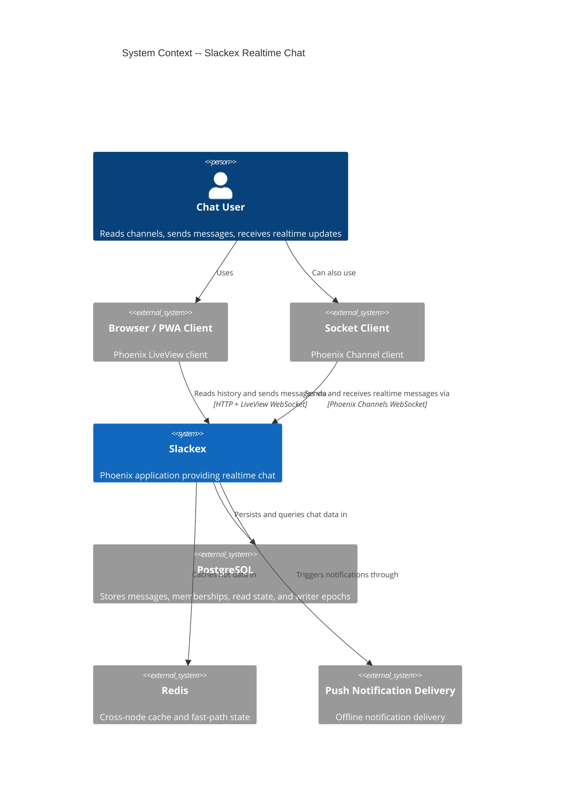
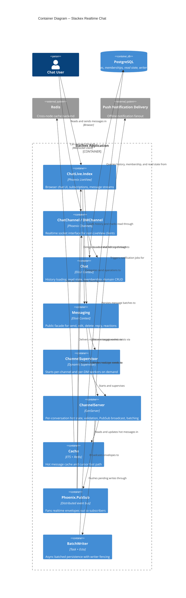
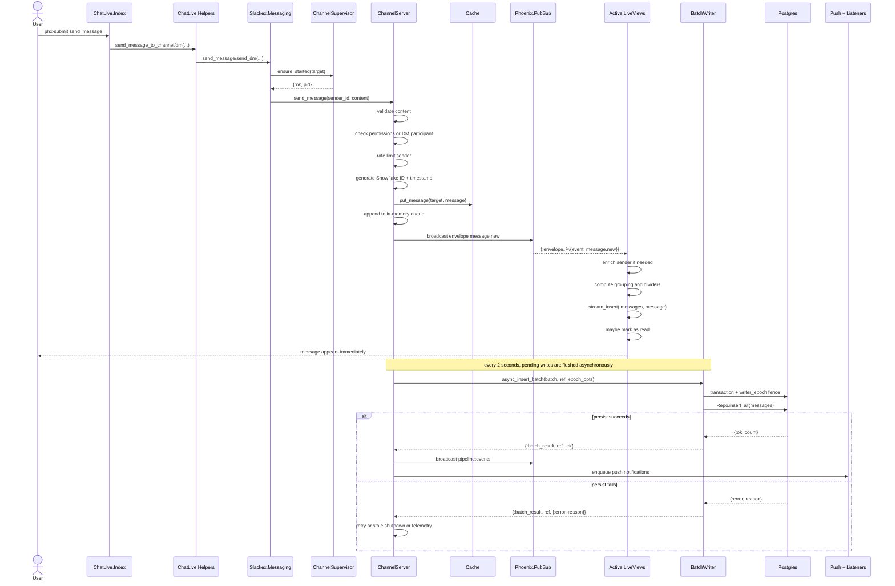
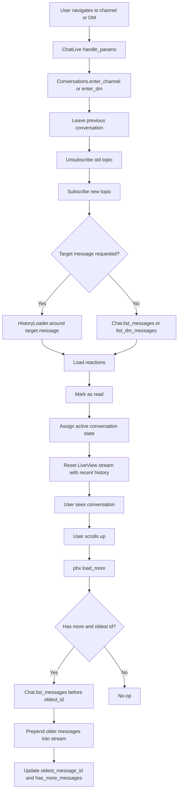
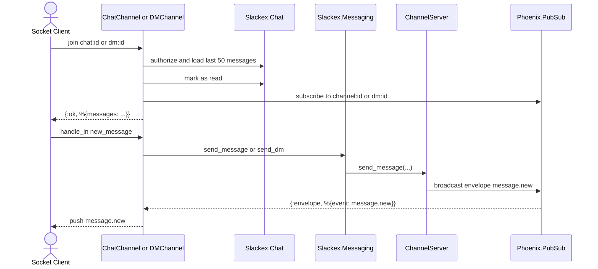

# Realtime Chat Architecture

**Status:** Reference
**Scope:** LiveView chat, Phoenix Channel clients, PubSub fanout, async persistence

---

## 1. Overview

Slackex routes realtime chat through a per-conversation `ChannelServer` process.
The hot path is optimized for fast user feedback:

1. User sends a message from LiveView or a Phoenix Channel client.
2. `Slackex.Messaging` ensures the target process exists.
3. `ChannelServer` validates, rate-limits, caches, and immediately broadcasts the message over PubSub.
4. Subscribers update the UI before the database write completes.
5. Persistence happens asynchronously in batched writes through `BatchWriter`.

This splits the user-visible realtime path from the durability path while keeping a single backend pipeline for channels and DMs.

---

## 2. C4 Diagrams

### 2.1 System Context

### 2.2 Container Diagram

These diagrams show the system at a higher level than the sequence diagrams below.

---

## 3. How To Read This Document

- Start with the **System Context** diagram to see who uses realtime chat and which external systems Slackex depends on.
- Move to the **Container Diagram** to understand which internal modules own UI, routing, hot state, caching, fanout, and persistence.
- Use the **sequence diagrams** when you want runtime behavior: who calls whom, when PubSub fires, and when persistence happens.
- Use the **history flowchart** when you want to understand navigation, initial message loading, and upward pagination.

### Quick Legend

| Diagram Type | Best For | Read It As |
|---|---|---|
| C4 System Context | System boundaries | Users and external dependencies around Slackex |
| C4 Container | Internal architecture | Major runtime building blocks inside the app |
| Sequence Diagram | Request/event flow | Time-ordered interactions between components |
| Flowchart | Decision paths | Branching logic for navigation and history loading |

### Terms Used Here

| Term | Meaning |
|---|---|
| Conversation | Either a channel or a DM conversation |
| Target | The tuple identifying a conversation, such as `{:channel, id}` or `{:dm, id}` |
| Envelope | The normalized PubSub event payload used for realtime fanout |
| Hot path | The latency-sensitive path that updates the UI immediately |
| Durability path | The asynchronous batch write path that persists messages to PostgreSQL |
| Writer fencing | Epoch checks that prevent stale `ChannelServer` instances from writing |

---

## 4. Main Components

| Component | Responsibility |
|---|---|
| `SlackexWeb.ChatLive.Index` | Handles LiveView events, subscriptions, and message stream updates |
| `SlackexWeb.ChatLive.Conversations` | Enters/leaves channels and DMs, loads history, manages pagination |
| `SlackexWeb.ChatLive.Helpers` | Thin helpers for send/typing flows and stream updates |
| `Slackex.Messaging` | Public facade for send/edit/delete/reaction/reply operations |
| `Slackex.Messaging.ChannelSupervisor` | Starts per-channel and per-DM `ChannelServer` processes on demand |
| `Slackex.Messaging.ChannelServer` | Validates messages, maintains in-memory queue, broadcasts PubSub events, batches writes |
| `Slackex.Pipeline.BatchWriter` | Persists message batches with writer-epoch fencing |
| `Phoenix.PubSub` | Fans out realtime events to LiveViews, Phoenix Channels, and other subscribers |
| `Slackex.Chat` | Loads history, marks read state, and performs domain operations |

---

## 5. LiveView Send Path

### Notes

- UI updates happen on PubSub delivery, not after the database write.
- The same `ChannelServer` path is used for both channels and DMs.
- Batched persistence reduces write overhead while preserving a responsive send path.

---

## 6. Conversation Entry And History Load

### Notes

- Realtime delivery and history loading are separate paths.
- Initial history comes from `Slackex.Chat`, while new messages arrive over PubSub.
- Targeted navigation can load messages around a specific message ID for deep links.

---

## 7. Phoenix Channel Client Path

### Notes

- Phoenix Channel clients reuse the same backend messaging pipeline as LiveView.
- This keeps authorization, rate limiting, and persistence behavior consistent across clients.

---

## 8. Key Design Properties

- **Fast feedback:** users see messages on PubSub broadcast before persistence completes.
- **Single realtime coordinator per conversation:** `ChannelServer` owns hot state for an active channel or DM.
- **Shared backend path:** LiveView and Phoenix Channel clients both use `Slackex.Messaging`.
- **Bounded in-memory state:** recent messages are kept in a capped queue for fast reads.
- **Async durability:** writes are batched through `BatchWriter` instead of blocking the send path.
- **Writer fencing:** database epoch checks prevent stale writers from persisting after failover or ownership changes.

---

## 9. Code Map

- `lib/slackex_web/live/chat_live/index.ex`
- `lib/slackex_web/live/chat_live/conversations.ex`
- `lib/slackex_web/live/chat_live/helpers.ex`
- `lib/slackex_web/channels/chat_channel.ex`
- `lib/slackex_web/channels/dm_channel.ex`
- `lib/slackex/messaging/messaging.ex`
- `lib/slackex/messaging/channel_server.ex`
- `lib/slackex/pipeline/batch_writer.ex`
- `lib/slackex/chat/chat.ex`

---

## 10. Related Documents

- `docs/feature/mcp-server/design/architecture.md` - how external agents and SSE subscribers consume the messaging system
- `docs/feature/markdown-rendering/design/architecture.md` - how message content moves from storage to safe render-time HTML
- `docs/runbooks/observability.md` - metrics, traces, and operational visibility for the realtime system
- `docs/engineering-principles.md` - project-wide rules around deploy safety, test isolation, and production hardening
- `docs/design/information-architecture.md` - UI navigation model for channels, DMs, thread panels, and in-chat transitions
