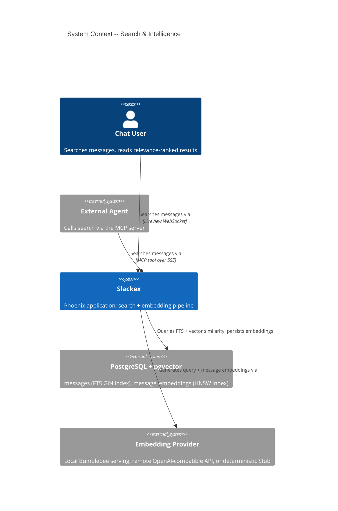
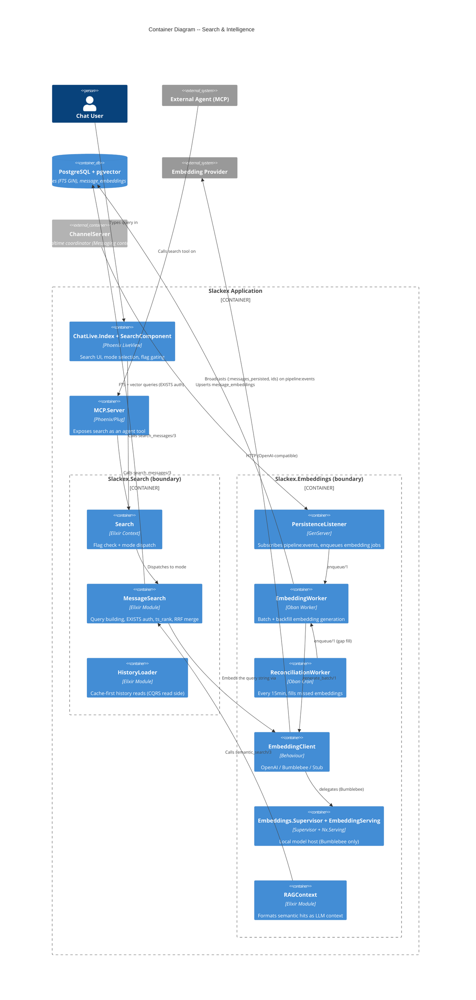
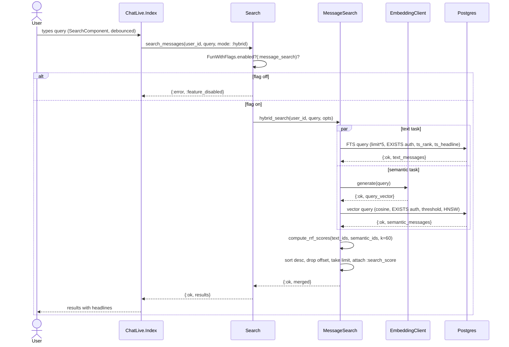
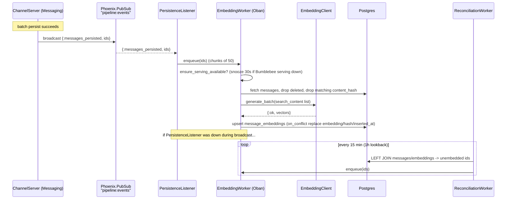
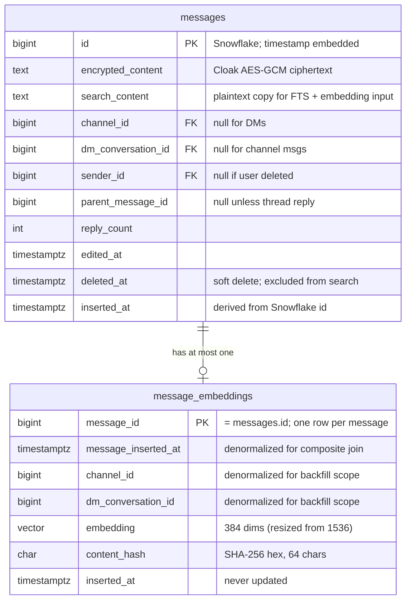

# Search & Intelligence Architecture

**Status:** Reference
**Scope:** `Slackex.Search` context (full-text, semantic, and hybrid RRF search; authorization; ranking; the `:message_search` flag) and the `Slackex.Embeddings` context that produces the vectors search reads.

---

## 1. Overview

Search & Intelligence turns the message corpus into something queryable by **keyword** and by **meaning**, while respecting per-user access control. It spans two boundaries:

- `Slackex.Search` — the read side. Given a user and a query string, returns the messages that user is allowed to see, ranked by relevance.
- `Slackex.Embeddings` — the write side. Asynchronously generates and stores a vector embedding per message so that semantic search has something to match against.

The two are deliberately decoupled. Search reads precomputed embeddings from the `message_embeddings` table; it never generates message embeddings inline (it only embeds the *query*). Embedding production is event-driven and runs in the background through Oban, so a slow or failing embedding provider never blocks the send path or the search path.

Three search modes share one query-building and authorization core (`Slackex.Search.MessageSearch`):

| Mode | Public API | UI label | What it does |
|---|---|---|---|
| `:text` | `MessageSearch.text_search/3` | "Exact words" | PostgreSQL FTS (`tsvector`/`tsquery`) over the plaintext `search_content` column, ranked by `ts_rank` |
| `:semantic` | `MessageSearch.semantic_search/3` | "Meaning" | pgvector cosine similarity over precomputed embeddings, filtered by a similarity threshold |
| `:hybrid` (default) | `MessageSearch.hybrid_search/3` | "Best match" | Runs FTS and semantic in parallel, fuses the two ranked lists with Reciprocal Rank Fusion (RRF) |

The UI labels are defined in `lib/slackex_web/live/chat_live/search_component.ex` (`mode_label/1`).

The whole subsystem sits behind the `:message_search` FunWithFlags feature flag, gated at both the context entry point and the LiveView surface.

---

## 2. C4 Diagrams

### 2.1 System Context

### 2.2 Container Diagram

These diagrams show the subsystem at a higher level than the sequence diagrams below.

---

## 3. How To Read This Document

- Start with the **System Context** to see who searches and which external systems are involved.
- Use the **Container Diagram** to see the split between the read side (`Search`) and the write side (`Embeddings`), and the PubSub bridge between them.
- Use the **sequence diagrams** for runtime behaviour: how a hybrid query fans out, and how a new message ends up with an embedding.
- See `deep-dive-hybrid-rrf-search.md` for the line-by-line RRF math and query-plan analysis (companion deep dive).

### Terms Used Here

| Term | Meaning |
|---|---|
| FTS | Full-text search via PostgreSQL `to_tsvector`/`plainto_tsquery` |
| `search_content` | Plaintext companion column for the encrypted message body, used for FTS and embedding input |
| Embedding | A fixed-length float vector representing a message's meaning (384 dimensions) |
| RRF | Reciprocal Rank Fusion: rank-based score fusion, `1 / (k + rank)`, `k = 60` |
| HNSW | Hierarchical Navigable Small World — pgvector's approximate nearest-neighbour index |
| Headline | A `ts_headline`-generated snippet with `<mark>` tags, carried in a virtual field |

---

## 4. Main Components

| Component | File | Responsibility |
|---|---|---|
| `Slackex.Search` | `lib/slackex/search.ex` | Flag check (`:message_search`); dispatch by `:mode`; returns `{:error, :feature_disabled}` when off |
| `Slackex.Search.MessageSearch` | `lib/slackex/search/message_search.ex` | All three search queries, EXISTS authorization, `ts_rank`/cosine ordering, headline generation, RRF merge |
| `Slackex.Search.HistoryLoader` | `lib/slackex/search/history_loader.ex` | Cache-first recent history; direct-DB `around/3` and `before/3` (CQRS read side, not query search) |
| `Slackex.Chat.Message` | `lib/slackex/chat/message.ex` | Schema: encrypted `content`, plaintext `search_content`, virtual `:headline`/`:similarity`/`:search_score` |
| `Slackex.Embeddings.MessageEmbedding` | `lib/slackex/embeddings/message_embedding.ex` | Schema: one vector row per message, keyed on `message_id`, with `content_hash` for change detection |
| `Slackex.Embeddings.EmbeddingClient` | `lib/slackex/embeddings/embedding_client.ex` | Behaviour (`generate/1`, `generate_batch/1`, `dimensions/0`) + delegation to the configured impl |
| `Slackex.Embeddings.EmbeddingWorker` | `lib/slackex/embeddings/embedding_worker.ex` | Oban worker: batch embedding + conversation backfill, content-hash dedup, upsert |
| `Slackex.Embeddings.PersistenceListener` | `lib/slackex/embeddings/persistence_listener.ex` | Subscribes `pipeline:events`; enqueues `EmbeddingWorker` on `{:messages_persisted, ids}` |
| `Slackex.Embeddings.ReconciliationWorker` | `lib/slackex/embeddings/reconciliation_worker.ex` | Oban cron (every 15 min, 1-hour lookback): durability net for missed events |
| `Slackex.Embeddings.RAGContext` | `lib/slackex/embeddings/rag_context.ex` | Runs semantic search, formats hits into a token-budgeted LLM context string |

---

## 5. Hybrid Search Flow

This is the default mode (`:hybrid`). It fans out two independent queries and fuses them with RRF.

### Why RRF instead of blending scores

`ts_rank` (a log-scaled relevance score) and cosine similarity (a 0–1 linear distance) live on incomparable scales. Normalising them into a single weighted sum would require arbitrary, hand-tuned weights. RRF sidesteps this entirely by discarding the raw scores and operating only on **rank position**: a message at rank *r* in a list contributes `1 / (k + r)`. A message present in both lists gets the **sum** of its two contributions, so cross-modal agreement is rewarded without any score normalisation. `k = 60` is the Cormack et al. standard (`@rrf_k` in `message_search.ex`); larger *k* flattens the curve so lower-ranked items still contribute.

Each source is queried for `limit * 5` candidates (`source_opts`) so the fusion has enough depth to re-rank meaningfully before the final `limit`/`offset` is applied.

### Merge tie-break (verified behaviour)

`merge_with_rrf/4` builds its id→message lookup by folding `text_messages ++ semantic_messages` through `Map.put_new/3`. Because `Map.put_new` keeps the first value seen and text comes first, **a message present in both lists keeps its text-search struct** — it carries the FTS `:headline` and has no `:similarity` populated. The inline comment in the source claims the merge prefers semantic; the actual code prefers text. Documented here as a likely discrepancy; not changed (this is a read-only document).

---

## 6. Embedding Production Flow

Embeddings are produced asynchronously after a message is persisted. The producer/consumer bridge runs over the `pipeline:events` PubSub topic.

### The bridge must be real, not faked

`pipeline:events` is the kind of producer→consumer bridge that has bitten this project before (an 18-hour outage where listeners subscribed to a topic nobody broadcast on). The producer is `ChannelServer` (`lib/slackex/messaging/channel_server.ex`, broadcasting `{:messages_persisted, message_ids}`); the consumer is `PersistenceListener.handle_info/2`. Note: `PersistenceListener`'s own moduledoc attributes the broadcast to "BatchWriter" — the actual `broadcast/3` call lives in `ChannelServer`. The wiring is real either way; the docstring lags the code.

### Content-hash deduplication

Each embedding row stores `content_hash = SHA-256(search_content)` (hex, 64 chars). `EmbeddingWorker.fetch_embeddable_messages/1` only re-embeds a message when it has no embedding row **or** its stored hash no longer matches the current `search_content`. This makes the worker idempotent (safe to re-enqueue) and automatically re-embeds edited messages without duplicate-key errors — the upsert uses `on_conflict: {:replace, [:embedding, :content_hash, :inserted_at]}, conflict_target: :message_id`.

---

## 7. Authorization (EXISTS, not JOINs)

Every search query (text and semantic) injects the same authorization predicate via `build_authorization_condition/2`. A user may see a message when **any** of these hold:

1. **Public channel:** `EXISTS (SELECT 1 FROM channels c WHERE c.id = m.channel_id AND c.is_private = false)`
2. **Private channel member:** `EXISTS (... channels INNER JOIN subscriptions ... c.is_private = true AND s.user_id = ?)`
3. **DM participant:** `EXISTS (SELECT 1 FROM dm_conversations d WHERE d.id = m.dm_conversation_id AND (d.user_a_id = ? OR d.user_b_id = ?))`

**Why EXISTS and not a JOIN.** A user can reach the same message through more than one path (e.g. a public channel they are also explicitly subscribed to). A JOIN against `subscriptions`/`channels` would multiply the message row once per matching membership, duplicating results and — worse — corrupting `ts_rank` ordering and `limit`/`offset` pagination. `EXISTS` collapses each path to a boolean per message row, so rank and pagination stay correct.

**Scoped vs global.** When the caller passes `:channel_id`, `scoped_channel_authorization_filter/2` is used instead. It checks the public-channel-or-subscribed-member conditions for that one channel and **does not include the DM branch** — channel-scoped search is, by construction, never asked about DMs.

---

## 8. Key Design Properties

- **Encryption-compatible search.** Message bodies are encrypted at rest (`Slackex.Encrypted.Binary` over the `encrypted_content` column). Ciphertext cannot be FTS-indexed, so a plaintext companion column `search_content` carries a readable copy specifically for the FTS GIN index and as embedding input. It is populated by `Message.changeset`/`edit_changeset` and nulled by `delete_changeset` (soft delete also clears it from search). This is a deliberate, scoped tradeoff: search needs readable text.
- **Snowflake-derived timestamps.** `Message.inserted_at` is computed from the Snowflake ID's embedded millisecond timestamp (`put_inserted_at/1`), not from wall-clock insert time. This makes ordering deterministic and clock-skew-free, and gives the embedding join a stable `message_inserted_at` to denormalise.
- **Composite join, written for future partitioning.** The semantic query joins `on: me.message_id == m.id and me.message_inserted_at == m.inserted_at`. The `messages` table is **not currently partitioned** (`create table(:messages, ...)` has no `PARTITION BY`), so this composite key buys nothing today beyond a redundant equality. It is written this way so that range-partitioning `message_embeddings` (or `messages`) by `message_inserted_at` later would enable partition pruning **without rewriting the query**. Documented as design intent, not an active optimization.
- **Background, decoupled embeddings.** Search never blocks on embedding generation for stored messages; it only embeds the query string. Message embedding is event-driven (PubSub → Oban) with a cron safety net.
- **Pluggable embedding client.** The active client is chosen by `config :slackex, :embedding_client` — `StubClient` is the default (`config.exs`) and the test client; `BumblebeeClient` (local `all-MiniLM-L6-v2`, 384-dim) is configured in dev. The behaviour's `dimensions/0` keeps the stored vector size (384, per the resize migration) consistent with the active model.
- **Dual flag gating.** `:message_search` is checked in `Search.search_messages/3` (context) and assigned as `:search_enabled` in `ChatLive.Index`, which the template (`index.html.heex`) uses to render or hide the search surface. Disabling the flag closes both the UI and the API path.

---

## 9. Data Model

### Indexes

- `messages_search_content_fts_idx` — GIN on `to_tsvector('english', coalesce(search_content, ''))` (`add_fts_gin_index` migration, created `CONCURRENTLY` for deploy safety).
- `idx_embeddings_hnsw` — HNSW on `embedding vector_cosine_ops`, `WITH (m = 16, ef_construction = 64)`. `m` controls graph connectivity (higher = better recall, more memory); `ef_construction` controls build-time exploration (higher = better index quality, slower build). The embedding column was resized from `vector(1536)` to `vector(384)` (`resize_embeddings_to_384` migration) to match the `all-MiniLM-L6-v2` model; the HNSW index is dropped and rebuilt as part of that migration.
- `message_embeddings(channel_id)` and `message_embeddings(dm_conversation_id)` — support the scoped backfill queries.

The `MessageEmbedding` schema treats embeddings as immutable: a changed message gets a replaced row (upsert on `message_id`), never an in-place update; `updated_at` is disabled.

---

## 10. Failure Modes & Resilience

| Failure | Behaviour | Blast radius |
|---|---|---|
| `:message_search` flag off | `Search.search_messages/3` returns `{:error, :feature_disabled}`; UI surface not rendered | None — feature simply absent |
| Query embedding fails (provider down / API error) — **semantic mode** | `EmbeddingClient.generate/1` returns `{:error, _}`; `semantic_search/3` returns `{:error, reason}` | That one search returns an error; LiveView shows empty results |
| Query embedding fails — **hybrid mode** | `hybrid_search/3` catches the returned `{:error, _}` and falls back to **text-only** RRF | Degrades to keyword search; still returns results |
| FTS query returns error — **hybrid mode** | Falls back to **semantic-only** RRF | Degrades to meaning search |
| Both sources return errors — hybrid | Returns `{:error, reason}` | Search fails for that query |
| A source **exceeds** `@hybrid_task_timeout` (5s) | `Task.await/2` raises an **exit** — this is *not* an `{:error, _}` return and is *not* caught by the fallback branches | The calling process crashes (see below) |
| Embedding provider rate-limited / job fails | `EmbeddingWorker` job fails (`max_attempts: 3`); message stays unembedded; `ReconciliationWorker` re-enqueues within the next 15-min run | Message temporarily absent from semantic results |
| Bumblebee serving not running | `EmbeddingWorker.ensure_serving_available/0` returns `{:snooze, 30}` (Bumblebee only); job retries later | Embedding latency, no data loss |
| `PersistenceListener` crashes during a broadcast | Some `{:messages_persisted, …}` events missed | `ReconciliationWorker` fills the gap (1-hour lookback); listener is `restart: :temporary` so a crash loop cannot exhaust the root supervisor |
| `Embeddings.Supervisor` exhausts its restart budget | Started with `restart: :temporary`; the root supervisor does **not** restart it | App keeps serving; embeddings degraded, not a cascade (v0.5.36 precedent) |

### The timeout edge — important and non-obvious

The hybrid fallback story is **only** about a source *returning* `{:error, _}` (e.g. query-embedding failure). It does **not** cover a genuinely slow query. `hybrid_search/3` calls `Task.await(task, @hybrid_task_timeout)`; on timeout `Task.await` raises an `exit`, which no `case` branch handles. The caller is synchronous:

- From LiveView (`ChatLive.Index.handle_info({:perform_search, …})`) the call is **not** wrapped in `try`/`catch`, so a timeout crashes the LiveView process. The client reconnects and re-mounts; the user sees the conversation reload rather than a fallback result.
- From the MCP server (`SlackexWeb.MCP.Server`) the same exit propagates to that request's process.

So "if one source is slow, you still get the other" is **not** the actual behaviour — slowness crashes the search call; only an explicit `{:error, _}` return triggers graceful single-source fallback. Treat these as two distinct failure modes.

### Resilience posture

Non-essential supervised processes (`PersistenceListener`, `Embeddings.Supervisor`) use `restart: :temporary` in `application.ex` precisely so a misbehaving embedding subsystem degrades search quality instead of taking the application down — the documented response to the v0.5.36 cascade. `EmbeddingWorker.perform/1` returns the result of its pipeline directly (it does not discard the value), so Oban can see failures and retry.

---

## 11. RAG Context

`Slackex.Embeddings.RAGContext.retrieve/2` is the bridge from search to LLM features (channel summarization, Q&A). It always uses **semantic** search (`MessageSearch.semantic_search/3`), formats each hit as `"[YYYY-MM-DD HH:MM] username: content"`, and accumulates lines up to a token budget (default 4000 tokens at ~4 chars/token) **without cutting mid-line**. Authorization is inherited from `semantic_search` — the `user_id` passed in scopes results to messages that user may see, so RAG cannot leak content across access boundaries. It returns `{:ok, context_string, message_count}`.

---

## 12. Configuration

| Setting | Where | Notes |
|---|---|---|
| `config :slackex, :embedding_client` | `config.exs` (`StubClient` default), `dev.exs` (`BumblebeeClient`), `test.exs` (`StubClient`) | Selects the active `EmbeddingClient` implementation |
| `config :slackex, :embedding_api` | `runtime.exs` | Set only when `EMBEDDING_API_KEY` is present; `EMBEDDING_API_URL` / `EMBEDDING_MODEL` / `EMBEDDING_DIMENSIONS` (default model `all-MiniLM-L6-v2`, default dimensions `384`) |
| Oban `embeddings` queue | `config.exs` (concurrency `5`) | Lower concurrency to avoid provider throttling |
| `ReconciliationWorker` cron | `config.exs` Oban Cron (`*/15 * * * *`) | Every 15 minutes |
| `:message_search` flag | FunWithFlags (Ecto/Postgres adapter) | Default off; gates context + LiveView surface |

`EmbeddingServing` (and its `Embeddings.Supervisor`) is only added to the supervision tree when the configured client is `BumblebeeClient` (`Slackex.Application.maybe_embedding_serving/1`). GPU is off-limits in production; the project runs CPU-only or `StubClient` there.

---

## 13. Code Map

| File | Responsibility |
|---|---|
| `lib/slackex/search.ex` | Public facade: flag check + mode dispatch |
| `lib/slackex/search/message_search.ex` | Query building, EXISTS auth, ranking, RRF merge, EXPLAIN helpers |
| `lib/slackex/search/history_loader.ex` | Cache-first history reads (CQRS read side) |
| `lib/slackex/chat/message.ex` | Message schema, `search_content` derivation, Snowflake timestamp, virtual fields |
| `lib/slackex/embeddings/embeddings.ex` | Embeddings boundary entry |
| `lib/slackex/embeddings/message_embedding.ex` | Embedding schema + changeset (content-hash length validation) |
| `lib/slackex/embeddings/embedding_client.ex` | Behaviour + delegation |
| `lib/slackex/embeddings/openai_client.ex` | Remote OpenAI-compatible client |
| `lib/slackex/embeddings/bumblebee_client.ex` | Local Nx.Serving client (delegates to `EmbeddingServing`) |
| `lib/slackex/embeddings/stub_client.ex` | Deterministic test/default client |
| `lib/slackex/embeddings/embedding_serving.ex` | Nx.Serving host for the local model |
| `lib/slackex/embeddings/embedding_worker.ex` | Oban batch + backfill embedding worker |
| `lib/slackex/embeddings/persistence_listener.ex` | PubSub → Oban bridge |
| `lib/slackex/embeddings/reconciliation_worker.ex` | Oban cron durability net |
| `lib/slackex/embeddings/supervisor.ex` | Isolated supervisor for the serving pipeline |
| `lib/slackex/embeddings/rag_context.ex` | Semantic search → LLM context formatting |
| `lib/slackex_web/live/chat_live/search_component.ex` | Search UI + mode labels |
| `priv/repo/migrations/20260303191200_add_fts_gin_index.exs` | `search_content` column + FTS GIN index |
| `priv/repo/migrations/20260303185600_create_message_embeddings.exs` | Embeddings table + HNSW index |
| `priv/repo/migrations/20260304000000_resize_embeddings_to_384.exs` | Vector resize 1536 → 384 |

---

## 14. Related Documents

- `deep-dive-hybrid-rrf-search.md` — companion deep dive into the RRF fusion math, candidate sizing, and query-plan analysis
- `realtime-chat.md` — the send/persist path that produces messages and broadcasts `pipeline:events`
- `threads-and-reactions.md` — sibling chat-domain subsystem
- `notifications.md` — sibling PubSub→Oban listener subsystem
- `chat-domain-as-is-to-be.md` — domain model context for the `messages` table
- `../runbooks/observability.md` — metrics and tracing for search and the embedding pipeline
- `../engineering-principles.md` — deploy safety, expand/contract migrations, listener-wiring test rules
