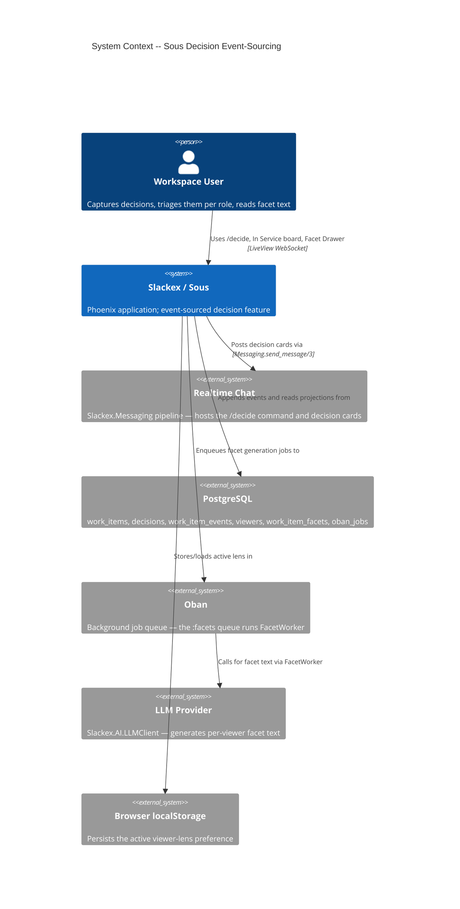
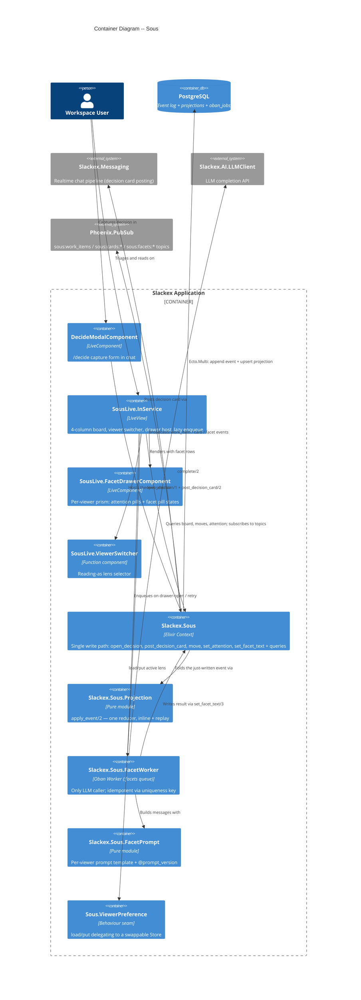
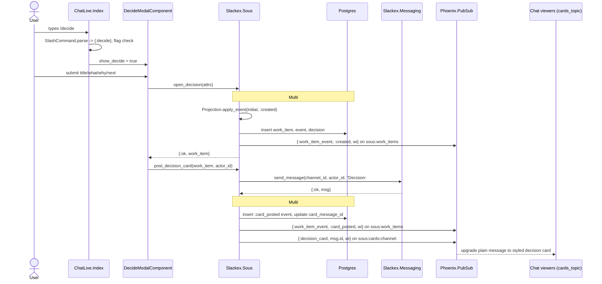
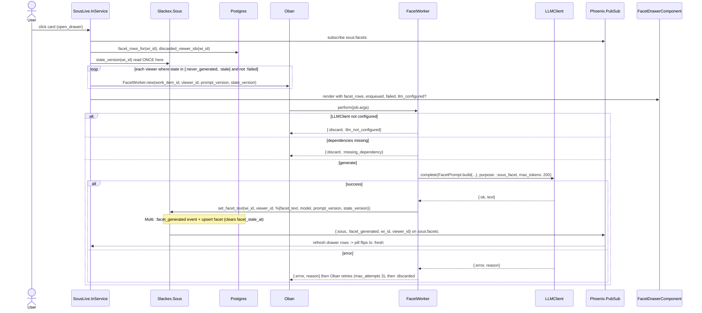
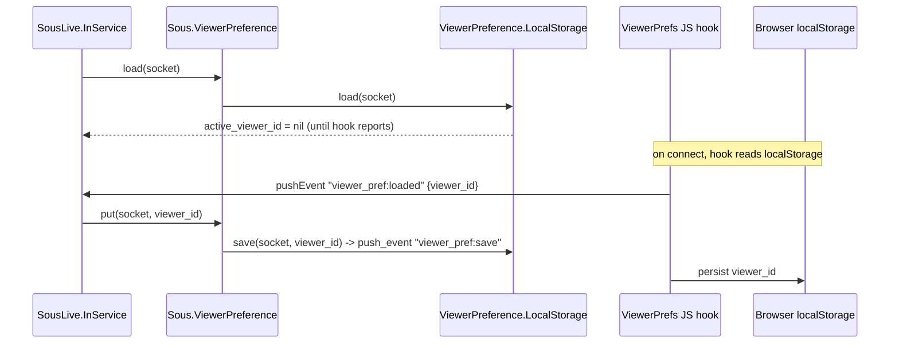
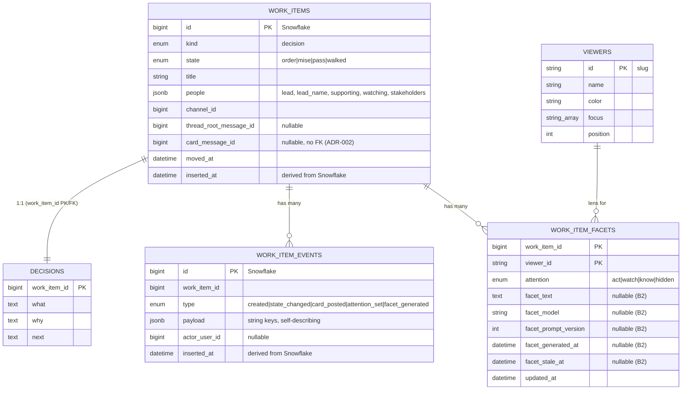

# Sous (Decision Event-Sourcing)

**Status:** Reference
**Scope:** `Slackex.Sous` context — the event-sourced decision feature: the `/decide` modal, decision cards in chat, the In Service board, and the per-viewer Facet Drawer with its AI facet pipeline.

---

## 1. Overview

Sous turns a chat message into a **decision work item** that lives on its own board and is read through multiple **role lenses** (viewers). It is the project's first deliberately event-sourced subsystem: every mutation is appended to an immutable `work_item_events` log, and the read-model tables (`work_items`, `decisions`, `work_item_facets`) are projections derived from that log by a single pure reducer.

The feature ships in three slices, all gated behind the `:sous` FunWithFlags flag:

- **Slice A** — the event-stream tracer bullet: `/decide` captures a decision, a `WorkItem` and `Decision` row are created in a transaction with a `:created` event, and a decision card is posted back to chat.
- **Slice B1** — data-driven viewers (role lenses) and per-viewer attention triage (`work_item_facets`), surfaced through the In Service board and the Facet Drawer.
- **Slice B2** — AI-generated *facet text*: a short, role-specific reading of each decision, produced by `FacetWorker` (the only LLM caller) and written through `set_facet_text/3`.

The non-obvious design choice is that the projection is maintained **inline** today — commands fold the event they just wrote through `Slackex.Sous.Projection.apply_event/2` and persist the result in the same `Ecto.Multi`. The *same* reducer can later rebuild every read model purely from the log. The codebase therefore behaves like a normal CRUD app at runtime while keeping the door open to full event-replay, without an API or schema change. The binding constraints that keep that door open are the numbered invariants in §8.

For the lower-level walkthrough of the event log, the reducer, and the replay-readiness invariants, see `deep-dive-event-sourcing-sous.md`.

---

## 2. C4 Diagrams

### 2.1 System Context

### 2.2 Container Diagram

These diagrams sit above the runtime sequence diagrams in §5–§7.

---

## 3. How To Read This Document

- Start with the **System Context** to see where Sous sits relative to chat, Oban, and the LLM.
- Use the **Container Diagram** to learn which module owns capture, the board, the write path, projection, and the AI pipeline.
- Use the **sequence diagrams** (§5–§7) for runtime behaviour: which `Ecto.Multi` runs, when PubSub fires, and when the LLM is (and is not) called.
- Use the **Data Model** (§9) and the **invariants** (§8) when reasoning about event-sourcing correctness.

### Terms Used Here

| Term | Meaning |
|---|---|
| Work item | A tracked unit; currently only `kind: :decision`. Primary key is a Snowflake `id`. |
| State | One of `:order`, `:mise`, `:pass`, `:walked` (the four board columns). |
| Event | An append-only `WorkItemEvent` row; the replay source of truth. |
| Projection | A derived read-model row (`WorkItem`, `Decision`, `WorkItemFacet`) rebuildable from events. |
| Viewer | A data-driven role lens (CEO, CTO, EM, …) with a `focus` list and board order. |
| Attention | A viewer's triage of a work item: `:act`, `:watch`, `:know`, `:hidden`. |
| Facet | A per-(work item, viewer) row holding that viewer's attention and AI facet text. |
| Facet text | A 1–3 sentence, role-specific reading of the decision, generated by the LLM. |
| Pill state | The Drawer's rendering of a facet: `:never_generated`, `:generating`, `:stale`, `:fresh`, `:failed`, `:not_configured`. |

---

## 4. Main Components

| Component | Responsibility |
|---|---|
| `Slackex.Sous` | The context facade and **single write path** — 5 commands + queries + topic helpers. |
| `Slackex.Sous.Projection` | Pure `apply_event/2` / `fold/1` reducer used inline now and reusable for replay. |
| `Slackex.Sous.WorkItem` | Work-item read model; 4 states, `:decision` kind, `people` jsonb, Snowflake-derived `inserted_at`. |
| `Slackex.Sous.Decision` | 1:1 with `WorkItem`; the `what` / `why` / `next` fields (plaintext, ADR-001). |
| `Slackex.Sous.WorkItemEvent` | Append-only event log; 5 event types; payloads use string keys. |
| `Slackex.Sous.Viewer` | Data-driven role lens; immutable in B1; position-ordered. |
| `Slackex.Sous.WorkItemFacet` | Per-(work item, viewer) row; composite PK; `state/1` pill-state derivation. |
| `Slackex.Sous.FacetWorker` | Oban worker on the `:facets` queue; the only LLM caller; idempotent. |
| `Slackex.Sous.FacetPrompt` | Pure prompt builder with a versioned template. |
| `Slackex.Sous.ViewerPreference` | Encapsulation seam over a swappable preference `Store`. |
| `SlackexWeb.SousLive.InService` | The board LiveView: columns, sort, switcher, drawer host, lazy enqueue, broadcasts. |
| `SlackexWeb.SousLive.FacetDrawerComponent` | The per-viewer prism: attention pills + facet pill states + retry. |
| `SlackexWeb.SousLive.ViewerSwitcher` | Stateless lens selector. |
| `SlackexWeb.ChatLive.DecideModalComponent` | The `/decide` capture form. |

---

## 5. Decision Capture And Two-Step Card Render

The surprising part of capture is that the chat card is **not** written inside the decision transaction. The message pipeline (`ChannelServer` + async `BatchWriter`) broadcasts and caches before it persists, so a synchronous `insert` inside the work-item `Ecto.Multi` would fight that pipeline. ADR-002 resolves this by having Sous own the linkage through `work_items.card_message_id` (no FK to `messages`, to avoid a race with the batch writer) plus a `:card_posted` event.

### Notes

- `open_decision/1` snapshots the actor's username into the `:created` payload (`people.lead_name`) so the card renders the DRI with no render-time user lookup — a self-describing-event property (invariant #3).
- The card text is a deliberately plain fallback (`"Decision: #{title}"`). Live chat viewers see the plain message first, then the `cards_topic` broadcast upgrades it; on a fresh page load `card_messages_for_channel/1` renders the card correctly from the start.
- If `Messaging.send_message/3` fails, the `with` in `post_decision_card/2` short-circuits: the work item exists on the board but has no chat card, and the caller logs it. There is no automatic retry today (see §11).

---

## 6. Board Triage, Lens Switching, And Lazy Facet Generation

The In Service board (`SlackexWeb.SousLive.InService`) renders four columns. Card placement within a column is sorted by attention rank (`:act > :watch > :know > :hidden`) then by `-id` (Snowflake IDs are time-ordered, so this is newest-first). With **no** lens selected the active viewer is `nil`, every card resolves to the default `:watch`, and the sort degrades to pure recency — identical to Slice A behaviour. Picking a lens is opt-in reshaping.

The deliberately cost-conscious decision is that facet generation is **lazy-on-open**: a `:state_changed` only marks rows stale (invariant #14); it never enqueues. With 7 seeded viewers, auto-enqueuing on every move would create unbounded LLM fan-out. Only opening the Drawer triggers generation, and only for viewers whose pill state is `:never_generated` or `:stale`.

### Notes

- **Attention triage** (`set_attention/4`) appends an `:attention_set` event and upserts the facet row (`on_conflict: {:replace, [:attention, :updated_at]}`). The Drawer's four pills bubble `:triage_attention` to the board; the change broadcasts on `sous:work_items` so other open boards/drawers refresh.
- **`state_version` is read exactly once**, at enqueue time, and threaded through job args → event payload unchanged. The Oban uniqueness key (`keys: [:work_item_id, :viewer_id, :prompt_version, :state_version]`) is hashed over args at enqueue; re-querying inside the worker would write a different version than it was deduped on and silently break dedup. `FacetWorker`'s moduledoc and `Sous.state_version/1`'s docstring both call this out.
- **Pill state** comes from two sources. The persisted part (`:never_generated` / `:stale` / `:fresh`) is derived purely by `WorkItemFacet.state/1`. The runtime part (`:generating` via the `enqueued` MapSet, `:failed` via `discarded_viewer_ids/1`, `:not_configured` via `LLMClient.configured?/0`) is layered on by the LiveView from socket state.
- **Retry** is the only user gesture besides drawer-open that enqueues. A `:failed` pill renders a retry glyph (`phx-click="retry_facet"`) that re-enqueues one worker and optimistically flips the viewer to `:generating`.

---

## 7. Viewer Preference Seam

The active lens is a per-user UI preference, not domain state. It is read and written only through `Slackex.Sous.ViewerPreference`, a thin delegator over a `Store` behaviour (invariant #10), so the storage strategy is a one-line config swap.

### Notes

- `InService.mount/2` calls `ViewerPreference.load/1`; the board element carries `phx-hook="ViewerPrefs"`. The default lens is `nil` (all items resolve to `:watch`).
- Both a real switcher click (`select_viewer`) and the JS hook bridge (`viewer_pref:loaded`) funnel through `ViewerPreference.put/2`, then refresh `facet_map` and `stale_map` for the chosen lens. The `ViewerPreference.InMemoryStore` (test-only) exists to prove the seam.

---

## 8. Event-Sourcing Invariants

These are binding design constraints (from the Slice specs) that keep the inline-projection app replay-ready. Verify against `deep-dive-event-sourcing-sous.md` and the source before relying on any one.

1. **Single write path** — every mutation flows through a `Slackex.Sous` command (`open_decision/1`, `post_decision_card/2`, `move/3`, `set_attention/4`, `set_facet_text/3`). No direct row updates.
2. **Complete log** — every projection change appends a `WorkItemEvent` in the *same* `Ecto.Multi` transaction as the row write.
3. **Self-describing events** — payloads use string keys (jsonb round-trips as strings) and carry enough to fold without external lookup. `:created` snapshots the whole work item, including the DRI name.
4. **One reducer, two uses** — `Projection.apply_event/2` is pure; commands fold inline today, a future projector folds from the DB. Both `set_attention/4` and `set_facet_text/3` derive the row through it rather than hand-building attrs.
5. **Append-only** — `WorkItemEvent` rows are only inserted, never updated or deleted.
6. **Derivable projection** — no `WorkItem` / `Decision` / `WorkItemFacet` field exists that the event log cannot reconstruct.
8. **Lazy facet rows** — an absent `WorkItemFacet` row means the default `:watch` attention; no row is needed to represent the default.
9. **Per-viewer state separation** — B1 moved attention off `work_items` onto `work_item_facets`; the B1 reducer ignores any vestigial `attention`/`facet_text` keys in legacy `:created` payloads.
10. **Preference-seam encapsulation** — lens preference is read/written only via `ViewerPreference`; the store is swappable.
11. **Immutable viewers (B1)** — `Viewer` rows are not deleted or renamed in B1; role-management UI is deferred.
12. **One write-path per facet field (B2)** — `attention` is written only by `set_attention/4`; `facet_text` only by `set_facet_text/3`.
13. **Facet-generated completeness (B2)** — the `:facet_generated` payload carries `model`, `prompt_version`, `generated_at`, and `state_version`, so replay and future "regenerate" decisions are possible.
14. **Invalidation ≠ enqueuing (B2)** — `:state_changed` marks rows stale (`facet_stale_at`) but does not enqueue; only drawer-open / retry enqueue.
15. **Event-level idempotency (B2)** — `FacetWorker`'s Oban uniqueness key dedupes duplicate generations for the same `(work_item_id, viewer_id, prompt_version, state_version)`.
16. **No phantom rows (B2)** — a `WorkItemFacet` row is lazily created on first `:attention_set` or `:facet_generated`, with the `:watch` default if attention was never set.
17. **Unique LLM call site (B2)** — only `FacetWorker.perform/1` calls the LLM; `Projection.apply_event/2` is a pure fold, so replay never calls the LLM and is deterministic.

> Note: the invariant numbering follows the specs; there is no separately documented invariant #7 in the implemented code (the specs reference a replay-guard test). Numbering is preserved here to match `docs/feature/sous/design/`.

---

## 9. Data Model

Sous owns three event-sourced tables plus two B1 tables. The event log is the source of truth; the rest are projections.

### Schema notes

- **Snowflake-derived timestamps.** `work_items.inserted_at` and `work_item_events.inserted_at` are computed from the Snowflake `id` (`Snowflake.extract_timestamp/1`) in the changeset, not by the database. This gives total event order without a separate sequence column.
- **`card_message_id` has no FK** to `messages`, deliberately, to avoid a race with the async batch writer (ADR-002).
- **Lazy facet rows.** `WorkItemFacet.state/1` derives the pill state: `nil` row or `nil` `facet_text` → `:never_generated`; `facet_stale_at` set → `:stale`; `facet_prompt_version < FacetPrompt.prompt_version()` → `:stale`; else `:fresh`. Bumping `@prompt_version` (currently `2`) auto-stales every older row with no migration.
- **Decision fields are plaintext** in Slice A (ADR-001) — they are not Cloak-encrypted like chat `messages` content. This is a deliberate slice-scoping decision recorded in the ADR.
- **Migrations** (expand/contract): `20260527145912_create_sous_tables` (Slice A), `20260528115125_sous_b1_viewers_and_facets` (adds `viewers` + `work_item_facets`, drops Slice A's single-viewer columns, seeds 7 viewers), `20260528164710_sous_b2_facet_text_columns` (purely additive B2 columns).

### PubSub topics

| Topic | Payload | Subscribers | Purpose |
|---|---|---|---|
| `sous:work_items` | `{:work_item_event, type, wi}` (`:created`, `:state_changed`, `:card_posted`) and `{:work_item_event, :attention_set, %{...}}` | In Service board | Board refresh, stale indicator |
| `sous:cards:channel:#{id}` | `{:decision_card, message_id, wi}` | Chat LiveView | Two-step card upgrade |
| `sous:facets:#{work_item_id}` | `{:sous, :facet_generated, wi_id, viewer_id}` | Open Facet Drawer | Flip pill `:generating` → `:fresh` |

---

## 10. Key Design Properties

- **Event-sourcing ready, CRUD at runtime.** One pure reducer serves inline persistence now and replay later; the API and tables do not change to enable replay.
- **Cost-contained AI.** Lazy-on-open generation plus invalidation-without-enqueue bounds LLM calls to what a user actually opens, not the 7-viewer × N-item cross product.
- **Idempotent generation.** Oban uniqueness keyed over `(work_item_id, viewer_id, prompt_version, state_version)` makes re-enqueuing the same logical facet a no-op; the worker never re-queries `state_version` to preserve that.
- **Single LLM call site.** Only `FacetWorker` touches the LLM, so replay and projection rebuilds are deterministic and side-effect-free.
- **Async chat pipeline respected.** Sous never writes synchronously into the hot message path; it owns linkage via `card_message_id` + `:card_posted` (ADR-002).
- **Composable lenses.** The same event stream yields different `WorkItemFacet` rows per viewer — no event duplication.
- **Fully flag-gated surfaces.** `:sous` gates the `/decide` command (`ChatLive.Index`), the board (`SousLive.InService.mount/2` redirects when off), the sidebar entry, and decision-card rendering. When off, `/decide` is reported as an unknown command rather than leaking the feature's existence.

---

## 11. Failure Modes & Resilience

| Failure | Behaviour | Blast radius |
|---|---|---|
| Decision card post fails | `post_decision_card/2`'s `with` short-circuits; the work item exists on the board with no chat card. Logged; no auto-retry today. | Single work item; board unaffected. |
| LLM not configured | `FacetWorker.perform/1` returns `{:discard, :llm_not_configured}`; Drawer shows `:not_configured` ("AI text unavailable"). B1 triage stays fully functional. | None — graceful degrade. |
| Worker dependency missing (viewer/work item/decision deleted) | `{:discard, :missing_dependency}` with a warning log. | Single job. |
| LLM call errors | Worker returns `{:error, reason}` (not swallowed) so Oban retries with backoff; after `max_attempts: 3` the job is `:discarded`. The board reads discarded jobs via `discarded_viewer_ids/1` and renders `:failed` + retry glyph. | Single (work item, viewer) facet. |
| State change while facets exist | `move/3` sets `facet_stale_at` on all rows in the same Multi; board shows a subtle warning dot for the active lens; next drawer-open regenerates. No manual action. | Self-healing. |

Resilience properties worth calling out:

- **No swallowed worker errors.** `FacetWorker` returns the `{:error, reason}` tuple directly, satisfying the project rule that `perform/1` must surface failures so Oban retries (precedent: the v0.5.36 EmbeddingWorker cascade). It does not `_ = result; :ok`.
- **Isolated queue.** Facet generation runs on a dedicated `:facets` Oban queue (concurrency `3`, `config/config.exs`), so it cannot starve `default`, notifications, or embeddings.
- **Discard, don't crash, on bad preconditions.** Missing LLM config or missing dependencies `:discard` rather than erroring, avoiding pointless retries.

---

## 12. Code Map

| File | Responsibility |
|---|---|
| `lib/slackex/sous.ex` | Context facade: 5 commands + queries + 3 topic helpers; all `Ecto.Multi` write paths. |
| `lib/slackex/sous/projection.ex` | Pure `apply_event/2` / `fold/1` reducer (inline + replay). |
| `lib/slackex/sous/work_item.ex` | Work-item read model; states/kinds; Snowflake-derived `inserted_at`. |
| `lib/slackex/sous/decision.ex` | 1:1 decision row (`what`/`why`/`next`, plaintext). |
| `lib/slackex/sous/work_item_event.ex` | Append-only event log schema; 5 event types. |
| `lib/slackex/sous/viewer.ex` | Role-lens schema; `order_by_position/1`. |
| `lib/slackex/sous/work_item_facet.ex` | Per-(work item, viewer) row; `state/1` pill derivation. |
| `lib/slackex/sous/facet_worker.ex` | Oban worker on `:facets`; only LLM caller; uniqueness key. |
| `lib/slackex/sous/facet_prompt.ex` | Pure prompt builder; `@prompt_version`. |
| `lib/slackex/sous/viewer_preference.ex` | Encapsulation seam (`load/1`, `put/2`). |
| `lib/slackex/sous/viewer_preference/store.ex` | `Store` behaviour. |
| `lib/slackex/sous/viewer_preference/local_storage.ex` | Default JS-hook-backed store. |
| `lib/slackex_web/live/sous_live/in_service.ex` | Board LiveView: columns, sort, switcher, drawer host, lazy enqueue, broadcasts. |
| `lib/slackex_web/live/sous_live/facet_drawer_component.ex` | Per-viewer prism: attention pills + pill states + retry. |
| `lib/slackex_web/live/sous_live/viewer_switcher.ex` | Stateless lens selector. |
| `lib/slackex_web/live/chat_live/decide_modal_component.ex` | `/decide` capture; calls `open_decision/1` + `post_decision_card/2`. |
| `lib/slackex_web/router.ex` | `live "/in-service", SousLive.InService, :index`. |
| `priv/repo/migrations/20260527145912_create_sous_tables.exs` | Slice A tables. |
| `priv/repo/migrations/20260528115125_sous_b1_viewers_and_facets.exs` | B1 viewers + facets; seed; drop Slice A columns. |
| `priv/repo/migrations/20260528164710_sous_b2_facet_text_columns.exs` | B2 facet-text columns. |

---

## 13. Related Documents

- `deep-dive-event-sourcing-sous.md` — L2 deep dive: the event log, the reducer, and the replay-readiness invariants in detail.
- `realtime-chat.md` — the messaging pipeline Sous posts decision cards through (`ChannelServer`, `BatchWriter`, async persistence).
- `notifications.md` — sibling event-driven subsystem.
- `threads-and-reactions.md` — chat features Sous links to via `thread_root_message_id`.
- `../feature/sous/design/slice-a-event-stream-tracer-bullet.md` — Slice A spec (event stream, invariants §6).
- `../feature/sous/design/slice-b1-role-lens-and-facet-drawer.md` — Slice B1 spec (viewers, attention triage, lazy rows).
- `../feature/sous/design/slice-b2-ai-facet-text.md` — Slice B2 spec (FacetWorker, FacetPrompt, lazy-on-open, invalidation).
- `../feature/sous/design/adr-001-decision-fields-plaintext-in-slice-a.md` — why decision fields are plaintext in Slice A.
- `../feature/sous/design/adr-002-sous-chat-linkage-via-card-message-id.md` — card linkage via `card_message_id`, not a `Message` FK; two-step render rationale.
- `../engineering-principles.md` — deploy safety, expand/contract migrations, worker error propagation.
