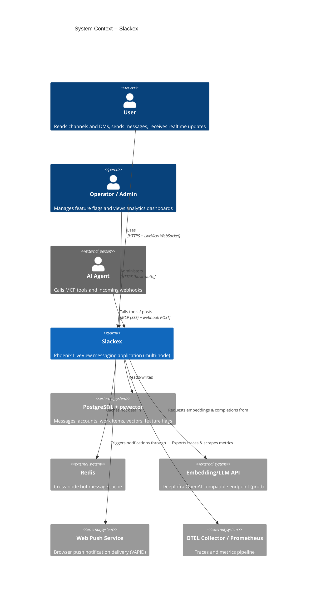
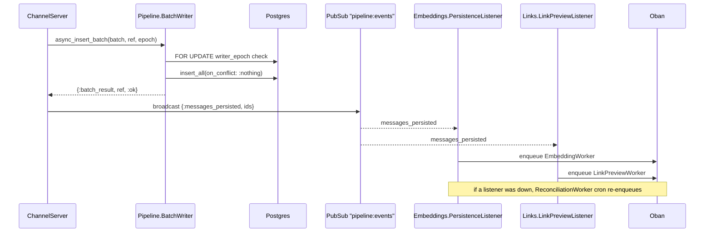

# System Landscape

**Status:** Reference
**Zoom level:** L0 — whole-application map
**Scope:** Phoenix endpoint, LiveView tier, all bounded contexts, data stores, async/job infrastructure, OTP supervision tree, runtime topology, and cross-cutting concerns. This is the entry-point map; subsystem detail is intentionally shallow and links out to L1 documents.

---

## 1. Overview

Slackex is an Elixir/Phoenix LiveView messaging application (Slack/Discord-style) built to run as a **multi-node cluster**. The design separates a latency-sensitive realtime path from a durable persistence path, and isolates non-essential subsystems (embeddings, link previews, factory automation) so they degrade independently rather than taking down chat.

The application is organized into **bounded contexts**, most of which are enforced at compile time by the `boundary` library (`use Boundary` in the context's root module, owning its schemas and exposing a narrow public surface via `exports:`). Not every context is wired into the boundary graph yet: `Slackex.Sous`, `Slackex.Factory`, and `Slackex.Analytics` root modules do **not** currently `use Boundary`. The contexts are:

| Context | Root module | Responsibility |
|---|---|---|
| Accounts | `Slackex.Accounts` | Users, bot users, auth tokens (Guardian JWT + bcrypt) |
| Chat | `Slackex.Chat` | Channels, messages, DM conversations, read cursors, reactions, pins, threads |
| Messaging | `Slackex.Messaging` | Realtime send/edit/delete facade; per-conversation `ChannelServer` |
| Pipeline | `Slackex.Pipeline` | Async batched persistence (`BatchWriter`) with writer-epoch fencing |
| Cache | `Slackex.Cache` | ETS local cache + Redis cross-node cache |
| Search | `Slackex.Search` | FTS + semantic + hybrid (RRF) message search |
| Embeddings | `Slackex.Embeddings` | Vector generation, persistence listener, reconciliation |
| AI | `Slackex.AI` | LLM client and summarization telemetry |
| Notifications | `Slackex.Notifications` | Web Push, device tokens, online presence, catch-up |
| Integrations | `Slackex.Integrations` | Incoming webhooks, MCP tokens |
| Sous | `Slackex.Sous` | Event-sourced work-item / decision stream and B2 facet projection |
| Factory | `Slackex.Factory` | "Dark factory" run lifecycle automation (MCP-driven) |
| Links | `Slackex.Links` | URL metadata extraction for link previews |
| Analytics | `Slackex.Analytics` | Fire-and-forget event tracking |
| Infrastructure | `Slackex.Infrastructure` | Snowflake ID generation, rate limiting |
| Encrypted | `Slackex.Encrypted` | Cloak field types (`Binary`, `Map`, `HMAC`) |

Source of truth for the boundary graph: each context root, e.g. `lib/slackex/chat/chat.ex`, `lib/slackex/messaging/messaging.ex`.

---

## 2. C4 Diagrams

### 2.1 System Context

### 2.2 Container Diagram

```mermaid
C4Container
  title Container Diagram -- Slackex Application

  Person(user, "User")
  Person_Ext(agent, "AI Agent")

  Container_Boundary(app, "Slackex BEAM Node (one of N in cluster)") {
    Container(endpoint, "SlackexWeb.Endpoint", "Phoenix / Bandit", "HTTP + WebSocket; browser/api/mcp pipelines")
    Container(liveview, "ChatLive + LiveViews", "Phoenix LiveView", "Server-rendered chat UI and admin dashboards")
    Container(api, "API + MCP + Webhooks", "Plug controllers", "JWT API, MCP SSE server, webhook ingest")

    Container(contexts, "Bounded Contexts", "Elixir", "Accounts, Chat, Messaging, Search, Notifications, Sous, Factory, ...")
    Container(channelserver, "ChannelServer (per conversation)", "GenServer via Horde", "Hot state, validation, PubSub broadcast, batching")
    Container(batchwriter, "Pipeline.BatchWriter", "Task + Ecto", "Async batched persistence with writer-epoch fencing")
    Container(pubsub, "Phoenix.PubSub", "Distributed event bus", "Realtime envelopes + pipeline:events / factory:events")
    Container(cache, "Cache (ETS + Redis)", "GenServer + Redix", "Hot message cache")
    Container(oban, "Oban", "Postgres-backed queues", "embeddings, notifications, link_previews, analytics, facets")
    Container(snowflake, "Infrastructure.Snowflake", "GenServer", "Distributed 64-bit ID generation")
    Container(cluster, "Cluster.Supervisor + NodeListener + Horde", "libcluster / Horde", "Node discovery, distributed registry/supervisor")
  }

  ContainerDb(postgres, "PostgreSQL + pgvector", "Primary + optional read replica")
  System_Ext(redis, "Redis")
  System_Ext(embed_api, "Embedding/LLM API")
  System_Ext(push, "Web Push")

  Rel(user, endpoint, "Connects via", "HTTPS/WS")
  Rel(agent, api, "MCP/webhook")
  Rel(endpoint, liveview, "Mounts")
  Rel(endpoint, api, "Routes")
  Rel(liveview, contexts, "Calls")
  Rel(api, contexts, "Calls")
  Rel(contexts, channelserver, "Routes realtime sends via")
  Rel(channelserver, cache, "Reads/writes hot messages")
  Rel(channelserver, pubsub, "Broadcasts envelopes + pipeline:events on batch success")
  Rel(channelserver, batchwriter, "Flushes batches via")
  Rel(channelserver, snowflake, "Allocates message IDs from")
  Rel(batchwriter, postgres, "Persists batches (epoch-fenced)")
  Rel(pubsub, liveview, "Delivers realtime events")
  Rel(pubsub, oban, "Listeners enqueue jobs from pipeline:events")
  Rel(oban, embed_api, "EmbeddingWorker requests vectors")
  Rel(oban, push, "PushWorker delivers notifications")
  Rel(cache, redis, "Cross-node backing store")
  Rel(contexts, postgres, "Queries via Repo / ReadRepo")
```

These diagrams sit above the L1 subsystem docs (see [Related Documents](#9-related-documents)). For the realtime send path in detail, see `realtime-chat.md`.

---

## 3. OTP Supervision Tree

The root supervisor is `Slackex.Supervisor` with strategy `:one_for_one`, started in `lib/slackex/application.ex`. Before any child starts, `start/2` attaches OpenTelemetry instrumentation (Bandit, Phoenix, Ecto, Oban) and registers `OpentelemetryReq` as a global Req plugin.

Children are started in this order (verified against `lib/slackex/application.ex`):

```mermaid
flowchart TD
  Root["Slackex.Supervisor (:one_for_one)"]

  Root --> Tel["SlackexWeb.Telemetry"]
  Root --> DMRL["Chat.DMRateLimiter"]
  Root --> Vault["Slackex.Vault (Cloak)"]
  Root --> Repo["Slackex.Repo (primary)"]
  Root --> RRepo["Slackex.ReadRepo (replica/fallback)"]
  Root --> Lag["ReadRepo.LagMonitor"]
  Root --> Clu["Cluster.Supervisor (libcluster)"]
  Root --> NL["Slackex.NodeListener"]
  Root --> PS["Phoenix.PubSub (Slackex.PubSub)"]
  Root --> Pres["SlackexWeb.Presence"]
  Root --> Snow["Infrastructure.Snowflake"]
  Root --> CL["Cache.Local (ETS)"]
  Root --> CR["Cache.Redis (Redix pool)"]
  Root --> CReg["Messaging.ChannelRegistry (Horde.Registry)"]
  Root --> CSup["Messaging.ChannelSupervisor (Horde.DynamicSupervisor)"]
  Root --> WS["Task.Supervisor :WriteSupervisor"]
  Root --> TS["Task.Supervisor :TaskSupervisor"]
  Root -. "dev only" .-> ES["Embeddings.Supervisor (restart: :temporary)"]
  Root --> Oban["Oban"]
  Root -. "restart: :temporary" .-> PL["Embeddings.PersistenceListener"]
  Root -. "restart: :temporary" .-> LL["Links.LinkPreviewListener"]
  Root -. "restart: :temporary" .-> FN["Factory.ChannelNotifier"]
  Root --> EP["SlackexWeb.Endpoint (last)"]

  CSup --> CSrv["ChannelServer (one per active channel/DM)"]
```

### Essential vs. non-essential restart policy

The non-obvious design decision is restart-policy *asymmetry*. Most children inherit the default `:permanent` restart. Three categories deviate, and the rationale is cascade containment:

- **`Embeddings.Supervisor` is started only in dev**, and even then with `restart: :temporary`. `maybe_embedding_serving/1` adds it to the child list **only when `:embedding_client` is `Slackex.Embeddings.BumblebeeClient`** (the dev default). If its own restart budget is exhausted, the root supervisor does **not** restart it — the app keeps serving with embeddings degraded rather than cascading a full shutdown. This codifies the v0.5.36 incident, where a swallowed embedding error cascaded through `:permanent` restarts and took the whole app down.
- **`PersistenceListener`, `LinkPreviewListener`, `ChannelNotifier`** are PubSub→Oban (or PubSub→thread) bridges started with `restart: :temporary`. They are non-essential: if they crash repeatedly, a `:permanent` policy would exhaust the root supervisor's budget and kill the app. Missed embedding events are recovered by the `ReconciliationWorker` cron (see [§5](#5-async--job-infrastructure)); link previews are cosmetic; factory thread notices are gated behind a flag.
- **`SlackexWeb.Endpoint` is started last** so the node does not accept traffic until data stores, PubSub, the Snowflake generator, caches, and the Horde registry/supervisor are up.

`FunWithFlags` is not in this list — it auto-starts via OTP application dependency ordering (before `Slackex.Application`); its Ecto adapter queries are lazy, so the Repo starting here first is safe.

---

## 4. Runtime Topology (Multi-Node)

Multi-node operation is real, not aspirational — production runs more than one BEAM node.

- **Node discovery — libcluster.** `Cluster.Supervisor` is started in `application.ex` with topologies from `Application.get_env(:libcluster, :topologies, [])`. In prod (`config/runtime.exs`) the topology is `gossip: [strategy: Cluster.Strategy.Gossip]`; in dev/test the list is empty (single node). `DNS_CLUSTER_QUERY` is read into `:dns_cluster_query` for DNS-based discovery where used.
- **Node monitoring.** `Slackex.NodeListener` (`lib/slackex/node_listener.ex`) subscribes to `:net_kernel` monitoring and reacts to `:nodeup` / `:nodedown`. Treat it as observability/logging of cluster membership changes; it is not a fencing mechanism.
- **Distributed process placement — Horde.** Per-conversation `ChannelServer` processes register in `Messaging.ChannelRegistry` (`Horde.Registry`) under keys like `{:channel, id}` / `{:dm, id}` and are supervised by `Messaging.ChannelSupervisor` (`Horde.DynamicSupervisor`). This gives a single logical owner per conversation across the cluster and lets Horde redistribute processes when membership changes. Files: `lib/slackex/messaging/channel_registry.ex`, `lib/slackex/messaging/channel_supervisor.ex`.
- **Write fencing — application level.** Stale-writer protection lives in `Pipeline.BatchWriter`, not in NodeListener. Before inserting a batch it takes `SELECT writer_epoch ... FOR UPDATE` on the channel/conversation row and compares against the caller's epoch (`lib/slackex/pipeline/batch_writer.ex`). A stale `ChannelServer` (e.g. after ownership moves between nodes) is fenced out at write time. This is row-level epoch fencing, not a distributed consensus / split-brain protocol — describe it as such.
- **Read scaling.** `Slackex.ReadRepo` is an optional read replica; `ReadRepo.LagMonitor` tracks replication lag and the app falls back to the primary for recent/lagging reads.

---

## 5. Async & Job Infrastructure

### Oban queues (`config/config.exs`)

`default: 10`, `notifications: 20`, `embeddings: 5`, `link_previews: 5`, `analytics: 5`, `facets: 3`.

### Oban cron (`Oban.Plugins.Cron`)

| Schedule | Worker | Purpose |
|---|---|---|
| `0 * * * *` | `Slackex.Workers.CacheWarmer` | Hourly cache warming |
| `*/15 * * * *` | `Slackex.Embeddings.ReconciliationWorker` | Safety net for missed embedding events |
| `*/2 * * * *` | `Slackex.Factory.LifecycleWorker` | Factory run state transitions |
| `0 3 * * *` | `Slackex.Analytics.PruneWorker` | Prune old analytics events |
| `* * * * *` | `Slackex.Analytics.MetricsBridge` | Aggregate analytics metrics |
| `0 4 1 * *` | `Slackex.Notifications.SubscriptionCleanupWorker` | Purge expired push subscriptions |

### The `pipeline:events` bridge

After `Pipeline.BatchWriter` confirms a batch is persisted (it replies `{:batch_result, ref, :ok}` to its caller), the owning `Messaging.ChannelServer` broadcasts `{:messages_persisted, ids}` on the `pipeline:events` PubSub topic (`lib/slackex/messaging/channel_server.ex`). The broadcast is on ChannelServer's success-reply path, not inline in BatchWriter. Two `restart: :temporary` listeners subscribe and enqueue Oban jobs:

This is a real producer→consumer bridge (not faked in tests) — the project mandates an integration test exercising the full path, after the `pipeline:events` topic was once designed but never wired (RCA `docs/rca/2026-03-06-pipeline-events-bridge-missing.md`). Embedding worker `perform/1` must return its result so Oban retries on failure; the cron reconciler is the second line of defence.

---

## 6. Data Stores & Data Model

### Stores

- **PostgreSQL** via `Slackex.Repo` (primary, writes) and optional `Slackex.ReadRepo` (replica) with the **pgvector** extension for embedding vectors and **FunWithFlags** persisted in an Ecto-backed table.
- **Redis** via `Slackex.Cache.Redis` (Redix pool) as the cross-node hot message cache; `Slackex.Cache.Local` is the in-process ETS tier. Cache writes are best-effort — Redis being unavailable degrades to DB reads, it does not fail sends.

### Messages table — what is actually there

The `messages` table (`priv/repo/migrations/20260221000006_create_messages.exs`) is a **flat (non-partitioned) table**:

- Primary key `id :bigint` (a Snowflake ID — `@primary_key {:id, :integer, autogenerate: false}` in `lib/slackex/chat/message.ex`), giving time-ordered, node-safe identifiers without a central sequence.
- Indexes: `[:channel_id, :id]` and `[:sender_id]`.
- **No `PARTITION` clause exists in any migration** — `grep PARTITION priv/repo/migrations` is empty. Earlier design notes referencing a partitioned `messages` table with `(message_id, message_inserted_at)` composite joins for partition pruning describe a mechanism that is **not implemented**; do not assume it.
- The composite pairing that *does* exist is between `message_embeddings` and `messages`: `message_embeddings` carries a denormalized `message_inserted_at` column, and `Search.MessageSearch` joins `on: me.message_id == m.id and me.message_inserted_at == m.inserted_at` (`lib/slackex/search/message_search.ex`). This is a denormalized join key on the embeddings side, not partition pruning on `messages`.

### Encryption at rest + searchable plaintext companion

Message content is encrypted at rest with **Cloak** (`Slackex.Vault`, AES.GCM). The schema field `content` maps to the encrypted DB column `encrypted_content` via `field :content, Slackex.Encrypted.Binary, source: :encrypted_content`. Because the ciphertext can't be indexed, the schema also stores a plaintext companion column `search_content`, populated from the same content in the changeset (`put_search_content/1`). A GIN full-text index over the searchable text powers FTS (`priv/repo/migrations/20260303191200_add_fts_gin_index.exs`). Deleting a message nulls both `content` and `search_content`.

### Other context-owned tables (shallow)

Accounts (`users`, tokens), Chat (channels, subscriptions, DM conversations/participants/requests, reactions, pins, threads, read cursors), Embeddings (`message_embeddings` with pgvector), Notifications (device tokens, preferences), Integrations (webhooks, MCP tokens), Sous (work items, work-item events, facets, viewers), Factory (runs, events, verification tokens), Links (link previews), Analytics (events). See each context's L1 doc for its model.

---

## 7. Cross-Cutting Concerns

- **Snowflake IDs.** `Slackex.Infrastructure.Snowflake` generates 64-bit IDs with layout `[1 unused][41 timestamp ms][10 node_id][12 sequence]`, epoch `2025-01-01T00:00:00Z`. On startup it acquires a PostgreSQL **session-level advisory lock on its node_id** so two nodes cannot share an ID space. This is what makes message ordering and the `bigint` PK distributed-safe.
- **Encryption.** Cloak field-level AES.GCM (`Slackex.Vault`), with key-rotation support via a retired cipher (`CLOAK_RETIRED_KEY`) and HMAC blind-indexing types (`Slackex.Encrypted.HMAC`). Passwords use bcrypt (12 rounds); API auth uses Guardian JWT.
- **Feature flags.** FunWithFlags (Ecto-persisted) gates user-facing surfaces across context code, LiveView templates, and routes. Flags verified in the codebase: `:message_search`, `:website_analytics`, `:dark_factory`, `:loom`. The admin UI is mounted at `/admin/flags` (`FunWithFlags.UI.Router`, basic auth).
- **Observability.** OpenTelemetry auto-instrumentation for Bandit/Phoenix/Ecto/Oban/Req is set up in `application.ex`; `SlackexWeb.Telemetry` exposes Prometheus metrics; OTLP export endpoint is configurable via `OTEL_EXPORTER_OTLP_ENDPOINT`. See `docs/runbooks/observability.md`.
- **Realtime fanout.** `Phoenix.PubSub` (`Slackex.PubSub`) carries conversation envelopes (`channel:{id}` / `dm:{id}`), the `pipeline:events` persistence bridge, and `factory:events`. `SlackexWeb.Presence` tracks online users.

---

## 8. Web Tier & Failure Modes

### Endpoint and pipelines

`SlackexWeb.Endpoint` runs on the **Bandit** adapter. The router (`lib/slackex_web/router.ex`) defines `:browser` (session, CSRF, secure headers), `:api` (JSON), and `:mcp` (MCP protocol) pipelines plus auth rate-limit pipelines. Key route groups: authenticated LiveView chat under `/chat/*` (channels, DMs, threads, members, pins, invites), Sous `/in-service`, JWT API under `/api/*`, the MCP server forwarded at `/mcp`, incoming webhooks at `/api/webhooks/:token`, health/readiness probes (`/health`, `/ready`), and admin dashboards (`/admin/flags`, `/admin/analytics`).

### Failure modes & blast radius

| Failure | Behaviour | Containment |
|---|---|---|
| Redis down | Cache reads fall through to DB; writes best-effort | No hard dependency; sends still work |
| Embedding model / serving fails (dev) | `Embeddings.Supervisor` is `:temporary` — not restarted by root | App serves with search degraded; no cascade (v0.5.36 precedent) |
| Listener crash loop | `:temporary` listeners not restarted by root | `ReconciliationWorker` cron recovers missed embeddings |
| Stale `ChannelServer` writes | Fenced by `writer_epoch` FOR UPDATE check | Duplicate/stale writes rejected at `BatchWriter` |
| Read replica lag | `LagMonitor` flags lag | Reads fall back to primary |
| Node up/down | Horde redistributes `ChannelServer`s | Brief per-conversation unavailability; clients reconnect |
| Missing VAPID keys | Push feature-flagged; boot does not crash | Release boot check guards (v0.8.1 precedent) |

---

## 9. Related Documents

- `realtime-chat.md` — L1: realtime send path, PubSub fanout, batched persistence (the hot path expanded)
- `threads-and-reactions.md` — L1: thread replies, reply counts, reaction toggles
- `notifications.md` — L1: presence, push preferences, device subscriptions, catch-up
- `chat-domain-as-is-to-be.md` — `Slackex.Chat` facade, current and proposed public interface
- `../runbooks/observability.md` — metrics, traces, and operational visibility
- `../runbooks/deployment.md` — deploy pipeline and topology in production
- `../engineering-principles.md` — expand/contract migrations, deploy safety, test isolation, production hardening
- `../feature/mcp-server/design/architecture.md` — agent-facing messaging and MCP/SSE integration
- `../feature/markdown-rendering/design/architecture.md` — message content storage → safe render-time HTML
- `../design/information-architecture.md` — UI navigation model for channels, DMs, and thread panels
