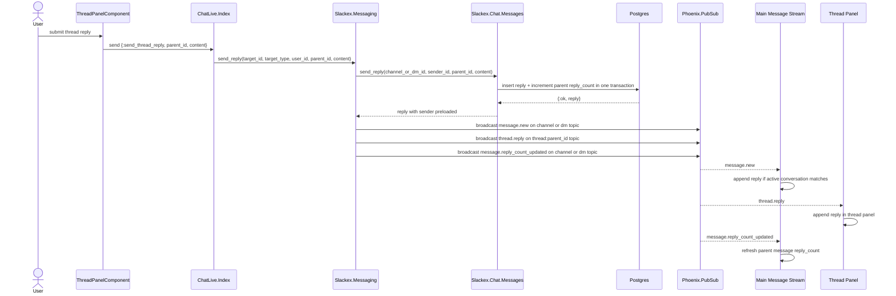
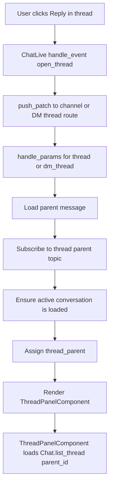
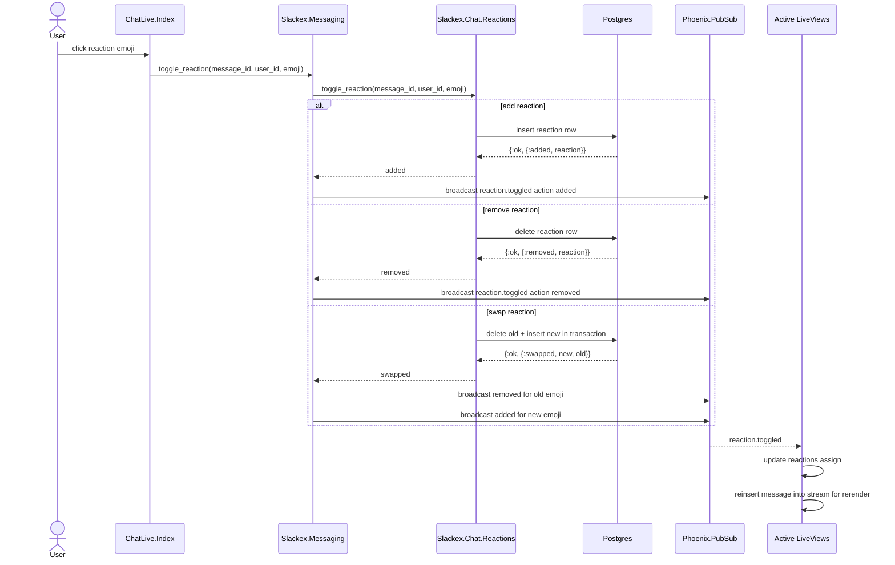

# Threads And Reactions Architecture

**Status:** Reference
**Scope:** Thread replies, reply count propagation, reaction toggles, and LiveView update flow

---

## 1. Overview

Slackex models thread replies as ordinary messages with a `parent_message_id` and keeps the parent message's `reply_count` in sync. Reactions are stored separately and broadcast as normalized realtime events.

Both capabilities reuse the main messaging stack:

- writes go through domain functions in `Slackex.Chat`
- realtime fanout goes through `Slackex.Messaging`
- UI updates arrive over PubSub and patch LiveView streams in place

---

## 2. Main Components

| Component | Responsibility |
|---|---|
| `SlackexWeb.ChatLive.Index` | Opens and closes thread views, handles reaction events, receives PubSub updates |
| `SlackexWeb.ChatLive.ThreadPanelComponent` | Renders the parent message, reply list, and reply form |
| `Slackex.Messaging` | Broadcasts `thread.reply`, `message.reply_count_updated`, and `reaction.toggled` envelopes |
| `Slackex.Chat.Messages` | Persists replies and increments parent `reply_count` atomically |
| `Slackex.Chat.Reactions` | Adds, removes, or swaps reactions in the database |
| `Phoenix.PubSub` | Delivers reply and reaction events to LiveViews and other clients |

---

## 3. Thread Reply Flow

### Notes

- Thread replies are not a separate table; they are ordinary messages linked to a parent.
- `Slackex.Chat.Messages.send_reply/4` inserts the reply and increments `reply_count` in the same transaction.
- `Slackex.Messaging.send_reply/5` performs dual broadcast: conversation topic plus dedicated thread topic.

---

## 4. Thread Navigation And UI Flow

### Notes

- Thread state is route-driven using `/chat/:slug/thread/:message_id` and `/chat/dm/:dm_id/thread/:message_id`.
- Closing the thread unsubscribes from the thread topic and patches back to the base channel or DM route.

---

## 5. Reaction Toggle Flow

### Notes

- Slackex enforces one reaction per user per message.
- A swap is represented as two realtime events so clients can stay simple.
- The LiveView updates both the reaction summary map and the affected message stream entry.

---

## 6. Design Properties

- **Reuse of core pipeline:** threads and reactions sit on top of the same conversation topics and LiveView streams as normal messages.
- **Atomic thread persistence:** reply insert and parent reply count increment succeed or fail together.
- **Separate thread fanout:** thread panels subscribe to `thread:{parent_id}` so they only receive relevant replies.
- **Client simplicity:** reaction swap is normalized into remove + add events instead of inventing a more complex wire format.
- **Route-driven UI state:** opening a thread is deep-linkable and browser-back friendly.

---

## 7. Code Map

- `lib/slackex_web/live/chat_live/index.ex`
- `lib/slackex_web/live/chat_live/thread_panel_component.ex`
- `lib/slackex/messaging/messaging.ex`
- `lib/slackex/chat/messages.ex`
- `lib/slackex/chat/reactions.ex`
- `lib/slackex_web/router.ex`

---

## 8. Related Tests

- `test/slackex_web/live/chat_live/thread_test.exs`
- `test/slackex_web/live/chat_live/e2e_test.exs`
- `test/slackex/chat/threads_test.exs`
- `test/slackex/chat/reactions_test.exs`
