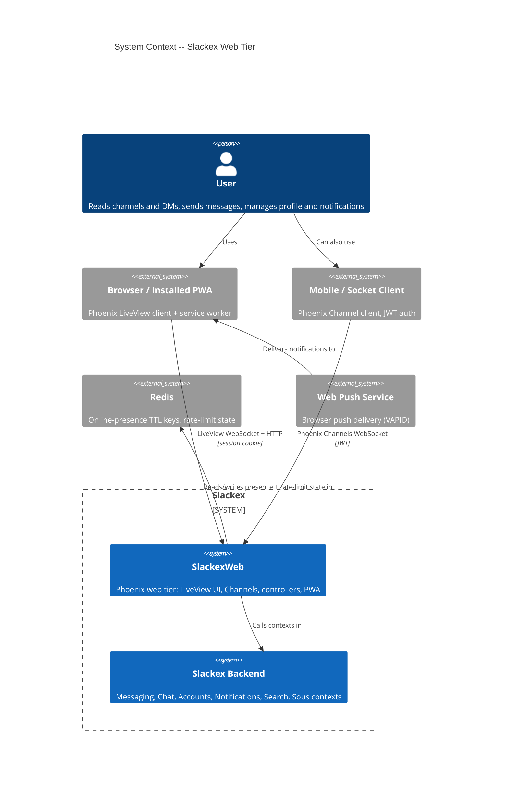
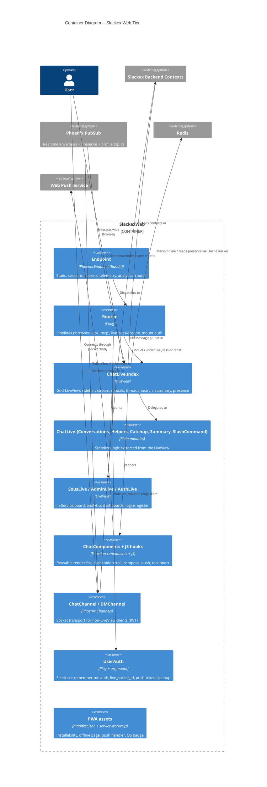
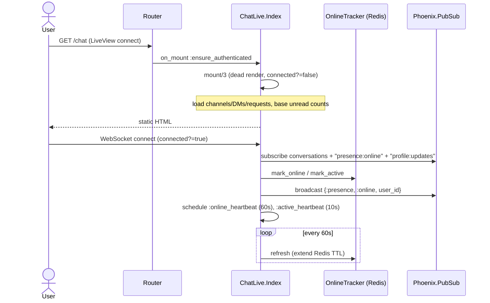
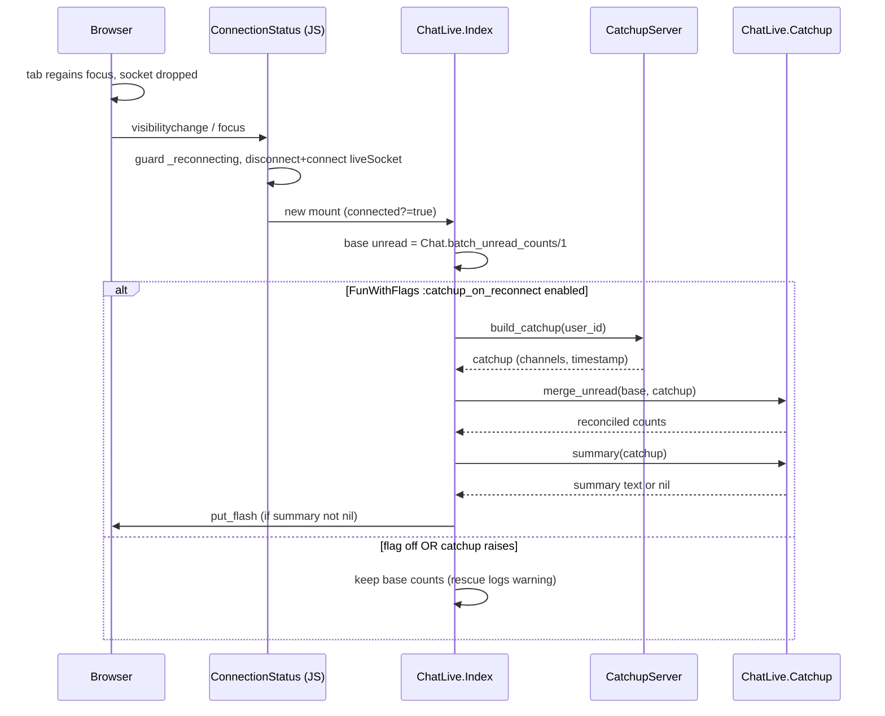
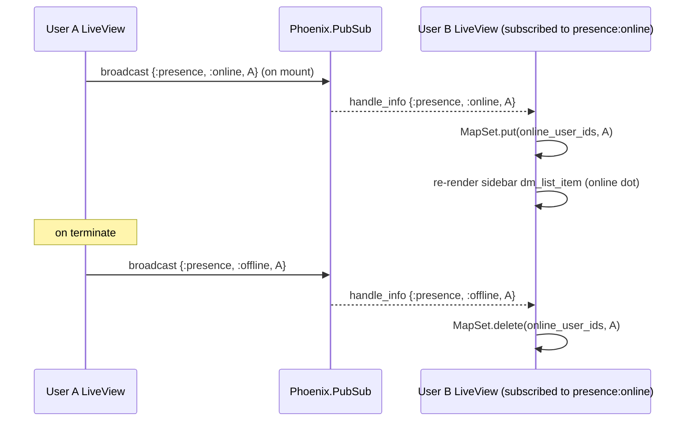

# Web Tier & LiveView Architecture

**Status:** Reference
**Scope:** `SlackexWeb` — router and pipelines, the LiveView modules (chat, sous, admin, auth), core function components, JS hooks, Phoenix Channels for socket clients, online-presence tracking, reconnect/catchup, and the PWA (manifest, service worker, install banner). Includes the `ChatLive.Index` god-LiveView and its current decomposition.

---

## 1. Overview

`SlackexWeb` is the delivery layer that turns the realtime/messaging backend (see `realtime-chat.md`) into a usable application. Almost everything a logged-in user touches is served by a single LiveView, `SlackexWeb.ChatLive.Index` (`lib/slackex_web/live/chat_live/index.ex`, ~1,550 lines). It owns the sidebar, the message stream, threads, modals, search, summarization, push-notification controls and presence indicators, switching between them via `live_action` on the same mounted process.

The web tier is deliberately split along three transport seams:

1. **Browsers** connect over the LiveView socket (`/live`) with the encrypted session cookie. They get `ChatLive.Index`.
2. **Mobile / native clients** connect over the user socket (`/socket`) with a JWT, and use `ChatChannel` / `DMChannel` — thin Phoenix Channels that reuse the exact same `Slackex.Messaging` backend.
3. **External agents** use the MCP endpoint and HTTP/JSON API (out of scope here; see `integrations.md`).

The non-obvious design choice is that **the god-LiveView is intentional, not accidental debt.** All `live_action` routes share one message stream (`:messages`) and one reactions map; splitting them into LiveComponents would force a `send_update/3` on every PubSub message event. The project has instead extracted *stateless* logic (conversation entry, helpers, catchup, summary, slash-command parsing) into sibling modules while keeping routing, rendering, and the message stream in the parent. The pre-Loom presence story is also surprising: `SlackexWeb.Presence` exists but is unused — online status is tracked in Redis with a TTL, fanned out over PubSub.

---

## 2. C4 Diagrams

### 2.1 System Context

### 2.2 Container Diagram

These sit a level above the sequence diagrams below. For the message send/persist path itself, see `realtime-chat.md` — this document covers the *web-tier* concerns layered on top of it.

---

## 3. How To Read This Document

- Start with the **System Context** to see the three client transports and the external systems the web tier touches (Redis, Web Push).
- Use the **Container** diagram to see who owns routing, the god-LiveView, its extracted helpers, the socket channels, and the PWA assets.
- Use the **sequence diagrams** (§6) for web-tier-specific lifecycles: mount/heartbeats, reconnect→catchup, and presence fanout.
- Use the **Code Map** (§9) to jump to a file by responsibility.

### Terms Used Here

| Term | Meaning |
|---|---|
| `live_action` | The router-assigned atom that selects which sub-view `ChatLive.Index` renders (`:show`, `:thread`, `:dm`, `:create_channel`, …) |
| Envelope | The normalized PubSub event the LiveView consumes as `{:envelope, %{event: ..., payload: ...}}` |
| Presence | "Is this user online?" — tracked by `OnlineTracker` in Redis, **not** `Phoenix.Presence` |
| Catchup | The unread-count reconciliation done at mount after a reconnect |
| `live_socket_id` | The session key used to remotely disconnect a user's LiveViews on logout |

---

## 4. Router & Pipelines

File: `lib/slackex_web/router.ex`.

### Pipelines

- **`:browser`** — `fetch_session`, `fetch_live_flash`, root layout, `protect_from_forgery` (CSRF), a static **Content-Security-Policy** header (via `put_secure_browser_headers`), then `fetch_current_user`. The CSP is: `default-src 'self'; script-src 'self'; style-src 'self' 'unsafe-inline'; img-src 'self' data: https:; connect-src 'self' wss:; worker-src 'self'; manifest-src 'self'; frame-ancestors 'none'` — note `worker-src`/`manifest-src` are present specifically so the PWA service worker and manifest load.
- **`:api`** — JSON only.
- **`:mcp`** — JSON + SSE, with its own `Plug.Parsers` (1 MB JSON limit); bearer-token auth, no session/CSRF.
- **`:rate_limit_auth` / `:rate_limit_api_auth`** — `SlackexWeb.Plugs.RateLimit`, 10 requests / 60 s, applied to login and the JWT auth endpoints.

### Route groups

| Route(s) | Module / action | Notes |
|---|---|---|
| `GET /` | `PageController.home` | Public landing |
| `GET /health`, `/ready`, `/offline` | `HealthController`, `OfflineController` | Outside auth; `/offline` is the PWA fallback page |
| `POST /users/log-in`, `DELETE /users/log-out` | `UserSessionController` | Behind `:rate_limit_auth` |
| `live "/users/register"`, `"/users/log-in"` | `AuthLive.Register/Login` | `live_session :redirect_if_authenticated` |
| `live "/chat..."` (12 routes) | `ChatLive.Index` | `live_session :chat`, `on_mount [{UserAuth, :ensure_authenticated}, AnalyticsTracker]`, `layout {Layouts, :chat}` |
| `live "/in-service"` | `SousLive.InService` | Same `:chat` live_session |
| `POST /api/auth/login`, `/api/auth/refresh` | `API.AuthController` | JWT issue/refresh |
| `GET /api/bootstrap`, `POST/DELETE /api/device-tokens` | `API.{Bootstrap,DeviceToken}Controller` | Behind `Plugs.ApiAuthPipeline` (JWT) |
| `forward "/mcp"` | `MCP.Server` | Agent transport |
| `POST /api/webhooks/:token` | `WebhookController.deliver` | Token-in-URL auth, no session |
| `forward "/admin/flags"` | `FunWithFlags.UI.Router` | Basic-auth |
| `live "/admin/analytics..."` | `AdminLive.Analytics` | Basic-auth, 4 actions |

The 12 chat routes all mount the *same* `ChatLive.Index` module and differ only by `live_action`: `:index`, `:create_channel`, `:browse_channels`, `:new_dm`, `:dm`, `:dm_thread`, `:thread`, `:members`, `:pinned`, `:invite`, `:redeem_invite`, `:show`. (The pins modal route uses action `:pinned`, not `:pins`.)

---

## 5. Endpoint, Sockets & Authentication

### Endpoint

File: `lib/slackex_web/endpoint.ex`. Bandit-served. Plug order of note: `SwNoCache` (service-worker cache headers) → `Plug.Static` → optional `Tidewave` (dev MCP) → `Plug.RequestId` / `Plug.Telemetry` → `Plug.Parsers` (1 MB) → `MetricsExporter` → `Plug.Session` → `AnalyticsPlug` → `Router`.

Two sockets:

- `socket "/socket", SlackexWeb.UserSocket` — websocket only, for Channel clients.
- `socket "/live", Phoenix.LiveView.Socket` — carries the encrypted session via `connect_info`.

Session cookie options (`@session_options`): `store: :cookie`, `same_site: "Lax"`, `http_only: true`, and `secure: true` only in prod.

### Session auth (browser / LiveView)

File: `lib/slackex_web/user_auth.ex`.

- `log_in_user/3` mints a session token, **renews the session** (fixation defense), optionally writes a 14-day signed remember-me cookie, and via `put_token_in_session/2` sets `live_socket_id` to **`"users_sessions:#{Base.url_encode64(token)}"`**.
- `log_out_user/1` deletes the session token, **broadcasts `"disconnect"` to that `live_socket_id`** (tearing down every LiveView for the token across tabs/devices), clears the session, deletes the remember-me cookie, and calls `cleanup_web_push_tokens/1` to delete the user's `web_push` device tokens.
- `fetch_current_user/2` resolves from the session token, falling back to the signed remember-me cookie (re-seeding the session if found).
- `on_mount` provides `:mount_current_user`, `:ensure_authenticated` (redirects to `/users/log-in`), and `:redirect_if_authenticated` (redirects to `/chat`).

### Token auth (mobile / Channels)

File: `lib/slackex_web/channels/user_socket.ex`. `connect/3` requires a `"token"` param, verifies it via `Accounts.Auth.verify_api_token/1`, marks the user online (`OnlineTracker.mark_online/1`), and assigns `:current_user_id`. The socket id is the **separate** namespace `"user_socket:#{user_id}"` — distinct from the LiveView `live_socket_id` above.

---

## 6. LiveView Modules

### 6.1 `ChatLive.Index` — the god-LiveView

File: `lib/slackex_web/live/chat_live/index.ex`. Measured surface: **9 `handle_params`**, **48 `handle_event`**, **39 `handle_info`** clauses.

**`mount/3`** loads the user's channels, DM conversations and pending DM requests, then (only when `connected?/1`):

- subscribes to all conversations (`Conversations.subscribe_all_conversations/2`), the presence topic `"presence:online"`, and `"profile:updates"`;
- marks the user online and active (`OnlineTracker` / `ActiveTracker`) and broadcasts `{:presence, :online, user_id}`;
- schedules two heartbeats: `:online_heartbeat` (60 s, refreshes the Redis presence TTL) and `:active_heartbeat` (10 s).

It computes base unread counts (`Chat.batch_unread_counts/1`), and — **only if `FunWithFlags.enabled?(:catchup_on_reconnect)`** — overlays catchup counts (see §6.5). It then assigns ~40 keys, including the `:messages` stream, `:reactions`, `:typing_users` (a `MapSet`), `:online_user_ids` (a `MapSet`), `:unread_counts`, and feature-flag toggles (`:loom`, `:search_enabled`, `:summarization_enabled`).

**`handle_params/3`** dispatches on `live_action`, calling `Conversations.enter_channel/5`, `enter_dm/3`, or `enter_modal/2` to swap the active conversation, manage subscriptions, load history, and reset the stream.

**`handle_event/3`** (48 clauses) covers, among others: `send_message` (routed through `SlashCommand.parse/1` for `/summarize` and `/decide`), `typing`, `load_more`, reactions (`toggle_reaction`), pins (`pin_message`/`unpin_message`), threads (`open_thread`/`close_thread`), DM-request lifecycle (`accept_request`/`decline_request`/`block_request_sender`/`block_user`), profile editing, message edit/delete, and the push-notification controls (`enable_push`, `confirm_enable_push`, `dismiss_push_explainer`, `disable_push`, `push:register_subscription`, `push:remove_subscription`, `push:unsubscribed`, `push:error`, `send_test_push`, `update_notification_level`, `set_channel_notification`).

**`handle_info/2`** (39 clauses) consumes seven distinct PubSub envelope events — `message.new`, `message.edited`, `message.deleted`, `reaction.toggled`, `thread.reply`, `message.reply_count_updated`, `typing` — plus presence (`{:presence, :online|:offline, id}`), profile updates, search results, the two heartbeats, and summarization streaming.

**`terminate/3`** marks the user offline/inactive and broadcasts `{:presence, :offline, user_id}` so other clients drop the online dot.

### 6.2 Extracted helper modules

These hold logic pulled out of the LiveView; they are plain modules, not LiveComponents:

| Module | Responsibility |
|---|---|
| `ChatLive.Conversations` | `enter_channel/5`, `enter_dm/3`, `enter_modal/2`, `leave_conversation/1`, `load_older_messages/5`, `subscribe_all_conversations/2`, `refresh_channels_and_navigate/2` |
| `ChatLive.Helpers` | Send/typing helpers, stream enrichment/edit/delete/reaction updates, unread bookkeeping, channel authorization, profile-form helpers |
| `ChatLive.Catchup` | Pure functions `merge_unread/2` and `summary/1` (no side effects) |
| `ChatLive.Summary` | `stream_summary/4`, `cancel_summary_task/1`, `time_range_to_datetime/1` |
| `ChatLive.SlashCommand` | `parse/1` → `{:summarize, range}` \| `{:decide}` \| `{:unknown_command, cmd}` \| `:not_command` |

### 6.3 Modal & panel LiveComponents

The render tree embeds LiveComponents that own their own form/local state: `SidebarComponent`, `CreateChannelModal`, `BrowseChannelsModal`, `NewDmModal`, `ChannelMembersModal`, `PinnedMessagesModal`, `InviteLinkModal`, `QuickSwitcherModal`, `SearchComponent`, `SummaryModal`, `DecideModalComponent`, `ThreadPanelComponent`. They communicate back to the parent via events and `send_update/2`.

### 6.4 `AuthLive.Login` / `AuthLive.Register`

File: `lib/slackex_web/live/auth_live/login.ex`. These are deliberately thin: the form uses `phx-update="ignore"` and posts via HTML `action={~p"/users/log-in"}` to the controller — i.e. **the LiveView renders the form but the credentials submit over plain HTTP**, so session-cookie auth happens in the controller, not the socket. Styling is gated on `FunWithFlags.enabled?(:loom_redesign)`.

### 6.5 `SousLive.InService`

File: `lib/slackex_web/live/sous_live/in_service.ex`. The In-Service Kanban board (see `sous.md`). Gated at mount on `FunWithFlags.enabled?(:sous, for: user)` — if disabled, it flashes and redirects to `/chat` (the flag gates the *route surface*, not just rendering). Four columns (`:order`, `:mise`, `:pass`, `:walked`); per-column sort uses an attention rank (`act > watch > know > hidden`) then recency. Subscribes to `Sous.work_items_topic()` for live updates.

### 6.6 `AdminLive.Analytics`

File: `lib/slackex_web/live/admin_live/analytics.ex`. Basic-auth, four `live_action` tabs (`:overview`, `:hotspots`, `:errors`, `:features`) backed by the `Slackex.Analytics` context, with a `:period` selector (default `:last_7_days`). Gated on `FunWithFlags.enabled?(:website_analytics)`; when disabled, `load_tab_data/1` no-ops.

---

## 7. Core Components & JS Hooks

### Function components

File: `lib/slackex_web/components/chat_components.ex` — stateless render functions (with declared `attr`s), not LiveComponents. Includes: `avatar/1` (initials + optional online dot), `channel_list_item/1`, `dm_list_item/1`, `time_divider/1`, `message_bubble/1`, `reaction_bar/1`, `typing_indicator/1`, `sidebar_toggle/1`, `conversation_header/1`, `message_stream/1`, `link_preview_card/1`, `compose_area/1`, `empty_state/1`, `unread_badge/1`, plus modal renderers (`report_modal/1`, `user_profile_card/1`, `edit_profile_modal/1`, `push_explainer_modal/1`, `appearance_modal/1`).

### JS hooks

Registered in `assets/js/app.js` (15 hooks): `MessageList`, `Compose`, `EditMessage`, `EmojiPicker`, `QuickSwitcher`, `LongPress`, `CopyMessage`, `Analytics`, `PushSubscription`, `LocalTime`, `ConnectionStatus`, `AppBadge`, `LoomPrefs`, `AppearancePanel`, `ViewerPrefs`. The page-transition progress bar is the `topbar` *vendor* library wired directly in `app.js` (not a hook), and `phx:copy` clipboard writes are handled by a top-level listener there.

`ConnectionStatus` (file `assets/js/hooks/connection_status.js`) is the one to understand: it shows a banner on `phx:page-loading-start` with `kind === "error"`, and — because browsers throttle background tabs and may silently drop the socket — **forces a reconnect on `visibilitychange`/`focus`**. It guards against re-entrant reconnects with a `_reconnecting` flag cleared by the socket's `onOpen` callback, since `visibilitychange` and `focus` often fire in the same tick.

---

## 8. Phoenix Channels (socket clients)

Files: `lib/slackex_web/channels/{chat_channel,dm_channel}.ex`. These exist so mobile/native clients get realtime chat without LiveView, **reusing the same backend** for consistent authorization, rate-limiting and persistence.

- **`ChatChannel`** — `join("chat:" <> id)` checks `Chat.get_role/2` (rejects with `unauthorized` if `nil`), returns the last 50 serialized messages, marks read, and subscribes to `"channel:#{id}"`. `handle_in("new_message", ...)` routes to `Messaging.send_message/3` and maps backend errors (`:rate_limited`, `:backpressure`, `:unauthorized`, `:invalid_content`) to client error replies. `handle_info` pushes `message.new` and `typing` envelopes to the socket.
- **`DMChannel`** — symmetric, over `Chat.get_dm/1` / `Chat.list_dm_messages/2` and `Messaging.send_dm/3`.

The per-message send/persist path beyond `Messaging` is documented in `realtime-chat.md` §5/§7.

---

## 9. Key Runtime Flows

### 9.1 Mount, connect & heartbeats

### 9.2 Reconnect → catchup → flash

### 9.3 Presence online-dot fanout

### 9.4 Summarization streaming

`send_message` with `/summarize` parses a range and sends `{:start_summary, range}` to `self()`. `handle_info({:start_summary, ...})` launches `Task.Supervisor.async_nolink(Slackex.TaskSupervisor, fn -> Summary.stream_summary(target, since, user_id, lv_pid) end)`. The task enumerates an Elixir stream from `Slackex.AI.Summarizer`, sending each chunk back as `{:summary_token, chunk}`, then `:summary_complete` (or `{:summary_error, reason}` on empty/failed). `async_nolink` is the deliberate choice: a crash in the summary task does **not** take down the LiveView. (The Req/Mint streaming concern lives in the AI layer; see `ai-summarization.md`.)

---

## 10. Online Presence — Redis, not Phoenix.Presence

`SlackexWeb.Presence` is defined (`lib/slackex_web/presence.ex`) and started in `application.ex`, but the codebase contains **no `Presence.track`/`Presence.list` calls** — it is currently vestigial. The live mechanism is `Slackex.Notifications.OnlineTracker`:

- `mark_online/1` writes a Redis key `online:{user_id}` with a **120-second TTL** (`SET ... EX 120`); heartbeats refresh it.
- `mark_offline/1` deletes the key; `online_user_ids/1` filters a candidate list against present keys.
- Every Redis call goes through `redis_command/2`, which returns a fallback on any error or exception.

Presence is therefore *eventually consistent and self-healing* (a crashed client's key simply expires within 2 minutes) and *degrades silently* (Redis down → everyone shows offline, but chat is unaffected). The PubSub `{:presence, ...}` broadcasts give other LiveViews instant dot updates without polling.

---

## 11. PWA

- **Manifest** (`priv/static/manifest.json`): name "Tenun", `display: standalone`, Loom dark theme colors, 192/512/maskable icons. Wired in the root layout (`lib/slackex_web/components/layouts/root.html.heex`) alongside `theme-color` (dark + light variants), `apple-mobile-web-app-capable`, status-bar style, and `apple-touch-icon`.
- **Service worker** (`priv/static/service-worker.js`, cache `tenun-shell-v4`): on install pre-caches `/offline` and `skipWaiting()`; on activate purges stale caches and `clients.claim()`. The `fetch` handler is network-first for `navigate` requests, falling back to the cached `/offline` page only when the network fails. The `push` handler increments the OS app badge (W3C Badging API, best-effort; iOS PWA 16.4+), `postMessage`s every open client so a visible tab updates its in-app badge, and always shows the OS notification (Slack/WhatsApp-style). `notificationclick` clears/decrements the badge and focuses or opens the target URL.
- **Install banner** (`assets/js/app.js`): captures `beforeinstallprompt`, and unless `sessionStorage["pwa-dismissed"]` is set, renders a Loom-styled bottom banner. **The colors are hardcoded** because the banner is appended to `<body>`, *outside* the `.loom` scope, so `var(--color-primary)` would resolve to the pre-Loom daisyUI primary. "Install" calls `deferredPrompt.prompt()`; "Later" sets the session dismissal; `appinstalled` removes the banner.

---

## 12. Key Design Properties

- **One LiveView, many actions.** `ChatLive.Index` swaps sub-views via `live_action` over a single mounted process, keeping the shared message stream and reactions map in one place.
- **Stateless extraction over component splitting.** Logic with clean boundaries (conversation entry, helpers, catchup, summary, slash parsing) lives in sibling modules; UI that shares the stream stays in the parent to avoid per-message `send_update`.
- **Shared backend across transports.** LiveView and Phoenix Channels both call `Slackex.Messaging`, so auth, rate limiting and persistence behave identically.
- **Presence is TTL-based and self-healing.** Redis keys expire; failures degrade silently.
- **Feature flags gate whole surfaces.** `:sous` and `:website_analytics` gate at mount (redirect/no-op), not merely in render; `:loom_redesign`, `:message_search`, `:channel_summarization`, `:catchup_on_reconnect` toggle behavior and UI.
- **Logout is global.** A single `live_socket_id` broadcast disconnects every LiveView for a token across devices.

---

## 13. Failure Modes & Resilience

| Failure | Behavior | Blast radius |
|---|---|---|
| Redis unavailable | `OnlineTracker.redis_command/2` returns its fallback; presence shows everyone offline | Presence only — chat, history, sending all unaffected |
| `CatchupServer.build_catchup/1` raises at mount | `try/rescue` logs a warning and falls back to base unread counts | Stale-but-correct unread badges; mount still succeeds |
| Summary stream crashes/times out | `Task.Supervisor.async_nolink` isolates it; LiveView gets `{:summary_error, ...}` and shows an error state | The summarizing LiveView only; the process keeps serving chat |
| Socket dropped (backgrounded tab) | `ConnectionStatus` forces a guarded reconnect on focus/visibility; LiveView re-mounts and (if flagged) runs catchup | Single client; recovers on focus |
| Network offline on navigation | Service worker serves the cached `/offline` page | Browser-local; app resumes when online |
| User logs out | `live_socket_id` broadcast tears down all of that user's LiveViews; `web_push` tokens deleted | Intentional, scoped to one user/token |

The web tier owns no supervised long-running processes of its own beyond the standard endpoint/PubSub. Background work it triggers (summary tasks) runs under `Slackex.TaskSupervisor` as `:temporary`, transient work — consistent with the project's cascade-prevention rule (see `CLAUDE.md` "Production Resilience").

---

## 14. Data Model

The web tier owns **no database tables**. Its state lives in:

- **LiveView socket assigns** (per-connection, in-memory): `:messages` stream, `:reactions`, `:typing_users`, `:online_user_ids`, `:unread_counts`, modal flags, forms.
- **Redis**: `online:{user_id}` presence keys (120 s TTL) and rate-limit counters.
- **Session cookie**: `user_token`, `live_socket_id`, `user_return_to`; plus the signed remember-me cookie.

All durable data (messages, memberships, read state, device tokens, analytics) is owned by the backend contexts and their tables — see `realtime-chat.md`, `notifications.md`, `accounts-and-auth.md`, `analytics.md`.

---

## 15. The God-LiveView: current extraction & future seams

`ChatLive.Index` is large by design, but extraction has already happened along the seams that don't share the message stream — `Conversations`, `Helpers`, `Catchup`, `Summary`, `SlashCommand`. What remains in the parent: all `live_action` routing (9 `handle_params`), event dispatch (48 `handle_event`), realtime/info handling (39 `handle_info`), and `render/1`.

No formal decomposition plan exists in `docs/`. The natural next seams, grounded in the measured clause counts, would be:

1. **Push-notification controls** — ~11 `handle_event` clauses (`enable_push`, `confirm_enable_push`, `disable_push`, `push:*`, `send_test_push`, notification preferences) form a self-contained state machine that talks to `DeviceTokens`/`PushHealth`/`Preference`.
2. **Profile editing** — `show_profile`/`edit_profile`/`validate_profile`/`save_profile` plus the `profile:updates` consumers.
3. **Report/moderation modal** — `open_report_modal`/`report_message`/`submit_report`.

These are candidates, not committed work. The constraint that keeps the message stream itself in the parent — every `message.*` and `reaction.toggled` envelope updates the shared `:messages` stream and `:reactions` map — would make extracting the *stream* into a LiveComponent costly (a `send_update` per event), which is why the project extracts logic rather than the rendering core.

---

## 16. Code Map

| File | Responsibility |
|---|---|
| `lib/slackex_web/router.ex` | Pipelines, live_sessions, route table, basic-auth helper |
| `lib/slackex_web/endpoint.ex` | Sockets, static, session, telemetry, plug order |
| `lib/slackex_web/user_auth.ex` | Session + remember-me auth, `live_socket_id`, on_mount hooks, push-token cleanup |
| `lib/slackex_web/live/chat_live/index.ex` | The god-LiveView (mount, routing, events, info, render) |
| `lib/slackex_web/live/chat_live/conversations.ex` | Enter/leave conversations, history load, pagination, subscriptions |
| `lib/slackex_web/live/chat_live/helpers.ex` | Send/typing helpers, stream updates, unread bookkeeping, authorization |
| `lib/slackex_web/live/chat_live/catchup.ex` | Pure unread-merge + flash-summary |
| `lib/slackex_web/live/chat_live/summary.ex` | Summary streaming task + range parsing |
| `lib/slackex_web/live/chat_live/slash_command.ex` | `/summarize` and `/decide` parsing |
| `lib/slackex_web/live/chat_live/*_modal.ex`, `*_component.ex` | Sidebar, modals, search, thread panel LiveComponents |
| `lib/slackex_web/live/auth_live/{login,register}.ex` | Login/register forms (post over HTTP) |
| `lib/slackex_web/live/sous_live/in_service.ex` | In-Service Kanban board (`:sous` flag) |
| `lib/slackex_web/live/admin_live/analytics.ex` | Analytics dashboards (basic-auth, `:website_analytics`) |
| `lib/slackex_web/components/chat_components.ex` | Reusable function components |
| `lib/slackex_web/channels/user_socket.ex` | JWT socket connect, online marking |
| `lib/slackex_web/channels/{chat,dm}_channel.ex` | Socket-client realtime over `Slackex.Messaging` |
| `lib/slackex_web/presence.ex` | Defined but unused `Phoenix.Presence` module |
| `lib/slackex/notifications/online_tracker.ex` | Redis TTL presence (the real mechanism) |
| `assets/js/app.js` | LiveSocket setup, hook registration, SW registration, install banner |
| `assets/js/hooks/*.js` | Client-side scroll, compose, push, reconnect, badge, prefs |
| `priv/static/manifest.json`, `priv/static/service-worker.js` | PWA manifest + offline/push/badge worker |

---

## 17. Related Documents

- `realtime-chat.md` — the message send/persist/PubSub path the web tier sits on top of
- `notifications.md` — push delivery, device tokens, online/active tracking, catchup
- `accounts-and-auth.md` — session tokens, JWT, the Accounts context
- `ai-summarization.md` — the Summarizer and Req/Mint streaming behind `/summarize`
- `analytics.md` — the analytics pipeline behind `AnalyticsTracker`/`AdminLive.Analytics`
- `sous.md` — the Sous domain behind `SousLive.InService`
- `integrations.md` — MCP server and incoming webhooks
- `system-landscape.md` — where the web tier sits in the overall system
