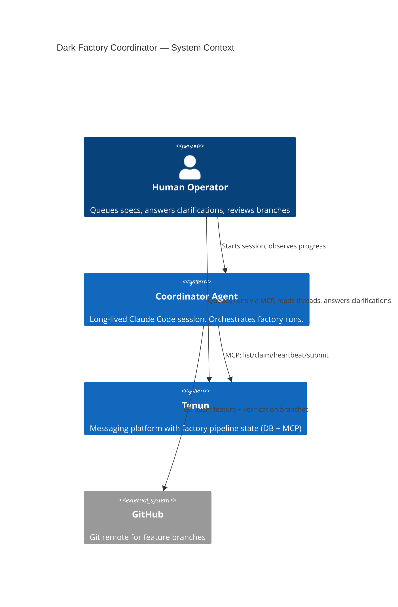
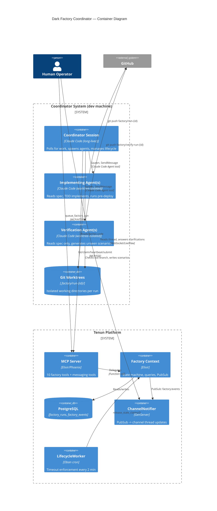
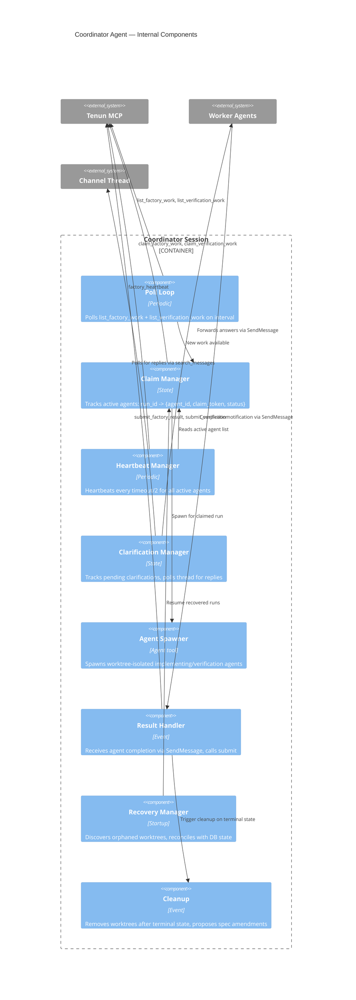

# Dark Factory Coordinator — Architecture Design

**Date:** 2026-04-09
**Status:** Draft
**Wave:** DESIGN (wave 3 of 6)
**Parent:** `docs/feature/dark-factory/design/architecture.md` (Phase 1, Approved)
**Inputs:** `docs/feature/dark-factory/discuss/` (21 artifacts from DISCUSS wave)

---

## 1. Business Drivers

From JTBD analysis (opportunity scores):

| Priority | Driver | Quality Attribute |
|----------|--------|------------------|
| 1 | Unattended execution (Job A, score 18) | **Autonomy** — system runs without human in the loop |
| 2 | Independent verification (Job H, score 16) | **Integrity** — results are independently validated |
| 3 | Clarification over guessing (Job B, score 15) | **Correctness** — ambiguity resolved, not assumed |
| 4 | Concurrent throughput (Job C, score 13) | **Throughput** — parallel execution within resource bounds |
| 5 | Crash resilience (Job E, score 13) | **Fault tolerance** — work survives coordinator failure |

**Primary quality attribute trade-off:** Autonomy vs. Correctness. The coordinator should run unattended (autonomy) but must ask when specs are ambiguous (correctness). The confidence threshold (>1 test case impact) is the architectural mechanism that balances these.

---

## 2. Constraints

| ID | Constraint | Source |
|----|-----------|--------|
| C-1 | Phase 1 backend must exist (MCP tools, Factory context, DB tables) | Architecture doc |
| C-2 | Claude Code Max subscription required | Resource |
| C-3 | Coordinator is client-side only — no Tenun server changes | NFR-1 |
| C-4 | Verification isolation is prompt-enforced, not cryptographic | Architecture doc §3 |
| C-5 | All execution on dev machine (GPU off-limits in prod) | CLAUDE.md |
| C-6 | Single developer, no team coordination concerns | Conway's Law N/A |
| C-7 | Elixir/functional paradigm for any server-side code | CLAUDE.md |

---

## 3. Architecture Pattern

**Pattern: Coordinator-Worker with Message Passing**

The coordinator is a long-lived Claude Code session that manages a bounded pool of worktree-isolated worker agents. Communication uses Claude Code's built-in primitives:
- **Agent tool** with `isolation: "worktree"` for worker spawning
- **SendMessage** for coordinator <-> agent communication
- **MCP tools** for coordinator <-> Tenun communication
- **Channel threads** for coordinator <-> human communication

This is NOT a traditional software architecture. There is no new server-side code. The "components" are Claude Code sessions with specific prompts and behaviors.

### Why This Pattern

| Alternative | Rejected Because |
|------------|-----------------|
| Scheduled task (Option A from spec) | Polling latency (3 min). Agents must be spawned fresh each cycle or tracked across invocations. No natural coordination. |
| Skill-triggered background agents (Option C) | Background agent lifecycle management is complex. No natural way to relay clarifications. |
| Tenun-orchestrated (GenServer per run) | Phase 2 territory. Requires Agent SDK migration. Premature. |

The coordinator-worker pattern with a long-lived session provides:
- Stateful coordination (tracks active agents, clarification state)
- Natural message passing (SendMessage between coordinator and workers)
- Bounded concurrency (coordinator controls how many agents spawn)
- Centralized MCP interaction (workers don't need MCP access)

---

## 4. C4 Diagrams

### 4.1 System Context



### 4.2 Container Diagram



### 4.3 Component Diagram — Coordinator Internals



---

## 5. State Management

### Durable State (Tenun-side, via MCP)

| State | Storage | Owner |
|-------|---------|-------|
| Run status, attempt, results | `factory_runs` table | Factory context |
| Event audit log | `factory_events` table | Factory context |
| Thread messages (progress, clarifications) | Channel messages | Messaging context |

### Ephemeral State (Coordinator-local)

| State | Storage | Lost on crash? | Recovery strategy |
|-------|---------|:--------------:|-------------------|
| Active agents map (`run_id -> {agent_id, claim_token, worktree_path}`) | In-memory | Yes | Worktree discovery + DB reconciliation |
| Agent sub-state (`working` / `clarifying`) | In-memory | Yes | Thread is the audit trail; re-read on recovery |
| Clarification tracking (`run_id -> [{id, status, question, answer}]`) | In-memory | Yes | Re-read thread messages |
| Concurrency slot count | In-memory | Yes | Count worktrees on recovery |

**Design principle:** The coordinator is stateless enough to restart. All durable state lives in Tenun (DB + threads). Coordinator-local state is a performance cache that can be reconstructed from durable sources.

---

## 6. Communication Patterns

### Coordinator -> Tenun (MCP, request-response)

```
coordinator --[MCP/SSE]--> Tenun MCP Server
  list_factory_work          -> [{run_id, spec_path, attempt, ...}]
  claim_factory_work(id,sha) -> {claim_token, ...}
  factory_heartbeat(id,tok)  -> {ok: true}
  submit_factory_result(...)  -> {status, ...}
  reply_to_thread(ch,msg,txt) -> {message_id}
  search_messages(query)     -> [{messages}]
```

### Coordinator -> Worker Agents (Claude Code primitives)

```
coordinator --[Agent tool]--> spawn(prompt, isolation: "worktree")
  Returns: agent_id, can SendMessage

coordinator --[SendMessage]--> agent
  "Clarification answer: per-channel ordering via Snowflake ID"

agent --[SendMessage]--> coordinator
  "Implementation complete. Branch pushed. All checks pass."
  "Clarification needed: {run_id, identifier, question}"
```

### Coordinator -> Human (via Tenun channel threads)

```
coordinator --[reply_to_thread]--> channel thread
  "[Factory: bulk-import] Implementing step 3/7: CSV parser"
  "[CLARIFY:run-42:spec:acceptance-criteria:3] <question>"

human --[thread reply]--> channel thread
  "Per-channel ordering via Snowflake ID"

coordinator --[search_messages]--> detect reply
```

---

## 7. Concurrency Architecture

```
                     Concurrency Limit (default: 2)
                     ┌─────────────────────────────┐
                     │  Slot 1        Slot 2        │
                     │  ┌──────┐     ┌──────┐      │
                     │  │run-42│     │run-57│      │
                     │  │impl  │     │impl  │      │
                     │  └──────┘     └──────┘      │
                     └─────────────────────────────┘
                                 │
                     ┌───────────┴───────────┐
                     │    Clarifying agents   │
                     │    count toward limit  │
                     │    (preserves resource │
                     │     guarantees)        │
                     └───────────────────────┘
```

**Decision:** Clarifying agents count toward the concurrency limit. Rationale:
- Worktrees and `_build` directories consume disk/memory even when agent is paused
- Resource guarantees must hold regardless of agent state
- If >50% of slots are blocked on clarification for >30 min, coordinator logs a warning
- The 2-hour clarification timeout prevents indefinite slot occupation

**Verification agents share the same pool.** The coordinator prioritizes implementation work over verification when slots are scarce (implementation is higher value — it unblocks verification). When all implementation is done, remaining slots go to verification.

---

## 8. Clarification Response Matching (OQ-3 Resolution)

**Decision: Positional with coordinator confirmation.**

```
Thread state:
  msg-100: [CLARIFY:run-42:spec:acceptance-criteria:3] <question>
  msg-101: (unrelated message from another user)
  msg-102: "Per-channel ordering via Snowflake ID"  <-- human reply

Coordinator behavior:
  1. Poll thread for messages after msg-100
  2. Filter to messages from non-bot users
  3. Skip messages that are themselves [CLARIFY:...] or [Factory:...] prefixed
  4. First qualifying message is treated as the response candidate
  5. Coordinator posts confirmation:
     "[Factory: run-42] Interpreting your reply as response to
      [CLARIFY:run-42:spec:acceptance-criteria:3]. Forwarding to agent."
  6. Human can correct within 2 minutes by replying "no, that was for something else"
  7. If no correction, answer is forwarded to agent
```

**Why not require `[RE:CLARIFY:...]` prefix:**
- Adds friction to the human's natural reply flow
- Easy to forget the prefix, especially on mobile
- The confirmation step catches mismatches without requiring user discipline

**Why not pure positional without confirmation:**
- Fragile when unrelated messages interleave
- Confirmation adds ~10 seconds of latency but prevents incorrect forwarding

**Multiple pending clarifications:** When a run has >1 pending clarification, the coordinator asks the human to specify which question they're answering:
```
"[Factory: run-42] You have 2 pending clarifications. Which are you answering?
 1. [CLARIFY:run-42:spec:acceptance-criteria:3] — ordering for concurrent senders
 2. [CLARIFY:run-42:spec:data-model:soft-delete] — soft delete behavior
 Reply with the number."
```

---

## 9. Crash Recovery Architecture

### Recovery Sequence

```
Coordinator starts (fresh or restart)
  |
  v
[1. Discover worktrees]
  ls .factory/run-*/
  -> found: [run-42, run-57]
  |
  v
[2. Query DB state for each]
  list_factory_runs(status: "all") via MCP
  -> run-42: status=implementing, claim_token=X (not yet timed out)
  -> run-57: status=queued (already released by LifecycleWorker)
  |
  v
[3. Reconcile]
  run-42: still implementing + worktree exists
    -> Attempt re-claim: claim_factory_work(run-42, current_sha)
    -> If success: reuse worktree, spawn agent, resume
    -> If {:error, :already_claimed}: another session claimed it
       -> Clean up worktree
  run-57: already queued (released)
    -> Clean up worktree (let it re-queue naturally with fresh worktree)
  |
  v
[4. Resume normal poll loop]
```

### Recovery Limitations

| Scenario | Outcome |
|----------|---------|
| Crash during implementation, timeout not elapsed | Re-claim succeeds. Worktree reused. Partial work preserved. |
| Crash during implementation, timeout elapsed | Run re-queued. Orphaned worktree cleaned up. Work restarts fresh. |
| Crash during clarification wait | Clarification state lost. Agent re-spawned. May re-ask the question. |
| Crash during verification | Verification run released. Re-claimed on next poll. |
| Crash with pushed branch but no submit | Run stays implementing. On re-claim, agent can detect branch exists. |

**Acceptable loss:** Clarification state and agent conversation context are lost on crash. The worktree (code) and thread (messages) survive. This is an acceptable trade-off for Phase 1 — full state persistence is Phase 2 (GenServer with checkpointing).

---

## 10. Agent Prompt Architecture

The coordinator system consists of three prompt artifacts:

### 10.1 Coordinator Skill

A Claude Code skill (`/factory-coordinator` or similar) that starts the coordinator loop. Contains:
- Poll loop logic (interval, concurrency management)
- Agent spawning with worktree isolation
- Heartbeat delegation
- Clarification relay
- Result handling and cleanup
- Recovery on startup

### 10.2 Implementing Agent Prompt

Injected by the coordinator when spawning via Agent tool. Contains:
- Spec reading instructions (at pinned commit SHA)
- Project context (CLAUDE.md, engineering principles, RCA docs)
- TDD workflow (tests from acceptance criteria, then implement)
- Heartbeat discipline (report progress via SendMessage to coordinator)
- Clarification protocol (when to ask vs. assume)
- Pre-deploy check requirement
- Branch naming convention

### 10.3 Verification Agent Prompt

Injected by the coordinator when spawning for verification. Contains:
- Isolation discipline (read spec FIRST, generate scenarios, THEN look at code)
- Spec reading instructions (at pinned commit SHA)
- Scenario generation categories (boundary, concurrency, error recovery, data integrity, project-specific antipatterns)
- Project constraint context (CLAUDE.md, RCA docs — for antipattern awareness)
- Verification branch convention
- Result reporting format

### Prompt Hierarchy

```
CLAUDE.md (project-level)
  -> Coordinator skill (orchestration-level)
    -> Implementing agent prompt (worker-level, includes spec content)
    -> Verification agent prompt (worker-level, includes spec content, excludes impl context)
```

Each level inherits from the one above. The coordinator skill reads CLAUDE.md. Agent prompts receive project context selected by the coordinator.

---

## 11. Integration Points with Existing Tenun

| Integration | Mechanism | Existing? | Changes? |
|-------------|-----------|:---------:|:--------:|
| MCP factory tools | HTTP/SSE via `.mcp.json` | Phase 1 | None |
| Channel thread messaging | `reply_to_thread` MCP tool | Yes | None |
| Thread polling | `search_messages` MCP tool | Yes | None |
| Feature flag | `:dark_factory` via FunWithFlags | Phase 1 | None |
| Bot user identity | MCP session authentication | Yes | None |
| Git worktrees | `git worktree add/remove` | Git primitive | None |
| Agent spawning | Claude Code `Agent` tool | Claude Code primitive | None |
| Agent messaging | Claude Code `SendMessage` | Claude Code primitive | None |

**Zero Tenun-side changes.** The coordinator is a pure consumer of existing interfaces.
