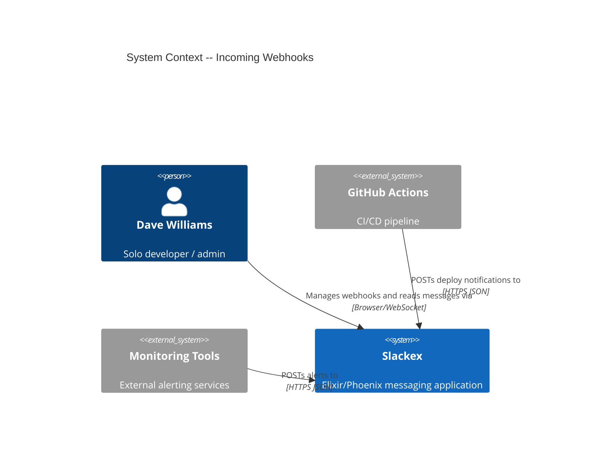
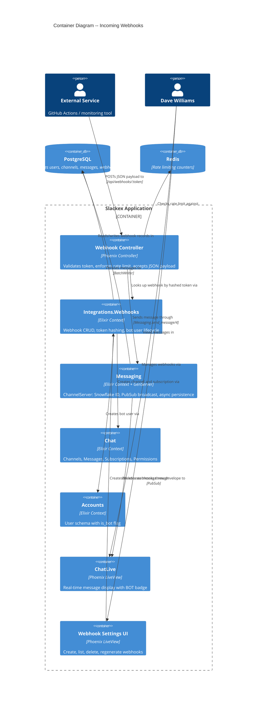

# Incoming Webhooks -- Architecture Design

## 1. System Context and Capabilities

Incoming Webhooks adds an HTTP API that allows external services (GitHub Actions, monitoring tools, custom scripts) to POST JSON messages into Slackex channels. Messages arrive from a bot user identity, flow through the existing messaging pipeline, and appear in real-time alongside regular human messages.

### Capabilities

| Capability | Description |
|-----------|-------------|
| Webhook CRUD | Create, list, delete, regenerate tokens for webhooks |
| Bot user identity | Automated senders with `is_bot` flag, no login credentials |
| Message delivery | HTTP POST creates a message indistinguishable from regular messages (except BOT badge) |
| Rate limiting | Per-webhook rolling window via Redis |
| Payload validation | Size limit, required fields, structured error responses |

### Quality Attributes (Priority Order)

1. **Simplicity** -- single developer, 4-5 day walking skeleton scope
2. **Security** -- token auth, rate limiting, XSS prevention via existing markdown scrubber
3. **Correctness** -- webhook messages appear in real-time via existing PubSub/Envelope pipeline
4. **Extensibility** -- general system for future integrations beyond deploy notifications

---

## 2. C4 System Context (L1)



---

## 3. C4 Container (L2)



---

## 4. Component Architecture

### 4.1 New Context: `Slackex.Integrations.Webhooks`

A new context module that owns webhook CRUD, token lifecycle, and the orchestration of bot user + channel setup during webhook creation. This follows the project convention of extracting new features into separate modules rather than growing `Chat` (1557 lines) or `Accounts`.

**Responsibilities:**
- Webhook record CRUD (create, list, get, delete)
- Token generation (`:crypto.strong_rand_bytes/1` with `whk_` prefix)
- Token hashing (SHA-256 before storage)
- Token lookup (hash incoming token, query by hash)
- Bot user creation (delegate to Accounts)
- Channel resolution (find existing or create new, delegate to Chat)
- Bot user subscription to target channel (delegate to Chat)
- Token regeneration (new token, re-hash, update record)
- Last-used timestamp tracking

**Does NOT own:**
- Message creation (delegated to `Messaging.send_message/4`)
- User schema (owned by `Accounts`)
- Channel/Subscription schema (owned by `Chat`)

### 4.2 New Schema: `Slackex.Integrations.Webhook`

| Field | Type | Notes |
|-------|------|-------|
| `id` | `bigserial` | Standard PK |
| `token_hash` | `binary` | SHA-256 hash of the plaintext token; unique index |
| `channel_id` | `references(channels)` | Target channel for messages |
| `bot_user_id` | `references(users)` | Bot user that sends messages |
| `description` | `string` | Optional human-readable description |
| `last_used_at` | `utc_datetime_usec` | Updated on each successful delivery |
| `inserted_at` | `utc_datetime_usec` | Creation timestamp |
| `updated_at` | `utc_datetime_usec` | Last modification timestamp |

Index: unique index on `token_hash` for O(1) lookup.

### 4.3 Schema Change: `Slackex.Accounts.User`

Add `is_bot` boolean field to the existing `users` table.

| Field | Type | Default | Notes |
|-------|------|---------|-------|
| `is_bot` | `boolean` | `false` | `NOT NULL`, default `false` at database level |

New changeset: `bot_changeset/2` -- accepts `username`, `display_name`, `is_bot` only. Validates `is_bot: true`. No email, no password.

The `is_bot` field must be added to the `Jason.Encoder` derive list so it is included in PubSub serialization and API responses.

The `is_bot` field must be included in the `serialize_sender/1` output in `ChannelServer` and `CatchupServer` so the BOT badge can render client-side.

### 4.4 Webhook Controller: `SlackexWeb.API.WebhookController`

A dedicated Phoenix controller for webhook delivery.

**Route**: `POST /api/webhooks/:token`

**Pipeline**: A new minimal pipeline (`webhook_api`) in the router with only `:accepts, ["json"]`. No session, no JWT, no CSRF, no auth plugs. The route must be defined outside all existing authenticated scopes.

**Validation pipeline (in order):**
1. Payload size -- enforced at Plug.Parsers level (16KB limit for this route)
2. JSON parsing -- standard Phoenix JSON parser
3. Token lookup -- hash incoming token, query `webhooks` table by `token_hash`
4. Rate limit check -- Redis-backed, per-webhook key (`webhook_rate:{webhook_id}`)
5. Payload validation -- `text` field required and non-empty
6. Channel existence check -- verify target channel still exists

**Walking skeleton pipeline note:** The walking skeleton implements all steps EXCEPT the rate limit check (step 4). Rate limiting is omitted entirely -- not stubbed -- and is implemented in Release 1 (US-05). The walking skeleton pipeline is: payload size → JSON parsing → token lookup → payload validation → channel existence → send message.

**Error responses (all JSON):**

| Status | Error Code | Condition |
|--------|-----------|-----------|
| 200 | `{"ok": true}` | Message delivered |
| 400 | `invalid_json` | Malformed JSON body |
| 400 | `missing_text_field` | `text` field missing or empty |
| 401 | `invalid_token` | Token not found in DB |
| 404 | `channel_not_found` | Target channel deleted after webhook created |
| 413 | `payload_too_large` | Body exceeds 16KB |
| 429 | `rate_limited` | Per-webhook rate limit exceeded; includes `Retry-After` header |

### 4.5 Message Flow: Webhook Delivery

The critical design decision is how webhook messages enter the messaging pipeline. See ADR-WHK-001 for the full analysis.

**Decision: Route through `Messaging.send_message/4` (via ChannelServer)**

```
External Service
  |
  | POST /api/webhooks/:token
  v
WebhookController
  |
  | 1. Hash token, lookup webhook
  | 2. Check rate limit (Redis)
  | 3. Validate payload
  v
Messaging.send_message(channel_id, bot_user_id, text)
  |
  | 4. ChannelServer.send_message/3
  |    - Snowflake ID generation
  |    - Permission check (bot user has subscription with "member" role)
  |    - In-memory queue + PubSub broadcast
  |    - BatchWriter async persistence
  v
PubSub "channel:{id}" -> {:envelope, %{event: "message.new"}}
  |
  v
ChatLive.Index (LiveView)
  |
  | handle_info({:envelope, ...})
  | Renders message with BOT badge if sender.is_bot
  v
Dave sees the message in real-time
```

This ensures webhook messages get:
- Snowflake ID ordering
- In-memory cache population
- PubSub broadcast (real-time delivery)
- Async batch persistence (same durability path)
- Push notifications
- Pipeline events (embedding, link preview triggers)

### 4.6 Rate Limiting

Reuse the existing `SlackexWeb.Plugs.RateLimit` pattern (Redis INCR + EXPIRE) but with a **per-webhook key** instead of per-IP.

- Key: `webhook_rate:{webhook_id}`
- Limit: 60 requests per 60-second rolling window (configurable)
- Fail-open on Redis unavailability (same as existing rate limiter)
- Response: 429 with `Retry-After` header (seconds until window reset)

This can be implemented as a new plug or as inline logic in the controller since the keying strategy differs from the existing IP-based plug.

### 4.7 Payload Size Enforcement

The global `Plug.Parsers` in `Endpoint` has a 1MB `:length` limit. Webhook payloads need a 16KB limit enforced **before** JSON parsing.

**Approach**: A dedicated plug in the webhook pipeline that checks `content-length` header and reads/limits the body before `Plug.Parsers` processes it. Alternatively, a separate `Plug.Parsers` configuration scoped to the webhook route via a router-level plug.

The crafter will determine the exact implementation mechanism. The requirement is: payloads over 16KB must be rejected with a 413 response before JSON decoding occurs.

### 4.8 Bot Message Display

The message rendering component checks `sender.is_bot` and conditionally renders a `[BOT]` badge.

**Data flow**: `sender.is_bot` must be available in the message map/struct at render time:
- `ChannelServer.serialize_sender/1` must include `is_bot` in its output map
- `CatchupServer.serialize_sender/1` must include `is_bot` in its output map
- The `Envelope` payload for `message.new` already includes `sender` -- no change needed to Envelope itself
- `User` `Jason.Encoder` derive list must include `:is_bot`

**Rendering locations** (all must show BOT badge):
- Main message list
- Thread panel
- Search results

### 4.9 Username Override

When the POST payload includes an optional `username` field, that value overrides the bot user's `display_name` **for that single message only**. The override does not modify the User record.

**Design tension**: `ChannelServer.send_message/3` takes `(server, sender_id, content)` and fetches/serializes the sender internally. There is no parameter to pass a display name override. The PubSub broadcast happens inside ChannelServer with the database-fetched sender info.

**Recommended approach**: The username override is a Release 1 feature (deferred from walking skeleton). When implementing it, the crafter has two viable paths:

1. **Extend ChannelServer API**: Add an optional 4th parameter (e.g., `opts \\ []`) to `send_message/3` that accepts `display_name_override: "CI Bot"`. ChannelServer applies the override to the serialized sender map before broadcasting. This keeps the single-pipeline benefit.

2. **Post-send patch**: The webhook controller calls `Messaging.send_message/4` as-is, then broadcasts a separate `message.sender_override` envelope with the override. The LiveView applies it on receipt. More complex, more fragile.

The crafter should prefer option 1 for simplicity. The architecture does not prescribe the implementation -- only that the override must not mutate the User record and must be visible to all connected clients in real-time.

### 4.10 Webhook Settings UI

A new LiveView page for webhook management. Given the project convention of extracting features into separate modules, this should be a dedicated LiveView component rather than adding to the existing `ChatLive.Index` (1739 lines).

**Route**: Under the authenticated `:chat` live_session scope (e.g., `/chat/settings/webhooks`)

**Views:**
- **List view**: All webhooks with display name, target channel, creation date, last-used timestamp. Empty state with explanation and CTA.
- **Create form**: Channel selector (existing or type new), display name (optional, defaults to "Webhook"), description (optional).
- **Confirmation page**: Shows webhook URL once with copy button and curl example. Warning that token is not retrievable after navigation.
- **Delete**: Confirmation dialog before deletion.
- **Regenerate token**: Confirmation dialog, shows new URL once.

### 4.11 Feature Flag

Gate the entire feature behind a FunWithFlags flag: `:incoming_webhooks`.

- Webhook delivery endpoint checks the flag and returns 404 when disabled
- Webhook settings UI is hidden when disabled
- Allows incremental rollout and kill-switch in production

---

## 5. Technology Stack

| Component | Technology | License | Rationale |
|-----------|-----------|---------|-----------|
| Webhook controller | Phoenix Controller | Apache 2.0 | Existing framework, standard JSON API pattern |
| Token generation | `:crypto.strong_rand_bytes/1` | Erlang/OTP (Apache 2.0) | Cryptographically secure, already available |
| Token hashing | `:crypto.hash(:sha256, ...)` | Erlang/OTP (Apache 2.0) | Industry standard for token hashing, already available |
| Rate limiting | Redis via Redix | Apache 2.0 (Redix) | Reuses existing Redis infrastructure and RateLimit plug pattern |
| Feature flags | FunWithFlags | MIT | Already in use across the project |
| Message pipeline | ChannelServer + BatchWriter | Project code | Existing pipeline, no new dependencies |
| Real-time delivery | Phoenix PubSub | MIT | Existing infrastructure |
| Encryption | Cloak.Ecto | MIT | Existing message encryption, webhook messages go through same changeset |
| Database | PostgreSQL 16 | PostgreSQL License (OSS) | Existing database |

**No new dependencies required.** All technology is already present in the project.

---

## 6. Integration Patterns

### 6.1 Webhook Creation Flow

```
WebhookSettingsLive (UI)
  |
  v
Integrations.Webhooks.create_webhook(params)
  |
  |-- 1. Generate token: :crypto.strong_rand_bytes(32) |> Base.url_encode64(padding: false)
  |-- 2. Prefix token: "whk_" <> raw_token
  |-- 3. Hash token: :crypto.hash(:sha256, prefixed_token)
  |-- 4. Resolve channel: find by name/slug or create new (via Chat.Channels)
  |-- 5. Create bot user: Accounts.create_bot_user(display_name, is_bot: true)
  |-- 6. Subscribe bot user to channel: Chat.Channels.join_channel(bot_user_id, channel_id)
  |-- 7. Insert Webhook record: {token_hash, channel_id, bot_user_id, description}
  |-- 8. Return {:ok, webhook, plaintext_token} (token shown once)
  v
Confirmation page shows URL with embedded token
```

Steps 4-7 should be wrapped in an `Ecto.Multi` transaction so partial creation (e.g., bot user created but webhook insert fails) is rolled back.

**Walking skeleton constraint:** `create_webhook` must validate that the target channel is public (not private or a DM). Private channel webhook support is deferred to Release 2. Reject with a clear error (e.g., `{:error, :private_channel_not_supported}`) if a non-public channel is provided.

### 6.2 Webhook Delivery Flow

```
POST /api/webhooks/:token
  |
  v
WebhookController.deliver/2
  |
  |-- 1. Hash token: :crypto.hash(:sha256, token)
  |-- 2. Lookup: Webhooks.get_by_token_hash(hash)
  |       -> 401 if not found
  |-- 3. Feature flag: FunWithFlags.enabled?(:incoming_webhooks)
  |       -> 404 if disabled
  |-- 4. Rate limit: check_rate("webhook_rate:#{webhook.id}", 60, 60)
  |       -> 429 + Retry-After if exceeded
  |-- 5. Validate: payload["text"] present and non-empty
  |       -> 400 if missing
  |-- 6. Channel check: Chat.Channels.get_channel!(webhook.channel_id)
  |       -> 404 if deleted
  |-- 7. Send: Messaging.send_message(webhook.channel_id, webhook.bot_user_id, text)
  |-- 8. Update last_used_at (async, non-blocking)
  |-- 9. Return 200 {"ok": true}
  v
Message appears in real-time via PubSub
```

### 6.3 API Contract

**Request:**
```
POST /api/webhooks/:token HTTP/1.1
Content-Type: application/json

{
  "text": "**Deployed: v0.5.81**\n\nRepo: davewil/slackex",
  "username": "CI Bot"    // optional
}
```

**Success response:**
```
HTTP/1.1 200 OK
Content-Type: application/json

{"ok": true}
```

**Error response:**
```
HTTP/1.1 429 Too Many Requests
Content-Type: application/json
Retry-After: 30

{"ok": false, "error": "rate_limited"}
```

---

## 7. Quality Attribute Strategies

### 7.1 Security

| Threat (STRIDE) | Mitigation |
|-----------------|-----------|
| **Spoofing** (invalid token) | SHA-256 hashed tokens; timing-safe comparison via DB query; 401 on mismatch |
| **Tampering** (payload manipulation) | Input validation; message content goes through existing Cloak encryption |
| **Information Disclosure** (token leakage) | Token shown once on creation; only hash stored; no token in logs |
| **Denial of Service** (flood) | Per-webhook rate limiting (60/min); 16KB payload size limit |
| **Elevation of Privilege** (bot acting beyond scope) | Bot user has "member" role subscription to specific channel only; standard permission checks apply |

Additional security measures:
- Webhook route outside all auth pipelines -- no session/JWT leak vector
- No information leaked on invalid token (generic 401, no hint whether token format is valid)
- Markdown content sanitized by existing scrubber (XSS prevention)
- Bot users cannot authenticate via login flows (no `hashed_password`)

### 7.2 Reliability

- Webhook delivery reuses the proven ChannelServer pipeline with async BatchWriter persistence
- Rate limiter fails open on Redis unavailability (requests allowed through)
- Channel deletion handled gracefully (404 response, not crash)
- Non-blocking `last_used_at` update -- delivery succeeds even if timestamp update fails

### 7.3 Maintainability

- New `Integrations.Webhooks` context -- clean boundary, does not grow existing large modules
- Reuses existing components: Messaging pipeline, PubSub, Envelope, RateLimit pattern, FunWithFlags
- Single new DB table (`webhooks`) + one column addition (`users.is_bot`)

### 7.4 Performance

- Token lookup: single indexed query on `token_hash` (unique index, O(1))
- Message delivery: same ChannelServer path as regular messages (sub-millisecond in-memory, async DB write)
- Rate limit check: single Redis INCR (sub-millisecond)
- No impact on regular message latency -- webhook messages enter the same pipeline

### 7.5 Observability

- Webhook delivery endpoint is already covered by Phoenix telemetry (`[:phoenix, :endpoint]`)
- ChannelServer telemetry events fire for webhook messages (same pipeline)
- Rate limit events visible in Redis
- `last_used_at` provides operational visibility for troubleshooting

---

## 8. Migration Strategy

Two migrations needed:

**Migration 1: Add `is_bot` to users**
- `ALTER TABLE users ADD COLUMN is_bot boolean NOT NULL DEFAULT false`
- Safe: adds column with default, no data migration needed
- Backward compatible: existing users get `is_bot: false`

**Migration 2: Create `webhooks` table**
- Standard `CREATE TABLE` with foreign keys to `users` and `channels`
- Unique index on `token_hash`
- No data migration

Both are expand-only (no contract phase needed). Safe for zero-downtime deploy.

---

## 9. Dependency Analysis

### Existing components reused (no modification needed):
- `Messaging.send_message/4` -- entry point for message delivery
- `ChannelServer` -- Snowflake ID, PubSub, BatchWriter pipeline
- `BatchWriter` -- async persistence with epoch fencing
- `Envelope.wrap/4` -- versioned PubSub envelope
- `Chat.Channels.create_channel/2` -- channel auto-creation
- `Chat.Channels.join_channel/2` -- bot user subscription
- `Chat.Permissions.can?/2` -- role-based authorization
- `Plug.Parsers` -- JSON parsing
- Redix connection pool -- rate limiting
- FunWithFlags -- feature flag

### Existing components requiring modification:
- `Accounts.User` schema -- add `is_bot` field, add `bot_changeset/2`, update `Jason.Encoder` derive list
- `ChannelServer.serialize_sender/1` -- include `is_bot` in output map
- `CatchupServer.serialize_sender/1` -- include `is_bot` in output map
- `SlackexWeb.Router` -- add webhook route and pipeline
- `SlackexWeb.Endpoint` (possibly) -- webhook-specific body size limit
- Message display components -- conditional BOT badge rendering

### New components:
- `Slackex.Integrations.Webhook` -- schema
- `Slackex.Integrations.Webhooks` -- context module
- `SlackexWeb.API.WebhookController` -- delivery endpoint
- `SlackexWeb.WebhookSettingsLive` -- management UI (walking skeleton may defer this)
- Rate limit plug or function for per-webhook keying
- Migration files (2)

---

## 10. Risk Assessment

| Risk | Likelihood | Impact | Mitigation |
|------|-----------|--------|-----------|
| Bot user lacks subscription/permission to send | HIGH (must be explicitly set up) | Message delivery fails silently | Webhook creation flow atomically subscribes bot user with "member" role |
| Token hash mismatch between creation and lookup | MEDIUM | All webhook delivery broken | Integration test: create webhook, POST with returned token, verify 200 |
| ChannelServer not running for target channel | LOW | Delivery fails | `Messaging.send_message/4` calls `ChannelSupervisor.ensure_started/1` -- auto-starts |
| Payload size bypass | LOW | Memory pressure | Enforce at plug level before JSON parsing, not after |
| Rate limit Redis unavailable | LOW | Flood possible | Accept risk: fail-open matches existing pattern; 60/min is modest |
| Channel deleted after webhook created | LOW | 404 on delivery | Handled gracefully; webhook list shows warning |
| Private channel as webhook target | MEDIUM | `join_channel/2` rejects private channels | Webhook creation must use direct subscription insert (bypassing `join_channel/2` private check) or restrict webhooks to public channels only. Crafter decides based on product needs. |
| Ecto upsert nil-id on subscription | LOW | Ghost struct | Subscription has composite PK (no auto-id), so nil-id is not applicable. But crafter should verify upsert behavior per CLAUDE.md convention. |

---

## 11. Walking Skeleton Scope

Per the story map, the walking skeleton is the thinnest end-to-end slice:

1. `is_bot` field on User schema + bot changeset
2. Webhook schema + context (create webhook via IEx/seed, no UI)
3. Webhook delivery controller at `/api/webhooks/:token`
4. Payload size limit enforcement (16KB via Plug.Parsers `:length`)
5. BOT badge in message display
6. CI integration (update `ci-deploy.yml`)
7. Walking skeleton supports public channels only. Private channel webhook support is deferred to Release 2.

Deferred to Release 1: Rate limiting (US-05), structured error responses, webhook management UI
Deferred to Release 2: Token regeneration, last-used tracking, auto-create channel, private channel webhook support
