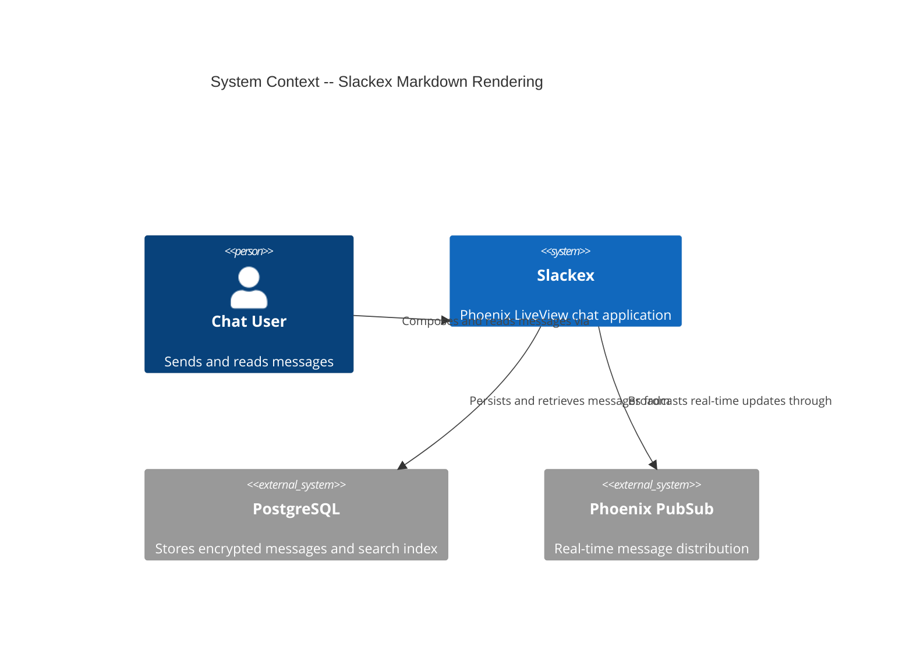
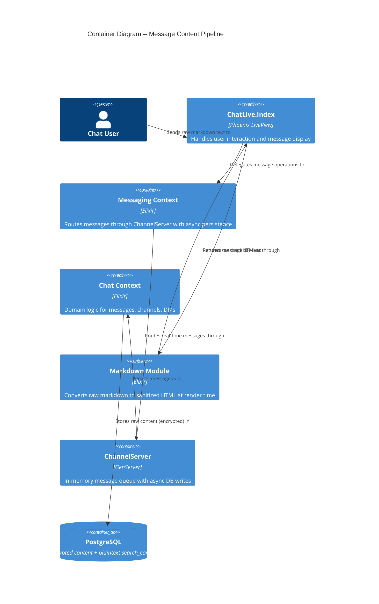

# Markdown Rendering -- Architecture Design

## 1. System Context and Problem Statement

Slackex is an Elixir/Phoenix LiveView chat application with encrypted message storage (Cloak AES-256-GCM) and a plaintext `search_content` companion column for FTS. Markdown rendering was added as a feature-flagged capability but the storage and render pipelines have architectural conflicts that required compensating hacks.

### Current (Broken) Pipeline

```
STORAGE:  user input -> strip_tags(content) -> Cloak encrypt -> PostgreSQL
RENDER:   PostgreSQL -> Cloak decrypt -> unescape_html() -> chat_preprocess() -> Earmark -> Scrubber -> raw()
```

**Problems:**

1. `strip_tags` encodes `>` to `&gt;`, `<` to `&lt;`, `&` to `&amp;` -- destroying markdown syntax (blockquotes use `>`)
2. `unescape_html()` exists solely to undo what `strip_tags` did -- a compensating hack
3. Double XSS protection: `strip_tags` at storage AND Scrubber at render are redundant
4. `search_content` stores HTML-encoded text, degrading FTS quality for queries containing `&gt;` etc.
5. Thread panel does not pass `markdown_enabled`, causing inconsistent rendering

### Quality Attributes (Priority Order)

1. **Maintainability** -- no compensating hacks; single clear pipeline
2. **Security** -- XSS prevention must remain solid with defense in depth
3. **Correctness** -- markdown renders reliably in all contexts (channels, DMs, threads, summaries)
4. **Simplicity** -- hobby project, single developer; no over-engineering

### Constraints

- Single developer, hobby project
- Elixir/Phoenix/LiveView, PostgreSQL, Cloak encryption
- Tailwind v4 standalone CLI with vendored plugins (daisyUI, heroicons)
- ~1200 tests, production deployment
- Feature flag (`FunWithFlags :markdown_rendering`) controls markdown on/off
- Existing messages in DB have HTML-encoded entities from `strip_tags`
- `search_content` is plaintext companion for FTS + embedding pipelines

## 2. C4 Diagrams

### 2.1 System Context (L1)



### 2.2 Container Diagram (L2)



## 3. Component Architecture

### 3.1 Target Pipeline Design

```
STORAGE:  user input -> validate_content() -> Cloak encrypt -> PostgreSQL
                                           -> search_content (plaintext, raw)

RENDER (markdown ON):   content -> chat_preprocess() -> Earmark -> Scrubber -> raw()
RENDER (markdown OFF):  content -> HEEx auto-escaping (default Phoenix behavior)
```

**Key changes:**

- **Remove `strip_tags` from all storage paths** -- it is not needed. The Scrubber handles XSS at render time when markdown is on; HEEx auto-escaping handles it when markdown is off.
- **Remove `unescape_html` from render path** -- no longer needed since content is stored raw.
- **Content validation replaces sanitization** -- validate length and non-emptiness of raw content; do not mutate it.
- **search_content stores raw text** -- better FTS quality since `>`, `&`, `<` are stored as-is.

### 3.2 Component Boundaries

| Component | Responsibility | Changes |
|-----------|---------------|---------|
| `Slackex.Markdown` | Render-time conversion: raw markdown to sanitized HTML | Remove `unescape_html/1`; keep `chat_preprocess/1`, Earmark, Scrubber, `add_link_attributes/1` |
| `Slackex.Markdown.Scrubber` | XSS defense: allowlist-based HTML sanitization | No changes -- already correct |
| `Slackex.Chat.Messages` | Message CRUD with permission checks | Remove `strip_tags` from `send_message/3`, `edit_message/3`, `send_reply/4` |
| `Slackex.Chat.DMs` | DM messaging and request management | Remove `strip_tags` from `send_dm/3`, `accept_dm_request/2` |
| `Slackex.Messaging.ChannelServer` | Real-time message routing with async persistence | Remove `strip_tags` from `handle_call(:send_message)` and `validate_content/1` |
| `SlackexWeb.ChatComponents` | UI rendering of message bubbles | No changes -- `render_content/2` dispatch already correct |
| `SlackexWeb.ChatLive.ThreadPanelComponent` | Thread panel display | Pass `markdown_enabled` to `message_bubble` calls |
| `SlackexWeb.ChatLive.Index` | Main LiveView | Pass `markdown_enabled` to `ThreadPanelComponent` |
| `Slackex.Markdown.Migration` | One-time data migration module | Decode existing HTML-encoded entities in DB content and search_content |
| `assets/css/app.css` | Custom `.prose` styles for markdown | No changes -- already correct |

### 3.3 Security Model

XSS prevention uses **defense in depth** with two independent layers:

| Layer | When Markdown ON | When Markdown OFF |
|-------|-----------------|-------------------|
| Primary | `Slackex.Markdown.Scrubber` strips unsafe HTML from Earmark output | HEEx auto-escaping (Phoenix default) |
| Secondary | Earmark `compact_output: true` limits generated HTML surface | Content stored raw but never rendered via `raw()` |
| Tertiary | Scrubber URI allowlist (`https`, `http`, `mailto` only) | N/A (no link rendering) |

**Why removing `strip_tags` is safe:**

1. When markdown is OFF, content is rendered via `{@rendered_content}` in HEEx which auto-escapes all HTML entities. A `<script>` tag becomes `&lt;script&gt;` in the browser. No XSS possible.
2. When markdown is ON, content passes through Earmark (which parses markdown, not arbitrary HTML) then through the Scrubber (which strips any tag not in the allowlist). `<script>`, `<iframe>`, `onclick` attributes are all stripped. No XSS possible.
3. `strip_tags` was a third layer that actively harmed markdown syntax while providing no unique security value.

### 3.4 Data Migration Strategy

Existing messages in the database have HTML-encoded entities from `strip_tags` (e.g., `&gt;` instead of `>`). This must be addressed:

**Approach: Backfill migration (Ecto migration + Release task)**

1. An Ecto migration adds a `content_migrated` boolean column (default `false`) as a migration marker, or alternatively tracks progress in a separate tracking mechanism.
2. A Release task (like existing `backfill_embeddings`) iterates messages in batches, decrypting content via Cloak, running `unescape_html/1` on it, re-encrypting, and updating both `encrypted_content` and `search_content`.
3. The `Markdown.to_html/1` function retains `unescape_html/1` temporarily as a compatibility shim until migration completes, then removes it.
4. Migration is idempotent: running `unescape_html` on already-clean content is a no-op (no `&gt;` sequences to replace).

**Risk mitigation:**
- Run on a small batch first to verify Cloak round-trip integrity
- The idempotent nature means it is safe to re-run
- Feature flag allows disabling markdown rendering if issues arise

### 3.5 Thread Panel Fix

`ThreadPanelComponent` renders `message_bubble` without passing `markdown_enabled`. Two locations need the attribute:

1. Parent message display (line 62)
2. Reply messages display (line 79)

The `Index` LiveView must pass `markdown_enabled` as an assign to the `ThreadPanelComponent` live_component call.

## 4. Technology Stack

| Technology | Purpose | License | Rationale |
|-----------|---------|---------|-----------|
| Earmark | Markdown to HTML parser | Apache 2.0 | Already in use; mature Elixir library; CommonMark-compatible |
| HtmlSanitizeEx | HTML sanitization (Scrubber) | MIT | Already in use; provides allowlist-based scrubbing |
| Custom CSS `.prose` | Markdown typography styles | N/A (project code) | Already implemented; avoids `@tailwindcss/typography` npm dependency incompatible with standalone CLI |
| FunWithFlags | Feature flag for `:markdown_rendering` | MIT | Already in use for feature gating |

No new dependencies required.

## 5. Integration Patterns

### 5.1 Message Storage Flow (all paths)

```
LiveView/ChannelServer
  -> validate_content(content)         # length check, non-empty check (NO strip_tags)
  -> Chat.Messages.send_message(...)   # raw content stored
    -> Message.changeset(...)
      -> put_search_content()          # copies raw content to search_content
      -> Cloak encrypts content field  # encrypted_content column in DB
    -> Repo.insert()
  -> PubSub broadcast (raw content in payload)
```

### 5.2 Message Render Flow

```
LiveView receives message (DB or PubSub)
  -> ChatComponents.render_content(content, markdown_enabled)
    -> if markdown_enabled:
         Markdown.to_html(content)
           -> chat_preprocess()        # insert blank lines for chat-style input
           -> Earmark.as_html!()       # markdown -> HTML
           -> Scrubber.scrub()         # XSS prevention allowlist
           -> add_link_attributes()    # target="_blank" rel="noopener"
           -> Phoenix.HTML.raw()       # mark as safe for HEEx
    -> if not markdown_enabled:
         content                       # returned as-is; HEEx auto-escapes
```

### 5.3 All Storage Paths Requiring strip_tags Removal

| File | Function | Line | Notes |
|------|----------|------|-------|
| `lib/slackex/chat/messages.ex` | `send_message/3` | 78 | Channel messages |
| `lib/slackex/chat/messages.ex` | `edit_message/3` | 39 | Message editing |
| `lib/slackex/chat/messages.ex` | `send_reply/4` | 246 | Thread replies |
| `lib/slackex/chat/dms.ex` | `send_dm/3` | 113 | Direct messages |
| `lib/slackex/chat/dms.ex` | `accept_dm_request/2` | 230 | DM request acceptance (preview message) |
| `lib/slackex/messaging/channel_server.ex` | `handle_call(:send_message)` | 136 | Real-time path |
| `lib/slackex/messaging/channel_server.ex` | `validate_content/1` | 409 | Validation helper |

### 5.4 All Render Paths Requiring markdown_enabled

| File | Component/Function | Status |
|------|-------------------|--------|
| `chat_components.ex` | `message_bubble` | Already wired |
| `chat_components.ex` | `message_stream` | Already wired |
| `index.ex` | Channel message stream | Already wired |
| `index.ex` | DM message stream | Already wired |
| `index.ex` | Summary modal | Already wired |
| `summary_modal.ex` | Summary display | Already wired |
| `thread_panel_component.ex` | Parent message + replies | **MISSING -- must fix** |

## 6. Quality Attribute Strategies

### 6.1 Maintainability

- Single responsibility: storage validates, render sanitizes
- No compensating hacks (`unescape_html` removed after migration)
- `chat_preprocess` remains as legitimate domain logic (chat != document markdown)

### 6.2 Security

- Defense in depth maintained: Scrubber (markdown ON) or HEEx auto-escape (markdown OFF)
- URI scheme allowlist on links (`https`, `http`, `mailto`)
- `rel="noopener noreferrer"` and `target="_blank"` on all rendered links
- Feature flag provides kill switch if security issue discovered

### 6.3 Correctness

- All 7 render paths verified for `markdown_enabled` propagation
- Thread panel fix ensures consistency across all conversation views
- `chat_preprocess` handles the chat-vs-document markdown gap correctly

### 6.4 Simplicity

- No new dependencies
- No new modules except the one-time migration task
- Removing code (`strip_tags`, `unescape_html`) rather than adding complexity

## 7. Deployment Strategy

### Phase 1: Remove strip_tags + Fix Thread Panel (backward-compatible)

1. Remove `strip_tags` from all 7 storage paths
2. Replace with raw content passthrough (validation only, no mutation)
3. Pass `markdown_enabled` through to `ThreadPanelComponent`
4. Keep `unescape_html` in `Markdown.to_html/1` for existing data compatibility
5. Deploy -- new messages stored clean, old messages still render correctly via `unescape_html`

### Phase 2: Backfill Migration

1. Add release task to decode HTML entities in existing messages
2. Run in production during low-traffic period
3. Verify via sampling that content round-trips correctly through Cloak

### Phase 3: Remove unescape_html

1. After migration confirms all data clean, remove `unescape_html` from `Markdown.to_html/1`
2. Remove the compatibility shim -- pipeline is now clean end-to-end

## Review Feedback -- Required Controls

**Review status:** Conditionally approved (3 high issues, 1 medium issue)

The following controls must be implemented before the feature ships. They address gaps identified during architecture review.

### CI Grep Check: Prevent Unguarded `raw()` Usage

Add a CI step that fails the build if `raw(` appears outside of `Markdown.to_html/1`. Since raw content is now stored in the database (per ADR-002), any use of `raw()` that bypasses the Scrubber is a potential XSS vector. The grep check enforces this structurally rather than relying on developer discipline.

```bash
# Fail if raw( is used outside Markdown.to_html/1
# Allowlisted file: lib/slackex/markdown.ex
grep -rn 'raw(' lib/ --include='*.ex' --include='*.heex' \
  | grep -v 'lib/slackex/markdown.ex' \
  | grep -v '#.*raw(' \
  && echo "ERROR: raw() used outside Markdown.to_html/1" && exit 1 \
  || true
```

**Severity:** High -- without this, a future developer could introduce XSS by calling `raw(message.content)` directly.

### Acceptance Test: Stored `<script>` Stripped by Scrubber (Markdown ON)

An acceptance test must verify that if a `<script>alert('xss')</script>` payload is stored in the database (simulating a pre-existing or injected message), the Scrubber strips it completely when markdown rendering is enabled.

```elixir
test "stored script tag is stripped by Scrubber when markdown is enabled" do
  # Store a message with a script tag (simulating raw storage)
  {:ok, message} = insert_message_with_content("<script>alert('xss')</script>")
  html = Markdown.to_html(message.content)
  refute html =~ "<script>"
  refute html =~ "alert("
end
```

**Severity:** High -- validates the primary XSS defense layer for the markdown-on path.

### Acceptance Test: Stored `<script>` Escaped by HEEx (Markdown OFF)

An acceptance test must verify that if a `<script>` payload is stored in the database, HEEx auto-escaping renders it as visible text (not executable HTML) when markdown rendering is disabled.

```elixir
test "stored script tag is escaped by HEEx when markdown is disabled" do
  {:ok, message} = insert_message_with_content("<script>alert('xss')</script>")
  # When markdown is OFF, content is interpolated directly in HEEx
  # which auto-escapes to &lt;script&gt;
  rendered = render_component(&message_bubble/1, content: message.content, markdown_enabled: false)
  refute rendered =~ "<script>"
  assert rendered =~ "&lt;script&gt;"
end
```

**Severity:** High -- validates the primary XSS defense layer for the markdown-off path.

### Render Path Audit: Verify All Content References

Before shipping, grep all references to `Message.content` and `.content` in LiveView/component files to verify every render path is covered by either the Scrubber or HEEx auto-escaping. The table in section 5.4 lists known paths, but a grep audit catches any paths added after this document was written.

```bash
grep -rn '\.content' lib/slackex_web/ --include='*.ex' --include='*.heex' \
  | grep -v 'search_content' \
  | grep -v 'message_content' \
  | grep -v '#'
```

**Severity:** Medium -- the known paths are documented, but new paths could be introduced between design and implementation.
