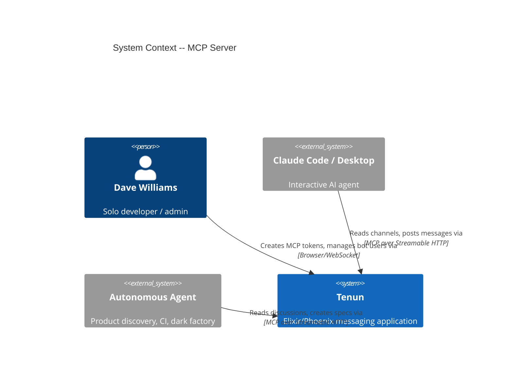
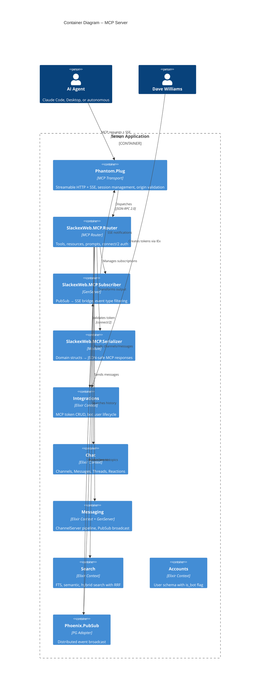

# MCP Server -- Architecture Design

**Date:** 2026-03-22
**Status:** Approved
**Library:** `phantom_mcp` ~> 0.3.4
**MCP Protocol Version:** 2025-03-26 (Phantom default)
**Related:** `docs/research/mcp-product-discovery-workflow-discovery-2026-03-08.md`

---

## 1. System Context and Capabilities

Tenun exposes an MCP (Model Context Protocol) server that allows external AI agents to read channels, send messages, search history, and receive real-time events. Agents bring their own intelligence -- Tenun is the platform, not the AI provider.

### Capabilities

| Capability | Description |
|-----------|-------------|
| Channel resources | List channels, read metadata, paginated messages, threads |
| Messaging tools | Send messages, reply to threads, react to messages (as bot user) |
| Search tool | Hybrid FTS/semantic/text search across authorized channels |
| Real-time subscriptions | SSE notifications for channel events (configurable event types) |
| Prompt templates | Channel summarization, spec drafting from discussions |
| Bearer token auth | SHA-256 hashed tokens, one bot user per token, show-once |

### Quality Attributes (Priority Order)

1. **Platform extensibility** -- general-purpose agent interface, not tied to a single consumer
2. **Real-time** -- agents react to messages as they happen via PubSub-backed SSE
3. **Security** -- bearer token auth, bot user authorization, serializer boundary prevents data leakage
4. **Simplicity** -- lean surface (~15 tools/resources), 4 new files, 4 modified files
5. **Multi-node** -- Phantom.Tracker + Phoenix.PubSub PG adapter for distributed SSE sessions

### Consumers

| Consumer | Access Pattern | Example |
|----------|---------------|---------|
| Claude Code / Desktop | Interactive, local or remote | Developer reads channels while coding |
| Autonomous agents | Remote, long-running | Product discovery bot, CI status agent |
| Dark factory (future) | Remote, pipeline-driven | Spec refinement, status updates |

---

## 2. C4 System Context (L1)



---

## 3. C4 Container (L2)



---

## 4. MCP Resources (Read Access)

Resources are read-only data the agent can access.

| Resource URI | Handler | Maps To | Description |
|---|---|---|---|
| `tenun:///channels` | `list_channels/2` | `Chat.list_public_channels/1` | All public channels with member counts |
| `tenun:///channels/:id` | `read_channel/2` | `Chat.get_channel!/1` + `Chat.count_members/1` | Channel metadata: name, slug, description, member count |
| `tenun:///channels/:id/messages` | `read_messages/2` | `Chat.list_messages/2` | Paginated messages. Snowflake cursor: `before`/`after` params. Default limit 50, max 200 |
| `tenun:///channels/:id/threads/:message_id` | `read_thread/2` | `Chat.list_thread/2` | Full thread from a parent message |
| `tenun:///users/:id` | `read_user/2` | `Accounts.get_user/1` | Display name, username, avatar_url, is_bot |

### Pagination

Messages use Snowflake ID cursors matching the existing `list_messages/2` API:
- `before: <snowflake_id>` -- messages older than this ID
- `after: <snowflake_id>` -- messages newer than this ID
- `limit: <integer>` -- default 50, max 200

### Subscriptions

Agents subscribe to `tenun:///channels/:id/messages` for real-time updates. See Section 7 for the PubSub bridge design.

### Authorization

**The MCP router must enforce channel membership before calling read functions.** Neither `Chat.list_messages/2` nor `Chat.list_thread/2` check membership internally — they query by channel/message ID directly. The router handler must verify bot membership before every read:

```elixir
defp verify_membership(bot_user_id, channel_id) do
  if Chat.get_role(bot_user_id, channel_id), do: :ok, else: {:error, :unauthorized}
end

# In resource handler:
with :ok <- verify_membership(session.assigns.bot_user.id, channel_id),
     messages <- Chat.list_messages(channel_id, opts) do
  # ...
end
```

For threads, the handler must also verify the parent message belongs to the claimed channel_id in the URI to prevent cross-channel thread access.

### Pagination Limit Enforcement

The router handler enforces `min(limit, 200)` before passing to `Chat.list_messages/2`, since the domain function does not enforce a max.

### Excluded from v1

DMs, pins, invite links, moderation, read state, channel management. All can be added as resources later without breaking existing consumers.

---

## 5. MCP Tools (Write Access)

Tools are side-effecting actions the agent can perform.

| Tool | Input Schema | Maps To | Description |
|---|---|---|---|
| `send_message` | `{channel_id: string, content: string}` | `Messaging.send_message/4` | Post a message as the bot user |
| `reply_to_thread` | `{channel_id: string, parent_message_id: string, content: string}` | `Messaging.send_reply/5` | Reply to a thread as the bot user |
| `react_to_message` | `{channel_id: string, message_id: string, emoji: string}` | `Messaging.toggle_reaction/3` | Add/remove a reaction as the bot user |
| `search_messages` | `{query: string, mode?: string, channel_id?: string, limit?: integer}` | `Search.search_messages/3` | Search with mode: `text`, `semantic`, or `hybrid` (default). Optional channel scoping. |

### Tool Handler Wiring

Each tool handler injects the bot user from the session and maps to the correct domain function signature:

```elixir
# send_message: Messaging.send_message(channel_id, sender_id, content, opts)
def send_message(%{"channel_id" => channel_id, "content" => content}, session) do
  bot = session.assigns.bot_user
  case Messaging.send_message(channel_id, bot.id, content, []) do
    {:ok, msg} -> {:reply, Tool.text(Jason.encode!(Serializer.message(msg))), session}
    {:error, reason} -> {:reply, Tool.text("Error: #{reason}"), session}
  end
end

# reply_to_thread: Messaging.send_reply(channel_id, channel_type, sender_id, parent_id, content)
# channel_type is hardcoded to :channel since MCP v1 only targets channels (not DMs)
def reply_to_thread(%{"channel_id" => cid, "parent_message_id" => pid, "content" => content}, session) do
  bot = session.assigns.bot_user
  case Messaging.send_reply(cid, :channel, bot.id, pid, content) do
    {:ok, msg} -> {:reply, Tool.text(Jason.encode!(Serializer.message(msg))), session}
    {:error, reason} -> {:reply, Tool.text("Error: #{reason}"), session}
  end
end

# react_to_message: channel_id included in input for membership verification
def react_to_message(%{"channel_id" => cid, "message_id" => mid, "emoji" => emoji}, session) do
  bot = session.assigns.bot_user
  with :ok <- verify_membership(bot.id, cid) do
    case Messaging.toggle_reaction(mid, bot.id, emoji) do
      {:ok, result} -> {:reply, Tool.text("Reaction #{elem(result, 0)}"), session}
      {:error, reason} -> {:reply, Tool.text("Error: #{reason}"), session}
    end
  end
end
```

Note: `react_to_message` includes `channel_id` for membership verification. The underlying `Messaging.toggle_reaction/3` looks up the message by ID, which may scan partitions. This is an accepted v1 limitation — the partition scan cost is negligible at current message volumes. Optimize in v2 if agent reaction volume increases.

### Authorization

Every tool call uses the bot user from the MCP session (loaded during `connect/2`). `Messaging.send_message/4` checks sender authorization internally via `Permissions.can?/3`. The `react_to_message` handler adds an explicit membership check since `toggle_reaction/3` does not.

### Search Tool

Exposes the existing hybrid search with all three modes:
- `text` -- PostgreSQL tsvector/tsquery FTS
- `semantic` -- pgvector cosine similarity
- `hybrid` (default) -- parallel FTS + semantic, merged with Reciprocal Rank Fusion (RRF, k=60)

`channel_id` is optional. Omit to search across all channels the bot can see. The `:message_search` feature flag is checked internally by `Search.search_messages/3`. The handler passes `bot_user.id` as the first argument — search authorization is handled internally by scoping results to channels the bot has access to.

### Error Handling

Tool errors return `isError: true` with a text description per MCP spec. Examples:
- Unauthorized channel access: `"Bot user is not a member of this channel"`
- Message not found: `"Message not found"`
- Search disabled: `"Message search is not enabled"`

### Excluded from v1

`edit_message`, `delete_message`, `pin_message`, channel management (create/join/leave). These are admin-level actions that should require elevated token scopes in v2.

---

## 6. MCP Prompts

Pre-built templates that help agents interact with Tenun effectively.

| Prompt | Arguments | Description |
|---|---|---|
| `summarize_channel` | `channel_id` (required), `since` (optional, ISO 8601 timestamp) | Returns a system prompt guiding the agent to fetch recent messages and produce a structured summary with key topics, decisions, and action items |
| `draft_spec` | `channel_id` (required), `thread_id` (optional) | Returns a prompt template guiding the agent to read a discussion and produce a structured feature spec with: title, problem statement, acceptance criteria (Given/When/Then), constraints, and open questions |

### Argument Completions

Both prompts offer completions for `channel_id` against the channel list, helping agents discover available channels.

### What Prompts Are NOT

Prompts don't execute anything. They return structured messages that guide the agent's behavior. The agent still uses tools and resources to read messages and post results.

---

## 7. Real-Time PubSub Bridge

### Architecture

```
Channel activity          PubSub                 MCP Bridge              Agent (SSE)
+------------+         +--------------+        +---------------+       +----------+
| User sends |         |              |        |               |       |          |
| message    |--------→| channel:{id} |-------→| McpSubscriber |--SSE-→| Agent    |
|            |         |              |        | (GenServer)   |       |          |
+------------+         | Events:      |        | Filters by    |       | Receives |
                       | new_message  |        | agent's event |       | resource |
                       | msg.edited   |        | type prefs    |       | update   |
                       | msg.deleted  |        |               |       | notif    |
                       | reaction.*   |        |               |       |          |
                       | typing       |        |               |       |          |
                       +--------------+        +---------------+       +----------+
```

### Subscription Flow

1. Agent calls `resources/subscribe` with URI `tenun:///channels/:id/messages` and optional `event_types` parameter
2. MCP router handler starts/configures a per-session `McpSubscriber` GenServer
3. `McpSubscriber` subscribes to `Phoenix.PubSub` topic `"channel:#{id}"`
4. PubSub envelopes arrive, `McpSubscriber` filters by requested event types
5. Matching events are forwarded as MCP `notifications/resources/updated` over the existing SSE connection
6. Agent calls `resources/unsubscribe` to stop -- `McpSubscriber` unsubscribes from PubSub topic

### Event Types

| PubSub Envelope Event | MCP Event Type | Payload |
|---|---|---|
| `message.new` | `new_message` | `{id, channel_id, sender_id, sender_username, content, inserted_at}` |
| `message.edited` | `message_edited` | `{id, content, edited_at}` |
| `message.deleted` | `message_deleted` | `{id, deleted_at}` |
| `reaction.toggled` | `reaction_toggled` | `{message_id, emoji, user_id, action}` |
| `typing` | `typing` | `{user_id, username}` |

**Important:** The `McpSubscriber` pattern-matches on the PubSub envelope's `event` field (e.g., `"message.new"`) and maps it to the MCP event type (e.g., `"new_message"`). These are different names — the PubSub events use dot notation, the MCP types use underscores. The mapping is explicit in the `McpSubscriber` module.

### Default Event Types

If agent doesn't specify `event_types`: `["new_message", "message_edited", "message_deleted"]`. Typing and reactions are opt-in only.

### Multi-Node

`Phantom.Tracker` handles distributed SSE sessions. `Phoenix.PubSub` with PG adapter distributes events across nodes. Events reach all connected agents regardless of which node they're connected to. No extra wiring.

### Cleanup

When the SSE connection drops, Phantom fires `disconnect/1`. The handler unsubscribes from all PubSub topics and stops the `McpSubscriber` process. Supervised under the MCP session -- crash isolation is automatic.

---

## 8. Authentication & Token Management

### Schema: `Integrations.McpToken`

| Field | Type | Notes |
|---|---|---|
| `token_hash` | `string` | SHA-256 of raw token (same pattern as webhooks) |
| `name` | `string` | Human label, e.g. "Claude Code - laptop" |
| `bot_user_id` | `references(:users)` | Bot user created atomically with token |
| `is_active` | `boolean` | Soft revocation (default: true) |
| `last_used_at` | `utc_datetime_usec` | Updated on `connect/2` |
| `inserted_at` | `utc_datetime_usec` | |

### Token Prefix

MCP tokens are prefixed with `mcp_` to distinguish from webhook tokens (`whk_` prefix if applicable).

### Creation Flow

Follows the same atomic Multi pattern as `Integrations.create_webhook/1`:

1. Generate cryptographically random token with `mcp_` prefix
2. Create bot user (`is_bot: true`, username derived from name)
3. Insert `McpToken` with SHA-256 hash in `Ecto.Multi` transaction
4. Return `{:ok, %{mcp_token: token_record, raw_token: "mcp_...", bot_user: user}}`

Show-once: raw token returned only at creation time. Token hash stored in DB.

### connect/2 Implementation

```elixir
def connect(session, %Plug.Conn{} = conn) do
  with ["Bearer " <> raw_token] <- Plug.Conn.get_req_header(conn, "authorization"),
       hash = Integrations.hash_token(raw_token),
       %McpToken{is_active: true} = token <- Integrations.get_mcp_token_by_hash(hash) do
    Integrations.touch_last_used(token)
    session = Session.assign(session, :bot_user, token.bot_user)
    session = Session.assign(session, :mcp_token, token)
    {:ok, session}
  else
    _ -> {:unauthorized, "Bearer"}
  end
end
```

### Channel Access

Bot users must be subscribed to channels to read or post. Token creator manually adds the bot to channels via existing `Chat.join_channel/2`. Same model as human users.

### Revocation

`Integrations.revoke_mcp_token/1` sets `is_active: false`. Next `connect/2` call rejects the token. Active SSE sessions are not forcibly disconnected (they'll fail on next request).

---

## 9. Module Structure

### New Files

| File | Purpose |
|---|---|
| `lib/slackex/integrations/mcp_token.ex` | Ecto schema for MCP tokens |
| `lib/slackex_web/mcp/router.ex` | `use Phantom.Router` -- tools, resources, prompts, connect/2 |
| `lib/slackex_web/mcp/subscriber.ex` | GenServer: PubSub → SSE bridge, event type filtering |
| `lib/slackex_web/mcp/serializer.ex` | Domain structs → JSON-safe MCP responses |

### Modified Files

| File | Change |
|---|---|
| `lib/slackex/integrations/integrations.ex` | Add `create_mcp_token/1`, `get_mcp_token_by_hash/1`, `touch_last_used/1`, `revoke_mcp_token/1`. Update Boundary exports to include `McpToken`. |
| `lib/slackex_web/router.ex` | Add `/mcp` scope with `:mcp` pipeline and Phantom.Plug forward |
| `config/config.exs` | MIME type config for SSE (Phantom requirement) |
| `mix.exs` | Add `{:phantom_mcp, "~> 0.3.4"}` dependency |

### Serializer Rationale

Domain structs contain encrypted fields (`content` in Message), internal associations, and metadata that must not leak to agents. The serializer is an explicit boundary:

```elixir
defmodule SlackexWeb.MCP.Serializer do
  def channel(%Channel{} = ch, member_count) do
    %{id: to_string(ch.id), name: ch.name, slug: ch.slug,
      description: ch.description, member_count: member_count,
      inserted_at: DateTime.to_iso8601(ch.inserted_at)}
  end

  def message(%Message{} = msg) do
    %{id: to_string(msg.id), channel_id: to_string(msg.channel_id),
      sender_id: to_string(msg.sender_id), content: msg.content,
      parent_message_id: msg.parent_message_id && to_string(msg.parent_message_id),
      reply_count: msg.reply_count, edited_at: msg.edited_at,
      inserted_at: DateTime.to_iso8601(msg.inserted_at)}
  end

  def user(%User{} = u) do
    %{id: to_string(u.id), username: u.username,
      display_name: u.display_name, avatar_url: u.avatar_url,
      is_bot: u.is_bot}
  end
end
```

No `Jason.Encoder` derivation on domain schemas. Explicit field selection per entity.

**Decryption guarantee:** Messages loaded via Ecto queries are automatically decrypted by the Cloak field type (`Slackex.Encrypted.Binary`). The serializer must only receive Ecto-loaded structs, never raw database rows or in-memory ChannelServer maps (which contain plaintext `content` but different struct shapes).

---

## 10. Phoenix Router Integration

```elixir
# lib/slackex_web/router.ex

pipeline :mcp do
  plug :accepts, ["json", "sse"]
  plug Plug.Parsers,
    parsers: [{:json, length: 1_000_000}],
    pass: ["application/json"],
    json_decoder: Jason
end

scope "/mcp" do
  pipe_through :mcp
  forward "/", Phantom.Plug,
    router: SlackexWeb.MCP.Router,
    pubsub: Slackex.PubSub,
    origins: :all
end
```

`origins: :all` because auth is bearer-token-based, not origin-based. Agents connect from arbitrary hosts.

---

## 11. Migration

Single expand-only migration. No renames, drops, or NOT NULL on existing tables.

```elixir
defmodule Slackex.Repo.Migrations.CreateMcpTokens do
  use Ecto.Migration

  def change do
    create table(:mcp_tokens) do
      add :token_hash, :string, null: false
      add :name, :string, null: false
      add :bot_user_id, references(:users, on_delete: :nothing), null: false
      add :is_active, :boolean, default: true, null: false
      add :last_used_at, :utc_datetime_usec
      timestamps()
    end

    create unique_index(:mcp_tokens, [:token_hash])
    create index(:mcp_tokens, [:bot_user_id])
  end
end
```

---

## 12. Testing Strategy

### Contract Tests

| Test | What It Verifies |
|---|---|
| MCP initialize handshake | Phantom responds with correct protocol version, capabilities include tools + resources + prompts |
| Token auth | Valid bearer → `{:ok, session}` with bot user. Invalid/missing → 401. Revoked → 401. |
| Resource serialization | Channel/message/user JSON matches exact field set. No encrypted fields or internal metadata. |
| Tool → domain wiring | `send_message` tool calls `Messaging.send_message/3` with correct bot user ID |
| Search contract | Search tool results match `Search.search_messages/3` output format |
| Channel membership enforcement | Bot reads channel it hasn't joined → receives authorization error. Bot reads thread from unjoinned channel → authorization error. |
| PubSub → SSE bridge | Subscribe → send message via Messaging → SSE notification received with correct event type and payload |

### Integration Tests (Full Path)

Per CLAUDE.md spec-driven rules -- exercise the full producer → consumer path, not faked upstreams:

```elixir
test "agent receives real-time message via MCP subscription" do
  # Create token + bot user via Integrations.create_mcp_token/1
  # Join bot to channel via Chat.join_channel/2
  # Connect MCP session via HTTP with bearer token
  # Subscribe to channel messages resource
  # Send a real message through Messaging.send_message/3
  # Assert SSE notification received with correct payload
end

test "agent sends message via MCP tool and it appears in channel" do
  # Create token + bot user
  # Join bot to channel
  # Connect MCP session
  # Call send_message tool via MCP
  # Assert message exists in DB via Chat.get_message!/1
  # Assert PubSub broadcast received by channel subscribers
end

test "agent searches messages via MCP tool" do
  # Create token + bot user
  # Join bot to channel
  # Send messages through Messaging (not fixtures)
  # Connect MCP session
  # Call search_messages tool
  # Assert results returned with correct format
end
```

### What NOT to Test

Phantom's internal JSON-RPC handling, SSE transport mechanics, protocol version negotiation. That's the library's job.

---

## 13. Deployment

### Zero Special Steps

- `phantom_mcp` is compile-time: `mix deps.get` in Docker build
- MIME config is compile-time
- Migration runs via existing `Release.migrate/0`
- `/mcp` endpoint requires valid bearer token -- inert without tokens
- No feature flag needed

### First Dogfood

1. Deploy
2. Create token via IEx on prod: `Integrations.create_mcp_token(%{name: "Claude Code"})`
3. Join bot to `#general`: `Chat.join_channel(bot.id, channel_id)`
4. Configure Claude Code MCP settings: `{"url": "https://tenun.dev/mcp", "headers": {"Authorization": "Bearer mcp_..."}}`
5. Read a channel from Claude Code

Same "first message Tenun sends to itself" pattern as the webhook CI dogfood.

---

## 14. Future Extensions (v2+)

| Extension | Description |
|---|---|
| Token scoping | Channel-level and permission-level scopes per token |
| Rate limiting | Per-token request rate limiting via PlugAttack or custom plug |
| DM resources | Expose DM conversations to authorized agents |
| Channel management tools | Create, join, leave channels via MCP |
| Message editing/deletion | Elevated-scope write tools |
| OAuth2 | For richer multi-user integrations |
| Webhook management UI | Token lifecycle in the web UI (currently IEx-only) |
| Resource templates | Dynamic URI templates for parameterized resource discovery |
| IP allowlisting | Per-token IP restrictions as defense-in-depth alongside bearer auth |

---

## 15. Decisions Log

| # | Decision | Rationale |
|---|---|---|
| MCP-001 | Use `phantom_mcp` library | Plug-native, tools+resources+prompts, lightweight deps, active maintainer. Sweet spot between full-spec (ex_mcp) and custom. |
| MCP-002 | Bearer token auth, no channel scoping | Simplest auth that works. Bot user channel subscriptions provide implicit access control. Scoping deferred to v2. |
| MCP-003 | One bot user per token | Consistent with webhook pattern. Agents have distinct identities in channels. Users can see which agent posted. |
| MCP-004 | Real-time subscriptions from day one | PubSub already exists. Agents need to react to messages as they happen. Polling would degrade the experience. |
| MCP-005 | Configurable event types | Default: new_message, edited, deleted. Typing and reactions opt-in. Prevents noisy subscriptions. |
| MCP-006 | Search included in v1 | Already built and tested (FTS + semantic + hybrid). Low incremental effort, high agent value. |
| MCP-007 | Explicit serializer boundary | Encrypted fields and internal metadata must not leak. No Jason.Encoder on domain schemas. |
| MCP-008 | No feature flag | Endpoint requires bearer token. No token = no access. The endpoint existing is not a risk. |
| MCP-009 | No rate limiting in v1 | Solo user, controlled agent population. Deferred to v2 when multi-user or autonomous agents increase risk. |
| MCP-010 | `draft_spec` prompt included | Commits to a markdown spec template. Serves the dark factory input pipeline vision. Format can iterate. |
